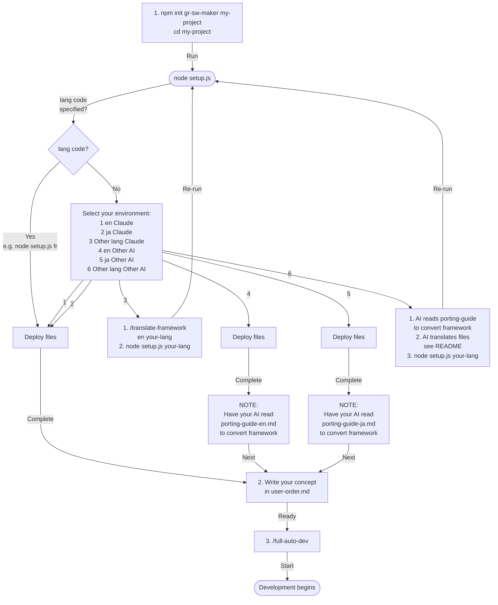

# gr-sw-maker — ほぼ全自動ソフトウェア開発フレームワーク

[English](README.md)

AIコーディングエージェントのマルチエージェント機能を活用して、ソフトウェア開発プロセスを**ほぼ全自動化**するフレームワークです。

**ユーザーがやること:** コンセプトを書く → 重要判断に答える → 受入テストする。それだけ。

---

## クイックスタート

> 全体の流れは[セットアップフロー](#セットアップフロー)を参照。

### 1. 入手

```bash
# npm から（推奨）
npm init gr-sw-maker my-project
cd my-project

# または GitHub から
git clone https://github.com/GoodRelax/gr-sw-maker.git my-project
cd my-project
```

### 2. 言語を選ぶ

```bash
node setup.js
```

メニューから言語を選択してください。他の言語を使いたい場合は[言語の選択](#言語の選択)を参照。

### 3. AIプラットフォームを選ぶ（Claude Code ならスキップ）

Claude Code 以外の AI を使う場合、[移植ガイド](process-rules/porting-guide-ja.md)を AI に読ませて自動変換を指示してください。

> 詳細は[AIプラットフォームの切り替え](#aiプラットフォームの切り替え)を参照。

### 4. 作りたいものを書く

`user-order.md` に3つの質問に答えるだけ:

```markdown
## 何を作りたい？
チームのタスクを管理できるWebアプリ。タスクの作成・担当者割当・期限設定ができて、
ダッシュボードで進捗が見えるようにしたい。

## それはどうして？
チームの作業が属人化しており、誰が何をしているかわからない。
Excelでの管理が限界。

## その他の希望
Webで使いたい。スマホからも確認できるとうれしい。
```

### 5. 起動

```
/full-auto-dev
```

AI がプロジェクト構成（`CLAUDE.md`）を自動生成し、あなたに確認を求めます。承認すれば、仕様書作成 → 設計 → 実装 → テスト → 納品まで自動で進行します。

---

## 開発の流れ

起動後、AI は以下の8フェーズを自動で進行します:

| # | フェーズ | AI がやること | ユーザーがやること |
|:-:|---------|-------------|-----------------|
| 1 | setup | プロジェクト構成（CLAUDE.md）を生成 | 確認・承認 |
| 2 | planning | 仕様書を作成、構造化インタビュー | 質問に答える、仕様書を承認 |
| 3 | dependency-selection | 外部依存（HW/AI/フレームワーク等）を提案 | 選定を承認 |
| 4 | design | アーキテクチャ設計、API設計、セキュリティ設計 | — |
| 5 | implementation | コード実装、単体テスト | — |
| 6 | testing | 結合テスト、E2Eテスト、性能テスト | — |
| 7 | delivery | マニュアル作成、IaC適用 | IaC承認、受入テスト |
| 8 | operation | インシデント対応（条件付き） | — |

各フェーズの境界で品質ゲート（AI レビュー）を通過しないと次に進めません。問題があれば AI が自動修正します。

---

## AIプラットフォーム対応

デフォルトは **Claude Code** 向けですが、他の AI コーディングエージェントにも移植可能です。

| 対応状況 | プラットフォーム |
|---------|----------------|
| そのまま使用可 | Claude Code |
| 移植ガイドあり | OpenAI Codex CLI, Gemini CLI, Cursor, Windsurf, Cline, Roo Code, Aider |

### AIプラットフォームの切り替え

対象 AI で [`process-rules/porting-guide-ja.md`](process-rules/porting-guide-ja.md) を読み込み、自動変換を指示してください。

- ファイルの約70%はポータブル — 変更不要
- 約15%は一括置換（ベンダー名・モデル名・パス）
- 約15%はフォーマット変換（YAML フロントマターのみ — プロンプト本文は流用可能）

**この変換ができない AI に本フレームワークを使う能力はありません。**

> 言語選択とプラットフォーム変換の両方が必要な場合は、**言語選択 → プラットフォーム変換** の順で実行してください。

---

## 言語の選択

### 日本語 / 英語で使う場合

セットアップスクリプトを実行してメニューから選択するだけです:

```bash
node setup.js
```

エージェント定義とコマンドが自動でデプロイされます。

### 他の言語で使う場合

1. AI に翻訳を指示:

```
/translate-framework ja fr
```

2. 翻訳されたファイルをデプロイ:

```bash
node setup.js fr
```

翻訳ルール（何を翻訳し、何を英語のまま残すか）はコマンド内に定義済みです。

---

## ドキュメント

| 文書 | 内容 |
|------|------|
| [プロセス規則](process-rules/full-auto-dev-process-rules-ja.md) | フェーズ定義、エージェント、品質ゲート |
| [文書管理規則](process-rules/full-auto-dev-document-rules-ja.md) | 命名、ブロック構造、バージョニング |
| [エージェント一覧](process-rules/agent-list-ja.md) | 全エージェントの名簿、オーナーシップ、データフロー |
| [移植ガイド](process-rules/porting-guide-ja.md) | 他 AI プラットフォームへの変換仕様 |
| [用語集](process-rules/glossary-ja.md) | フレームワーク用語の定義と選定理由 |
| [論文](essays/) | ANMS / ANPS / ANGS 三段階仕様体系の設計根拠 |

---

## セットアップフロー



---

## ライセンス

© 2026 GoodRelax. MIT License. [LICENSE](LICENSE) を参照。
