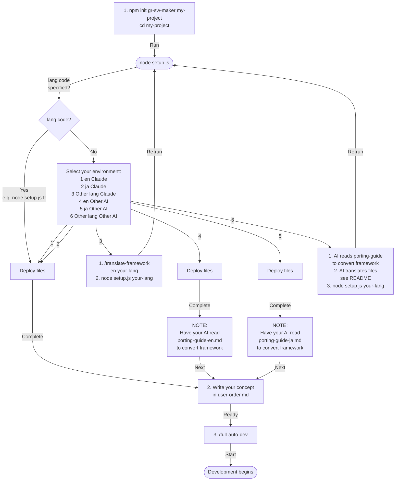

# gr-sw-maker — Nearly Fully Automated Software Development Framework

[Japanese Version](README-ja.md)

A framework that **nearly fully automates** the software development process using AI coding agent multi-agent capabilities.

**What you do:** Write a concept → Answer key decisions → Accept the deliverables. That's it.

---

## Quick Start

> See [Setup Flow](#setup-flow) for the full picture.

### 1. Get it

```bash
# From npm (recommended)
npm init gr-sw-maker my-project
cd my-project

# Or from GitHub
git clone https://github.com/GoodRelax/gr-sw-maker.git my-project
cd my-project
```

### 2. Choose a language

```bash
node setup.js
```

Select your language from the menu. For other languages, see [Language Selection](#language-selection).

### 3. Choose an AI platform (skip for Claude Code)

If using an AI other than Claude Code, have your AI read the [Porting Guide](process-rules/porting-guide-en.md) and auto-convert.

> See [Switching AI Platform](#switching-ai-platform) for details.

### 4. Describe what you want to build

Answer three questions in `user-order.md`:

```markdown
## What do you want to build?

A web app for managing team tasks — create tasks, assign members, set deadlines,
and view progress on a dashboard.

## Why?

Work is siloed across individuals and no one knows who is doing what.
Excel-based tracking has hit its limits.

## Other preferences

Web-based. Mobile-friendly would be nice.
```

### 5. Launch

```
/full-auto-dev
```

The AI auto-generates the project configuration (`CLAUDE.md`), then asks for your review. Once approved, it proceeds through spec writing → design → implementation → testing → delivery automatically.

---

## Development Flow

After launch, the AI progresses through 8 phases automatically:

|  #  | Phase                | What the AI does                                 | What you do                     |
| :-: | -------------------- | ------------------------------------------------ | ------------------------------- |
|  1  | setup                | Generate project configuration (CLAUDE.md)       | Review & approve                |
|  2  | planning             | Write specs, conduct structured interviews       | Answer questions, approve specs |
|  3  | dependency-selection | Propose external dependencies (HW/AI/frameworks) | Approve selections              |
|  4  | design               | Architecture design, API design, security design | —                               |
|  5  | implementation       | Code implementation, unit tests                  | —                               |
|  6  | testing              | Integration tests, E2E tests, performance tests  | —                               |
|  7  | delivery             | User manual, IaC deployment                      | Approve IaC, acceptance testing |
|  8  | operation            | Incident response (conditional)                  | —                               |

Quality gates (AI reviews) must pass at each phase boundary before proceeding. Issues are auto-fixed by the AI.

---

## AI Platform Support

Default target is **Claude Code**, but the framework is portable to other AI coding agents.

| Status                  | Platform                                                               |
| ----------------------- | ---------------------------------------------------------------------- |
| Ready to use            | Claude Code                                                            |
| Porting guide available | OpenAI Codex CLI, Gemini CLI, Cursor, Windsurf, Cline, Roo Code, Aider |

### Switching AI Platform

Have your AI read [`process-rules/porting-guide-en.md`](process-rules/porting-guide-en.md) and auto-convert.

- ~70% of files are portable — no changes needed
- ~15% require find-and-replace (vendor names, model names, paths)
- ~15% require format conversion (YAML frontmatter only — prompt body is reusable)

**If your AI can't handle this conversion, it can't handle this framework.**

> If you need both language selection and platform conversion, run **language selection → platform conversion** in that order.

---

## Language Selection

### English / Japanese

Just run the setup script and select from the menu:

```bash
node setup.js
```

Agent definitions and commands are deployed automatically.

### Other languages

1. Have the AI translate:

```
/translate-framework en fr
```

2. Deploy the translated files:

```bash
node setup.js fr
```

Translation rules (what to translate and what to keep in English) are defined in the command.

---

## Documentation

| Document                                                           | Contents                                                           |
| ------------------------------------------------------------------ | ------------------------------------------------------------------ |
| [Process Rules](process-rules/full-auto-dev-process-rules-en.md)   | Phase definitions, agents, quality gates                           |
| [Document Rules](process-rules/full-auto-dev-document-rules-en.md) | Naming, block structure, versioning                                |
| [Agent List](process-rules/agent-list-en.md)                       | All agents, ownership, data flow                                   |
| [Porting Guide](process-rules/porting-guide-en.md)                 | Conversion specs for other AI platforms                            |
| [Glossary](process-rules/glossary-en.md)                           | Term definitions and rationale                                     |
| [Essays](essays/)                                                  | Design rationale for the ANMS / ANPS / ANGS three-tier spec system |

---

## Setup Flow



---

## License

© 2026 GoodRelax. MIT License. See [LICENSE](LICENSE).
