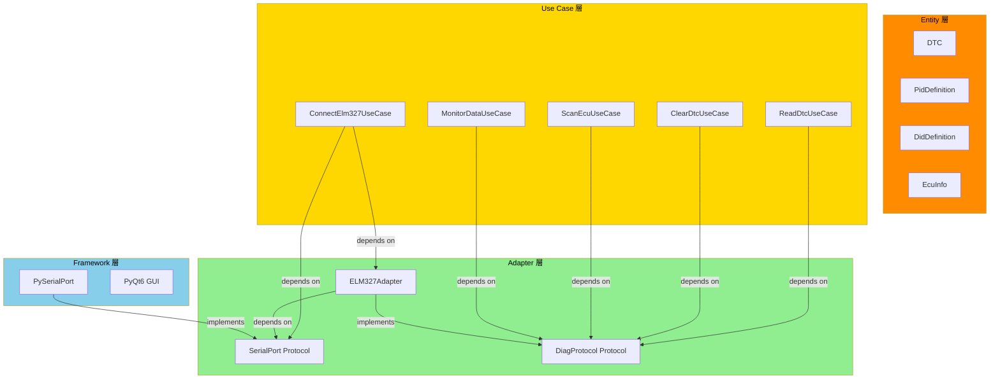
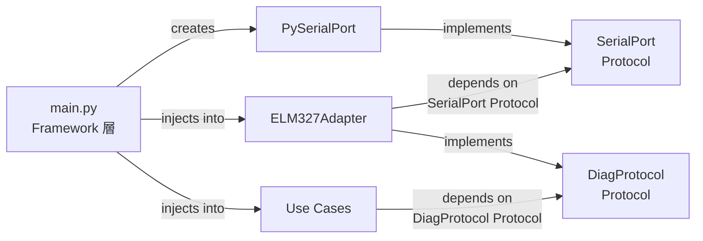

# ELM327 HW 連携 要求仕様

<!-- ============================================================
     COMMON BLOCK | DO NOT MODIFY STRUCTURE OR FIELD NAMES
     ============================================================ -->

## Identification

<!-- FIELD: schema_version | type: string | required: true -->

<doc:schema_version>0.0</doc:schema_version>

<!-- FIELD: file_type | type: enum | required: true -->

<doc:file_type>hw-requirement-spec</doc:file_type>

<!-- FIELD: form_block_cardinality | type: enum | values: single,multiple | required: true -->

<doc:form_block_cardinality>single</doc:form_block_cardinality>

<!-- FIELD: language | type: string (ISO 639-1) | required: true -->

<doc:language>ja</doc:language>

## Document State

<!-- FIELD: document_status | type: enum | values: draft,review,approved,archived | required: true -->

<doc:document_status>draft</doc:document_status>

## Workflow

<!-- FIELD: owner | type: string | required: true -->

<doc:owner>architect</doc:owner>

<!-- FIELD: commissioned_by | type: string | required: true -->
<!-- Trigger for this document's creation: user, orchestrator, phase-{name}, or {agent-name} -->

<doc:commissioned_by>orchestrator</doc:commissioned_by>

<!-- FIELD: consumed_by | type: string | required: true -->
<!-- Which agent will use this document next -->

<doc:consumed_by>implementer</doc:consumed_by>

## Context

<!-- FIELD: project | type: string | required: true -->

<doc:project>car-diag</doc:project>

<!-- FIELD: purpose | type: string | required: true -->
<!-- Tell the agent WHY this file exists and what action is expected -->

<doc:purpose>
ELM327 Bluetooth ドングルとの HW 連携要求を定義する。implementer が Adapter 層を実装する際の入力仕様として使用する。pyserial によるシリアル通信の抽象インターフェースを DIP に基づいて設計し、通信プロトコル（Legacy OBD / UDS / KWP2000）を統一的に扱えるようにする。
</doc:purpose>

<!-- FIELD: summary | type: string | required: true -->

<doc:summary>
ELM327 の物理接続要件、AT コマンド体系、マルチプロトコル対応要件、Adapter 層の抽象インターフェース設計、通信断ハンドリング要件を定義する。
</doc:summary>

## References

<!-- FIELD: related_docs | type: list | required: false -->

<doc:related_docs>
<doc:input>docs/spec/car-diag-spec.md</doc:input>
</doc:related_docs>

## Provenance

<!-- FIELD: created_by | type: string | required: true -->

<doc:created_by>architect</doc:created_by>

<!-- FIELD: created_at | type: datetime | required: true -->

<doc:created_at>2026-03-21T00:00:00Z</doc:created_at>

<!-- ============================================================
     FORM BLOCK | hw-requirement-spec
     ============================================================ -->

<!-- FIELD: hw-requirement-spec:device_type | type: string | required: true -->

<hw-requirement-spec:device_type>OBD-II diagnostic interpreter IC</hw-requirement-spec:device_type>

<!-- FIELD: hw-requirement-spec:interface_count | type: int | required: true -->

<hw-requirement-spec:interface_count>3</hw-requirement-spec:interface_count>

<!-- FIELD: hw-requirement-spec:interface_protocol | type: string | required: true -->

<hw-requirement-spec:interface_protocol>Bluetooth SPP (Serial Port Profile), UART, AT command</hw-requirement-spec:interface_protocol>

<!-- FIELD: hw-requirement-spec:safety_relevant | type: boolean | required: true -->

<hw-requirement-spec:safety_relevant>false</hw-requirement-spec:safety_relevant>

---

<!-- ============================================================
     DETAIL BLOCK
     ============================================================ -->

## 1. 目的

本文書は ELM327 チップ搭載の Bluetooth OBD-II ドングルと car-diag アプリケーション間の HW 連携要求を定義する。

対象デバイス: ELM327 v1.5 互換チップ（Bluetooth SPP 接続）

トレース元: FR-01（ELM327 接続管理）、FR-09（接続状態管理 FSA）、NFR-05a（シリアル通信レイヤー抽象化）

---

## 2. 物理接続要件

### 2.1 接続方式

| 項目 | 仕様 |
|------|------|
| 物理接続 | Bluetooth SPP（Serial Port Profile） |
| OS 認識 | Windows 仮想 COM ポート |
| ペアリング | Windows Bluetooth 設定で事前に実施（LIM-03） |
| ボーレート | 38400 bps（ELM327 デフォルト） |
| データビット | 8 |
| パリティ | なし |
| ストップビット | 1 |
| フロー制御 | なし |
| 文字エンコーディング | ASCII |

### 2.2 通信タイミング

| 項目 | 値 | 根拠 |
|------|-----|------|
| コマンド送信後の応答タイムアウト | 5000 ms | ELM327 のプロトコル自動検出（ATSP0）は最大 5 秒 |
| 接続確立タイムアウト | 10000 ms | NFR-01a |
| コマンド間のインターバル | 50 ms | ELM327 の内部バッファ処理時間 |
| 応答終端文字 | `>` (0x3E) | ELM327 プロンプト文字。コマンド応答の終わりを示す |
| 改行コード（送信） | `\r` (0x0D) | ELM327 はキャリッジリターンでコマンドを受理する |

### 2.3 COM ポート検出

- HWR-01: The System shall `serial.tools.list_ports.comports()` を使用して利用可能な COM ポートの一覧を取得する. (traces: FR-01a)
- HWR-02: The System shall 各 COM ポートの description と hwid を取得し、ユーザーに表示する. (traces: FR-01a)

---

## 3. AT コマンド体系

### 3.1 初期化シーケンス

ELM327 接続確立時に以下の AT コマンドを順次送信する（FR-01b）。

| 順序 | コマンド | 目的 | 期待応答 | failure 時の対応 |
|:----:|---------|------|---------|------------------|
| 1 | `ATZ` | ELM327 リセット | `ELM327 v*.*` | S_ERROR に遷移。「ELM327 が応答しません」を表示 |
| 2 | `ATE0` | エコー無効化 | `OK` | リトライ 3 回。failure で S_ERROR |
| 3 | `ATL0` | 改行コード無効化 | `OK` | リトライ 3 回。failure で S_ERROR |
| 4 | `ATS1` | スペース有効化（応答の可読性向上） | `OK` | リトライ 3 回。failure で S_ERROR |
| 5 | `ATH1` | ヘッダ表示有効化（CAN ID / ECU アドレス識別） | `OK` | リトライ 3 回。failure で S_ERROR |
| 6 | `ATSP0` | プロトコル自動検出 | `OK` | リトライ 3 回。failure で S_ERROR |

- HWR-03: The System shall 初期化シーケンスの各コマンドを上記順序で逐次送信し、各応答を検証する. (traces: FR-01b)
- HWR-04: If ATZ の応答に `ELM327` 文字列が含まれない場合, then the System shall 接続を中断し S_ERROR に遷移する. (traces: FR-01b, FR-09)
- HWR-05: The System shall 初期化シーケンスの完了を 10 秒以内に行う. (traces: NFR-01a)

### 3.2 プロトコル切替コマンド

ECU スキャン時およびマルチプロトコル DTC 読取時に使用する。

| コマンド | 目的 | 使用タイミング |
|---------|------|---------------|
| `ATSP6` | DoCAN 11bit 500k に切替 | Legacy OBD / UDS over CAN（500k） |
| `ATSP7` | DoCAN 29bit 500k に切替 | Legacy OBD 29bit |
| `ATSP8` | DoCAN 11bit 250k に切替 | Legacy OBD / UDS over CAN（250k） |
| `ATSP9` | DoCAN 29bit 250k に切替 | Legacy OBD 29bit（250k） |
| `ATSP4` | KWP2000 (5-baud init) に切替 | KWP2000 ECU アクセス |
| `ATSP5` | KWP2000 (fast init) に切替 | KWP2000 ECU アクセス |
| `ATSP0` | プロトコル自動検出に復帰 | スキャン後の復帰 |

- HWR-06: The System shall プロトコル切替時に `ATSP{n}` を送信し、`OK` 応答を確認してから診断コマンドを送信する. (traces: FR-02f, CON-06)
- HWR-07: The System shall プロトコル切替完了後に 200 ms のウェイトを挿入する. (traces: CON-06)

### 3.3 ヘッダ設定コマンド

UDS ECU への個別アクセスに使用する。

| コマンド | 目的 | 例 |
|---------|------|-----|
| `ATSH {CAN_ID}` | 送信 CAN ID の設定 | `ATSH 7E0`（ECU #0 への送信） |
| `ATCRA {CAN_ID}` | 受信フィルタの設定 | `ATCRA 7E8`（ECU #0 からの応答のみ受信） |
| `ATAR` | 受信フィルタを自動に戻す | スキャン後の復帰 |

- HWR-08: The System shall UDS ECU への個別アクセス時に `ATSH` と `ATCRA` で送受信 CAN ID を設定する. (traces: FR-06a)
- HWR-09: The System shall ECU スキャン完了後に `ATAR` で受信フィルタを自動に戻す. (traces: FR-06a)

### 3.4 その他のユーティリティコマンド

| コマンド | 目的 | 使用タイミング |
|---------|------|---------------|
| `ATDPN` | 現在のプロトコル番号を取得 | プロトコル確認 |
| `ATRV` | バッテリ電圧を取得 | ダッシュボード表示（任意） |
| `ATAT1` | アダプティブタイミング有効化（デフォルト） | 応答待ち時間の最適化 |
| `ATST {hex}` | タイムアウト設定（単位: 4ms） | KWP2000 の遅い応答対応 |

- HWR-10: The System shall KWP2000 プロトコル使用時に `ATST FF`（約 1 秒）を設定し、K-Line の遅い応答に対応する. (traces: CON-03)

---

## 4. マルチプロトコル対応要件

### 4.1 Legacy OBD-II（SAE J1979 / DoCAN）

| 機能 | コマンド（ELM327 送信文字列） | 応答フォーマット |
|------|------------------------------|-----------------|
| PID 対応検出 | `0100`, `0120`, `0140`, `0160` | `41 00 {4バイトビットマスク}` |
| PID 読取 | `01{PID:2桁hex}` | `41 {PID} {データバイト...}` |
| DTC 読取（stored） | `03` | `43 {DTCカウント} {P/C/B/U}{4桁hex} ...` |
| DTC 読取（pending） | `07` | `47 {DTCカウント} {DTC...}` |
| DTC 消去 | `04` | `44` |
| VIN 取得 | `0902` | `49 02 {VIN ASCII}` |

- HWR-11: The System shall Legacy OBD の応答パース時に先頭のサービス応答バイト（`41`, `43`, `47`, `44`, `49`）を検証する. (traces: NFR-04a)
- HWR-12: The System shall PID 対応ビットマスクをデコードし、対応 PID のリストを構築する. (traces: FR-01c)

### 4.2 UDS（ISO 14229 / DoCAN）

UDS は CAN 上で Legacy OBD と物理層を共有する。`ATSH` による送信ヘッダ切替で ECU を選択する。

| 機能 | リクエスト（hex） | 応答（hex） |
|------|------------------|------------|
| TesterPresent | `3E 00` | `7E 00` |
| DiagnosticSessionControl（拡張） | `10 03` | `50 03 ...` |
| ReadDataByIdentifier | `22 {DID_H} {DID_L}` | `62 {DID_H} {DID_L} {データ...}` |
| ReadDTCInformation（全 DTC） | `19 02 FF` | `59 02 {DTC 3バイト} {Status 1バイト} ...` |
| ClearDiagnosticInformation（全グループ） | `14 FF FF FF` | `54` |

- HWR-13: The System shall UDS の Negative Response（`7F {SID} {NRC}`）をパースし、NRC に応じたエラーメッセージを生成する. (traces: FR-03d)
- HWR-14: The System shall UDS DTC フォーマット（3バイト DTC + 1バイト StatusOfDTC）をパースする. (traces: CON-08)
- HWR-15: The System shall UDS の応答が `7F {SID} 78`（responsePending）の場合、追加の応答を待機する. (traces: NFR-02a)

### 4.3 KWP2000（ISO 14230 / K-Line）

KWP2000 は K-Line 物理層で動作し、CAN とは独立したプロトコルである。

| 機能 | リクエスト（hex） | 応答（hex） |
|------|------------------|------------|
| StartCommunication | `81` | `C1 {KB1} {KB2}` |
| StopCommunication | `82` | `C2` |
| ReadDataByLocalIdentifier | `21 {LocalID}` | `61 {LocalID} {データ...}` |
| ReadDTCByStatus | `18 {StatusMask} {GroupH} {GroupL}` | `58 {DTCカウント} {DTC 2バイト} {Status} ...` |
| ReadDTCByIdentifier（フォールバック） | `13 {DTC_H} {DTC_L}` | `53 {DTC_H} {DTC_L} {Status} {追加情報...}` |
| ClearDiagnosticInformation | `14 FF 00` | `54` |

- HWR-16: The System shall KWP2000 ECU との通信開始時に StartCommunication（`81`）を送信し、応答のキーバイト（KB1, KB2）を検証する. (traces: FR-06b)
- HWR-17: The System shall KWP2000 の DTC 読取で SID `$18` に NRC が返った場合、SID `$13` にフォールバックする. (traces: FR-02a)
- HWR-18: The System shall KWP2000 DTC フォーマット（2バイト DTC + 1バイト Status）をパースする. (traces: CON-08)

### 4.4 応答パース共通規則

- HWR-19: The System shall ELM327 応答から空白・改行・プロンプト文字（`>`）を除去してからパースする. (traces: NFR-04a)
- HWR-20: The System shall ELM327 のエラー応答（`NO DATA`, `UNABLE TO CONNECT`, `CAN ERROR`, `BUS INIT: ...ERROR`, `?`）を検出し、適切なエラー状態に遷移する. (traces: FR-01e, FR-09)
- HWR-21: The System shall 応答バイト列が期待長より短い場合、パースを中断しエラーとして処理する. (traces: NFR-04a)

---

## 5. 通信断ハンドリング要件

FR-09（接続状態管理 FSA）に基づき、全状態からの通信断を安全にハンドリングする。

### 5.1 通信断の検出

| 検出方法 | 検出対象 | 実装手段 |
|---------|---------|---------|
| 応答タイムアウト | ELM327 応答なし | pyserial の `timeout` パラメータ |
| シリアルポートエラー | Bluetooth 切断・COM ポート消失 | `serial.SerialException` の捕捉 |
| 不正応答 | ELM327 ハングアップ | 応答バリデーション failure |

- HWR-22: The System shall シリアル通信の全ての read/write 操作を try-except で囲み、`serial.SerialException` を捕捉する. (traces: FR-09a)
- HWR-23: The System shall 通信断検出時に以下の順序で安全な中断を実行する: (traces: FR-09a)
  1. 進行中のコマンド送信を中止する
  2. DID スキャン中の場合、中断位置をキャッシュファイルに保存する（FR-08e）
  3. データ記録中の場合、TSV ファイルをフラッシュして閉じる（FR-05 データ損失防止）
  4. FSA を S_DISCONNECTED に遷移する
  5. ステータスバーに「接続が切断されました -- ELM327 を確認してください」と表示する

### 5.2 リトライ方針

- HWR-24: The System shall 通信エラー発生時に最大 3 回リトライする. (traces: NFR-02a)
- HWR-25: The System shall リトライ間隔を 500 ms とする.
- HWR-26: If 3 回のリトライが全て failure した場合, then the System shall 通信断として扱い、S_DISCONNECTED に遷移する. (traces: FR-09a)

### 5.3 再接続

- HWR-27: When ユーザーが切断後に再接続を実行した時, the System shall 初期化シーケンス（HWR-03）を再実行する. (traces: FR-09e)
- HWR-28: When 再接続が成功した時, the System shall 前回のスキャンキャッシュが存在すれば自動的に読み込む. (traces: FR-09e, FR-07b)

---

## 6. Adapter 層 I/F 設計（DIP に基づく抽象化）

NFR-05a（Clean Architecture / DIP）に基づき、シリアル通信レイヤーとプロトコルレイヤーを抽象化する。

### 6.1 レイヤー構成

**レイヤー構成図:**



### 6.2 SerialPort 抽象インターフェース

pyserial の具体実装から分離した抽象インターフェース。Use Case 層とAdapter 層はこのインターフェースにのみ依存する。

**SerialPort Protocol 定義:**

```python
"""SerialPort 抽象インターフェース.

pyserial の具体実装から分離し、DIP を実現する。
テスト時にはモックに差し替え可能。

traces: NFR-05a
"""

from __future__ import annotations

from typing import Protocol, runtime_checkable


@runtime_checkable
class SerialPort(Protocol):
    """シリアルポートの抽象インターフェース.

    ELM327 との物理通信を抽象化する。
    実装クラス: PySerialPort（Framework 層）
    テスト用: MockSerialPort（tests/ 配下）
    """

    @property
    def is_open(self) -> bool:
        """ポートが開いているかを返す."""
        ...

    def open(self, port_name: str, baudrate: int = 38400, timeout: float = 5.0) -> None:
        """シリアルポートを開く.

        Args:
            port_name: COM ポート名（例: "COM3"）
            baudrate: ボーレート（デフォルト: 38400）
            timeout: 読取タイムアウト秒数（デフォルト: 5.0）

        Raises:
            ConnectionError: ポートが開けない場合
        """
        ...

    def close(self) -> None:
        """シリアルポートを閉じる.

        既に閉じている場合は何もしない（冪等）。
        """
        ...

    def write(self, command: str) -> None:
        r"""コマンド文字列を送信する.

        末尾に \\r を自動付加する。

        Args:
            command: 送信する AT コマンドまたは OBD コマンド

        Raises:
            ConnectionError: 送信に failure した場合
        """
        ...

    def read_until_prompt(self) -> str:
        """ELM327 のプロンプト文字 '>' まで読み取る.

        Returns:
            プロンプト文字を除いた応答文字列

        Raises:
            TimeoutError: タイムアウトした場合
            ConnectionError: 通信断が発生した場合
        """
        ...
```

**PySerialPort 具体実装（Framework 層）の I/F:**

```python
"""PySerialPort: pyserial を使用した SerialPort の具体実装.

Framework 層に配置する。SerialPort Protocol を実装する。

traces: NFR-05a
"""

from __future__ import annotations

import serial
import serial.tools.list_ports


class PySerialPort:
    """pyserial を使用したシリアルポート実装.

    Attributes:
        _serial: pyserial の Serial インスタンス
    """

    def __init__(self) -> None:
        """PySerialPort を初期化する."""
        self._serial: serial.Serial | None = None

    @property
    def is_open(self) -> bool:
        """ポートが開いているかを返す."""
        return self._serial is not None and self._serial.is_open

    def open(self, port_name: str, baudrate: int = 38400, timeout: float = 5.0) -> None:
        """シリアルポートを開く.

        Args:
            port_name: COM ポート名（例: "COM3"）
            baudrate: ボーレート（デフォルト: 38400）
            timeout: 読取タイムアウト秒数（デフォルト: 5.0）

        Raises:
            ConnectionError: ポートが開けない場合
        """
        try:
            self._serial = serial.Serial(
                port=port_name,
                baudrate=baudrate,
                bytesize=serial.EIGHTBITS,
                parity=serial.PARITY_NONE,
                stopbits=serial.STOPBITS_ONE,
                timeout=timeout,
            )
        except serial.SerialException as serial_error:
            raise ConnectionError(
                f"COM ポート '{port_name}' を開けません: {serial_error}"
            ) from serial_error

    def close(self) -> None:
        """シリアルポートを閉じる（冪等）."""
        if self._serial is not None and self._serial.is_open:
            self._serial.close()
        self._serial = None

    def write(self, command: str) -> None:
        r"""コマンド文字列を送信する（末尾に \\r を自動付加）.

        Args:
            command: 送信する AT コマンドまたは OBD コマンド

        Raises:
            ConnectionError: 送信に failure した場合
        """
        if self._serial is None or not self._serial.is_open:
            raise ConnectionError("シリアルポートが開いていません")
        try:
            self._serial.write(f"{command}\r".encode("ascii"))
        except serial.SerialException as serial_error:
            raise ConnectionError(
                f"コマンド送信に failure しました: {serial_error}"
            ) from serial_error

    def read_until_prompt(self) -> str:
        """ELM327 のプロンプト文字 '>' まで読み取る.

        Returns:
            プロンプト文字を除いた応答文字列

        Raises:
            TimeoutError: タイムアウトした場合
            ConnectionError: 通信断が発生した場合
        """
        if self._serial is None or not self._serial.is_open:
            raise ConnectionError("シリアルポートが開いていません")
        try:
            response_bytes = self._serial.read_until(b">")
            if not response_bytes:
                raise TimeoutError("ELM327 応答タイムアウト")
            if not response_bytes.endswith(b">"):
                raise TimeoutError("ELM327 応答タイムアウト（プロンプト未受信）")
            return response_bytes.decode("ascii").rstrip(">").strip()
        except serial.SerialException as serial_error:
            raise ConnectionError(
                f"読取中に通信断が発生しました: {serial_error}"
            ) from serial_error

    @staticmethod
    def list_available_ports() -> list[dict[str, str]]:
        """利用可能な COM ポートの一覧を取得する.

        Returns:
            COM ポート情報のリスト。各要素は
            {"port_name": "COM3", "description": "...", "hwid": "..."} の形式。

        traces: FR-01a, HWR-01, HWR-02
        """
        return [
            {
                "port_name": port_info.device,
                "description": port_info.description,
                "hwid": port_info.hwid,
            }
            for port_info in serial.tools.list_ports.comports()
        ]
```

### 6.3 DiagProtocol 抽象インターフェース

Legacy OBD / UDS / KWP2000 の統一インターフェース。Use Case 層はこのインターフェースにのみ依存する。

**DiagProtocol Protocol 定義:**

```python
"""DiagProtocol 抽象インターフェース.

Legacy OBD / UDS / KWP2000 の診断プロトコルを統一的に扱う。
Use Case 層はこのインターフェースにのみ依存し、
具体的なプロトコルの差異は Adapter 層の実装が吸収する。

traces: NFR-05a, FR-02, FR-03, FR-04, FR-06
"""

from __future__ import annotations

from abc import ABC, abstractmethod
from dataclasses import dataclass
from enum import Enum, auto
from typing import Protocol, runtime_checkable


class DiagProtocolType(Enum):
    """診断プロトコルの種別."""

    LEGACY_OBD = auto()
    UDS = auto()
    KWP2000 = auto()


@dataclass(frozen=True)
class DiagResponse:
    """診断コマンドの応答.

    Attributes:
        raw_bytes: 生のバイト列（hex 文字列）
        service_response_id: サービス応答 ID
        data_bytes: データ部のバイト列
        is_negative: NRC（否定応答）かどうか
        nrc_code: NRC コード（is_negative=True の場合のみ有効）
    """

    raw_bytes: str
    service_response_id: int
    data_bytes: list[int]
    is_negative: bool = False
    nrc_code: int | None = None


@dataclass(frozen=True)
class DtcEntry:
    """DTC エントリ.

    Attributes:
        dtc_code: DTC コード文字列（例: "P0300"）
        status_byte: ステータスバイト
        ecu_identifier: 検出元 ECU の識別子
        protocol_type: 検出に使用したプロトコル
    """

    dtc_code: str
    status_byte: int
    ecu_identifier: str
    protocol_type: DiagProtocolType


@dataclass(frozen=True)
class EcuInfo:
    """ECU 情報.

    Attributes:
        ecu_identifier: ECU 識別子（CAN ID または KWP アドレス）
        ecu_display_name: ECU 表示名（推定名）
        protocol_type: 使用プロトコル
        response_id: 応答 CAN ID（CAN の場合）または KWP アドレス
    """

    ecu_identifier: str
    ecu_display_name: str
    protocol_type: DiagProtocolType
    response_id: str


@dataclass(frozen=True)
class ParameterReading:
    """パラメータ読取結果.

    Attributes:
        parameter_identifier: パラメータ識別子（PID / DID / LocalID）
        raw_value: 生データ（hex 文字列）
        physical_value: 物理値（変換済み。変換式がない場合は None）
        unit: 単位（変換式がない場合は None）
        ecu_identifier: 読取元 ECU
    """

    parameter_identifier: str
    raw_value: str
    physical_value: float | None
    unit: str | None
    ecu_identifier: str


class ScanProgressCallback(Protocol):
    """スキャン進捗コールバック.

    Args:
        current_step: 現在のステップ番号
        total_steps: 全ステップ数
        current_label: 現在の操作ラベル
    """

    def __call__(
        self, current_step: int, total_steps: int, current_label: str
    ) -> None: ...


@runtime_checkable
class DiagProtocol(Protocol):
    """診断プロトコルの統一インターフェース.

    全ての診断操作はこのインターフェースを通じて行う。
    ELM327Adapter がこのインターフェースを実装する。
    """

    def scan_ecus(
        self,
        on_progress: ScanProgressCallback | None = None,
    ) -> list[EcuInfo]:
        """車両上の応答する全 ECU をスキャンする.

        CAN ID スキャン（UDS TesterPresent）と
        KWP アドレススキャン（StartCommunication）を順次実行する。

        Args:
            on_progress: 進捗コールバック（任意）

        Returns:
            検出された ECU 情報のリスト

        Raises:
            ConnectionError: 通信断が発生した場合

        traces: FR-06a, FR-06b
        """
        ...

    def read_dtcs(self, ecu: EcuInfo) -> list[DtcEntry]:
        """指定 ECU から DTC を読み取る.

        ECU のプロトコルに応じて適切な SID を使用する。
        KWP2000 の場合、SID $18 失敗時に SID $13 へフォールバックする。

        Args:
            ecu: 対象 ECU 情報

        Returns:
            DTC エントリのリスト

        Raises:
            ConnectionError: 通信断が発生した場合

        traces: FR-02a
        """
        ...

    def clear_dtcs(self, ecu: EcuInfo) -> bool:
        """指定 ECU の DTC を消去する.

        Args:
            ecu: 対象 ECU 情報

        Returns:
            True: 消去成功、False: 消去失敗（NRC 返却）

        Raises:
            ConnectionError: 通信断が発生した場合

        traces: FR-03b
        """
        ...

    def read_parameter(
        self, ecu: EcuInfo, parameter_identifier: str
    ) -> ParameterReading:
        """指定 ECU から 1 つのパラメータを読み取る.

        Args:
            ecu: 対象 ECU 情報
            parameter_identifier: パラメータ識別子（PID / DID / LocalID）

        Returns:
            パラメータ読取結果

        Raises:
            ConnectionError: 通信断が発生した場合

        traces: FR-04a
        """
        ...

    def detect_supported_pids(self) -> list[str]:
        """車両が対応する Legacy OBD PID のリストを取得する.

        PID $00/$20/$40/$60 のビットマスクをデコードする。

        Returns:
            対応 PID の識別子リスト（例: ["01", "0C", "0D", ...]）

        Raises:
            ConnectionError: 通信断が発生した場合

        traces: FR-01c
        """
        ...

    def scan_dids(
        self,
        ecu: EcuInfo,
        did_range: tuple[int, int] = (0x0000, 0xFFFF),
        on_progress: ScanProgressCallback | None = None,
    ) -> list[str]:
        """指定 ECU の対応 DID をスキャンする.

        Args:
            ecu: 対象 ECU 情報
            did_range: スキャン範囲（開始 DID, 終了 DID）
            on_progress: 進捗コールバック（任意）

        Returns:
            応答のあった DID の識別子リスト（hex 文字列）

        Raises:
            ConnectionError: 通信断が発生した場合

        traces: FR-08b, FR-08c
        """
        ...

    def switch_protocol(self, protocol_number: int) -> None:
        """ELM327 のプロトコルを切り替える.

        Args:
            protocol_number: ATSP の番号（0-9）

        Raises:
            ConnectionError: 通信断が発生した場合

        traces: HWR-06, CON-06
        """
        ...
```

### 6.4 ELM327Adapter

AT コマンドの送受信を担当する Adapter 層のクラス。DiagProtocol を実装し、SerialPort に依存する。

**ELM327Adapter の I/F:**

```python
"""ELM327Adapter: ELM327 AT コマンドの送受信を担当する Adapter.

Adapter 層に配置。DiagProtocol を実装し、SerialPort（抽象）に依存する。
プロトコル固有の差異（Legacy OBD / UDS / KWP2000）を吸収する。

traces: NFR-05a
"""

from __future__ import annotations


class ELM327Adapter:
    """ELM327 を介した診断通信の Adapter.

    DiagProtocol インターフェースを実装する。
    全ての通信は SerialPort 抽象インターフェースを通じて行い、
    pyserial への直接依存を持たない。

    Attributes:
        _serial_port: シリアルポート抽象インターフェース
        _current_protocol: 現在のプロトコル番号
        _retry_count: リトライ回数上限
        _retry_interval_ms: リトライ間隔（ミリ秒）
    """

    RETRY_COUNT: int = 3
    RETRY_INTERVAL_MS: int = 500
    PROTOCOL_SWITCH_WAIT_MS: int = 200

    def __init__(self, serial_port: SerialPort) -> None:
        """ELM327Adapter を初期化する.

        Args:
            serial_port: SerialPort の実装（DIP により注入）
        """
        ...

    def initialize(self) -> str:
        """ELM327 初期化シーケンスを実行する.

        ATZ -> ATE0 -> ATL0 -> ATS1 -> ATH1 -> ATSP0 の順に送信。

        Returns:
            ELM327 のバージョン文字列（ATZ 応答から抽出）

        Raises:
            ConnectionError: 初期化に failure した場合

        traces: FR-01b, HWR-03, HWR-04, HWR-05
        """
        ...

    def send_command(self, command: str, timeout_ms: int = 5000) -> str:
        """ELM327 にコマンドを送信し、応答を取得する.

        リトライロジックを含む。

        Args:
            command: AT コマンドまたは OBD コマンド
            timeout_ms: 応答タイムアウト（ミリ秒）

        Returns:
            ELM327 の応答文字列（クリーニング済み）

        Raises:
            ConnectionError: 通信断が発生した場合
            TimeoutError: タイムアウトした場合

        traces: HWR-24, HWR-25, HWR-26
        """
        ...

    def parse_response_bytes(self, raw_response: str) -> list[int]:
        """ELM327 応答文字列をバイト列に変換する.

        空白・改行・プロンプト文字を除去し、hex 文字列をパースする。

        Args:
            raw_response: ELM327 の生の応答文字列

        Returns:
            バイト値のリスト

        Raises:
            ValueError: パースに failure した場合

        traces: HWR-19, HWR-21
        """
        ...

    def check_elm327_error(self, response: str) -> str | None:
        """ELM327 のエラー応答を検出する.

        Args:
            response: ELM327 の応答文字列

        Returns:
            エラーメッセージ（エラーの場合）。正常なら None

        traces: HWR-20
        """
        ...

    # DiagProtocol の実装メソッド群は DiagProtocol Protocol に準拠
    # scan_ecus, read_dtcs, clear_dtcs, read_parameter,
    # detect_supported_pids, scan_dids, switch_protocol
```

### 6.5 依存関係の注入ポイント

**DI 構成図:**



- HWR-29: The System shall アプリケーションのエントリポイント（`main.py`）で依存性を注入する。Use Case 層のコンストラクタに DiagProtocol 実装を渡す. (traces: NFR-05a)
- HWR-30: The System shall テスト時に MockSerialPort を注入可能とする。ELM327 実機がなくてもテスト可能にする. (traces: NFR-05a)

---

## 7. 制約事項

| ID | 制約 | 影響 | 根拠 |
|----|------|------|------|
| HWC-01 | ELM327 のシリアル通信はシングルスレッド逐次処理 | 複数コマンドの並列送信は不可。全てキュー管理 | CON-01 |
| HWC-02 | ELM327 は一度に 1 プロトコルしか使用できない | CAN と KWP の ECU アクセスにはプロトコル切替が必要 | CON-06 |
| HWC-03 | KWP2000 は 10.4 kbaud で CAN より遅い | KWP ECU への操作はタイムアウトを延長する | CON-03 |
| HWC-04 | ELM327 クローンチップの互換性は保証しない | ATZ 応答の検証で互換性を確認する | LIM-02 |

---

## 8. 差し替え戦略

ELM327 ドングルを将来的に別のデバイスに差し替える可能性を考慮した設計方針。

- SerialPort Protocol を実装する新クラスを Framework 層に追加するだけで、USB 接続や Wi-Fi 接続のドングルに対応できる
- DiagProtocol Protocol を実装する新 Adapter を追加するだけで、ELM327 以外のインタプリタ IC（STN1110, OBDLink 等）に対応できる
- Use Case 層は一切変更不要（DIP の効果）

---

## 9. トレーサビリティマトリクス

| HW 要求 ID | 仕様書トレース先 | 分類 |
|-----------|-----------------|------|
| HWR-01 | FR-01a | COM ポート検出 |
| HWR-02 | FR-01a | COM ポート情報表示 |
| HWR-03 | FR-01b | 初期化シーケンス |
| HWR-04 | FR-01b, FR-09 | ATZ 応答検証 |
| HWR-05 | NFR-01a | 初期化タイムアウト |
| HWR-06 | FR-02f, CON-06 | プロトコル切替 |
| HWR-07 | CON-06 | プロトコル切替ウェイト |
| HWR-08 | FR-06a | UDS ヘッダ設定 |
| HWR-09 | FR-06a | 受信フィルタ復帰 |
| HWR-10 | CON-03 | KWP タイムアウト延長 |
| HWR-11 | NFR-04a | Legacy OBD 応答バリデーション |
| HWR-12 | FR-01c | PID ビットマスクデコード |
| HWR-13 | FR-03d | UDS NRC パース |
| HWR-14 | CON-08 | UDS DTC フォーマットパース |
| HWR-15 | NFR-02a | UDS responsePending 対応 |
| HWR-16 | FR-06b | KWP StartCommunication |
| HWR-17 | FR-02a | KWP DTC 読取フォールバック |
| HWR-18 | CON-08 | KWP DTC フォーマットパース |
| HWR-19 | NFR-04a | 応答クリーニング |
| HWR-20 | FR-01e, FR-09 | ELM327 エラー検出 |
| HWR-21 | NFR-04a | 応答長バリデーション |
| HWR-22 | FR-09a | 例外捕捉 |
| HWR-23 | FR-09a | 安全な中断手順 |
| HWR-24 | NFR-02a | リトライ回数 |
| HWR-25 | — | リトライ間隔 |
| HWR-26 | FR-09a | リトライ exhaustion |
| HWR-27 | FR-09e | 再接続 |
| HWR-28 | FR-09e, FR-07b | キャッシュ自動読込 |
| HWR-29 | NFR-05a | DI エントリポイント |
| HWR-30 | NFR-05a | テスト用モック注入 |

---

<!-- ============================================================
     FOOTER | append change_log entry on every write
     ============================================================ -->

## Last Updated

<!-- FIELD: updated_by | type: string | required: true -->

<doc:updated_by>architect</doc:updated_by>

<!-- FIELD: updated_at | type: datetime | required: true -->

<doc:updated_at>2026-03-21T00:00:00Z</doc:updated_at>

## Change Log

<!-- FIELD: change_log | type: list | append-only | DO NOT MODIFY OR DELETE EXISTING ENTRIES -->

<doc:change_log>
<entry at="2026-03-21T00:00:00Z" by="architect" action="created" />
</doc:change_log>
