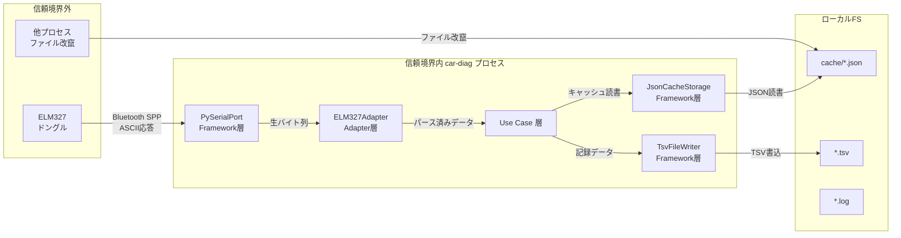

# car-diag セキュリティ設計

<!-- ============================================================
     COMMON BLOCK | DO NOT MODIFY STRUCTURE OR FIELD NAMES
     ============================================================ -->

## Identification

<!-- FIELD: schema_version | type: string | required: true -->

<doc:schema_version>0.0</doc:schema_version>

<!-- FIELD: file_type | type: enum | required: true -->

<doc:file_type>security-architecture</doc:file_type>

<!-- FIELD: form_block_cardinality | type: enum | values: single,multiple | required: true -->

<doc:form_block_cardinality>single</doc:form_block_cardinality>

<!-- FIELD: language | type: string (ISO 639-1) | required: true -->

<doc:language>ja</doc:language>

## Document State

<!-- FIELD: document_status | type: enum | values: draft,review,approved,archived | required: true -->

<doc:document_status>draft</doc:document_status>

## Workflow

<!-- FIELD: owner | type: string | required: true -->

<doc:owner>security-reviewer</doc:owner>

<!-- FIELD: commissioned_by | type: string | required: true -->
<!-- Trigger for this document's creation: user, orchestrator, phase-{name}, or {agent-name} -->

<doc:commissioned_by>user</doc:commissioned_by>

<!-- FIELD: consumed_by | type: string | required: true -->
<!-- Which agent will use this document next -->

<doc:consumed_by>implementer</doc:consumed_by>

## Context

<!-- FIELD: project | type: string | required: true -->

<doc:project>car-diag</doc:project>

<!-- FIELD: purpose | type: string | required: true -->
<!-- Tell the agent WHY this file exists and what action is expected -->

<doc:purpose>
car-diag アプリケーションのセキュリティ設計を定義する。脅威モデリング（STRIDE）、入力バリデーション設計、ファイルシステムセキュリティ、依存関係セキュリティ、対策一覧を含む。本文書は threat-model と security-architecture の内容を統合したものである。implementer はこの設計に従い、セキュリティ対策を実装すること。
</doc:purpose>

<!-- FIELD: summary | type: string | required: true -->

<doc:summary>
ELM327 Bluetooth シリアル通信、キャッシュファイル（JSON）、TSVデータ記録ファイルを攻撃面として STRIDE 分析を実施。デスクトップアプリのためネットワーク攻撃面はなし。入力バリデーション、ファイルパーミッション、依存関係管理の設計を定義する。
</doc:summary>

## References

<!-- FIELD: related_docs | type: list | required: false -->

<doc:related_docs>
<doc:input>docs/spec/car-diag-spec.md</doc:input>
<doc:input>docs/hw-requirement-spec.md</doc:input>
<doc:input>CLAUDE.md</doc:input>
</doc:related_docs>

## Provenance

<!-- FIELD: created_by | type: string | required: true -->

<doc:created_by>security-reviewer</doc:created_by>

<!-- FIELD: created_at | type: datetime | required: true -->

<doc:created_at>2026-03-21T00:00:00Z</doc:created_at>

<!-- ============================================================
     FORM BLOCK | security-architecture
     ============================================================ -->

<!-- FIELD: security-architecture:owasp_coverage | type: string | required: true -->

<security-architecture:owasp_coverage>4/10</security-architecture:owasp_coverage>

<!-- FIELD: security-architecture:auth_method | type: string | required: true -->

<security-architecture:auth_method>N/A（ローカルデスクトップアプリ。認証不要）</security-architecture:auth_method>

<!-- FIELD: security-architecture:encryption_at_rest | type: boolean | required: true -->

<security-architecture:encryption_at_rest>false</security-architecture:encryption_at_rest>

<!-- FIELD: security-architecture:encryption_in_transit | type: boolean | required: true -->

<security-architecture:encryption_in_transit>false</security-architecture:encryption_in_transit>

<!-- ============================================================
     FORM BLOCK | threat-model (統合)
     ============================================================ -->

<!-- FIELD: threat-model:methodology | type: enum | required: true -->

<threat-model:methodology>STRIDE</threat-model:methodology>

<!-- FIELD: threat-model:threat_count | type: int | required: true -->

<threat-model:threat_count>9</threat-model:threat_count>

<!-- FIELD: threat-model:mitigated_count | type: int | required: true -->

<threat-model:mitigated_count>0</threat-model:mitigated_count>

<!-- FIELD: threat-model:unmitigated_critical_count | type: int | required: true -->

<threat-model:unmitigated_critical_count>0</threat-model:unmitigated_critical_count>

<!-- ============================================================
     DETAIL BLOCK
     ============================================================ -->

---

## 1. 攻撃面の概要

car-diag は Windows 11 デスクトップアプリケーション（Python + PyQt6）であり、ネットワーク通信機能を持たない。攻撃面は以下の 3 つに限定される。

| 攻撃面 | 入力元 | データ形式 | 信頼度 |
|--------|--------|-----------|--------|
| シリアルポート入力 | ELM327 Bluetooth ドングル（COM ポート） | ASCII テキスト（AT コマンド応答） | 低（外部デバイス） |
| キャッシュファイル | ローカルファイルシステム `~/.car-diag/cache/*.json` | JSON | 中（自アプリが生成。ただし外部から改竄可能） |
| TSV データファイル | ローカルファイルシステム（ユーザー指定パス） | TSV テキスト | 書込専用（読込しない。攻撃面は書込先の安全性） |

**信頼境界:**



---

## 2. 脅威分析（STRIDE）

### 2.1 脅威一覧

| 脅威ID | STRIDE 分類 | 攻撃面 | 攻撃シナリオ | 影響度 | 発生可能性 | リスクレベル |
|--------|------------|--------|-------------|--------|-----------|-------------|
| T-01 | Tampering | シリアルポート | 悪意ある ELM327 クローンまたは中間者が不正な応答バイト列を送信。バッファオーバーフロー、異常パース、アプリクラッシュを誘発 | Medium | Low | Low |
| T-02 | Tampering | キャッシュファイル | 攻撃者がキャッシュ JSON を改竄し、不正な ECU 情報や DID データを注入。アプリが不正データに基づいて動作 | Medium | Low | Low |
| T-03 | Denial of Service | シリアルポート | ELM327 が応答しない、または無限に応答を返し続け、アプリがハングアップ | Medium | Medium | Medium |
| T-04 | Information Disclosure | キャッシュファイル | 他ユーザーまたは他プロセスがキャッシュ JSON を読取り、VIN（車両識別番号）を窃取 | Low | Low | Low |
| T-05 | Information Disclosure | TSV ファイル | 他ユーザーまたは他プロセスが TSV 記録ファイルを読取り、車両診断データを窃取 | Low | Low | Low |
| T-06 | Tampering | TSV ファイル | 書込先パスにシンボリックリンクが設置され、意図しないファイルを上書き | Low | Very Low | Low |
| T-07 | Denial of Service | キャッシュファイル | キャッシュファイルが巨大化（数GB）し、読込時にメモリ枯渇 | Medium | Very Low | Low |
| T-08 | Elevation of Privilege | 依存ライブラリ | pyserial / PyQt6 等の依存ライブラリに既知の脆弱性。サプライチェーン攻撃 | High | Low | Medium |
| T-09 | Tampering | データファイル | `data/pid_definitions.json` や `data/dtc_descriptions.csv` が改竄され、不正な変換式や説明文が表示される | Low | Very Low | Low |

### 2.2 STRIDE カテゴリ別の該当状況

| STRIDE カテゴリ | 該当 | 備考 |
|----------------|:----:|------|
| **S**poofing（なりすまし） | -- | 認証機能なし。ローカルアプリのため対象外 |
| **T**ampering（改竄） | Yes | T-01, T-02, T-06, T-09 |
| **R**epudiation（否認） | -- | 監査ログ不要のローカルアプリ。対象外 |
| **I**nformation Disclosure（情報漏洩） | Yes | T-04, T-05（VIN・診断データ） |
| **D**enial of Service（サービス拒否） | Yes | T-03, T-07 |
| **E**levation of Privilege（権限昇格） | Yes | T-08（依存ライブラリ経由） |

### 2.3 リスク評価基準

- **影響度**: High（任意コード実行）/ Medium（アプリクラッシュ、データ破損）/ Low（情報漏洩、表示異常）
- **発生可能性**: High / Medium / Low / Very Low
- **リスクレベル**: 影響度 x 発生可能性のマトリクスで判定。Critical 該当なし

**Critical 脅威が 0 件であるため、implementation フェーズへの移行をブロックする脅威はない。**

---

## 3. 入力バリデーション設計

### 3.1 ELM327 応答パースのバリデーションルール

ELM327 からの応答は信頼境界外のデータであり、パース前に厳密なバリデーションを行う（NFR-04a, HWR-19, HWR-20, HWR-21）。

#### 3.1.1 前処理（ELM327Adapter 共通）

| 手順 | 処理 | 根拠 |
|:----:|------|------|
| 1 | 応答バイト列を ASCII としてデコード。非 ASCII バイトは破棄 | ELM327 応答は ASCII 固定（HW仕様 2.1） |
| 2 | プロンプト文字 `>` (0x3E) を除去 | HWR-19 |
| 3 | `\r`, `\n`, 先頭・末尾の空白を除去 | HWR-19 |
| 4 | ELM327 エラー応答の検出: `NO DATA`, `UNABLE TO CONNECT`, `CAN ERROR`, `BUS INIT: ...ERROR`, `?` | HWR-20 |
| 5 | 応答が空文字列の場合はエラーとして処理 | タイムアウト検出 |

#### 3.1.2 応答フォーマットバリデーション

| チェック項目 | バリデーションルール | 拒否時の処理 |
|------------|-------------------|-------------|
| 許可文字 | 応答は `[0-9A-Fa-f\s>]` のみ許可（ATZ 応答の `ELM327 v*.*` 等のテキスト応答を除く） | 応答を破棄し、ログに記録 |
| 応答長の上限 | 1 レスポンスあたり最大 4096 バイト。超過分は切り捨て | 切り捨て後にパースを試行 |
| サービス応答バイト検証 | 先頭バイトが期待値と一致することを確認（HWR-11）: `41`(Mode01応答), `43`(Mode03応答), `47`(Mode07応答), `44`(Mode04応答), `49`(Mode09応答), `62`(UDS ReadDID応答), `59`(UDS ReadDTC応答), `54`(UDS/KWP ClearDTC応答), `7F`(Negative Response), `7E`(TesterPresent応答), `C1`(KWP StartComm応答), `58`(KWP ReadDTC応答), `61`(KWP ReadData応答) | 応答を破棄しエラー状態に遷移 |
| バイト列長の検証 | パース対象のバイト列が期待最小長以上であることを確認（HWR-21） | パースを中断しエラーとして処理 |
| NRC 検出 | `7F {SID} {NRC}` パターンの検出（HWR-13） | NRC に応じたエラーメッセージを生成 |

#### 3.1.3 プロトコル別バリデーション

**Legacy OBD PID 応答（Mode $01）:**

```python
# バリデーション疑似コード
def validate_pid_response(raw_bytes: list[int], expected_pid: int) -> bool:
    if len(raw_bytes) < 2:
        return False  # HWR-21: 最小長チェック
    if raw_bytes[0] != 0x41:
        return False  # HWR-11: サービス応答バイト
    if raw_bytes[1] != expected_pid:
        return False  # PID 一致チェック
    return True
```

**UDS DTC 応答（SID $19）:**

```python
def validate_uds_dtc_response(raw_bytes: list[int]) -> bool:
    if len(raw_bytes) < 3:
        return False  # 最低 SID(59) + SubFunc(02) + StatusAvailabilityMask(1)
    if raw_bytes[0] != 0x59:
        return False  # HWR-14: サービス応答バイト
    # DTC は 3バイト + 1バイト Status の繰り返し
    dtc_payload_length = len(raw_bytes) - 3  # ヘッダ除去
    if dtc_payload_length % 4 != 0:
        return False  # DTC レコード長の整合性
    return True
```

**KWP2000 DTC 応答（SID $18）:**

```python
def validate_kwp_dtc_response(raw_bytes: list[int]) -> bool:
    if len(raw_bytes) < 2:
        return False  # 最低 SID(58) + DTCカウント(1)
    if raw_bytes[0] != 0x58:
        return False  # HWR-18: サービス応答バイト
    dtc_count = raw_bytes[1]
    expected_length = 2 + (dtc_count * 3)  # 2バイトDTC + 1バイトStatus
    if len(raw_bytes) < expected_length:
        return False  # 宣言されたDTC数と実データ長の整合性
    return True
```

#### 3.1.4 数値変換の安全性

PID 値を物理値に変換する際の安全策:

| 対策 | 内容 |
|------|------|
| 変換式のハードコード | `data/pid_definitions.json` にある変換式は文字列として保存するが、`eval()` / `exec()` による動的評価は**禁止**。定義済みの変換関数テーブルを使用する |
| 範囲チェック | 変換後の値が物理的に妥当な範囲内であることを確認（例: エンジン回転数 0-16383.75 RPM, 水温 -40-215 C） |
| ゼロ除算防止 | 変換式にゼロ除算がないことを定義時に検証。ランタイムでも例外を捕捉する |

### 3.2 キャッシュファイル読込のバリデーション

キャッシュ JSON は自アプリが生成するが、ファイルシステム上で改竄される可能性がある（T-02）。

| チェック項目 | バリデーションルール |
|------------|-------------------|
| ファイルサイズ上限 | 読込前にファイルサイズを確認。10 MB を超えるキャッシュは読込拒否（T-07 対策） |
| JSON パースエラー | `json.JSONDecodeError` を捕捉。パース失敗時はキャッシュを無効として再スキャンを促す |
| スキーマ検証 | 必須キー（`vin`, `ecus`, `timestamp` 等）の存在と型を検証。不正な場合はキャッシュ破棄 |
| VIN 形式 | VIN は 17 桁の英数字（`[A-HJ-NPR-Z0-9]{17}`）であることを検証。不正な場合はキャッシュ破棄 |
| CAN ID 範囲 | ECU の CAN ID が 0x000-0x7FF（11bit）または 0x00000000-0x1FFFFFFF（29bit）の範囲内であることを検証 |
| タイムスタンプ | ISO 8601 形式であること。未来日付や 90 日超の古い日付はキャッシュ期限切れとして扱う（FR-04e） |

---

## 4. ファイルシステムセキュリティ

### 4.1 ファイル配置とパーミッション

| ファイル種別 | パス | 推奨パーミッション | 根拠 |
|------------|------|-------------------|------|
| キャッシュディレクトリ | `~/.car-diag/cache/` | 700（所有者のみ RWX） | VIN を含むため、他ユーザーのアクセスを防止（T-04） |
| キャッシュファイル | `~/.car-diag/cache/{vin}.json` | 600（所有者のみ RW） | T-04 対策 |
| TSV 記録ファイル | ユーザー指定パス | 600（所有者のみ RW） | T-05 対策。作成時に設定 |
| ログファイル | `~/.car-diag/logs/` | 700（ディレクトリ）, 600（ファイル） | デバッグログに VIN が含まれる可能性 |
| データファイル | `data/pid_definitions.json`, `data/dtc_descriptions.csv` | 読取専用（PyInstaller バンドル内） | T-09 対策。exe 内に埋め込まれるため改竄困難 |

### 4.2 パス操作の安全策

| 対策 | 内容 | 対策対象の脅威 |
|------|------|---------------|
| パストラバーサル防止 | キャッシュキー（VIN / ユーザー入力の識別名）をファイル名に使用する際、`os.path.basename()` で正規化し、`..` や `/` を含むパスを拒否する | T-02 |
| シンボリックリンク検出 | TSV 書込先がシンボリックリンクでないことを `os.path.islink()` で確認。リンクの場合は書込を拒否しエラーを表示 | T-06 |
| ディレクトリ自動作成 | `~/.car-diag/cache/` が存在しない場合、`os.makedirs(mode=0o700, exist_ok=True)` で作成。Windows では ACL をデフォルトに委ねる | -- |
| 一時ファイル経由の書込 | キャッシュ JSON の書込は同一ディレクトリ内の一時ファイルに書込後、`os.replace()` でアトミックにリネーム。書込中のクラッシュによるデータ破損を防止 | 信頼性向上 |

### 4.3 Windows 固有の考慮事項

| 考慮事項 | 対応方針 |
|---------|---------|
| POSIX パーミッション非対応 | Windows では `os.chmod()` の効果が限定的。ユーザーの `%USERPROFILE%` 配下に配置することで、Windows ACL のデフォルト保護に委ねる |
| ファイルロック | TSV 書込中に他プロセスが同じファイルを開くことを防止するため、`msvcrt.locking()` または書込中フラグファイルの使用を検討する |
| 長いパス名 | `\\?\` プレフィックスは使用しない。パス長が 260 文字を超える場合はエラーとする |

---

## 5. 依存関係セキュリティ

### 5.1 主要依存ライブラリ

| ライブラリ | 用途 | ライセンス | セキュリティ上の注意点 |
|-----------|------|-----------|---------------------|
| pyserial | シリアル通信 | BSD-3-Clause | COM ポートへの直接アクセス。入力バリデーションは自前で実装 |
| PyQt6 | GUI フレームワーク | GPL v3 | ネイティブ C++ バインディング。バッファオーバーフロー脆弱性の可能性 |
| pyqtgraph | リアルタイムグラフ | MIT | NumPy 依存。データ量が多い場合のメモリ消費に注意 |
| PyInstaller | パッケージング | GPL v2 | ビルド時のみ使用。ランタイムには影響しない |

### 5.2 SCA（Software Composition Analysis）実行方針

CLAUDE.md のセキュリティ要求に基づき、以下のスキャンを実施する。

| スキャン種別 | ツール | 実行タイミング | 記録先 |
|------------|--------|--------------|--------|
| SCA | `pip-audit` | 依存関係追加・更新時。CI/CD パイプライン毎回 | `project-records/security/security-scan-report-*-sca.md` |
| SAST | `bandit` | 実装完了時。CI/CD パイプライン毎回 | `project-records/security/security-scan-report-*-sast.md` |
| シークレットスキャン | `truffleHog` | コミット前フック | `project-records/security/security-scan-report-*-secret-scan.md` |

**pip-audit 実行コマンド:**

```bash
pip-audit --format=json --output=audit-result.json
```

**bandit 実行コマンド:**

```bash
bandit -r src/ -f json -o bandit-result.json --severity-level medium
```

### 5.3 bandit で検出すべき主要パターン

| bandit テスト ID | 内容 | 本プロジェクトでの該当可能性 |
|-----------------|------|---------------------------|
| B102 | `exec()` の使用 | PID 変換式で使用禁止（3.1.4 参照） |
| B307 | `eval()` の使用 | PID 変換式で使用禁止（3.1.4 参照） |
| B108 | `/tmp` へのハードコードパス | キャッシュパスは `~/.car-diag/` を使用。`/tmp` は使用しない |
| B110 | `try-except-pass` | シリアル通信の例外を握り潰さないこと |
| B320 | XML パース（XXE） | 本プロジェクトでは XML を使用しない |
| B602 | `subprocess` のシェル呼出し | 本プロジェクトでは `subprocess` を使用しない |

### 5.4 脆弱性発見時の対応フロー

1. pip-audit / bandit が脆弱性を検出
2. 重大度を判定（Critical / High / Medium / Low）
3. Critical / High: orchestrator に即時報告。修正されるまで次フェーズへの移行をブロック
4. Medium / Low: defect 票を起票し、計画的に対応
5. ライブラリ脆弱性の場合: バージョンアップまたは代替ライブラリへの差し替えを提案
6. 対応結果を `project-records/security/` に security-scan-report として記録

---

## 6. 対策一覧テーブル（脅威 → 対策 → 実装箇所）

| 脅威ID | 脅威概要 | 対策 | 実装箇所（CA レイヤー / ファイル） | 対応する要求 |
|--------|---------|------|--------------------------------|-------------|
| T-01 | 不正なシリアル応答による異常パース | ASCII 限定デコード、許可文字フィルタ、応答長上限 4096B、サービス応答バイト検証、バイト列長検証 | Adapter / `elm327_adapter.py` | NFR-04a, HWR-11, HWR-19, HWR-20, HWR-21 |
| T-02 | キャッシュ JSON 改竄 | ファイルサイズ上限 10MB、JSON スキーマ検証、VIN 形式検証、パストラバーサル防止 | Framework / `json_cache_storage.py`, Use Case / `manage_scan_cache.py` | FR-04a, FR-04b |
| T-03 | ELM327 無応答によるハングアップ | 応答タイムアウト 5 秒、リトライ上限 3 回、FSA による安全な状態遷移 | Adapter / `elm327_adapter.py`, Framework / `pyserial_port.py` | FR-01e, NFR-02a, HWR-22, HWR-24 |
| T-04 | VIN の情報漏洩（キャッシュ） | キャッシュディレクトリ 700、ファイル 600、`%USERPROFILE%` 配下に配置 | Framework / `json_cache_storage.py` | -- |
| T-05 | 診断データの情報漏洩（TSV） | TSV ファイル 600、ユーザー指定パスに保存 | Framework / `tsv_file_writer.py` | FR-09a |
| T-06 | シンボリックリンク攻撃 | 書込先のシンボリックリンク検出、リンクの場合は書込拒否 | Framework / `tsv_file_writer.py` | -- |
| T-07 | 巨大キャッシュによるメモリ枯渇 | ファイルサイズ上限 10MB チェック | Framework / `json_cache_storage.py` | -- |
| T-08 | 依存ライブラリの既知脆弱性 | pip-audit による定期スキャン、bandit による SAST | CI/CD パイプライン | CLAUDE.md セキュリティ要求 |
| T-09 | データファイル改竄 | PyInstaller バンドル内に埋め込み（読取専用） | `infra/pyinstaller/car-diag.spec` | NFR-05b |

---

## 7. OWASP Top 10 該当性評価

本アプリケーションはネットワーク通信を持たないデスクトップアプリであるため、OWASP Top 10 の大半は直接該当しない。該当する項目のみ対策を実施する。

| # | OWASP Top 10 (2021) | 該当 | 対策 |
|:-:|---------------------|:----:|------|
| A01 | Broken Access Control | -- | ローカルアプリ。OS のファイルパーミッションに委ねる |
| A02 | Cryptographic Failures | -- | 暗号化対象データなし。VIN はセンシティブだが暗号化の必要性は低い（ローカル保存） |
| A03 | Injection | Yes | ELM327 応答の入力バリデーション（3.1 節）。`eval()` / `exec()` 禁止（3.1.4 節） |
| A04 | Insecure Design | Yes | 本文書による脅威モデリングと対策設計 |
| A05 | Security Misconfiguration | -- | サーバー設定なし |
| A06 | Vulnerable and Outdated Components | Yes | pip-audit / bandit によるスキャン（5.2 節） |
| A07 | Identification and Authentication Failures | -- | 認証機能なし |
| A08 | Software and Data Integrity Failures | Yes | キャッシュ JSON のスキーマ検証（3.2 節）。PyInstaller バンドルによるデータファイル保護（T-09） |
| A09 | Security Logging and Monitoring Failures | -- | ローカルアプリ。セキュリティログの外部監視は不要 |
| A10 | Server-Side Request Forgery (SSRF) | -- | ネットワーク通信なし |

**カバレッジ: 4/10**（該当する 4 項目に対策済み）

---

## 8. セキュリティテストケース

| テストID | カテゴリ | テスト内容 | 期待結果 |
|---------|---------|-----------|---------|
| ST-01 | 入力バリデーション | 非 ASCII バイト（0x80-0xFF）を含む応答を ELM327Adapter に入力 | 非 ASCII バイトが除去され、パースエラーにならない |
| ST-02 | 入力バリデーション | 4096 バイトを超える応答を入力 | 超過分が切り捨てられ、アプリがクラッシュしない |
| ST-03 | 入力バリデーション | サービス応答バイトが不正な応答（例: `99 00 01`）を入力 | 応答が破棄され、エラーログが出力される |
| ST-04 | 入力バリデーション | バイト列長が期待長より短い応答を入力 | パースが中断され、エラーとして処理される |
| ST-05 | キャッシュ | 10 MB を超える JSON ファイルをキャッシュとして配置 | 読込が拒否され、再スキャンが促される |
| ST-06 | キャッシュ | 不正な JSON（構文エラー）をキャッシュとして配置 | パースエラーが捕捉され、キャッシュが無効化される |
| ST-07 | キャッシュ | 必須キーが欠損した JSON をキャッシュとして配置 | スキーマ検証で拒否され、キャッシュが無効化される |
| ST-08 | キャッシュ | VIN に `../../etc/passwd` を含むキャッシュキーを使用 | パストラバーサルが検出され、ファイル操作が拒否される |
| ST-09 | ファイルシステム | TSV 書込先にシンボリックリンクを設置 | シンボリックリンクが検出され、書込が拒否される |
| ST-10 | DoS | ELM327 が 5 秒以上応答しない状態を模擬 | タイムアウトが発動し、FSA が S_DISCONNECTED に遷移する |
| ST-11 | DoS | ELM327 が無限に応答を返し続ける状態を模擬 | 応答長上限で切り捨てられ、アプリがハングアップしない |
| ST-12 | 依存関係 | `pip-audit` を実行 | Critical / High 脆弱性が 0 件 |
| ST-13 | SAST | `bandit` を src/ に対して実行 | `eval()` / `exec()` の使用が 0 件 |

---

## 9. 重要注記

本セキュリティ設計は AI（Claude）によるレビューに基づいている。重要なシステムでは、AI によるセキュリティレビューは補助的な位置づけであり、人間のセキュリティ専門家による最終確認を推奨する。

本アプリケーションはローカルデスクトップアプリケーションであり、ネットワーク攻撃面を持たないため、全体的なセキュリティリスクは低い。主要な防御対象は以下の 2 点である:

1. **ELM327 からの不正入力によるアプリクラッシュ防止**（堅牢性の確保）
2. **依存ライブラリの既知脆弱性の排除**（サプライチェーンリスクの管理）

---

## Footer

<!-- FIELD: changelog | type: list | required: true -->

| 日付 | 変更者 | 変更内容 |
|------|--------|---------|
| 2026-03-21 | security-reviewer | 初版作成 |
