# car-diag 仕様書 (ANMS)

---

## Chapter 1. Foundation (基本事項)

### 1.1 Background (背景)

車両の状態を把握するために OBD-II（On-Board Diagnostics II）規格が広く普及しており、ELM327 チップを搭載した安価な Bluetooth ドングルで車両の診断情報にアクセスできる。しかし、既存の診断ソフトウェアは有料であったり、機能が過剰であったり、UIが使いにくいものが多い。

### 1.2 Issues (課題)

- ELM327 ドングルを購入したが、手軽に使える診断ソフトウェアがない
- 車両データのリアルタイムモニタリングと記録を同時に行えるツールが必要
- DTC（Diagnostic Trouble Code）の取得・消去を日本語UIで簡単に行いたい

### 1.3 Goals (目標)

- ELM327 Bluetooth ドングルを介して車両の診断情報を取得・表示・記録できるデスクトップアプリケーションを提供する
- ELM327 接続管理、ECU 自動検出、マルチプロトコル DTC 取得・消去、リアルタイムデータ可視化、データ記録の主要機能群を 1 つのアプリで実現する
- 日本語 UI と日本語マニュアルにより、導入から運用までスムーズに行える

### 1.4 Approach (解決方針)

- **言語**: Python 3.12+
- **GUI**: PyQt6（タブ切替方式の UI）
- **シリアル通信**: pyserial（Bluetooth COM ポート経由）
- **リアルタイムグラフ**: pyqtgraph
- **パッケージング**: PyInstaller（単一 exe 配布）
- **アーキテクチャ**: Clean Architecture（Entity / Use Case / Adapter / Framework の 4 層）
- **通信プロトコル**: マルチプロトコル対応（下表参照）
- **ECU 検出**: CAN ID 自動スキャン + KWP アドレス自動スキャンにより、車両上の応答する全 ECU を自動検出

**プロトコル別 SID 一覧:**

| 機能 | Legacy OBD-II (SAE J1979) | UDS (ISO 14229) | KWP2000 (ISO 14230) |
|------|--------------------------|-----------------|---------------------|
| データ読取 | Mode $01 + PID | SID $22 (ReadDataByIdentifier) + DID | SID $21 (readDataByLocalIdentifier) |
| DTC 読取 | Mode $03 (stored) / $07 (pending) | SID $19 (ReadDTCInformation) | SID $18 (readDTCByStatus) → $13 (readDTCByIdentifier) フォールバック |
| DTC 消去 | Mode $04 | SID $14 (ClearDiagnosticInformation) | SID $14 (clearDiagnosticInformation) |
| 対応パラメータ検出 | PID $00/$20/$40/$60 ビットマスク | DID 総当たりスキャン (0x0000-0xFFFF) | ローカルID 総当たりスキャン |
| ECU 検出 | ブロードキャスト $0100 (CAN: 0x7DF) | SID $3E (TesterPresent) を CAN ID 0x7E0-0x7E7 に送信 | SID $81 (StartCommunication) をアドレス $01-$FF に送信 |
| セッション制御 | なし | SID $10 (DiagnosticSessionControl) | SID $81 (StartCommunication) / $82 (StopCommunication) |

**プロトコル物理層:**

| プロトコル | 物理層 | 速度 | ELM327 ATSP 番号 |
|-----------|--------|------|-----------------|
| Legacy OBD (DoCAN 11bit 500k) | CAN バス | 500 kbps | 6 |
| Legacy OBD (DoCAN 29bit 500k) | CAN バス | 500 kbps | 7 |
| Legacy OBD (DoCAN 11bit 250k) | CAN バス | 250 kbps | 8 |
| Legacy OBD (DoCAN 29bit 250k) | CAN バス | 250 kbps | 9 |
| UDS over CAN | CAN バス | 500/250 kbps | 6-9 (CAN上でATSH切替) |
| KWP2000 (5-baud init) | K-Line | 10.4 kbps | 4 |
| KWP2000 (fast init) | K-Line | 10.4 kbps | 5 |

### 1.5 Scope (範囲)

**In-scope:**

- ELM327 Bluetooth ドングルとの COM ポート経由シリアル通信
- マルチプロトコル DTC 取得:
  - Legacy OBD-II: Mode 03 (stored) / Mode 07 (pending)
  - UDS: SID $19 (ReadDTCInformation)
  - KWP2000: SID $18 (readDiagnosticTroubleCodesByStatus)
- マルチプロトコル DTC 消去:
  - Legacy OBD-II: Mode 04
  - UDS: SID $14 (ClearDiagnosticInformation)
  - KWP2000: SID $14 (clearDiagnosticInformation)
- CAN ID スキャン + KWP アドレススキャンによる ECU 自動検出
- 英語 DTC 説明文の表示
- 車両が対応する全 PID の自動検出とリアルタイムダッシュボード表示
- 500ms 間隔でのデータ記録（TSV ファイル）
- リアルタイムグラフ表示（pyqtgraph）
- 日本語 UI
- 日本語マニュアル（.md 形式）
- Windows 11 対応

**Out-of-scope:**

- USB 接続の ELM327
- メーカー固有拡張診断サービス（フラッシュ書換、アクチュエータ制御等）
- クラウド連携・リモート監視
- 自動アップデート機能
- macOS / Linux 対応
- CAN バスの直接アクセス（ELM327 を介さない通信）

### 1.6 Constraints (制約事項)

- CON-01: ELM327 のシリアル通信はシングルスレッドで逐次処理される。複数 PID の同時読取はできない
- CON-02: ELM327 応答速度の制約により、全 PID を 500ms 以内に読み取れない場合がある。その場合はラウンドロビンで順次取得する
- CON-03: KWP2000 プロトコルは DoCAN より応答が遅い（10.4 kbaud vs 500 kbaud）
- CON-04: DTC 消去はエンジン停止中のみ実行可能（Legacy OBD Mode 04 の ISO 仕様。UDS/KWP も同様の制約あり）
- CON-05: PID の対応状況は車両に依存する。全車両で全 PID が利用可能とは限らない
- CON-06: ELM327 は一度に 1 プロトコルしか使用できない。CAN と KWP の ECU に順次アクセスするにはプロトコル切替（ATSP）が必要
- CON-07: ECU 自動スキャンは CAN ID 範囲と KWP アドレス範囲を順次問い合わせるため、完了に数十秒かかる場合がある
- CON-08: UDS/KWP2000 の DTC フォーマットは Legacy OBD とは異なる（UDS: 3バイト DTC + 1バイト StatusOfDTC、KWP: 2バイト DTC + 1バイト Status）
- CON-09: DID 全スキャン（0x0000〜0xFFFF）は 1 ECU あたり 30〜60 分を要する（1 リクエスト約 30〜50ms x 65,536 DID）。ECU 数に比例して所要時間が増大する

### 1.7 Limitations (制限事項)

- LIM-01: DTC 説明文は汎用 OBD-II コード（P0xxx/C0xxx/B0xxx/U0xxx）のみ。メーカー固有コード（P1xxx 等）は説明文なしでコードのみ表示
- LIM-02: ELM327 クローンチップの互換性は保証しない。動作しない場合は純正チップの使用を推奨
- LIM-03: Bluetooth ペアリングは Windows の Bluetooth 設定で事前に行う必要がある（アプリ内ペアリング非対応）

### 1.8 Glossary (用語集)

| 用語 | 定義 |
|------|------|
| OBD-II | On-Board Diagnostics II。車両の自己診断・報告機能を定める国際規格 |
| ELM327 | ELM Electronics 製の OBD インタプリタ IC。OBD-II プロトコルを AT コマンドで抽象化する |
| DTC | Diagnostic Trouble Code。車両 ECU が検出した故障コード |
| SID | Service Identifier。診断サービスの種類を識別する番号。Legacy OBD では Mode、UDS/KWP2000 では Service ID と呼ぶ |
| PID | Parameter ID。Legacy OBD-II Mode $01 で定義される車両パラメータの識別子 |
| DID | Data Identifier。UDS SID $22 で使用される 2 バイトのパラメータ識別子（0x0000〜0xFFFF） |
| DoCAN | Diagnostics over CAN。ISO 15765-4 に基づく CAN バス上の診断通信 |
| UDS | Unified Diagnostic Services。ISO 14229 に基づく統合診断サービス。SID $19 で DTC 読取、SID $14 で DTC 消去 |
| KWP2000 | Keyword Protocol 2000。ISO 14230 に基づく K-Line 上の診断通信。SID $18 で DTC 読取、SID $14 で DTC 消去 |
| ECU | Electronic Control Unit。車両の電子制御ユニット |
| MIL | Malfunction Indicator Lamp。エンジン警告灯 |
| VIN | Vehicle Identification Number。車両識別番号。17 桁の英数字コード。OBD-II Mode $09 PID $02 で取得 |
| NRC | Negative Response Code。UDS/KWP2000 における否定応答コード。SID $7F で返される |
| COM ポート | Windows のシリアル通信ポート。Bluetooth デバイスは仮想 COM ポートとして認識される |
| TSV | Tab-Separated Values。タブ区切りのテキストデータ形式 |

### 1.9 Notation (表記規約)

本仕様書は RFC 2119 / RFC 8174 に準拠する。

| キーワード | 意味 |
|-----------|------|
| SHALL / MUST | 必須。実装しなければならない |
| SHOULD | 推奨。正当な理由がない限り実装する |
| MAY | 任意。実装しなくてもよい |

EARS 構文中の `shall` は `SHALL` と同義とする。

---

## Chapter 2. Requirements (要求)

### 2.1 Functional Requirements (機能要求)

要求は論理的な操作フローの順序で配置する: 接続 → 状態管理 → ECUスキャン → キャッシュ → DIDスキャン → DTC → ダッシュボード → 記録。

#### FR-01: ELM327 接続管理

- FR-01a: When ユーザーがアプリを起動した時, the System shall 利用可能な COM ポートの一覧を表示する.
- FR-01b: When ユーザーが COM ポートを選択して「接続」ボタンを押した時, the System shall ELM327 に ATZ → ATE0 → ATL0 → ATS1 → ATH1 → ATSP0 の初期化シーケンスを送信し、接続を確立する.
- FR-01c: When ELM327 との接続が確立された時, the System shall 0100/0120/0140/0160 を送信して車両が対応する PID を自動検出し、検出結果を保持する.
- FR-01d: When ユーザーが「切断」ボタンを押した時, the System shall シリアルポートを閉じて切断状態に遷移する.
- FR-01e: If ELM327 からの応答が 5 秒以内にない場合, then the System shall タイムアウトとしてエラーメッセージをステータスバーに表示し、ユーザーに再接続を促す.
- FR-01f: While ELM327 と接続中, the System shall ステータスバーに接続中の COM ポート名と検出プロトコル名を表示する.

#### FR-02: 接続状態管理（FSA: Finite State Automaton）

The System shall 以下の有限状態機械に基づいて ELM327 との接続状態を管理する。全ての状態からの通信断（ELM327 抜線・Bluetooth 切断）を安全にハンドリングする.

**状態定義:**

| 状態 | 説明 |
|------|------|
| S_DISCONNECTED | 未接続。初期状態 |
| S_CONNECTING | ELM327 初期化シーケンス実行中 |
| S_CONNECTED | 接続確立。PID 検出完了。通常操作可能 |
| S_ECU_SCANNING | ECU 自動スキャン中 |
| S_DID_SCANNING | DID スキャン中（プリセットまたは全スキャン） |
| S_DTC_READING | DTC 読取中 |
| S_DTC_CLEARING | DTC 消去中 |
| S_MONITORING | ダッシュボード表示中（PID/DID ポーリング） |
| S_RECORDING | データ記録中（TSV 書込 + ポーリング） |
| S_PROTOCOL_SWITCHING | CAN ↔ KWP プロトコル切替中 |
| S_ERROR | エラー発生。ユーザーアクション待ち |

**遷移規則:**

- FR-02a: While いずれかの状態にある時, If ELM327 からの応答が 5 秒以内にない場合（タイムアウト）またはシリアルポートエラーが発生した場合, then the System shall:
  1. 進行中の操作を安全に中断する
  2. DID スキャン中の場合は中断位置をキャッシュに保存する（FR-05e）
  3. データ記録中の場合は TSV ファイルをフラッシュして閉じる（FR-09 データ損失防止）
  4. S_DISCONNECTED に遷移する
  5. ステータスバーに「接続が切断されました — ELM327 を確認してください」と表示する
- FR-02b: While S_DISCONNECTED にある時, the System shall COM ポート選択と「接続」ボタンのみを有効とし、他の操作ボタンを無効化する.
- FR-02c: While S_ECU_SCANNING or S_DID_SCANNING にある時, the System shall 「中断」ボタンを表示し、ユーザーが明示的にスキャンを中断できるようにする.
- FR-02d: The System shall 状態遷移のたびにログを出力し、デバッグ可能とする.
- FR-02e: When S_DISCONNECTED に遷移した後にユーザーが再接続した時, the System shall 前回のスキャンキャッシュが存在すれば自動的に読み込む.

#### FR-03: ECU 自動スキャン

- FR-03a: When ユーザーが「ECUスキャン」ボタンを押した時, the System shall 以下の 3 フェーズで ECU スキャンを実行する:
  - Phase 1: CAN ブロードキャスト — ファンクショナルアドレスで OBD-II `0100` を送信し、応答ヘッダから ECU を検出する（11bit CAN / 29bit CAN 両対応）。CAN バスウォームアップを兼ねる.
  - Phase 2: 29bit CAN 物理アドレス全スキャン — 0x00〜0xFF の全アドレスに TesterPresent（SID $3E $00）を送信し、応答する ECU を検出する. (CR-002)
  - Phase 3: KWP2000 スキャン — KWP プロトコルに切り替え、主要 ECU アドレスに StartCommunication（SID $81）を試行する。切替失敗時はスキップする.
- FR-03b: When CAN スキャンが完了した時, the System shall KWP2000 プロトコルに切り替え（ATSP4/ATSP5）、主要な ECU アドレス（$01〜$FF）に対して StartCommunication（SID $81）を試行し、応答する ECU を検出する.
- FR-03c: When ECU スキャンが完了した時, the System shall 検出された ECU の一覧（ECU名推定・CAN ID または KWP アドレス・使用プロトコル）を表示する.
- FR-03d: While ECU スキャン中, the System shall プログレスバーとスキャン進捗を表示する.
- FR-03e: The System shall スキャン結果を保持し、DTC 取得・消去の対象 ECU 選択に使用する.
- FR-03f: If スキャンで ECU が 1 つも検出されなかった場合, then the System shall エラーメッセージを表示する.
- FR-03g: The System shall 29bit CAN 物理アドレススキャンにおいて 2 段階タイムアウトを使用する。高速パス（ATST20: 128ms）で全アドレスをスキャン後、未検出アドレスを拡張タイムアウト（ATSTFF: 1020ms）でリトライする. (CR-002)
- FR-03h: The System shall スキャン開始前に CAN バスウォームアップ（ファンクショナル 0100 送信）を実行し、CAN バス接続を確立する。これにより SEARCHING フェーズによる初回タイムアウトを防止する. (CR-002)

#### FR-04: スキャン結果キャッシュ

- FR-04a: When ECU スキャンまたは DID スキャンが完了した時, the System shall スキャン結果を `~/.car-diag/cache/` 配下に VIN をキーとした JSON ファイルとして保存する.
- FR-04b: When ELM327 と接続確立後に VIN（Mode $09 PID $02）が取得できた時, the System shall 同一 VIN のキャッシュファイルが存在するか確認し、存在すれば前回のスキャン結果を読み込む.
- FR-04c: When キャッシュが読み込まれた時, the System shall 「前回のスキャン結果を使用中」と表示し、ユーザーが再スキャンを選択できるボタンを提示する.
- FR-04d: If VIN が取得できない車両の場合, then the System shall ユーザーに任意の識別名を入力させ、それをキャッシュキーとして使用する.
- FR-04e: The System shall 90 日間アクセスがないキャッシュファイルを起動時に自動削除する.
- FR-04f: When ECU 再スキャンの結果が前回キャッシュと異なる場合（ECU 数や CAN ID の変化）, the System shall キャッシュを無効化して新しいスキャン結果で上書きする.

#### FR-05: DID スキャン（UDS SID $22 ReadDataByIdentifier）

- FR-05a: The System shall DID スキャンを ECU スキャン（FR-03）完了後に実行する。ECU 一覧を先に確定し、ECU 単位で順次 DID スキャンを行う.
- FR-05b: When ユーザーが「DIDスキャン（プリセット）」を実行した時, the System shall UDS 標準の主要 DID 範囲（F400-F4FF, F600-F6FF 等）を各 UDS 対応 ECU に対して順次スキャンし、応答のあった DID を記録する.
- FR-05c: When ユーザーが設定画面から「DID全スキャン」を実行した時, the System shall 推定所要時間（CON-09 参照）を表示してユーザーの確認を得た後、全 UDS 対応 ECU に対して DID 0x0000〜0xFFFF の全範囲を順次スキャンする.
- FR-05d: While DID スキャン中, the System shall 以下の進捗情報を表示する:
  - 全体進捗: 全 ECU 数と残り ECU 数（例:「全10ECU中、残り5ECU」）
  - 現在 ECU 進捗: ECU 名とスキャン済み DID 数 / 全 DID 数（例:「ECU #5 (VSC): 3840/65536 DID スキャン済」）
  - 検出済み DID 数（例:「60 DID 検出」）
  - 推定残り時間
  - プログレスバー（全体 + 現在 ECU の 2 段表示）
- FR-05e: When ユーザーが DID スキャンを中断した時, the System shall 現在の ECU インデックスと最後にスキャンした DID の位置をキャッシュファイルに保存する.
- FR-05f: When 中断済みの DID スキャンが再開された時, the System shall キャッシュファイルから前回の中断位置（ECU インデックス + DID 位置）を読み込み、続きから再開する.
- FR-05g: The System shall スキャンで検出された DID の値をダッシュボードに表示可能とする（Legacy OBD の PID と並列表示）.

#### FR-06: DTC 取得（マルチプロトコル）

- FR-06a: When ユーザーが「DTC読取」ボタンを押した時, the System shall スキャン済みの全 ECU に対して、各 ECU のプロトコルに応じた DTC 読取コマンドを送信する:
  - Legacy OBD ECU: Mode $03（stored）/ Mode $07（pending）
  - UDS ECU: SID $19 $02 $FF（ReadDTCByStatusMask, all DTCs）
  - KWP2000 ECU: SID $18（readDTCByStatus）を試行し、NRC が返った場合は SID $13（readDTCByIdentifier）にフォールバックする
- FR-06b: When DTC が取得された時, the System shall 各 DTC コードに対応する英語説明文を内蔵データから検索し、ECU 名・DTC コード・説明文を並べて表示する.
- FR-06c: The System shall DTC リストを ECU ごとにグループ化して表示する.
- FR-06d: If DTC が全 ECU で 0 件の場合, then the System shall 「DTC なし」と表示する.
- FR-06e: If 内蔵データに該当する DTC 説明文がない場合, then the System shall DTC コードのみ表示し、説明欄に「Unknown」と記載する.
- FR-06f: When KWP2000 ECU の DTC を読み取る時, the System shall CAN から KWP にプロトコルを切り替え（ATSP4/ATSP5）、読取完了後に元のプロトコルに復帰する.

#### FR-07: DTC 消去（マルチプロトコル）

- FR-07a: When ユーザーが「DTC消去」ボタンを押した時, the System shall 対象 ECU を選択させるダイアログ（全ECU / 個別ECU選択）と確認メッセージを表示する.
- FR-07b: When ユーザーが確認した時, the System shall 対象 ECU に各プロトコルに応じた DTC 消去コマンドを送信する:
  - Legacy OBD ECU: Mode $04
  - UDS ECU: SID $14 $FF $FF $FF（ClearDiagnosticInformation, all groups）
  - KWP2000 ECU: SID $14 $FF $00（clearDiagnosticInformation, all groups）
- FR-07c: If DTC 消去が成功した場合, then the System shall DTC リストをクリアし、「DTC 消去完了」と表示する.
- FR-07d: If DTC 消去がエラーを返した場合（NRC: conditionsNotCorrect 等）, then the System shall エラーメッセージを表示し、エンジン停止の必要性を通知する.

#### FR-08: 車両データダッシュボード

- FR-08a: While ELM327 と接続中, the System shall 検出済みパラメータをラウンドロビンで順次読み取り、ダッシュボードに数値とリアルタイムグラフを表示する。読取には各 ECU のプロトコルに応じたサービスを使用する:
  - Legacy OBD ECU: Mode $01 + PID
  - UDS ECU: SID $22 + DID（DID スキャンで検出されたもの）
  - KWP2000 ECU: SID $21（readDataByLocalIdentifier）
- FR-08b: The System shall 各パラメータの値を変換式で物理値に変換して表示する。Legacy OBD PID は OBD-II 標準の変換式を使用する（例: RPM = ((A * 256) + B) / 4）。UDS DID / KWP2000 は生データ（hex）と解釈済み値の両方を表示する.
- FR-08c: The System shall ダッシュボードにグラフ表示領域を設け、pyqtgraph でスクロールするリアルタイム折れ線グラフを描画する.
- FR-08d: When 車両が特定のパラメータをサポートしていない場合, the System shall 当該パラメータをダッシュボードに表示しない.
- FR-08e: The System shall ダッシュボードのパラメータ列に PID/DID コードとパラメータ名を併記する（例: `0C: Engine RPM`）。パラメータ名は OBD-II 標準 PID 定義に基づく。定義にないパラメータはコードのみ表示する. (CR-001)
- FR-08f: The System shall ダッシュボードの ECU 列に ECU 表示名を使用する。ECU スキャン済みの場合は検出名、未スキャンの場合はプロトコル検出時のデフォルト名を表示する. (CR-001)

#### FR-09: データ記録

- FR-09a: When ユーザーが「記録開始」ボタンを押した時, the System shall ファイル保存ダイアログを表示し、保存先を指定させる.
- FR-09b: While データ記録中, the System shall 500ms を目標間隔として読み取った全パラメータの値をタイムスタンプ付きで TSV ファイルに書き込む。全パラメータの読取に 500ms 以上を要する場合は、ラウンドロビン 1 周の完了をもって 1 記録行とし、実際の記録間隔をタイムスタンプに記録する.
- FR-09c: The System shall TSV ファイルの 1 行目にヘッダー行（timestamp + 各パラメータ名）を出力する.
- FR-09d: When ユーザーが「記録停止」ボタンを押した時, the System shall TSV ファイルを閉じて記録を終了する.
- FR-09e: While データ記録中, the System shall 記録時間と記録行数をステータスバーに表示する.
- FR-09f: The System shall TSV ファイルへの書き込みを最大 1 秒間隔でフラッシュ（fsync）する。クラッシュ時のデータ損失は最大 1 秒分（2 行分）以内とする.
- FR-09g: If TSV ファイルの書き込みに失敗した場合（ディスク容量不足等）, then the System shall 記録を停止し、エラーメッセージを表示し、それまでの記録データを保全する.

### 2.2 Non-Functional Requirements (非機能要求)

#### NFR-01: 性能

- NFR-01a: The System shall ELM327 接続確立を 10 秒以内に完了する（プロトコル自動検出込み）.
- NFR-01b: The System shall ダッシュボードの更新を 1 秒以内の間隔で行う（PID 数に依存）.
- NFR-01c: The System shall GUI 操作に対して 200ms 以内に応答する（シリアル通信待ちを除く）.

#### NFR-02: 信頼性

- NFR-02a: If シリアル通信中にエラーが発生した場合, then the System shall 1 秒間隔で最大 3 回リトライする。3 回リトライ後も失敗した場合は FR-01e のエラー処理に従う.
- NFR-02b: The System shall TSV 記録中のデータ損失を最大 1 秒分（2 行分）以内に抑える。FR-09f に定義するフラッシュ間隔に従う.

#### NFR-03: ユーザビリティ

- NFR-03a: The System shall 日本語 UI を提供する.
- NFR-03b: The System shall 日本語マニュアル（.md 形式）を同梱する.
- NFR-03c: The System shall PyInstaller で単一 exe ファイルとして配布可能とする.

#### NFR-04: セキュリティ

- NFR-04a: The System shall ELM327 からの応答をパース前にバリデーションし、不正な文字列を破棄する.

#### NFR-05: 保守性

- NFR-05a: The System shall Clean Architecture に基づき、シリアル通信レイヤーを抽象化する（DIP）.
- NFR-05b: The System shall PID 定義と DTC 定義をデータファイルとして外部化し、コード変更なしに追加・修正可能とする.

---

## Chapter 3. Architecture (アーキテクチャ)

### レイヤー仕訳表

全コンポーネントを Clean Architecture の 4 層に分類する。

| CA レイヤー | コンポーネント | 責務 |
|------------|---------------|------|
| Entity | DTC | DTC コード + ステータスバイト + 説明文を保持する値オブジェクト |
| Entity | PidDefinition | Legacy OBD PID の定義（ID, 名称, 変換式, 単位） |
| Entity | DidDefinition | UDS DID の定義（ID, 名称, バイト長） |
| Entity | EcuInfo | ECU 識別情報（ID, 表示名, プロトコル種別, 応答 ID） |
| Entity | VehicleParameter | パラメータ読取結果（識別子, 生値, 物理値, 単位） |
| Entity | DiagProtocolType | 診断プロトコル種別の列挙（LEGACY_OBD / UDS / KWP2000） |
| Entity | ConnectionState | FSA 状態の列挙（S_DISCONNECTED 他 10 状態） |
| Use Case | ConnectElm327UseCase | ELM327 初期化シーケンスの実行と PID 自動検出 |
| Use Case | ScanEcusUseCase | CAN ID + KWP アドレスによる ECU 自動スキャン |
| Use Case | ScanDidsUseCase | UDS DID スキャン（プリセット / 全範囲）。中断・再開を管理 |
| Use Case | ReadDtcsUseCase | マルチプロトコル DTC 読取。ECU ごとにプロトコルを切替 |
| Use Case | ClearDtcsUseCase | マルチプロトコル DTC 消去。確認ダイアログ連携 |
| Use Case | MonitorDashboardUseCase | PID/DID ラウンドロビンポーリングとデータ変換 |
| Use Case | RecordDataUseCase | TSV ファイルへのタイムスタンプ付きデータ記録 |
| Use Case | ManageScanCacheUseCase | VIN ベースのキャッシュ保存・読込・有効期限管理 |
| Adapter | DiagProtocol (Protocol) | 診断操作の抽象インターフェース（DIP） |
| Adapter | SerialPort (Protocol) | シリアル通信の抽象インターフェース（DIP） |
| Adapter | ELM327Adapter | DiagProtocol 実装。AT コマンド送受信とプロトコル差異吸収 |
| Adapter | ScanCacheRepository | キャッシュ JSON の読み書きを抽象化 |
| Adapter | DtcDatabase | DTC 説明文の検索インターフェース |
| Framework | PySerialPort | pyserial による SerialPort 具体実装 |
| Framework | MainWindow (PyQt6) | メインウインドウ。タブ切替 UI |
| Framework | ConnectionTab | 接続タブ UI |
| Framework | DtcTab | DTC タブ UI |
| Framework | DashboardTab | ダッシュボードタブ UI |
| Framework | RecordTab | 記録タブ UI |
| Framework | TsvFileWriter | TSV ファイルの書込とフラッシュ |
| Framework | JsonCacheStorage | ScanCacheRepository の JSON ファイル実装 |
| Framework | CsvDtcDatabase | DtcDatabase の CSV ファイル実装 |

### 3.1 Architecture Concept (アーキテクチャ方式)

Clean Architecture（Robert C. Martin）の 4 層構成を採用する。依存方向は外側から内側へ一方向とし、内側のレイヤーは外側のレイヤーを知らない。

- Entity 層: ドメインデータと変換ロジック。外部依存なし
- Use Case 層: ビジネスロジックの調整。Entity と Adapter の Protocol に依存
- Adapter 層: 外部インターフェースの適合。Protocol 定義と実装クラス
- Framework 層: UI（PyQt6）、デバイス（pyserial）、ファイル I/O の具体実装

**CA レイヤー凡例（コンポーネント図・クラス図 共通）:**

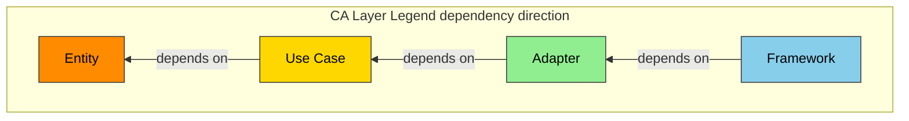

| CA レイヤー | 役割 | 色 | Hex |
|------------|------|-----|-----|
| Entity | ドメインデータ・コアロジック | 橙 | `#FF8C00` |
| Use Case | ビジネスロジック調整 | ゴールド | `#FFD700` |
| Adapter | 外部 IF 適合 | 緑 | `#90EE90` |
| Framework | UI・デバイス・外部サービス | 青 | `#87CEEB` |

### 3.2 Components (コンポーネント)

**コンポーネント図:**

```mermaid
flowchart TB
    subgraph Entity_Layer["Entity"]
        DTC_E["DTC"]:::entity
        PID_E["PidDefinition"]:::entity
        DID_E["DidDefinition"]:::entity
        ECU_E["EcuInfo"]:::entity
        VP_E["VehicleParameter"]:::entity
        DPT_E["DiagProtocolType"]:::entity
        CS_E["ConnectionState"]:::entity
    end

    subgraph UseCase_Layer["Use Case"]
        UC_Connect["ConnectElm327<br/>UseCase"]:::usecase
        UC_ScanEcu["ScanEcus<br/>UseCase"]:::usecase
        UC_ScanDid["ScanDids<br/>UseCase"]:::usecase
        UC_ReadDtc["ReadDtcs<br/>UseCase"]:::usecase
        UC_ClearDtc["ClearDtcs<br/>UseCase"]:::usecase
        UC_Monitor["MonitorDashboard<br/>UseCase"]:::usecase
        UC_Record["RecordData<br/>UseCase"]:::usecase
        UC_Cache["ManageScanCache<br/>UseCase"]:::usecase
    end

    subgraph Adapter_Layer["Adapter"]
        IF_Serial["SerialPort<br/>Protocol"]:::adapter
        IF_Diag["DiagProtocol<br/>Protocol"]:::adapter
        ELM_Adapter["ELM327Adapter"]:::adapter
        IF_Cache["ScanCacheRepository"]:::adapter
        IF_DtcDb["DtcDatabase"]:::adapter
    end

    subgraph Framework_Layer["Framework"]
        FW_PySerial["PySerialPort"]:::framework
        FW_MainWin["MainWindow<br/>PyQt6"]:::framework
        FW_ConnTab["ConnectionTab"]:::framework
        FW_DtcTab["DtcTab"]:::framework
        FW_DashTab["DashboardTab"]:::framework
        FW_RecTab["RecordTab"]:::framework
        FW_Tsv["TsvFileWriter"]:::framework
        FW_Json["JsonCacheStorage"]:::framework
        FW_CsvDtc["CsvDtcDatabase"]:::framework
    end

    UC_Connect -->|"uses"| IF_Serial
    UC_Connect -->|"uses"| ELM_Adapter
    UC_ScanEcu -->|"uses"| IF_Diag
    UC_ScanDid -->|"uses"| IF_Diag
    UC_ScanDid -->|"uses"| IF_Cache
    UC_ReadDtc -->|"uses"| IF_Diag
    UC_ReadDtc -->|"uses"| IF_DtcDb
    UC_ClearDtc -->|"uses"| IF_Diag
    UC_Monitor -->|"uses"| IF_Diag
    UC_Record -->|"uses"| IF_Diag
    UC_Cache -->|"uses"| IF_Cache

    UC_Connect -->|"produces"| ECU_E
    UC_Connect -->|"produces"| PID_E
    UC_ScanEcu -->|"produces"| ECU_E
    UC_ScanDid -->|"produces"| DID_E
    UC_ReadDtc -->|"produces"| DTC_E
    UC_Monitor -->|"produces"| VP_E

    ELM_Adapter -->|"implements"| IF_Diag
    ELM_Adapter -->|"depends on"| IF_Serial
    FW_PySerial -->|"implements"| IF_Serial
    FW_Json -->|"implements"| IF_Cache
    FW_CsvDtc -->|"implements"| IF_DtcDb

    FW_ConnTab -->|"invokes"| UC_Connect
    FW_ConnTab -->|"invokes"| UC_ScanEcu
    FW_DtcTab -->|"invokes"| UC_ReadDtc
    FW_DtcTab -->|"invokes"| UC_ClearDtc
    FW_DashTab -->|"invokes"| UC_Monitor
    FW_RecTab -->|"invokes"| UC_Record
    FW_ConnTab -->|"invokes"| UC_ScanDid
    FW_RecTab -->|"uses"| FW_Tsv

    FW_MainWin -->|"contains"| FW_ConnTab
    FW_MainWin -->|"contains"| FW_DtcTab
    FW_MainWin -->|"contains"| FW_DashTab
    FW_MainWin -->|"contains"| FW_RecTab

    classDef entity fill:#FF8C00,stroke:#333,color:#000
    classDef usecase fill:#FFD700,stroke:#333,color:#000
    classDef adapter fill:#90EE90,stroke:#333,color:#000
    classDef framework fill:#87CEEB,stroke:#333,color:#000
```

### 3.3 File Structure (ファイル構成)

```
src/
  entities/
    __init__.py
    connection_state.py      # ConnectionState 列挙
    diag_protocol_type.py    # DiagProtocolType 列挙
    dtc.py                   # DTC データクラス
    ecu_info.py              # EcuInfo データクラス
    pid_definition.py        # PidDefinition データクラス
    did_definition.py        # DidDefinition データクラス
    vehicle_parameter.py     # VehicleParameter データクラス
  use_cases/
    __init__.py
    connect_elm327.py        # ConnectElm327UseCase
    scan_ecus.py             # ScanEcusUseCase
    scan_dids.py             # ScanDidsUseCase
    read_dtcs.py             # ReadDtcsUseCase
    clear_dtcs.py            # ClearDtcsUseCase
    monitor_dashboard.py     # MonitorDashboardUseCase
    record_data.py           # RecordDataUseCase
    manage_scan_cache.py     # ManageScanCacheUseCase
  adapters/
    __init__.py
    serial_port.py           # SerialPort Protocol
    diag_protocol.py         # DiagProtocol Protocol + DiagResponse 等
    elm327_adapter.py        # ELM327Adapter
    scan_cache_repository.py # ScanCacheRepository Protocol
    dtc_database.py          # DtcDatabase Protocol
  framework/
    __init__.py
    pyserial_port.py         # PySerialPort（pyserial 実装）
    tsv_file_writer.py       # TsvFileWriter
    json_cache_storage.py    # JsonCacheStorage
    csv_dtc_database.py      # CsvDtcDatabase
    gui/
      __init__.py
      main_window.py         # MainWindow（PyQt6）
      connection_tab.py      # ConnectionTab
      dtc_tab.py             # DtcTab
      dashboard_tab.py       # DashboardTab
      record_tab.py          # RecordTab
      widgets/
        __init__.py
        status_bar.py        # StatusBarWidget
        progress_panel.py    # ProgressPanel
        realtime_graph.py    # RealtimeGraph（pyqtgraph）
  main.py                    # エントリポイント。DI 構成
data/
  pid_definitions.json       # PID 定義（ID, 名称, 変換式, 単位）
  dtc_descriptions.csv       # DTC 説明文データベース
tests/
  __init__.py
  mocks/
    __init__.py
    mock_serial_port.py      # MockSerialPort
    mock_elm327_responses.py # テスト用 ELM327 応答定義
  entities/
  use_cases/
  adapters/
  framework/
  integration/
docs/
  spec/
    car-diag-spec.md         # 本仕様書
  api/
    openapi.yaml             # OpenAPI 3.0 仕様
  hw-requirement-spec.md     # HW 連携要求仕様
  observability/
    observability-design.md  # 可観測性設計
infra/
  pyinstaller/
    car-diag.spec            # PyInstaller 設定
```

### 3.4 Domain Model (ドメインモデル)

#### 3.4.1 クラス図

**Entity 層クラス図:**

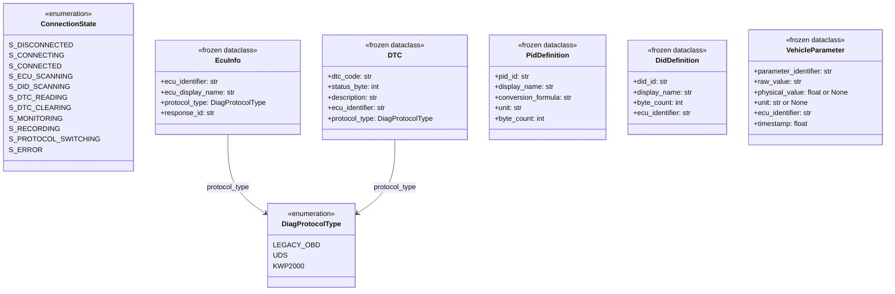

Entity 層のクラスは全て `frozen=True` の dataclass とし、不変性を保証する。

**Adapter 層 Protocol クラス図:**

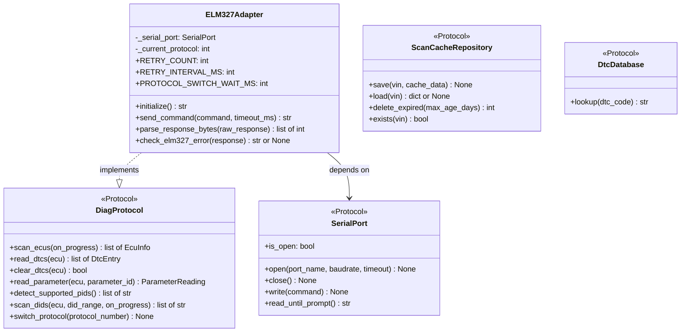

**Framework 層クラス図:**

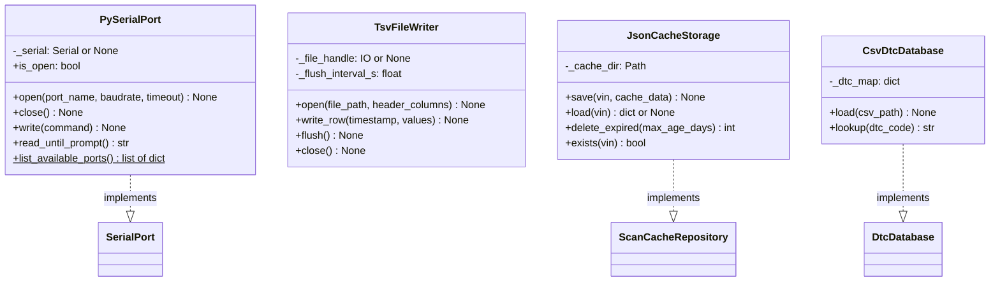

#### 3.4.2 ER 図（キャッシュファイル構造）

キャッシュファイルは `~/.car-diag/cache/{VIN}.json` に保存される。

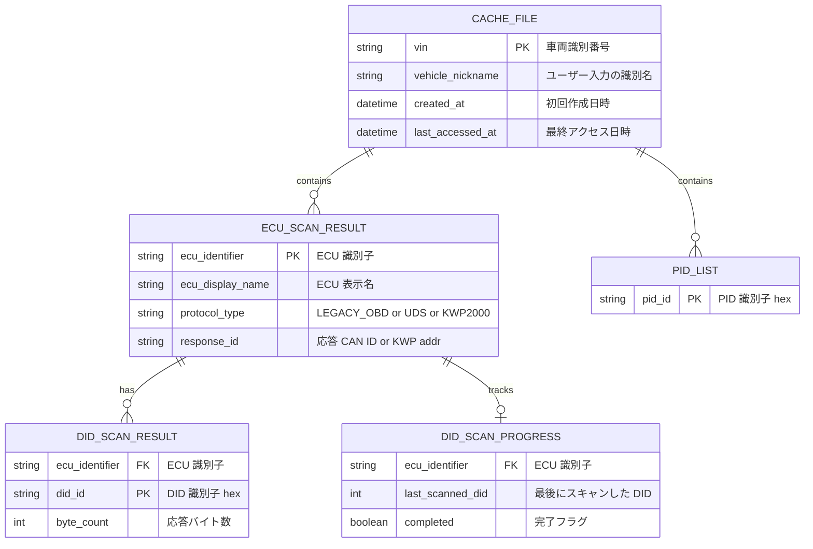

#### 3.4.3 状態遷移図（FR-02 FSA）

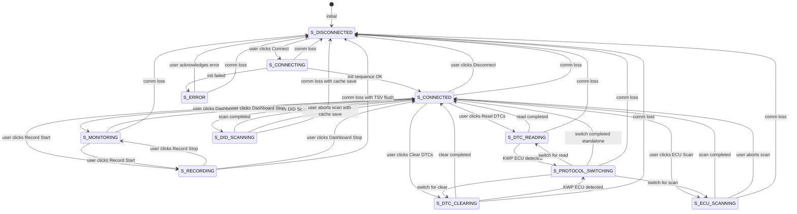

通信断（comm loss）は全状態から S_DISCONNECTED へ遷移する（FR-02a）。DID スキャン中の通信断はキャッシュ保存を伴い（FR-05e）、記録中の通信断は TSV フラッシュを伴う（FR-09f）。

### 3.5 Behavior (振る舞い)

#### 3.5.1 ELM327 接続フロー

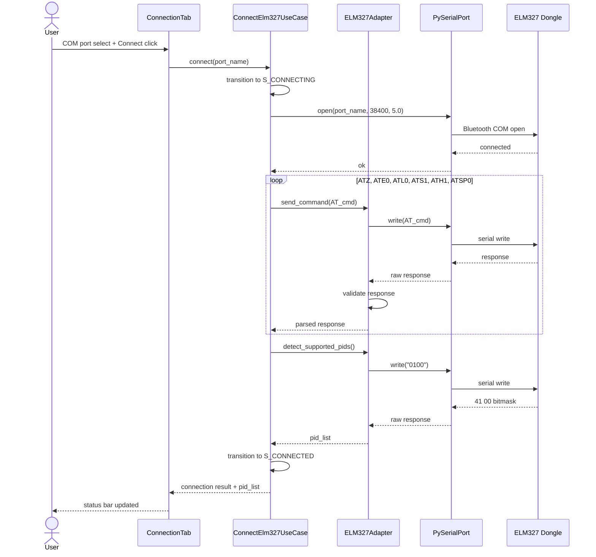

#### 3.5.2 ECU スキャンフロー

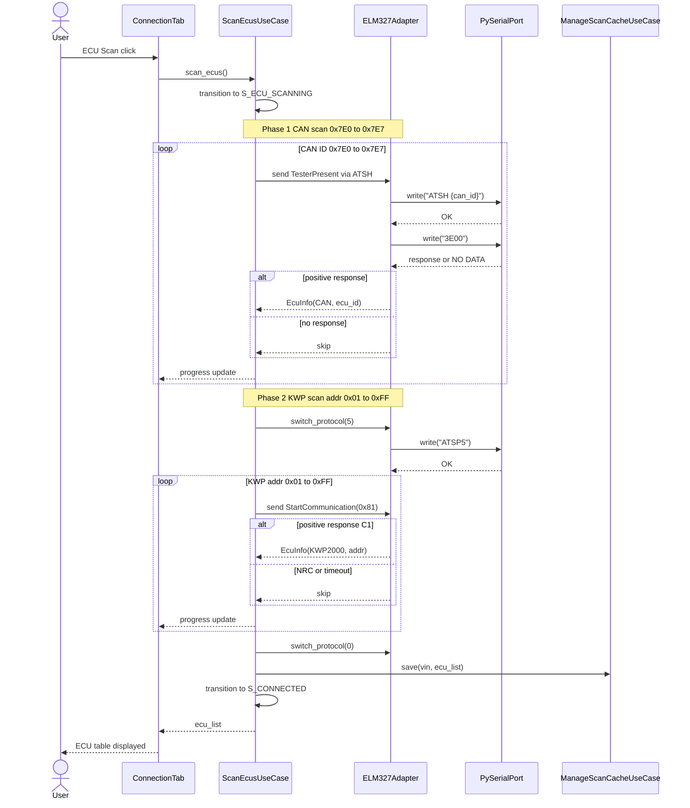

#### 3.5.3 DID スキャンフロー（中断・再開含む）

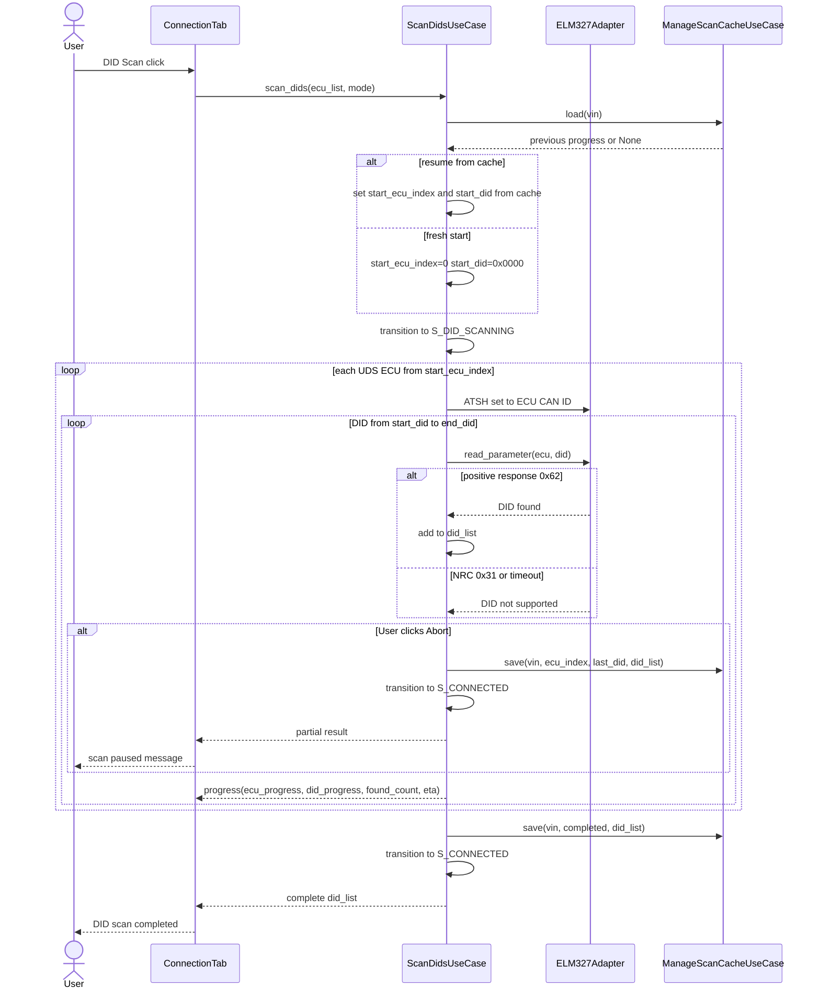

#### 3.5.4 DTC 読取フロー（マルチプロトコル）

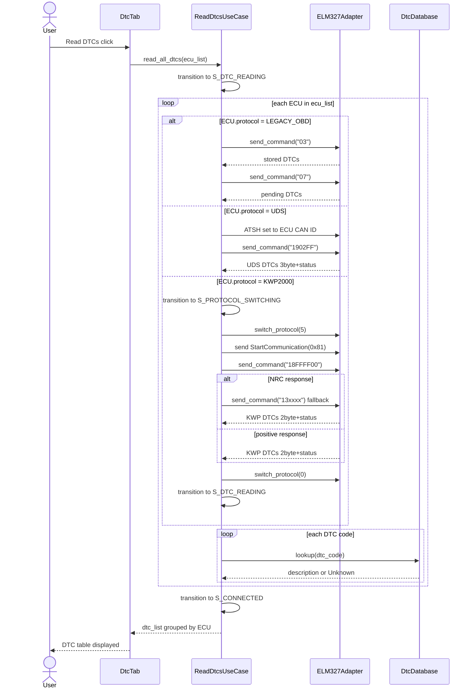

#### 3.5.5 ダッシュボードポーリングフロー

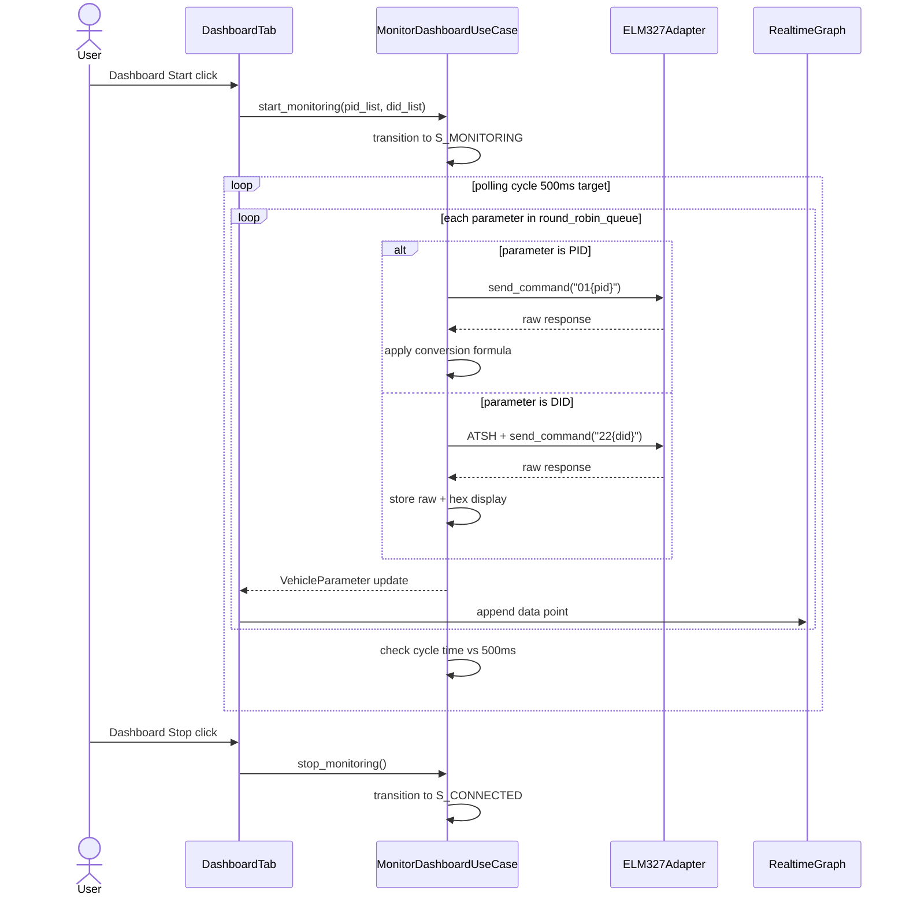

#### 3.5.6 通信断ハンドリング（アクティビティ図）

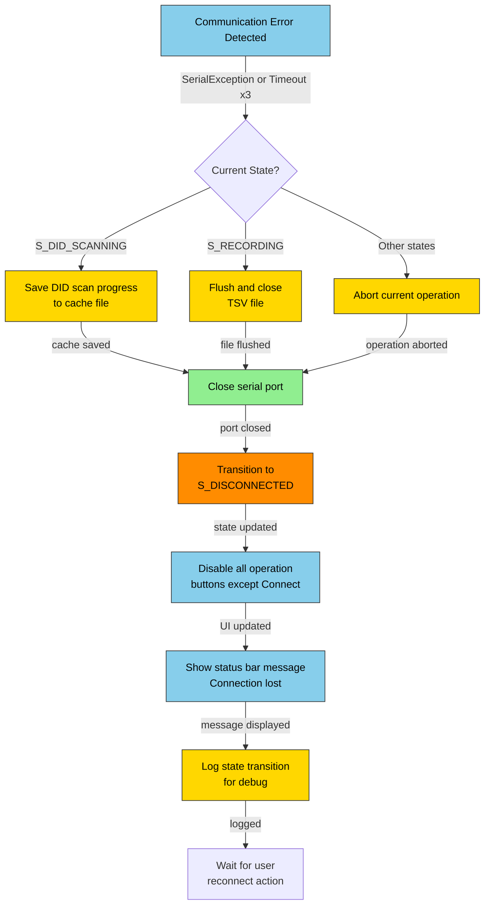

### 3.6 Decisions (設計判断)

#### ADR-001: ELM327 HW 依存の選定

project-records/decisions/adr-001-hw-dependency-elm327.md に記録済み。

- Status: Accepted (2026-03-21)
- Decision: ELM327 を HW 依存として採用。pyserial 経由 Bluetooth COM ポート接続
- Consequences: DIP により将来の HW 差し替えが容易。クローンチップ互換性は LIM-02 で許容

#### ADR-002: マルチプロトコル切替戦略

- **Status:** Accepted (2026-03-21)
- **Context:** car-diag は CAN（Legacy OBD / UDS）と KWP2000（K-Line）の両方の ECU にアクセスする必要がある。ELM327 は一度に 1 プロトコルしか使用できない（CON-06）。CAN から KWP への切替タイミングと復帰方法を決定する必要がある。
- **Decision:**
  1. デフォルトプロトコルは CAN（ATSP0 による自動検出）とする
  2. KWP ECU へのアクセスが必要な場合のみ ATSP4/ATSP5 で KWP に切替える
  3. KWP 操作完了後は即座に ATSP0 で CAN に復帰する
  4. プロトコル切替は Use Case 層が制御し、ELM327Adapter の `switch_protocol()` を呼び出す
  5. 切替中は S_PROTOCOL_SWITCHING 状態とし、他の操作を排他する
  6. 切替完了後に 200ms のウェイトを挿入する（HWR-07）
- **Consequences:**
  - Positive: CAN ECU へのアクセスが高速（デフォルトプロトコルのため切替不要）
  - Positive: S_PROTOCOL_SWITCHING 状態で排他制御するため競合が発生しない
  - Negative: KWP ECU アクセスのたびに切替オーバーヘッド（約 500ms）が発生する
  - Negative: 切替中にユーザー操作を一時ブロックする必要がある

#### ADR-003: DID スキャン中断・再開の実装方針

- **Status:** Accepted (2026-03-21)
- **Context:** DID 全スキャン（0x0000-0xFFFF）は 1 ECU あたり 30-60 分を要する（CON-09）。複数 ECU ではさらに時間がかかる。ユーザーの明示的中断、通信断による不意の中断の両方に対応する必要がある。
- **Decision:**
  1. スキャン進捗を `(ecu_index, last_scanned_did, found_did_list)` のタプルで管理する
  2. ユーザー中断時: 現在の進捗をキャッシュファイルに保存し、S_CONNECTED に遷移する
  3. 通信断時: FR-02a の通信断ハンドリングの一部として進捗をキャッシュに保存する
  4. 再開時: キャッシュから前回の中断位置を読み込み、次の DID から継続する
  5. キャッシュファイルは VIN ごとに `~/.car-diag/cache/{VIN}.json` に保存する（FR-04a と共通）
  6. 完了済み ECU はスキップし、未完了 ECU の中断位置から再開する
- **Consequences:**
  - Positive: 数時間のスキャンが途中中断されてもやり直し不要
  - Positive: 通信断という不意の事態でも進捗が保全される
  - Negative: キャッシュファイルの整合性管理が必要（ECU 構成変更時の無効化: FR-04f）

---

## Chapter 4. Specification (仕様)

### 4.1 Scenarios (シナリオ)

```gherkin
Feature: ELM327 Connection Management

  Background:
    Given ELM327 Bluetooth dongle is paired with Windows
    And a virtual COM port is available

  Rule: Connection establishment and disconnection

    Scenario: SC-001 COM port list display on startup (traces: FR-01a)
      Given the application is launched
      When the main window is displayed
      Then the connection tab shows a dropdown with available COM ports
      And each entry shows port name and description

    Scenario: SC-002 Successful ELM327 connection (traces: FR-01b, FR-01c)
      Given user selects a valid COM port
      When user clicks the Connect button
      Then the system sends ATZ, ATE0, ATL0, ATS1, ATH1, ATSP0 in sequence
      And the system sends 0100, 0120, 0140, 0160 to detect supported PIDs
      And the status bar shows the connected COM port name and detected protocol
      And operation buttons become enabled

    Scenario: SC-003 Connection timeout (traces: FR-01e)
      Given user selects a COM port with no ELM327 attached
      When user clicks the Connect button
      And no response is received within 5 seconds
      Then the status bar shows a timeout error message
      And the system remains in S_DISCONNECTED state

    Scenario: SC-004 Disconnect (traces: FR-01d)
      Given the system is in S_CONNECTED state
      When user clicks the Disconnect button
      Then the serial port is closed
      And the system transitions to S_DISCONNECTED
      And all operation buttons are disabled

    Scenario: SC-005 Status bar shows connection info (traces: FR-01f)
      Given the system is in S_CONNECTED state
      Then the status bar displays the COM port name
      And the status bar displays the detected protocol name
```

**Result:** SKIP
**Remark:** 未テスト

---

```gherkin
Feature: Connection State Management FSA

  Rule: Communication loss handling from any state

    Scenario: SC-006 Communication loss during DID scanning saves progress (traces: FR-02a, FR-05e)
      Given the system is in S_DID_SCANNING state
      And 3000 DIDs have been scanned on ECU index 2
      When the ELM327 dongle is disconnected
      Then the system saves ecu_index=2 and last_did=3000 to the cache file
      And the system transitions to S_DISCONNECTED
      And the status bar shows the connection lost message

    Scenario: SC-007 Communication loss during recording flushes TSV (traces: FR-02a, FR-09f)
      Given the system is in S_RECORDING state
      And 100 rows have been written to the TSV file
      When a serial port error occurs
      Then the system flushes and closes the TSV file
      And the system transitions to S_DISCONNECTED
      But no more than 1 second of data is lost

    Scenario: SC-008 Buttons disabled in disconnected state (traces: FR-02b)
      Given the system is in S_DISCONNECTED state
      Then only the COM port dropdown and Connect button are enabled
      And ECU Scan, DTC Read, DTC Clear, Dashboard, Record buttons are disabled

    Scenario: SC-009 Abort button during scanning (traces: FR-02c)
      Given the system is in S_ECU_SCANNING state
      Then an Abort button is visible
      When user clicks the Abort button
      Then the scan is safely interrupted
      And the system transitions to S_CONNECTED

    Scenario: SC-010 State transition logging (traces: FR-02d)
      Given the system transitions from S_DISCONNECTED to S_CONNECTING
      Then a log entry is written with the previous and new state

    Scenario: SC-011 Cache auto-load on reconnection (traces: FR-02e)
      Given the system was previously connected to a vehicle with VIN=JT12345
      And a cache file exists for VIN=JT12345
      When user reconnects to the same vehicle
      Then the system loads the cached scan results
      And the status shows previous scan results are in use
```

**Result:** SKIP
**Remark:** 未テスト

---

```gherkin
Feature: ECU Auto Scan

  Background:
    Given the system is in S_CONNECTED state

  Rule: CAN and KWP ECU detection

    Scenario: SC-012 CAN ECU detection via TesterPresent (traces: FR-03a)
      Given the vehicle has ECUs at CAN IDs 0x7E0 and 0x7E2
      When user clicks the ECU Scan button
      Then the system sends TesterPresent to CAN IDs 0x7E0 through 0x7E7
      And ECUs at 0x7E0 and 0x7E2 are detected
      And their protocol type is marked as UDS

    Scenario: SC-013 KWP ECU detection via StartCommunication (traces: FR-03b)
      Given the vehicle has a KWP2000 ECU at address 0x10
      When CAN scan phase completes
      Then the system switches to KWP protocol ATSP5
      And sends StartCommunication to addresses 0x01 through 0xFF
      And the KWP ECU at 0x10 is detected
      And the system switches back to ATSP0

    Scenario: SC-014 ECU list display (traces: FR-03c)
      Given ECU scan has completed with 3 CAN ECUs and 1 KWP ECU
      Then a table displays 4 rows with ECU name, ID, and protocol columns

    Scenario: SC-015 Progress display during scan (traces: FR-03d)
      Given user has started an ECU scan
      Then a progress bar and scan status text are visible
      And progress updates as each CAN ID and KWP address is checked

    Scenario: SC-016 No ECU detected (traces: FR-03f)
      Given the vehicle is not connected to the OBD port
      When user clicks ECU Scan
      And no ECU responds
      Then the system displays an error message indicating no ECUs found

    Scenario: SC-017 Scan results retained for DTC operations (traces: FR-03e)
      Given ECU scan has detected 2 ECUs
      When user navigates to the DTC tab
      Then the DTC operations use the previously detected ECU list
```

**Result:** SKIP
**Remark:** 未テスト

---

```gherkin
Feature: Scan Results Cache

  Rule: Cache persistence and retrieval

    Scenario: SC-018 Cache saved on scan completion (traces: FR-04a)
      Given ECU scan has completed for VIN=WBA12345
      Then a JSON file is created at ~/.car-diag/cache/WBA12345.json
      And the file contains the ECU list and detected PIDs

    Scenario: SC-019 Cache loaded on connection with known VIN (traces: FR-04b)
      Given a cache file exists for VIN=WBA12345
      When the system connects and reads VIN=WBA12345
      Then the cached ECU list and PID list are loaded
      And the status shows cache is being used

    Scenario: SC-020 Re-scan option when cache is loaded (traces: FR-04c)
      Given cached scan results are loaded
      Then a Re-scan button is displayed
      When user clicks Re-scan
      Then a fresh ECU scan is initiated

    Scenario: SC-021 Manual identifier for vehicles without VIN (traces: FR-04d)
      Given the vehicle does not support VIN retrieval via Mode 09
      When VIN query returns no data
      Then a dialog prompts the user for a vehicle identifier name
      And the entered name is used as the cache key

    Scenario: SC-022 Expired cache auto-deletion (traces: FR-04e)
      Given a cache file has not been accessed for 91 days
      When the application starts
      Then the expired cache file is deleted

    Scenario: SC-023 Cache invalidation on ECU change (traces: FR-04f)
      Given cached ECU list has 3 entries
      When a re-scan detects 4 ECUs
      Then the old cache is invalidated
      And the new scan results overwrite the cache file
```

**Result:** SKIP
**Remark:** 未テスト

---

```gherkin
Feature: DID Scan

  Background:
    Given the system is in S_CONNECTED state
    And ECU scan has been completed

  Rule: Preset and full DID scanning

    Scenario: SC-024 Preset DID scan (traces: FR-05b)
      Given 2 UDS ECUs are detected
      When user selects Preset DID Scan
      Then the system scans DID ranges F400-F4FF and F600-F6FF for each ECU
      And responds-found DIDs are recorded

    Scenario: SC-025 Full DID scan with time estimate (traces: FR-05c)
      Given 1 UDS ECU is detected
      When user selects Full DID Scan from settings
      Then the estimated scan time is displayed
      And user must confirm before scanning begins
      And the scan covers DID 0x0000 through 0xFFFF

    Scenario: SC-026 Progress display during DID scan (traces: FR-05d)
      Given a full DID scan is in progress on ECU 3 of 5
      Then the display shows total ECU progress 3 of 5
      And current ECU progress with scanned DID count
      And detected DID count
      And estimated remaining time
      And two progress bars for total and current ECU

    Scenario: SC-027 User aborts DID scan with cache save (traces: FR-05e)
      Given DID scan is at ECU index 2, DID 0x1A00
      When user clicks the Abort button
      Then ecu_index=2 and last_did=0x1A00 are saved to cache
      And the system transitions to S_CONNECTED

    Scenario: SC-028 Resume DID scan from cached position (traces: FR-05f)
      Given a previous DID scan was aborted at ECU index 2, DID 0x1A00
      When user starts DID scan again
      Then the scan resumes from ECU index 2, DID 0x1A01
      And previously found DIDs are preserved

    Scenario: SC-029 Scanned DIDs available on dashboard (traces: FR-05g)
      Given DID scan found 10 DIDs
      When user opens the Dashboard tab
      Then the 10 DIDs are available for monitoring alongside PIDs
```

**Result:** SKIP
**Remark:** 未テスト

---

```gherkin
Feature: DTC Read Multi-Protocol

  Background:
    Given the system is in S_CONNECTED state
    And ECU scan has detected at least one ECU

  Rule: Protocol-specific DTC retrieval

    Scenario: SC-030 Legacy OBD DTC read stored and pending (traces: FR-06a)
      Given a Legacy OBD ECU is detected
      When user clicks Read DTCs
      Then the system sends Mode 03 for stored DTCs
      And sends Mode 07 for pending DTCs
      And results are combined

    Scenario: SC-031 UDS DTC read (traces: FR-06a)
      Given a UDS ECU at CAN ID 0x7E0 is detected
      When user clicks Read DTCs
      Then the system sets ATSH 7E0
      And sends 1902FF for ReadDTCByStatusMask
      And parses 3-byte DTC + 1-byte status

    Scenario: SC-032 KWP2000 DTC read with fallback (traces: FR-06a, FR-06f)
      Given a KWP2000 ECU is detected
      When user clicks Read DTCs
      Then the system switches to ATSP5
      And sends SID 18 for readDTCByStatus
      And if NRC is returned, falls back to SID 13
      And then switches protocol back to ATSP0

    Scenario: SC-033 DTC description lookup (traces: FR-06b)
      Given DTCs P0300, P0171, and P1234 are retrieved
      Then P0300 shows description from the built-in database
      And P0171 shows description from the built-in database
      And P1234 shows Unknown in the description column

    Scenario: SC-034 DTC grouped by ECU display (traces: FR-06c)
      Given 2 DTCs from ECU Engine and 1 DTC from ECU Transmission
      Then the DTC list is grouped under Engine and Transmission headers

    Scenario: SC-035 No DTC found message (traces: FR-06d)
      Given all ECUs report zero DTCs
      Then the display shows DTC nashi message

    Scenario: SC-036 Unknown DTC description (traces: FR-06e)
      Given DTC P1999 is not in the built-in database
      Then the description column shows Unknown
```

**Result:** SKIP
**Remark:** 未テスト

---

```gherkin
Feature: DTC Clear Multi-Protocol

  Background:
    Given the system is in S_CONNECTED state
    And DTCs have been read

  Rule: Confirmation and protocol-specific clearing

    Scenario: SC-037 DTC clear with ECU selection dialog (traces: FR-07a)
      Given 3 ECUs have DTCs
      When user clicks Clear DTCs
      Then a dialog shows All ECU and individual ECU selection options
      And a confirmation message is displayed

    Scenario: SC-038 DTC clear success (traces: FR-07b, FR-07c)
      Given user confirms DTC clear for all ECUs
      When clear commands are sent to each ECU per its protocol
      Then the DTC list is cleared
      And DTC clear complete message is shown

    Scenario: SC-039 DTC clear error with NRC (traces: FR-07d)
      Given the engine is running
      When DTC clear is attempted
      And NRC conditionsNotCorrect is returned
      Then an error message is shown
      And user is notified to stop the engine
```

**Result:** SKIP
**Remark:** 未テスト

---

```gherkin
Feature: Vehicle Data Dashboard

  Background:
    Given the system is in S_CONNECTED state
    And supported PIDs have been detected

  Rule: Real-time monitoring

    Scenario: SC-040 Dashboard polling and display (traces: FR-08a)
      Given PIDs 0x0C RPM and 0x0D Vehicle Speed are supported
      When user starts the dashboard
      Then the system polls each PID in round-robin order
      And displays numeric values and a real-time graph

    Scenario: SC-041 PID value conversion (traces: FR-08b)
      Given PID 0x0C returns bytes A=0x1A, B=0xF8
      Then RPM is calculated as ((0x1A * 256) + 0xF8) / 4 = 1726 rpm

    Scenario: SC-042 DID values on dashboard (traces: FR-08b, FR-05g)
      Given DID scan found DID 0xF400
      When dashboard polls DID 0xF400
      Then raw hex value and interpreted value are both displayed

    Scenario: SC-043 Real-time graph scrolling (traces: FR-08c)
      Given dashboard is active for 30 seconds
      Then the pyqtgraph displays a scrolling line chart
      And older data points scroll off the left edge

    Scenario: SC-044 Unsupported parameter not shown (traces: FR-08d)
      Given the vehicle does not support PID 0x46
      Then PID 0x46 is not displayed on the dashboard
```

**Result:** SKIP
**Remark:** 未テスト

---

```gherkin
Feature: Data Recording

  Background:
    Given the system is in S_MONITORING state

  Rule: TSV file recording with crash safety

    Scenario: SC-045 Record start with file dialog (traces: FR-09a)
      When user clicks Record Start
      Then a file save dialog appears
      And user selects a TSV file path

    Scenario: SC-046 TSV recording at 500ms interval (traces: FR-09b)
      Given recording is active
      Then rows are written at approximately 500ms intervals
      And each row contains a timestamp and all parameter values

    Scenario: SC-047 TSV header row (traces: FR-09c)
      Given a new TSV file is created
      Then the first row contains timestamp followed by parameter names

    Scenario: SC-048 Record stop closes file (traces: FR-09d)
      Given recording is active
      When user clicks Record Stop
      Then the TSV file is properly closed
      And recording time and row count are shown

    Scenario: SC-049 Recording status display (traces: FR-09e)
      Given recording has been active for 5 minutes with 600 rows
      Then the status bar shows recording time 5m and 600 rows

    Scenario: SC-050 TSV flush interval for crash safety (traces: FR-09f)
      Given recording is active
      Then the TSV file is flushed with fsync at most every 1 second
      And at most 2 rows of data may be lost on crash

    Scenario: SC-051 Disk full error during recording (traces: FR-09g)
      Given recording is active
      When a disk write error occurs
      Then recording is stopped
      And an error message is displayed
      And previously written data is preserved
```

**Result:** SKIP
**Remark:** 未テスト

---

### 4.2 UI Elements Map (UI 要素マップ)

#### 4.2.1 接続タブ (ConnectionTab)

| 要素 ID | 種類 | ラベル | 状態制御 | traces |
|---------|------|--------|---------|--------|
| cmb_com_port | QComboBox | COM ポート | S_DISCONNECTED のみ選択可 | FR-01a |
| btn_connect | QPushButton | 接続 | S_DISCONNECTED のみ有効 | FR-01b |
| btn_disconnect | QPushButton | 切断 | S_DISCONNECTED 以外で有効 | FR-01d |
| btn_ecu_scan | QPushButton | ECU スキャン | S_CONNECTED のみ有効 | FR-03a |
| btn_did_scan_preset | QPushButton | DID スキャン（プリセット） | S_CONNECTED + ECU スキャン済 | FR-05b |
| btn_did_scan_full | QPushButton | DID 全スキャン | S_CONNECTED + ECU スキャン済 | FR-05c |
| btn_abort_scan | QPushButton | 中断 | S_ECU_SCANNING or S_DID_SCANNING のみ表示 | FR-02c |
| tbl_ecu_list | QTableWidget | ECU 一覧 | ECU スキャン後に表示 | FR-03c |
| pgb_scan_total | QProgressBar | 全体進捗 | スキャン中のみ表示 | FR-03d, FR-05d |
| pgb_scan_current | QProgressBar | 現在 ECU 進捗 | DID スキャン中のみ表示 | FR-05d |
| lbl_scan_status | QLabel | スキャン状態 | スキャン中のみ表示 | FR-05d |
| lbl_cache_status | QLabel | キャッシュ状態 | キャッシュ読込時に表示 | FR-04c |
| btn_rescan | QPushButton | 再スキャン | キャッシュ使用中に有効 | FR-04c |

#### 4.2.2 DTC タブ (DtcTab)

| 要素 ID | 種類 | ラベル | 状態制御 | traces |
|---------|------|--------|---------|--------|
| btn_read_dtc | QPushButton | DTC 読取 | S_CONNECTED + ECU スキャン済 | FR-06a |
| btn_clear_dtc | QPushButton | DTC 消去 | S_CONNECTED + DTC 読取済 | FR-07a |
| tbl_dtc_list | QTreeWidget | DTC 一覧 | DTC 読取後に表示。ECU ごとにグループ化 | FR-06c |
| lbl_dtc_count | QLabel | DTC 件数 | DTC 読取後に表示 | FR-06d |

#### 4.2.3 ダッシュボードタブ (DashboardTab)

| 要素 ID | 種類 | ラベル | 状態制御 | traces |
|---------|------|--------|---------|--------|
| btn_dash_start | QPushButton | モニター開始 | S_CONNECTED で有効 | FR-08a |
| btn_dash_stop | QPushButton | モニター停止 | S_MONITORING or S_RECORDING で有効 | FR-08a |
| tbl_param_values | QTableWidget | パラメータ値 | モニター中に更新 | FR-08a |
| wgt_graph | PlotWidget (pyqtgraph) | リアルタイムグラフ | モニター中に更新 | FR-08c |

#### 4.2.4 記録タブ (RecordTab)

| 要素 ID | 種類 | ラベル | 状態制御 | traces |
|---------|------|--------|---------|--------|
| btn_record_start | QPushButton | 記録開始 | S_MONITORING で有効 | FR-09a |
| btn_record_stop | QPushButton | 記録停止 | S_RECORDING で有効 | FR-09d |
| lbl_record_time | QLabel | 記録時間 | S_RECORDING で更新 | FR-09e |
| lbl_record_rows | QLabel | 記録行数 | S_RECORDING で更新 | FR-09e |
| lbl_file_path | QLabel | 保存先 | ファイル選択後に表示 | FR-09a |

#### 4.2.5 ステータスバー (共通)

| 要素 ID | 種類 | 表示内容 | traces |
|---------|------|---------|--------|
| lbl_conn_status | QLabel | 接続状態（COM ポート名 + プロトコル名） | FR-01f |
| lbl_state | QLabel | 現在の FSA 状態 | FR-02d |
| lbl_error | QLabel | エラーメッセージ | FR-01e, FR-02a |

### 4.3 State Management (状態管理)

FR-02 FSA の全遷移を網羅する状態遷移テーブル。

| # | 遷移元 | イベント | 遷移先 | アクション | traces |
|---|--------|---------|--------|-----------|--------|
| T01 | S_DISCONNECTED | User: Connect click | S_CONNECTING | open serial port | FR-01b |
| T02 | S_CONNECTING | Init sequence OK | S_CONNECTED | enable operation buttons | FR-01b |
| T03 | S_CONNECTING | Init failed / timeout | S_ERROR | show error message | FR-01e |
| T04 | S_CONNECTED | User: Disconnect click | S_DISCONNECTED | close serial port, disable buttons | FR-01d |
| T05 | S_CONNECTED | User: ECU Scan click | S_ECU_SCANNING | start CAN + KWP scan | FR-03a |
| T06 | S_CONNECTED | User: DID Scan click | S_DID_SCANNING | start DID scan or resume | FR-05b, FR-05c |
| T07 | S_CONNECTED | User: Read DTCs click | S_DTC_READING | send DTC read commands | FR-06a |
| T08 | S_CONNECTED | User: Clear DTCs click | S_DTC_CLEARING | show confirmation dialog | FR-07a |
| T09 | S_CONNECTED | User: Dashboard Start | S_MONITORING | start polling loop | FR-08a |
| T10 | S_CONNECTED | User: Record Start | S_RECORDING | open TSV + start polling | FR-09a |
| T11 | S_ECU_SCANNING | Scan completed | S_CONNECTED | display ECU list, save cache | FR-03c |
| T12 | S_ECU_SCANNING | User: Abort | S_CONNECTED | stop scan, show partial results | FR-02c |
| T13 | S_ECU_SCANNING | KWP scan needed | S_PROTOCOL_SWITCHING | switch to KWP protocol | FR-03b |
| T14 | S_DID_SCANNING | Scan completed | S_CONNECTED | save cache, display results | FR-05b |
| T15 | S_DID_SCANNING | User: Abort | S_CONNECTED | save progress to cache | FR-05e |
| T16 | S_DTC_READING | Read completed | S_CONNECTED | display DTC list | FR-06b |
| T17 | S_DTC_READING | KWP ECU access needed | S_PROTOCOL_SWITCHING | switch to KWP | FR-06f |
| T18 | S_DTC_CLEARING | Clear completed | S_CONNECTED | clear DTC list, show success | FR-07c |
| T19 | S_DTC_CLEARING | NRC returned | S_CONNECTED | show error message | FR-07d |
| T20 | S_DTC_CLEARING | KWP ECU access needed | S_PROTOCOL_SWITCHING | switch to KWP | FR-06f |
| T21 | S_PROTOCOL_SWITCHING | Switch completed (for read) | S_DTC_READING | continue DTC read | ADR-002 |
| T22 | S_PROTOCOL_SWITCHING | Switch completed (for clear) | S_DTC_CLEARING | continue DTC clear | ADR-002 |
| T23 | S_PROTOCOL_SWITCHING | Switch completed (for scan) | S_ECU_SCANNING | continue ECU scan | ADR-002 |
| T24 | S_PROTOCOL_SWITCHING | Switch completed (standalone) | S_CONNECTED | return to idle | ADR-002 |
| T25 | S_MONITORING | User: Dashboard Stop | S_CONNECTED | stop polling | FR-08a |
| T26 | S_MONITORING | User: Record Start | S_RECORDING | open TSV, continue polling | FR-09a |
| T27 | S_RECORDING | User: Record Stop | S_MONITORING | close TSV, continue polling | FR-09d |
| T28 | S_RECORDING | User: Dashboard Stop | S_CONNECTED | close TSV, stop polling | FR-09d |
| T29 | S_ERROR | User: Acknowledge | S_DISCONNECTED | reset UI | FR-02a |
| T30 | Any (except S_DISCONNECTED) | Comm loss (timeout x3 or SerialException) | S_DISCONNECTED | abort op, save state, close port, show message | FR-02a |

### 4.4 Error Handling (エラー処理)

#### 4.4.1 エラーコード体系

| エラーコード | カテゴリ | メッセージ (日本語) | 原因 | traces |
|-------------|---------|-------------------|------|--------|
| E-CONN-001 | 接続 | COM ポートを開けません | ポート使用中 or 存在しない | FR-01b |
| E-CONN-002 | 接続 | ELM327 が応答しません | ATZ 応答なし | FR-01e, HWR-04 |
| E-CONN-003 | 接続 | ELM327 初期化に失敗しました | AT コマンドエラー | FR-01b |
| E-CONN-004 | 接続 | 接続が切断されました -- ELM327 を確認してください | 通信断 | FR-02a |
| E-CONN-005 | 接続 | 応答タイムアウト（5 秒） | 応答なし | FR-01e |
| E-SCAN-001 | スキャン | ECU が検出されませんでした | 全 ID/addr 応答なし | FR-03f |
| E-SCAN-002 | スキャン | プロトコル切替に失敗しました | ATSP エラー | HWR-06 |
| E-DTC-001 | DTC | DTC 読取に失敗しました | SID エラー | FR-06a |
| E-DTC-002 | DTC | DTC 消去に失敗しました -- エンジンを停止してください | NRC conditionsNotCorrect | FR-07d, CON-04 |
| E-DTC-003 | DTC | DTC 消去に失敗しました | その他の NRC | FR-07d |
| E-REC-001 | 記録 | ファイルの書き込みに失敗しました -- ディスク容量を確認してください | 書込エラー | FR-09g |
| E-CACHE-001 | キャッシュ | キャッシュファイルの読み込みに失敗しました | JSON パースエラー | FR-04b |
| E-PROTO-001 | プロトコル | 不正な応答を受信しました | バリデーション失敗 | NFR-04a, HWR-20 |
| E-PROTO-002 | プロトコル | 車両が応答しません (NO DATA) | 車両未応答 | HWR-20 |

#### 4.4.2 ELM327 エラー応答マッピング

| ELM327 応答文字列 | エラーコード | 対応アクション |
|------------------|-------------|---------------|
| `NO DATA` | E-PROTO-002 | 当該コマンドをスキップ |
| `UNABLE TO CONNECT` | E-CONN-002 | リトライ 3 回後にエラー表示 |
| `CAN ERROR` | E-PROTO-001 | リトライ 3 回後にエラー表示 |
| `BUS INIT: ...ERROR` | E-CONN-003 | プロトコル切替を試行 |
| `?` | E-PROTO-001 | 不正コマンドとしてログ出力 |
| `7F {SID} {NRC}` | NRC 依存 | NRC コードに応じたエラーメッセージ |

#### 4.4.3 UDS/KWP2000 NRC コード対応表

| NRC (hex) | 名称 | エラーコード | ユーザー向けメッセージ |
|-----------|------|-------------|---------------------|
| 0x10 | generalReject | E-DTC-001 | 要求が拒否されました |
| 0x11 | serviceNotSupported | E-DTC-001 | このサービスは対応していません |
| 0x12 | subFunctionNotSupported | E-DTC-001 | このサブ機能は対応していません |
| 0x13 | incorrectMessageLengthOrInvalidFormat | E-PROTO-001 | メッセージ形式が不正です |
| 0x14 | responseTooLong | E-PROTO-001 | 応答が長すぎます |
| 0x22 | conditionsNotCorrect | E-DTC-002 | 条件が満たされていません（エンジンを停止してください） |
| 0x31 | requestOutOfRange | (無視) | DID スキャンで非対応 DID として処理 |
| 0x78 | requestCorrectlyReceivedResponsePending | (待機) | 追加応答を待機 |

---

## Chapter 5. Test Strategy (テスト戦略)

| テストレベル | 対象 | 方針 | ツール | 合格基準 |
|------------|------|------|--------|---------|
| 単体テスト | Entity 層（データクラス、変換ロジック） | 全変換式と境界値をテスト。MockSerialPort でシリアル通信を模擬 | pytest, pytest-cov | カバレッジ 80% 以上、合格率 95% 以上 |
| 単体テスト | Use Case 層（ビジネスロジック） | DiagProtocol / ScanCacheRepository のモックを注入。状態遷移を網羅 | pytest | カバレッジ 80% 以上、合格率 95% 以上 |
| 単体テスト | Adapter 層（ELM327Adapter） | MockSerialPort で応答シナリオを模擬。正常系 + 異常系（NRC, タイムアウト） | pytest | カバレッジ 80% 以上、合格率 95% 以上 |
| 結合テスト | Use Case + Adapter 統合 | ELM327Adapter + MockSerialPort で E2E 通信フローをテスト | pytest | 合格率 100% |
| 結合テスト | キャッシュ読み書き | JsonCacheStorage + ファイルシステムの実結合 | pytest, tmp_path | 合格率 100% |
| GUI テスト | PyQt6 全タブ操作 | ボタン有効/無効制御、テーブル表示、プログレスバー更新 | pytest-qt | 主要シナリオ全 PASS |
| GUI テスト | 状態遷移に伴う UI 更新 | 各状態遷移で正しい UI 要素が有効/無効になるか | pytest-qt | 全遷移パターン PASS |
| 性能テスト | PID 変換処理 | 全 PID の変換が 1ms 以内に完了するか | pytest-benchmark | P99 < 1ms |
| 性能テスト | GUI 応答速度 | ボタン操作から UI 更新まで 200ms 以内（NFR-01c） | pytest-qt + 計測 | P99 < 200ms |

テスト用 ELM327 応答定義は `tests/mocks/mock_elm327_responses.py` に集約し、実 ELM327 なしで全テストを実行可能とする。

---

## Chapter 6. Design Principles Compliance (SW設計原則 準拠確認)

| カテゴリ | 識別名 | 正式名称 | 確認観点 | 本プロジェクトでの適用 |
|---------|--------|---------|---------|---------------------|
| 命名 | Naming | -- | 意図が伝わる命名か。ドメイン語彙（Ch 1.8）と一致するか | DTC, PID, DID, ECU, VIN 等の OBD-II ドメイン語彙を統一使用。`data` や `info` 単体での命名を禁止 |
| 依存関係 | Dependency Direction | -- | 依存方向が Ch 3.1 の CA レイヤーに従っているか | Framework -> Adapter -> Use Case -> Entity の一方向。Entity は外部依存なし |
| 依存関係 | SDP | Stable Dependencies Principle | 依存先が自分より安定（変更頻度が低い）モジュールか | Entity 層は最も安定。GUI 変更が Entity に影響しない |
| 簡潔性 | KISS | Keep It Simple, Stupid | 動作する最も単純な解決を選んでいるか | ELM327 の AT コマンドをそのまま逐次送信。非同期フレームワーク不使用（CON-01 シングルスレッド制約） |
| 簡潔性 | YAGNI | You Aren't Gonna Need It | 今必要でない機能を作っていないか | Out-of-scope（USB, クラウド, macOS）の機能を実装しない |
| 簡潔性 | DRY | Don't Repeat Yourself | コード・ロジック・定義に重複がないか | PID 定義を JSON ファイルに外部化。DTC 定義を CSV に外部化（NFR-05b） |
| 責務分離 | SoC | Separation of Concerns | 関心ごとが適切に分離されているか | シリアル通信 / プロトコル解釈 / ビジネスロジック / GUI が 4 層で分離 |
| 責務分離 | SRP | Single Responsibility Principle | 各クラス・モジュールが単一の責務を持つか | ELM327Adapter は AT コマンド送受信のみ。変換ロジックは Entity 層 |
| 責務分離 | SLAP | Single Level of Abstraction Principle | 関数内の抽象度レベルが統一されているか | Use Case は Entity と Protocol メソッドのみ呼び出し。生バイト操作はしない |
| SOLID | OCP | Open-Closed Principle | 拡張に開き修正に閉じているか | 新プロトコル追加時は DiagProtocol の新実装を追加するのみ |
| SOLID | LSP | Liskov Substitution Principle | 親クラスを子クラスに差し替えても正しく動作するか | PySerialPort を MockSerialPort に差し替えてテスト可能 |
| SOLID | ISP | Interface Segregation Principle | インターフェースが適切に分割されているか | SerialPort と DiagProtocol を分離。GUI は Use Case のみに依存 |
| SOLID | DIP | Dependency Inversion Principle | 具象ではなく抽象に依存しているか | Use Case は SerialPort Protocol / DiagProtocol Protocol に依存。pyserial を直接参照しない |
| 結合 | LoD | Law of Demeter | オブジェクトの内部構造を掘り下げてアクセスしていないか | GUI は Use Case の戻り値（Entity）のみ参照。Adapter の内部状態に触れない |
| 結合 | CQS | Command-Query Separation | コマンドとクエリが分離されているか | `read_dtcs()` はクエリ、`clear_dtcs()` はコマンド。混在しない |
| 可読性 | POLA | Principle of Least Astonishment | 読み手が予想する通りに動作するか | `connect()` は接続、`disconnect()` は切断。副作用が名前から明白 |
| 可読性 | PIE | Program Intently and Expressively | 意図が明確に伝わるコードか | ConnectionState 列挙で状態を明示。マジックナンバーを排除 |
| テスト | Testability | -- | 単体テストがしやすいか。Mock を容易に差し込める設計か | DIP によりコンストラクタインジェクションで Mock 差込可能。HWR-30 |
| 純粋性 | Pure/Impure | -- | 純粋関数と副作用のある関数が分離・整理されているか | PID 変換式は純粋関数。シリアル通信は Adapter 層に隔離 |
| 状態遷移 | State Transition | -- | 状態遷移の条件取得と遷移実行が分離されているか | 遷移条件は Use Case が判定。遷移実行は ConnectionState の更新メソッド |
| 並行性 | Concurrency Safety | -- | デッドロック・競合状態・グリッチが発生しないか | シリアル通信はシングルスレッド逐次処理（CON-01）。GUI イベントは Qt イベントループで直列化 |
| エラー | Error Propagation | -- | エラーが握りつぶされず、適切に伝播・処理されているか | SerialException -> ConnectionError -> Use Case -> GUI のエラー伝播チェーン |
| 資源管理 | Resource Lifecycle | -- | リソース（接続・ファイル・メモリ）の取得と解放が対になっているか | SerialPort.open/close、TsvFileWriter.open/close が対。通信断時も close 保証 |
| 不変性 | Immutability | -- | 変更不要な値が不変（immutable）になっているか | Entity 層は全て frozen dataclass。ELM327 応答のパース結果も immutable |
| 資源効率 | Resource Efficiency | -- | CPU 負荷・メモリ使用量・ストレージ摩耗等が許容範囲内か | ポーリング間隔 500ms で CPU 負荷を抑制。グラフデータは最新 N 点のみ保持 |

---

## Appendix (付録)

### A.1 References (参考文献)

- SAE J1979 — OBD-II Diagnostic Services
- ISO 15765-4 — DoCAN (Diagnostics over CAN)
- ISO 14229 — UDS (Unified Diagnostic Services)
- ISO 14230-4 — KWP2000 (Keyword Protocol 2000)
- ELM327 Datasheet — ELM Electronics
- RFC 2119 / RFC 8174 — Requirement Levels

### A.2 Licenses (ライセンス)

_（implementation フェーズで記載）_

### A.3 Changelog (変更履歴)

| バージョン | 日付 | 変更内容 |
|-----------|------|---------|
| 0.1.0 | 2026-03-21 | Ch1-2 初版作成 |
| 0.2.0 | 2026-03-21 | Ch3-6 詳細化（Architecture, Specification, Test Strategy, Design Principles Compliance） |
