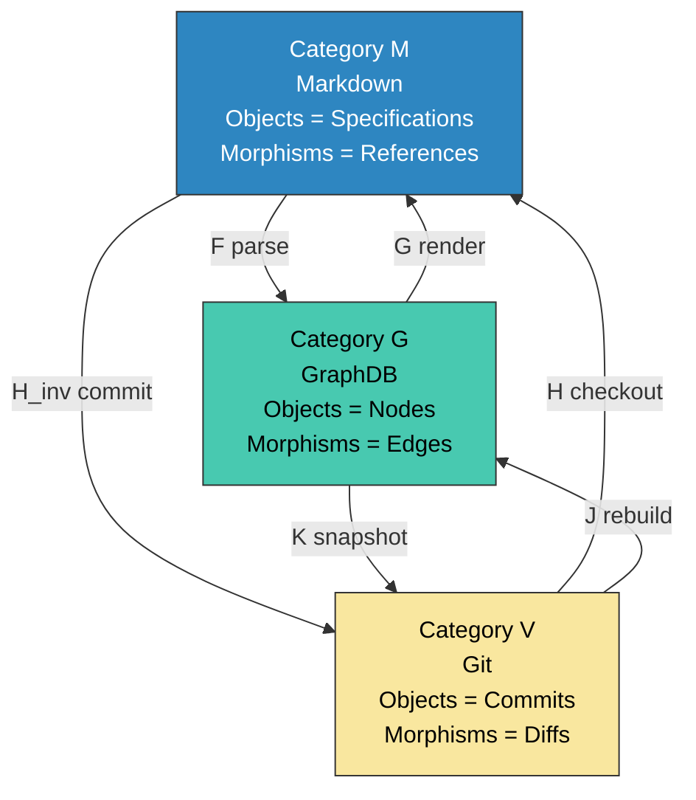
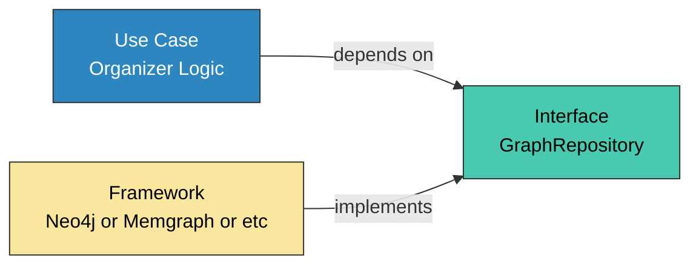
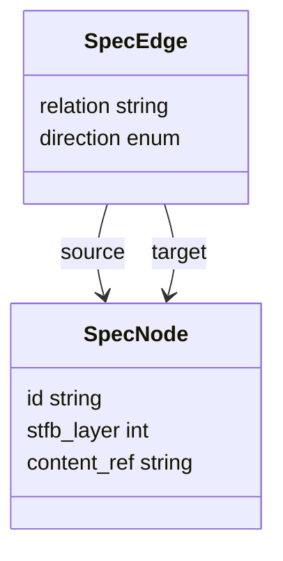
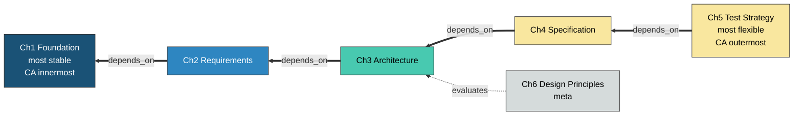
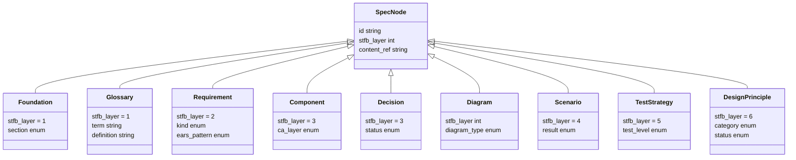
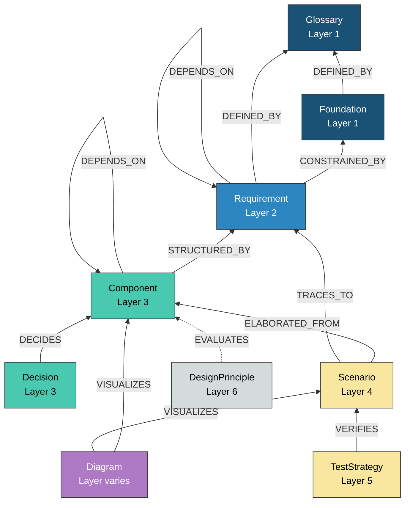
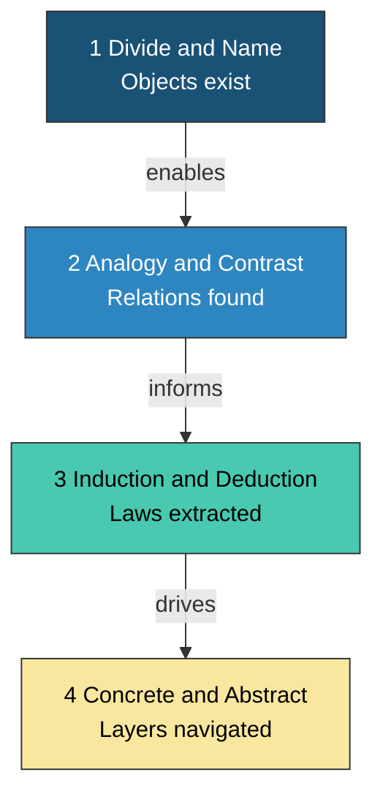
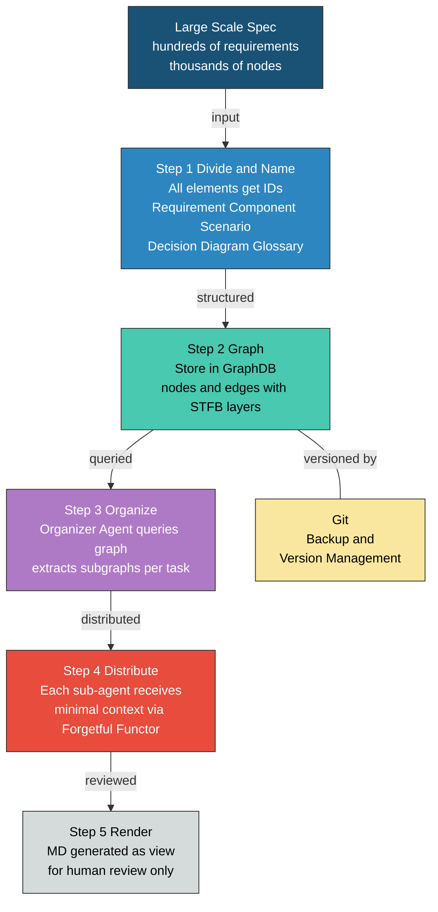

````markdown
## Draft (alpha version, work in progress)

# ANGS (AI-Native Graph Spec) — Specification Management and Agent Coordination via Graph Structure

## Abstract

AI-driven development specifications form a three-level hierarchy scaled by project size. ANMS (AI-Native Minimal Spec: single file), ANPS (AI-Native Plural Spec: multiple file split), and ANGS (AI-Native Graph Spec: GraphDB-based) — all sharing the STFB (Stable Top, Flexible Bottom) design principle. ANMS targets scales that fit in a single context window; ANPS handles medium-scale projects that do not fit but do not require GraphDB [1]. This paper proposes ANGS, the third level. The Markdown linear structure of ANMS and ANPS cannot manage specification element dependencies at large scale. ANGS preserves the ANMS hierarchical structure (STFB) while managing large-scale specifications. The core is distilled into four design principles: (1) Conceptualize the three elements — Markdown, GraphDB, and Git — as a triangular relationship using category theory. (2) Markdown is not an intermediary but a view. (3) GraphDB requires no versioning capability; history management is delegated to Git. (4) GraphDB is merely a Framework layer in Clean Architecture, made replaceable via DIP. Based on these principles, we define a graph schema that unifies STFB layers with Clean Architecture's dependency direction, and present a mechanism for context minimization via the forgetful functor and subgraph extraction by an organizer agent.

## Keywords

ANGS, ANMS, STFB, GraphDB, Category Theory, Clean Architecture, CQRS, Multi-Agent, Specification Management

---

## 1. Introduction — The Limits of ANMS

### 1.1 Design Assumptions of ANMS

ANMS (AI-Native Minimal Spec) is a specification template for AI-driven development [1]. Its chapter structure follows STFB (Stable Top, Flexible Bottom), which structurally controls the propagation of changes. It combines EARS, Gherkin, and Mermaid in a hybrid notation to achieve both logical rigor and visual design synchronization.

ANMS is optimized for small-to-medium-scale software. Its design assumption is that "a single specification document fits within an AI's context window." For medium-scale projects, ANPS (AI-Native Plural Spec) extends this assumption through multiple file splitting, but still relies on Markdown's linear structure.

### 1.2 Challenges in Large-Scale Software

In large-scale software, this assumption breaks down for two reasons.

| #   | Challenge                    | Description                                                                                       |
| --- | ---------------------------- | ------------------------------------------------------------------------------------------------- |
| 1   | Context size limitation      | The entirety of a large-scale specification does not fit in an LLM's context window               |
| 2   | Managing large spec families | Tracking dependencies among hundreds to thousands of requirements, components, and scenarios by hand is impossible |

### 1.3 Purpose of This Paper

The purpose of this paper is to present a design for specification management and agent coordination in large-scale projects while preserving the STFB hierarchical structure of ANMS.

### 1.4 Relationship with the First Paper — What Changes and What Does Not

The first paper [1] took consolidating all information into a single Markdown file as the foundational concept of specification structure.
This paper moves the specification body from $\mathcal{M}$ (Markdown) to $\mathcal{G}$ (GraphDB) and redefines Markdown as a view. This is an extension that raises the abstraction level of the representation medium; the STFB × CA dependency direction structure from the first paper is inherited as-is.

**What changes — Representation medium:**

At large scale, Markdown's linear structure cannot adequately express dependencies between specification elements. GraphDB can directly model dependencies through nodes and edges, enabling specification management at a higher level of abstraction than Markdown. This elevation of abstraction is the core of large-scale scaling.

**What does not change — STFB × CA dependency direction structure:**

The internal structure of specifications — namely the STFB hierarchical composition and Clean Architecture's dependency direction — remains identical to the first paper. The principle "flexible lower layers depend on stable upper layers," which was expressed through Markdown's chapter structure, is reimplemented as `direction` constraints (forward / trace / meta) in the graph schema. The vessel changes, but the structure within the vessel does not.

| Aspect                     | ANMS (First Paper)                          | ANPS                                              | ANGS (This Paper)                                          |
| -------------------------- | ------------------------------------------- | ------------------------------------------------- | ---------------------------------------------------------- |
| Representation medium      | Single Markdown file                        | Multiple Markdown files + Common Block            | GraphDB + Git (MD is a view)                               |
| Internal spec structure    | STFB × CA dependency direction              | STFB × CA dependency direction (identical)        | STFB × CA dependency direction (identical)                 |
| Applicable scale           | Scale that fits in a single context window   | Does not fit, but no GraphDB needed (medium-scale)| Large-scale                                                |
| Relationship               | —                                           | File-split extension of ANMS                      | An alternative that raises abstraction level (not opposed)  |

The three are used according to scale. ANPS fills the gap between ANMS and ANGS as an intermediate level, handling medium-scale projects through Common Block-based file management and chapter splitting (spec-foundation / spec-architecture).

---

## 2. Design Principles

### 2.1 Conceptualizing Specification Management with Category Theory

We define the three elements involved in specification management — Markdown, Git, and GraphDB — as three categories in category theory.

| Category                   | Managed Aspect        | Objects                       | Morphisms                |
| -------------------------- | --------------------- | ----------------------------- | ------------------------ |
| $\mathcal{M}$ (Markdown)   | Representation (view) | Specification sections with IDs | Cross-references between sections |
| $\mathcal{G}$ (GraphDB)    | Structure (spatial)   | Nodes = specification elements  | Edges = dependencies     |
| $\mathcal{V}$ (Git)        | History (temporal)    | Commits = snapshots             | Diffs = historical transitions |

The key point is that these form a triangular relationship, not a linear chain $\mathcal{V} \leftrightarrow \mathcal{M} \leftrightarrow \mathcal{G}$.

**Three_Categories:**



The diagram above shows that the three categories form a triangle with bidirectional functors between every pair. The six functors are defined below.

| Functor                                | Direction      | Meaning                                                       |
| -------------------------------------- | -------------- | ------------------------------------------------------------- |
| $F: \mathcal{M} \to \mathcal{G}$      | MD → GraphDB   | Parse. Extract structure from MD and convert to graph          |
| $G: \mathcal{G} \to \mathcal{M}$      | GraphDB → MD   | Render. Express graph as MD                                   |
| $H: \mathcal{V} \to \mathcal{M}$      | Git → MD       | Checkout. Expand a version as MD                              |
| $H^{-1}: \mathcal{M} \to \mathcal{V}$ | MD → Git       | Commit. Record MD changes as a version                        |
| $J: \mathcal{V} \to \mathcal{G}$      | Git → GraphDB  | Rebuild. Construct graph directly from a version              |
| $K: \mathcal{G} \to \mathcal{V}$      | GraphDB → Git  | Snapshot. Record graph state as a version                     |

The core of the triangular relationship is the existence of direct paths $\mathcal{V} \leftrightarrow \mathcal{G}$ (functors $J$ and $K$). In a linear relationship, $\mathcal{M}$ would become a bottleneck and single point of failure; in the triangular relationship, Git and GraphDB can interact directly without going through MD.

The commutativity condition $F \circ H \cong J$ means that the MD-mediated path (checkout → parse) and the direct path (rebuild) return the same graph. This serves as a verification guideline for "no inconsistency between MD and GraphDB" and functions as a test criterion for confirming the correctness of parse and render implementations.

**Note on the role of category theory:** In this design, category theory is used as a conceptualization tool, not for formal proofs. It serves as a language for uniformly describing the relationships among the three elements and detecting commutativity violations at the design level. Rigorous proofs of category axioms (associativity, identity existence) are outside the scope of this paper.

### 2.2 Markdown Is Not an Intermediary but a View

An essential corollary derived from the triangular relationship: Markdown is not the specification body.

- The specification body is $\mathcal{G}$ (GraphDB = structure). $\mathcal{V}$ (Git) is merely a means for managing structural history
- $\mathcal{M}$ (Markdown) is a rendering result from $\mathcal{G}$ — merely a view
- MD is not required for inter-agent communication
- MD only needs to be rendered when humans review

This justifies an architecture where agents operate directly on the graph, and MD is generated only when humans want to review.

### 2.3 GraphDB Version Management Is Delegated to Git

Adding history management features (Temporal Tables, etc.) to GraphDB would complicate the schema. GraphDB is kept focused on referencing "the current specification structure," with version management delegated to Git.

| Responsibility         | Assigned to                 | Operations                           |
| ---------------------- | --------------------------- | ------------------------------------ |
| History management     | Git ( $\mathcal{V}$ )       | Recording changes, preserving past states |
| Structural reference   | GraphDB ( $\mathcal{G}$ )   | Structure traversal, dependency queries  |

When a past graph is needed, it can be restored using the $J: \mathcal{V} \to \mathcal{G}$ functor (Git → GraphDB rebuild) defined in Section 2.1. Git here serves as a backup and version management tool, nothing more. The GraphDB schema can focus solely on "the current structure," greatly simplifying the design.

### 2.4 Any GraphDB Will Do (as Long as It's Replaceable)

The purpose of this design is "requirements management and configuration management"; GraphDB is merely a means to achieve this purpose. Following Robert C. Martin's Dependency Inversion Principle (DIP) in Clean Architecture, GraphDB is treated as an implementation detail in the Framework layer [2].

**DIP_Architecture:**



The diagram above shows the DIP-based dependency structure. The Use Case layer depends only on the Interface (GraphRepository), and specific DB implementations (Neo4j, Memgraph, etc.) implement the Interface. Swapping the DB does not affect agent-side code. What matters is not DB selection but data structure definition.

---

## 3. Graph Schema — Defining the Data Structure

Data structure definition is the core of this design. Algorithms (subgraph extraction, impact analysis, etc.) are derived from the data structure.

### 3.1 Abstract Schema — SpecNode and SpecEdge

The essence of a graph is just two things: nodes and edges.

**Abstract_Schema:**



The diagram above shows the abstract data structure of the ANGS graph. Every node is a `SpecNode` and every edge is a `SpecEdge`.

**SpecNode — Abstract representation of specification elements:**

| Parameter     | Type      | Description                                                                                       |
| ------------- | --------- | ------------------------------------------------------------------------------------------------- |
| `id`          | string    | Unique identifier of the specification element. Prefix indicates node type (e.g., `FR-001`, `CMP-003`) |
| `stfb_layer`  | int (1-6) | STFB layer. 1 is most stable (CA innermost), 5 is most flexible (CA outermost), 6 is meta layer   |
| `content_ref` | string    | Reference path to the entity in Markdown. MD is a view, rendered through this reference            |

**SpecEdge — Relationships between specification elements:**

| Parameter   | Type     | Description                                                                          |
| ----------- | -------- | ------------------------------------------------------------------------------------ |
| `relation`  | string   | Edge type. Indicates the specific relationship (e.g., STRUCTURED_BY, CONSTRAINED_BY) |
| `direction` | enum     | Edge direction constraint. Three types: forward / trace / meta                       |
| `source`    | SpecNode | Edge origin. The dependent side (CA outer, flexible layer)                           |
| `target`    | SpecNode | Edge destination. The depended-upon side (CA inner, stable layer)                    |

Arrow direction follows Clean Architecture's dependency direction. **The outer (flexible) depends on the inner (stable).** Source knows target, but target does not know source.

### 3.2 Edge Direction Constraints — Unifying CA and STFB

The `direction` of SpecEdge has only three values. This constraint alone enforces CA's Dependency Inversion Principle (DIP) at the graph level.

| direction | Rule                                    | Meaning                                                    |
| --------- | --------------------------------------- | ---------------------------------------------------------- |
| forward   | source.stfb_layer >= target.stfb_layer  | Outer → inner. CA dependency direction                     |
| trace     | source.stfb_layer < target.stfb_layer   | Inner → outer. CA exception. Limited to traceability use   |
| meta      | source.stfb_layer = 6                   | Cross-cutting evaluation from the meta layer               |

ANMS's STFB (Stable Dependencies Principle) and Clean Architecture's dependency direction are essentially the same. STFB states "flexible lower layers depend on stable upper layers"; CA states "flexible outer layers depend on stable inner layers." The expression differs, but the dependency arrows point in the same direction.

**STFB_CA_Unified:**



The diagram above shows the unification of the 6-layer STFB structure with CA dependency direction. Arrows follow CA dependency direction, pointing from flexible layers (outer) to stable layers (inner). Ch6 (meta) performs cross-cutting evaluation.

### 3.3 Incorporating External Specifications — Handling ISO, RFC, etc.

External specifications referenced by the project (ISO standards, RFCs, industry standards, etc.) are not stored verbatim in the graph. AI agents interpret external specifications, extract and restructure project-relevant elements as SpecNodes, and then incorporate them into the graph. The original text of external specifications is retained as source reference links, but the entities in the graph are strictly project-specific interpreted nodes.

This prevents ambiguity and verbosity from external specifications from being introduced into the graph, allowing STFB layer and CA dependency direction constraints to be consistently applied across the entire project.

### 3.4 Concrete Node Types

SpecNode is concretized for each STFB layer. Each concrete node inherits from SpecNode and adds layer-specific properties.

**Concrete_Node_Types:**



The diagram above shows the inheritance relationships from SpecNode to each concrete node type. Each node inherits common properties (id, stfb_layer, content_ref) and adds type-specific properties.

| STFB Layer       | Node Type       | ANMS Chapter | Type-Specific Properties    |
| ---------------- | --------------- | ------------ | --------------------------- |
| 1 (most stable)  | Foundation      | Ch1          | section                     |
| 1                | Glossary        | Ch1          | term, definition            |
| 2                | Requirement     | Ch2          | kind, ears_pattern          |
| 3                | Component       | Ch3          | ca_layer                    |
| 3                | Decision        | Ch3 (ADR)    | decision_status             |
| varies           | Diagram         | Ch3          | diagram_type                |
| 4                | Scenario        | Ch4          | scenario_result             |
| 5 (most flexible)| TestStrategy    | Ch5          | test_level                  |
| 6 (meta)         | DesignPrinciple | Ch6          | category, compliance_status |

### 3.5 Concrete Edge Types — Thorough CA Dependency Direction

All edges follow CA's dependency direction, pointing from the outer (flexible layer) to the inner (stable layer).

**Concrete_Edge_Types:**



The diagram above shows concrete edge types and directions between all node types. All arrows follow CA dependency direction (outer → inner). Solid lines are forward, dotted lines are meta. Colors correspond to STFB layers.

| Edge            | Source (dependent side)    | Target (depended-upon side) | Direction | Meaning                                            |
| --------------- | ------------------------- | --------------------------- | --------- | -------------------------------------------------- |
| CONSTRAINED_BY  | Requirement               | Foundation                  | forward   | Requirements are constrained by foundation          |
| STRUCTURED_BY   | Component                 | Requirement                 | forward   | Components are structured by requirements            |
| ELABORATED_FROM | Scenario                  | Component                   | forward   | Scenarios are elaborated from components             |
| VERIFIES        | TestStrategy              | Scenario                    | forward   | Test strategy verifies scenarios                     |
| EVALUATES       | DesignPrinciple           | Component                   | meta      | Design principles evaluate components                |
| TRACES_TO       | Scenario                  | Requirement                 | forward   | Traceability from scenarios to requirements          |
| DEPENDS_ON      | Node                      | Node (same type)            | forward   | Dependencies between nodes of the same type          |
| DECIDES         | Decision                  | Component                   | forward   | Design decisions determine components                |
| DEFINED_BY      | Foundation or Requirement | Glossary                    | forward   | Specification elements depend on term definitions    |
| VISUALIZES      | Diagram                   | any Node                    | forward   | Diagrams visualize specification elements            |

---

## 4. Cognitive Operations — Primitives of Specification Design

We define four pairs of cognitive operations that are fundamental to working with specifications. Both human design activities and AI agent reasoning can be described as combinations of these four pairs. Rationale: operating on a graph requires node creation (divide/name), relationship discovery (analogy/contrast), rule extraction from relationships (induction/deduction), and layer navigation (concrete/abstract) — these four operations are necessary and sufficient, and cannot be further decomposed.

| #   | Pair                     | Forward Direction               | Reverse Direction                |
| --- | ------------------------ | ------------------------------- | -------------------------------- |
| 1   | **Divide / Name**        | Partition the subject           | Assign names to the partitions   |
| 2   | **Analogy / Contrast**   | Find commonalities              | Find differences                 |
| 3   | **Induction / Deduction**| Extract rules from examples     | Predict specifics from rules     |
| 4   | **Concrete / Abstract**  | Add parameters                  | Remove parameters                |

### 4.1 Divide / Name — The First Principle

> "To understand is to divide. Only after dividing and naming can we operate."

A specification without division and naming cannot be stored in a graph DB. Without IDs, edges cannot be drawn. Without edges, traversal is impossible. Without traversal, nothing can be extracted for agents.

$$
\text{Divide}(spec) \to \{e_1, e_2, \ldots, e_n\}
$$

$$
\text{Name}(e_i) \to (id_i, e_i) \quad \forall i
$$

A specification without divide/name = objects of graph category $\mathcal{G}$ cannot be defined = the category does not exist. Therefore, divide and name are prerequisites for all other three operations.

**Cognitive_Operations_Dependency:**



The diagram above shows the dependency relationships among the four cognitive operations. Divide/name is the foundation of all operations; analogy/contrast provides information to induction/deduction, and induction/deduction drives concrete/abstract layer navigation.

### 4.2 Mapping to Graph Operations

| Cognitive Operation | GraphDB Operation                  | Use Case                                         |
| ------------------- | ---------------------------------- | ------------------------------------------------ |
| Divide              | Node creation                      | Defining specification elements                  |
| Name                | Setting node property id           | Establishing the ID system                       |
| Analogy             | Detecting node groups with common patterns | Clustering, community detection            |
| Contrast            | Identifying cluster boundaries     | Determining subgraph partition points             |
| Induction           | Extracting common superiors from multiple nodes | Pattern discovery, requirement coverage analysis |
| Deduction           | Expanding from upper nodes to lower | Impact analysis, deriving undefined scenarios    |
| Concretize          | Adding properties/edges            | Descending STFB layers (free functor)            |
| Abstract            | Removing properties/edges          | Ascending STFB layers (forgetful functor)        |

---

## 5. Context Distribution by the Organizer

To address the two challenges identified in Section 1.2 — (1) the context size limitation and (2) managing large specification families — the organizer agent extracts task-level subgraphs from the graph and distributes them to sub-agents.

**Note on the relationship between organizer and orchestrator:** The "organizer" agent referenced in this paper currently corresponds to the "orchestrator" agent defined in the full-auto-dev framework's process rules. "Orchestrator" is used in the context of process management, while "organizer" is used in the context of graph traversal and context distribution. If the graph traversal responsibility becomes independent in the future, the organizer may be separated from orchestrator as a dedicated agent.

### 5.1 Overall Flow

**Solution_Overview:**



The diagram above shows the overall flow of large-scale ANGS operation. After ID assignment and graph construction, the organizer extracts subgraphs and distributes minimal context to each agent. MD is generated only as a view for human review at the final stage. Git supports GraphDB as a backup and version management tool.

### 5.2 Organizer Behavior — Chain of Cognitive Operations

The process by which the organizer distributes work to sub-agents can be described as a chain of the four cognitive operations.

| Step | Cognitive Operation Pair | Organizer Action                                                                           |
| ---- | ------------------------ | ------------------------------------------------------------------------------------------ |
| 1    | Divide/Name              | Partition the graph by STFB layers and domain boundaries, assign IDs (TASK-001 to TASK-n) to each task |
| 2    | Analogy/Contrast         | Cluster related nodes and separate independent concerns                                    |
| 3    | Induction/Deduction      | Extract cross-task common context and derive specific instructions per sub-agent            |
| 4    | Concrete/Abstract        | Remove unnecessary details via forgetful functor, generating minimal context for each sub-agent |

Minimization via the forgetful functor is the key to this flow. Sub-agents do not need to receive the full graph. By receiving only the subgraph relevant to their task, they circumvent the LLM context window constraint.

### 5.3 Context Minimization via Forgetful Functor

(This section is to be detailed in future work.)

### 5.4 Key Algorithms

With the data structure (graph schema) defined, the following algorithms are derived.

| Algorithm                | Cognitive Operation   | Input → Output                                         |
| ------------------------ | --------------------- | ------------------------------------------------------ |
| Impact analysis          | Deduction             | Changed node → set of affected nodes                   |
| Traceability traversal   | Analogy               | Requirement ID → related scenarios/tests/components    |
| Subgraph extraction      | Divide + Contrast     | Root node + hop count → partial graph                  |
| Requirement coverage     | Induction             | Scenario set → uncovered requirements                  |
| Context reduction        | Abstract (forgetful)  | Full graph → minimal graph for agent                   |
| Version diff             | Contrast              | Commit A, Commit B → changed nodes/edges set           |

---

## 6. Discussion — Positioning in the History of Programming

### 6.1 History of Programming Languages and Abstraction

The history of programming is a history of raising abstraction levels.

| Gen  | Representative Language  | Paradigm              | Abstraction Target                | What Humans Write             |
| ---- | ------------------------ | --------------------- | --------------------------------- | ----------------------------- |
| 0    | Wiring / Patch panels    | Hardwired             | None                              | Physical connections          |
| 1    | Machine code             | Instruction sequences | Wiring                            | Bit sequences                 |
| 2    | C                        | Procedural            | Hardware                          | Memory operations, control flow |
| 3    | C++                      | Object-oriented       | Binding of data and procedures    | Classes, inheritance, polymorphism |
| 4    | Java / Python            | VM / Interpreter      | Memory management, platforms      | Business logic                |
| 5    | Frameworks / DSLs        | Declarative           | Boilerplate, infrastructure       | Configuration and diffs       |
| 6    | AI Coding                | Spec-driven generation| Code generation itself            | Specifications and constraints |

In each generation, the "concrete that humans directly handle" rises one level, and what was previously manual becomes automated. Essential information is concentrated while non-essential descriptions disappear.

### 6.2 The Inseparability of Abstraction and Constraints

However, abstraction comes at a cost. **When abstraction precision is low, the concrete breaks.**

| Gen  | Representative Language  | Cost of Abstraction                          | Introduced Constraints                 |
| ---- | ------------------------ | -------------------------------------------- | -------------------------------------- |
| 1    | Machine code             | Manual instruction management → human error  | Assembler mnemonics                    |
| 2    | C                        | Pointer misuse → memory corruption           | Type systems                           |
| 3    | C++                      | Inheritance abuse → complexity explosion      | Design patterns, SOLID principles      |
| 4    | Java / Python            | Framework dependency → lock-in               | DIP, Clean Architecture                |
| 5    | Frameworks / DSLs        | Configuration explosion → implicit behavior  | Convention over Configuration          |
| 6    | AI Coding                | Context loss → hallucination                 | **ANMS / ANGS (this proposal)**        |

As abstraction rises, the volume of generated concrete increases. It becomes impossible for humans to verify everything. Therefore, **constraints must be introduced at each stage of abstraction to structurally guarantee the quality of the concrete.**

### 6.3 Positioning of This Proposal

In the AI Coding generation, humans write "specifications and constraints" and AI generates "code." When constraints are insufficient, AI loses context and produces implementations that contradict specifications.

ANMS (single-MD scale) and ANGS (graph scale) are proposals for constraints in this generation.

| ANMS / ANGS Constraint   | What It Protects                   | Mechanism                                            |
| ------------------------ | ---------------------------------- | ---------------------------------------------------- |
| STFB (Stable Top, Flexible Bottom) | Change propagation direction | Chapter structure based on Stable Dependencies Principle |
| EARS + Gherkin           | Unambiguity and verifiability of requirements | Structured notation                      |
| Graph schema             | Dependencies between spec elements | Node and edge type definitions based on category theory |
| CA dependency direction  | Prevention of dependency inversion | direction constraint (forward / trace / meta)        |
| Separation of concerns   | Separation of structure and history management | GraphDB = structural reference, Git = version management |

Just as type systems constrain C's memory operations, ANGS's graph schema constrains AI Coding's specification interpretation. Just as SOLID principles give structure to object-oriented complexity, STFB and CA dependency direction give structure to inter-agent coordination.

This is not a peculiar proposal. It is the next step in the consistent pattern throughout the history of programming: "raise abstraction, guarantee quality with constraints."

---

## 7. Conclusion

This paper presented ANGS (AI-Native Graph Spec) as a method for applying ANMS to large-scale software.

**Four design principles:**

1. **Triangular relationship of three categories** — Conceptualize M, G, and V with category theory and connect them with six functors
2. **MD is a view** — The specification body is $\mathcal{G}$ (GraphDB), and MD is a rendering result. $\mathcal{V}$ (Git) is a means for history management
3. **Version management is delegated to Git** — GraphDB focuses on the current structure, with history management left to Git
4. **GraphDB is a Framework layer** — Made replaceable via DIP. What matters is the data structure

**Graph schema:**

- Two-level structure: abstract level (SpecNode + SpecEdge) and concrete level (9 node types + 10 edge types)
- Edge direction follows Clean Architecture's dependency direction, with the outer (flexible) depending on the inner (stable)
- STFB and CA dependency directions are identical; the three values of `direction` (forward / trace / meta) alone enforce DIP at the graph level

**Agent coordination:**

- The organizer traverses the graph and distributes context to sub-agents through a chain of four cognitive operations (divide/name → analogy/contrast → induction/deduction → concrete/abstract)
- Minimization via the forgetful functor is the key to circumventing the context window constraint

---

## References

1. Author. "A Proposal for Specification Templates in the Era of AI-Driven SW Development" — ANMS original paper
2. Martin, R.C. "The Clean Architecture" — Stable Dependencies Principle (SDP), Dependency Inversion Principle (DIP)
3. Young, G. "CQRS Documents" — Command Query Responsibility Segregation
4. Mavin, A., et al. "EARS: Easy Approach to Requirements Syntax" — IEEE, 2009
5. Cucumber. "Gherkin Reference"
````
