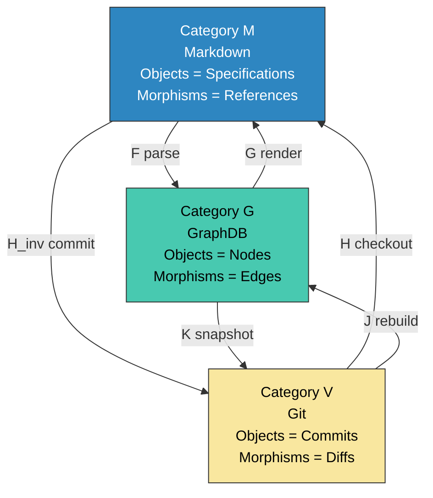
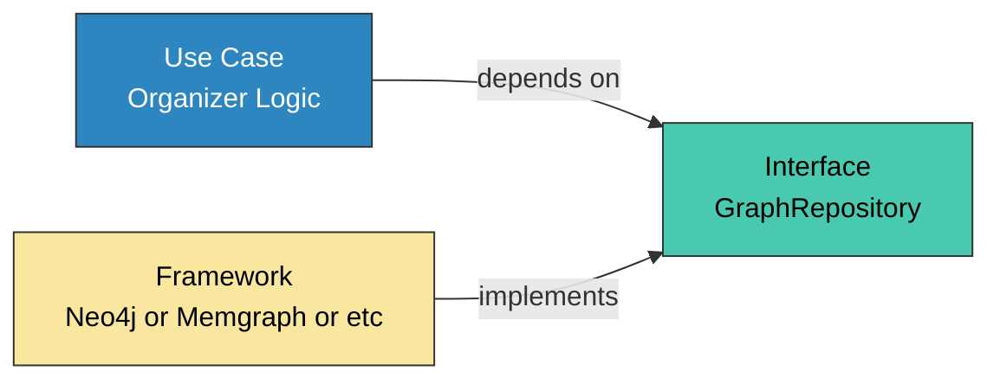
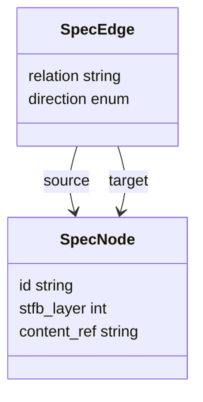
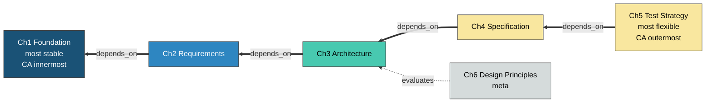
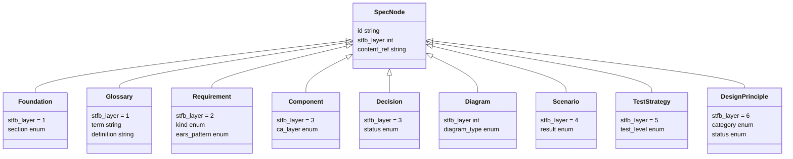
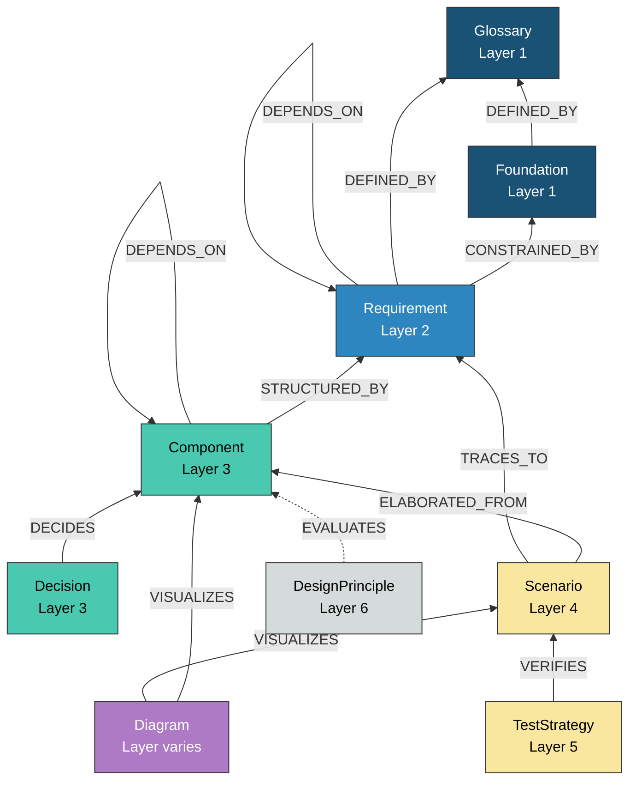
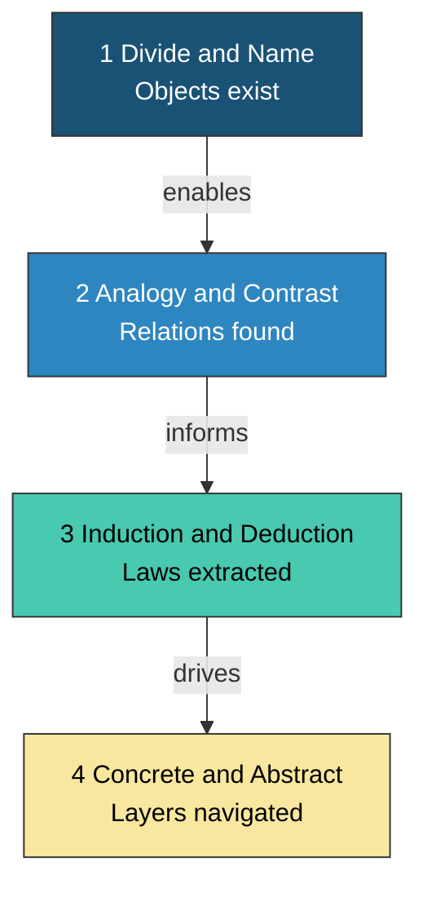
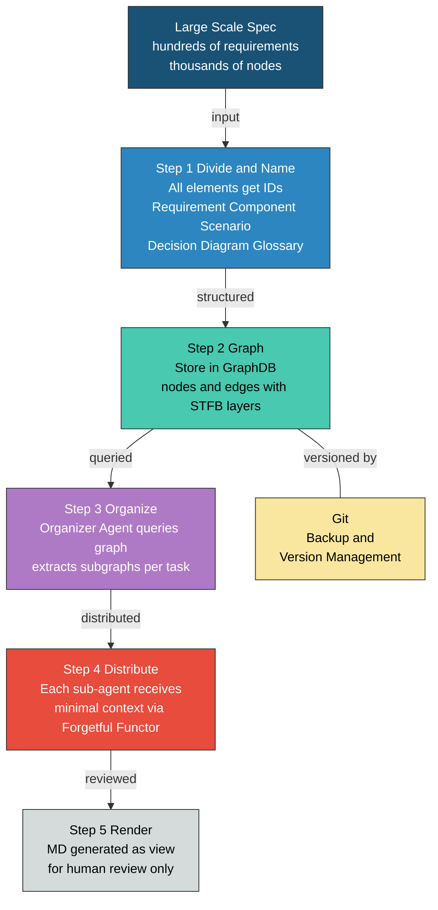

````markdown
## ドラフト(作成中のα版)

# ANGS (AI-Native Graph Spec) — グラフ構造による仕様管理とエージェント協調

## Abstract

AI駆動開発における仕様書は、プロジェクト規模に応じて三段階の体系を構成する。ANMS（AI-Native Minimal Spec: 単一ファイル）、ANPS（AI-Native Plural Spec: 複数ファイル分割）、ANGS（AI-Native Graph Spec: GraphDB活用）であり、いずれもSTFB（上剛下柔）の設計原則を共有する。ANMSは単一コンテキストウィンドウに収まる規模、ANPSは収まらないがGraphDB不要な中規模に対応する[1]。本論文では第3段階であるANGSを提案する。ANMSおよびANPSのMarkdown線形構造では大規模ソフトウェアの仕様要素間の依存関係を管理しきれない。ANGSはANMSの階層構造（STFB）を保持したまま、大規模仕様を管理するための設計である。核心は4つの設計原則に集約される。(1) Markdown・GraphDB・Gitの三要素を圏論の三角関係として概念化する。(2) Markdownは中継点ではなくビューである。(3) GraphDBにバージョニング機能は不要であり、履歴管理はGitに委託する。(4) GraphDBはClean ArchitectureのFramework層に過ぎず、DIPにより差し替え可能にする。これらの原則に基づき、STFB層とClean Architectureの依存方向を統一したグラフスキーマを定義し、圏論の忘却関手によるコンテキスト最小化とオーガナイザーエージェントによるサブグラフ切り出しの仕組みを示す。

## Keywords

ANGS, ANMS, STFB, GraphDB, Category Theory, Clean Architecture, CQRS, Multi-Agent, Specification Management

---

## 1. はじめに — ANMSの限界

### 1.1 ANMSの設計前提

ANMS（AI-Native Minimal Spec）は、AI駆動開発のための仕様書テンプレートである[1]。STFB（Stable Top, Flexible Bottom — 上剛下柔）の章構成により変更の波及範囲を構造的に制御し、EARS・Gherkin・Mermaidのハイブリッド記法で論理的厳密性と視覚的設計同期を両立する。

ANMSは中小規模ソフトウェアに最適化されている。その設計前提は「単一の仕様書がAIのコンテキストウィンドウに収まること」である。中規模プロジェクトにはANPS（AI-Native Plural Spec）がこの前提を複数ファイル分割で拡張するが、依然としてMarkdownの線形構造に依存する。

### 1.2 大規模ソフトウェアでの課題

大規模ソフトウェアでは、この前提が2つの理由で破綻する。

| #   | 課題                     | 説明                                                                           |
| --- | ------------------------ | ------------------------------------------------------------------------------ |
| 1   | コンテキストサイズの限界 | LLMのコンテキストウィンドウに大規模仕様の全体は入らない                        |
| 2   | 大規模な仕様群の管理     | 数百〜数千の要求、コンポーネント、シナリオの依存関係を人手で追跡するのは不可能 |

### 1.3 本論文の目的

本論文の目的は、ANMSのSTFB階層構造を保持したまま、大規模プロジェクトにおける仕様管理とエージェント協調の設計を示すことである。

### 1.4 第1論文との関係 — 何が変わり、何が変わらないか

第1論文[1]ではMarkdown単一ファイルに全情報を集約することを仕様書構成の基本コンセプトとした。
本論文は仕様の本体を $\mathcal{M}$ （Markdown）から $\mathcal{G}$ （GraphDB）に移し、Markdownをビューとして再定義する。これは表現媒体の抽象度を一段上げる拡張であり、第1論文のSTFB×CA依存方向の構造はそのまま継承する。

**変わること — 表現媒体:**

大規模になると、Markdownの線形構造では仕様要素間の依存関係を表現しきれない。GraphDBはノードとエッジで依存関係を直接モデル化できるため、Markdownより一段高い抽象度で仕様を管理できる。この抽象度の引き上げが、大規模スケーリングの核心である。

**変わらないこと — STFB×CA依存方向の構造:**

一方、仕様の内部構造 — すなわちSTFBの階層構成とClean Architectureの依存方向 — は第1論文と同一である。Markdownの章構成で表現していた「安定な上位層に柔軟な下位層が依存する」という原則を、グラフスキーマの `direction` 制約（forward / trace / meta）として再実装する。器は変わるが、器の中の構造は変わらない。

| 観点           | ANMS（第1論文）                        | ANPS                                     | ANGS（本論文）                           |
| -------------- | -------------------------------------- | ---------------------------------------- | ---------------------------------------- |
| 表現媒体       | Markdown単一ファイル                   | 複数Markdownファイル + Common Block      | GraphDB + Git（MDはビュー）              |
| 仕様の内部構造 | STFB × CA依存方向                      | STFB × CA依存方向（同一）                | STFB × CA依存方向（同一）                |
| 適用規模       | 単一コンテキストウィンドウに収まる規模 | 収まらないが、GraphDB不要な中規模        | 大規模                                   |
| 関係           | —                                      | ANMSのファイル分割拡張                   | 表現の抽象度を上げた別解（対立ではない） |

三者はスケールによって使い分ける関係にある。ANPSはANMSとANGSの間を埋める中間段階であり、Common Blockによるファイル管理とチャプター分割（spec-foundation / spec-architecture）で中規模プロジェクトに対応する。

---

## 2. 設計原則

### 2.1 仕様管理を圏論で概念化

仕様管理に関わる三要素 — Markdown、Git、GraphDB — を圏論の三圏として定義する。

| 圏                       | 管理対象       | 対象（Object）              | 射（Morphism）         |
| ------------------------ | -------------- | --------------------------- | ---------------------- |
| $\mathcal{M}$ (Markdown) | 表現（ビュー） | IDを持つ仕様セクション      | セクション間の相互参照 |
| $\mathcal{G}$ (GraphDB)  | 構造（空間軸） | ノード = 仕様要素           | エッジ = 依存関係      |
| $\mathcal{V}$ (Git)      | 変遷（時間軸） | コミット = スナップショット | diff = 履歴変遷        |

重要なのは、これらが直線 $\mathcal{V} \leftrightarrow \mathcal{M} \leftrightarrow \mathcal{G}$ ではなく、三角関係を構成することである。

**Three_Categories:**



上図は3つの圏が三角形を構成し、どの2圏間にも双方向の関手が存在することを示す。6つの関手を以下に定義する。

| 関手                                  | 方向          | 意味                                                   |
| ------------------------------------- | ------------- | ------------------------------------------------------ |
| $F: \mathcal{M} \to \mathcal{G}$      | MD → GraphDB  | パース。MDから構造を抽出しグラフ化する                 |
| $G: \mathcal{G} \to \mathcal{M}$      | GraphDB → MD  | レンダリング。グラフをMDに表現する                     |
| $H: \mathcal{V} \to \mathcal{M}$      | Git → MD      | チェックアウト。バージョンをMDとして展開する           |
| $H^{-1}: \mathcal{M} \to \mathcal{V}$ | MD → Git      | コミット。MDの変更をバージョンとして記録する           |
| $J: \mathcal{V} \to \mathcal{G}$      | Git → GraphDB | 再構築。バージョンからグラフを直接構築する             |
| $K: \mathcal{G} \to \mathcal{V}$      | GraphDB → Git | スナップショット。グラフ状態をバージョンとして記録する |

三角関係の核心は $\mathcal{V} \leftrightarrow \mathcal{G}$ の直接経路（ $J$ と $K$ ）が存在することである。直線関係では $\mathcal{M}$ がボトルネックかつ単一障害点になるが、三角関係ではMDを経由せずにGitとGraphDBが直接やりとりできる。

可換条件 $F \circ H \cong J$ は、MD経由の経路（checkout→parse）と直接経路（rebuild）が同じグラフを返すことを意味する。これは「MDとGraphDBの間に不整合がない」ことの検証指針であり、パース処理やレンダリング処理の実装が正しいかを確認するためのテスト基準として機能する。

**圏論の位置づけに関する注記:** 本設計では圏論を形式的証明ではなく概念化ツールとして使用する。3要素の関係を統一的に記述し、可換性の破れを設計レベルで検知するための言語である。圏の公理（結合律、単位元の存在）の厳密な証明は本論文の範囲外とする。

### 2.2 Markdownは中継点ではなくビュー

三角関係から導かれる本質的な帰結：Markdownは仕様の本体ではない。

- 仕様の本体は $\mathcal{G}$ （GraphDB = 構造）である。 $\mathcal{V}$ （Git）は構造の変遷を管理する手段に過ぎない
- $\mathcal{M}$ （Markdown）は $\mathcal{G}$ からのレンダリング結果 — ビューに過ぎない
- エージェント間のやりとりにMDは必須ではない
- 人間のレビュー時にのみMDにレンダリングすればよい

これにより、エージェントはグラフを直接操作し、人間が確認したいときだけMDを生成するアーキテクチャが正当化される。

### 2.3 GraphDBのバージョン管理はGitに委託する

GraphDBに履歴管理機能（Temporal Table等）を持たせると、スキーマが複雑化する。GraphDBは「現在の仕様構造」の参照に専念させ、バージョン管理はGitに委託する。

| 責務       | 担当                      | 操作                         |
| ---------- | ------------------------- | ---------------------------- |
| 履歴管理   | Git ( $\mathcal{V}$ )     | 変更の記録、過去状態の保持   |
| 構造の参照 | GraphDB ( $\mathcal{G}$ ) | 構造の走査、依存関係のクエリ |

過去のグラフが必要になった場合は、2.1節で定義した $J: \mathcal{V} \to \mathcal{G}$ 関手（Git → GraphDB の再構築）で復元すればよい。Gitはここではバックアップ兼バージョン管理の手段であり、それ以上の役割は持たない。GraphDBのスキーマは「現在の構造」のみに専念でき、設計が大幅に簡素化される。

### 2.4 GraphDBは何でもいい（ようにしておく）

本設計の目的は「要求管理と構成管理」であり、GraphDBは目的を実現する手段に過ぎない。Robert C. MartinのClean Architectureにおける依存性逆転原則（DIP）に従い、GraphDBはFramework層の実装詳細として扱う[2]。

**DIP_Architecture:**



上図はDIPに基づく依存関係を示す。Use Case層はInterface（GraphRepository）にのみ依存し、具体的なDB実装（Neo4j, Memgraph等）はInterfaceを実装する。DBの差し替えがエージェント側のコードに影響しない。大事なのはDB選定ではなく、データ構造の定義である。

---

## 3. グラフスキーマ — データ構造の定義

データ構造の定義が本設計の核心である。アルゴリズム（サブグラフ切り出し、影響分析等）はデータ構造から導かれる。

### 3.1 抽象スキーマ — SpecNode と SpecEdge

グラフの本質は2つだけ。ノードとエッジ。

**Abstract_Schema:**



上図はANGSグラフの抽象データ構造を示す。全てのノードは `SpecNode` であり、全てのエッジは `SpecEdge` である。

**SpecNode — 仕様要素の抽象表現:**

| パラメータ    | 型        | 説明                                                                               |
| ------------- | --------- | ---------------------------------------------------------------------------------- |
| `id`          | string    | 仕様要素の一意識別子。接頭辞でノード種別を示す（例: `FR-001`, `CMP-003`）          |
| `stfb_layer`  | int (1-6) | STFB階層。1が最も安定（CA最内層）、5が最も柔軟（CA最外層）、6はメタ層              |
| `content_ref` | string    | Markdown上の実体への参照パス。MDはビューであり、この参照を通じてレンダリングされる |

**SpecEdge — 仕様要素間の関係:**

| パラメータ  | 型       | 説明                                                                  |
| ----------- | -------- | --------------------------------------------------------------------- |
| `relation`  | string   | エッジの種別。具体的な関係を示す（例: STRUCTURED_BY, CONSTRAINED_BY） |
| `direction` | enum     | エッジの方向制約。forward / trace / meta の3種                        |
| `source`    | SpecNode | エッジの起点。依存する側（CA外側、柔軟層）                            |
| `target`    | SpecNode | エッジの終点。依存される側（CA内側、安定層）                          |

矢印の向きはClean Architectureの依存方向に従う。**外側（柔軟）が内側（安定）に依存する。** sourceはtargetを知るが、targetはsourceを知らない。

### 3.2 エッジの方向制約 — CAとSTFBの統一

SpecEdge の `direction` は3種のみ。この制約だけで、CAの依存性逆転原則（DIP）がグラフレベルで強制される。

| direction | ルール                                 | 意味                                          |
| --------- | -------------------------------------- | --------------------------------------------- |
| forward   | source.stfb_layer >= target.stfb_layer | 外側→内側。CA依存方向                         |
| trace     | source.stfb_layer < target.stfb_layer  | 内側→外側。CA例外。トレーサビリティ用途に限定 |
| meta      | source.stfb_layer = 6                  | メタ層からの横断評価                          |

ANMSのSTFB（安定依存の原則）とClean Architectureの依存方向は本質的に同じである。STFBは「安定な上位層に柔軟な下位層が依存する」、CAは「安定な内側層に柔軟な外側層が依存する」。表現が違うだけで、依存の矢印は同じ方向を向く。

**STFB_CA_Unified:**



上図はSTFBの6層構造とCA依存方向の統一を示す。矢印はCAの依存方向に従い、柔軟層（外側）から安定層（内側）へ向かう。Ch6（メタ）は横断的に評価を行う。

### 3.3 外部仕様の取り込み — ISO・RFC等の扱い

プロジェクトが参照する外部仕様（ISO規格、RFC、業界標準等）は、原文をそのままグラフに格納しない。AIエージェントが外部仕様を解釈し、プロジェクトに関連する要素をSpecNodeとして抽出・再構成した上でグラフに取り込む。外部仕様の原文はソースとして参照リンクを保持するが、グラフ上の実体はあくまでプロジェクト固有の解釈済みノードである。

これにより、外部仕様の曖昧さや冗長さがグラフに持ち込まれることを防ぎ、STFB層とCA依存方向の制約をプロジェクト全体で一貫して適用できる。

### 3.4 具体ノードタイプ

SpecNode を各STFB層ごとに具体化する。各具体ノードはSpecNodeを継承し、層固有のプロパティを追加する。

**Concrete_Node_Types:**



上図はSpecNodeから各具体ノードタイプへの継承関係を示す。各ノードは共通プロパティ（id, stfb_layer, content_ref）を継承し、固有プロパティを追加する。

| STFB層      | ノードタイプ    | ANMS章    | 固有プロパティ              |
| ----------- | --------------- | --------- | --------------------------- |
| 1（最安定） | Foundation      | Ch1       | section                     |
| 1           | Glossary        | Ch1       | term, definition            |
| 2           | Requirement     | Ch2       | kind, ears_pattern          |
| 3           | Component       | Ch3       | ca_layer                    |
| 3           | Decision        | Ch3 (ADR) | decision_status             |
| varies      | Diagram         | Ch3       | diagram_type                |
| 4           | Scenario        | Ch4       | scenario_result             |
| 5（最柔軟） | TestStrategy    | Ch5       | test_level                  |
| 6（メタ）   | DesignPrinciple | Ch6       | category, compliance_status |

### 3.5 具体エッジタイプ — CA依存方向の徹底

全てのエッジはCAの依存方向に従い、外側（柔軟層）から内側（安定層）へ向かう。

**Concrete_Edge_Types:**



上図は全ノードタイプ間の具体的なエッジタイプと方向を示す。全ての矢印はCAの依存方向（外側→内側）に従う。実線はforward、点線はmeta。色はSTFB層に対応する。

| エッジ          | source（依存する側）      | target（依存される側） | direction | 意味                                   |
| --------------- | ------------------------- | ---------------------- | --------- | -------------------------------------- |
| CONSTRAINED_BY  | Requirement               | Foundation             | forward   | 要求は基本事項に制約される             |
| STRUCTURED_BY   | Component                 | Requirement            | forward   | コンポーネントは要求により構造化される |
| ELABORATED_FROM | Scenario                  | Component              | forward   | シナリオはコンポーネントから展開される |
| VERIFIES        | TestStrategy              | Scenario               | forward   | テスト戦略がシナリオを検証する         |
| EVALUATES       | DesignPrinciple           | Component              | meta      | 設計原則がコンポーネントを評価する     |
| TRACES_TO       | Scenario                  | Requirement            | forward   | シナリオから要求へのトレーサビリティ   |
| DEPENDS_ON      | Node                      | Node 同種              | forward   | 同種ノード間の依存                     |
| DECIDES         | Decision                  | Component              | forward   | 設計判断がコンポーネントを決定する     |
| DEFINED_BY      | Foundation or Requirement | Glossary               | forward   | 仕様要素が用語定義に依存する           |
| VISUALIZES      | Diagram                   | any Node               | forward   | 図が仕様要素を可視化する               |

---

## 4. 認知操作 — 仕様設計のプリミティブ

仕様を扱う上で根本となる4つの認知操作ペアを定義する。人間の設計行為もAIエージェントの推論も、全てこの4ペアの組み合わせで記述できる。根拠：グラフを操作するにはノードの生成（分割/命名）、ノード間関係の発見（類比/対比）、関係からの法則抽出（帰納/演繹）、層間の移動（具体/抽象）の4操作が必要十分であり、これ以上分解できない。

| #   | ペア            | 順方向                   | 逆方向                   |
| --- | --------------- | ------------------------ | ------------------------ |
| 1   | **分割 / 命名** | 対象を分ける             | 分けたものに名前をつける |
| 2   | **類比 / 対比** | 共通点を見出す           | 相違点を見出す           |
| 3   | **帰納 / 演繹** | 具体例から法則を抽出する | 法則から具体を予測する   |
| 4   | **具体 / 抽象** | パラメータを加える       | パラメータを取り除く     |

### 4.1 分割 / 命名 — 第一原理

> 「分かる」とは「分ける」こと。分けたものに名前をつけて初めて、操作可能になる。

分割と命名がない仕様はグラフDBに格納できない。IDがなければエッジを張れない。エッジがなければ走査できない。走査できなければエージェントに切り出せない。

$$
\text{Divide}(spec) \to \{e_1, e_2, \ldots, e_n\}
$$

$$
\text{Name}(e_i) \to (id_i, e_i) \quad \forall i
$$

分割/命名がない仕様 = グラフ圏 $\mathcal{G}$ の対象が定義できない = 圏が存在しない。よって、分割と命名は他の3操作すべての前提条件である。

**Cognitive_Operations_Dependency:**



上図は4つの認知操作の依存関係を示す。分割/命名が全操作の基盤であり、類比/対比が帰納/演繹に情報を提供し、帰納/演繹が具体/抽象の層移動を駆動する。

### 4.2 グラフ操作への対応

| 認知操作 | グラフDB操作               | 用途                             |
| -------- | -------------------------- | -------------------------------- |
| 分割     | ノードの作成               | 仕様要素の定義                   |
| 命名     | ノードプロパティid設定     | ID体系の確立                     |
| 類比     | 共通パターンのノード群検出 | クラスタリング、コミュニティ検出 |
| 対比     | クラスタ境界の特定         | サブグラフの分割点決定           |
| 帰納     | 複数ノードの共通上位抽出   | パターン発見、要求カバレッジ分析 |
| 演繹     | 上位ノードからの下位展開   | 影響分析、未定義シナリオの導出   |
| 具体化   | プロパティ/エッジの追加    | STFB層の下降（自由関手）         |
| 抽象化   | プロパティ/エッジの除去    | STFB層の上昇（忘却関手）         |

---

## 5. オーガナイザーによるコンテキスト配分

1.2節で示した2つの課題 —（1）コンテキストサイズの限界と（2）大規模な仕様群の管理 — に対し、オーガナイザーエージェントがグラフからタスク単位のサブグラフを切り出してサブエージェントに配分することで解決する。

**organizer と orchestrator の関係に関する注記:** 本論文で「オーガナイザー（organizer）」と呼ぶエージェントは、full-auto-dev フレームワークのプロセス規則で定義される「orchestrator」エージェントと現時点では同一の役割を異なる文脈で呼んだものである。orchestrator はプロセス管理の文脈、organizer はグラフ走査によるコンテキスト配分の文脈で使用する。将来的にグラフ走査の責務が独立した場合、organizer は orchestrator から分離した専用エージェントとなる可能性がある。

### 5.1 全体フロー

**Solution_Overview:**



上図は大規模ANGS運用の全体フローを示す。仕様のID付与とグラフ化を経て、オーガナイザーがサブグラフを切り出し、各エージェントに最小コンテキストを配分する。MDは最終段の人間レビュー用ビューとしてのみ生成される。Gitはバックアップとバージョン管理を担う。

### 5.2 オーガナイザーの動作 — 認知操作の連鎖

オーガナイザーがサブエージェントに仕事を配分する過程は、4つの認知操作の連鎖として記述できる。

| Step | 認知操作ペア | オーガナイザーの動作                                                             |
| ---- | ------------ | -------------------------------------------------------------------------------- |
| 1    | 分割/命名    | STFB層とドメイン境界でグラフを分割し、各タスクにID（TASK-001〜TASK-n）を付与する |
| 2    | 類比/対比    | 関連ノードをクラスタリングし、独立した関心事を分離する                           |
| 3    | 帰納/演繹    | タスク横断の共通コンテキストを抽出し、サブエージェント別の具体指示を導出する     |
| 4    | 具体/抽象    | 忘却関手により不要な詳細を除去し、各サブエージェントに最小コンテキストを生成する |

忘却関手（Forgetful Functor）による最小化がこのフローの鍵である。サブエージェントはフルグラフを受け取る必要がない。自身のタスクに関連するサブグラフのみを受け取ることで、LLMのコンテキストウィンドウの制約を回避する。

### 5.3 忘却関手によるコンテキスト最小化

（本セクションは今後詳細化予定）

### 5.4 主要アルゴリズム

データ構造（グラフスキーマ）が定義されたことで、以下のアルゴリズムが導かれる。

| アルゴリズム         | 認知操作     | 入力 → 出力                                  |
| -------------------- | ------------ | -------------------------------------------- |
| 影響分析             | 演繹         | 変更ノード → 影響を受けるノード集合          |
| トレーサビリティ走査 | 類比         | 要求ID → 関連シナリオ/テスト/コンポーネント  |
| サブグラフ切り出し   | 分割 + 対比  | ルートノード + ホップ数 → 部分グラフ         |
| 要求カバレッジ分析   | 帰納         | シナリオ集合 → 未カバーの要求                |
| コンテキスト削減     | 抽象（忘却） | フルグラフ → エージェント用最小グラフ        |
| バージョン差分       | 対比         | コミットA, コミットB → 変更ノード/エッジ集合 |

---

## 6. 考察 — プログラミング史における位置づけ

### 6.1 プログラミング言語と抽象化の歴史

プログラミングの歴史は、抽象度を上げる歴史である。

| 世代 | 代表言語             | パラダイム        | 抽象化の対象                 | 人間が書くもの       |
| ---- | -------------------- | ----------------- | ---------------------------- | -------------------- |
| 0    | 配線 / パッチパネル  | ハードワイヤード  | なし                         | 物理的な接続そのもの |
| 1    | マシン語             | 命令列            | 配線                         | ビット列             |
| 2    | C                    | 手続き型          | ハードウェア                 | メモリ操作、制御構造 |
| 3    | C++                  | オブジェクト指向  | データと手続きの結合         | クラス、継承、多態   |
| 4    | Java / Python        | VM / インタプリタ | メモリ管理、プラットフォーム | ビジネスロジック     |
| 5    | フレームワーク / DSL | 宣言的記述        | 定型処理、インフラ           | 設定と差分           |
| 6    | AI Coding            | 仕様駆動生成      | コード生成そのもの           | 仕様と制約           |

各世代で「人間が直接触る具体」が一段上がり、それまで手動だった層が自動化される。本質的情報が集約され、非本質的な記述が消えていく。

### 6.2 抽象化と制約の不可分性

しかし、抽象化には代償がある。**抽象化の精度が低いと、具体に欠陥が生じる。**

| 世代 | 代表言語             | 抽象化の代償                        | 導入された制約                |
| ---- | -------------------- | ----------------------------------- | ----------------------------- |
| 1    | マシン語             | 命令列の手動管理 → 人的ミス         | アセンブラによるニーモニック  |
| 2    | C                    | ポインタ操作ミス → メモリ破壊       | 型システム                    |
| 3    | C++                  | 継承の乱用 → 複雑性爆発             | デザインパターン、SOLID原則   |
| 4    | Java / Python        | フレームワーク依存 → ロックイン     | DIP、Clean Architecture       |
| 5    | フレームワーク / DSL | 設定の組合せ爆発 → 暗黙の挙動       | Convention over Configuration |
| 6    | AI Coding            | コンテキスト喪失 → ハルシネーション | **ANMS / ANGS（本提案）**     |

抽象度が上がるほど、生成される具体の量が増える。人間が全てを検証するのは不可能になる。だから、**抽象化の各段階で制約を導入し、具体の品質を構造的に保証する必要がある。**

### 6.3 本提案の位置づけ

AI Coding世代では、人間は「仕様と制約」を書き、AIが「コード」を生成する。このとき制約が不十分だと、AIはコンテキストを失い、仕様と矛盾した実装を生む。

ANMS（単一MD規模）とANGS（グラフ規模）は、この世代における制約の提案である。

| ANMS / ANGSの制約 | 守るもの                 | 手段                                     |
| ----------------- | ------------------------ | ---------------------------------------- |
| STFB（上剛下柔）  | 変更の波及方向           | 安定依存の原則による章構成               |
| EARS + Gherkin    | 要求の一義性と検証可能性 | 構造化された記法                         |
| グラフスキーマ    | 仕様要素間の依存関係     | 圏論に基づくノードとエッジの型定義       |
| CA依存方向        | 依存の逆転防止           | direction制約（forward / trace / meta）  |
| 責務分離          | 構造と履歴管理の分離     | GraphDB = 構造参照、Git = バージョン管理 |

型システムがC言語のメモリ操作に制約を与えたように、ANGSのグラフスキーマはAI Codingの仕様解釈に制約を与える。SOLID原則がオブジェクト指向の複雑性に構造を与えたように、STFBとCA依存方向がAIエージェント間の協調に構造を与える。

これは特異な提案ではない。プログラミングの歴史における「抽象度を上げ、制約で品質を担保する」という一貫したパターンの、次のステップである。

---

## 7. 結論

本論文ではANMSを大規模ソフトウェアに適用するための手法として、ANGS (AI-Native Graph Spec) を示した。

**4つの設計原則:**

1. **三圏の三角関係** — M・G・Vを圏論で概念化し、6つの関手で接続する
2. **MDはビュー** — 仕様の本体は $\mathcal{G}$ （GraphDB）であり、MDはレンダリング結果。 $\mathcal{V}$ （Git）は変遷管理の手段
3. **バージョン管理はGitに委託** — GraphDBは現在の構造に専念し、履歴管理はGitに任せる
4. **GraphDBはFramework層** — DIPにより差し替え可能にする。大事なのはデータ構造

**グラフスキーマ:**

- 抽象レベル（SpecNode + SpecEdge）と具体レベル（9ノードタイプ + 10エッジタイプ）の2層構造
- エッジ方向はClean Architectureの依存方向に従い、外側（柔軟）が内側（安定）に依存する
- STFBとCAの依存方向は同一であり、 `direction` の3値（forward / trace / meta）だけでDIPがグラフレベルで強制される

**エージェント協調:**

- オーガナイザーがグラフを走査し、4つの認知操作（分割/命名 → 類比/対比 → 帰納/演繹 → 具体/抽象）の連鎖でサブエージェントにコンテキストを配分する
- 忘却関手による最小化がコンテキストウィンドウの制約を回避する鍵

---

## References

1. 著者. "AIドリブン SW開発時代における仕様書テンプレートの提案" — ANMS原論文
2. Martin, R.C. "The Clean Architecture" — Stable Dependencies Principle (SDP), Dependency Inversion Principle (DIP)
3. Young, G. "CQRS Documents" — Command Query Responsibility Segregation
4. Mavin, A., et al. "EARS: Easy Approach to Requirements Syntax" — IEEE, 2009
5. Cucumber. "Gherkin Reference"
````
