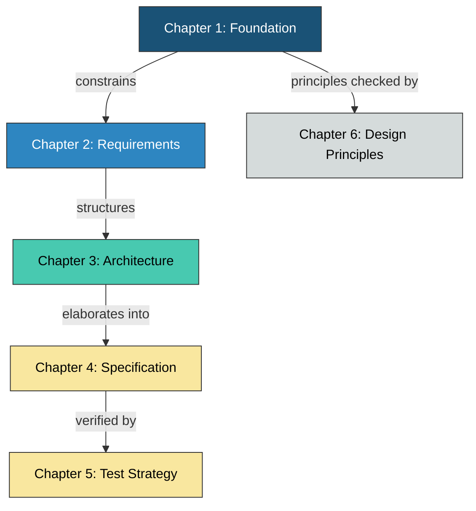
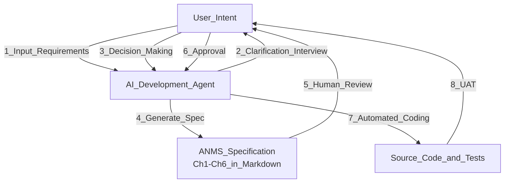
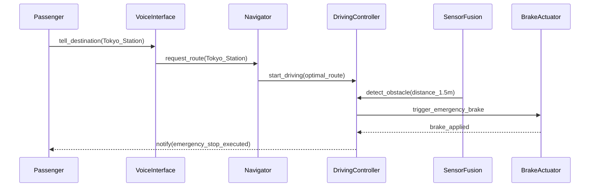

# Title: AIドリブン SW開発時代における仕様書テンプレートの提案

## Abstract

LLM（大規模言語モデル）の急速な進化により、ソフトウェア開発は人間がコードを書く時代から、AIが仕様書を解釈してコードを生成する時代へと移行している。しかし、従来の重厚な仕様書はAIにとって冗長であり、一方で断片的な指示はシステム全体の整合性を欠く「コンテキスト喪失」を招く。本論文では、人間とAIが共通の設計基盤として参照し、開発をほぼ全自動化するための新しい仕様書テンプレート「AI-Native Minimal Spec (ANMS)」を提案する。ANMSは安定依存の原則に基づく「STFB（上剛下柔）」の章構成を採用し、EARS・Gherkin・Mermaidを組み合わせることで、論理的な厳密性と視覚的な設計同期を両立する。これにより、人間によるレビュー効率とAIの実装精度を最大化することを目的とする。

本提案は、プロジェクト規模に応じた三段階の仕様体系の第1段階に位置づけられる。ANMS（単一ファイル、1コンテキストウィンドウに収まる規模）、ANPS（AI-Native Plural Spec: 複数ファイル分割、中規模）、ANGS（AI-Native Graph Spec: GraphDB活用、大規模）[2]の三段階であり、いずれもSTFBの設計原則を共有する。本論文ではANMSを定義し、ANPSおよびANGSへのスケーリングパスについても述べる。

## Keywords

LLM-driven Development, AI-Native Specification, Requirements Engineering, EARS, Gherkin, Mermaid, STFB, Human-in-the-Loop

## Introduction

従来のソフトウェア開発における仕様書（IEEE 830等）は、人間同士のコミュニケーションを主眼に置いていた。しかし、AI駆動開発において仕様書は「プロンプトの源泉」であり、「実装の正当性を評価する検品仕様書」としての役割が求められる。

現在の主な問題点は以下の2点に集約される：

1. **冗長性とコストの乖離:** 厳格な標準（IEEE 29148やAUTOSAR SRSなど）は記述コストが極めて高く、アジャイルなAI開発のスピードを阻害する。
2. **曖昧性によるハルシネーション:** 自然言語のみの指示では、AIがシステムの制約や境界条件を勝手に推論し、意図しない挙動（fault）を埋め込むリスクがある。

本論文では、これらを解決するために、最小限の記述で最大の制御力を発揮する階層的仕様書フォーマットを定義する。提案するANMSの章構成の概要を以下に示す（詳細はテンプレート本体 ANMS_Spec_Template.md を参照）。

| Chapter | 名称                         | 役割                                       | 安定度     |
| ------- | ---------------------------- | ------------------------------------------ | ---------- |
| 1       | Foundation（基本事項）       | プロジェクトの北極星。全章の前提            | 最も安定   |
| 2       | Requirements（要求）         | EARS + 数式 + 図による要求定義             | 安定       |
| 3       | Architecture（アーキテクチャ）| Mermaid による構造・設計判断の可視化       | やや安定   |
| 4       | Specification（仕様）        | Gherkin による受入基準の具体化             | よく変わる |
| 5       | Test Strategy（テスト戦略）  | テストレベル別の方針とマトリクス           | よく変わる |
| 6       | Design Principles Compliance | SW設計原則への準拠確認                     | レビュー時 |

## Proposed Approach

### STFB — 上剛下柔の設計原則

提案する「AI-Native Minimal Spec (ANMS)」の最大の特徴は、Robert C. Martin の安定依存の原則（Stable Dependencies Principle）に着想を得た章構成「STFB (Stable Top, Flexible Bottom) — 上剛下柔」である。

上位の章ほど安定し変更頻度が低く、下位の章ほど具体的で変更頻度が高い。上位章が変わると下位章の見直しが必要になるが、下位章の変更は上位章に影響しない。この単方向依存により、変更の影響範囲を予測可能にし、AIが参照すべきコンテキストの優先順位を構造的に示す。

**STFB_Layer_Structure:**



上図は STFB の層構造を示す。Ch1（最も安定）から Ch4（最も可変）へ向かって具体性が増し、Ch5 は Ch4 の検証、Ch6 は全体の品質保証をメタレベルで担う。

### 4層のハイブリッド記法

ANMSは情報を「基本事項」「要求」「構造」「具体的振る舞い」の4層に分離し、それぞれに最適な記法を割り当てる。

| 層           | 主な記法              | 役割                                         |
| ------------ | --------------------- | -------------------------------------------- |
| Foundation   | 自然言語 + テーブル   | プロジェクトの境界と前提を人間が定義する      |
| Requirements | EARS + 数式           | 一義的な要求をパターン化して記述する          |
| Architecture | Mermaid（色分け必須） | 責務の分離と依存方向を視覚的にAIと同期する    |
| Specification| Gherkin               | AIがテストコード生成に直接使用する受入基準    |

### 仕様書のライフサイクル

ANMSは固定された文書ではなく、人間が要求を提示し、AIとの対話によって図解と論理が肉付けされる「動的設計図（Living Documentation）」として運用される。

**Proposed_Specification_Lifecycle:**



上記は、ユーザーの意図から仕様書が生成され、コード化されてUATに至るまでの、提案する仕様書のライフサイクルである。

### 各章の設計意図

#### Chapter 1. Foundation（基本事項）

プロジェクトの「北極星」。Background, Issues, Goals, Approach, Scope, Constraints, Limitations, Glossary, Notation の9節で構成される。AI駆動開発では特に以下の3節が重要な役割を果たす。

- **Glossary（用語集）:** AIと人間で用語の解釈を揃える。ドメイン固有の語彙を明示的に定義することで、AIの誤解釈を防ぐ。
- **Notation（表記規約）:** RFC 2119/8174 に準拠し、SHALL/MUST=必須, SHOULD=推奨, MAY=任意 のキーワードを定義する。EARS 構文中の shall はこの SHALL と同義であることを明示する。
- **Limitations（制限事項）:** Scope（やらないこと）と Constraints（破れない制約）の間にある「既知の妥協点」を明示する。AIが完璧な実装を追求して過剰設計に陥ることを防ぐ。

#### Chapter 2. Requirements（要求）

EARS構文を基本とし、数式・テーブル・図など要求に適した形式を併用する。EARSは6つのパターン（Ubiquitous, Event-driven, State-driven, Unwanted Behavior, Optional Feature, Complex）を提供し、自然言語の曖昧さを排除する。数理的な要求（性能目標、閾値等）はEARSでは表現しきれないため、数式との併用を認める。

#### Chapter 3. Architecture（アーキテクチャ）

Mermaidによるコンポーネント図、クラス図、シーケンス図、状態遷移図でSWの構造を図示する。コンポーネント図・クラス図にはアーキテクチャレイヤーに基づく色分けを必須とする。Mermaidはレイアウト制御が弱いため、色分けがないと責務の境界が視覚的に判別不能になるためである。デフォルトではClean Architectureの4層（Entity / Use Case / Adapter / Framework）を凡例として提供し、他のアーキテクチャを採用する場合は独自凡例に差し替える。

設計判断はADR（Architecture Decision Records）として同章内に配置する。設計と根拠をセットで読めるようにするためであり、Appendixに追いやると参照が切れるリスクがある。

#### Chapter 4. Specification（仕様）

Gherkin形式によるUAT（User Acceptance Testing）の受入基準を定義する。Chapter 2 の要求を検証可能なシナリオとして具体化し、各シナリオに `(traces: FR-xxx)` 形式で要求IDを付記することでトレーサビリティを確保する。シナリオの直下にテスト結果（PASS / CONDITIONAL / FAIL / SKIP）を記録し、AIが埋めやすく人間がレビューしやすい構造とする。

#### Chapter 5. Test Strategy（テスト戦略）

テストレベル別の方針とマトリクスを定義する。個別テストケースの詳細はAIに委任し、ここでは「何をどのレベルでテストするか」のみを定義する。これにより、人間はテスト戦略に集中し、テストケースの量産はAIに任せるという役割分担が明確になる。

#### Chapter 6. Design Principles Compliance（SW設計原則 準拠確認）

Chapter 1-5 の「定義・設計・検証」とはメタレベルが異なる品質保証の層。KISS, YAGNI, DRY, SOLID 等の24のSW設計原則への準拠をチェックリスト形式で確認する。AI が生成したコードが工学的に妥当かどうかを、人間がレビューする際の観点を構造化する。

## Methods

本提案の妥当性を検証するため、現在流通している主要な仕様書形式およびフレームワークを調査した。

- **IEEE 29148:** 要求工学の国際標準。要求の質（一義性、検証可能性）を定義するが、記述コストが高く実運用では重厚すぎる。
- **arc42:** アーキテクチャ中心のテンプレート。Markdownとの親和性が高く、構造の定義に優れる。
- **RFC (Request for Comments):** IETFの標準化プロセスであり、設計意図の共有に特化している。「なぜその設計にしたか」という背景（Context）が厚い。
- **Gherkin (BDD):** 実行可能な仕様書。テストコード生成（テスト駆動開発）においてAIとの親和性が極めて高い。
- **EARS (Easy Approach to Requirements Syntax):** 簡潔な自然言語パターン。システムルールや例外処理、状態依存の挙動を厳密に定義するのに適している。

## Results

調査した既存テンプレートの比較結果を以下に示す。

**Comparison of Specification Formats:**

| フォーマット    | 網羅性 | 記述コスト | 人間可読性 | AI適性 | 備考                         |
| :-------------- | :----: | :--------: | :--------: | :----: | :--------------------------- |
| IEEE 29148      |   ◎    |     高     |     △      |   △    | 厳密だがAIには冗長           |
| arc42           |   ○    |     中     |     ○      |   ○    | 構造把握に最適               |
| RFC             |   △    |     低     |     ◎      |   △    | 意図の共有には良いが構造不足 |
| Gherkin         |   △    |     中     |     ◎      |   ◎    | テスト生成と直結             |
| **ANMS (提案)** | **◎**  |   **低**   |   **◎**    | **◎**  | **STFB + ハイブリッド記法**  |

分析の結果、単一のフォーマットではAI開発の全工程をカバーできないことが判明した。そのため、上位要求にはEARS、詳細動作にはGherkin、構造把握にはMermaidを組み合わせる「ハイブリッド形式」がAI開発に最適（最も効率的）であるという結論に至った。さらに、これらを STFB の原則に従って安定度順に配置することで、変更の波及範囲を構造的に制御できる。

## Discussion

本セクションでは、提案するフォーマットの妥当性と、AI駆動開発における設計上の考察を述べる。

### 1. STFB がもたらす変更耐性

従来の仕様書は章の順序に設計原則がなく、1箇所の変更が文書全体に波及するリスクがあった。STFBでは安定依存の原則により、変更は常に下位章にのみ波及する。たとえば、Gherkinシナリオ（Ch4）の追加・変更はFoundation（Ch1）やRequirements（Ch2）に影響しない。これはAIにとっても有益であり、変更時に再読み込みすべきコンテキストの範囲を最小化できる。

### 2. 図解（Mermaid）は「設計」そのものである

AI開発において、Mermaid等による図解は単なる補助ではなく、ソフトウェア設計そのものである。人間は数千行のコードから設計ミス（責務の重複など）を見つけるのは困難だが、図解によって構造の歪みを即座に認識できる。AIにとっても、構造化テキストである図解データは、正確なクラス構成やファイル分割、継承関係を決定する際の強力な制約（Blueprint）となる。レイヤー色分けを必須とすることで、この視覚的な設計同期を確実にする。

### 3. 人間が担当すべき「最低限」の役割

全自動開発においても、以下の3つのステップは人間が主導しなければならない：

1. **要求の提示:** ソフトウェアのコンセプトと解決したい課題の定義（Ch1 Foundation）。
2. **重要な意思決定:** 技術選定や仕様の分岐点における最終判断（Ch3 Architecture Decisions）。
3. **受入テスト (UAT):** 生成物がビジネス要求を満たしているかの最終承認（Ch4 Specification の Result 判定）。

### 4. 数理的な妥当性の定義

要求の集合 $R$ (Requirements) において、個々の要求 $r$ (requirement) $r \in R$ が有効 (Valid) であるためには、以下の条件が必要である。

$$
\forall r \in R, \quad Valid(r) \iff Unambiguous(r) \land Verifiable(r)
$$

ここで、 $Valid(r)$ とは「AIが迷いなく実装可能であり、かつその正しさを自動判定できる状態」を指す。EARSは「一義性（ $Unambiguous$ ）」を、Gherkinは「検証可能性（ $Verifiable$ ）」をそれぞれ担保することで、この数理的条件を満たし、AIが生成したコードの正当性を自動的に検証可能にする。Ch6 の Design Principles Compliance は、この Valid な要求から生成された実装が工学的にも妥当であることを保証する補完的な層として機能する。

## Scaling: Three-Level Spec Hierarchy（スケーリング: 三段階仕様体系）

ANMSは「1コンテキストウィンドウに収まる」前提で設計した。この前提が破綻する規模のプロジェクトに対応するため、以下の三段階のスケーリングパスを定義する。

| Level | 略称 | 正式名称 | 表現 | 規模 |
|:-----:|------|----------|------|------|
| 1 | ANMS | AI-Native Minimal Spec | 単一Markdownファイル | 1コンテキストウィンドウに収まる |
| 2 | ANPS | AI-Native Plural Spec | 複数Markdownファイル + Common Block | 収まらないが、GraphDB不要 |
| 3 | ANGS | AI-Native Graph Spec | GraphDB + Git（MDはビュー） | 大規模 |

**三段階の設計原則:**

- いずれの段階もSTFB（上剛下柔）の章構成を共有する
- 上位段階は下位段階の拡張であり、対立ではない
- プロジェクト開始時に規模を判断し、適切な段階を選択する

**ANPS（Level 2）の概要:**

ANPSは、ANMSのSTFB構造を保持したまま、チャプター単位でファイルを分割する。分割単位は仕様のオーナーシップ境界に従う: spec-foundation（Ch1-2: srs-writerが作成）と spec-architecture（Ch3-6: architectが詳細化）。各ファイルにはCommon Block（文書の識別・状態・ワークフロー情報）およびForm Block（タイプ固有の構造化フィールド）を付与し、エージェント間の協調を文書構造で保証する。

**ANGS（Level 3）の概要:**

ANGSは、仕様の本体をMarkdownからGraphDBに移し、Markdownをビューとして再定義する。Markdown・GraphDB・Gitの三要素を圏論の三角関係として概念化し、忘却関手によるコンテキスト最小化を実現する。詳細は別論文[2]を参照。

## Conclusion

本論文では、AI全自動開発のための「ANMS」テンプレートを提案した。STFB（上剛下柔）の章構成により変更の波及範囲を構造的に制御し、EARS・Gherkin・Mermaidのハイブリッド記法により、各層に最適な形式で仕様を記述する。6章構成（Foundation / Requirements / Architecture / Specification / Test Strategy / Design Principles Compliance）により、定義・設計・検証・品質保証の全工程をカバーしつつ、AIのコンテキストウィンドウに収まる簡潔さを維持する。このフォーマットを「生きたドキュメント（Living Documentation）」として運用することで、仕様変更に強く、AIによる実装の正確性を最大化する開発が実現可能となる。

## References

1. Martin, R.C. "[The Clean Architecture](https://blog.cleancoder.com/uncle-bob/2012/08/13/the-clean-architecture.html)" — Stable Dependencies Principle (SDP), Stable Abstractions Principle (SAP)
2. ANGS (AI-Native Graph Spec) — グラフ構造による仕様管理とエージェント協調（angs-essay.md）
3. Mavin, A., et al. "[EARS: Easy Approach to Requirements Syntax](https://ieeexplore.ieee.org/document/5328509)" — IEEE, 2009
4. Cucumber. "[Gherkin Reference](https://cucumber.io/docs/gherkin/reference/)"
5. Starke, G. "[arc42 Architecture Template](https://arc42.org/)"
6. ISO/IEC/IEEE. "[29148:2018 — Requirements Engineering](https://www.iso.org/standard/72089.html)"
7. Bradner, S. "[RFC 2119 — Key words for use in RFCs to Indicate Requirement Levels](https://datatracker.ietf.org/doc/html/rfc2119)" — IETF, 1997
8. Leiba, B. "[RFC 8174 — Ambiguity of Uppercase vs Lowercase in RFC 2119 Key Words](https://datatracker.ietf.org/doc/html/rfc8174)" — IETF, 2017
9. Nygard, M. "[Documenting Architecture Decisions](https://cognitect.com/blog/2011/11/15/documenting-architecture-decisions)" — ADR format reference

## Appendix

### Appendix A: EARS構文の基本パターン

AIに指示を出す際、以下のパターンを用いることで曖昧さを排除できる。

| パターン          | 構文                                                                     | 用途                         |
| ----------------- | ------------------------------------------------------------------------ | ---------------------------- |
| Ubiquitous        | The [System] shall [Response].                                           | 常に成り立つ要求             |
| Event-driven      | **When** [Trigger], the [System] shall [Response].                       | イベント起点の要求           |
| State-driven      | **While** [In State], the [System] shall [Response].                     | 状態依存の要求               |
| Unwanted Behavior | **If** [Trigger], then the [System] shall [Response].                    | 異常系・例外処理             |
| Optional Feature  | **Where** [Feature is included], the [System] shall [Response].          | オプション機能・条件付き機能 |
| Complex           | **When** [Trigger], **while** [In State], the [System] shall [Response]. | 複合条件の要求               |

### Appendix B: ANMSによる自動運転仕様例

以下は「お抱え運転手付きの車」というコンセプトから、ANMSの章構成に沿って仕様を導出した例である。技術的な実装詳細ではなく、ユーザー体験を起点に仕様を構造化する過程を示す。

````markdown
**1. Foundation**

- **Background:** 富裕層の顧客は専属運転手による移動体験――行き先を告げるだけで、安全・快適・時間通りに目的地へ届けてくれる――を求めている。しかし人間の運転手は採用コストが高く、24時間対応が難しい。
- **Issues:** 人間の運転手は疲労・体調不良により品質が安定しない。深夜・早朝の対応に限界がある。
- **Goals:** 「行き先を告げるだけ」の体験を、人間の運転手なしで24時間365日提供する。
- **Approach:** 自動運転SW。センサー融合（LiDAR + カメラ）による環境認識、経路計画、車両制御の3層構成。
- **Scope:** In-scope: 一般道・高速道路での自律走行、乗客との対話による目的地設定。Out-of-scope: 未舗装路、積雪路面での走行。
- **Constraints:** 緊急ブレーキの反応時間は100ms以内（道路交通法・ISO 22737準拠）。
- **Limitations:** 悪天候（豪雨・濃霧）時は自動走行を停止し、安全な場所に停車する。完全な全天候対応は将来バージョンで対応する。
- **Glossary:** お抱え運転手モード = 乗客が行き先を伝えるだけで、経路選択・運転操作・駐車をすべてシステムが行う運転モード。

**2. Requirements (EARS)**

- **Ubiquitous:** The システム shall 乗客の安全を最優先とし、道路交通法を遵守する。
- **Event-driven:** When 乗客が目的地を音声で指示した場合, the システム shall 最適経路を算出し、確認後に走行を開始する。
- **Event-driven:** When 前方2m以内に障害物を検知した場合, the システム shall 即座に緊急ブレーキを作動させる。
- **State-driven:** While お抱え運転手モードで走行中, the システム shall 乗客に現在地と到着予定時刻を表示する。
- **Unwanted Behavior:** If センサー異常を検知した場合, then the システム shall 安全な路肩に停車し、乗客に状況を通知する。
- **Complex:** When 目的地に到着した場合, while 駐車スペースが利用可能である間, the システム shall 自動駐車を実行する。

**3. Architecture**

**Chauffeur_Mode_Sequence:**



**4. Specification (Gherkin)**

```gherkin
Feature: お抱え運転手モード

  Background:
    Given 車両はお抱え運転手モードで起動している

  Rule: 目的地指示による自律走行

    Scenario: SC-001 音声で目的地を指示して走行開始 (traces: FR-002)
      Given 車両は停車中である
      When 乗客が「東京駅まで」と音声で指示する
      Then システムは最適経路を算出して画面に表示する
      And 乗客の確認後に走行を開始する

  Rule: 乗客の安全確保

    Scenario: SC-002 走行中に前方障害物を検知して緊急停止 (traces: FR-003)
      Given お抱え運転手モードで時速40kmで走行中
      When 前方1.5mに歩行者を検知する
      Then システムは100ms以内に緊急ブレーキを作動させる
      And 車両は安全に停止する
      But 急ブレーキによる乗客の負傷リスクを最小化する

    Scenario: SC-003 センサー異常時の安全停車 (traces: FR-005)
      Given お抱え運転手モードで走行中
      When LiDARセンサーの異常を検知する
      Then システムは安全な路肩に停車する
      And 乗客に「センサー異常のため停車しました」と通知する
```

**Result:** PASS  CONDITIONAL  FAIL  SKIP
**Remark:**
````

### Appendix C: AIへの指示（Prompt）例

> 「添付のANMS仕様書を読み込み、まずアーキテクチャ図（Mermaid）を元にディレクトリ構成案を提示せよ。承認後、Gherkinのシナリオをパスする実装とテストコードを生成せよ。」
