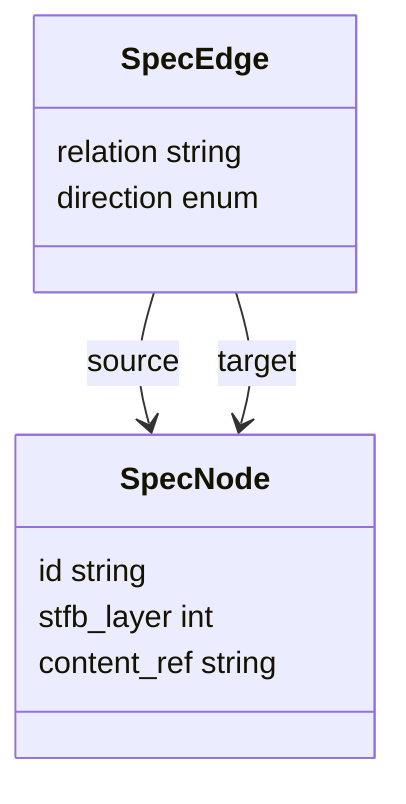
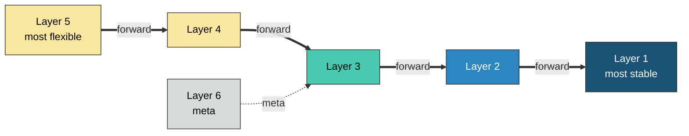
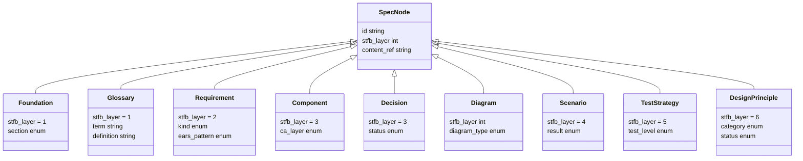
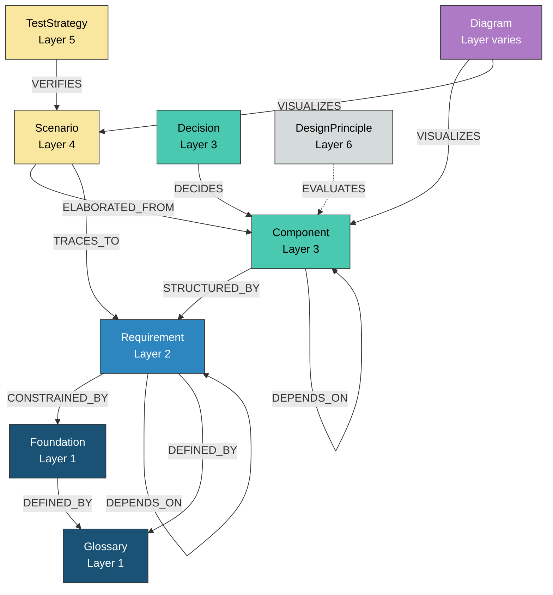

``````markdown
# ANMSグラフスキーマ定義

## 1. 抽象スキーマ — SpecNode と SpecEdge

グラフの本質は2つだけ。ノードとエッジ。

**Abstract_Schema:**



上図はANMSグラフの抽象データ構造を示す。全てのノードは `SpecNode` であり、全てのエッジは `SpecEdge` である。

**SpecNode — 仕様要素の抽象表現:**

| パラメータ | 型 | 説明 |
|---|---|---|
| `id` | string | 仕様要素の一意識別子。接頭辞でノード種別を示す（例: `FR-001`, `CMP-003`） |
| `stfb_layer` | int (1-6) | STFB階層。1が最も安定（CA最内層）、5が最も柔軟（CA最外層）、6はメタ層 |
| `content_ref` | string | Markdown上の実体への参照パス。MDはビューであり、この参照を通じてレンダリングされる |

**SpecEdge — 仕様要素間の関係:**

| パラメータ | 型 | 説明 |
|---|---|---|
| `relation` | string | エッジの種別。具体的な関係を示す（例: STRUCTURED_BY, CONSTRAINED_BY, TRACES_TO） |
| `direction` | enum | エッジの方向制約。forward / trace / meta の3種。詳細は1.1節 |
| `source` | SpecNode | エッジの起点。依存する側（CA外側、柔軟層）。例: 「Component --STRUCTURED_BY--> Requirement」では Component |
| `target` | SpecNode | エッジの終点。依存される側（CA内側、安定層）。例: 同上では Requirement |

矢印の向きはCAの依存方向に従う。**外側（柔軟）が内側（安定）に依存する。** sourceはtargetを知るが、targetはsourceを知らない。

### 1.1 エッジの方向制約

SpecEdge の `direction` は3種のみ。

| direction | ルール | 意味 |
|---|---|---|
| forward | source.stfb_layer >= target.stfb_layer | 外側→内側。CA依存方向 |
| trace | source.stfb_layer < target.stfb_layer | 内側→外側。CA例外。トレーサビリティ用途に限定 |
| meta | source.stfb_layer = 6 | メタ層からの横断評価 |

**これだけで CAの依存性逆転原則（DIP）がグラフレベルで強制される。**

---

## 2. STFB層構造 — 抽象的な階層

具体的なノードタイプを知らなくても、層と方向だけでグラフの骨格が決まる。

**STFB_Layers:**



上図はSTFBの6層構造とCA依存方向を示す。太線がforward（外側→内側）、点線がmeta。矢印はCAの依存方向に従い、柔軟層（外側）から安定層（内側）へ向かう。具体的に何がどの層に入るかは次節で定義する。

---

## 3. 具体スキーマ — ノードタイプの特殊化

SpecNode を各STFB層に特殊化する。

**Concrete_Node_Types:**



上図はSpecNodeから各具体ノードタイプへの継承関係を示す。各ノードは共通プロパティ（id, stfb_layer, content_ref）を継承し、固有プロパティを追加する。

---

## 4. 具体スキーマ — エッジタイプの特殊化

SpecEdge を具体的なエッジタイプに特殊化する。全てのエッジはCAの依存方向に従い、外側（柔軟層）から内側（安定層）へ向かう。

**Concrete_Edge_Types:**



上図は全ノードタイプ間の具体的なエッジタイプと方向を示す。全ての矢印はCAの依存方向（外側→内側）に従う。実線はforward、点線はmeta。色はSTFB層に対応する。

### 4.1 エッジ定義表

| エッジ | source（依存する側） | target（依存される側） | direction | 意味 |
|---|---|---|---|---|
| CONSTRAINED_BY | Requirement | Foundation | forward | 要求は基本事項に制約される |
| STRUCTURED_BY | Component | Requirement | forward | コンポーネントは要求により構造化される |
| ELABORATED_FROM | Scenario | Component | forward | シナリオはコンポーネントから展開される |
| VERIFIES | TestStrategy | Scenario | forward | テスト戦略がシナリオを検証する |
| EVALUATES | DesignPrinciple | Component | meta | 設計原則がコンポーネントを評価する |
| TRACES_TO | Scenario | Requirement | forward | シナリオから要求へのトレーサビリティ |
| DEPENDS_ON | Node | Node 同種 | forward | 同種ノード間の依存 |
| DECIDES | Decision | Component | forward | 設計判断がコンポーネントを決定する |
| DEFINED_BY | Foundation or Requirement | Glossary | forward | 仕様要素が用語定義に依存する |
| VISUALIZES | Diagram | any Node | forward | 図が仕様要素を可視化する |

---

## 5. Enum定義

| プロパティ | 値 |
|---|---|
| direction | forward, trace, meta |
| section | background, issues, goals, approach, scope, constraints, limitations, notation |
| kind | FR, NFR |
| ears_pattern | ubiquitous, event_driven, state_driven, unwanted_behavior, optional_feature, complex |
| ca_layer | entity, usecase, adapter, framework |
| status (Decision) | proposed, accepted, deprecated, superseded |
| diagram_type | component, class, sequence, state, activity, er |
| result | PASS, CONDITIONAL, FAIL, SKIP |
| test_level | unit, integration, e2e, performance |
| category | naming, dependency, simplicity, responsibility, solid, coupling, readability, testing, purity, state, concurrency, error, resource, immutability, efficiency |
| status (DP) | compliant, non_compliant, not_evaluated |
``````
