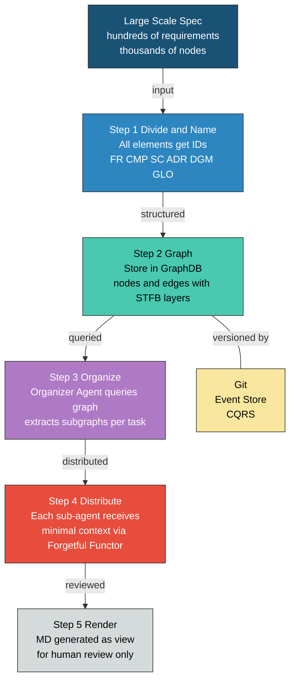

``````markdown
# ANMS大規模スケーリング — 要点整理

## 1. 目的

**ほぼ全自動SW開発を大規模プロジェクトに適用する。**

ANMSは中小規模SWに最適化されており、単一仕様書をAIのコンテキストウィンドウに収める前提で設計されている。大規模SWではこの前提が破綻するため、仕様の分割・配分メカニズムが必要になる。

## 2. 課題

| # | 課題 | 説明 |
|---|---|---|
| 1 | コンテキストサイズの限界 | LLMのコンテキストウィンドウに大規模仕様の全体は入らない |
| 2 | 大規模な仕様群の管理 | 数百〜数千の要件、コンポーネント、シナリオの依存関係を人手で追跡するのは不可能 |

## 3. 確定した設計原則

### 3.1 GraphDBは何でもいい（ようにしておく）

- 具体的なDB製品はFramework層の選択に過ぎない
- Clean ArchitectureのDIPに従い、interface経由でアクセスする
- DBの差し替えがエージェント側のコードに影響しない設計にする

### 3.2 仕様管理を圏論で概念化

3つの圏による三角関係：

| 圏 | 管理対象 | 対象 | 射 |
|---|---|---|---|
| G（GraphDB） | 構造（空間軸） | ノード = 仕様要素 | エッジ = 依存関係 |
| V（Git） | 変遷（時間軸） | コミット = スナップショット | diff = 状態遷移 |
| M（Markdown） | 表現（ビュー） | セクション | テキスト参照 |

4つの認知操作ペアが仕様設計の全操作を記述する：

| ペア | 役割 |
|---|---|
| 分割 / 命名 | 仕様を要素に分け、IDを付ける。全操作の前提 |
| 類比 / 対比 | 共通性と差異を見出す。グラフのクラスタリングと境界特定 |
| 帰納 / 演繹 | 具体から法則を抽出、法則から具体を導出。STFBの双方向走査 |
| 具体 / 抽象 | パラメータの付与と忘却。STFB層の移動 |

### 3.3 MDは中継点ではなくビュー

- MDは積圏 G x V からのレンダリング結果
- 本体はGraphDB（空間）とGit（時間）
- エージェント間のやりとりにMDは必須ではない
- 人間のレビュー時にのみMDにレンダリングする

### 3.4 GraphDB自体にバージョニング機能は不要

- Git = Event Store（書き込み、変更の記録）
- GraphDB = Read Model（読み取り、構造の走査）
- CQRS構成。過去のグラフが必要ならGitからJ関手（rebuild）で再構築
- Temporal TableやHistory Tableをグラフに実装する必要はない

## 4. 解決策

仕様の階層（STFB）を考慮した上でグラフ化し、オーガナイザーエージェントがタスクとコンテキストをサブエージェントに割り当てる。

**Solution_Overview:**



上図は大規模ANMS運用の全体フローを示す。仕様のID付与とグラフ化を経て、オーガナイザーがサブグラフを切り出し、各エージェントに最小コンテキストを配分する。MDは最終段の人間レビュー用ビューとしてのみ生成される。

## 5. 次に決めるべきこと

| # | CA層 | 論点 | 状態 | 優先度 |
|---|---|---|---|---|
| 1 | Entity | **ID体系の命名規則と粒度** | 未定 | **必須。分割/命名は第一原理** |
| 2 | Entity | **グラフスキーマの詳細（ノード種別、エッジ種別、プロパティ）** | v1草案あり。要レビュー | **必須。データ構造の定義そのもの** |
| 3 | Use Case | **オーガナイザーのサブグラフ切り出しアルゴリズム** | 概念のみ。具体アルゴリズム未定 | **必須。目的の核心** |
| ~~4~~ | ~~Adapter~~ | ~~J関手（rebuild）の実装方針~~ | ~~CQRS方針は確定。パーサー設計は未着手~~ | ~~後回し。方針は決まっている~~ |
| ~~5~~ | ~~Adapter~~ | ~~MCP Serverのinterface設計~~ | ~~未着手~~ | ~~後回し。Entity/UseCaseが先~~ |
| ~~6~~ | ~~Framework~~ | ~~PoC対象のDB選定~~ | ~~方針確定（何でもいい）~~ | ~~後回し。何でもいい~~ |
``````
