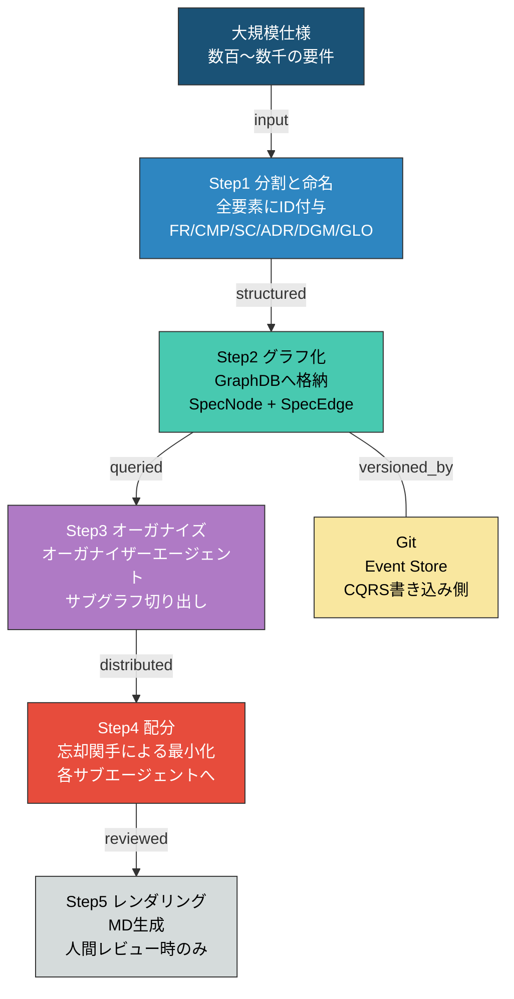
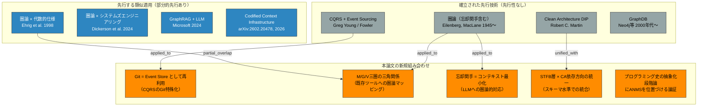
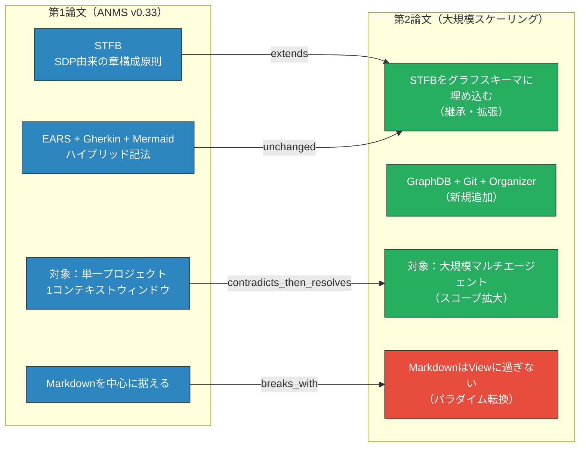
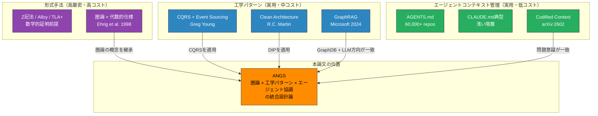

# ANGS (AI-Native Graph Spec) 論文 先行調査・価値評価レポート

**調査対象:** `angs-essay-ja.md` — "ANGS (AI-Native Graph Spec) — グラフ構造による仕様管理とエージェント協調"
**前提:** ANMS v0.33（第1論文）の続編・拡張論文として位置づけられている
**調査日:** 2026-03-08

---

## 1. 調査の前提と制約

本レポートは `angs-essay-ja.md` の全文を直接精読し、以下の観点で先行調査を実施した。

- GraphDB × 仕様管理の先行研究
- CQRS / Event Sourcing の確立された先行技術との比較
- 圏論（Category Theory）のソフトウェア仕様・システム設計への先行適用事例
- マルチエージェント + LLMコンテキスト管理の先行研究（第1論文レポートで調査済みのものを継承）

**確認できなかった情報:** 本論文の著者・所属・発表媒体・査読の有無。これらに関する言及は含めない。

---

## 2. 本論文の概要

### 2.1 問題設定

ANMSは単一の仕様書がAIのコンテキストウィンドウに収まることを設計前提としているが、大規模ソフトウェアではコンテキストサイズの限界と大規模な仕様群の管理という2つの理由でこの前提が破綻する 。本論文はこの破綻を正面から認めた上で、解決策を提示する構成を取る。

### 2.2 提案の核心（4設計原則）

| #   | 原則                  | 内容                                                                                                   |
| --- | --------------------- | ------------------------------------------------------------------------------------------------------ |
| 1   | GraphDB = Framework層 | DIPによりDB実装を差し替え可能にする。重要なのはデータ構造                                              |
| 2   | 三圏の三角関係        | Markdown($\mathcal{M}$) / GraphDB($\mathcal{G}$) / Git($\mathcal{V}$)を圏論で概念化し、6つの関手で接続 |
| 3   | MDはビュー            | 仕様の本体は $\mathcal{G} \times \mathcal{V}$。MDはレンダリング結果に過ぎない                          |
| 4   | CQRS                  | Git = Event Store、GraphDB = Read Model。バージョニングはGitに委任                                     |

### 2.3 全体フロー

**Large_Scale_ANMS_Architecture:**

---

## 3. 先行調査の結果

### 3.1 CQRS / Event Sourcing（確立された先行技術）

CQRS（Command Query Responsibility Segregation）はGreg Young が提案し、Martin Fowler が普及させた確立されたアーキテクチャパターンである。

Event Sourcingパターンを組み込んだCQRS実装では、Event Storeが書き込みモデルと単一の信頼できる情報源として機能し、Read Modelはこれらのイベントからマテリアライズドビューを生成する。ビューはクエリと表示要件に合わせて構造を最適化する 。

本論文の「Git = Event Store、GraphDB = Read Model」という対応は、この確立されたCQRS + Event Sourcingパターンをそのまま適用したものである。先行性はない。ただし、これをGitという既存のバージョン管理システムに割り当てた点（「GitをEvent Storeとして再利用する」という発想）は、一般的なCQRS実装（Kafka等のメッセージブローカーをEvent Storeとする）とは異なる文脈固有の適用である。

CQRSは複雑なドメインに適している。別モデルを持つことによってそれらのモデルの整合性をどう保つかという問いが生じ、結果整合性（eventual consistency）の可能性が高まる。ほとんどのシステムではCQRSは過剰なリスクを加える複雑さである 。Fowlerのこの警告は本提案にも適用可能な批判的観点であり、本レポートで後述する。

### 3.2 GraphDB × 仕様管理・知識グラフ

知識グラフはLLMを用いたエンタープライズQAシステムにおいて、LLMが生成したクエリの妥当性を評価する形式的フレームワークを提供し、信頼の源として機能する ことが実証されている。GraphDBを仕様の「構造的記憶」として使用するというアイデアは、この知識グラフ + LLMという研究方向と方向性が一致している。

しかし本論文が提案するのは「仕様書の管理システムとしてのGraphDB」であり、「既存データへの意味的クエリのためのGraphDB」（一般的な知識グラフ用途）とは用途が異なる。前者の文脈での先行提案は本調査の範囲では確認できなかった。

「コード化されたコンテキストインフラ」論文（arXiv:2602.20478）では108,000行のC#プロジェクトにおいて34のオンデマンド仕様書からなるコールドメモリ知識ベースを構築した実証がある 。この論文は仕様書をオンデマンドで参照する「引き出し型」アーキテクチャを採用しているが、仕様要素間の依存関係をGraphDBにモデル化するという本論文の提案には至っていない。

### 3.3 圏論（Category Theory）のソフトウェア仕様への先行適用

圏論のソフトウェア仕様への適用は学術的な先行研究が存在する。

代数的仕様の理論——抽象データ型とソフトウェアシステムの仕様に対する最も重要な数学的アプローチの1つ——において圏論の重要な役割が議論されており、統一的な仕様論理フレームワーク、合成的意味論、並行システムの仕様とモデルへの適用が示されている （Ehrig et al., 1998）。

システムズエンジニアリングへの圏論適用においては、関手は1つの圏から別の圏への知識の変換として定義され、これらの構造保存演算子はカテゴリに対して関数がセットに作用するように作用する 。この枠組みは本論文の三圏構成と数学的に同型の概念である。

本論文が独自な点は、圏論の適用先が「Markdown / GraphDB / Git」という**実装済みの既存ツール群**であること、および「可換条件の破れ＝バグ」という実用的な整合性チェックとして定式化していることである。純粋な形式手法の文脈（Ehrig等）では実装ツールへの直接的なマッピングはなされていない。

### 3.4 忘却関手（Forgetful Functor）のコンテキスト管理への適用

忘却関手は圏論の標準的な概念（構造を「忘れる」関手）であり、数学的な定義は確立されている。

本論文はこれを「フルグラフから不要な詳細を除去してサブエージェントに最小コンテキストを渡す」操作の数学的モデルとして用いている。この用法（忘却関手 = LLMコンテキスト削減操作）は、本調査の範囲では先行する明示的な提案を確認できなかった。忘却関手を「AIエージェントへのコンテキスト最小化」という工学的問題に対応させた応用として独自性が認められる。

### 3.5 プログラミング史の抽象化段階論

第6節「プログラミング史における位置づけ」で示される世代別抽象化表（マシン語 → C → C++ → Java/Python → FW/DSL → AI Code）は、著名な論考（Martin Fowler等）にも見られる歴史的整理の枠組みであり、先行論考が多数存在する。ただし「各抽象化段階で導入された制約」の系列に ANMS を位置づけるという論証の形式は、本論文における独自の構成である。

### 3.6 マルチエージェント協調と仕様管理

単一ファイルのマニフェストは大規模・マルチエージェントプロジェクトではスケールしないことが指摘されており、LLMベースのエージェントコーディングアシスタントは永続的なメモリを欠く という課題は複数の学術研究が確認している。本論文はこの課題に対して「GraphDB + オーガナイザーエージェント」という具体的なアーキテクチャで応答している点で、課題認識と解決提案の対応が適切である。

---

## 4. 先行技術との構成要素別マッピング

**Component_Novelty_Map:**

---

## 5. 設計上の独自性の評価

### 5.1 独自性が高い要素

#### 5.1.1 三圏の三角関係（M–G–V）とGit特殊化CQRS

Markdown / GraphDB / Git を3つの圏として定式化し、直線関係ではなく三角関係（$\mathcal{M}$–$\mathcal{G}$–$\mathcal{V}$ の全辺に双方向関手が存在する）として概念化した点は独自である。特に $J: \mathcal{V} \to \mathcal{G}$（Git → GraphDB の直接rebuild）と $K: \mathcal{G} \to \mathcal{V}$（GraphDB → Git の直接snapshot）の経路を定義することで、MDをボトルネックから排除する設計は、一般的なドキュメント管理のアーキテクチャにはない視点である。

可換条件 $F \circ H \cong J$ の定式化（「MD経由と直接経路が同じ結果を返すことが整合性の保証」）は、実装レベルの検証基準を数学的に明示している点で実用的かつ厳密である。

#### 5.1.2 「MDはビューに過ぎない」という認識論的転換

「Markdownは仕様の本体ではなく、$\mathcal{G} \times \mathcal{V}$（積圏）からのレンダリング結果である」という主張は、AI開発文脈において本質的な認識論的転換を提示している。CLAUDE.md / AGENTS.md を含む既存のエージェント設定ファイルのエコシステムは、Markdownファイルそのものをアーキテクチャの中心に置いている。本論文はその前提を逆転させる。この主張の正しさが実装で裏付けられれば、エージェント設定の設計思想に対するパラダイムシフトになりうる。

#### 5.1.3 STFBとCAの依存方向の統一とグラフスキーマへの埋め込み

第1論文のSTFB（仕様書の章構成原則）とClean Architectureの依存方向が「本質的に同じ方向を向いている」という洞察を、`direction` 制約（forward / trace / meta）の3値としてグラフスキーマに埋め込んだ点は独自である。これにより、設計思想（STFB + CA）がデータ構造レベルで強制される。型システムがメモリ操作を制約するように、スキーマが設計原則を制約するという発想は論理的に一貫している。

#### 5.1.4 4つの認知操作ペアによるアルゴリズム導出の枠組み

「仕様を扱う上で根本となる4つの認知操作ペア（分割/命名 → 類比/対比 → 帰納/演繹 → 具体/抽象）」は、グラフ操作（ノード作成・クラスタリング・影響分析・忘却関手）との対応表として整理されている。この認知モデルからアルゴリズムを導出するという枠組みは、本調査の範囲では類似の提案を確認できなかった。

### 5.2 既存技術の適用・組み合わせである要素（先行あり、批判的観点ではない）

- CQRS + Event Sourcing パターンそのもの（Greg Young, 2010年代〜）
- Clean Architecture DIPそのもの（Martin, 2012）
- 忘却関手（Forgetful Functor）の数学的定義
- GraphDB自体（Neo4j等）
- 圏論の代数的仕様への適用（Ehrig et al., 1998）

---

## 6. 価値の多角的評価

### 6.1 強みと有効性

**問題設定の誠実さ：** 第1論文の限界（単一ファイルのスケール限界）を自己批判として冒頭に明示した上で提案を展開する構成は、論文としての誠実さが高い。

**数学的整合性：** 三圏構成における可換条件 $F \circ H \cong J$ の定義は、「どこかでバグが出たらこの可換性が破れていないか確認する」という実装上の検証基準として機能しうる。形式的な命題が実装レベルの診断手段に直結している点は稀有である。

**スケーラビリティの構造的解決：** 単一ファイルのマニフェストは大規模・マルチエージェントプロジェクトではスケールしない という課題に対し、本論文はグラフスキーマとオーガナイザーによるサブグラフ切り出しという具体的なアーキテクチャで応答している。解決策の粒度が問題の粒度と釣り合っている。

**「抽象化と制約の不可分性」論証の説得力：** 第6節の「各プログラミング世代における抽象化の代償と導入された制約」という整理は、ANMS が歴史的文脈において必然的な提案であることの論拠として機能している。この論証の構造は独立した価値を持つ。

### 6.2 課題・制約・リスク

**実装の複雑性：** CQRSは複雑なドメインには適しているが、ほとんどのシステムではCQRSは過剰なリスクを加える複雑さである というFowlerの警告は、本提案にも直接適用される。GraphDB + Git + Organizer Agent + Markdown Renderer という4コンポーネント構成は、単一Markdownファイルとの比較で導入コストが桁違いに大きい。

**実証データの不在：** 本論文は設計論文であり、実装・実証を伴っていない。「可換性の破れ＝バグ」「忘却関手による最小化がコンテキストウィンドウを回避する」等の主張は、実装検証なしでは理論的提案に留まる。

**Gitを Event Store として扱うことの意味論的ズレ：** CQRS における Event Store はドメインイベントの追記専用ログであり、過去状態の再構築（replay）に最適化されている。一方、Gitのコミットは「仕様書の変更」であり、ドメインイベントの粒度とは異なる。この意味論的ズレが実装において問題を引き起こす可能性について、本論文は明示的に論じていない。

**圏論の使い方の厳密性：** $\mathcal{M}$, $\mathcal{G}$, $\mathcal{V}$ の圏として妥当性（対象・射・合成の結合律・単位元の存在）の形式的証明は本論文に含まれていない。特に $\mathcal{V}$（Git）における射（diff）の合成が圏の公理を満たすかは自明ではない。圏論を「概念化ツール」として使っているのか「形式的保証ツール」として使っているのかが曖昧であり、これは論文の立場を弱める可能性がある。

**「MDはビューに過ぎない」の実用的含意：** この主張はアーキテクチャ上は正しいが、現状のAIエージェント（Claude Code含む）はMarkdownを主要な入力形式として設計されている。GraphDBから直接クエリを受け取れるエージェントが存在しない現状では、この設計の有効性は将来の技術前提に依存する。

---

## 7. 第1論文との連続性と非連続性

**Continuity_Discontinuity:**

最大の非連続点は「Markdownを中心に据える」→「MarkdownはViewに過ぎない」という転換である。第1論文はMarkdown単一ファイルに全情報を集約することをアーキテクチャの要とした。第2論文はその中心を$\mathcal{G} \times \mathcal{V}$（GraphDB × Git）に移す。これは拡張ではなく前提の逆転であり、第1論文のアーキテクチャとは非互換な部分を含む。

---

## 8. ポジショニング

**Positioning_Map:**

本論文は「形式手法の厳密性」「工学パターンの実用性」「エージェント協調の現実性」という3つの領域を横断しようとする提案であり、この横断自体が独自のポジションを形成している。ただし3領域を横断することは、各領域の専門家からそれぞれ「厳密さが不十分」「複雑すぎる」「現状ツールとの乖離が大きい」と批判される可能性を同時に持つ。

---

## 9. 先行研究との比較サマリー

| 比較軸                 | IEEE 29148 | arc42 | Codified Context | GraphRAG |          **本論文**           |
| ---------------------- | :--------: | :---: | :--------------: | :------: | :---------------------------: |
| 大規模スケール対応     |     ○      |   ○   |        ◎         |    ◎     |     **◎（設計論として）**     |
| AIエージェント協調     |     ✗      |   ✗   |        ○         |    △     |     **◎（設計論として）**     |
| 仕様要素の依存関係管理 |     ○      |   △   |        △         |    ✗     |   **◎（GraphDBスキーマ）**    |
| バージョン管理との統合 |     ✗      |   ✗   |        △         |    ✗     |  **◎（Git = Event Store）**   |
| 数学的基礎の明示       |     ○      |   ✗   |        ✗         |    ✗     | **○（圏論、ただし非形式的）** |
| 実装コストの低さ       |     △      |   ○   |        △         |    △     |       **✗（高コスト）**       |
| 実証的裏付け           |     ◎      |   ◎   |        ◎         |    ◎     |      **✗（設計論のみ）**      |

---

## 10. 結論

### 10.1 先行調査のまとめ

| 調査観点                       | 確認結果                                                                         |
| ------------------------------ | -------------------------------------------------------------------------------- |
| 同一コンセプトの先行提案       | 確認できず（三圏三角構成 + STFB統合 + Git特殊化CQRSの組み合わせ）                |
| 構成要素の個別先行技術         | 全て存在（CQRS/DIP/圏論/忘却関手/GraphDB）                                       |
| 圏論 × ソフトウェア仕様の先行  | 代数的仕様への適用（1990年代〜）あり、ただし実装ツールへの直接マッピングは異なる |
| 忘却関手 × LLMコンテキスト管理 | 同等の先行提案を確認できず                                                       |
| 問題意識の一致する先行研究     | arXiv:2509.14744、2602.20478 等                                                  |

### 10.2 価値評価まとめ

本論文は**設計思想として高い独自性と一貫性を持ち、解決しようとする問題（大規模仕様のスケーラビリティとエージェント協調）は実在する**。

特に評価できる点は3つある。第1に、第1論文の限界を自己批判的に認めた上でアーキテクチャを提示する誠実な構成。第2に、可換条件（$F \circ H \cong J$）による整合性の数学的定式化が実装レベルの検証基準として機能しうる点。第3に、プログラミング史の抽象化段階論によるANMSの位置づけが、提案の必然性を論理的に示している点。

一方、実装コストとCQRS固有の複雑性、「MDはViewに過ぎない」という転換と現状ツールとの乖離、圏論の使い方の厳密性の曖昧さ、および実証データの不在が主要な課題として残る。本論文は理論的設計論として価値があるが、その価値を実装上で裏付ける次のステップを明示していない。

第1論文（ANMS v0.33）との関係で言えば、本論文は単なる拡張ではなく「MDを中心に置く」という第1論文の根本前提を逆転させる。この点において、2つの論文は連続しているようで、認識論的には非連続である。

---

## 参考文献（本レポートで参照した外部情報源）

1. Young, G. "CQRS Documents" — Command Query Responsibility Segregation（概念提案者）
2. Fowler, M. "bliki: CQRS" — https://martinfowler.com/bliki/CQRS.html
3. Microsoft Azure Architecture Center. "CQRS Pattern"
4. Ehrig, H. et al. "Applications of Category Theory to the Area of Algebraic Specification in Computer Science." Applied Categorical Structures, 1998.
5. Dickerson, C.E. et al. "Architecture, Analysis, and Design of Systems Using Extensions of Category Theory." IEEE Open Journal of Systems Engineering, 2024.
6. arXiv:2602.20478 "Codified Context: Infrastructure for AI Agents in a Complex Codebase", 2026.
7. arXiv:2509.14744 "On the Use of Agentic Coding Manifests: An Empirical Study of Claude Code", 2025.
8. Sequeda, J. et al. "Knowledge Graphs as a source of trust for LLM-powered enterprise question answering." Web Semantics, 2025.
