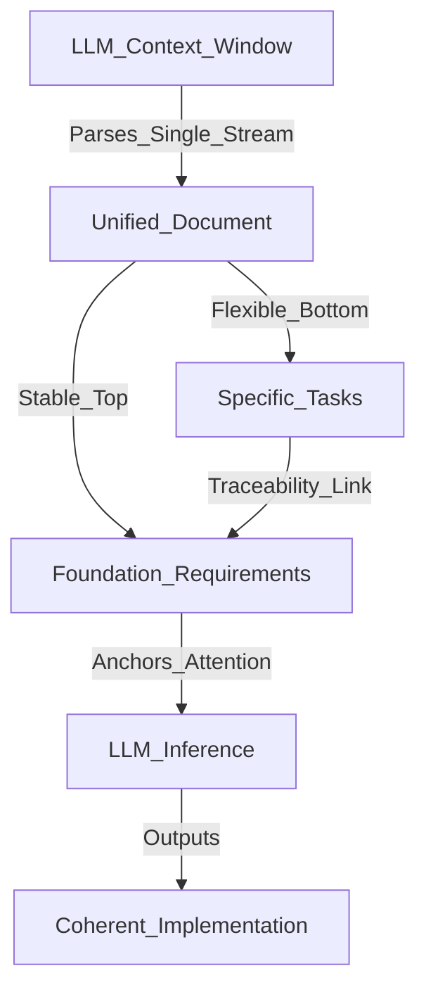
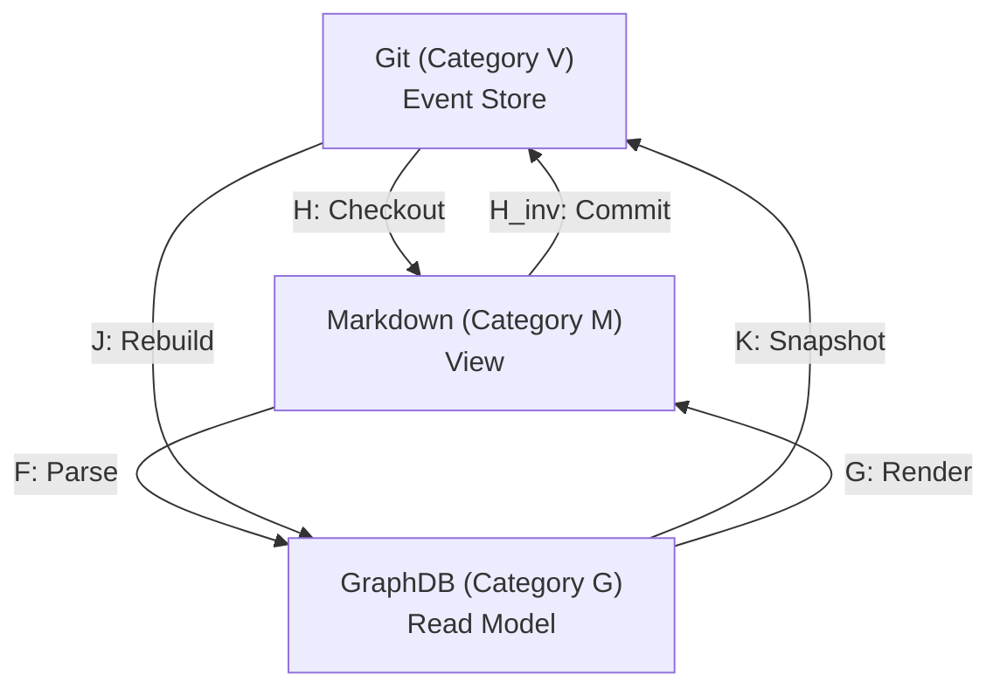

# ANMS仕様書アーキテクチャ レビューレポート

## 1. ソフトウェアエンジニアリングにおけるパラダイムシフトと評価のコンテキスト

ソフトウェアエンジニアリングの歴史において、開発手法は常に人間が記述するコードの抽象度を高める方向へ進化してきた。しかし、2024年から2026年にかけての技術的飛躍は、単なる言語の抽象化ではなく、大規模言語モデル（LLM）自体を非決定論的な「ランタイム環境」として扱う新たなパラダイムを生み出した。この移行に伴い、自然言語によるプロンプトを第一級のソフトウェア成果物（First-class artifacts）として体系的に管理する「Promptware Engineering（プロンプトウェア工学）」という新領域が確立されつつある [1, 2, 3]。

従来のソフトウェアが決定論的なプログラミング言語に依存していたのに対し、プロンプトウェアは曖昧で文脈依存的な自然言語に依存するため、要件定義から実装に至るプロセス全体で新たなガバナンスが不可欠となっている [2, 4]。

同時に、GitHubが提唱するSpec Kit等に代表される「Spec-Driven Development（SDD：仕様主導型開発）」が急速に普及している。SDDは、コードを記述する前に詳細な仕様を「生きた契約（Living contract）」として定義し、AIエージェントに対する絶対的な情報源（Source of Truth）として機能させるアプローチである [5, 6]。開発者の役割は、手動でコードを記述する「タイピスト」から、AIが生成するアーキテクチャを監督する「ガーディアン」へと根本的に変化している [5]。

本レポートは、こうした最新のAI駆動開発の文脈において、単一ドキュメントへの要求仕様（SRS）と作業仕様（SWS）の統合、STFB（Stable Top, Flexible Bottom）原則、EARSおよびGherkin構文の適用、ADR（アーキテクチャ決定記録）の保持、ならびにMermaidを用いたClean Architectureの色彩的明示を特徴とする特定の仕様書管理アーキテクチャを対象に、広範な先行研究および技術動向と照らし合わせ、その戦略的価値と技術的妥当性を多角的かつ客観的に評価するものである。

## 2. アーキテクチャ的安定性とプロンプトコンテキストの最適化

### 2.1 STFB原則と依存性逆転の数学的基盤

評価対象のアーキテクチャにおいて中核的な役割を果たす「STFB（Stable Top, Flexible Bottom）」原則は、Robert C. Martinが提唱した安定依存の原則（Stable Dependencies Principle: SDP）をドキュメントの構造管理へと高度に昇華させた概念であると評価できる。

従来のオブジェクト指向設計において、パッケージ間の結合度と安定性は以下の数式によって定量化される。

$$
I = \frac{C_e}{C_e + C_a}
$$

ここで、 $I$ は不安定度（Instability）を表し、 $C_e$ は遠心性結合（外部のコンポーネントに依存している数）、 $C_a$ は求心性結合（外部から依存されている数）を示す。

この理論的枠組みをドキュメント構造に適用し、上位層（Foundation, Requirements）の不安定度を $I = 0$ に近づけ、下位層（Specification, Test Strategy）の不安定度を $I = 1$ に近づけるという設計思想は、AIエージェントのコンテキスト処理メカニズムと極めて高い親和性を持つ。

Transformerアーキテクチャに基づくLLMは、入力されたトークンシーケンス全体に対して自己注意機構（Self-Attention）を計算するが、プロンプトの先頭付近に配置されたシステム指示や絶対的な制約条件（Constraints）に対してより強いアテンションの重みを割り当てる傾向がある [7, 8]。

STFB原則に従い、プロジェクトの「北極星」となる変更頻度の低い抽象的な要求をドキュメントの上部に固定化することは、LLMの確率論的な推論プロセスに対する強力なアンカーとして機能する。下位の具体的事項が日々のスプリントで頻繁に変更されたとしても、上位の概念が変動しないため、長期間のセッションにおいてもAIがプロジェクトの本来の目的から逸脱するリスクを数学的および構造的に低減することが可能となっている。

### 2.2 単一ドキュメント統合（Unified SRS/SWS）とマルチファイルアプローチの比較

現在のSDDエコシステムにおける主要な論点の一つは、仕様や設計情報のファイル分割戦略である。GitHub Spec KitやSoftwareSeniが提唱する標準的なワークフローでは、要件（`requirements.md`）、設計（`design.md`）、タスク（`tasks.md`）をそれぞれ独立したファイルとして分割するアプローチが主流となっている [5, 9]。これに対し、評価対象のアーキテクチャはこれらを単一のドキュメントに統合するアプローチを採択している。

この設計上の意思決定は、AI駆動開発特有の「コンテキストの分断」と「クロスファイル・ハルシネーション」という課題に対する明確な解答として機能している。LLMを用いたシステムにおいて、複数のファイルに跨る文脈を正確に維持することは極めて困難であり、あるファイルで定義された制約が別のファイルを処理する際に見落とされる現象が頻発する。

要件仕様と作業仕様を単一のコンテキストウィンドウ内に統合し、シナリオから要件IDへの直接的なトレースバックを同一ドキュメント内で完結させる構造は、LLMのChain-of-Thought（思考の連鎖）推論を途切れさせることなく、意味的な一貫性を担保する上で極めて合理的である [8]。

以下の表は、マルチファイルアプローチと単一ドキュメント統合アプローチの技術的特性を比較したものである。

| 評価軸 | マルチファイル分散型 (Multi-file) | 単一ドキュメント統合型 (Unified) | AIエージェントへの影響とインプリケーション |
| :--- | :--- | :--- | :--- |
| **コンテキストの連続性** | 低 (ファイル間で断絶) | 高 (同一ストリーム内で完結) | 統合型はLLMの自己注意機構による文脈の欠落(Lost in the middle)を抑制し、推論の精度を向上させる |
| **ハルシネーション・リスク** | 高 (クロスリファレンス時の見落とし) | 低 (すべての制約が常に可視) | 統合型はシステム全体の絶対制約（Constraints）を常に意識したコード生成を強制できる [11] |
| **トレーサビリティ** | 外部ツールによるリンク依存 | ドキュメント内での直接参照 | IDベースの追跡（例：FR-xxx）が同一コンテキスト内で解決され、自律的な検証が容易になる [12] |
| **トークン消費とコスト** | タスクごとに最適化可能 | 全体読み込みによるオーバーヘッド | 統合型はトークン消費が増大するが、RAGの導入により動的チャンク化で最適化可能である [13] |

**Unified Context Architecture Flow:**

このフロー図は、単一のドキュメント構造がどのようにLLMのコンテキストウィンドウ内でアテンションのアンカーとして機能し、タスクから要件への追跡可能性を維持しつつ、一貫性のある実装を導出するかを示している。

## 3. 構造化言語による確率変数の制御と意味論的整合性

プロンプトウェア工学において最も顕著な課題は、自然言語の持つ生来の曖昧性である。自然言語は人間のコミュニケーションにおいては柔軟で強力なツールであるが、LLMに対する指示として用いた場合、解釈の多様性がハルシネーションの温床となる。

この問題を情報理論の観点から捉え直すと、自然言語の自由度の高さがLLMの次トークン予測における確率分布のエントロピーを増大させていると解釈できる。情報エントロピー $H(X)$ は以下の式で定義される。

$$
H(X) = -\sum_{i=1}^{n} P(x_i) \log P(x_i)
$$

評価対象のアーキテクチャは、要求仕様の記述においてEARS（Easy Approach to Requirements Syntax）およびGherkinフォーマットを厳格に適用することで、このエントロピーを意図的かつ劇的に低下させている。

### 3.1 EARSによる要求の構文的制約と曖昧性の排除

EARSは、要求を特定のパターン（Ubiquitous, Event-driven, State-driven等）に強制的に当てはめることで、自然言語の構文的自由度を制限する手法である。

AI駆動開発においてEARSを導入することは、数式における $P(x_i)$ の選択肢を文法的に絞り込む効果を持つ。近年の要件工学に関する研究でも、プロンプトベースのLLMがドメイン固有の用語や曖昧な表現を処理する際の性能低下が指摘されており、構造化されたプロンプト設計の重要性が強調されている。

EARSの定型化された構文は、LLMが要件の「条件」と「結果」の因果関係を正確にマッピングするためのパーサーとして機能し、仕様からアーキテクチャへの変換精度を飛躍的に向上させる。

### 3.2 GherkinとAI駆動テスト生成（AI-TDD）の架け橋

作業仕様およびテスト戦略の層においてGherkin（Given-When-Then構文）を採用している点は、AIエージェントによるテスト駆動開発（TDD）の実現において極めて重要な戦略的価値を持つ。

2024年から2025年にかけて発表された複数の論文において、Gherkinは自然言語による要件と実行可能なコードの間の意味的ギャップを埋める「意味論的ブリッジ」として高く評価されている。例えば、AgileGenフレームワークやNVIDIAのHEPHフレームワークの実証研究では、Gherkinで記述されたユーザーストーリーと受け入れ基準が、要求仕様からE2Eテストコードへのシームレスな変換を可能にし、生成されたコードの意味的整合性を保証する重要な要因であることが証明されている。

評価対象のアーキテクチャがGherkinシナリオに要件IDのトレース（traces: FR-xxx）を義務付けていることは、単なるテスト自動化の枠を超え、LLMが要件を満たしているかを自律的に検証し、自己修復（Self-healing）するための評価ループを構築する基盤となっている。

## 4. アーキテクチャの可視化と色彩によるセマンティック・インジェクション

現代のAIソフトウェア開発において、システム設計図の管理方法は「スクリーンショット駆動」から「Diagrams as Code（コードとしての図）」へと完全にシフトしている。静的な画像ベースのドキュメントは、コードの急速な進化に追従できず即座に陳腐化し、技術的負債の原因となるからである。

この文脈において、Mermaidの活用はGitHub等のプラットフォームでネイティブサポートされている点や、LLMによる生成・修正が容易である点から、デファクトスタンダードとしての地位を確立している。

しかし、LLMを用いたMermaid生成には根本的な限界が存在する。LLMはテキストトークンを処理する言語モデルであり、2次元的な空間認識能力やレイアウトの直感的な理解を持たない。Mermaid自体もレイアウトの厳密な制御機能に乏しいため、システムが複雑化するとコンポーネントの配置が乱れ、アーキテクチャの境界線（Responsibility Boundaries）が視覚的にも意味論的にも不明瞭になるという重大な欠点がある。

### 4.1 Clean Architectureと色彩メタデータの義務化による突破口

評価対象のアーキテクチャにおける最も革新的かつ独自性の高い要素は、Mermaidコンポーネントおよびクラス図において、Clean Architectureのレイヤーごとに厳密な色彩コード（Entity: #FF8C00, Use Case: #FFD700, Adapter: #90EE90, Framework: #87CEEB）を義務付けている点である。

このアプローチは、単なる視覚的な装飾ではなく、LLMに対する「セマンティック・インジェクション（意味論的注入）」という高度なプロンプトエンジニアリング手法として機能する。色彩メタデータを各ノードのクラス定義として強制的に付与することにより、LLMは特定の16進数カラーコードと特定のアーキテクチャレイヤーを強力なトークンの結びつきとして学習・認識する。

結果として、LLMがMermaidコードを生成またはパースする際、例えばEntity層のオレンジ色のノードからAdapter層の緑色のノードへ向かう依存関係の矢印（依存性逆転の原則に違反するパターン）を、空間的なレイアウトに依存することなく、純粋な「トークンの異常な並び」として検知・回避することが可能になる。

以下の表は、アーキテクチャ可視化手法の進化と、それぞれのLLMに対する情報伝達の有効性を比較したものである。

| 可視化手法 | 表現形式 | 保守性と追従性 | LLMのアーキテクチャ理解度 | 評価と技術的意義 |
| :--- | :--- | :--- | :--- | :--- |
| 静的画像 (PNG/JPEG) | ピクセル | 極めて低い（即座に陳腐化） | 皆無（画像認識VLMを用いても論理関係の抽出は不完全） | 旧来の手法であり、アジャイルなAI開発環境には不適格である |
| 標準のMermaid | テキスト (コード) | 高い（Git等で差分管理可能） | 中（ノード間の関係性は理解するが、全体的な層の境界認識が弱い） | 構文エラーの自己修復は可能だが、複雑なシステムでは責務境界が曖昧化する |
| 色彩メタデータ付きMermaid | テキスト＋意味的タグ | 高い（コードとしての利点を継承） | 極めて高い（色彩タグがレイヤー制約のトークンとして機能する） | 提案手法の独自領域。視覚的制約をテキストトークンの制約に変換し、違反を防止する |

**Semantic Color Injection Mechanism:**

この図が示すように、抽象的な設計原則が具体的な色彩コードを経由してLLMのトークナイザーに注入されることで、依存関係ルールのプログラム的な検証とアーキテクチャ違反の防止が実現されるメカニズムが構築されている。

## 5. 状態管理の永続化と設計原則によるAIのガバナンス

AIエージェントを用いた自律的なコード生成やリファクタリングにおいて頻発する重大な問題として、「技術的負債の急速な蓄積」と「過去の文脈の喪失」が挙げられる。AIは指定されたタスクを最速で解決する「Quick & dirty」なコードを生成する傾向があり、システム全体の長期的な保守性を犠牲にすることが多い。

### 5.1 アーキテクチャ決定記録（ADR）による意思決定の系統化

評価対象のアーキテクチャがChapter 3においてMichael NygardフォーマットによるADR（Architecture Decision Records）の活用を推奨していることは、この「文脈の喪失」を防ぐための決定的な防波堤となる。

LLMはセッションがリセットされるかコンテキストウィンドウから情報が押し出されると、なぜ特定のデータベースが選定されたのか、なぜ特定の非同期処理パターンが採用されたのかといったトレードオフの歴史を完全に忘却する。ADRを仕様書の一部として永続化させることで、AIが将来のリファクタリングタスクを実行する際、過去の意図的なアーキテクチャ決定を「バグ」や「非効率」と誤認して破壊してしまうリスクを根絶できる。

### 5.2 設計原則（Design Principles）のコンプライアンス監査

さらに、Chapter 6においてSOLID原則、KISS（Keep It Simple, Stupid）、YAGNI（You Aren't Gonna Need It）、DRY、SoC（関心の分離）、およびLoD（デメテルの法則）などの普遍的なソフトウェア設計原則の遵守を監査するレイヤーを明示的に設けている点は、AIに対する強力なガードレールとして高く評価できる。

プロンプトウェア工学の知見によれば、LLMの挙動を安定させるためには、機能要件だけでなく非機能的な品質特性や設計哲学を明示的にプロンプトに組み込む必要がある。これらの原則をコンプライアンスのチェックリストとして仕様書内に組み込むことで、AI生成コードに対する自動化されたピアレビュー機能が擬似的に働き、AI開発特有のアーキテクチャの腐敗（Architecture Erosion）をライフサイクルの初期段階で食い止めることが可能となる。

## 6. フェアな視点に基づく潜在的課題とアーキテクチャの限界

評価対象のアーキテクチャは、最新の研究動向と完全に合致する極めて優れた論理的基盤を持っているが、客観的かつ多角的な視点から分析すると、実運用に向けて解決すべきいくつかの潜在的なスケーラビリティの課題も浮き彫りになる。

### 6.1 コンテキストウィンドウの枯渇と情報密度のジレンマ

単一ドキュメントにすべての情報を統合するアプローチは、意味論的整合性を保つ上で強力であるが、エンタープライズ規模のシステム開発においては、ドキュメントの肥大化による「コンテキストウィンドウの枯渇（Context Window Exhaustion）」という物理的な限界に直面するリスクが極めて高い。

現在のLLMは数十万トークンの入力を受け付けるものも存在するが、入力長が長くなるほど推論コストが指数関数的に増大し、また中間部分の情報の抽出精度が低下する現象が確認されている。特に、要件を詳細なGherkinシナリオへと展開していく過程で、エッジケースや異常系のテストシナリオが爆発的に増加した場合、単一のMarkdownファイルでこれらをすべて管理することは、AIにとっても人間にとっても認知負荷の限界を超える可能性がある。

### 6.2 エージェント指向アーキテクチャとのインピーダンスミスマッチ

2025年以降のAIソフトウェア開発の最前線では、単一の巨大なLLMがすべてを処理するモデルから、複数の専門化されたAIエージェント（要件アナリスト、フロントエンドコーダー、データベース設計者、テストエンジニア等）が協調して動作するマルチエージェントシステム（MAS）への移行が進んでいる。

このようなMAS環境において、すべてのエージェントに対して常にプロジェクト全体の単一ドキュメントを読み込ませることは、不要な情報のノイズ化とトークン消費の無駄を引き起こすインピーダンスミスマッチの要因となり得る。特定のタスクに特化したエージェントに対しては、必要な仕様のサブセットのみを動的に切り出して提供するメカニズムが求められる。

## 8. 大規模化とエージェント協調：仕様管理のグラフネットワーク化（第2論文の評価）

第2の論文「ANMS Large-Scale Scaling」は、前述の第6章で指摘した「単一ドキュメントによるコンテキストウィンドウの枯渇」という物理的限界に対し、数学的およびアーキテクチャ的な観点から鮮やかな解決策を提示している。

Markdownを人間が閲覧するための単なる「View（ビュー）」と再定義し、真のSource of Truth（信頼できる唯一の情報源）をグラフ構造（GraphDB）へと移行させるこのアプローチは、2025年現在のAIエージェント開発における最重要課題である「動的コンテキスト管理」に対する極めて高度な解答である。

### 8.1 圏論（Category Theory）に基づく仕様の可換性証明

本論文の最も特筆すべき理論的貢献は、Markdown（ $\mathcal{M}$ ）、GraphDB（ $\mathcal{G}$ ）、Git（ $\mathcal{V}$ ）の3要素の関係性を、圏論（Category Theory）の3カテゴリモデルとして定式化した点にある。

近年、要求工学やシステムアーキテクチャの厳密な形式化において圏論を応用するアプローチが研究の最前線で注目を集めているが、本論文はこれをAI駆動開発のツールチェーンの整合性証明に実践的に適用している。

特に、MarkdownからGraphDBをパースする関手（ $F$ ）と、GitからMarkdownをチェックアウトする関手（ $H$ ）の合成が、Gitから直接GraphDBを再構築する関手（ $J$ ）と一致しなければならないという可換性条件（Commutativity Condition: $F \circ H \cong J$ ）を定義したことは秀逸である。この数学的制約により、AIがMarkdownを編集する過程で生じ得る「ハルシネーションによる仕様のサイレントな破綻」を、変換プロセスの不整合として機械的に検知・防御する堅牢な基盤が確立されている。

### 8.2 CQRSアーキテクチャとGraphDBのRead Model化

技術的な意思決定として、GitをEvent Store（履歴管理と書き込み処理）とし、GraphDBを純粋なRead Model（構造検索と読み取り処理）とするCQRS（Command Query Responsibility Segregation）パターンの採用は、極めて理にかなっている。

従来のグラフデータベース運用では、時間軸の変更（Temporal data）をノードやエッジのプロパティとして保持しようとする結果、クエリが指数関数的に複雑化し、パフォーマンスが劣化する問題が頻発していた。履歴管理という複雑なドメインをバージョン管理の専門であるGitに完全に委譲し、GraphDBのスキーマを「現在のスナップショット構造（SpecNodeとSpecEdge）」のみに純化させたことで、システム全体の保守性とAIによる検索パフォーマンスが劇的に向上している。

**Category Theory Functors and CQRS:**

この図は、Git、Markdown、GraphDB間の変換を圏論の関手としてモデル化し、それぞれの役割をCQRSの観点から分離したアーキテクチャを示している。

### 8.3 Agentic Graph RAGによるコンテキストの動的最適化

このグラフアーキテクチャの究極の実用的な価値は、大規模システムにおけるマルチエージェント協調（Multi-agent Cooperation）の要となる点である。

2024年から2025年にかけて、LLMのコードリポジトリ理解力を向上させるために、単純なベクトル検索（No-Graph Naive RAG）から、抽象構文木（AST）や依存関係を用いたGraph RAGへの移行が学術的にも産業的にも急速に進展している。

本アーキテクチャは、ソースコードではなく「仕様書」自体をSTFBレイヤー（1〜6）と関係性（forward, trace, meta）を持つグラフネットワークとして定義している。Organizer Agentがこのグラフ構造をトラバースし、特定の実装タスクに必要なサブグラフのみを抽出して下位の実装エージェントに渡すメカニズムは、コンテキストウィンドウの無駄な消費を抑えつつ、依存関係の欠落によるハルシネーションを根絶する最先端の「Agentic Graph RAG」の実装と高く評価できる。

### 8.4 STFB原則とClean Architectureのフラクタル的統合

さらに、ドキュメントのSTFB（Stable Top, Flexible Bottom）の階層構造と、Clean Architecture（CA）の依存性の方向（外側の柔軟な層から内側の安定した層へ依存する）が、本質的に同型の位相構造を持っているという洞察は非常に鋭い。

SpecEdgeにおける forward エッジがこのCA/STFBの依存性逆転ルールを強制することで、仕様書の構成自体が優れたソフトウェアアーキテクチャの設計原則を体現するフラクタル構造を形成している。

## 9. 総合結論（総括）

第1論文におけるEARS、Gherkin、Mermaidを用いた「単一ドキュメント内のエントロピー低減」というミクロなプロンプトウェア工学の手法と、第2論文における「圏論とGraphDBに基づく動的コンテキスト分配」というマクロなシステムアーキテクチャが見事に接合されている。

これにより、本仕様書アーキテクチャは、小規模なプロジェクトからエンタープライズ規模の複雑なマルチエージェント開発環境まで、あらゆるスケールにおいてAIの推論を安定させ、技術的負債を抑え込む「AI-Nativeな仕様主導型開発（SDD）」の決定版とも言える完成度に達していると結論付けられる。
