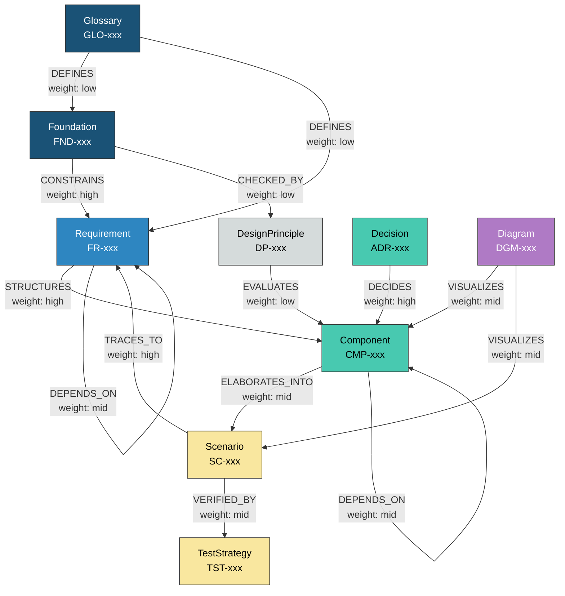
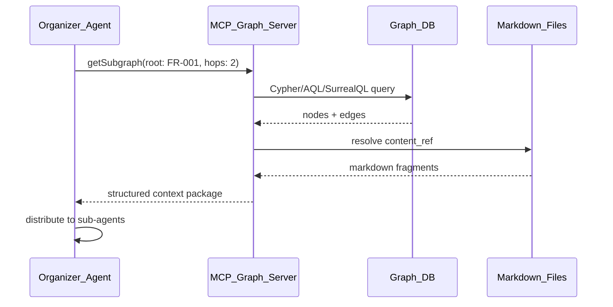

``````markdown
# グラフDB比較調査レポート — ANMS大規模スケーリングにおけるDB選定

## 1. 調査目的

ANMS（AI-Native Minimal Spec）を大規模SW開発に適用する際、仕様書の構造をグラフとして管理し、オーガナイザーエージェントが必要な部分だけを切り出してサブエージェントに渡す仕組みを実現するために、最適なグラフDBを選定する。

### 評価軸

| # | 評価軸 | 重み | 理由 |
|---|--------|------|------|
| 1 | AI/LLM統合性 | 最重要 | エージェントがクエリを生成・実行する基盤 |
| 2 | ベクトル検索対応 | 重要 | 意味的類似検索（RAG）との併用 |
| 3 | クエリ言語のLLM生成精度 | 重要 | Text-to-Queryの実用性 |
| 4 | 組み込み/軽量運用 | 重要 | 開発チーム単位での手軽な導入 |
| 5 | マルチモデル対応 | 中 | ドキュメント・KV・グラフの統合管理 |
| 6 | ライセンス | 中 | OSSか商用かの制約 |
| 7 | スケーラビリティ | 低〜中 | 仕様管理は超大規模データにはならない |

---

## 2. グラフDB一覧と特性比較

### 2.1 比較表

| DB | ライセンス | クエリ言語 | ベクトル検索 | マルチモデル | 組み込み可 | GraphRAG対応 | 備考 |
|---|---|---|---|---|---|---|---|
| Neo4j | Community: AGPLv3<br/>Enterprise: 商用 | Cypher | GenAIプラグイン | グラフ特化 | 不可 | GraphRAG Ecosystem | 業界標準。LLMのCypher生成が最も研究されている |
| Amazon Neptune | 商用（AWS） | openCypher / SPARQL | Neptune Analytics | グラフ特化 | 不可 | AWS連携 | AWSロックイン。Neptune AnalyticsでML統合 |
| ArangoDB | Apache 2.0 (v3.11以前)<br/>BSL 1.1 (v3.12+) | AQL | ネイティブ対応 | ドキュメント+グラフ+KV | 不可 | HybridGraphRAG | ベクトル+グラフ+全文検索の統合が強い |
| Apache AGE | Apache 2.0 | openCypher (on PostgreSQL) | pgvector併用 | PostgreSQLエコシステム | 不可 | なし（自前構築） | PostgreSQLの資産を活用可能 |
| Memgraph | BSL 1.1 | Cypher | MAGE拡張 | グラフ特化 | 不可 | LLMGraph Transformer | インメモリで高速。ストリーミング対応 |
| NebulaGraph | Apache 2.0 (OSS版) | nGQL / GQL (Enterprise v5) | Enterprise版 | グラフ特化 | 不可 | LlamaIndex連携 | GQL(ISO標準)の早期採用 |
| SurrealDB | BSL 1.1 | SurrealQL | ネイティブ対応 | ドキュメント+グラフ+KV+ベクトル | 組み込みモード有 | Context Graphs | 単一DB内で全データモデルを統合。Rust製 |
| Kuzu | MIT | Cypher | 対応 | グラフ特化 | 組み込み専用 | Python連携 | SQLiteのグラフ版。軽量・高速 |
| FalkorDB | SSPLv1 | Cypher(サブセット) | ネイティブ対応 | グラフ特化 | 不可 | GraphRAG-SDK | Redis系。超低レイテンシ。独自GraphRAG SDK提供 |
| TigerGraph | 商用 | GSQL / openCypher / GQL | ネイティブ対応 | グラフ特化 | 不可 | CoPilot (AI) | 大規模グラフ分析に強い。GQL対応 |

### 2.2 各DBの詳細評価

#### Neo4j — 業界標準、最大のエコシステム

- **強み:** Cypherの生態系が最も成熟。LLMによるCypher生成の研究・ベンチマークが最も豊富。LangChain/LlamaIndex との統合が最も進んでいる
- **弱み:** Community版はAGPLv3で商用利用に制約。サーバー型のみで組み込み不可。単一仕様管理にはオーバースペック
- **ANMS相性:** Cypherの学習データが最も多いため、LLMのText-to-Cypher精度が最も高い。ただしインフラコストが高い

#### ArangoDB — マルチモデルの統合力

- **強み:** 1つのDBでドキュメント（Markdown本文）、グラフ（依存関係）、KV（設定）、ベクトル（意味検索）を統合管理可能。HybridGraphRAGはベクトル+グラフ+全文検索を単一クエリで実行
- **弱み:** AQL はCypherほどLLMの学習データがない。v3.12以降BSLライセンスに変更
- **ANMS相性:** 仕様本文もグラフ構造もベクトル索引も1つのDBで管理でき、アーキテクチャがシンプルになる。ただしAQLのLLM生成精度は未知数

#### SurrealDB — 次世代マルチモデル

- **強み:** ドキュメント+グラフ+KV+ベクトルを単一クエリ言語(SurrealQL)で統合。Rust製で高性能。組み込みモードがあり、開発者のローカル環境で動作可能。Context Graphsはエージェントメモリに最適化
- **弱み:** 比較的新しく、エコシステムが未成熟。SurrealQLのLLM生成精度は未検証。BSL 1.1ライセンス
- **ANMS相性:** 組み込みモード+マルチモデル+ベクトルの組み合わせが魅力的。ただし成熟度にリスク

#### Kuzu — 組み込みグラフDBの本命

- **強み:** MIT ライセンス。SQLiteのように単一プロセス内で動作し、サーバー不要。Cypher互換でLLM生成が容易。列指向ストレージで分析クエリが高速。Python/Node.js/Rust バインディング
- **弱み:** 組み込み専用のため分散構成不可。プロジェクトの長期維持に懸念あり（要継続監視）
- **ANMS相性:** 仕様管理DBとしては最も導入障壁が低い。開発者がgit cloneした直後にDBが使える。ただしベクトル検索機能の成熟度は要確認

#### FalkorDB — 低レイテンシ + GraphRAG特化

- **強み:** Redis系のインメモリ設計で超低レイテンシ。独自のGraphRAG-SDKを提供しており、LLM連携の実装が容易
- **弱み:** SSPLv1ライセンス（MongoDB系の制約付きライセンス）。Cypherのサブセット実装のため一部クエリに制限
- **ANMS相性:** GraphRAG-SDKとの直接統合が容易。ただしCypherサブセットの制約がANMSの複雑なクエリに耐えるか要検証

#### Apache AGE — PostgreSQLとの共存

- **強み:** 完全なApache 2.0。既存PostgreSQLインフラにグラフ機能を追加。pgvectorとの併用でベクトル検索も可能。SQLとCypherを同一クエリ内で混在可能
- **弱み:** PostgreSQL拡張のため、純粋なグラフDBと比較するとグラフ走査性能が劣る。GraphRAG統合は自前構築が必要
- **ANMS相性:** PostgreSQLを既に使っているプロジェクトには追加コストゼロ。ただしグラフ専用DBほどの表現力はない

---

## 3. GQL標準（ISO/IEC 39075:2024）の動向

2024年4月にISO標準として発行されたGQL（Graph Query Language）は、グラフDB界のSQLを目指す統一クエリ言語である。

| 項目 | 状況 |
|---|---|
| 標準化 | ISO/IEC 39075:2024として正式発行済み |
| 早期採用DB | NebulaGraph Enterprise v5、TigerGraph |
| Neo4jの対応 | Cypher がGQLの基盤。段階的に互換性を追加中 |
| LLM対応 | 学習データが少なく、Text-to-GQL精度はText-to-Cypherより低い |
| 評価 | 将来的にはGQLが標準になる可能性が高いが、現時点ではCypherの方が実用的 |

---

## 4. LLMによるグラフクエリ生成の現状

### 4.1 Text-to-Cypher の精度

| 条件 | 精度（目安） | 備考 |
|---|---|---|
| スキーマ提示 + 単純クエリ | 高い | 1〜2ホップの走査、フィルタ |
| スキーマ提示 + 複雑クエリ | 中程度 | マルチホップ、集約、パス検索 |
| スキーマなし | 低い | ハルシネーションが頻発 |
| Few-shot例文付き | 大幅改善 | スキーマ+例文の組み合わせが最も効果的 |

### 4.2 実用化のための戦略

1. **スキーマの明示的注入:** グラフスキーマ（ノードラベル、エッジタイプ、プロパティ）をプロンプトに含める
2. **Few-shot例文:** ANMSドメイン固有のクエリ例を5〜10件プロンプトに含める
3. **クエリ検証レイヤー:** LLMが生成したCypherを構文チェック→実行前バリデーション→結果検証するパイプライン
4. **API抽象化（推奨）:** LLMに直接Cypherを書かせるのではなく、「getRelatedNodes(id, hops)」のような高レベルAPIをMCPサーバーとして提供し、LLMはAPI呼び出しのみ行う

---

## 5. 既存グラフDBの本目的に対する課題

### 5.1 共通課題

| # | 課題 | 説明 | 影響 |
|---|---|---|---|
| 1 | Markdown同期問題 | 仕様の「Single Source of Truth」がMarkdownにある場合、グラフDBとの双方向同期が必要。既存DBにはこの仕組みがない | グラフDBの内容とMarkdownが乖離するリスク |
| 2 | スキーマ進化 | ANMSのテンプレートがバージョンアップした際、グラフスキーマのマイグレーションが必要 | RDBほどマイグレーションツールが成熟していない |
| 3 | バージョニング | 仕様書はgitで版管理されるが、グラフDBのスナップショット管理は標準化されていない | 「v1.2の仕様グラフ」と「v1.3の仕様グラフ」の差分比較が困難 |
| 4 | 過小データ問題 | ANMS仕様管理のデータ量は数千〜数万ノード程度。多くのグラフDBは数百万〜数十億ノードを想定しており、過剰なインフラコストになる | 組み込み型（Kuzu、SurrealDB）が有利 |
| 5 | オーガナイザーの判断基盤 | 「どのサブグラフをどのエージェントに渡すか」を判断するためのグラフ分析アルゴリズム（コミュニティ検出、中心性分析等）のLLM連携が未成熟 | カスタム実装が必要 |

### 5.2 DB固有の課題

| DB | 本目的に対する固有課題 |
|---|---|
| Neo4j | サーバー必須。単一プロジェクトの仕様管理には重すぎる。AGPLv3の制約 |
| ArangoDB | AQLのLLM生成精度が不明。ライセンス変更(BSL)のリスク |
| SurrealDB | 成熟度不足。BreakingChangeのリスク。SurrealQLの学習データ不足 |
| Kuzu | プロジェクト継続性の不確実性。分散構成不可 |
| FalkorDB | Cypherサブセットの制約。SSPLライセンス |
| Apache AGE | グラフ走査性能がネイティブDBに劣る。GraphRAG統合が自前 |

---

## 6. ANMSグラフスキーマ設計

### 6.1 スキーマ概念図

**ANMS_Graph_Schema:**

```mermaid
graph LR
    subgraph Nodes["Node Types"]
        direction TB
        FND["Foundation<br/>id: FND-xxx<br/>stfb_layer: 1<br/>stability: stable<br/>content_ref: path#lines"]:::stable
        REQ["Requirement<br/>id: FR-xxx / NFR-xxx<br/>stfb_layer: 2<br/>stability: stable<br/>ears_pattern: enum<br/>content_ref: path#lines"]:::stable2
        CMP["Component<br/>id: CMP-xxx<br/>stfb_layer: 3<br/>stability: mid<br/>ca_layer: enum<br/>content_ref: path#lines"]:::mid
        SCN["Scenario<br/>id: SC-xxx<br/>stfb_layer: 4<br/>stability: flex<br/>result: enum<br/>content_ref: path#lines"]:::flex
        TST["TestStrategy<br/>id: TST-xxx<br/>stfb_layer: 5<br/>stability: flex<br/>test_level: enum<br/>content_ref: path#lines"]:::flex
        DPR["DesignPrinciple<br/>id: DP-xxx<br/>stfb_layer: 6<br/>stability: flex<br/>category: enum<br/>status: enum"]:::meta
        ADR["Decision<br/>id: ADR-xxx<br/>stfb_layer: 3<br/>stability: mid<br/>status: enum<br/>content_ref: path#lines"]:::mid
        DGM["Diagram<br/>id: DGM-xxx<br/>stfb_layer: varies<br/>diagram_type: enum<br/>content_ref: path#lines"]:::diagram
        GLO["Glossary<br/>id: GLO-xxx<br/>stfb_layer: 1<br/>stability: stable<br/>term: string<br/>definition: string"]:::stable
    end

    classDef stable fill:#1a5276,stroke:#333,color:#fff
    classDef stable2 fill:#2e86c1,stroke:#333,color:#fff
    classDef mid fill:#48c9b0,stroke:#333,color:#000
    classDef flex fill:#f9e79f,stroke:#333,color:#000
    classDef meta fill:#d5dbdb,stroke:#333,color:#000
    classDef diagram fill:#af7ac5,stroke:#333,color:#fff
```



上図はANMSグラフスキーマの全ノードタイプとそのプロパティを示す。色はSTFBの安定度に対応する（濃青=最安定、黄=最可変、灰=メタレベル、紫=図表）。

### 6.2 エッジ関係図

**ANMS_Edge_Relations:**



上図はノード間のエッジタイプと方向を示す。STFBの単方向依存（上位→下位）が構造的に表現されており、TRACES_TOエッジのみが下位→上位のトレーサビリティ逆参照を提供する。

### 6.3 エッジタイプ定義

| エッジタイプ | 方向 | 意味 | weightデフォルト |
|---|---|---|---|
| CONSTRAINS | Foundation → Requirement | 基本事項が要求を制約する | high |
| STRUCTURES | Requirement → Component | 要求がアーキテクチャ構造を決定する | high |
| ELABORATES_INTO | Component → Scenario | 構造が具体的シナリオに展開される | mid |
| VERIFIED_BY | Scenario → TestStrategy | シナリオがテスト戦略で検証される | mid |
| CHECKED_BY | Foundation → DesignPrinciple | 基本原則が設計原則でメタ検証される | low |
| TRACES_TO | Scenario → Requirement | トレーサビリティの逆参照 | high |
| DEPENDS_ON | Node → Node（同種） | 同種ノード間の依存 | mid |
| DECIDES | Decision → Component | 設計判断がコンポーネントを決定する | high |
| DEFINES | Glossary → Node | 用語が仕様要素を定義する | low |
| VISUALIZES | Diagram → Node | 図がノードを視覚化する | mid |
| EVALUATES | DesignPrinciple → Component | 設計原則がコンポーネントを評価する | low |

### 6.4 プロパティのEnum定義

| プロパティ | 型 | 値 |
|---|---|---|
| stfb_layer | int | 1（Foundation）〜 6（DesignPrinciple） |
| stability | enum | stable, mid, flex |
| ears_pattern | enum | ubiquitous, event_driven, state_driven, unwanted_behavior, optional_feature, complex |
| ca_layer | enum | entity, usecase, adapter, framework |
| result | enum | PASS, CONDITIONAL, FAIL, SKIP |
| test_level | enum | unit, integration, e2e, performance |
| diagram_type | enum | component, class, sequence, state, activity, er |
| status (ADR) | enum | proposed, accepted, deprecated, superseded |
| status (DP) | enum | compliant, non_compliant, not_evaluated |
| content_ref | string | ファイルパス#L開始-L終了（例: spec/ch2-requirements.md#L45-L62） |

---

## 7. 総合評価と推奨

### 7.1 用途別推奨マトリクス

| ユースケース | 第1推奨 | 第2推奨 | 理由 |
|---|---|---|---|
| 個人/小規模チームでの仕様管理 | **Kuzu** | SurrealDB(組み込み) | サーバー不要。git repoと同居可能。MIT |
| 中規模チームでの仕様管理+RAG | **SurrealDB** | ArangoDB | マルチモデルで仕様本文+グラフ+ベクトルを統合 |
| 既存PostgreSQL環境との統合 | **Apache AGE + pgvector** | ー | 追加インフラゼロ。SQL資産活用 |
| GraphRAG重視のAIエージェント連携 | **FalkorDB** | Neo4j | GraphRAG-SDKで迅速な統合。Neo4jはエコシステム最大 |
| エンタープライズ大規模開発 | **Neo4j Enterprise** | TigerGraph | 実績・エコシステム・サポート体制 |

### 7.2 本目的（ANMSスケーリング）への最終推奨

**短期（PoC〜初期運用）: Kuzu**

- 理由: MITライセンス、サーバー不要、Cypher互換（LLM生成精度が最も高いクエリ言語）、git repoに同居可能。仕様管理のデータ規模（数千〜数万ノード）に最適
- リスク: プロジェクト継続性の監視が必要

**中期（本格運用）: SurrealDB または ArangoDB**

- 理由: Markdown本文（ドキュメント）、依存関係（グラフ）、意味検索（ベクトル）を単一DBで統合管理でき、Markdown同期問題を根本解決できる可能性がある
- リスク: SurrealQLまたはAQLのLLM生成精度を事前検証する必要がある

**MCP抽象化層の構築を強く推奨:**

DB選定に関わらず、LLMが直接クエリ言語を生成するのではなく、以下のようなMCPサーバーを介してグラフDBにアクセスする設計を推奨する。

**MCP_Abstraction_Layer:**



上図は、MCP抽象化層がオーガナイザーエージェントとグラフDBの間に位置し、クエリ言語の差異を吸収する構成を示す。content_refを解決してMarkdown本文も併せて返すことで、エージェントは構造化されたコンテキストパッケージを受け取る。

この設計により、グラフDBの差し替えがMCPサーバー内部の変更だけで完結し、エージェント側のコード変更が不要になる。

---

## 8. 結論

1. **ID付与とグラフ化の方針は妥当。** ANMSのSTFB構造は本質的にDAGであり、グラフDBとの親和性が高い
2. **グラフDB単体では不十分。** Markdown同期・バージョニング・オーガナイザー判断基盤の3課題は、DB機能だけでは解決できず、MCP抽象化層の自前構築が必須
3. **クエリ言語のLLM生成はCypherが最も成熟。** GQL(ISO標準)は将来有望だが現時点では学習データ不足
4. **組み込み型DBから始めるのが合理的。** 仕様管理のデータ規模は小〜中であり、サーバー型DBは過剰。Kuzuで概念実証し、スケール要件に応じてSurrealDB/ArangoDBに移行する段階的アプローチを推奨

---

## References

1. ISO/IEC 39075:2024 — Information technology — Database languages — GQL
2. Neo4j. "GenAI and Graph Database" — https://neo4j.com/generativeai/
3. ArangoDB. "HybridGraphRAG" — ArangoDB公式ドキュメント
4. Kuzu. "Kuzu: An Embeddable Graph Database" — https://kuzudb.com/
5. SurrealDB. "SurrealDB Documentation" — https://surrealdb.com/docs
6. FalkorDB. "GraphRAG-SDK" — FalkorDB公式ドキュメント
7. Microsoft. "GraphRAG: From Local to Global" — Microsoft Research, 2024
8. Apache AGE. "A Graph Extension for PostgreSQL" — https://age.apache.org/
9. Text2GQL-Bench — LLMによるグラフクエリ生成ベンチマーク（2026）
``````
