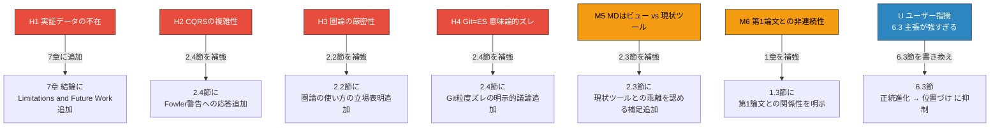

# angs-essay-ja.md 改善案

## 改善の方針

2つのレビュー（claude-chat-review / gemini-review）の指摘を統合し、論文の**主張の強度を適切に調整**する方針で改善する。過剰な主張を抑え、認めるべき限界を正直に認め、論文としての誠実さを高める。

---

## 改善マップ

**Improvement_Map:**



---

## 改善1: 1.3節 — 第1論文との関係性を明示（M6対応）

**対象:** 1.3節「本論文の目的」

**現状の問題:** 第1論文からの非連続性（MD中心 → G×V中心というパラダイム転換）に言及がない。読者が2つの論文の関係を誤解する。

**改善案:** 1.3節の末尾に以下を追加する。

```markdown
### 1.3 本論文の目的

本論文の目的は、ANMSのSTFB階層構造を保持したまま、大規模プロジェクトにおける仕様管理とエージェント協調の設計を示すことである。

なお、第1論文[1]ではMarkdown単一ファイルに全情報を集約することをアーキテクチャの中心に置いた。本論文は仕様の本体を $\mathcal{G} \times \mathcal{V}$（GraphDB × Git）に移し、Markdownをビューとして再定義する。これは第1論文の拡張ではなく、前提の転換である。第1論文は「単一コンテキストウィンドウに収まる規模」に対して依然として有効であり、本論文は「収まらない規模」に対する別解を提示する。両者はスケールによって使い分ける関係にある。
```

**意図:** 非連続性を隠さず明示した上で、対立ではなく「スケールによる使い分け」として位置づける。

---

## 改善2: 2.2節 — 圏論の立場表明（H3対応）

**対象:** 2.2節「仕様管理を圏論で概念化」

**現状の問題:** 圏論を「概念化ツール」として使っているのか「形式的保証ツール」として使っているのかが曖昧。特に $\mathcal{V}$（Git）における射（diff）の合成が圏の公理を満たすかは自明ではない。

**改善案:** 2.2節の冒頭（圏の定義表の前）に以下を挿入する。

```markdown
**本論文における圏論の位置づけ:**
本設計では圏論を**概念化ツール**として使用する。すなわち、3要素の関係を統一的に記述し、可換性の破れを設計レベルで検知するための言語として用いる。圏の公理（結合律、単位元の存在）の形式的証明は本論文の範囲外であり、特に $\mathcal{V}$（Git）の射（diff）が厳密に圏の公理を満たすかには追加検証が必要である。可換条件 $F \circ H \cong J$ は実装上の整合性テストの指針として機能するものであり、数学的な同値証明ではない点に注意されたい。
```

**意図:** 立場を明確にすることで「厳密性が不十分」という批判を先手で封じる。概念化ツールとしての有用性は損なわない。

---

## 改善3: 2.3節 — 現状ツールとの乖離を認める（M5対応）

**対象:** 2.3節「Markdownは中継点ではなくビュー」

**現状の問題:** 「MDはビューに過ぎない」と主張するが、現状のAIエージェント（Claude Code含む）はMarkdownを主要入力とする。GraphDBから直接クエリを受け取れるエージェントが存在しない。

**改善案:** 2.3節の末尾に以下を追加する。

```markdown
**現状との乖離:** 2026年現在、主要なAIコーディングエージェント（Claude Code、Cursor、GitHub Copilot等）はMarkdownファイルを主要な入力形式として設計されている。GraphDBから直接クエリ結果を受け取り、それに基づいて推論するエージェントは実用段階にない。したがって、本設計の「MDはビュー」という原則は、現行ツールチェーンとの間にインピーダンスミスマッチを抱える。短期的には、オーガナイザーエージェントがGraphDBからサブグラフを抽出し、それをMarkdownにレンダリングしてサブエージェントに渡す — すなわちMDを「エージェント間のシリアライズ形式」として一時的に利用する運用が現実的である。
```

**意図:** 理想と現実のギャップを正直に認めることで、「使えない」という批判を「今は段階的に移行する」に転換する。

---

## 改善4: 2.4節 — CQRSの複雑性とGit粒度ズレ（H2 + H4対応）

**対象:** 2.4節「GraphDB自体にバージョニング機能は不要」

**現状の問題:**

- Fowlerの「ほとんどのシステムでは過剰」という警告への応答がない
- Gitのコミットとドメインイベントの粒度が異なる意味論的ズレに言及がない

**改善案:** 2.4節の末尾に以下を追加する。

```markdown
**CQRSの複雑性に関する注記:**
Martin Fowlerは「CQRSはほとんどのシステムでは過剰なリスクを加える複雑さである」と警告している[補足]。本設計においてCQRSを採用する理由は、仕様管理が本質的にread-heavyなドメインだからである。エージェントは仕様を高頻度で参照（read）し、変更（write）は人間のレビューを経て低頻度で発生する。このread/writeの非対称性がCQRSのトレードオフを正当化する。単一コンテキストウィンドウに収まる規模では、第1論文のMarkdown単一ファイルアプローチが適切であり、CQRSの導入は不要である。

**Gitをイベントストアとして扱う際の粒度ズレ:**
CQRSにおけるEvent Storeはドメインイベント（「要件FR-042が追加された」「コンポーネントCMP-003の依存先が変更された」）の追記専用ログであり、過去状態の再構築（replay）に最適化されている。一方、Gitのコミットは「ファイルの差分」であり、1つのコミットに複数のドメインイベントが混在しうる。この粒度ズレは実装上の課題として認識している。対策として、コミットメッセージにドメインイベントの構造化タグ（例: `[ADD:FR-042] [MOD:CMP-003:depends_on]`）を含め、 $J$ 関手（rebuild）がタグを解析してグラフ操作に変換する設計が考えられる。ただし、この対策の有効性は実装検証を必要とする。
```

**意図:** Fowler警告に正面から応答し、適用条件を明確にする。Git粒度ズレは認めつつ、具体的な対策案を示す。

---

## 改善5: 6.3節 — 主張の抑制（ユーザー指摘対応）

**対象:** 6.3節「本提案の位置づけ」（旧タイトル案: ANMSは正統進化である）

**現状の問題:** 「正統進化である」は主張として強すぎる。

**改善案:** 現在の6.3節は既に「本提案の位置づけ」というタイトルだが、本文末尾の主張も調整する。

現在の末尾:

```
これは特異な提案ではない。プログラミングの歴史における「抽象度を上げ、制約で品質を担保する」という一貫したパターンの、次のステップである。
```

改善後:

```markdown
ANMSは、この系譜の延長線上に位置づけられる。抽象度が上がるほど制約が必要になるという歴史的パターンに対し、AI Code世代における制約の一案を提示したものである。唯一の解ではなく、最良の解である保証もない。しかし、問題の構造（コンテキスト喪失→ハルシネーション）に対して構造的な制約で応答するという方向性は、過去の世代が辿った道筋と整合している。
```

**意図:** 「次のステップである」（断定）→「延長線上に位置づけられる」「一案である」（控えめな主張）に調整。

---

## 改善6: 7章 — Limitations and Future Work の追加（H1対応）

**対象:** 7章「結論」

**現状の問題:** 実証データの不在が最大の弱点だが、論文内でこれに言及していない。

**改善案:** 結論の前に「7. 限界と今後の課題」を新設し、現在の「7. 結論」を「8. 結論」に繰り下げる。

```markdown
## 7. 限界と今後の課題

### 7.1 実装検証の不在

本論文は設計論であり、実装による検証を伴っていない。以下の主張は実装検証なしでは理論的提案に留まる。

| 主張                                                         | 検証に必要なもの                                                    |
| ------------------------------------------------------------ | ------------------------------------------------------------------- |
| 可換性の破れ $F \circ H \ncong J$ がバグ検出に有効           | F, H, J関手の実装と不整合検出率の計測                               |
| 忘却関手によるコンテキスト最小化がハルシネーションを抑制する | エージェントへのフル/最小コンテキスト投入でのハルシネーション率比較 |
| STFB×CA統一の direction 制約が依存方向違反を防止する         | グラフDB上での制約違反検知と、違反を含む仕様での実装品質比較        |

今後の課題として、中規模プロジェクト（要件50〜200件程度）での参照実装とパイロット検証を予定する。

### 7.2 CQRSの導入コスト

GraphDB + Git + Organizer Agent + Markdown Renderer の4コンポーネント構成は、Markdown単一ファイルとの比較で導入コストが大幅に増加する。この設計が正当化されるプロジェクト規模の閾値（要件数、エージェント数）の特定も今後の課題である。

### 7.3 圏論の形式的検証

本論文では圏論を概念化ツールとして使用したが、 $\mathcal{M}$, $\mathcal{G}$, $\mathcal{V}$ が圏の公理を厳密に満たすかの形式的証明は行っていない。特に $\mathcal{V}$（Git）における射の合成が結合律を満たすかは、diffの表現と適用順序に依存する問題であり、追加の形式的検討を必要とする。
```

**意図:** 弱点を自ら認めることで、論文の誠実さを高める。「知らなかった」ではなく「認識した上で今後の課題とする」姿勢。

---

## 改善の優先順位

| 優先度 | 改善                   | 対応する指摘      | 工数感             |
| ------ | ---------------------- | ----------------- | ------------------ |
| 1      | 改善6: Limitations追加 | H1 実証データ不在 | 新規セクション追加 |
| 2      | 改善4: CQRS + Git粒度  | H2 + H4           | 2.4節末尾追加      |
| 3      | 改善2: 圏論の立場表明  | H3                | 2.2節冒頭挿入      |
| 4      | 改善5: 6.3節抑制       | ユーザー指摘      | 末尾書き換え       |
| 5      | 改善3: MDビュー乖離    | M5                | 2.3節末尾追加      |
| 6      | 改善1: 第1論文関係     | M6                | 1.3節末尾追加      |

## 改善しないもの（強みとして維持）

レビューで評価された以下の要素は変更しない。

- 問題設定の誠実さ（第1論文の限界を自己批判）
- 可換条件 $F \circ H \cong J$ の定式化
- STFB×CA統一のグラフスキーマ埋め込み
- 忘却関手＝コンテキスト最小化の独自性
- 4つの認知操作ペアの枠組み
- プログラミング史の抽象化段階論（主張強度のみ調整）
