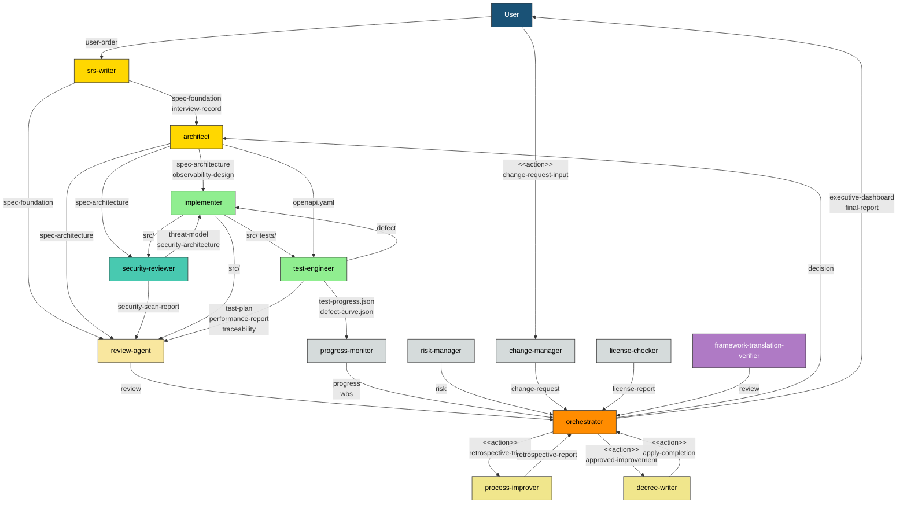
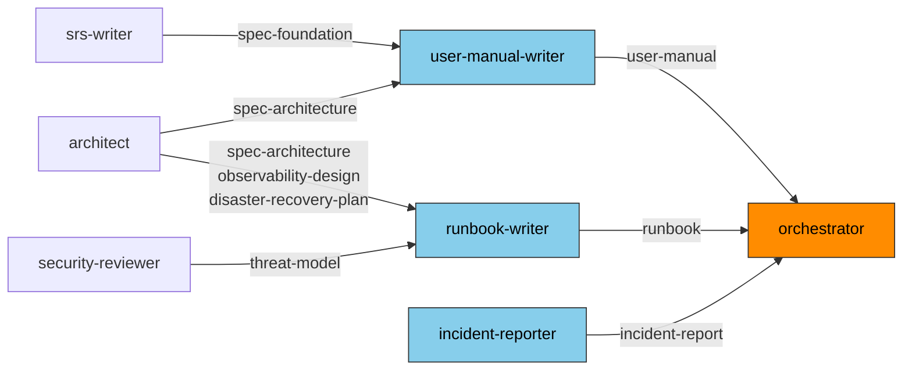
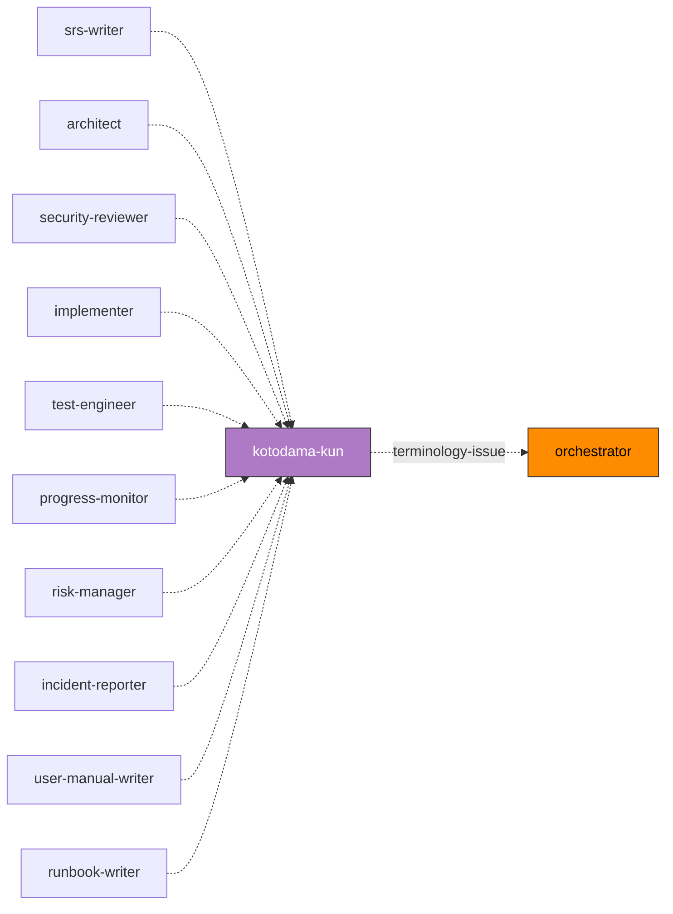

# Agent List

> **Document purpose:** Single Source of Truth for all agents registered in the full-auto-dev framework. Update this document when adding, modifying, or removing agents.
> **Derived from:** [Process Rules](full-auto-dev-process-rules.md) §2-4, §7, §9 / [Document Management Rules](full-auto-dev-document-rules.md) §7, §7.1, §11
> **Related documents:** [Prompt Structure Convention](prompt-structure.md), each agent prompt (`.claude/agents/*.md`)

---

## 1. Agent List

| # | name | Role | model | Primary Phase |
|:-:|------|------|:-----:|--------------|
| 1 | orchestrator | Overall project orchestration, phase transition control, decision recording | opus | All phases |
| 2 | srs-writer | User concept structuring, interviews, spec Ch1-2 creation | opus | planning |
| 3 | architect | Spec Ch3-6 elaboration, OpenAPI / observability / external dependency requirement design | opus | design |
| 4 | security-reviewer | Threat modeling, security design, vulnerability scanning | opus | design, implementation |
| 5 | implementer | Source code implementation, unit test creation | opus | implementation |
| 6 | test-engineer | Test planning / execution, coverage measurement, performance testing | sonnet | testing |
| 7 | review-agent | Quality review from R1-R6 perspectives, quality gate judgment | opus | All phases (at gates) |
| 8 | progress-monitor | WBS management, progress tracking, quality metrics monitoring, anomaly detection | sonnet | design onward |
| 9 | change-manager | Acceptance, impact analysis, and recording of user-initiated change requests | sonnet | planning onward (after spec approval) |
| 10 | risk-manager | Risk identification, assessment, monitoring, and risk register management | sonnet | planning onward |
| 11 | license-checker | OSS license compatibility verification, attribution management | haiku | implementation, delivery |
| 12 | kotodama-kun | Terminology and naming consistency check (framework glossary + project glossary) | haiku | All phases (at Out generation) |
| 13 | framework-translation-verifier | Verify translation consistency across multilingual framework documents | sonnet | delivery (pre-release) |
| 14 | user-manual-writer | User manual creation | sonnet | delivery |
| 15 | runbook-writer | Operations runbook creation | sonnet | delivery |
| 16 | incident-reporter | Incident report creation | sonnet | operation |
| 17 | process-improver | Retrospective, root cause analysis, and process improvement proposal | sonnet | All phases (at phase completion) |
| 18 | decree-writer | Safe application of approved improvements to governance files | sonnet | All phases (at phase completion) |

---

## 2. file_type Ownership Matrix

Derived from Document Management Rules §11. **Each file_type has a single owner.**

### orchestrator

| file_type | Directory | S/M | Primary Phase |
|-----------|-----------|:---:|--------------|
| pipeline-state | project-management/ | S | All phases |
| executive-dashboard | root | S | setup onward |
| final-report | root | S | delivery |
| decision | project-records/decisions/ | M | All phases |
| handoff | project-management/handoff/ | M | All phases |
| stakeholder-register | project-management/ | S | setup |

### srs-writer

| file_type | Directory | S/M | Primary Phase |
|-----------|-----------|:---:|--------------|
| user-order | root | S | planning (validation) |
| interview-record | project-management/ | S | planning |
| spec-foundation | docs/spec/ | S | planning |

> srs-writer is responsible for validation only of user-order; user-order itself is not modified. The initial creation is performed by the user. Gaps identified during validation are resolved through interviews and reflected in spec-foundation.

### architect

| file_type | Directory | S/M | Primary Phase |
|-----------|-----------|:---:|--------------|
| spec-architecture | docs/spec/ | S | design |
| observability-design | docs/observability/ | S | design |
| hw-requirement-spec | docs/hardware/ | S | design (conditional) |
| ai-requirement-spec | docs/ai/ | S | design (conditional) |
| framework-requirement-spec | docs/framework/ | S | design (conditional) |
| disaster-recovery-plan | docs/operations/ | S | design |

> In addition to the above file_types, architect generates and manages openapi.yaml (docs/api/). openapi.yaml is an external tool prescribed format (Document Management Rules §13) and is not a file_type, but is consumed by implementer and test-engineer.

### security-reviewer

| file_type | Directory | S/M | Primary Phase |
|-----------|-----------|:---:|--------------|
| threat-model | docs/security/ | S | design |
| security-architecture | docs/security/ | S | design |
| security-scan-report | project-records/security/ | M | implementation onward |

### implementer

| file_type | Directory | S/M | Primary Phase |
|-----------|-----------|:---:|--------------|
| (source code) | src/ | — | implementation |
| (unit tests) | tests/ | — | implementation |

> implementer generates code (src/, tests/), but these are not subject to Common Block management. Traceability is managed via traceability-matrix.

### test-engineer

| file_type | Directory | S/M | Primary Phase |
|-----------|-----------|:---:|--------------|
| test-plan | project-management/ | S | design |
| defect | project-records/defects/ | M | testing |
| traceability | project-records/traceability/ | S | implementation onward |
| performance-report | project-records/performance/ | M | testing |

> In addition to the above file_types, test-engineer generates test-progress.json and defect-curve.json (project-management/progress/). These are JSON time-series data and not file_types (not subject to Common Block management), but are consumed by progress-monitor.

### review-agent

| file_type | Directory | S/M | Primary Phase |
|-----------|-----------|:---:|--------------|
| review | project-records/reviews/ | M | All phases (at gates) |

### progress-monitor

| file_type | Directory | S/M | Primary Phase |
|-----------|-----------|:---:|--------------|
| progress | project-management/progress/ | M | design onward |
| wbs | project-management/progress/ | S | design onward |

### change-manager

| file_type | Directory | S/M | Primary Phase |
|-----------|-----------|:---:|--------------|
| change-request | project-records/change-requests/ | M | planning onward (after spec approval) |

### risk-manager

| file_type | Directory | S/M | Primary Phase |
|-----------|-----------|:---:|--------------|
| risk | project-records/risks/ | M | planning onward |

### license-checker

| file_type | Directory | S/M | Primary Phase |
|-----------|-----------|:---:|--------------|
| license-report | project-records/licenses/ | S | implementation, delivery |

### kotodama-kun

> kotodama-kun does not own any file_type. Check reports are communicated verbally to orchestrator for minor issues, or recorded as a review in project-records/reviews/ for significant issues (borrowing review-agent's file_type).

| Input | Provider | Purpose |
|-------|----------|---------|
| (artifacts to be checked) | Each agent | Target for terminology and naming check |
| glossary.md | framework | Cross-reference with framework glossary |
| spec-foundation (Ch1.8 Glossary) | srs-writer | Cross-reference with project glossary |
| full-auto-dev-document-rules.md §7 | framework | Authoritative definition of file_type names and namespaces |

### framework-translation-verifier

> framework-translation-verifier does not own any file_type. Verification results are recorded as a review in project-records/reviews/ (borrowing review-agent's file_type).

| Input | Provider | Purpose |
|-------|----------|---------|
| Multilingual file pairs (`*-en.md` / `*-ja.md`) | framework | Targets for translation consistency verification |
| process-rules/, essays/, README, etc. | framework | Structure, table, link, code block, and terminology consistency verification |

### user-manual-writer

| file_type | Directory | S/M | Primary Phase |
|-----------|-----------|:---:|--------------|
| user-manual | docs/ | S | delivery |

### runbook-writer

| file_type | Directory | S/M | Primary Phase |
|-----------|-----------|:---:|--------------|
| runbook | docs/operations/ | S | delivery |

### incident-reporter

| file_type | Directory | S/M | Primary Phase |
|-----------|-----------|:---:|--------------|
| incident-report | project-records/incidents/ | M | operation |

### process-improver

| file_type | Directory | S/M | Primary Phase |
|-----------|-----------|:---:|--------------|
| retrospective-report | project-records/improvement/ | M | All phases (at phase completion) |

### decree-writer

> decree-writer does not own any file_type. The before/after diff of application results is recorded in project-records/improvement/ (as a supplement to retrospective-report).

| Input | Provider | Purpose |
|-------|----------|---------|
| retrospective-report | process-improver | Reference for improvements to be applied |
| decision | orchestrator | Confirmation of approval records |

---

## 3. Inter-Agent Data Flow

Shows dependencies between agents through the flow of file_types and actions.

**Inter-Agent Data Flow:**

The diagram above shows the main data flow between agents, derived from the process rules. Arrow labels indicate the file_types or actions being passed. For DocWriter agents (document creation agents) and kotodama-kun (terminology check), see the separate diagrams below.

**DocWriter Agents (Document Creation Agents):**

During the delivery phase, user-manual-writer and runbook-writer are activated. They reference upstream agent design documents as input and deliver artifacts to orchestrator. incident-reporter is activated during the operation phase.

**kotodama-kun (Terminology Check):**

All agents that generate Out request a terminology check from kotodama-kun before handoff. Significant terminology inconsistencies are reported to orchestrator as a review file_type. See the Procedure section of each agent definition for details.

**Label Distinction:**

| Label Format | Meaning | Example |
|-------------|---------|---------|
| `file_type name` | file_type handoff (file artifact) | `spec-foundation`, `review`, `retrospective-report` |
| `<<action>> name` | Action/trigger without a file artifact | `<<action>> retrospective-trigger`, `<<action>> approved-improvement` |

**Action List:**

| Action Label | Sender | Receiver | Description |
|-------------|--------|----------|-------------|
| change-request-input | User | change-manager | User-initiated change request (recorded as change-request file_type after acceptance) |
| retrospective-trigger | orchestrator | process-improver | Instruction to initiate retrospective at phase completion |
| approved-improvement | orchestrator | decree-writer | Instruction to apply approved improvement (decision record serves as basis) |
| apply-completion | decree-writer | orchestrator | Report of improvement application completion (before/after diff recorded in project-records/improvement/) |

**About kotodama-kun (Terminology Check):**

kotodama-kun does not have arrows in the diagram, but all agents that generate Out request a terminology check before handoff. See the Procedure section of each agent definition for details. Significant terminology inconsistencies are reported to orchestrator as a review file_type.

Agents that **do not use** kotodama-kun:

| Agent | Reason |
|-------|--------|
| orchestrator | Does not generate file_type content itself (management and forwarding only) |
| review-agent | Evaluates other agents' artifacts |
| change-manager | Only records user-initiated change requests; minimal terminology creation |
| license-checker | Records external license names as-is |
| framework-translation-verifier | Primary duty is translation consistency verification; does not modify terminology definitions |
| decree-writer | Only applies approved improvements; does not generate new terminology |

---

## 4. Phase Activation Map

Which agents are activated in which phases.

| Phase | Activated Agents | Quality Gate |
|-------|-----------------|-------------|
| setup | orchestrator | CLAUDE.md approval |
| planning | orchestrator, srs-writer, kotodama-kun, review-agent, process-improver, decree-writer | R1 PASS -> spec approval |
| dependency-selection | orchestrator, architect, kotodama-kun, license-checker | User selection approval |
| design | orchestrator, architect, security-reviewer, kotodama-kun, progress-monitor, risk-manager, review-agent, process-improver, decree-writer | R2/R4/R5 PASS |
| implementation | orchestrator, implementer, test-engineer (unit), security-reviewer (SCA), kotodama-kun, license-checker, review-agent, progress-monitor, process-improver, decree-writer | R2/R3/R4/R5 PASS, SCA clear |
| testing | orchestrator, test-engineer, kotodama-kun, review-agent, progress-monitor, process-improver, decree-writer | R6 PASS, all tests PASS |
| delivery | orchestrator, kotodama-kun, review-agent, license-checker, framework-translation-verifier, user-manual-writer, runbook-writer, process-improver, decree-writer | R1-R6 all PASS, translation consistency verification PASS, user acceptance |
| operation | orchestrator, security-reviewer (patching), progress-monitor, incident-reporter, process-improver, decree-writer | SLA achieved |

---

## 5. Procedure for Adding New Agents

1. Add the agent to §1 of this list
2. Add the assigned file_types to §2 (confirm no overlap with existing agents)
3. Update the data flow diagram in §3
4. Update the activation map in §4
5. Create `.claude/agents/{name}.md` following the [Prompt Structure Convention](prompt-structure.md)
6. Update Document Management Rules §7 (file_type table), §7.1 (workflow reference table), and §11 (ownership model)
