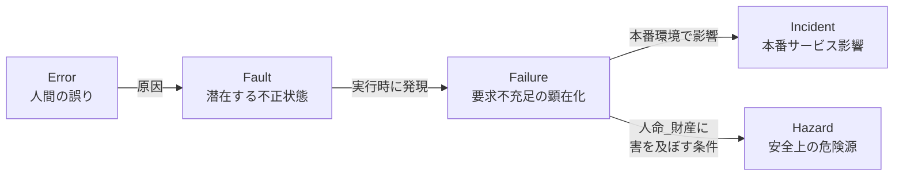
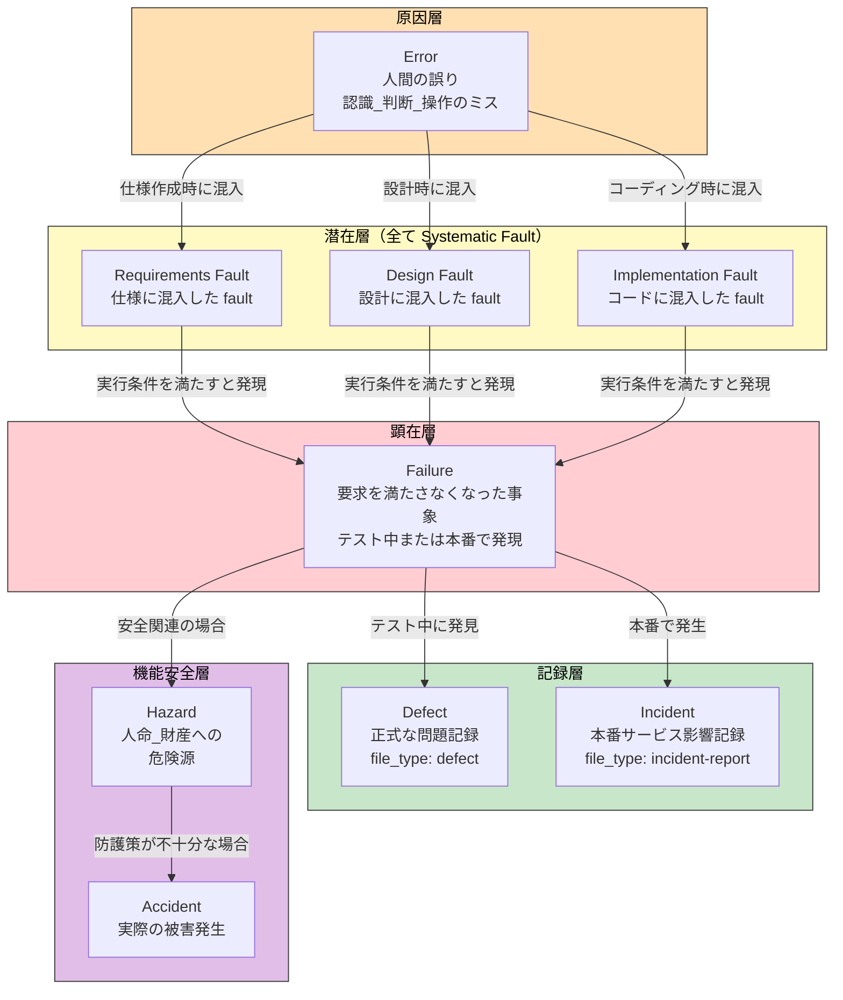
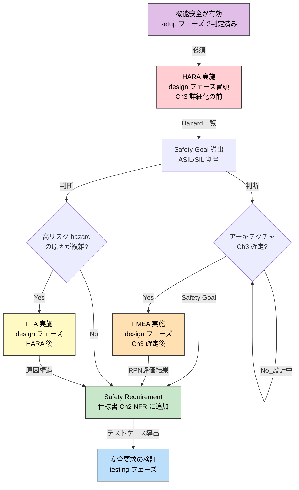
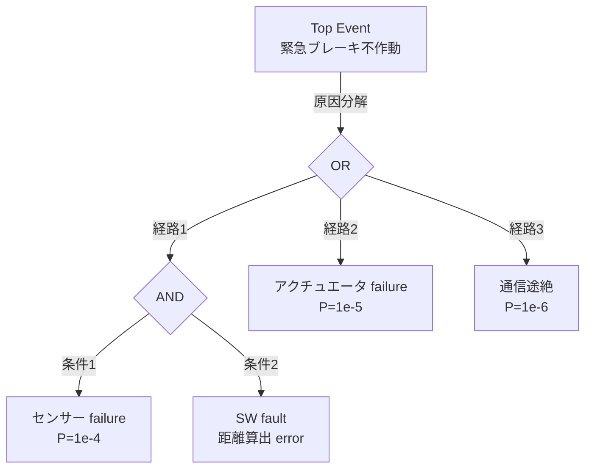

``````markdown
# Defect Taxonomy — 不具合系用語の体系整理

## 1. 背景と目的

ソフトウェア開発において「不具合」を表す用語は多数存在し、文脈によって意味が異なる。本文書は IEEE 1044、IEC 61508、ISO 26262、ITIL を参照し、full-auto-dev フレームワークで使用する不具合系用語を一意に定義する。

**設計原則:** 日本語の「障害」「不具合」「故障」は多義的であるため、本フレームワークでは**英単語をそのまま使用**し、曖昧さを排除する。

---

## 2. 因果連鎖モデル（IEEE 1044 / IEC 61508）

**因果連鎖:**



Error が Fault を生み、Fault が発現して Failure になり、本番で Failure がサービスに影響すると Incident になる。Failure が人命・財産に害を及ぼす条件を持つとき、それを Hazard と呼ぶ（機能安全の文脈）。

---

## 3. 用語定義

### 3.1 因果連鎖上の用語（技術概念）

| 用語 | 参照規格 | 定義 | 具体例 |
|------|---------|------|--------|
| **Error** | IEEE 1044 | 人間の認識・判断・操作のミス。Fault の原因 | 配列の境界条件を誤認して off-by-one のコードを書いた |
| **Fault** | IEEE 1044, IEC 61508 | Error の結果、コード・設計・仕様に埋め込まれた不正状態。潜在的であり、特定の実行条件を満たすまで発現しない | `if (i <= array.length)` という境界条件の誤り（コードに存在するが、まだ実行されていない） |
| **Failure** | IEEE 1044, IEC 61508 | Fault が実行時に発現し、システムが要求（機能要求または非機能要求）を満たさなくなった事象 | 上記の off-by-one が実行され、ArrayIndexOutOfBoundsException が発生した |

### 3.2 Fault Origin（混入フェーズによる分類）

Fault は混入したフェーズによって3つに分類される。Defect の root cause analysis で fault origin を特定することで、修正すべき対象（仕様か、設計か、コードか）が決まる。

| 用語 | 参照規格 | 定義 | 具体例 |
|------|---------|------|--------|
| **Requirements Fault** | IEEE 1044 | 要求・仕様に混入した fault。仕様自体が間違っている、または不足している | 「ログインは3回失敗でロック」の要求なのに仕様書に記載されていない。または「5回」と誤記 |
| **Design Fault** | IEEE 1044 | 設計に混入した fault。仕様は正しいが設計が間違っている | 仕様は正しいがシーケンス図でロック判定をDB層でなくUI層に配置してしまった |
| **Implementation Fault** | IEEE 1044 | 実装に混入した fault（= coding fault）。設計は正しいがコードが間違っている | 設計は正しいが `failCount >= 3` を `failCount > 3` と書いた |

**Fault Origin と修正対象の対応:**

| Fault Origin | 修正対象 | 影響範囲 |
|-------------|---------|---------|
| Requirements Fault | 仕様書 Ch1-2（spec-foundation） | 設計・実装・テスト全てに波及。最もコストが高い |
| Design Fault | 仕様書 Ch3-4（spec-architecture） | 実装・テストに波及 |
| Implementation Fault | ソースコード（src/） | テストに波及。最もコストが低い |

### 3.3 Systematic Fault vs Random Hardware Fault（IEC 61508）

IEC 61508 では fault を決定論的なものと確率論的なものに大別する。

| 用語 | 参照規格 | 定義 | SW に存在するか |
|------|---------|------|:---------------:|
| **Systematic Fault** | IEC 61508 | 人間の error に起因する決定論的 fault。requirements / design / implementation の全てを含む。同じ条件で必ず再現する | Yes |
| **Random Hardware Fault** | IEC 61508 | HW の物理的劣化（経年、放射線等）に起因する確率論的 fault。確率的にしか発現しない | No（SW 固有の概念ではない） |

**SW のすべての fault は systematic fault である。** SW は物理的に劣化しないため、random hardware fault は存在しない。つまり SW の fault は必ず人間の error に起因し、同じ入力と状態で必ず再現する。これは「再現できない SW の failure は、条件の特定が不十分なだけ」ということを意味する。

### 3.4 記録・管理上の用語（プロセス概念）

| 用語 | 参照規格 | 定義 | file_type | フェーズ |
|------|---------|------|-----------|---------|
| **Defect** | IEEE 1044 | テストまたは運用で発見された Failure（または Fault）の正式記録。再現手順・重大度・根本原因・修正内容を含む | `defect` | testing, implementation |
| **Incident** | ITIL, ISO 20000 | 本番環境で発生した計画外のサービス中断または品質低下事象。検知→調査→軽減→解決→事後分析の一連を記録する | `incident-report` | operation |

### 3.5 機能安全固有の用語

| 用語 | 参照規格 | 定義 | 前提条件 |
|------|---------|------|---------|
| **Hazard** | IEC 61508, ISO 26262 | Failure が人命・身体・財産・環境に害を及ぼしうる危険源。Hazard 自体はまだ事故（Accident）ではない | 条件付きプロセス「機能安全（HARA/FMEA）」が有効な場合のみ |
| **Risk（安全）** | IEC 61508 | Hazard の発生確率 × 暴露 × 制御可能性。プロジェクトリスク（file_type: risk）とは異なる概念 | 同上 |
| **ASIL** | ISO 26262 | Automotive Safety Integrity Level。Risk 評価に基づく安全度水準（A〜D）。車載以外では SIL（IEC 61508）を使用 | 同上 |
| **HARA** | ISO 26262 | Hazard Analysis and Risk Assessment。Hazard の特定と Risk 評価を行う分析手法 | 同上 |
| **FMEA** | IEC 60812 | Failure Mode and Effects Analysis。Fault の発生モードとその影響を体系的に分析する手法 | 同上 |

---

## 4. 因果連鎖の詳細図

**Error から Accident までの完全な因果連鎖（fault origin 分類付き）:**



因果連鎖は5層で構成される。橙（原因）→ 黄（潜在）→ 赤（顕在）→ 緑（記録）→ 紫（安全）。潜在層の fault は全て systematic fault（人間の error に起因する決定論的 fault）であり、fault origin によって requirements / design / implementation の3種に分類される。通常の SW 開発では原因〜記録層を扱い、機能安全が有効な場合のみ安全層が加わる。

---

## 5. 紛らわしい対の区別

### 5.1 Fault vs Defect

| 観点 | Fault | Defect |
|------|-------|--------|
| 性質 | 技術的状態（潜在） | 管理的記録（文書） |
| 存在場所 | コード・設計の中 | project-records/defects/ |
| 可視性 | テストで発見されるまで見えない | 起票された時点で可視 |
| 関係 | Fault が発見されて起票されると… | → Defect になる |

### 5.2 Failure vs Incident

| 観点 | Failure | Incident |
|------|---------|----------|
| スコープ | 技術的事象（テスト中でも本番でも） | 運用的事象（本番環境のみ） |
| 発生場所 | テスト環境、開発環境、本番環境 | 本番環境のみ |
| 記録先 | テスト中 → Defect、本番 → Incident | file_type: incident-report |
| 関係 | 全ての Incident は Failure だが… | テスト中の Failure は Incident ではない |

### 5.3 Defect vs Incident

| 観点 | Defect | Incident |
|------|--------|----------|
| フェーズ | implementation, testing | operation |
| owner | test-engineer | orchestrator |
| 目的 | Fault の修正と再発防止 | サービス復旧と事後分析 |
| file_type | `defect` (DEF-NNN) | `incident-report` (INC-NNN) |
| 関係 | Incident の根本原因調査で新たな Defect が起票されることがある |

### 5.4 Hazard vs Risk（プロジェクト）

| 観点 | Hazard | Risk（file_type: risk） |
|------|--------|------------------------|
| 参照規格 | IEC 61508, ISO 26262 | PMBOK, CMMI-RSKM |
| 対象 | 人命・財産・環境への危害 | プロジェクト目標（スケジュール・コスト・品質）への影響 |
| 評価式 | 発生確率 × 暴露 × 制御可能性 | 発生確率 × 影響度（スコア 1-9） |
| 適用条件 | 条件付きプロセス「機能安全」が有効な場合のみ | 全プロジェクト（必須プロセス） |
| 記録先 | project-records/safety/ | project-records/risks/ |

---

## 6. フレームワークでの用語使い分けルール

### 6.1 基本ルール

1. **英単語をそのまま使う。** Error, Fault, Failure, Defect, Incident, Hazard は日本語に訳さない
2. **「障害」「不具合」「故障」「バグ」は使わない。** 多義的な日本語を排除し、英単語で一意に指す
3. **文脈で意味が決まるのではなく、用語で意味が決まる。** 「障害対応」ではなく「Incident 対応」、「障害票」ではなく「Defect 票」

### 6.2 file_type との対応

| 用語 | file_type | ID形式 | 記録先 |
|------|-----------|--------|--------|
| Defect | `defect` | DEF-NNN | project-records/defects/ |
| Incident | `incident-report` | INC-NNN | project-records/incidents/ |
| Hazard | （HARA/FMEA の分析結果として project-records/safety/ に記録） | — | project-records/safety/ |

### 6.3 Defect の根本原因分析で使う用語

Defect の Detail Block に根本原因を記載する際、因果連鎖の用語を使って構造化する。

```markdown
## Root Cause Analysis

- **Failure**: ログイン時に 500 エラーが返却される
- **Fault**: `auth-service.ts:42` で null チェックが欠落
- **Fault Origin**: implementation fault（設計には null ガード指示あり。コーディング時の見落とし）
- **Error**: 開発者がOAuth応答の nullable フィールドを見落とした
- **修正**: null チェックを追加し、未認証時は 401 を返却する
- **再発防止**: OAuth 応答型に strict null check を適用する lint ルールを追加
```

上記のように、Failure（何が起きたか）→ Fault（コードのどこが悪いか）→ Fault Origin（仕様/設計/実装のどこで混入したか）→ Error（なぜそうなったか）の順に記載することで、修正対象の特定と再発防止策の精度が上がる。

**Fault Origin による修正判断:**

| Fault Origin | 修正すべき成果物 | review-agent の観点 |
|-------------|-----------------|-------------------|
| Requirements Fault | spec-foundation（Ch1-2）→ 以降の全成果物に波及 | R1（要求品質） |
| Design Fault | spec-architecture（Ch3-4）→ 実装・テストに波及 | R2（設計原則） |
| Implementation Fault | src/（ソースコード）→ テストに波及 | R3（コーディング品質） |

---

## 7. 機能安全の分析手法（HARA / FMEA / FTA）

条件付きプロセス「機能安全」が有効な場合に使用する3つの分析手法を定義する。

### 7.1 手法の概要と使い分け

| 手法 | 参照規格 | 目的 | アプローチ |
|------|---------|------|-----------|
| **HARA** | ISO 26262 | システムレベルで hazard を特定し、safety goal を導出する | トップダウン: 機能→failure mode→hazard→risk 評価→ASIL/SIL 割当 |
| **FMEA** | IEC 60812 | コンポーネントレベルで fault のモードと影響を網羅的に分析する | ボトムアップ: 各部品/モジュール→failure mode→影響→RPN（重大度×発生度×検出度） |
| **FTA** | IEC 61025 | 特定の望ましくない事象（top event）から原因を逆探索する | トップダウン: top event→AND/OR ゲートで原因を論理分解→基本事象の確率計算 |

### 7.2 採用判断基準と実施時期

**安全分析の実施フロー:**



安全分析は HARA を起点とし、FMEA と FTA は HARA の結果を深掘りする手法。HARA は必須、FMEA と FTA は条件付きで実施する。

**採用判断基準:**

| 手法 | 採用基準 | 判断時期 | 担当 |
|------|---------|---------|------|
| **HARA** | 機能安全が有効な**全プロジェクトで必須** | setup フェーズ（機能安全の有効化と同時に確定） | architect（security-reviewer が支援） |
| **FMEA** | HARA が有効 **かつ** アーキテクチャ（Ch3）が確定した段階で実施。SW-FMEA はモジュール分割が決まらないと意味がない | design フェーズ（Ch3 確定後） | architect |
| **FTA** | 以下のいずれかに該当する場合: (a) HARA で特定された **ASIL C 以上**（または SIL 3 以上）の hazard の原因分析、(b) **複数の独立した fault が AND 条件で組み合わさって hazard に至る**パターンの可視化が必要、(c) operation フェーズで**重大 incident の根本原因分析**が因果関係が複雑で defect の RCA だけでは不十分な場合 | design フェーズ（HARA 後）、または operation フェーズ（incident 発生時） | architect（design）、orchestrator（operation） |

### 7.3 HARA の詳細

**目的:** システムが引き起こしうる全 hazard を特定し、各 hazard に safety goal を割り当てる。

**入力:** spec-foundation（Ch1-2: 機能要求・非機能要求）、interview-record（ドメイン知識）

**出力:** Hazard 一覧、Safety Goal 一覧、ASIL/SIL 割当、Safety Requirement（spec-foundation Ch2 NFR に追加）

**手順:**
1. システムの機能を列挙する（spec-foundation Ch2 の FR 一覧から）
2. 各機能の failure mode を識別する（「この機能が誤動作/停止/意図しない動作をしたら？」）
3. 各 failure mode が引き起こす hazard を特定する（「人命・財産・環境への影響は？」）
4. 各 hazard の risk を評価する（発生確率 × 暴露 × 制御可能性）
5. 安全度水準を割り当てる（ISO 26262: ASIL A〜D、IEC 61508: SIL 1〜4）
6. 各 hazard に対する safety goal を導出する
7. safety goal から safety requirement を導出し、spec-foundation Ch2 の NFR に追加する

**記録先:** `project-records/safety/hara-{YYYYMMDD}.md`

### 7.4 FMEA の詳細

**目的:** アーキテクチャの各コンポーネントについて、fault のモードと影響を網羅的に分析し、設計の弱点を発見する。

**入力:** spec-architecture（Ch3: コンポーネント設計）、HARA の結果（safety goal）

**出力:** FMEA テーブル（コンポーネント × failure mode × 影響 × 重大度 × 発生度 × 検出度 × RPN）、設計改善推奨

**手順:**
1. アーキテクチャの各コンポーネント/モジュールを列挙する
2. 各コンポーネントの failure mode を識別する
3. 各 failure mode の影響（局所的/システム全体/安全）を評価する
4. RPN（Risk Priority Number）= 重大度(S) × 発生度(O) × 検出度(D) を算出する
5. RPN が閾値を超えるものに対して設計改善策を提案する
6. 改善策を spec-architecture に反映する

**RPN 閾値の目安:**

| RPN 範囲 | リスクレベル | アクション |
|----------|-----------|-----------|
| 1-50 | Low | 現状維持。記録のみ |
| 51-100 | Medium | 改善を検討。次の設計イテレーションで対応 |
| 101-200 | High | 改善必須。design フェーズ内で対応 |
| 201+ | Critical | 即時対応。アーキテクチャの再設計を検討 |

**記録先:** `project-records/safety/fmea-{YYYYMMDD}.md`

### 7.5 FTA の詳細

**目的:** 特定の望ましくない事象（top event）から、その原因を AND/OR の論理構造で逆探索し、根本原因と発生確率を特定する。

**入力:** HARA の結果（高リスク hazard）、または incident-report（重大 incident）

**出力:** Fault Tree 図（Mermaid）、基本事象の一覧と確率、カットセット分析

**手順:**
1. Top event を定義する（例: 「緊急ブレーキが作動しない」）
2. Top event の直接原因を AND/OR ゲートで分解する
3. 再帰的に原因を分解し、基本事象（これ以上分解できない原因）に到達するまで続ける
4. 各基本事象の発生確率を推定する
5. 最小カットセット（top event を引き起こす最小の基本事象の組合せ）を特定する
6. 結果を設計改善または incident の再発防止策に反映する

**Fault Tree 図の例（Mermaid）:**



Top event は OR ゲート（いずれかの経路で発生）と AND ゲート（全条件が同時に成立して発生）で構造化される。AND ゲートの経路は冗長設計により発生確率を低減できる。

**記録先:** `project-records/safety/fta-{top-event}-{YYYYMMDD}.md`

### 7.6 機能安全固有の用語

> **注:** ASIL・HARA・FMEA の基本定義は §3.5 を参照。本節では分析手法の文脈で使用する補足用語を定義する。

| 用語 | 定義 | 使用場面 |
|------|------|---------|
| **Safety Goal** | Hazard に対する最上位の安全要求。violation すると Accident に至る | HARA の出力 |
| **Safety Requirement** | Safety Goal を実現するための具体的な要求。仕様書 Ch2 の NFR に追加される | 仕様書・設計 |
| **Safe State** | Hazard が存在しない、または許容可能な Risk レベルにあるシステム状態 | 設計・テスト |
| **FTTI** | Fault Tolerant Time Interval。Fault 発生から Hazard に至るまでの許容時間 | 設計 |
| **RPN** | Risk Priority Number（重大度 × 発生度 × 検出度）。FMEA で fault のリスク優先度を数値化する | FMEA |
| **Cut Set** | Fault Tree の top event を引き起こす基本事象の組合せ。最小カットセットが安全設計の焦点 | FTA |
| **ASIL** | Automotive Safety Integrity Level（ISO 26262）。A（最低）〜D（最高）の4段階 | HARA |
| **SIL** | Safety Integrity Level（IEC 61508）。1（最低）〜4（最高）の4段階。車載以外で使用 | HARA |

---

## 8. 用語集（glossary.md）への反映

本章の内容は [glossary.md](glossary.md) に反映済み。

- §1 に error, fault, failure, defect（変更）, incident, hazard, fault origin を登録
- §4 に fault vs defect, failure vs incident, defect vs incident, hazard vs risk を登録

---

## 9. フレームワーク全文書への波及

「障害」→ 英単語への置換が必要な箇所の分類:

| 現在の表現 | 置換先 | 対象ファイル |
|-----------|--------|------------|
| 障害票 | defect 票 | process-rules, document-rules, CLAUDE.md |
| 障害カーブ | defect curve | process-rules, document-rules, full-auto-dev.md |
| 障害修正 | defect 修正 | CLAUDE.md |
| 障害対応手順 | incident 対応手順 | document-rules (runbook) |
| 障害オープン数 | defect open 数 | process-rules |
| 障害の重大度 | defect severity | document-rules |
| 障害ステータス | defect status | document-rules |
| 障害報告 | defect 報告 | document-rules |
| 障害検出 | defect 検出 | process-rules |
| インシデント記録 | incident report | document-rules, README |
| インシデント管理 | incident management | full-auto-dev.md |
``````
