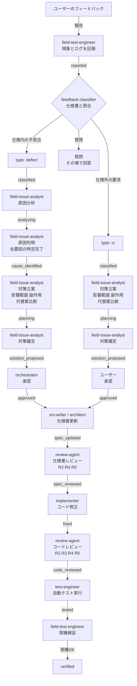

``````markdown
# 実機テスト フィードバック管理規則 v1.0.0

## 1. 目的とスコープ

本規則は、実機テストフェーズにおけるユーザーフィードバックの管理プロセスを定義する。

**目的:**

- ユーザーフィードバックを仕様書と照合し、defect（不具合）か CR（仕様変更）かを正確に分類する
- コード変更前に必須ゲートを設け、Regression と技術的負債の蓄積を防止する
- 仕様書とコードの乖離を防止する

**スコープ:**

- 実機テストフェーズ（ユーザーと一緒にテストする作業）で発生するフィードバックに適用する
- 自動テスト（自動テスト）で検出される不具合は対象外（従来の defect プロセスを使用する）

**制定背景:**

car-diag プロジェクトの実機テストにおいて、以下のプロセス違反が発生した:

- defect 票の事前作成率 0%（全 8 件がユーザー指摘後に作成）
- CR 票の事前作成率 0%（全 2 件がユーザー指摘後に作成）
- Regression 率 25%（修正後のテスト未実行が原因）
- 仕様書とコードの乖離 3 件（ゲートなしでコード変更を実施）

---

## 2. エージェントロール

本規則で使用するエージェントとその責務。エージェントの正式定義は `process-rules/agent-list.md` を参照。

| エージェント | 責務 | 既存/新規 |
|------------|------|----------|
| field-test-engineer | 最新 SW でユーザーとテストし、フィードバックを記録する。修正後の実機検証を行う | 新規 |
| feedback-classifier | フィードバックを仕様書と照合し、defect / CR / 質問に分類する | 新規 |
| field-issue-analyst | 原因分析（defect）および対策立案（defect / CR）を行う。影響範囲・副作用・代替案比較を実施する | 新規 |
| orchestrator | defect の対策を承認する | 既存 |
| srs-writer | 仕様書 Ch1-2 を更新する（CR は必須、defect は必要時のみ） | 既存 |
| architect | 仕様書 Ch3-6 を更新する（CR は必須、defect は必要時のみ） | 既存 |
| implementer | 更新された仕様書に基づきコードを修正する | 既存 |
| review-agent | 修正コードの品質レビュー（R2/R4/R5）を行う | 既存 |
| test-engineer | 自動テスト を実行し全テスト PASS を確認する | 既存 |

---

## 3. ステータス遷移フロー

**フロー図:**



---

## 4. ステータス定義

| ステータス | defect での意味 | CR での意味 |
|-----------|---------------|------------|
| `reported` | フィードバック記録済み | 同左 |
| `classified` | 仕様照合完了・defect 確定 | 仕様照合完了・CR 確定 |
| `analyzing` | 原因分析中 | ー（スキップ） |
| `cause_identified` | 原因判明・全要因の特定完了 | ー（スキップ） |
| `planning` | 対策立案中 | 対策立案中 |
| `solution_proposed` | 対策確定・承認待ち | 対策確定・承認待ち |
| `approved` | 修正着手 OK | 実装着手 OK |
| `spec_updated` | 仕様書更新済み（必要時のみ） | 仕様書更新済み（必須） |
| `spec_reviewed` | 仕様書レビュー PASS（R2/R4/R5） | 同左 |
| `fixed` | コード修正完了 | コード修正完了 |
| `code_reviewed` | コードレビュー PASS（R2/R3/R4/R5） | 同左 |
| `tested` | 自動テスト 全テスト PASS | 同左 |
| `verified` | 実機検証 PASS | 同左 |

---

## 5. ゲート条件

各ステータス遷移には以下のゲート条件を満たす必要がある（MUST）。

### 5.1 reported → classified

| 項目 | 内容 |
|------|------|
| 担当 | feedback-classifier |
| 入力 | フィードバック記録（現象・ログ・再現手順） |
| 実施内容 | 仕様書（`docs/spec/`）と照合し、type を判定する |
| 判定基準 | 仕様書に記載された動作と異なる → `defect`、仕様書に記載がない要求 → `cr`、情報提供の依頼 → `質問`（チケット不要） |
| 出力 | チケットに `type` フィールドを設定 |

### 5.2 classified → analyzing（defect のみ）

| 項目 | 内容 |
|------|------|
| 担当 | field-issue-analyst |
| 入力 | classified チケット + 関連するソースコード |
| 実施内容 | 根本原因の調査を開始する |
| ゲート条件 | なし（classified 完了後に自動遷移） |

### 5.3 analyzing → cause_identified（defect のみ）

| 項目 | 内容 |
|------|------|
| 担当 | field-issue-analyst |
| 実施内容 | 全要因を特定し、根本原因分析（Why-Why）を完了する |
| ゲート条件 | 以下を全て満たすこと: |
| | - 根本原因が特定されている |
| | - 複合要因の場合、全ての要因が列挙されている |
| | - 各要因の因果関係が明確である |
| 出力 | チケットに根本原因分析の結果を記載 |

### 5.4 cause_identified → planning（defect）/ classified → planning（CR）

| 項目 | 内容 |
|------|------|
| 担当 | field-issue-analyst |
| 実施内容 | 対策案を立案し、以下の 3 点を分析する |
| | 1. **影響範囲**: 変更が及ぶファイル・モジュール・機能の一覧 |
| | 2. **副作用**: 変更によって壊れる可能性のある既存機能 |
| | 3. **代替案比較**: 複数の対策案を比較し、推奨案を提示 |
| ゲート条件 | 上記 3 点の分析が完了していること |
| 出力 | チケットに対策案・影響分析・副作用分析・代替案比較を記載 |

### 5.5 planning → solution_proposed

| 項目 | 内容 |
|------|------|
| 担当 | field-issue-analyst |
| 実施内容 | 対策案を確定する |
| ゲート条件 | 以下を全て満たすこと: |
| | - 推奨対策案が 1 つに絞られている |
| | - 影響範囲が全て列挙されている |
| | - 仕様書の更新要否が判定されている |
| | - 必要なテストケースの追加要否が判定されている |
| 出力 | 確定した対策案の記載 |

### 5.6 solution_proposed → approved

| 項目 | 内容 |
|------|------|
| 担当（defect） | orchestrator |
| 担当（CR） | ユーザー |
| 実施内容 | 対策案を承認する |
| ゲート条件 | 承認者が対策案の内容を確認し、明示的に承認すること |
| 出力 | チケットのステータスを `approved` に変更 |

**重要: `approved` になるまで implementer はコードに触れてはならない（MUST NOT）。**

### 5.7 approved → spec_updated

| 項目 | 内容 |
|------|------|
| 担当 | srs-writer（Ch1-2）/ architect（Ch3-6） |
| 実施内容 | 承認された対策案に基づき仕様書を更新する |
| ゲート条件（CR） | 仕様書の更新が完了していること（必須） |
| ゲート条件（defect） | 仕様の曖昧さが原因の場合、仕様書の更新が完了していること。更新不要の場合はスキップ可 |
| 出力 | 更新済みの仕様書 |

**重要: implementer は更新された仕様書に基づいてコードを修正する。仕様書が更新される前にコードを修正してはならない（MUST NOT）。**

### 5.8 spec_updated → spec_reviewed

| 項目 | 内容 |
|------|------|
| 担当 | review-agent |
| 実施内容 | 更新された仕様書の品質レビュー（R2/R4/R5 観点）を行う |
| ゲート条件 | Critical / High 指摘が 0 件であること |
| 出力 | レビュー報告（`project-records/reviews/`） |

**重要: 仕様書レビューが PASS する前に implementer がコードを修正してはならない（MUST NOT）。**

### 5.9 spec_reviewed → fixed

| 項目 | 内容 |
|------|------|
| 担当 | implementer |
| 実施内容 | レビュー済みの仕様書に基づきコードを修正する |
| ゲート条件 | 以下を全て満たすこと: |
| | - 対策案の範囲のみを修正している（スコープ外の変更を含まない） |
| | - 仕様書の内容とコードが整合している |
| 出力 | 修正済みコード |

### 5.10 fixed → code_reviewed

| 項目 | 内容 |
|------|------|
| 担当 | review-agent |
| 実施内容 | 修正コードの品質レビュー（R2/R3/R4/R5 観点）を行う |
| ゲート条件 | Critical / High 指摘が 0 件であること |
| 出力 | レビュー報告（`project-records/reviews/`） |

### 5.11 code_reviewed → tested

| 項目 | 内容 |
|------|------|
| 担当 | test-engineer |
| 実施内容 | `自動テスト` を実行し全テスト PASS を確認する |
| ゲート条件 | 全テスト PASS |
| 出力 | テスト実行結果 |

### 5.12 tested → verified

| 項目 | 内容 |
|------|------|
| 担当 | field-test-engineer |
| 実施内容 | 実機でユーザーと動作を確認する |
| ゲート条件 | 以下を全て満たすこと: |
| | - 影響分析で列挙された機能が正常に動作する |
| | - ユーザーが実機での動作を確認し OK とする |
| 出力 | チケットのステータスを `verified` に変更 |

---

## 6. defect と CR の差分ルール

| 観点 | defect | CR |
|------|--------|-----|
| 定義 | 仕様書に記載された動作と実装が異なる | 仕様書に記載されていない新たな要求 |
| 原因分析 | 必須（analyzing → cause_identified） | 不要（スキップ） |
| 対策立案 | 必須 | 必須 |
| 承認者 | orchestrator | ユーザー |
| 仕様書更新 | 仕様の曖昧さが原因の場合のみ（スキップ可） | 必須 |

---

## 7. 禁止事項

1. **`approved` 前のコード変更禁止**: ステータスが `approved` になる前に implementer がコードを変更してはならない（MUST NOT）
2. **hotfix によるプロセス省略禁止**: 緊急性が高い場合でも本規則のステータス遷移を省略してはならない（MUST NOT）。ただし各ステップの記載量は簡潔でよい
3. **仕様書更新前のコード変更禁止**: `spec_updated` になる前に implementer がコードを変更してはならない（MUST NOT）
4. **テスト未実行の報告禁止**: `自動テスト` 全テスト PASS を確認せずにユーザーに修正完了を報告してはならない（MUST NOT）
5. **レビュー省略禁止**: review-agent による品質レビューを省略してはならない（MUST NOT）

---

## 8. チケット管理

### 8.1 管理ディレクトリ

`project-records/field-issues/`

defect と CR を同一ディレクトリで管理し、チケット内の `type` フィールドで区別する。

### 8.2 ステータスの記録場所

チケットの Form Block 内 `field-issue:status` フィールドに現在のステータスを記録する。ステータス変更時はチケットを更新する。

### 8.3 チケットのフォーマット

チケットのフォーマット（Common Block / Form Block の構造）は `process-rules/full-auto-dev-document-rules.md` に従う。`field-issue` file_type として定義する。

### 8.4 チケットの owner

チケットの owner は **field-test-engineer** とする。他のエージェントはチケットに追記する形で情報を蓄積する。

``````
