# full-auto-dev Process Rules

> **Scope:** These process rules are designed as a comprehensive process applicable to all software development, from small-scale projects like a dice app to mission-critical systems like OS or rocket control systems. For small-scale projects, unnecessary processes can be omitted during the setup phase. Since adding processes retroactively is difficult, the policy is to define them comprehensively from the start and scale down per project.

> **Target Version:** Claude Code (latest as of February 2026 — Opus 4.6 / Sonnet 4.6 compatible)
> **Prerequisites:** Claude Pro/Team/Enterprise subscription, or Anthropic API account
> **Document Status:** Process rules for the full-auto-dev framework. Structured based on official Claude Code features, but includes experimental features such as Agent Teams. Always refer to the official documentation (https://code.claude.com/docs/en/overview) for the latest specifications.
> **Related Documents:** [Document Management Rules](full-auto-dev-document-rules.md) v0.0.0 — Document management rules for file naming, block structure, versioning, etc. Scheduled for promotion to v1.0.0 after PoC completion.

---

## Table of Contents

**Part 1: Overview**

- [Chapter 1: Overview and Fundamental Philosophy](#chapter-1-overview-and-fundamental-philosophy)
  - 1.1 Purpose of This Manual
  - 1.2 Overall Architecture
  - 1.3 Key Claude Code Features Used
- [Chapter 2: Overview of Development Phases](#chapter-2-overview-of-development-phases)
  - 2.1 Phase Name Definitions
  - 2.2 Development Phase Flow
- [Chapter 3: Process Management Framework](#chapter-3-process-management-framework)
  - 3.1 Process Category Overview
  - 3.2 Mandatory Processes (Common to All Projects)
  - 3.3 Recommended Processes (Medium-Scale and Above)
  - 3.4 Criteria and Timing for Conditional Processes

**Part 2: Phase Details**

- [Chapter 4: Development Workflow](#chapter-4-development-workflow)
  - 4.1 setup Phase: Conditional Process Evaluation (Mandatory)
  - 4.2 planning Phase: Planning — From Interview to Specification Ch1-2 Creation
  - 4.3 dependency-selection Phase: External Dependency Selection — Evaluation, Selection, and Procurement (Conditional)
  - 4.4 design Phase: Design — Specification Ch3-6 Elaboration, Security, and WBS
  - 4.5 implementation Phase: Implementation — Parallel Development and Testing
  - 4.6 testing Phase: Testing — Integration Testing, Performance Testing, and Quality Monitoring
  - 4.7 delivery Phase: Delivery — Deployment, Final Report, and Acceptance Testing
  - 4.8 operation Phase: Operations and Maintenance — Incident Management, Patch Management, and Monitoring Operations (Conditional)

**Part 3: Setup and Preparation**

- [Chapter 5: Environment Setup](#chapter-5-environment-setup)
  - 5.1 Installing Claude Code
  - 5.2 VS Code Extension
  - 5.3 Enabling Agent Teams
  - 5.4 MCP Server Configuration
  - 5.5 Recommended Project Structure (Complete Version)
- [Chapter 6: CLAUDE.md Design](#chapter-6-claudemd-design-the-brain-of-the-project)
  - 6.1 CLAUDE.md Template
  - 6.2 Key Points for CLAUDE.md Design
- [Chapter 7: Agent Definitions](#chapter-7-agent-definitions) (-> [Agent List](agent-list.md), [Prompt Structure Specification](prompt-structure.md), [Glossary](glossary.md))
- [Chapter 8: Custom Command Definitions](#chapter-8-custom-command-definitions)
  - 8.1 Full Auto Development Start Command (full-auto-dev)
  - 8.2 Progress Check Command (check-progress)
  - 8.3 Retrospective Command (retrospective)

**Part 4: Quality and Operations**

- [Chapter 9: Quality Management Framework](#chapter-9-quality-management-framework)
  - 9.1 Staged Review Gates
  - 9.2 Review Perspectives (R1-R6)
  - 9.3 Quality Criteria Table
- [Chapter 10: Headless Mode and CI/CD Integration](#chapter-10-headless-mode-and-cicd-integration)
  - 10.1 Headless Mode Basics
  - 10.2 Integration with GitHub Actions
- [Chapter 11: Deployment and Observability](#chapter-11-deployment-and-observability)
  - 11.1 Deployment Process
  - 11.2 Observability Design
  - 11.3 Production Release Checklist
  - 11.4 Monitoring and Incident Response in the operation Phase

**Part 5: Reference Materials**

- [Chapter 12: Troubleshooting](#chapter-12-troubleshooting)
  - 12.1 Common Problems and Solutions
  - 12.2 Cost Management Guidelines
- [Chapter 13: Best Practices and Considerations](#chapter-13-best-practices-and-considerations)
  - 13.1 Best Practices
  - 13.2 Considerations and Constraints
- [Chapter 14: Hands-On Tutorial](#chapter-14-hands-on-tutorial-developing-a-web-app-almost-fully-automatically)
  - 14.1-14.6 Development Procedure for a Task Management Web App

**Appendices**

- [Appendix A: Inter-Agent Communication Diagram](#appendix-a-inter-agent-communication-diagram)
- [Appendix B: Progress Management Data Schema](#appendix-b-progress-management-data-schema)
- [Appendix C: Quick Reference](#appendix-c-quick-reference)

---

# Part 1: Overview

## Chapter 1: Overview and Fundamental Philosophy

### 1.1 Purpose of This Manual

This manual is a practical guide for nearly fully automating the software development process using Claude Code. "Nearly fully automated" refers to an approach where human (user) involvement is limited to the following three critical tasks, delegating all other processes to Claude Code and its sub-agent fleet.

**Tasks Handled by the User (Only 3):**

1. Presenting the SW need or concept (what to build)
2. Making critical decisions required for SW development (decision-making at branching points)
3. Final SW acceptance testing (confirming and approving the finished product)

**Tasks Handled by Claude Code (Everything Else):**

- Development planning (WBS/Gantt charts), personnel (AI) management, resource management, progress management
- Specification creation (Ch1-2: Foundation & Requirements, format selected from ANMS/ANPS/ANGS), security design, specification elaboration (Ch3-6: Architecture, Specification, Test Strategy, Design Principles)
- SW implementation, module unit testing, integration testing, system testing, performance testing
- Test progress curve monitoring, defect curve monitoring
- Resource/personnel (AI) allocation to bottlenecks/weak areas
- Staged review of all deliverables (including SW engineering principles, concurrency, and performance perspectives)
- Change management, risk management, license verification, audit record management
- API document generation, SAST/SCA security scanning
- Container build, IaC configuration, deployment, smoke testing
- Observability (logs, metrics, alerts) configuration verification
- All other tasks achievable by AI

### 1.2 Overall Architecture

**Overview of Fully Automated Development:**

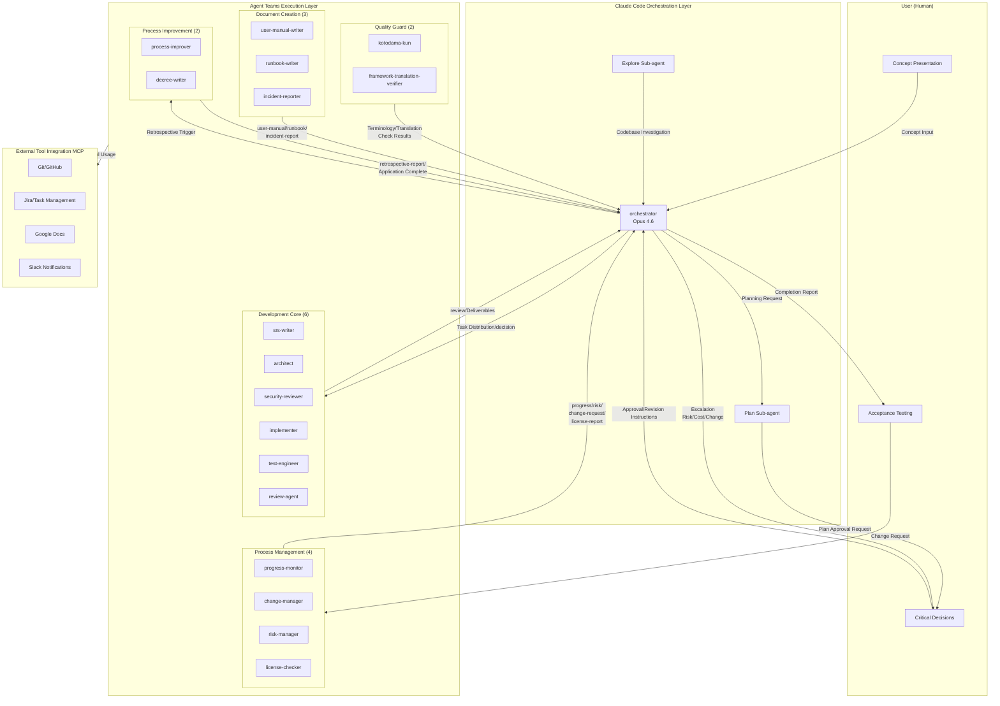

This diagram shows the overall structure and information flow of fully automated development at the group level. The user participates in the project at three points: concept presentation, critical decisions, and acceptance testing. The orchestrator controls all phases and distributes tasks to five agent groups (Development Core, Process Management, Quality Guard, Document Creation, and Process Improvement — 17 agents in groups, 18 including orchestrator). On escalation paths (risk score >= 6, cost budget 80% reached, change requests with impact_level=high), the orchestrator asks the user for decisions. For detailed file_type data flows between individual agents, refer to agent-list Section 3.

### 1.3 Key Claude Code Features Used

| Feature | Description | Use Case |
| --- | --- | --- |
| Sub-agents | Child agents that execute specialized tasks in independent contexts | Individual development task execution |
| Agent Teams (Experimental) | Multiple agents work in parallel with inter-communication | Large-scale parallel development |
| Plan Sub-agent | Built-in agent specialized for planning | WBS creation, development planning |
| Explore Sub-agent | Built-in agent specialized for codebase investigation | Understanding existing code |
| Headless Mode (`-p`) | Batch execution without interaction | CI/CD integration, automation pipelines |
| CLAUDE.md | Configuration file at the project root | Project-specific rule definitions |
| MCP (Model Context Protocol) | External tool/service integration | Integration with Git, Jira, Slack, etc. |
| Checkpoints | Automatic saving and rollback of code state | Safe experimentation |
| Git Worktree (`--worktree`) | Parallel work on independent branches | Feature-based parallel development |
| Skills (`.claude/skills/`) | Reusable domain knowledge packages | Cross-team knowledge sharing |

> **Note:** Agent Teams is an experimental feature that requires setting the environment variable `CLAUDE_CODE_EXPERIMENTAL_AGENT_TEAMS=1`. Stability and specifications may change in the future.

---

## Chapter 2: Overview of Development Phases

### 2.1 Phase Name Definitions

**Phase Name Definitions:**

| Phase Name | Number | Meaning | Reference Name in Document Management Rules |
|-----------|:---:|------|----------------------|
| setup | 0 | Setup and process evaluation | `phase-setup` |
| planning | 1 | Planning (Interview & Specification) | `phase-planning` |
| dependency-selection | 2 | External dependency selection (Conditional) | `phase-dependency-selection` |
| design | 3 | Design | `phase-design` |
| implementation | 4 | Implementation | `phase-implementation` |
| testing | 5 | Testing | `phase-testing` |
| delivery | 6 | Delivery | `phase-delivery` |
| operation | 7 | Operations and maintenance (Conditional) | `phase-operation` |

Numbers are for convenience of ordering; the document management rules' `commissioned_by` field references phases by name (`phase-{name}`).

**Activation Conditions for Conditional Phases:**

| Phase | Activation Condition | Skip Condition | Details |
|---------|-----------|-------------|------|
| dependency-selection | Any of HW integration, AI/LLM integration, or framework requirement definition is enabled | No external dependencies apply to conditional processes | See Section 3.4 |
| operation | Operating a service in production, or post-release maintenance is required | Delivery-complete projects (deliverables are handed over and the project ends) | See Section 3.4 |

Selection of the specification format (ANMS/ANPS/ANGS) is also performed during the setup phase (see Section 4.1).

### 2.2 Development Phase Flow

**Development Phase Flow:**

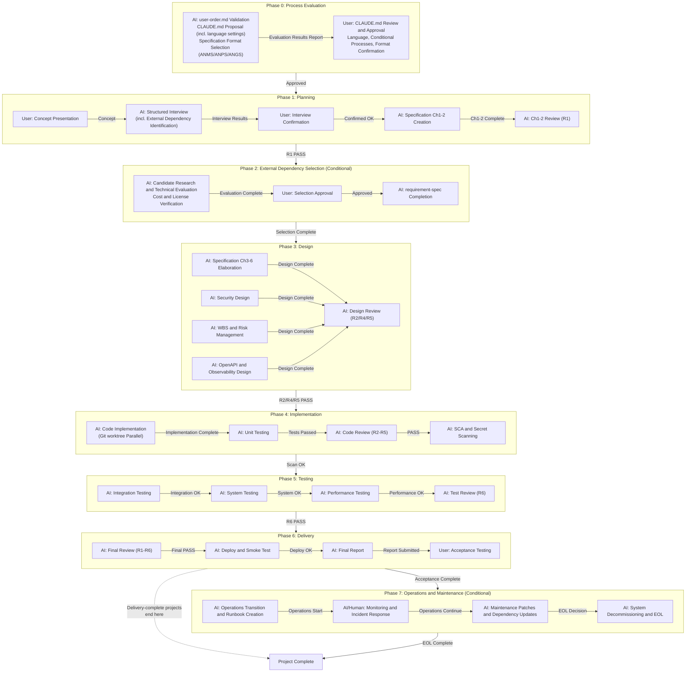

---

## Chapter 3: Process Management Framework

This chapter references ISO/IEC 12207, CMMI, and PMBOK to organize the processes that should be applied based on the nature of the project. **Refer to this chapter before project start (setup phase) to determine which processes to apply.**

### 3.1 Process Category Overview

| Category | Description |
| --- | --- |
| **Mandatory** | Applied to all projects regardless of scale or type |
| **Recommended** | Applied to medium-scale and above (guideline: development period exceeding 1 month, or 3 or more independent modules) |
| **Conditional** | Applied only when meeting the criteria defined in Section 3.4 |

---

### 3.2 Mandatory Processes (Common to All Projects)

#### 3.2.1 Change Management

**Reference Standards:** CMMI-CM, PMBOK Integrated Management, ISO/IEC 12207

A process to control all requirement and design changes that occur after specification approval.

**Change Management Flow:**

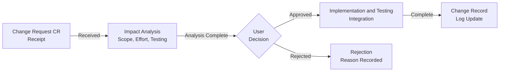

**Responsible Agent:** change-manager (see Chapter 7, Section 7.3.1)

**Output:** `project-records/change-requests/change-request-{NNN}-{YYYYMMDD}-{HHMMSS}.md` (change request ticket)

**Note:** change-request handles only user-initiated changes. AI-side technical changes (defect fixes, design improvements, dependency changes) are managed through defect or decision records.

#### 3.2.2 Risk Management

**Reference Standards:** CMMI-RSKM, PMBOK Risk Management

**Risk Assessment Matrix:**

| Probability / Impact | Low (1) | Medium (2) | High (3) |
| --- | --- | --- | --- |
| **High (3)** | 3 Monitor | 6 Action Required | 9 Immediate Action |
| **Medium (2)** | 2 Acceptable | 4 Monitor | 6 Action Required |
| **Low (1)** | 1 Acceptable | 2 Acceptable | 3 Monitor |

For scores of 6 or higher, the lead agent reports to the user and requests approval of mitigation measures.

**Risk Register:** `project-records/risks/risk-register.md` (Markdown singleton with Common Block + risk: Form Block)

The risk register is managed in Common Block-managed Markdown format. Aggregated information from individual risk entries (risk-{NNN}-*.md) is described as a table in the Detail Block. For details, see document-rules Sections 7 and 9.5.

**Responsible Agent:** risk-manager (see Chapter 7, Section 7.3.2)

#### 3.2.3 Traceability Management

**Reference Standards:** CMMI-RD/TS, ISO/IEC 12207, AUTOSAR

Maintain bidirectional traceability from requirement IDs to test case IDs. srs-writer assigns requirement IDs, architect annotates `(traces: FR-xxx)` on Gherkin scenarios in specification Ch4, and test-engineer updates during test implementation.

**Traceability Matrix:** `project-records/traceability/traceability-matrix.md` (Markdown singleton with Common Block + traceability: Form Block)

The matrix is managed in Common Block-managed Markdown format. The Detail Block contains the traceability table (Requirement ID / Requirement / Design Reference / Implementation / Test ID / Status). For details, see document-rules Sections 7 and 9.9.

#### 3.2.4 Issue/Defect Management

**Reference Standards:** ISO/IEC 12207 Problem Resolution Process

**Defect Ticket State Transitions:**

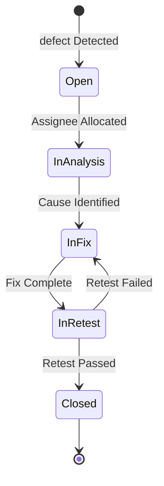

**Output:** `project-records/defects/defect-{NNN}-{YYYYMMDD}-{HHMMSS}.md` (defect ticket with Common Block + defect: Form Block): Includes reproduction steps, severity, root cause, and recurrence prevention measures. The defect:id field records DEF-NNN.

#### 3.2.5 License Management

Track the licenses of OSS libraries used and verify compatibility.

| License Type | Commercial Use | Attribution | Source Disclosure Obligation |
| --- | --- | --- | --- |
| MIT / BSD / Apache 2.0 | Permitted | Required | None |
| LGPL | Permitted (dynamic linking only) | Required | Partial |
| GPL v2/v3 | Check required | Required | Yes |
| AGPL | Check required | Required | Yes (including via network) |

**Responsible Agent:** license-checker (see Chapter 7, Section 7.3.3), **Output:** `project-records/licenses/license-report.md`

#### 3.2.6 Audit Log Management

**Reference Standards:** ISO 27001, ISO/IEC 12207 Audit Process

**Items Recorded:** Git commit history (file operation records), user approval records for critical decisions (`project-records/decisions/`), execution records of security scans and license checks

**Decision Record Format (project-records/decisions/DEC-{number}.md):**

- Decision number, date, decision content, and background
- Alternatives considered and reasons for selection
- User approval record

#### 3.2.7 Token Cost Management

The progress-monitor agent tracks API token consumption and notifies the user when 80% of the budget is reached.

**Cost Tracking Format (project-management/progress/cost-log.json):**

```json
{
  "cost_log": [
    {
      "date": "2026-03-01",
      "phase": "design",
      "model": "claude-opus-4-6",
      "input_tokens": 125000,
      "output_tokens": 8500,
      "estimated_cost_usd": 2.34
    }
  ],
  "budget_usd": 100.0,
  "spent_usd": 2.34
}
```

#### 3.2.8 SAST/SCA Security Scanning

**Reference Standards:** OWASP SAMM, NIST SP 800-218 (SSDF)

Incorporate static analysis tools (SAST) and dependency vulnerability scanning (SCA) into the CI/CD pipeline to complement manual security reviews.

**Tool Selection Guide:**

| Category | Tool Examples | Execution Timing |
| --- | --- | --- |
| SAST | CodeQL (built into GitHub Actions), SonarQube | On PR merge, at implementation phase completion |
| SCA | npm audit, pip-audit, OWASP Dependency-Check | On dependency addition, at implementation phase completion |
| Secret Scanning | truffleHog, git-secrets | Pre-commit hook, at implementation phase completion |
| Container Scanning | Trivy, Grype | On container build, during delivery phase |

**CodeQL Integration Example for GitHub Actions:**

```yaml
- name: Initialize CodeQL
  uses: github/codeql-action/init@v3
  with:
    languages: javascript, typescript

- name: Run CodeQL Analysis
  uses: github/codeql-action/analyze@v3
```

**Responsible:** The security-reviewer agent integrates results with manual reviews and records them in `project-records/security/security-scan-report-{NNN}-{YYYYMMDD}-{HHMMSS}.md` (with Common Block + security-scan-report: Form Block, distinguishing sast/sca/dast/manual via scan_type).

---

### 3.3 Recommended Processes (Medium-Scale and Above Projects)

Guideline for medium-scale and above: Development period exceeding 1 month, or 3 or more independent modules.

#### 3.3.1 Release Management

**Reference Standards:** ITIL, PMBOK

**Release Judgment Checklist (project-management/release-checklist.md):**

```markdown
- [ ] All functional requirements implemented (comparison with specification Ch2 complete)
- [ ] Unit test pass rate 95% or higher
- [ ] Integration test pass rate 100%
- [ ] Code coverage 80% or higher
- [ ] Performance testing: All NFR numerical targets achieved
- [ ] Security scan Critical/High zero findings (including SAST/SCA)
- [ ] Review report Critical/High zero findings
- [ ] License report confirmed
- [ ] API documentation (openapi.yaml) up to date
- [ ] Container image build and smoke test complete
- [ ] Observability (logs, metrics, alerts) configuration confirmed
- [ ] Rollback procedure confirmed
- [ ] Release notes created
```

#### 3.3.2 Communication Management

**Reference Standards:** PMBOK Communication Management

**Template for CLAUDE.md Addition:**

```markdown
## Communication Plan

- Daily: progress-monitor updates project-management/progress/daily-report.md
- At phase completion: Lead agent provides summary report to user
- On anomaly (risk score 6 or higher, cost 80% reached): Immediately notify user
```

#### 3.3.3 Process Improvement and Recurrence Prevention (CAR / OPF)

**Reference Standards:** CMMI-CAR, CMMI-OPF

The process-improver agent handles retrospectives and root cause analysis, while the decree-writer agent safely applies approved improvements.

**Trigger Conditions:**

| Trigger | Condition | Initiated By |
|---------|------|--------|
| Phase completion | After each phase's quality gate PASS | orchestrator |
| defect surge | defect discovery rate exceeds 200% compared to previous day | progress-monitor -> orchestrator |
| Review rejection | Same perspective flagged 3 or more times consecutively | review-agent -> orchestrator |
| User request | User explicitly requests a retrospective | orchestrator |

**Improvement Cycle:**

1. process-improver analyzes defect tickets, review findings, and progress data
2. Conducts root cause analysis (CMMI CAR: Why-Why analysis)
3. Submits improvement measures as a retrospective-report to orchestrator
4. orchestrator routes improvement approval (CLAUDE.md / process-rules require user approval; agent definitions require orchestrator approval)
5. decree-writer applies approved improvements to governance files after safety checks (SR1-SR6)
6. decree-writer records before/after diff in project-records/improvement/

Also see the retrospective command in Chapter 8, Section 8.3 for execution methods.

#### 3.3.4 Document Version Management

**Reference Standards:** ISO/IEC 12207 Documentation Process

- Naming convention: `{document-name}-v{major}.{minor}.md` (e.g., `taskapp-spec-v1.2.md`)
- At specification approval or major specification changes: Increment major version
- For minor description corrections or additions: Increment minor version
- Deprecated documents are moved to `old/` in the same directory, recording the deprecation date and successor document (see document-rules Section 3.10 old/ directory rules)

#### 3.3.5 User Documentation and Manual Creation

**Reference Standards:** ISO/IEC 26514 User Documentation

For systems with end users, create the following documents during the delivery phase:

- User manual (`docs/user-manual.md`): Operating procedures, FAQ, troubleshooting
- API reference (leveraging existing `docs/api/openapi.yaml`)
- Administrator guide (administrator-oriented configuration and operations procedures)

#### 3.3.6 Training and Knowledge Transfer

If training for end users or operations teams is required, develop a training plan and create educational materials during the delivery phase.

#### 3.3.7 Stakeholder Management

**Reference Standards:** PMBOK Stakeholder Management

For large-scale projects (where multiple human stakeholders are involved), create a stakeholder register during the setup phase and define each stakeholder's influence level, interest level, and communication approach.

#### 3.3.8 API Versioning and Backward Compatibility

For systems that expose APIs externally, define the following during the design phase:
- Versioning strategy (URL path vs. header)
- Deprecation notification policy and migration period for breaking changes
- Scope of backward compatibility guarantees

---

### 3.4 Criteria and Timing for Conditional Processes

**Decision Timing:** Evaluated by the lead agent during the setup phase (immediately after reading user-order.md), and applicable processes are added to CLAUDE.md for activation.

#### 3.4.1 Criteria List

| Process | Conditions Requiring Addition (add if any one applies) | Decision Timing |
| --- | --- | --- |
| **Legal Research** | - Handles personal information/personal data<br>- Healthcare/medical field<br>- Handles financial/payment processing<br>- Provides communication services<br>- Offered to the EU market<br>- Public/government system | setup phase, **before** specification creation<br>(highest priority decision) |
| **Patent Research** | - Independently implements novel algorithms/methods<br>- Incorporates AI models<br>- Implements new business logic for finance/EC<br>- Sold/provided as a commercial product to third parties | design phase, **before** design starts<br>(at algorithm selection) |
| **Technology Trend Research** | - Development period exceeds 6 months<br>- Last release of planned libraries is over 1 year old<br>- Rapidly changing domains like AI/ML, cloud-native<br>- Major dependency EOL arrives within the development period | setup phase, at technology stack selection<br>(re-evaluate at each phase start for long-term projects) |
| **Functional Safety (HARA/FMEA/FTA)** | - Direct impact on human life/body (medical devices, automotive, industrial equipment)<br>- Compliance with IEC 61508 / ISO 26262 / IEC 62304 etc. is required<br>- Major impact on social infrastructure<br>- Significant asset damage risk in core financial systems | setup phase, at concept presentation<br>(**highest priority decision**, safety requirements must be finalized before specification creation) |
| **Accessibility (WCAG 2.1)** | - Provides web applications<br>- EU market (EAA Directive fully enforced June 2025)<br>- Public/government system<br>- Targets diverse user base | setup phase, **before** specification creation<br>(include as NFR in specification Ch2) |
| **HW Integration** | - Embedded/IoT system<br>- Physical device control involved<br>- Runs on dedicated hardware<br>- Uses HW prototypes/development boards<br>- Communication with sensors/actuators | setup phase, **before** specification creation<br>(include HW requirements in NFR; HW availability affects schedule) |
| **AI/LLM Integration** | - Incorporates AI/LLM as application functionality<br>- Requires prompt engineering<br>- Uses model inference results in business logic<br>- Needs to compare/select multiple AI providers | setup phase, **before** specification creation<br>(cost structure and model capabilities influence architecture) |
| **Framework Requirement Definition** | - Uses a framework with non-standard interfaces<br>- Framework-specific constraints significantly impact architecture<br>- Framework replacement is anticipated in the future<br>- Framework EOL/license change risk exists | setup phase, at technology stack selection<br>(standard-interface frameworks only need a decision record) |
| **HW Production Process Management** | - HW integration AND mass production<br>- Supply chain management required<br>- Incoming inspection and lot management required | setup phase<br>(additional decision when HW integration is enabled) |
| **Product i18n/l10n** | - Multi-language support is a product requirement<br>- RTL (right-to-left) language support<br>- Date/currency/number format localization required | setup phase<br>(include as NFR in specification Ch2) |
| **Certification Acquisition** | - Public certifications such as CE/FCC/medical device certification required<br>- Submission documents to certification bodies required<br>- Post-certification change management (re-certification triggers) required | setup phase<br>(decide alongside legal research) |
| **Operations and Maintenance** | - Operating a service in production<br>- Post-release defect fixes and patch application required<br>- SLA (uptime, response time) guarantees required | setup phase<br>(decision to activate the operation phase) |

#### 3.4.2 setup Phase Evaluation Process

During the setup phase of the full-auto-dev command, the lead agent automatically evaluates the following (see Chapter 8, Section 8.1).

1. Functional Safety -> If applicable, **immediately request user confirmation** and finalize safety requirements before specification creation. Create `project-records/safety/` and add HARA (mandatory), FMEA (after Ch3 finalization), and FTA (if high-risk hazards exist) to the design phase. For detailed methods and adoption criteria, refer to [defect-taxonomy.md Section 7](defect-taxonomy.md)
2. Legal Research -> If applicable, add to CLAUDE.md and include regulatory requirements in the non-functional requirements section of specification Ch2. Create `project-records/legal/`
3. Patent Research -> If applicable, add a patent research task before the start of the design phase in the WBS. Record in `project-records/legal/patent-clearance.md`
4. Technology Trend Research -> If applicable, add a technology trend check step to the WBS at the start of each phase. Create `docs/tech-watch.md`
5. Accessibility -> If applicable, add WCAG 2.1 AA compliance requirements to the NFR in specification Ch2 and include in review-agent's R1 check items
6. HW Integration -> If applicable, add to CLAUDE.md and include HW requirements in the planning phase interview. Conduct external dependency evaluation and selection in the dependency-selection phase, complete `docs/hardware/hw-requirement-spec.md` Ch3-6 in the design phase, and add Adapter layer design to SW Spec Ch3. Add HW-SW integration testing to the testing phase
7. AI/LLM Integration -> If applicable, add to CLAUDE.md and include AI requirements (capabilities, cost, latency) in the planning phase interview. Conduct external dependency evaluation and selection in the dependency-selection phase, complete `docs/ai/ai-requirement-spec.md` Ch3-6 in the design phase, and add AI Adapter layer design to SW Spec Ch3
8. Framework Requirement Definition -> If applicable, add to CLAUDE.md, conduct external dependency evaluation and selection in the dependency-selection phase, and complete `docs/framework/framework-requirement-spec.md` Ch3-6 in the design phase. Standard-interface frameworks only need selection rationale recorded in `project-records/decisions/`
9. HW Production Process Management -> Added when HW integration is enabled AND mass production is planned. Include supply chain management and incoming inspection in the WBS
10. Product i18n/l10n -> If applicable, add i18n requirements to the NFR in specification Ch2 and include message catalog design in the design phase
11. Certification Acquisition -> In addition to legal research, add certification submission document creation and certification body interaction to the WBS. Create `project-records/legal/certification/`
12. Operations and Maintenance -> If operating in production, activate the operation phase. Include RPO/RTO, backup strategy, and monitoring infrastructure in the design phase

---

# Part 2: Phase Details

## Chapter 4: Development Workflow

### 4.1 setup Phase: Conditional Process Evaluation (Mandatory)

The setup phase is the **first step** of fully automated development and must be executed before specification creation.

As **user-order.md validation**, verify that the following required items are documented:

- What to build (What), and why (Why)

"Other preferences" is optional, but if documented, they are considered during validation. If required items are missing, supplement through dialogue with the user before proceeding.

After validation passes, **propose CLAUDE.md** based on the contents of user-order.md (technology stack, coding conventions, security policies, branch strategy, **language settings**, **specification format**, etc.).

**Specification Format Selection:**

Select the specification format based on project scale:

| Level | Abbreviation | Full Name | Criteria |
|:------:|------|----------|---------|
| 1 | ANMS | AI-Native Minimal Spec | Entire project fits within 1 context window |
| 2 | ANPS | AI-Native Plural Spec | Does not fit, but GraphDB not needed |
| 3 | ANGS | AI-Native Graph Spec | Large-scale (uses GraphDB) |

Record the selection result in the "Specification Format Selection" section of CLAUDE.md.

**Language Settings:**

- **Project primary language** (ISO 639-1): Default language for all documents and agent prompts
- **Translation languages** (optional): List of languages for translated versions (empty = single-language project)

After user approval, place CLAUDE.md and evaluate the need for conditional processes based on the criteria in Chapter 3, Section 3.4.

Report the evaluation results to the user and request confirmation regarding activation of additional processes. After confirmation, update the conditional processes section of CLAUDE.md before proceeding to the planning phase.

### 4.2 planning Phase: Planning — From Interview to Specification Ch1-2 Creation

#### 4.2.1 User Action: Concept Presentation

The user describes the concept in `user-order.md` by answering three questions.

**user-order.md Structure (3-Question Format):**

- **What do you want to build?** (Required) — Freely describe what you want to create or accomplish
- **Why?** (Required) — Background, challenges, motivation
- **Other preferences** (Optional) — Deployment method (Web/mobile, etc.), integration targets, scope of use, etc.

Details such as project name, technology stack, and quality requirements are proposed by the AI as CLAUDE.md during the setup phase. The user only needs to focus on "what to build."

#### 4.2.2 AI Action: Structured Interview

The three-question answers from user-order.md alone are insufficient to write specifications. The AI conducts a structured interview with the user to deepen the requirements.

**Interview Perspectives:**

| Perspective | What the AI Asks | Purpose |
|------|-------------|------|
| Domain Deep Dive | "What does the term XX mean?" "Who are the users?" | Establish glossary and personas |
| Scope Boundaries | "Does it include XX? Or not?" | Clarify Scope In/Out |
| Edge Cases | "What happens in the case of XX?" | Discover exception flows |
| Priority | "What's included in the MVP? What can wait?" | Prioritize requirements |
| Constraints | "Any budget/timeline/technology constraints?" | Uncover constraints |
| Known Compromises | "What parts don't need to be perfect?" | Make limitations explicit |
| Non-Functional | "What kind of load? What security level?" | Concretize NFR |
| External Dependency Identification | "Will you use HW/AI/special frameworks? How far does your own build scope extend?" | Clarify the boundary between domain (original) and framework layer (external dependencies). Input for determining the need for conditional processes (HW integration, AI/LLM integration, framework requirement definition) |
| **Domain Boundary Identification** | "What is the core logic unique to this project?" "Is this theory/algorithm part of your domain, or just used as an existing library?" "Where is the boundary between business rules and technical concerns?" | **Input for Clean Architecture layer classification.** The same concept (e.g., vector control theory) can be either the Domain layer or the Framework layer depending on the project. Getting this wrong inverts the dependency direction and collapses the architecture. Careful modeling and precise classification are required |

**Interview Rules:**

- The AI does not ask a large number of questions at once (limit to 3-5 questions per round)
- The AI summarizes the user's answers and confirms while progressing
- The interview ends when the user decides "that's enough"
- Interview results are structured and recorded in `project-management/interview-record.md`

#### 4.2.3 User Action: Confirm Interview Record

Present the interview record created by the AI to the user and confirm:

- Whether the intent has been correctly understood
- Whether there are any missing critical perspectives
- Whether the priorities are correct

After confirmation, proceed to mock/sample presentation if needed.

#### 4.2.4 AI Action: Mock/Sample/PoC Presentation (Recommended)

Words alone may not give the user a clear image. Especially for UI projects, it is essential to create mocks/samples based on the interview results and iterate on user feedback.

**Types of Presentation Materials (select based on the project):**

| Type | Use | Example |
|------|------|-----|
| UI Mock/Wireframe | Confirm screen layout and operation flow | Mermaid diagrams, HTML mocks, ASCII art |
| Data Model Sample | Confirm entity relationships | ER diagrams, sample JSON |
| API Sample | Confirm interfaces | OpenAPI snippets, cURL examples |
| PoC Code | Verify technical feasibility | Prototype implementation of core parts |
| User Story Map | Confirm overall feature picture and priorities | Mermaid diagrams |

**Iteration Rules:**

1. The AI creates mocks/samples based on the interview results
2. Present to the user and request feedback ("Is this what you imagined?" "What parts are different?")
3. Reflect feedback and revise
4. Once the user judges "It matches my image," proceed to specification creation
5. Record mocks/samples in interview-record.md as reference materials

**Skip Conditions:** UI mocks are unnecessary for projects without a UI, such as CLI tools, batch processing, or libraries. However, API samples and data model samples are still useful.

#### 4.2.5 AI Action: Automatic Specification Ch1-2 Generation

Create specification Ch1-2 using the interview record (interview-record.md) and user-order.md as input.

```bash
claude "Read user-order.md and start the nearly fully automated development.
First, conduct a structured interview.
After the interview is complete, refer to process-rules/spec-template.md and
create the specification (Ch1-2: Foundation & Requirements) in docs/spec/ (follow the ANMS/ANPS/ANGS format selected in the setup phase).
After creation, conduct an R1 perspective review with review-agent,
and once PASSED, report a summary of the specification and present any points requiring critical decisions."
```

#### 4.2.6 User Decision Point: Specification Approval

- Whether functional requirements are complete without excess or deficiency
- Whether non-functional requirements are appropriate (including performance, security, accessibility)
- Whether priorities are correct

### 4.3 dependency-selection Phase: External Dependency Selection — Evaluation, Selection, and Procurement (Conditional)

Executed when any of HW integration, AI/LLM integration, or framework requirement definition is enabled. If all are disabled, skip to the design phase.

For external dependencies identified during the planning phase interview, execute the following steps.

#### 4.3.1 Evaluation and Selection Process

```bash
claude "Based on the interview results, conduct external dependency evaluation and selection:
1. Extract requirements for external dependencies from the interview record and create a requirement-spec draft (Ch1 Purpose, Ch2 Requirements)
2. Research candidate products/services/libraries that meet the conditions and create a candidate list
3. Conduct technical evaluation of candidates (feature comparison matrix, PoC/benchmark results)
4. Perform cost analysis (initial costs, running costs, TCO)
5. Verify license compatibility (using the license-checker agent)
6. Present evaluation results to the user and request selection approval
7. After approval, complete the requirement-spec Ch3-6 (I/F definitions, constraints, replacement strategy, etc.)
8. If procurement is needed, confirm availability timelines and reflect in the WBS"
```

#### 4.3.2 Deliverables

| Deliverable | Description | Storage Location |
|--------|------|--------|
| requirement-spec (HW/AI/Framework) | Requirement specification based on the external-dependency-spec template | `docs/hardware/`, `docs/ai/`, `docs/framework/` |
| Selection decision record | Candidate comparison, evaluation matrix, selection rationale | `project-records/decisions/` |
| License review | License compatibility verification of dependent libraries | `project-records/licenses/` |
| Availability timeline | Procurement lead time, planned availability date | Reflected in WBS |

#### 4.3.3 User Decision Point: Selection Approval

Present the following information to the user and obtain selection approval:

- Candidate list and evaluation matrix
- Recommended candidate and rationale
- Cost comparison (TCO)
- Risks (vendor lock-in, EOL, license changes)
- Replaceability (degree of abstraction via DIP)

**External dependency selection must not be finalized without user approval.** Decisions involving cost and vendor lock-in fall under "Critical Decision Criteria" in CLAUDE.md.

#### 4.3.4 Re-selection via Change Request (CR)

If an external dependency change becomes necessary after specification approval (model discontinuation, HW manufacturing cessation, license changes, etc.), issue a CR through the change-manager agent and return to this phase for re-selection. Set impact_level=high, making user approval mandatory.

### 4.4 design Phase: Design — Specification Ch3-6 Elaboration, Security, and WBS

Once specification Ch1-2 is approved, automatically start the design phase.

**Key Sub-phase: Layer Classification (Prerequisite for Ch3 Creation)**

Before elaborating Ch3 Architecture, use the planning phase interview results (particularly "Domain Boundary Identification") as input to explicitly classify all project components into Clean Architecture's four layers (Entity / Use Case / Adapter / Framework). This classification result becomes the foundation for the component diagram and dependency diagram in Ch3.

Classification criteria:
- **Entity (Domain)**: Core logic and business rules unique to this project. Does not depend on externals
- **Use Case**: Coordination of business logic. Application-specific rules that operate on Entities
- **Adapter**: Interface with externals. Layer that translates between domain language and external language
- **Framework**: UI, DB, external APIs, libraries. Should be replaceable

Note: The same concept (e.g., vector control theory) can be either Entity or Framework depending on the project. The criterion is "For the purpose of this project, is this concept essential or instrumental?"

```bash
claude "Specification Ch1-2 has been approved. Execute the following in parallel:
1. Elaborate specification Ch3 (Architecture) in docs/spec/ (perform layer classification first, explicitly documenting the four-layer component classification at the beginning of Ch3)
2. Elaborate specification Ch4 (Specification) in Gherkin in docs/spec/
3. Define specification Ch5 (Test Strategy) in docs/spec/
4. Configure specification Ch6 (Design Principles Compliance) in docs/spec/
5. Generate OpenAPI 3.0 specification in docs/api/openapi.yaml
6. Create security design in docs/security/
7. Create observability design in docs/observability/observability-design.md
8. Create WBS and Gantt chart in project-management/progress/wbs.md
9. Create risk register with risk-manager
10. [If HW integration is enabled] Create docs/hardware/hw-requirement-spec.md and include HW Adapter layer design in SW Spec Ch3
11. [If AI/LLM integration is enabled] Create docs/ai/ai-requirement-spec.md and include AI Adapter layer design in SW Spec Ch3. Define prompt templates, input/output schemas, and cost constraints
12. [If framework requirement definition is enabled] Create docs/framework/framework-requirement-spec.md and include Adapter layer design in SW Spec Ch3
13. [If functional safety is enabled] Execute the following sequentially (see defect-taxonomy.md Section 7 for details):
    a. Conduct HARA and record hazard list, safety goals, ASIL/SIL allocation in project-records/safety/hara-*.md (**before** Ch3 elaboration)
    b. Add safety requirements to spec-foundation Ch2 NFR
    c. After Ch3 finalization, conduct FMEA and record in project-records/safety/fmea-*.md
    d. If ASIL C or higher (SIL 3 or higher) hazards exist, conduct FTA and record in project-records/safety/fta-*.md
14. Conduct design review with review-agent on R2/R4/R5 perspectives, and proceed once PASSED
After completion, report the design overview and WBS."
```

**WBS Output Example (Mermaid gantt):**

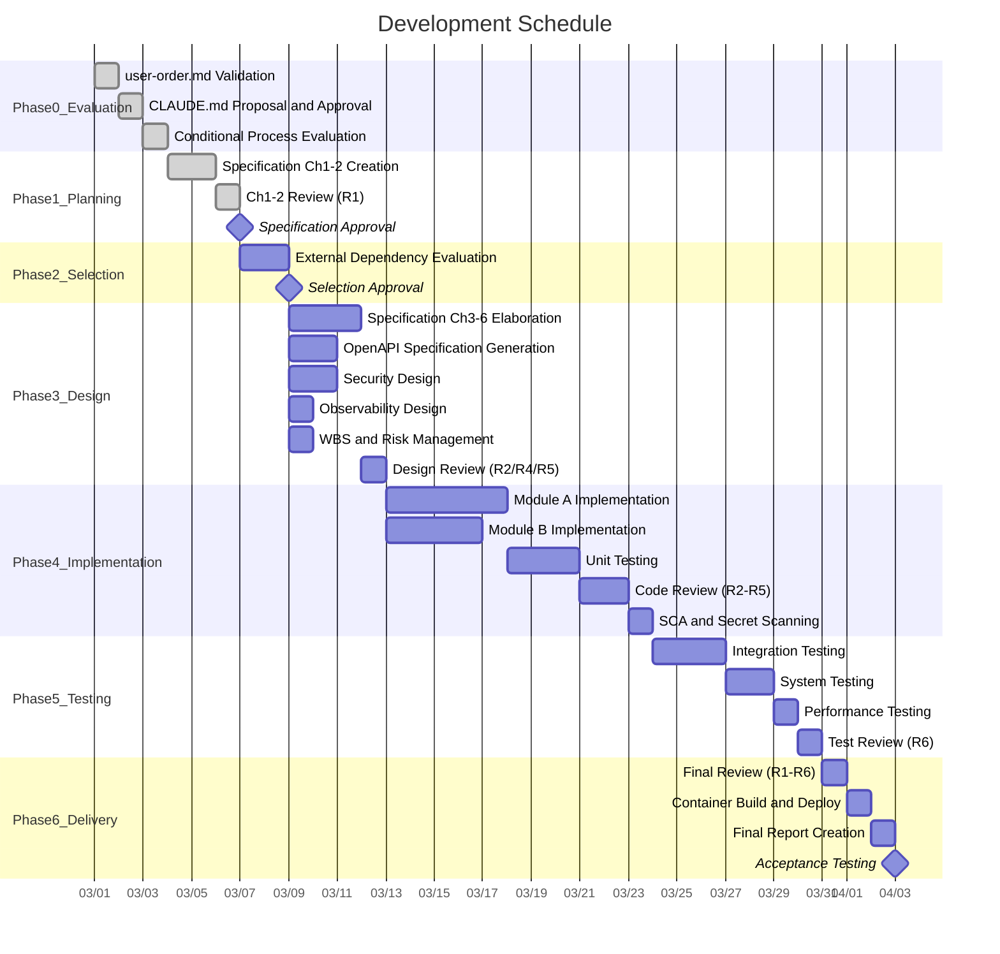

### 4.5 implementation Phase: Implementation — Parallel Development and Testing

#### 4.5.1 Git Branch Strategy

For parallel implementation with Agent Teams, strictly follow the branch strategy below to prevent branch conflicts.

**Branch Strategy Flow:**

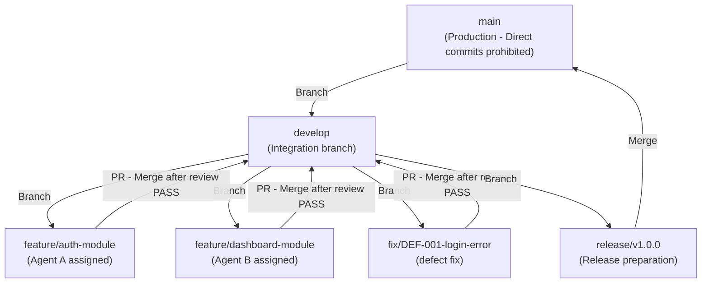

- Each Implementation Agent works on a dedicated `feature/` branch
- Merging to `develop` is only permitted after review-agent PASS
- Merging to `main` is done via a release branch, executed after acceptance testing is complete

#### 4.5.2 Parallel Implementation with Agent Teams

```bash
claude "Based on the specification, start parallel implementation with Agent Teams.
Implementation Agents implement code under src/ (each Agent uses a dedicated branch via Git worktree),
Test Agents create and execute tests under tests/,
Review Agent conducts code reviews (R2/R3/R4/R5 perspectives),
and PM Agent tracks progress.
Each agent focuses on its assigned module from the specification,
and separates responsible directories to avoid file conflicts.
[If HW integration is enabled] Based on the Ch3 I/F definitions in hw-requirement-spec.md,
implement the Adapter layer under src/adapters/hw/. Use mocks/simulators if HW has not arrived.
[If AI/LLM integration is enabled] Based on the Ch3 I/F definitions in ai-requirement-spec.md,
implement the AI Adapter layer under src/adapters/ai/. Place prompt templates under src/prompts/.
[If framework requirement definition is enabled] Based on the Ch3 I/F definitions in framework-requirement-spec.md,
implement the corresponding Adapter layer."
```

#### 4.5.3 Parallel Development with Git Worktree

```bash
# Terminal 1: Module A (feature/auth-module branch)
claude --worktree -p "Implement Module A (authentication module) based on the specification.
Work on the feature/auth-module branch and create a PR to develop upon completion"

# Terminal 2: Module B (feature/dashboard-module branch)
claude --worktree -p "Implement Module B (dashboard) based on the specification.
Work on the feature/dashboard-module branch and create a PR to develop upon completion"
```

### 4.6 testing Phase: Testing — Integration Testing, Performance Testing, and Quality Monitoring

#### 4.6.1 Automated Test Execution

```bash
claude "All module implementation is complete. Execute the following:
1. Create and execute integration tests
2. Create and execute system tests (API-level, E2E-level) to the extent possible
3. Performance testing: Execute k6 scenarios based on NFR numerical targets (response time, concurrent connections, etc.) in specification Ch2
3a. [If HW integration is enabled] HW-SW integration testing: Conduct real hardware testing based on Ch3 I/F definitions in hw-requirement-spec.md. Check test tool configuration and procurement status
3b. [If AI/LLM integration is enabled] AI integration testing: Conduct Adapter layer integration testing based on Ch3 I/F definitions in ai-requirement-spec.md. Verify that model response accuracy, latency, and cost meet requirements
3c. [If framework requirement definition is enabled] Framework integration testing: Conduct Adapter layer integration testing based on Ch3 I/F definitions in framework-requirement-spec.md
4. Update test progress curve and defect curve
5. Conduct test code review (R6 perspective) with review-agent
6. Generate coverage report
7. Evaluate whether quality criteria are met
8. If issues exist, attempt automatic fixes; report critical issues to the user"
```

#### 4.6.2 Performance Test Execution

Verify the numerical targets defined in non-functional requirements (NFR) through actual load testing.

**k6 Performance Test Scenario Example (tests/performance/load-test.js):**

```javascript
import http from "k6/http";
import { check, sleep } from "k6";

export const options = {
  // Specification Ch2 NFR-002: Response within 200ms with 100 concurrent users
  stages: [
    { duration: "30s", target: 50 },
    { duration: "1m", target: 100 },
    { duration: "30s", target: 0 },
  ],
  thresholds: {
    http_req_duration: ["p(95)<200"], // NFR-002: P95 within 200ms
    http_req_failed: ["rate<0.01"], // Error rate below 1%
  },
};

export default function () {
  const res = http.get("http://localhost:3000/api/tasks");
  check(res, { "status was 200": (r) => r.status === 200 });
  sleep(1);
}
```

**Performance Test Results Record (project-records/performance/performance-report-{date}.md):**

- Comparison table of NFR IDs with target values and measured values
- PASS/FAIL judgment
- Identification of bottleneck areas (on FAIL)

#### 4.6.3 Automated Test Progress Curve Monitoring

**Test Progress Data Format (test-progress.json):**

```json
{
  "test_progress": [
    {
      "date": "2026-03-05",
      "planned": 50,
      "executed": 12,
      "passed": 10,
      "failed": 2
    },
    {
      "date": "2026-03-06",
      "planned": 50,
      "executed": 28,
      "passed": 25,
      "failed": 3
    },
    {
      "date": "2026-03-07",
      "planned": 50,
      "executed": 45,
      "passed": 42,
      "failed": 3
    },
    {
      "date": "2026-03-08",
      "planned": 50,
      "executed": 50,
      "passed": 48,
      "failed": 2
    }
  ]
}
```

**Test Progress Curve Visualization (Mermaid):**

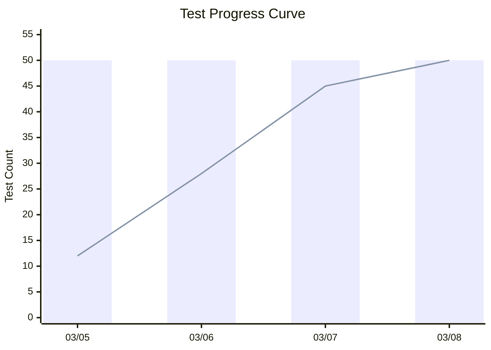

#### 4.6.4 Automated Defect Curve Monitoring

**Defect Curve Data Format (defect-curve.json):**

```json
{
  "defect_curve": [
    { "date": "2026-03-05", "found_cumulative": 5, "fixed_cumulative": 2 },
    { "date": "2026-03-06", "found_cumulative": 12, "fixed_cumulative": 8 },
    { "date": "2026-03-07", "found_cumulative": 15, "fixed_cumulative": 13 },
    { "date": "2026-03-08", "found_cumulative": 16, "fixed_cumulative": 16 }
  ]
}
```

**Defect Curve Visualization (Mermaid):**

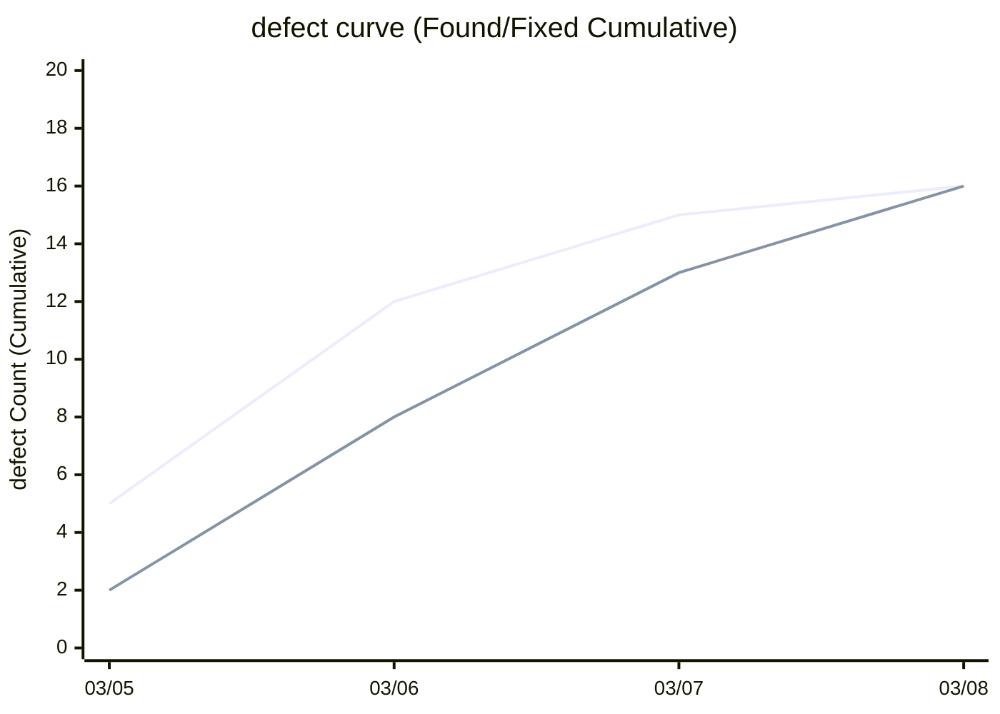

#### 4.6.5 Automatic Resource Allocation to Bottlenecks

When the PM Agent detects anomalies, the lead agent automatically takes the following actions:

1. Identify the problem area (which module/feature has concentrated defects)
2. Launch additional sub-agents and focus them on the problem area
3. Upgrade the model if necessary (sonnet -> opus)
4. Execute re-testing after fixes

### 4.7 delivery Phase: Delivery — Deployment, Final Report, and Acceptance Testing

#### 4.7.1 Final Review and FAIL Routing

```bash
claude "Testing is complete. Conduct a final review of all deliverables with review-agent (all R1-R6 perspectives).
If FAILED, return to the corresponding phase based on the finding's perspective and make corrections:
- R1 findings -> Specification Ch1-2 corrections (equivalent to planning phase)
- R2/R4/R5 design findings -> Specification Ch3-4 corrections (equivalent to design phase)
- R3/R5 implementation findings -> Code corrections (equivalent to implementation phase)
- R6 test findings -> Test corrections (equivalent to testing phase)
Once all PASS, begin deployment."
```

#### 4.7.2 Container Build and Deployment

```bash
claude "The final review has PASSED. Execute the following deployment procedure:
1. Verify and build the Dockerfile, and confirm the container image health
2. Verify the IaC configuration in infra/ (Terraform, etc.), display the diff (confirm with user before apply)
3. Execute deployment (Blue/Green deployment or canary release)
4. Smoke test: Automatically execute basic endpoint connectivity checks
5. Verify rollback procedure and record in project-records/release/rollback-procedure.md
6. [If HW integration is enabled] Execute HW deployment method (flash/JTAG/OTA, etc.) and verify actual device operation
7. [If AI/LLM integration is enabled] Verify production connection for AI service (API key and endpoint configuration) and conduct production environment inference accuracy testing"
```

> **Important:** Always request user confirmation for IaC apply (applying infrastructure changes). This is a safety measure to prevent unintended infrastructure changes.

#### 4.7.3 Observability Verification

```bash
claude "Verify post-deployment observability:
1. Compare the design in docs/observability/observability-design.md with the actual configuration
2. Verify that structured logs are output in correct JSON format
3. Verify that metrics (Rate/Error/Duration) are instrumented
4. Verify that alert rules (error rate exceeding 1%, SLA latency exceeded) are configured
5. If discrepancies exist, correct them and update docs/observability/"
```

#### 4.7.4 Automatic Final Report Generation

```bash
claude "Execute the following final steps:
1. Conduct final license verification with license-checker
2. Create the final report in project-management/progress/final-report.md including:
   - Project overview and list of implemented features
   - Test results summary (coverage, pass rate)
   - Performance test results (NFR achievement status)
   - Final state of test progress curve and defect curve
   - Review results summary (R1-R6)
   - Security evaluation results (including SAST/SCA)
   - Final version confirmation of API documentation (openapi.yaml)
   - Observability configuration verification results
   - Known issues and constraints
3. Create acceptance testing procedure guide"
```

#### 4.7.5 User Action: Acceptance Testing

- Whether all requested features are implemented
- Whether behavior meets expectations
- Whether performance is within acceptable range (verify performance test results)
- Whether there are security concerns
- Whether API documentation is up to date

### 4.8 operation Phase: Operations and Maintenance — Incident Management, Patch Management, and Monitoring Operations (Conditional)

Activated for projects that operate in production after delivery phase completion. Skip for delivery-complete projects (deliverables are handed over to the user and the project ends).

#### 4.8.1 Transition to Operations

After acceptance testing completion in the delivery phase, execute the following handover tasks:

- **Runbook creation**: Record daily operations procedures, periodic maintenance procedures, and incident response procedures in `docs/operations/runbook.md`
- **Monitoring and alert operations plan**: Based on the observability design (observability-design.md) from the design phase, define the specific monitoring infrastructure, on-call structure, and alert response SLA
- **Handover judgment**: Confirm that the operations team understands the runbook and has the knowledge needed for initial operations

#### 4.8.2 Incident Management

**Reference Standards:** ITIL Incident Management, SRE practices

Response process for incidents (service outage, performance degradation, security breach, data inconsistency, etc.) occurring during production operations:

1. **Detection**: Recognize an incident through monitoring alerts or user reports
2. **Triage**: Determine severity (P1: Service outage, P2: Partial failure, P3: Performance degradation, P4: Minor issue)
3. **Response**: Execute immediate response (apply workaround, rollback, etc.)
4. **Recovery**: Identify root cause and implement permanent fix
5. **Post-mortem**: Record the incident timeline, root cause, and recurrence prevention measures in `project-records/incidents/incident-{NNN}-{YYYYMMDD}-{HHMMSS}.md`

**Escalation Criteria:**
- P1/P2: Immediately notify the user (service owner)
- P3: Notify in the next periodic report
- P4: Record only

#### 4.8.3 Maintenance and Patch Management

**Reference Standards:** ISO/IEC 14764 Software Maintenance

- **Security patches**: When vulnerabilities are discovered in dependent libraries, create a security-scan-report and determine patch application priority (Critical/High: within 48 hours, Medium: within 1 week, Low: next periodic update)
- **Defect fixes**: Failures discovered in production are recorded as defects, and the fix -> test -> release cycle is executed
- **Periodic dependency updates**: Leverage automatic update tools such as Renovate/Dependabot to keep dependencies current. Breaking changes are managed as change-requests
- **Periodic maintenance**: Record and execute periodic tasks such as database vacuuming, log rotation, and certificate renewal in the runbook

#### 4.8.4 Disaster Recovery and Business Continuity (DR/BCP)

**Reference Standards:** ISO 22301 Business Continuity, AWS Well-Architected Framework

Based on the RPO (Recovery Point Objective) / RTO (Recovery Time Objective) defined in the design phase, manage the following:

- **Backup strategy**: Define and execute backup intervals and retention policies that satisfy the RPO
- **Recovery procedures**: Document recovery procedures that satisfy the RTO in `docs/operations/disaster-recovery-plan.md` and conduct periodic drills
- **Business continuity plan**: Develop continuity plans for scenarios such as major cloud region failures and major vendor service outages

#### 4.8.5 System Decommissioning and Migration (EOL)

Execute at the end of the system lifecycle:

- **Decommissioning plan**: Define the decommissioning date, data migration destination, and user notification schedule
- **Data migration**: Plan, execute, and verify data migration to the successor system
- **Service shutdown**: Gradually reduce service and ultimately shut down
- **Archival**: Archive source code, design documents, and operations records in `project-records/snapshots/`

---

# Part 3: Setup and Preparation

## Chapter 5: Environment Setup

### 5.1 Installing Claude Code

Claude Code is an agent-type coding tool that runs in the terminal. Install using one of the following methods.

**macOS (Homebrew):**

```bash
brew install claude-code
```

**Windows (WinGet):**

```bash
winget install Anthropic.ClaudeCode
```

**Native Installation (macOS/Linux/Windows):**

Use the native installer described in the official documentation (https://code.claude.com/docs/en/overview). Native installations are automatically updated in the background.

> **Note:** Installation via npm (`npm install -g @anthropic-ai/claude-code`) is deprecated. Use one of the methods above.

**First Launch After Installation:**

```bash
cd /path/to/your/project
claude
```

You will be prompted to log in on first launch. Authenticate with a Claude Pro/Team/Enterprise account or an Anthropic Console API key.

### 5.2 VS Code Extension (Recommended)

Using the VS Code extension enables inline diff display, plan review, and conversation history within the IDE.

1. Search for "Claude Code" in the VS Code extension marketplace and install
2. Select "Claude Code: Open in New Tab" from the command palette (Cmd+Shift+P / Ctrl+Shift+P)

### 5.3 Enabling Agent Teams

Agent Teams is an experimental feature and must be explicitly enabled.

```bash
export CLAUDE_CODE_EXPERIMENTAL_AGENT_TEAMS=1
```

To persist, add to your shell configuration file (`.bashrc`, `.zshrc`, etc.).

### 5.4 MCP Server Configuration

Create `.mcp.json` at the project root to define external tool integrations.

**MCP Configuration File (.mcp.json):**

```json
{
  "mcpServers": {
    "github": {
      "type": "url",
      "url": "https://mcp.github.com/sse"
    },
    "slack": {
      "type": "url",
      "url": "https://mcp.slack.com/sse"
    }
  }
}
```

Select MCP servers to use based on the project's technology stack. The MCP ecosystem includes over 1,000 community servers, enabling integration with Jira, Google Drive, Sentry, Puppeteer (visual testing), etc. For a list of available servers, see https://github.com/modelcontextprotocol/servers.

### 5.5 Recommended Project Structure (Complete Version)

**Project Directory Structure:**

```text
project_root/
  CLAUDE.md                       ... Project configuration (most important)
  .mcp.json                       ... MCP server configuration
  user-order.md                    ... What to build (user answers 3 questions)
  process-rules/
    spec-template-ja.md           ... Specification template (JA)
    spec-template-en.md           ... Specification template (EN)
  essays/                         ... Papers and research (JA/EN)
    anms-essay-ja.md              ... Paper original (JA)
    anms-essay-en.md              ... Paper EN
    research/                     ... Research reports
  .claude/
    agents/                       ... Custom agent definitions
      orchestrator.md             ... Orchestrator (phase transitions, decision-making)
      srs-writer.md               ... Specification creation (Ch1-2) agent
      architect.md                ... Specification elaboration (Ch3-6) agent
      security-reviewer.md        ... Security design agent
      implementer.md              ... Implementation agent (src/ + unit tests)
      test-engineer.md            ... Test engineer agent
      review-agent.md             ... Review agent (SW engineering principles, concurrency, performance)
      progress-monitor.md         ... Progress management agent
      change-manager.md           ... Change management agent
      risk-manager.md             ... Risk management agent
      license-checker.md          ... License verification agent
      kotodama-kun.md             ... Terminology/naming checker
      framework-translation-verifier.md ... Translation consistency verification agent
      user-manual-writer.md       ... User manual creation agent
      runbook-writer.md           ... Runbook creation agent
      incident-reporter.md        ... Incident report agent
      process-improver.md         ... Process improvement agent
      decree-writer.md            ... Governance file revision agent
    commands/                     ... Custom slash commands
      full-auto-dev.md            ... Start fully automated development (setup to delivery)
      check-progress.md           ... Progress check
      retrospective.md            ... Retrospective and recurrence prevention (Recommended)
      council-review.md           ... Advisory council review
      translate-framework.md      ... Framework document translation
    settings.json                 ... Project settings
  docs/
    api/                          ... API documentation (OpenAPI specification)
    security/                     ... Security design documents
    spec/                         ... Formal specifications generated by AI (ANMS/ANPS/ANGS format)
    observability/                ... Observability design documents
    operations/                   ... Runbooks and disaster recovery plans
  project-management/
    progress/                     ... Progress reports, WBS, cost management
    test-plan.md                  ... Test plan document
  project-records/
    reviews/                      ... Review reports (review-agent output)
    change-requests/              ... Change requests and change management ledger (Mandatory)
    risks/                        ... Risk register and risk reports (Mandatory)
    decisions/                    ... Decision records for critical decisions (Mandatory)
    defects/                      ... defect tickets (Mandatory)
    traceability/                 ... Requirement <-> Design <-> Test traceability (Mandatory)
    licenses/                     ... License reports (Mandatory)
    performance/                  ... Performance test results
    security/                     ... Security scan results (SAST/SCA/DAST)
    release/                      ... Release judgment checklist (Recommended)
    improvement/                  ... Retrospective and process improvement records (Recommended)
    archive/                      ... Deprecated documents (Recommended)
    incidents/                    ... Incident records (Conditional)
    legal/                        ... Legal and patent research records (Conditional)
    safety/                       ... Functional safety analysis documents (Conditional)
  src/                            ... Source code
  tests/                          ... Test code
  infra/                          ... IaC (Terraform/Pulumi, etc.)
  .github/
    workflows/                    ... GitHub Actions workflows
```

This structure is based on conventions that Claude Code automatically recognizes and utilizes. In particular, `CLAUDE.md` is automatically loaded at session start, making it the most important file for defining project rules.

---

## Chapter 6: CLAUDE.md Design (The Brain of the Project)

`CLAUDE.md` is a Markdown file placed at the project root that Claude Code automatically reads at session start. In nearly fully automated development, this file becomes the "brain" of the entire project.

**Important:** CLAUDE.md is not manually written by the user; rather, it is **proposed by the AI based on user-order.md during the setup phase**. The user only needs to review and approve the proposal. The template below is a boilerplate used by the AI when generating the proposal.

### 6.1 CLAUDE.md Template

**CLAUDE.md Template:**

> **Note:** The following is a template example. The authoritative version is `CLAUDE.md` at the repository root.

```markdown
# Project: [Project Name]

## Project Overview

[Describe the concept presented by the user here]

## Development Policy

- This project proceeds with nearly fully automated development
- User confirmation is limited to critical decisions only
- Minor technical decisions are made autonomously by Claude Code
- Specifications are output under docs/spec/ (format selected from ANMS/ANPS/ANGS based on project scale). Other design deliverables are output as Markdown under docs/
- Process documents (pipeline state, handover, progress) are output under project-management/
- Process records (reviews, decisions, risks, defects, CRs, traceability) are output under project-records/
- Code is placed under src/, tests under tests/, IaC (Infrastructure as Code) under infra/
- **Product AI/LLM prompts are placed under src/ (managed as equivalent to code).** Prompts for running the project are placed under .claude/ (meta layer). Do not mix them
- Refer to the following for operational rules:
  - process-rules/full-auto-dev-process-rules.md (Process rules)
  - process-rules/full-auto-dev-document-rules.md v0.0.0 (Document management rules)

## Language Settings

- Project primary language: [e.g., ja]
- Translation languages: [e.g., en (empty = single-language project)]

## Technology Stack

- Language: [e.g., TypeScript]
- Framework: [e.g., Next.js 15]
- Database: [e.g., PostgreSQL]
- Test Framework: [e.g., Vitest]
- Performance Testing: [e.g., k6]
- Container: [e.g., Docker / docker-compose]
- IaC: [e.g., Terraform]
- CI/CD: [e.g., GitHub Actions]
- Observability: [e.g., OpenTelemetry + Grafana]

## Branch Strategy

- Main branch: main (direct commits prohibited)
- Development branch: develop (integration branch)
- Feature branches: feature/{issue-number}-{description} (branched from develop)
- defect fix branches: fix/{issue-number}-{description}
- Release branches: release/v{version} (branched from develop)
- PR merge: develop -> main permitted only after review-agent PASS
- Agent Teams parallel implementation: Use git worktree, each agent works on a dedicated branch

## Coding Conventions

- [Project-specific rules]
- Follow ESLint configuration
- Add JSDoc comments to all public functions
- Handle errors explicitly
- Use structured logs (JSON format) (console.log is prohibited)
- **AI/LLM Prompt Conventions** (when AI/LLM integration is enabled):
  - Place product prompt templates under `src/prompts/` or `src/ai/prompts/` (follow the project's language conventions)
  - Specify input/output schemas (expected input and output type definitions) for each prompt
  - Create prompt tests (input -> expected output pairs) under tests/
  - Do not mix project-running prompts (.claude/agents/, .claude/commands/) with product prompts (src/)

## Security Requirements

- Countermeasures for OWASP Top 10 are mandatory
- Use JWT for authentication
- Always validate input values
- Use parameterized queries as SQL injection countermeasure
- SAST: CodeQL (automatically executed in GitHub Actions)
- SCA: npm audit / Snyk (always execute when adding dependencies)
- Secret scanning: git-secrets or truffleHog (pre-commit hook)

## Testing Policy

- Coverage target: 80% or higher
- Unit tests: All business logic (pass rate 95% or higher)
- Integration tests: API endpoints (pass rate 100%)
- E2E tests: Key user flows
- Performance tests: Verify NFR numerical targets with k6

## API Documentation

- Output in OpenAPI 3.0 format under docs/api/
- architect agent generates simultaneously with specification Ch3 elaboration
- After implementation, test-engineer verifies consistency with endpoints

## Observability Requirements

- Logs: Structured JSON format, DEBUG/INFO/WARN/ERROR 4 levels
- Metrics: Instrument RED (Rate/Error/Duration) metrics on all APIs
- Tracing: Request tracking with OpenTelemetry
- Alerts: Alert on error rate exceeding 1%, P99 latency exceeding SLA

## Agent Teams Configuration

When working with Agent Teams, use the following role definitions:

- **SRS Agent**: Creates specification (Ch1-2: Foundation & Requirements) in docs/spec/ (follows the ANMS/ANPS/ANGS format selected in the setup phase). Structures the user concept
- **Architect Agent**: Elaborates specification Ch3-6 in docs/spec/. Generates OpenAPI specification in docs/api/
- **Security Agent**: Creates security design in docs/security/. Conducts vulnerability reviews of implementation code
- **Implementation Agent**: Implements code under src/. Follows design documents
- **Test Agent**: Creates and executes tests under tests/. Generates coverage reports
- **Review Agent**: Outputs review reports to project-records/reviews/. Reviews on R1-R6 perspectives (SW engineering principles, concurrency, performance) and blocks phase transitions until Critical/High findings reach zero
- **PM Agent**: Outputs progress reports to project-management/progress/. Manages WBS/defect curve/cost

## Critical Decision Criteria

Request user confirmation in the following cases:

- Fundamental architectural choices
- External service/API selection
- Major changes to the security model
- Decisions affecting budget or schedule
- Ambiguous requirements allowing multiple interpretations
- Risk scores of 6 or higher
- Cost budget reaching 80%
- Change requests with High impact level

Claude Code may decide autonomously in the following cases:

- Specific library version selection
- Code refactoring policies
- Test case design
- Document structure
- defect fix methods

## Mandatory Process Settings (see Chapter 3)

- Change management: Changes after specification approval are processed through the change-manager agent
- Risk management: Create risk register at planning phase completion and update at each phase start
- Traceability: Record requirement ID -> design ID -> test ID mappings in project-records/traceability/
- Issue management: defects are recorded as defect tickets in project-records/defects/ with root cause analysis
- License management: Execute license-checker agent when adding dependent libraries
- Audit records: Record critical decisions in project-records/decisions/
- Cost management: Record API token consumption in project-management/progress/cost-log.json

## Conditional Processes (determined in setup phase, see Chapter 3 Section 3.4)

# Enable the following only when applicable conditions exist

# Legal research: [Enabled/Disabled] - Reason: [description]

# Patent research: [Enabled/Disabled] - Reason: [description]

# Technology trend research: [Enabled/Disabled] - Reason: [description]

# Functional safety (HARA/FMEA): [Enabled/Disabled] - Reason: [description]

# Accessibility (WCAG 2.1): [Enabled/Disabled] - Reason: [description]

# HW integration: [Enabled/Disabled] - Reason: [description]

# AI/LLM integration: [Enabled/Disabled] - Reason: [description]

# Framework requirement definition: [Enabled/Disabled] - Reason: [description]

# HW production process management: [Enabled/Disabled] - Reason: [description]

# Product i18n/l10n: [Enabled/Disabled] - Reason: [description]

# Certification acquisition: [Enabled/Disabled] - Reason: [description]

# Operations and maintenance: [Enabled/Disabled] - Reason: [description]
```

This template is committed to version control and shared across the entire team.

### 6.2 Key Points for CLAUDE.md Design

1. **Specificity**: Avoid ambiguous instructions and write specific rules
2. **Clear decision criteria**: Explicitly state which cases require asking the user and which the AI may decide
3. **Agent Teams role definitions**: Clearly define each agent's responsibility scope and file boundaries (to prevent file conflicts)
4. **Branch strategy specification**: Define branch naming and merge rules for parallel development
5. **Version control**: Manage CLAUDE.md itself with Git and update as the project progresses
6. **Continuous improvement through retrospectives**: Append recurrence prevention measures discovered after running the retrospective command

---

## Chapter 7: Agent Definitions

For the agent list, ownership, data flow, and phase-based activation, refer to [Agent List](agent-list.md).

For prompt structure specification (S0-S6: Identity / Activation / Ownership / Procedure / Rules / Exception), refer to [Prompt Structure Specification](prompt-structure.md).

For each agent's prompt definition, refer to `.claude/agents/*.md`. This is the Single Source of Truth for each agent.

For term definitions, selection rationale, and abbreviation permission decisions, refer to [Glossary](glossary.md).

---

## Chapter 8: Custom Command Definitions

Frequently used workflows can be defined as slash commands, enabling complex processes to be launched with a single command.

### 8.1 Full Auto Development Start Command

**.claude/commands/full-auto-dev.md:**

```markdown
Read user-order.md and start the nearly fully automated software development.

Execute the following phases sequentially:

## Phase 0: Conditional Process Evaluation (Mandatory - execute before specification creation)
0a. Read user-order.md
0b. user-order.md validation: Verify the following required items are documented
    - What to build (What), and why (Why)
    -> If items are missing: Supplement through dialogue with the user before proceeding
0b2. Propose CLAUDE.md based on user-order.md content (project name, technology stack, coding conventions, security policy, branch strategy, etc.)
    -> Place CLAUDE.md after user approval
0c. Evaluate the need for functional safety (impact on human life/infrastructure, safety standards compliance)
    -> If applicable: Immediately request user confirmation and finalize safety requirements before proceeding
0d. Evaluate the need for legal research (personal information, healthcare, finance, communications, EU market, public sector)
    -> If applicable: Add to CLAUDE.md and include regulatory requirements in the specification's non-functional requirements
0e. Evaluate the need for patent research (novel algorithms, AI models, commercial sales)
    -> If applicable: Add a patent research task before the design phase start in the WBS
0f. Evaluate the need for technology trend research (over 6 months, rapidly changing technology domains, approaching EOL)
    -> If applicable: Add technology trend check steps to the WBS at each phase start
0g. Evaluate the need for accessibility (WCAG 2.1) (web apps, EU market, etc.)
    -> If applicable: Add to CLAUDE.md and include accessibility requirements in the specification's NFR
0h. Report evaluation results to the user and request confirmation regarding additional conditional processes

## Phase 1: Planning
1. Analyze user-order.md
2. Refer to process-rules/spec-template.md and create the specification in docs/spec/ (Ch1-2: Foundation & Requirements, following the ANMS/ANPS/ANGS format selected in the setup phase)
3. Place Ch3-6 skeleton (headings only) in the same file
4. Report specification overview to the user and request approval
5. Conduct quality review (R1 perspective) of specification Ch1-2 with review-agent, proceed after PASS

## Phase 2: External Dependency Selection (Conditional — when any of HW integration, AI/LLM integration, or framework requirement definition is enabled)
6. Extract requirements for external dependencies from the interview record and create a requirement-spec draft (Ch1-2)
7. Conduct candidate research, technical evaluation, cost analysis, and license verification
8. Present evaluation results to the user and request selection approval
9. After approval, complete the requirement-spec Ch3-6
10. If procurement is needed, confirm availability timelines and reflect in the WBS
    -> If all are disabled: Skip and proceed to the design phase

## Phase 3: Design (after specification Ch1-2 approval)
11. Elaborate specification Ch3 (Architecture) in docs/spec/
12. Elaborate specification Ch4 (Specification) in Gherkin in docs/spec/
13. Define specification Ch5 (Test Strategy) in docs/spec/
14. Configure specification Ch6 (Design Principles Compliance) in docs/spec/
15. Generate OpenAPI 3.0 specification in docs/api/openapi.yaml
16. Create security design in docs/security/
17. Create observability design (logs, metrics, tracing, alerts) in docs/observability/observability-design.md
18. Create WBS and Gantt chart in project-management/progress/wbs.md
19. Create risk register with risk-manager
20. Conduct quality review (R2/R4/R5 perspectives) of specification Ch3-4 and design with review-agent, proceed after PASS

## Phase 4: Implementation
21. Implement code under src/ based on the specification (parallel implementation with Git worktree)
22. Based on the observability design, incorporate structured logs, metrics instrumentation, and tracing into the code
23. Create and execute unit tests under tests/
24. Conduct implementation code review (R2/R3/R4/R5 perspectives) with review-agent, proceed after PASS
25. Execute SCA scan (npm audit, etc.) with security-reviewer and confirm Critical/High vulnerabilities are zero
26. Conduct license verification with license-checker

## Phase 5: Testing
27. Create and execute integration tests
28. Create and execute system tests to the extent possible
29. Execute performance tests based on specification Ch2 NFR numerical targets and record results in project-records/performance/
30. Update test progress curve and defect curve
31. Conduct test code review (R6 perspective) with review-agent
32. Evaluate quality criteria

## Phase 6: Delivery
33. Conduct final review of all deliverables (all R1-R6 perspectives) with review-agent
    -> If FAILED: Return to the corresponding phase based on the finding's perspective and make corrections
34. Build container image and verify IaC configuration in infra/
35. Execute deployment and verify basic operation with smoke tests
36. Verify that monitoring and alert configurations match the observability design
37. Verify and document rollback procedure
38. Create final report in project-management/progress/final-report.md
39. Create acceptance testing procedure guide
40. Report completion to the user

Report progress at each phase completion.
Request user confirmation when critical decisions are needed.
Make minor technical decisions autonomously.
```

Usage:

```bash
claude
> /project:full-auto-dev
```

### 8.2 Progress Check Command

**.claude/commands/check-progress.md:**

```markdown
Check the current development progress and report the following:

1. Read the latest data under project-management/progress/
2. Calculate WBS progress rate
3. Report current test progress curve values
4. Report current defect curve values
5. Report current coverage values
6. Report current cost consumption values
7. Identify bottlenecks if any
8. Propose next actions to execute
```

### 8.3 Retrospective Command

**.claude/commands/retrospective.md:**

```markdown
Conduct the following retrospective:

## Phase 1: Analysis (process-improver)

1. Read all defect tickets from project-records/defects/
2. Identify recurring defect patterns
3. Analyze root causes (CMMI CAR process)
4. Verify compliance with document management rules (process-rules/full-auto-dev-document-rules.md)
   - Does the Common Block / Form Block structure match the actual state?
   - Are there missing or unnecessary fields?
5. Record improvement measures as a retrospective-report in project-records/improvement/
6. Submit to orchestrator and request approval

## Phase 2: Application (decree-writer)

7. orchestrator approves the improvement measures (creates a decision record)
8. decree-writer receives the approved improvement measures and conducts safety checks (SR1-SR6)
9. Apply to target files based on the approval table
   - CLAUDE.md / process-rules/ -> User approval required
   - .claude/agents/ -> orchestrator approval
10. Record before/after diff in project-records/improvement/

## Recurrence Prevention Record Format

- defect pattern: [Pattern description]
- Root cause: [Why-Why analysis result]
- Countermeasure: [Target file and change content]
- Approval category: [User approval / orchestrator approval]
- Effectiveness verification method: [Verification method in the next phase]
```

### 8.4 Translate-Framework Command

**.claude/commands/translate-framework.md:**

```markdown
Translate gr-sw-maker framework documents into {target language}.

Argument format: `{source language} {target language}` (e.g., `ja fr`, `en fr`)

1. Collect translation targets (process-rules, agents, commands, CLAUDE.md, user-order.md)
2. Keep English-fixed elements untranslated (YAML keys, file_type names, field names, IDs, Mermaid node IDs)
3. Translate each file and output with the target language suffix
4. Verify structural consistency between source and translated files (headings, tables, diagrams, numerical values)
```

### 8.5 Council-Review Command

**.claude/commands/council-review.md:**

```markdown
Cross-cutting quality review of the gr-sw-maker framework by an advisory council.

Phase 0: Translation consistency gate (JA/EN pair verification)
Phase 1: Sub-agents for mechanical checks (prompt quality, terminology scan)
Phase 2: Main council review by 4 experts
  - Expert 1: Process Engineering (phase transitions, quality gates, escalation criteria)
  - Expert 2: Agent Architecture (ownership, data flow, safety checks)
  - Expert 3: Terminology & Document Structure (glossary, Form Block, multilingual rules)
  - Expert 4: Diagram & Table Cross-check (inter-document consistency)
Phase 3: Integration of results into final report (project-records/reviews/)

Judgment: PASS (C=0, H=0) / CONDITIONAL PASS (C=0, H≤3) / FAIL (C≥1 or H≥4)
```

---

# Part 4: Quality and Operations

## Chapter 9: Quality Management Framework

### 9.1 Staged Review Gates

**Review Gate Flow (with explicit FAIL routing destinations):**

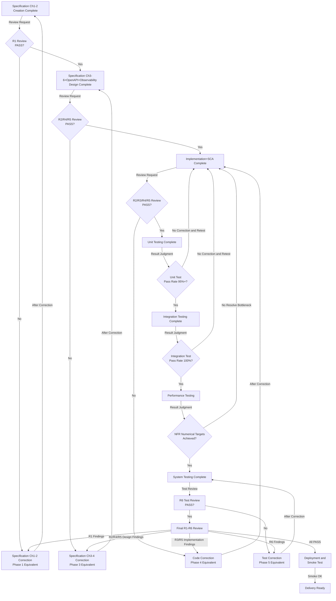

Each review gate is automatically executed by review-agent. Phase transitions are blocked until Critical/High findings reach zero.

### 9.2 Review Perspectives (R1-R6)

Six perspectives applied by review-agent. **For detailed checklists, refer to `process-rules/review-standards.md` (Review Standards Specification).** The following is a summary of each perspective.

| Perspective | Content | Applicable To |
| --- | --- | --- |
| **R1: Requirements Quality** | Completeness, testability, contradictions, ambiguous expressions, terminology consistency, accessibility (WCAG) | Specification Ch1-2 |
| **R2: SW Design Principles** | SOLID (SRP/OCP/LSP/ISP/DIP), DRY, KISS, YAGNI, SoC, SLAP, LOD, CQS, POLA, PIE, CA, Naming, Prompt Engineering (when AI/LLM integration is active) | Specification Ch3-4, Code |
| **R3: Coding Quality** | Error handling completeness, input validation, defensive programming | Code |
| **R4: Concurrency and State Transitions** | Deadlocks (resource acquisition order, long-held locks), race conditions (Check-Then-Act, DB Read-Modify-Write, Promise races), glitches (non-atomic updates, intermediate state exposure) | Specification Ch3-4, Code |
| **R5: Performance** | Algorithm complexity (O(n^2) and above), N+1 queries, memory leaks, unnecessary serialization, network/frontend optimization (overfetching, unnecessary re-rendering) | Specification Ch3-4, Code |
| **R6: Test Quality** | Test independence, boundary values, error cases, flaky tests, requirements coverage, NFR coverage in performance testing | Test code |

### 9.3 Quality Criteria Table

| Metric | Threshold | Measurement Method |
| --- | --- | --- |
| Unit test pass rate | 95% or higher | Test framework execution results |
| Integration test pass rate | 100% | Test framework execution results |
| Code coverage | 80% or higher | Coverage tools (e.g., c8, istanbul) |
| Performance testing | All NFR numerical targets achieved | Performance testing results (k6, etc.) |
| Security vulnerabilities | Critical/High: 0 | Security Agent + SAST/SCA scan results |
| Review findings | Critical/High: 0 | review-agent output |
| Coding convention compliance | 0 violations | Linter (ESLint, etc.) execution results |

### 9.4 Phase-Specific KPIs (Key Performance Indicators)

Define KPIs to track for each phase. progress-monitor reflects these KPIs in the executive-dashboard at each phase completion.

| Phase | KPI | Target/Criteria | Measurement Method |
|---------|-----|----------|---------|
| setup | Conditional process evaluation completion rate | All 12 items evaluated | CLAUDE.md conditional processes section |
| setup | CLAUDE.md approval | User-approved | User confirmation record |
| planning | Requirement ID assignment rate | 100% (ID assigned to all FR/NFR) | Specification Ch2 requirements list |
| planning | R1 PASS rate | Critical/High: 0 | review-agent report |
| planning | Mock/sample feedback complete | User "matches image" judgment | interview-record |
| planning | Specification approval | User-approved | User confirmation record |
| dependency-selection | Candidate evaluation completion rate | Candidate list and evaluation complete for all external dependencies | requirement-spec |
| dependency-selection | Selection approval rate | User-approved | decision record |
| design | Ch3-6 completion rate | All 4 chapters complete | Specification Ch3-6 |
| design | R2/R4/R5 PASS rate | Critical/High: 0 | review-agent report |
| design | WBS creation complete | Critical path identified | wbs.md |
| design | Risk register creation complete | All risks evaluated | risk-register.md |
| implementation | Code implementation progress rate | WBS tasks completed / total | wbs.md |
| implementation | Unit test pass rate | 95% or higher | Test framework |
| implementation | Code coverage | 80% or higher | Coverage tools |
| implementation | SCA/SAST clear rate | Critical/High: 0 | security-scan-report |
| testing | Integration test pass rate | 100% | Test framework |
| testing | Performance test NFR achievement rate | 100% | performance-report |
| testing | defect open count (Critical/High) | 0 | defect aggregation |
| testing | defect curve convergence | New discovery trending downward | defect-curve.json |
| delivery | Final review PASS | R1-R6 all PASS | review-agent report |
| delivery | Acceptance test pass | User-approved | final-report |
| delivery | Deployment complete | Smoke test passed | Deploy logs |
| operation | SLA achievement rate | Meeting target uptime and response time | Monitoring metrics |
| operation | Incident count/MTTR | P1/P2: Trending downward, MTTR: Trending shorter | incident-report aggregation |
| operation | Patch application rate | Critical: within 48h, High: within 1 week | security-scan-report |
| operation | Dependency freshness | Major dependencies within latest minor version | Periodic SCA scan |

---

## Chapter 10: Headless Mode and CI/CD Integration

### 10.1 Headless Mode Basics

Using the `-p` flag enables running Claude Code without interaction. This allows automatic invocation from CI/CD pipelines and scripts.

```bash
# Single headless execution
claude -p "Execute all tests under src/ and output results in JSON format"

# Specify output format
claude -p "Report the test results" --output-format json
```

### 10.2 Integration with GitHub Actions

When integrating Claude Code into CI/CD pipelines, follow these security principles.

**Security Principles:**

- Prohibit direct script execution via `curl | sh` (risk of executing without content review)
- Use official GitHub Actions (`anthropics/claude-code-action`, etc.)
- Minimize credentials with OIDC (OpenID Connect) authentication
- Explicitly specify minimum permissions with the `permissions:` field
- Store secrets in GitHub Secrets and rotate periodically

**GitHub Actions Workflow Example (.github/workflows/claude-review.yml):**

```yaml
name: Claude Code Auto Review
on:
  pull_request:
    types: [opened, synchronize]

permissions:
  contents: read
  pull-requests: write

jobs:
  security-scan:
    runs-on: ubuntu-latest
    steps:
      - uses: actions/checkout@v4

      - name: Run CodeQL Analysis
        uses: github/codeql-action/init@v3
        with:
          languages: javascript, typescript

      - name: Autobuild
        uses: github/codeql-action/autobuild@v3

      - name: Perform CodeQL Analysis
        uses: github/codeql-action/analyze@v3

      - name: Run npm audit
        run: npm audit --audit-level=high

  claude-review:
    runs-on: ubuntu-latest
    needs: security-scan
    steps:
      - uses: actions/checkout@v4

      - name: Install Claude Code (Official installation method)
        run: |
          # Use the method described in the official documentation
          # https://code.claude.com/docs/en/overview
          npm install -g @anthropic-ai/claude-code

      - name: Run Claude Code Review
        env:
          ANTHROPIC_API_KEY: ${{ secrets.ANTHROPIC_API_KEY }}
        run: |
          claude -p "Review the changes in this PR.
          Report any security issues, performance concerns, and coding convention violations." \
          --output-format json > review-result.json

      - name: Post Review Comment
        uses: actions/github-script@v7
        with:
          script: |
            const fs = require('fs');
            const result = JSON.parse(fs.readFileSync('review-result.json', 'utf8'));
            await github.rest.issues.createComment({
              issue_number: context.issue.number,
              owner: context.repo.owner,
              repo: context.repo.repo,
              body: result.result
            });
```

> **Note:** Refer to the latest official documentation for Claude Code installation methods. npm installation may be deprecated in some environments.

---

## Chapter 11: Deployment and Observability

### 11.1 Deployment Process

Production release requires three elements: containerization, IaC, and staged deployment.

#### 11.1.1 Containerization

**Dockerfile Best Practice Example:**

```dockerfile
# Minimize image with multi-stage build
FROM node:20-alpine AS builder
WORKDIR /app
COPY package*.json ./
RUN npm ci --only=production
COPY . .
RUN npm run build

FROM node:20-alpine AS runner
WORKDIR /app
# Run as non-root user (security requirement)
RUN addgroup --system --gid 1001 nodejs
RUN adduser --system --uid 1001 nextjs
COPY --from=builder --chown=nextjs:nodejs /app/.next ./.next
COPY --from=builder /app/node_modules ./node_modules
USER nextjs
EXPOSE 3000
CMD ["node", "server.js"]
```

**Container Security Scanning (Trivy):**

```bash
# Vulnerability scan of container image
trivy image --severity HIGH,CRITICAL myapp:latest
```

#### 11.1.2 IaC (Infrastructure as Code)

IaC apply must **always go through user confirmation before execution**.

```bash
# Check diff (safe to execute)
terraform plan -out=tfplan

# Apply after user confirmation
terraform apply tfplan
```

**IaC File Placement:**

```text
infra/
  main.tf                  ... Main resource definitions
  variables.tf             ... Variable definitions
  outputs.tf               ... Output definitions
  migrations/              ... DB migration files
    V001__initial_schema.sql
    V002__add_users_table.sql
```

#### 11.1.3 Staged Deployment

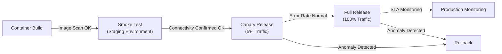

**Smoke Test (Minimum Verification Items):**

```bash
# Basic endpoint connectivity check
curl -f http://localhost:3000/health || exit 1
curl -f http://localhost:3000/api/status || exit 1
echo "Smoke tests passed"
```

#### 11.1.4 Rollback Procedure

Pre-define rollback procedures for deployment failure and record in `project-records/release/rollback-procedure.md`.

**Rollback Procedure Template:**

```markdown
# Rollback Procedure

## Trigger Conditions

- Smoke test failure
- Error rate exceeding 1% for more than 5 minutes
- P99 latency exceeding SLA (e.g., 500ms) for more than 5 minutes

## Procedure

1. Immediate decision (within 5 minutes): Confirm with user (operations owner) whether to rollback
2. Stop canary: Route traffic back to the previous version
3. Status check: Confirm that error rate and latency have returned to normal values
4. Root cause investigation: Check logs and traces to identify the root cause
5. File a defect ticket in project-records/defects/

## Rollback Commands

[Document based on IaC/deployment tool]
```

### 11.2 Observability Design

Define the three pillars of observability (logs, metrics, tracing) during the design phase and implement them during the implementation phase.

#### 11.2.1 Structured Logs

**Logging Design Principles:**

- Format: JSON structured logs (`console.log` is prohibited)
- Levels: 4 levels — DEBUG / INFO / WARN / ERROR
- Required fields: `timestamp`, `level`, `service`, `traceId`, `message`

**Structured Log Example:**

```json
{
  "timestamp": "2026-03-01T12:00:00.000Z",
  "level": "ERROR",
  "service": "auth-service",
  "traceId": "abc123def456",
  "userId": "usr_001",
  "message": "Login failed: invalid credentials",
  "error": {
    "code": "AUTH_INVALID_CREDENTIALS",
    "stack": "..."
  }
}
```

**Prohibition of Logging Sensitive Information:**

- Never include passwords, tokens, or credentials in logs
- Apply masking to personal information (email addresses, etc.)

#### 11.2.2 Metrics (RED Indicators)

Instrument the following RED metrics on all API endpoints.

| Metric | Description | Example |
| --- | --- | --- |
| Rate (Request Rate) | Number of requests per unit time | `http_requests_total` |
| Errors (Error Rate) | Proportion of error responses | `http_errors_total` |
| Duration (Latency) | Distribution of request processing time | `http_request_duration_seconds` |

**OpenTelemetry Instrumentation Example (Node.js):**

```javascript
import { metrics } from "@opentelemetry/api";

const meter = metrics.getMeter("api-service");
const requestCounter = meter.createCounter("http_requests_total");
const requestDuration = meter.createHistogram("http_request_duration_seconds");

// Instrument with middleware
app.use((req, res, next) => {
  const start = Date.now();
  res.on("finish", () => {
    requestCounter.add(1, { method: req.method, status: res.statusCode });
    requestDuration.record((Date.now() - start) / 1000, { method: req.method });
  });
  next();
});
```

#### 11.2.3 Distributed Tracing

```javascript
import { trace } from "@opentelemetry/api";

const tracer = trace.getTracer("auth-service");

async function login(email, password) {
  return tracer.startActiveSpan("auth.login", async (span) => {
    try {
      span.setAttribute("user.email_hash", hashEmail(email));
      const result = await authenticate(email, password);
      span.setStatus({ code: SpanStatusCode.OK });
      return result;
    } catch (error) {
      span.recordException(error);
      span.setStatus({ code: SpanStatusCode.ERROR });
      throw error;
    } finally {
      span.end();
    }
  });
}
```

#### 11.2.4 Alert Design

Design alert rules during the design phase and define them in `docs/observability/observability-design.md`.

**Alert Rule Examples:**

| Alert Name | Condition | Priority | Response |
| --- | --- | --- | --- |
| HighErrorRate | Error rate > 1% (sustained 5 min) | Critical | Immediate investigation, consider rollback |
| HighLatency | P99 > SLA latency (sustained 5 min) | High | Bottleneck investigation |
| LowDiskSpace | Disk usage > 85% | Medium | Verify log rotation |
| AgentTimeout | Agent unresponsive for over 30 min | High | progress-monitor reports to lead agent |

### 11.3 Production Release Checklist

Verify all items below before deployment in the delivery phase.

```markdown
# Production Release Checklist

## Quality Gates

- [ ] Final review (R1-R6): Critical/High zero findings
- [ ] Unit test pass rate 95% or higher
- [ ] Integration test pass rate 100%
- [ ] Code coverage 80% or higher
- [ ] Performance testing: All NFR numerical targets achieved

## Security

- [ ] SAST (CodeQL): Critical/High zero findings
- [ ] SCA (npm audit, etc.): Critical/High zero findings
- [ ] Secret scanning: None detected
- [ ] Container scanning (Trivy, etc.): Critical/High zero findings
- [ ] License report confirmed

## Deployment

- [ ] Container image build successful
- [ ] IaC diff confirmed and user-approved
- [ ] Smoke test (staging) passed
- [ ] Rollback procedure confirmed and documented

## Observability

- [ ] Structured logs output correctly
- [ ] RED metrics instrumented on all APIs
- [ ] Alert rules configured
- [ ] Dashboard operation verified

## Documentation

- [ ] API documentation (openapi.yaml) up to date
- [ ] Final report (final-report.md) created
- [ ] Acceptance testing procedure guide created
- [ ] Release notes created
```

---

# Part 5: Reference Materials

## Chapter 12: Troubleshooting

### 12.1 Common Problems and Solutions

| Problem | Cause | Solution |
| --- | --- | --- |
| Sub-agent behaves unexpectedly | Agent definition description is unclear | Rewrite the description to be more specific |
| File conflicts with Agent Teams | Multiple agents editing the same file | Clearly separate responsible directories in CLAUDE.md |
| Context window overflow | Information overflows in long conversations | Use `/compact` command to summarize conversation, or delegate to sub-agents and receive only results |
| Flaky tests | Async processing or timing dependencies | Review with R4 (concurrency) perspective and add stabilization rules to Test Agent |
| Cost overrun | Excessive use of Opus model, too many parallel Agent Teams | Default to Sonnet and use Opus only for critical decisions |
| Checkpoint recovery failure | Complex Git state | Press `Esc` twice to rewind, or use the `/rewind` command |
| Review does not PASS | Critical/High findings not resolved | Follow the correction suggestions for findings and request re-review |
| Circular wait between agents | Mutually dependent agents simultaneously waiting | Check progress-monitor anomaly detection and force-restart agents from the lead agent |
| Performance test not meeting targets | Bottleneck exists | Identify bottleneck using k6 results and request fixes from the R5 (performance) perspective |
| Container build failure | Dockerfile configuration error | Request correction from architect along with container scan results |

### 12.2 Cost Management Guidelines

Agent Teams consumes tokens independently for each agent. Guidelines for cost optimization:

1. **Model selection**: Default to `sonnet` (cost-effective) and use `opus` only for situations requiring advanced judgment, such as architectural decisions and security/quality reviews
2. **Agent count limits**: Recommend 3-5 simultaneous Agent Teams agents. More than that yields diminishing cost-effectiveness
3. **Context management**: Use `/compact` as needed to compress unnecessary context
4. **Cost tracking**: Record API token consumption in `project-management/progress/cost-log.json` and take action when 80% of the budget is reached

---

## Chapter 13: Best Practices and Considerations

### 13.1 Best Practices

1. **Continuously improve CLAUDE.md**: Append rules and patterns discovered as the project progresses. Reflect results from the retrospective command
2. **Leverage Git**: Claude Code works closely with Git. Commit frequently and develop safely in combination with checkpoints
3. **Strictly follow the branch strategy**: In parallel development with Agent Teams, prevent file conflicts with the combination of feature/ branches and worktrees
4. **Build trust incrementally**: Start by verifying Claude Code's behavior on small tasks, then gradually expand the scope of delegation
5. **Make agent definitions specific**: Ambiguous descriptions cause incorrect agent invocations
6. **Clearly define file boundaries**: In Agent Teams, clearly separate each agent's responsible directory to prevent file conflicts
7. **Plan -> Execute pattern**: The most effective pattern is to plan with `/plan` before using Agent Teams, review, then hand off to the team
8. **Never skip review gates**: Proceeding to the next phase with remaining Critical/High findings increases rework in later stages
9. **Implement observability alongside code**: Retrofitting logs, metrics, and tracing during the implementation phase leads to design errors
10. **Always request confirmation for IaC changes**: Infrastructure changes are difficult to reverse, so always go through user confirmation before execution

### 13.2 Considerations and Constraints

1. **Agent Teams is an experimental feature**: Specifications may change. Conduct thorough testing before production use
2. **Full autonomy is not guaranteed**: Claude Code may occasionally ask for user confirmation. This is a safety design feature; do not assume completely unattended execution
3. **Cost awareness**: Parallel execution of Agent Teams increases token consumption. Pre-estimating costs is recommended
4. **Humans should perform final security verification**: AI-based security reviews are useful, but human security expert final verification is recommended for critical systems
5. **Permission management for external service integrations**: When connecting to external services via MCP, set permissions to the minimum scope
6. **Limitations of system testing**: E2E tests involving UI operations or tests requiring actual infrastructure may be difficult to execute with Claude Code alone. Leveraging Puppeteer MCP or manual verification by the user may be necessary
7. **Careful handling of IaC application**: Always execute infrastructure changes such as `terraform apply` after user confirmation. Exercise particular caution with production database schema changes
8. **Model version changes**: This manual is written for Opus 4.6 / Sonnet 4.6 compatibility, but if the model version changes, check the official documentation for the latest model IDs

---

## Chapter 14: Hands-On Tutorial: Developing a Web App Almost Fully Automatically

### 14.1 Step 1: Project Preparation

```bash
mkdir my-web-app
cd my-web-app
git init
git checkout -b develop
```

### 14.2 Step 2: Create user-order.md

**user-order.md:**

```markdown
# What to Build

## What do you want to build?
A web app for managing team tasks. It should allow creating tasks, assigning team members, setting deadlines, and visualizing progress on a dashboard.

## Why?
Task management within the team is siloed in Excel, and no one knows who is working on what. Progress is not visible.

## Other Preferences
I want to use it on the web. It would be great if it could be checked from a smartphone too. Expected use by about 5-20 people internally.
```

### 14.3 Step 3: Review the CLAUDE.md Proposal

Running `/full-auto-dev` triggers the AI to read user-order.md during the setup phase and propose a CLAUDE.md tailored to the project. It includes the technology stack, coding conventions, security policies, branch strategy, etc. Review the contents and approve.

### 14.4 Step 4: Place Agents and Commands

Place the agent definitions from Chapter 7 in `.claude/agents/` and the commands from Chapter 8 in `.claude/commands/`. In particular, **do not forget to place architect.md** (required for specification Ch3-6 elaboration and OpenAPI specification generation).

### 14.5 Step 5: Start Fully Automated Development

```bash
claude
> /project:full-auto-dev
```

From here, Claude Code automatically executes the following:

1. setup: user-order.md validation -> CLAUDE.md proposal -> Evaluate conditional processes -> Confirm with user
2. planning: Create specification Ch1-2 based on user-order.md + process-rules/spec-template.md -> R1 review -> Request user specification approval
3. dependency-selection: External dependency evaluation and selection (conditional — when HW integration, AI/LLM integration, or framework requirement definition is enabled) -> User approval
4. design: Parallelize specification Ch3-6 elaboration / OpenAPI specification / security design / observability design / WBS -> Design review
5. implementation: Implement code and execute tests in parallel following the Git branch strategy -> Code review -> SCA/secret scanning
6. testing: Ensure quality while monitoring test progress curve and defect curve -> Performance testing -> Test review
7. delivery: Final review -> Container build, deploy, smoke test -> Create final report and request acceptance testing from user

The user is only involved in setup phase confirmation, specification approval, IaC apply approval, and acceptance testing (plus any critical decisions needed along the way).

### 14.6 Step 6: Acceptance Testing

Follow the acceptance testing procedure guide created by Claude Code for final verification. If there are issues, provide correction instructions, and Claude Code will automatically fix them.

---

## Appendix A: Inter-Agent Communication Diagram

**Agent Teams Communication Flow:**

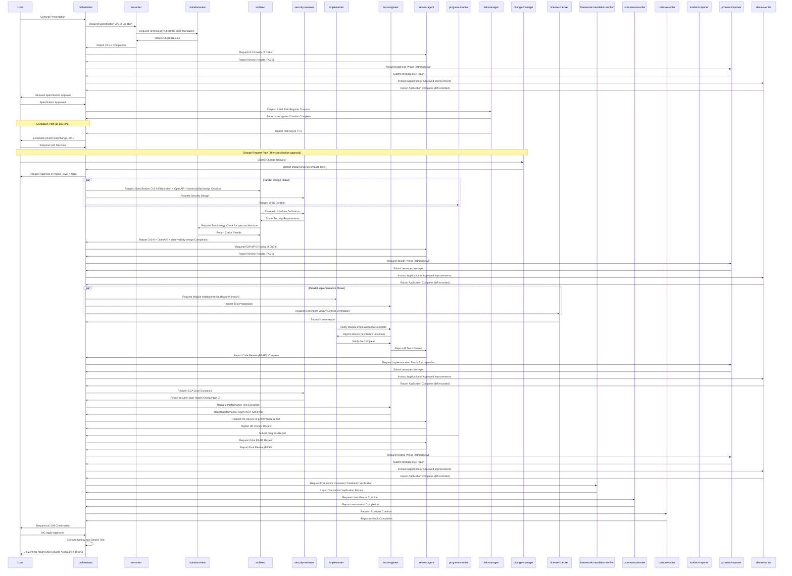

---

## Appendix B: Progress Management Data Schema

**Progress Management JSON Schema Definition (status-schema.json):**

```json
{
  "project_status": {
    "project_name": "string",
    "last_updated": "ISO8601 datetime",
    "current_phase": "setup | planning | dependency-selection | design | implementation | testing | delivery | operation",
    "overall_progress_percent": "number (0-100)",
    "wbs": {
      "total_tasks": "number",
      "completed_tasks": "number",
      "in_progress_tasks": "number",
      "blocked_tasks": "number"
    },
    "test_metrics": {
      "total_test_cases": "number",
      "executed": "number",
      "passed": "number",
      "failed": "number",
      "skipped": "number",
      "coverage_percent": "number"
    },
    "performance_metrics": {
      "nfr_total": "number",
      "nfr_passed": "number",
      "p95_latency_ms": "number",
      "error_rate_percent": "number"
    },
    "defect_metrics": {
      "total_found": "number",
      "total_fixed": "number",
      "open_critical": "number",
      "open_high": "number",
      "open_medium": "number",
      "open_low": "number"
    },
    "review_metrics": {
      "critical_open": "number",
      "high_open": "number",
      "medium_open": "number",
      "low_open": "number"
    },
    "security_metrics": {
      "sast_critical": "number",
      "sast_high": "number",
      "sca_critical": "number",
      "sca_high": "number"
    },
    "cost_metrics": {
      "budget_usd": "number",
      "spent_usd": "number",
      "percent_used": "number"
    },
    "risk_items": [
      {
        "id": "string",
        "description": "string",
        "severity": "critical | high | medium | low",
        "mitigation": "string"
      }
    ],
    "next_actions": ["string"]
  }
}
```

The PM Agent updates `project-management/progress/progress-report.json` according to this schema. The lead agent references this data to understand overall progress.

---

## Appendix C: Quick Reference

### Key Commands

| Command | Usage |
| --- | --- |
| `claude` | Launch Claude Code in interactive mode |
| `claude -p "instruction"` | Single headless mode execution |
| `claude --worktree` | Launch in an independent Git Worktree |
| `claude --agent agent-name` | Launch as a specified agent |
| `claude --resume` | Resume previous session |
| `/plan` | Switch to planning mode |
| `/compact` | Compress conversation context |
| `/rewind` | Rewind to checkpoint |
| `/model` | Switch the model in use |
| `/init` | Execute initial project analysis |
| `/project:full-auto-dev` | Start nearly fully automated development (setup to delivery) |
| `/project:check-progress` | Check and report development progress |
| `/project:retrospective` | Retrospective and recurrence prevention (Recommended) |

### Custom Agent List

| Agent Name | Role | Model | Category |
| --- | --- | --- | --- |
| `orchestrator` | Overall project orchestration, phase transition control, decision recording | opus | Core |
| `srs-writer` | Specification Ch1-2 (Foundation & Requirements) creation | opus | Core |
| `architect` | Specification Ch3-6 elaboration, OpenAPI specification, migration design | opus | Core |
| `security-reviewer` | Security design, vulnerability review, SCA | opus | Core |
| `implementer` | Source code implementation, unit test creation | opus | Core |
| `test-engineer` | Test creation and execution, performance testing, coverage measurement | sonnet | Core |
| `review-agent` | Review from SW engineering principles, concurrency, performance perspectives (R1-R6) | opus | Core |
| `progress-monitor` | Progress management, WBS, quality metrics, cost tracking, agent monitoring | sonnet | Core |
| `change-manager` | Change request receipt, impact analysis, recording | sonnet | Process Management |
| `risk-manager` | Risk identification, evaluation, mitigation management | sonnet | Process Management |
| `license-checker` | OSS license compatibility verification | haiku | Process Management |
| `kotodama-kun` | Terminology and naming consistency checking | haiku | Quality Assurance |
| `framework-translation-verifier` | Multi-language translation consistency verification of framework documents | sonnet | Quality Assurance |
| `user-manual-writer` | User manual creation | sonnet | Deliverables |
| `runbook-writer` | Runbook creation | sonnet | Deliverables |
| `incident-reporter` | Incident report creation | sonnet | Operations |
| `process-improver` | Retrospective, root cause analysis, process improvement proposals | sonnet | Improvement |
| `decree-writer` | Safe application of approved improvements to governance files | sonnet | Improvement |

### Environment Variables

| Variable | Description |
| --- | --- |
| `CLAUDE_CODE_EXPERIMENTAL_AGENT_TEAMS=1` | Enable Agent Teams |
| `ANTHROPIC_API_KEY` | API Key (for CI/CD) |

### Official Resources

| Resource | URL |
| --- | --- |
| Claude Code Documentation | https://code.claude.com/docs/en/overview |
| Claude Code GitHub | https://github.com/anthropics/claude-code |
| MCP Server List | https://github.com/modelcontextprotocol/servers |
| Claude API Documentation | https://docs.claude.com |

---

> **Disclaimer:** This manual was created based on publicly available information about Claude Code as of February 2026. Since it includes experimental features such as Agent Teams, refer to the latest official documentation for actual behavior. Additionally, AI-driven automated development does not completely replace human final verification; human expert verification is recommended, especially for security and mission-critical systems. IaC (infrastructure changes) must always be applied after user approval.
