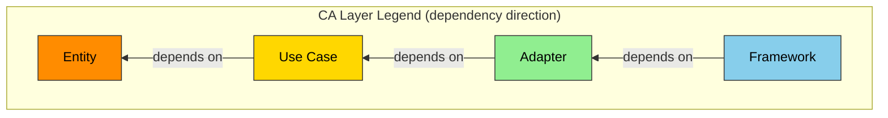

# ANMS v0.33 — AI-Native Minimal Spec Template

## Design Principle: STFB (Stable Top, Flexible Bottom)

A chapter structure inspired by Robert C. Martin's Stable Dependencies Principle (SDP). Upper chapters are rigid (stable, low change frequency); lower chapters are flexible (concrete, high change frequency). Changes to upper chapters require reviewing lower chapters, but changes to lower chapters do not affect upper chapters.

```
  Chapter 1  Foundation       ← Rigid: Most stable / Most abstract
  Chapter 2  Requirements
  Chapter 3  Architecture
  Chapter 4  Specification    ← Flexible: Most volatile / Most concrete
```

This template is designed as Level 1 (ANMS) of the three-level specification hierarchy (ANMS / ANPS / ANGS). For scales that fit in a single context window, use it as a single file. For larger scales, use ANPS (AI-Native Plural Spec) by splitting into chapter-level files:

- **spec-foundation** (Ch1-2: Foundation & Requirements) — Owner: srs-writer
- **spec-architecture** (Ch3-6: Architecture, Specification, Test Strategy, Design Principles) — Owner: architect

Under ANPS, each file carries a Common Block + Form Block (per the document management rules). The STFB structure is maintained even when files are split.

**Three responsibilities led by humans:**

Even in full-auto-dev, the following three responsibilities are led by humans (see process rules §1.1):

1. **Presenting the concept** (input to Ch1 Foundation) — What to build and why it is needed
2. **Critical decision-making** (judgment for Ch3 Architecture Decisions) — Technology selection, architectural direction
3. **Acceptance testing** (Result judgment for Ch4 Specification) — Whether the deliverable meets business requirements

---

## Chapter Structure

| #   | Chapter                          | Primary Notation                    | Stability                |
| --- | -------------------------------- | ----------------------------------- | ------------------------ |
| 1   | **Foundation**                   | Natural language + Tables           | Most stable              |
| 2   | **Requirements**                 | EARS + Formulas + Tables + Diagrams | Stable                   |
| 3   | **Architecture**                 | Mermaid + Tables                    | Moderately stable        |
| 4   | **Specification**                | Gherkin + Tables + Code blocks      | Frequently changes       |
| 5   | **Test Strategy**                | Tables                              | Frequently changes       |
| 6   | **Design Principles Compliance** | Tables                              | Variable (updated at review) |
| A   | **Appendix**                     | Free-form                           | —                        |

---

## Section Structure

### Chapter 1. Foundation

The project's "North Star." The prerequisite for all subsequent chapters. The most stable, least changeable layer.

| Section | Name        | Content                                          |
| ------- | ----------- | ------------------------------------------------ |
| 1.1     | Background  | Why this software is needed. Current state of the domain |
| 1.2     | Issues      | Specific problems in the current state           |
| 1.3     | Goals       | Definition of success. The desired end state     |
| 1.4     | Approach    | Technology stack, architectural direction         |
| 1.5     | Scope       | What is in-scope and what is out-of-scope for this project |
| 1.6     | Constraints | Absolute constraints the project cannot violate (technical, legal, ethical, patent, etc.) |
| 1.7     | Limitations | Known compromises that do not fully satisfy requirements but are acceptable |
| 1.8     | Glossary    | Project-specific term definitions. Aligns vocabulary between AI and humans |
| 1.9     | Notation    | RFC 2119/8174 compliant. Key keyword examples: SHALL/MUST = mandatory, SHOULD = recommended, MAY = optional. EARS `shall` is synonymous with SHALL |

### Chapter 2. Requirements

Requirements the system must satisfy. Described in the format best suited to each requirement: EARS syntax, formulas, tables, diagrams, etc.

| Section | Name                        | Content                                  |
| ------- | --------------------------- | ---------------------------------------- |
| 2.1     | Functional Requirements     | Requirements for system-provided features |
| 2.2     | Non-Functional Requirements | Performance, security, availability, etc. |

EARS Syntax Patterns:

| Pattern           | Syntax                                                                   | Use Case                       |
| ----------------- | ------------------------------------------------------------------------ | ------------------------------ |
| Ubiquitous        | The [System] shall [Response].                                           | Requirements that always hold  |
| Event-driven      | **When** [Trigger], the [System] shall [Response].                       | Event-triggered requirements   |
| State-driven      | **While** [In State], the [System] shall [Response].                     | State-dependent requirements   |
| Unwanted Behavior | **If** [Trigger], then the [System] shall [Response].                    | Exception / error handling     |
| Optional Feature  | **Where** [Feature is included], the [System] shall [Response].          | Optional / conditional features|
| Complex           | **When** [Trigger], **while** [In State], the [System] shall [Response]. | Compound-condition requirements|

Note: `shall` in EARS syntax is synonymous with `SHALL` as defined in Chapter 1.9 Notation.

### Chapter 3. Architecture

Software structure and design decisions. Defines the technical structure to realize Chapter 2 requirements.

| Section | Name                 | Content                                                                |
| ------- | -------------------- | ---------------------------------------------------------------------- |
| 3.1     | Architecture Concept | Type of architecture adopted (CA, Hexagonal, Layered, etc.) and legend definition |
| 3.2     | Components           | Partitioning of parts and responsibilities. Component diagram (color-coded per 3.1 legend) |
| 3.3     | File Structure       | Directory structure. Mapping between components and folders            |
| 3.4     | Domain Model         | Definition of structure, relationships, and state. Class diagram (color-coded per 3.1 legend), ER diagram, state transition diagram |
| 3.5     | Behavior             | Process flows and interactions. Sequence diagrams, activity diagrams   |
| 3.6     | Decisions            | ADR (Architecture Decision Records). Rationale, alternatives, decision-maker. Michael Nygard's ADR format (Status / Context / Decision / Consequences) is recommended |

Component and class diagrams MUST be color-coded by architecture layer. The default uses Clean Architecture's 4 layers (see legend below). If adopting a different architecture, define a custom legend in Section 3.1.

**Default Legend: Clean Architecture Layers (shared by component and class diagrams):**



| CA Layer  | Role                           | Color  | Hex       |
| --------- | ------------------------------ | ------ | --------- |
| Entity    | Domain data and core logic     | Orange | `#FF8C00` |
| Use Case  | Business logic orchestration   | Gold   | `#FFD700` |
| Adapter   | External interface adaptation  | Green  | `#90EE90` |
| Framework | UI, devices, external services | Blue   | `#87CEEB` |

### Chapter 4. Specification

The concrete, frequently changing layer. Definitions at a level that AI can directly translate into code.

Section 4.1 Scenarios (Gherkin) is a fixed section. Sections 4.2 onward are selected based on the project's nature.

#### 4.1 Scenarios

UAT (User Acceptance Testing) acceptance criteria in Gherkin format. Concretizes Chapter 2 requirements into verifiable scenarios. Test results are recorded directly below each scenario. To ensure traceability, annotate each Scenario line with the corresponding requirement ID in `(traces: FR-xxx)` format.

Result Status Definitions (delete non-applicable statuses before use):

| Status      | Meaning                                              |
| ----------- | ---------------------------------------------------- |
| PASS        | Acceptance criteria satisfied                        |
| CONDITIONAL | Basically OK but conditional. Note improvements in Remark |
| FAIL        | Acceptance criteria not satisfied. Fix required      |
| SKIP        | Not tested / not applicable. Note reason in Remark   |

Gherkin Template:

````
```gherkin
Feature: [Feature Name]

  Background:
    Given [Common precondition for all scenarios]

  Rule: [Business Rule Name]

    Scenario: SC-001 [Scenario Name] (traces: FR-xxx)
      Given [Precondition]
      And [Additional precondition]
      When [Action / Event]
      Then [Expected result]
      And [Additional expected result]
      But [What must not happen]
```

**Result:** PASS  CONDITIONAL  FAIL  SKIP
**Remark:**

---

```gherkin
Scenario: SC-002 [Scenario Name] (traces: FR-xxx)
  Given [Precondition]
  When [Action / Event]
  Then [Expected result]
```

**Result:** PASS  CONDITIONAL  FAIL  SKIP
**Remark:**
````

#### Section Candidates for 4.2 Onward

Select based on the project's nature:

| Candidate | Name             | Applicable When                        |
| --------- | ---------------- | -------------------------------------- |
| 4.x       | UI Elements Map  | Apps with UI                           |
| 4.x       | Configuration    | Apps with configuration objects        |
| 4.x       | API Definition   | Apps that provide or consume APIs      |
| 4.x       | Data Schema      | Apps that use databases                |
| 4.x       | State Management | Apps with complex state transitions    |
| 4.x       | Algorithm        | Mathematical, cryptographic, or computational logic |
| 4.x       | Error Handling   | Apps requiring systematic error definitions |

### Chapter 5. Test Strategy

Test-level policies. Detailed test case design is delegated to AI; this chapter defines "what to test at which level."

Test Matrix (template example; add/remove rows as needed for your project):

| Test Level       | Target                  | Policy                                   | Tool / Framework   | Pass Criteria       |
| ---------------- | ----------------------- | ---------------------------------------- | ------------------ | ------------------- |
| Unit Test        | All business logic      | AI auto-generates. Coverage target: [X]% | [e.g., Vitest]     | Pass rate [X]%+     |
| Integration Test | [List integration points]| [Policy]                                | [e.g., Vitest]     | Pass rate 100%      |
| Performance Test | [Target APIs/processes] | Based on Ch2 NFR numerical targets       | [e.g., k6]         | [Target values]     |
| E2E Test         | [Major user flows]      | Corresponds to Ch4.1 Gherkin scenarios   | [e.g., Playwright] | All scenarios PASS  |

### Chapter 6. Design Principles Compliance

Verifies that architecture and implementation comply with software design principles. A quality assurance layer at a different meta-level from the "define, design, verify" cycle of Ch1-5.

Add or remove principles based on the project's nature.

| Category          | Identifier           | Full Name                             | Review Perspective                                                          |
| ----------------- | -------------------- | ------------------------------------- | --------------------------------------------------------------------------- |
| Naming            | Naming               | —                                     | Do names convey intent? Are they consistent with domain vocabulary (Ch1.8)? |
| Dependencies      | Dependency Direction | —                                     | Does the dependency direction follow the architecture layers defined in Ch3.1? |
| Dependencies      | SDP                  | Stable Dependencies Principle         | Does the dependency target a module that is more stable (lower change frequency) than itself? |
| Simplicity        | KISS                 | Keep It Simple, Stupid                | Is the simplest working solution chosen?                                    |
| Simplicity        | YAGNI                | You Aren't Gonna Need It             | Are unnecessary features being built? Is there over-engineering?            |
| Simplicity        | DRY                  | Don't Repeat Yourself                 | Is there duplication in code, logic, or definitions?                        |
| Separation        | SoC                  | Separation of Concerns                | Are concerns properly separated?                                            |
| Separation        | SRP                  | Single Responsibility Principle       | Does each class/module have a single responsibility?                        |
| Separation        | SLAP                 | Single Level of Abstraction Principle | Is the abstraction level within functions consistent?                       |
| SOLID             | OCP                  | Open-Closed Principle                 | Is it open for extension, closed for modification?                          |
| SOLID             | LSP                  | Liskov Substitution Principle         | Can parent classes be replaced by child classes correctly?                  |
| SOLID             | ISP                  | Interface Segregation Principle       | Are interfaces properly segregated?                                         |
| SOLID             | DIP                  | Dependency Inversion Principle        | Are dependencies on abstractions, not concretions?                          |
| Coupling          | LoD                  | Law of Demeter                        | Does the code avoid reaching into internal structures? (Use only direct collaborators) |
| Coupling          | CQS                  | Command-Query Separation              | Are commands and queries separated?                                         |
| Readability       | POLA                 | Principle of Least Astonishment       | Does the code behave as the reader expects?                                 |
| Readability       | PIE                  | Program Intently and Expressively     | Does the code clearly convey its intent?                                    |
| Testability       | Testability          | —                                     | Is unit testing easy? Can mocks/stubs be injected readily?                  |
| Purity            | Pure/Impure          | —                                     | Are pure functions and side-effect-producing functions separated?            |
| State Transitions | State Transition     | —                                     | Are transition condition retrieval and transition execution separated?       |
| Concurrency       | Concurrency Safety   | —                                     | Are deadlocks, race conditions, and glitches prevented?                     |
| Error Handling    | Error Propagation    | —                                     | Are errors propagated and handled properly, not silently swallowed?          |
| Resource Mgmt     | Resource Lifecycle   | —                                     | Are resource acquisition and release (connections, files, memory) paired?    |
| Immutability      | Immutability         | —                                     | Are values that need not change immutable?                                   |
| Efficiency        | Resource Efficiency  | —                                     | Are CPU load, memory usage, and storage wear within acceptable limits?       |

### Appendix

| Section | Name       | Content                                  |
| ------- | ---------- | ---------------------------------------- |
| A.1     | References | Links to standards and external resources|
| A.2     | Licenses   | License information for dependencies     |
| A.3     | Changelog  | Version history of this document         |
| A.x     | (Other)    | Project-specific supplementary materials |

---

> The "Design Rationale" and "References" below are the design rationale and references for this template itself. They may be removed when creating a project specification.

## Design Rationale

| Decision                                  | Rationale                                                                                      |
| ----------------------------------------- | ---------------------------------------------------------------------------------------------- |
| STFB (SDP applied)                        | Chapter order follows the Stable Dependencies Principle. Upper = stable/abstract, lower = volatile/concrete |
| SRS/SWS unified into a single document    | To fit all information within AI's context window. Reference fragmentation is a breeding ground for hallucination |
| EARS 5 patterns + Complex                 | When/While/If/Where + Ubiquitous + compound pattern. All patterns covered                      |
| EARS + formula hybrid                     | EARS alone cannot express mathematical specifications. Use each as appropriate to the domain   |
| Mermaid layer color-coding mandatory      | Mermaid has weak layout control. Without color-coding, responsibility boundaries are visually indistinguishable |
| CA as default legend, replaceable         | If adopting non-CA (Hexagonal, Layered, etc.), define a custom legend in 3.1                   |
| Default colors from grsmd_gen2_spec       | Entity (orange #FF8C00), UseCase (gold #FFD700), Adapter (green #90EE90), Framework (blue #87CEEB) |
| Architecture Concept added as 3.1         | The starting point for color-coding is the architecture concept selection. Structures the flow: selection -> design -> color-coded visualization |
| File Structure independent in Ch3.3       | Folder structure change = architecture change. An important section that makes the component-to-folder mapping explicit |
| ADR placed within Architecture chapter    | Keeps design and rationale readable together. Relegating to appendix risks broken references   |
| Gherkin fixed in Ch4.1                    | Gherkin is UAT acceptance criteria = specification concretization. Less stable than EARS -> placed in lower chapter per SDP |
| All Gherkin keywords covered              | Feature, Background, Rule, Scenario, Given/And/When/Then/And/But. Template presents all constructs |
| Result/Remark directly below scenarios    | Scenario and result are adjacent. Easy for AI to fill, easy for humans to review               |
| Requirement ID trace annotation           | `(traces: FR-xxx)` format links requirement IDs, ensuring traceability                        |
| Result 4-choice PASS/CONDITIONAL/FAIL/SKIP| Explicit conditional pass. Non-applicable statuses are deleted. Space-delimited to avoid delimiter conflicts |
| Specification chapter uses candidate sections | For applicability across all software development. Select per domain                        |
| Test Strategy independent in Ch5          | Test case details are delegated to AI. Only policy and matrix are defined here                 |
| Design Principles Compliance independent in Ch6 | A quality assurance layer at a different meta-level from Ch1-5's "define, design, verify" |
| Ch6 principles organized by category      | Naming -> Dependencies -> Simplicity -> Separation -> SOLID -> Coupling -> Readability. Naming and dependency direction placed first. Full name column provided to supplement abbreviations |
| SDP added to Ch6                          | The foundational principle behind STFB. Should also be verified at the code level. Distinct from Dependency Direction (direction vs stability) |
| Limitations added                         | Makes explicit the "compromises" between Scope (won't do) and Constraints (can't break)       |
| Glossary added                            | Vocabulary synchronization with AI. Effectiveness proven in grsmd_gen2_spec                   |
| Notation placed in Ch1.9                  | Notation conventions applying to the entire document belong in the Foundation layer. RFC 2119/8174 compliant. Relationship with EARS `shall` made explicit |

---

## References

1. Martin, R.C. "[The Clean Architecture](https://blog.cleancoder.com/uncle-bob/2012/08/13/the-clean-architecture.html)" — Stable Dependencies Principle (SDP), Stable Abstractions Principle (SAP)
2. Mavin, A., et al. "[EARS: Easy Approach to Requirements Syntax](https://ieeexplore.ieee.org/document/5328509)" — IEEE, 2009
3. Cucumber. "[Gherkin Reference](https://cucumber.io/docs/gherkin/reference/)"
4. Starke, G. "[arc42 Architecture Template](https://arc42.org/)"
5. ISO/IEC/IEEE. "[29148:2018 — Requirements Engineering](https://www.iso.org/standard/72089.html)"
6. Bradner, S. "[RFC 2119 — Key words for use in RFCs to Indicate Requirement Levels](https://datatracker.ietf.org/doc/html/rfc2119)" — IETF, 1997
7. Leiba, B. "[RFC 8174 — Ambiguity of Uppercase vs Lowercase in RFC 2119 Key Words](https://datatracker.ietf.org/doc/html/rfc8174)" — IETF, 2017
8. Nygard, M. "[Documenting Architecture Decisions](https://cognitect.com/blog/2011/11/15/documenting-architecture-decisions)" — ADR format reference
