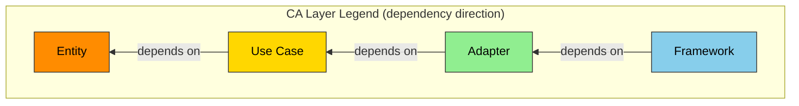

# ANMS v0.33 — AI-Native Minimal Spec Template

## 仕様書の設計原則: STFB (Stable Top, Flexible Bottom) — 上剛下柔

Robert C. Martin の安定依存の原則 (Stable Dependencies Principle) に着想を得た章構成。上位の章は剛（安定し変更頻度が低い）、下位の章は柔（具体的で変更頻度が高い）。上位章が変わると下位章の見直しが必要になるが、下位章の変更は上位章に影響しない。

```
  Chapter 1  Foundation       ← 剛: 最も安定 / 最も抽象的
  Chapter 2  Requirements
  Chapter 3  Architecture
  Chapter 4  Specification    ← 柔: 最も可変 / 最も具体的
```

本テンプレートは三段階仕様体系（ANMS / ANPS / ANGS）の第1段階（ANMS）として設計されている。1コンテキストウィンドウに収まる規模では単一ファイルとして使用する。収まらない場合はANPS（AI-Native Plural Spec）としてチャプター単位でファイルを分割する:

- **spec-foundation**（Ch1-2: Foundation・Requirements）— オーナー: srs-writer
- **spec-architecture**（Ch3-6: Architecture・Specification・Test Strategy・Design Principles）— オーナー: architect

ANPSでは各ファイルにCommon Block + Form Blockを付与する（文書管理規則に従う）。STFB構造はファイルが分かれても維持される。

**人間が主導する3つの責務:**

全自動開発においても、以下の3つは人間が主導する（プロセス規則 §1.1 参照）:

1. **コンセプトの提示**（Ch1 Foundation の入力）— 何を作りたいか、なぜ必要か
2. **重要な意思決定**（Ch3 Architecture Decisions の判断）— 技術選定、アーキテクチャ方針
3. **受入テスト**（Ch4 Specification の Result 判定）— 完成物がビジネス要求を満たすか

---

## Chapter Structure

| #   | English                          | 日本語              | 主な記法                            | 安定度                   |
| --- | -------------------------------- | ------------------- | ----------------------------------- | ------------------------ |
| 1   | **Foundation**                   | 基本事項            | 自然言語 + テーブル                 | 最も安定                 |
| 2   | **Requirements**                 | 要求                | EARS + 数式 + テーブル + 図         | 安定                     |
| 3   | **Architecture**                 | アーキテクチャ      | Mermaid + テーブル                  | やや安定                 |
| 4   | **Specification**                | 仕様                | Gherkin + テーブル + コードブロック | よく変わる               |
| 5   | **Test Strategy**                | テスト戦略          | テーブル                            | よく変わる               |
| 6   | **Design Principles Compliance** | SW設計原則 準拠確認 | テーブル                            | 可変（レビュー時に更新） |
| A   | **Appendix**                     | 付録                | 自由形式                            | —                        |

---

## Section Structure

### Chapter 1. Foundation (基本事項)

プロジェクトの「北極星」。すべての後続章の前提となる。最も安定し、最も変わりにくい層。

| Section | English     | 日本語   | 記述内容                                   |
| ------- | ----------- | -------- | ------------------------------------------ |
| 1.1     | Background  | 背景     | なぜこのSWが必要か。ドメインの現状         |
| 1.2     | Issues      | 課題     | 現状の具体的な問題点                       |
| 1.3     | Goals       | 目標     | 成功の定義。達成すべき状態                 |
| 1.4     | Approach    | 解決方針 | 技術スタック、アーキテクチャ方針           |
| 1.5     | Scope       | 範囲     | 本プロジェクトでやること (In-scope) とやらないこと (Out-of-scope) |
| 1.6     | Constraints | 制約事項 | プロジェクトが絶対に破れない制約（技術・法規・倫理・特許等） |
| 1.7     | Limitations | 制限事項 | 要求を完全には満たさないが許容可能な既知の妥協点 |
| 1.8     | Glossary    | 用語集   | プロジェクト固有の用語定義。AIと人間で用語の解釈を揃える |
| 1.9     | Notation    | 表記規約 | RFC 2119/8174 準拠。主要キーワード例: SHALL/MUST=必須, SHOULD=推奨, MAY=任意。EARS の `shall` は SHALL と同義 |

### Chapter 2. Requirements (要求)

システムが満たすべき要求。EARS構文・数式・テーブル・図など、要求に適した形式で記述する。

| Section | English                     | 日本語     | 記述内容                           |
| ------- | --------------------------- | ---------- | ---------------------------------- |
| 2.1     | Functional Requirements     | 機能要求   | システムが提供する機能の要求       |
| 2.2     | Non-Functional Requirements | 非機能要求 | 性能、セキュリティ、可用性等の要求 |

EARS構文パターン:

| パターン          | 構文                                                                          | 用途                         |
| ----------------- | ----------------------------------------------------------------------------- | ---------------------------- |
| Ubiquitous        | The [System] shall [Response].                                                | 常に成り立つ要求             |
| Event-driven      | **When** [Trigger], the [System] shall [Response].                            | イベント起点の要求           |
| State-driven      | **While** [In State], the [System] shall [Response].                          | 状態依存の要求               |
| Unwanted Behavior | **If** [Trigger], then the [System] shall [Response].                         | 異常系・例外処理             |
| Optional Feature  | **Where** [Feature is included], the [System] shall [Response].               | オプション機能・条件付き機能 |
| Complex           | **When** [Trigger], **while** [In State], the [System] shall [Response].      | 複合条件の要求               |

※ EARS 構文中の `shall` は Chapter 1.9 Notation に定義する `SHALL` と同義。

### Chapter 3. Architecture (アーキテクチャ)

SWの構造と設計判断。Chapter 2 の要求を実現するための技術的な構造を定義する。

| Section | English              | 日本語               | 記述内容                                                                 |
| ------- | -------------------- | -------------------- | ------------------------------------------------------------------------ |
| 3.1     | Architecture Concept | アーキテクチャ方式   | 採用するアーキテクチャの種類（CA, Hexagonal, Layered等）と凡例の定義     |
| 3.2     | Components           | コンポーネント       | 部品と責務の分割。コンポーネント図（3.1の凡例で色分け）。AI/LLM連携がある場合はプロンプトテンプレートの配置（`src/prompts/` 等）・入出力スキーマ・テスト方針・ハルシネーション対策も定義する |
| 3.3     | File Structure       | ファイル構成         | ディレクトリ構成。コンポーネントとフォルダの対応                         |
| 3.4     | Domain Model         | ドメインモデル       | 構造・関係・状態の定義。クラス図（3.1の凡例で色分け）、ER図、状態遷移図 |
| 3.5     | Behavior             | 振る舞い             | 処理フロー・相互作用。シーケンス図、アクティビティ図                     |
| 3.6     | Decisions            | 設計判断             | ADR（Architecture Decision Records）。判断理由・代替案・決定者。記録形式は Michael Nygard の ADR フォーマット（Status / Context / Decision / Consequences）を推奨 |

コンポーネント図・クラス図にはアーキテクチャレイヤーに基づく色分けを必須とする。デフォルトはClean Architectureの4層（下記凡例）を使用する。他のアーキテクチャを採用する場合は、そのアーキテクチャに応じた凡例を3.1に定義すること。

**デフォルト凡例: Clean Architecture レイヤー (コンポーネント図・クラス図 共通):**



| CAレイヤー | 役割                         | 色       | Hex       |
| ---------- | ---------------------------- | -------- | --------- |
| Entity     | ドメインデータ・コアロジック | 橙       | `#FF8C00` |
| Use Case   | ビジネスロジック調整         | ゴールド | `#FFD700` |
| Adapter    | 外部IF適合                   | 緑       | `#90EE90` |
| Framework  | UI・デバイス・外部サービス   | 青       | `#87CEEB` |

### Chapter 4. Specification (仕様)

具体的で、よく変わる層。AIがコードに直接変換できるレベルの定義。

4.1 は Scenarios (Gherkin) を固定配置し、4.2以降はプロジェクトの性質に応じて取捨選択する。

#### 4.1 Scenarios (シナリオ)

Gherkin形式による UAT (User Acceptance Testing) の受入基準。Chapter 2 の要求を検証可能なシナリオとして具体化する。各シナリオの直下にテスト結果を記録する。トレーサビリティ確保のため、各シナリオの Scenario 行に対応する要求IDを `(traces: FR-xxx)` 形式で付記する。

Result ステータス定義（非該当を削除して使用する）:

| ステータス    | 意味                                   |
| ------------- | -------------------------------------- |
| PASS          | 受入基準を満たす                       |
| CONDITIONAL   | 基本OKだが条件付き。Remarkに改善点記載 |
| FAIL          | 受入基準を満たさない。修正必須         |
| SKIP          | 未テスト・非該当。Remarkに理由記載     |

Gherkinテンプレート:

````
```gherkin
Feature: [機能名]

  Background:
    Given [全シナリオ共通の前提条件]

  Rule: [ビジネスルール名]

    Scenario: SC-001 [シナリオ名] (traces: FR-xxx)
      Given [前提条件]
      And [追加の前提条件]
      When [操作・イベント]
      Then [期待結果]
      And [追加の期待結果]
      But [起きてはならないこと]
```

**Result:** PASS  CONDITIONAL  FAIL  SKIP
**Remark:**

---

```gherkin
Scenario: SC-002 [シナリオ名] (traces: FR-xxx)
  Given [前提条件]
  When [操作・イベント]
  Then [期待結果]
```

**Result:** PASS  CONDITIONAL  FAIL  SKIP
**Remark:**
````

#### 4.2以降のセクション候補

プロジェクトに応じて取捨選択する:

| Section候補 | English          | 日本語         | 適用場面                       |
| ----------- | ---------------- | -------------- | ------------------------------ |
| 4.x         | UI Elements Map  | UI要素マップ   | UIを持つアプリ                 |
| 4.x         | Configuration    | 設定定義       | 設定オブジェクトを持つアプリ   |
| 4.x         | API Definition   | API定義        | APIを提供・利用するアプリ      |
| 4.x         | Data Schema      | データスキーマ | DB を使用するアプリ            |
| 4.x         | State Management | 状態管理       | 複雑な状態遷移を持つアプリ     |
| 4.x         | Algorithm        | アルゴリズム   | 数理・暗号等の演算ロジック     |
| 4.x         | Error Handling   | エラー処理     | エラー体系の定義が必要なアプリ |

### Chapter 5. Test Strategy (テスト戦略)

テストレベル別の方針。個別テストケースの詳細はAIに委任し、ここでは「何をどのレベルでテストするか」を定義する。

テストマトリクス（テンプレート例。プロジェクトに応じて行を追加・削除する）:

| テストレベル | 対象                 | 方針                               | ツール/フレームワーク | 合格基準         |
| ------------ | -------------------- | ---------------------------------- | --------------------- | ---------------- |
| 単体テスト   | 全ビジネスロジック   | AIが自動生成。カバレッジ目標: [X]% | [例: Vitest]          | 合格率 [X]% 以上 |
| 結合テスト   | [結合ポイント列挙]   | [方針]                             | [例: Vitest]          | 合格率 100%      |
| 性能テスト   | [対象API/処理]       | Chapter 2 NFR の数値目標に基づく   | [例: k6]              | [目標値]         |
| E2Eテスト    | [主要ユーザーフロー] | Chapter 4.1 Gherkin シナリオに対応 | [例: Playwright]      | 全シナリオPASS   |

### Chapter 6. Design Principles Compliance (SW設計原則 準拠確認)

アーキテクチャおよび実装がSW設計原則に準拠しているかを確認する。Chapter 1-5 の「定義・設計・検証」とはメタレベルが異なる、品質保証の層。

プロジェクトの性質に応じて確認する原則を追加・削除してよい。

| カテゴリ | 識別名               | 正式名称                              | 確認観点                                                                   |
| -------- | -------------------- | ------------------------------------- | -------------------------------------------------------------------------- |
| 命名     | Naming               | —                                     | 意図が伝わる命名か。ドメイン語彙（Chapter 1.8）と一致するか                |
| 依存関係 | Dependency Direction | —                                     | 依存方向が Chapter 3.1 のアーキレイヤーに従っているか                       |
| 依存関係 | SDP                  | Stable Dependencies Principle         | 依存先が自分より安定（変更頻度が低い）モジュールか                         |
| 簡潔性   | KISS                 | Keep It Simple, Stupid                | 動作する最も単純な解決を選んでいるか                                       |
| 簡潔性   | YAGNI                | You Aren't Gonna Need It             | 今必要でない機能を作っていないか。オーバーエンジニアリングしていないか     |
| 簡潔性   | DRY                  | Don't Repeat Yourself                 | コード・ロジック・定義に重複がないか                                       |
| 責務分離 | SoC                  | Separation of Concerns                | 関心ごとが適切に分離されているか                                           |
| 責務分離 | SRP                  | Single Responsibility Principle       | 各クラス・モジュールが単一の責務を持つか                                   |
| 責務分離 | SLAP                 | Single Level of Abstraction Principle | 関数内の抽象度レベルが統一されているか                                     |
| SOLID    | OCP                  | Open-Closed Principle                 | 拡張に開き修正に閉じているか                                               |
| SOLID    | LSP                  | Liskov Substitution Principle         | 親クラスを子クラスに差し替えても正しく動作するか                           |
| SOLID    | ISP                  | Interface Segregation Principle       | インターフェースが適切に分割されているか                                   |
| SOLID    | DIP                  | Dependency Inversion Principle        | 具象ではなく抽象に依存しているか                                           |
| 結合     | LoD                  | Law of Demeter                        | オブジェクトの内部構造を掘り下げてアクセスしていないか（直接の協調者のみ利用） |
| 結合     | CQS                  | Command-Query Separation              | コマンドとクエリが分離されているか                                         |
| 可読性   | POLA                 | Principle of Least Astonishment       | 読み手が予想する通りに動作するか                                           |
| 可読性   | PIE                  | Program Intently and Expressively     | 意図が明確に伝わるコードか                                                 |
| テスト   | Testability          | —                                     | 単体テストがしやすいか。Mock・スタブを容易に差し込める設計か               |
| 純粋性   | Pure/Impure          | —                                     | 純粋関数と副作用のある関数が分離・整理されているか                         |
| 状態遷移 | State Transition     | —                                     | 状態遷移の条件取得と遷移実行が分離されているか                             |
| 並行性   | Concurrency Safety   | —                                     | デッドロック・競合状態・グリッチが発生しないか                             |
| エラー   | Error Propagation    | —                                     | エラーが握りつぶされず、適切に伝播・処理されているか                       |
| 資源管理 | Resource Lifecycle   | —                                     | リソース（接続・ファイル・メモリ）の取得と解放が対になっているか           |
| 不変性   | Immutability         | —                                     | 変更不要な値が不変（immutable）になっているか                               |
| 資源効率 | Resource Efficiency  | —                                     | CPU負荷・メモリ使用量・ストレージ摩耗等が許容範囲内か                      |

### Appendix (付録)

| Section | English    | 日本語       | 記述内容                       |
| ------- | ---------- | ------------ | ------------------------------ |
| A.1     | References | 参考文献     | 標準規格、外部資料へのリンク   |
| A.2     | Licenses   | ライセンス   | 依存ライブラリのライセンス情報 |
| A.3     | Changelog  | 変更履歴     | 本文書のバージョン履歴         |
| A.x     | (その他)   | (その他)     | プロジェクト固有の補足資料     |

---

> 以下の「Design Rationale」と「References」は本テンプレート自体の設計根拠と参考文献である。プロジェクト仕様書を作成する際は削除してよい。

## Design Rationale (本構成の設計根拠)

| 判断                                    | 根拠                                                                                         |
| --------------------------------------- | -------------------------------------------------------------------------------------------- |
| STFB / 上剛下柔 (SDP適用)               | 章の順序はStable Dependencies Principleに従う。上位=安定・抽象、下位=可変・具体              |
| SRS/SWS統合 → 1文書化                   | AIのコンテキストウィンドウに全情報を入れるため。参照が分断されるとAIの幻覚（hallucination）を誘発しやすい |
| EARS 5パターン + Complex                | When/While/If/Where + Ubiquitous + 複合パターン。全パターンを網羅                            |
| EARS + 数式のハイブリッド               | EARSだけでは数理仕様を表現できない。ドメインに応じて使い分け                                 |
| Mermaid レイヤー色分け必須              | Mermaidはレイアウト制御が弱い。色分けがないと責務の境界が視覚的に判別不能                     |
| CAをデフォルト凡例とし差し替え可        | CA以外(Hexagonal, Layered等)を採用する場合は3.1で独自凡例を定義する                           |
| デフォルト色はgrsmd_gen2_specに準拠     | Entity(橙#FF8C00), UseCase(ゴールド#FFD700), Adapter(緑#90EE90), Framework(青#87CEEB)        |
| Architecture Conceptを3.1に新設         | 色分けの起点はアーキコンセプトの選定。選定→設計→色分け可視化の順序を構造化                    |
| File StructureをCh3.3に独立             | フォルダ構成変更=アーキテクチャ変更。コンポーネントとフォルダの対応を明示する重要セクション  |
| ADRをArchitecture章内に配置             | 設計と根拠をセットで読める。Appendixに追いやると参照が切れる                                 |
| GherkinをCh4.1に固定配置                | GherkinはUATの受入基準=仕様の具体化。EARSより不安定→SDPにより下位章に配置                    |
| Gherkin全キーワード網羅                 | Feature, Background, Rule, Scenario, Given/And/When/Then/And/But。テンプレートで全構文を提示 |
| シナリオ直下にResult/Remark             | シナリオと結果が隣接。AIが埋めやすく人間がレビューしやすい                                   |
| シナリオに要求IDトレース付記            | `(traces: FR-xxx)` 形式で要求IDを紐付け、トレーサビリティを確保する                          |
| Result 4択 PASS/CONDITIONAL/FAIL/SKIP  | 条件付き合格を明示。非該当を削除する運用。スペース区切りでデリミタ競合を回避                  |
| Specification章はセクション候補制       | 全SW開発に適用するため。分野ごとに取捨選択                                                   |
| Test StrategyをCh5に独立                | テストケース詳細はAIに委任。ここでは方針とマトリクスのみ定義                                 |
| Design Principles ComplianceをCh6に独立 | Ch1-5の「定義・設計・検証」とはメタレベルが異なる品質保証の層                                |
| Ch6原則をカテゴリ別に網羅               | Naming→依存→簡潔性→責務分離→SOLID→結合→可読性。命名と依存方向を最優先に配置。正式名称列を併記し、略称だけでは伝わらない原則の意図を補足する |
| SDPをCh6に追加                          | STFBの根幹原則であり、コードレベルでも依存先の安定度を検証すべき。Dependency Directionとは観点が異なる（方向 vs 安定度） |
| Limitations追加                         | Scope(やらない)とConstraints(破れない)の間にある「妥協点」を明示                             |
| Glossary追加                            | AIとの語彙同期。grsmd_gen2_specで有効性を実証済み                                            |
| NotationをCh1.9に配置                   | 文書全体に適用される表記規約はFoundation層に属する。RFC 2119/8174準拠。EARSのshallとの関係を明示 |

---

## References

1. Martin, R.C. "[The Clean Architecture](https://blog.cleancoder.com/uncle-bob/2012/08/13/the-clean-architecture.html)" — Stable Dependencies Principle (SDP), Stable Abstractions Principle (SAP)
2. Mavin, A., et al. "[EARS: Easy Approach to Requirements Syntax](https://ieeexplore.ieee.org/document/5328509)" — IEEE, 2009
3. Cucumber. "[Gherkin Reference](https://cucumber.io/docs/gherkin/reference/)"
4. Starke, G. "[arc42 Architecture Template](https://arc42.org/)"
5. ISO/IEC/IEEE. "[29148:2018 — Requirements Engineering](https://www.iso.org/standard/72089.html)"
6. Bradner, S. "[RFC 2119 — Key words for use in RFCs to Indicate Requirement Levels](https://datatracker.ietf.org/doc/html/rfc2119)" — IETF, 1997
7. Leiba, B. "[RFC 8174 — Ambiguity of Uppercase vs Lowercase in RFC 2119 Key Words](https://datatracker.ietf.org/doc/html/rfc8174)" — IETF, 2017
8. Nygard, M. "[Documenting Architecture Decisions](https://cognitect.com/blog/2011/11/15/documenting-architecture-decisions)" — ADR format reference
