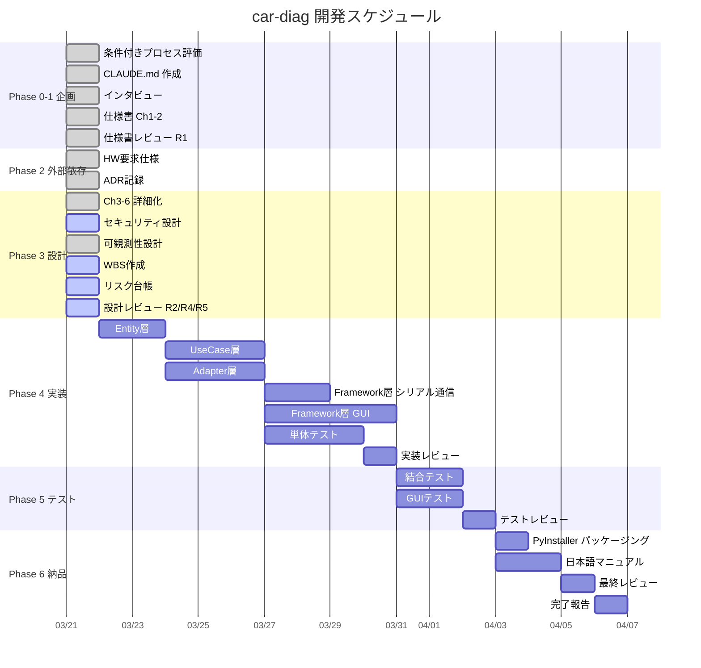

# WBS (Work Breakdown Structure) — car-diag

## ガントチャート概要

## WBS テーブル

| WBS# | タスク | 担当 | 依存 | ステータス |
|------|--------|------|------|-----------|
| 0.1 | 条件付きプロセス評価 | orchestrator | - | 完了 |
| 0.2 | CLAUDE.md 作成 | orchestrator | 0.1 | 完了 |
| 1.1 | インタビュー | srs-writer | 0.2 | 完了 |
| 1.2 | 仕様書 Ch1-2 | srs-writer | 1.1 | 完了 |
| 1.3 | 仕様書レビュー R1 | review-agent | 1.2 | 完了 (PASS) |
| 2.1 | HW 要求仕様 | architect | 1.3 | 完了 |
| 2.2 | ADR 記録 | architect | 2.1 | 完了 |
| 3.1 | Ch3-6 詳細化 | architect | 1.3 | 完了 |
| 3.2 | セキュリティ設計 | security-reviewer | 3.1 | 進行中 |
| 3.3 | 可観測性設計 | architect | 3.1 | 完了 |
| 3.4 | WBS 作成 | progress-monitor | 3.1 | 進行中 |
| 3.5 | リスク台帳 | risk-manager | 3.1 | 進行中 |
| 3.6 | 設計レビュー R2/R4/R5 | review-agent | 3.1 | 進行中 |
| 4.1 | Entity 層実装 | implementer | 3.6 | 未着手 |
| 4.2 | Use Case 層実装 | implementer | 4.1 | 未着手 |
| 4.3 | Adapter 層実装 | implementer | 4.1 | 未着手 |
| 4.4 | Framework 層（シリアル通信） | implementer | 4.3 | 未着手 |
| 4.5 | Framework 層（GUI） | implementer | 4.2 | 未着手 |
| 4.6 | 単体テスト | test-engineer | 4.2 | 未着手 |
| 4.7 | 実装レビュー R2/R3/R4/R5 | review-agent | 4.6 | 未着手 |
| 4.8 | SCA スキャン | security-reviewer | 4.7 | 未着手 |
| 4.9 | ライセンス確認 | license-checker | 4.7 | 未着手 |
| 5.1 | 結合テスト | test-engineer | 4.7 | 未着手 |
| 5.2 | GUI テスト | test-engineer | 4.7 | 未着手 |
| 5.3 | テストレビュー R6 | review-agent | 5.2 | 未着手 |
| 6.1 | PyInstaller パッケージング | implementer | 5.3 | 未着手 |
| 6.2 | 日本語マニュアル | user-manual-writer | 5.3 | 未着手 |
| 6.3 | 最終レビュー R1-R6 | review-agent | 6.2 | 未着手 |
| 6.4 | 完了報告 | orchestrator | 6.3 | 未着手 |
