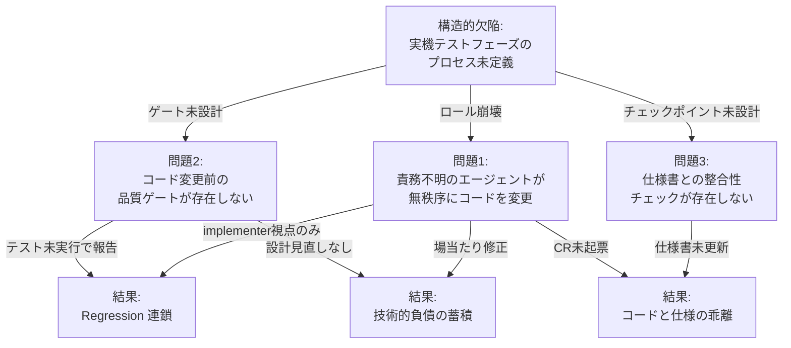
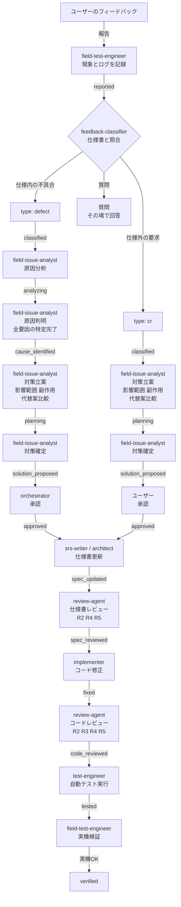
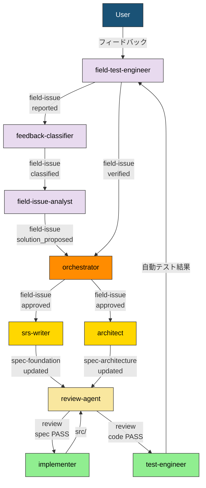

``````markdown
# gr-sw-maker フレームワーク改善提案レポート

## 発行元

- **プロジェクト:** car-diag（ELM327 Bluetooth OBD 診断ツール）
- **発行日:** 2026-03-21
- **発行者:** process-improver
- **根拠:** project-records/improvement/retrospective-20260321.md

---

## 1. 概要

car-diag プロジェクトの実機テストフェーズにおいて、フレームワークのプロセス設計に構造的欠陥が発見された。本レポートは、発見された問題の実績データ、根本原因分析、および gr-sw-maker フレームワーク本体への改善提案をまとめる。

---

## 2. 発見されたプロセス欠陥

### 2.1 実績データ

| メトリクス | 値 |
|-----------|-----|
| 検出 defect 数 | 8（Critical: 3, High: 3, Medium: 1, 未分類: 1） |
| CR 数 | 2（Low: 1, High: 1） |
| Regression 数 | 2（DEF-002 ← DEF-001, DEF-008 ← DEF-007） |
| Regression 率 | 25%（2/8） |
| defect 票の事前作成率 | 0%（全 8 件がユーザー指摘後に作成） |
| CR 票の事前作成率 | 0%（全 2 件がユーザー指摘後に作成） |
| テスト未実行で報告した回数 | 2 回 |
| 仕様書とコードの乖離件数 | 3 件 |

### 2.2 根本原因

**構造的欠陥: 実機テストフェーズがプロセス設計の想定外だった。**

プロセス規則は Phase 4（実装）と Phase 5（テスト）を分離しているが、「ユーザーと一緒に実機でデバッグする」フェーズは定義されていなかった。その結果:

1. **オーナーエージェント未定義** — ロール宣言なしの単一エージェントが全作業を処理した
2. **コード変更前のゲート未定義** — 分類・記録・テストが全て省略された
3. **仕様書整合性チェック未定義** — コード変更が仕様書に反映されなかった

**因果関係図:**



### 2.3 Why-Why 分析の要約

| 問題 | 根本原因 |
|------|---------|
| テスト未実行 | エラー報告を受けた瞬間に implementer ロールに固定され、test-engineer の視点が消失。コード変更前に自己割込みする仕組みがない |
| CR 未起票 | ユーザー発言を「作業指示」としてのみ解釈し「変更要求」として解釈しなかった。受信時に分類するフィルタがない |
| Regression 連鎖 | hotfix は設計見直し不要と判断した。コード変更の規模に関わらず影響分析とテスト実行を必須とするゲートがない |

---

## 3. 改善提案

### 3.1 新規プロセス規則の追加

**ファイル:** `process-rules/field-issue-handling-rules.md`

実機テストフェーズにおけるユーザーフィードバックの管理プロセスを定義する規則。car-diag プロジェクトで策定済み（添付）。

**主要な内容:**

- ステータス遷移フロー（12 ステータス）
- 各ステータス遷移のゲート条件（12 ゲート）
- defect と CR の差分ルール
- 禁止事項（5 項目）

**ステータス遷移フロー:**



**ステータス定義:**

| ステータス | defect | CR |
|-----------|--------|-----|
| `reported` | フィードバック記録済み | 同左 |
| `classified` | defect 確定 | CR 確定 |
| `analyzing` | 原因分析中 | ー（スキップ） |
| `cause_identified` | 原因判明・全要因の特定完了 | ー（スキップ） |
| `planning` | 対策立案中 | 対策立案中 |
| `solution_proposed` | 対策確定・承認待ち | 対策確定・承認待ち |
| `approved` | orchestrator 承認済み | ユーザー承認済み |
| `spec_updated` | 仕様書更新済み（必要時のみ） | 仕様書更新済み（必須） |
| `spec_reviewed` | 仕様書レビュー PASS | 同左 |
| `fixed` | コード修正完了 | 同左 |
| `code_reviewed` | コードレビュー PASS | 同左 |
| `tested` | 自動テスト全 PASS | 同左 |
| `verified` | 実機検証 PASS | 同左 |

**禁止事項:**

1. `approved` 前のコード変更禁止
2. hotfix によるプロセス省略禁止
3. 仕様書更新前のコード変更禁止
4. テスト未実行の報告禁止
5. レビュー省略禁止

---

### 3.2 新規エージェント 3 件の追加

**追加先:** `process-rules/agent-list.md`

| # | name | 役割 | model | 主要フェーズ |
|:-:|------|------|:-----:|------------|
| 19 | field-test-engineer | 最新 SW でユーザーとテストし、フィードバックを記録する。修正後の実機検証を行う | sonnet | testing |
| 20 | feedback-classifier | フィードバックを仕様書と照合し、defect / CR / 質問に分類する | sonnet | testing |
| 21 | field-issue-analyst | 原因分析（defect）および対策立案（defect / CR）を行う。影響範囲・副作用・代替案比較を実施する | opus | testing |

**各エージェントの責務詳細:**

**field-test-engineer:**

| 責務 | 内容 |
|------|------|
| テスト実施 | 最新 SW でユーザーとテストする |
| フィードバック記録 | ユーザーのフィードバック（現象・ログ・再現手順）を記録する |
| 実機検証 | 修正後の SW を実機でユーザーと検証する |

**feedback-classifier:**

| 責務 | 内容 |
|------|------|
| 仕様照合 | フィードバックを仕様書（`docs/spec/`）と照合する |
| 分類判定 | 仕様と実装の乖離 → defect、仕様にない要求 → CR、情報提供依頼 → 質問 |
| チケット起票 | 判定結果に基づき field-issue チケットを起票する |

**field-issue-analyst:**

| 責務 | 内容 |
|------|------|
| 原因分析（defect） | 根本原因の調査、全要因の特定、Why-Why 分析 |
| 対策立案（defect / CR） | 影響範囲の特定、副作用の分析、代替案の比較検討 |
| 対策確定 | 推奨対策案の確定、仕様書更新要否の判定、テストケース追加要否の判定 |

**file_type オーナーシップ:**

| エージェント | file_type | ディレクトリ |
|------------|-----------|------------|
| field-test-engineer | field-issue | `project-records/field-issues/` |
| feedback-classifier | （field-issue に追記） | 同上 |
| field-issue-analyst | （field-issue に追記） | 同上 |

field-issue の owner は field-test-engineer。他の 2 エージェントはチケットに追記する形で情報を蓄積する。

---

### 3.3 新規 file_type の追加

**追加先:** `process-rules/full-auto-dev-document-rules.md` §7

| file_type | 名前空間 | 目的 | ディレクトリ | シングルトン? |
|-----------|---------|------|------------|:----------:|
| field-issue | `field-issue:` | 実機テストフィードバックの管理（defect / CR 統合） | `project-records/field-issues/` | No |

**Form Block フィールド（提案）:**

| フィールド | 型 | 必須 | 説明 |
|-----------|-----|:----:|------|
| `field-issue:issue_id` | string | Yes | 一意の識別子（例: FI-001） |
| `field-issue:type` | enum: defect / cr | Yes | feedback-classifier が判定 |
| `field-issue:status` | enum | Yes | 現在のステータス（§4 参照） |
| `field-issue:severity` | enum: critical / high / medium / low | Yes | 重大度 |
| `field-issue:reported_by` | string | Yes | field-test-engineer |
| `field-issue:classified_by` | string | No | feedback-classifier |
| `field-issue:analyzed_by` | string | No | field-issue-analyst |
| `field-issue:root_cause` | text | No | 根本原因（defect のみ） |
| `field-issue:impact_analysis` | text | No | 影響範囲・副作用・代替案比較 |
| `field-issue:approved_solution` | text | No | 確定した対策案 |
| `field-issue:spec_update_required` | boolean | No | 仕様書更新の要否 |
| `field-issue:related_requirements` | list | No | 関連する要求 ID |

---

### 3.4 フェーズ別アクティベーションマップへの追記

**追加先:** `process-rules/agent-list.md` §4

| フェーズ | 追加するエージェント |
|---------|-------------------|
| testing | field-test-engineer, feedback-classifier, field-issue-analyst |

---

### 3.5 エージェント間データフローへの追記

**追加先:** `process-rules/agent-list.md` §3

**実機テストのデータフロー:**



紫色のノードが今回追加する新規エージェント。

---

### 3.6 CLAUDE.md への参照追加

**追加先:** 各プロジェクトの CLAUDE.md「運用規則」セクション

```
- process-rules/field-issue-handling-rules.md（実機テスト フィードバック管理規則）
```

---

## 4. 添付ファイル

| ファイル | 内容 |
|---------|------|
| `process-rules/field-issue-handling-rules.md` | 実機テスト フィードバック管理規則 v1.0.0（car-diag で策定済み） |
| `project-records/improvement/retrospective-20260321.md` | ふりかえりレポート（根本原因分析の詳細） |

---

## 5. 期待される効果

| メトリクス | 改善前（car-diag 実績） | 改善後（目標） |
|-----------|----------------------|--------------|
| defect 票の事前作成率 | 0% | 100% |
| CR 票の事前作成率 | 0% | 100% |
| Regression 率 | 25% | 0% |
| テスト未実行で報告 | 2 回 | 0 回 |
| 仕様書とコードの乖離 | 3 件 | 0 件 |

``````
