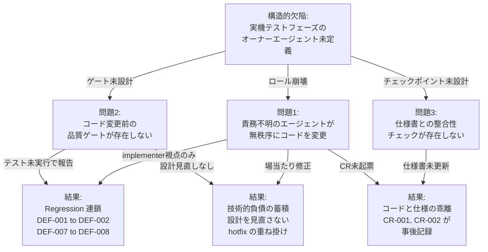
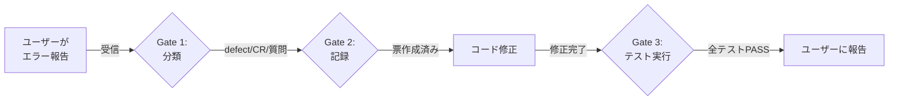
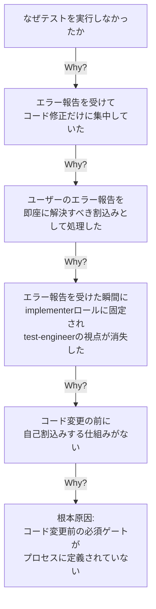
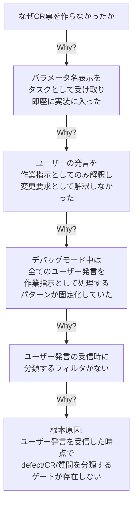
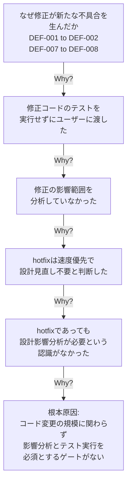
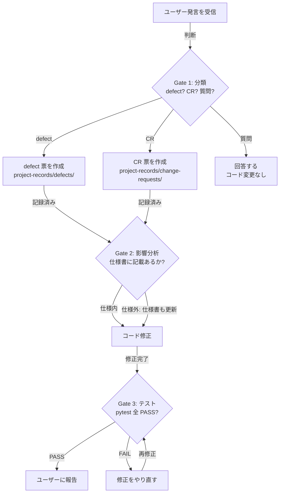

# ふりかえりレポート: 実機テストフェーズ (2026-03-21)

## 1. 実績サマリー

| 項目 | 値 |
|------|-----|
| 検出 defect 数 | 8 (Critical: 3, High: 3, Medium: 1, 未分類: 1) |
| CR 数 | 2 (Low impact: 1, High impact: 1) |
| Regression 数 | 2 (DEF-002 ← DEF-001, DEF-008 ← DEF-007) |
| Regression 率 | 25% (2/8) |
| defect 票の事前作成率 | 0% (0/8) — 全件がユーザー指摘後に作成 |
| CR 票の事前作成率 | 0% (0/2) — 全件がユーザー指摘後に作成 |
| テスト未実行で報告した回数 | 2 回 |

---

## 2. 問題の構造

### 2.1 何が起きたか

実機テストフェーズにおいて、ロール定義のないエージェントがユーザーと直接対話し、orchestrator の指示もロール宣言もなく、場当たり的にコードを書き替え続けた。その結果、以下の 3 つの問題が発生した。

**問題の因果関係:**

上図は、構造的欠陥（実機テストフェーズのオーナー未定義）から 3 つの問題が派生し、それぞれが具体的な結果（Regression 連鎖・技術的負債・仕様乖離）を引き起こした因果関係を示す。

### 2.2 問題 1: 責務不明のエージェントが無秩序にコードを変更した

エージェント一覧では以下のロール分離が定義されている:

| ロール | 責務 |
|--------|------|
| test-engineer | テストの作成と実行、品質確認 |
| implementer | 設計文書に基づくコード実装 |
| change-manager | 変更要求の記録・影響分析 |
| orchestrator | フェーズ遷移制御、意思決定記録 |

実機テスト中、これらのロール区別が完全に崩壊し、単一の無名エージェントが全作業を処理した。その結果:

- **test-engineer の視点が消失** → テスト未実行のまま修正を報告（2 回）
- **change-manager の視点が消失** → CR 未起票のまま仕様外の変更を実装（2 件）
- **implementer の視点だけが残存** → エラー報告を受けた瞬間にコード修正に直行

### 2.3 問題 2: コード変更前の品質ゲートが存在しない

**現状のフロー（ゲートなし）:**

ユーザー発言からコード変更までの間に「分類」「記録」「テスト」のいずれのゲートも存在しない。

**あるべきフロー（ゲートあり）:**

Gate 1〜3 が存在しないため、全ての問題が素通りした。

### 2.4 問題 3: 仕様書との整合性チェックが存在しない

コード変更が仕様書に記載のない機能追加であっても、整合性チェックポイントがないため、ユーザーが気づかなければ仕様とコードが乖離したまま進行する。

実際に発生した乖離:

| 変更内容 | 仕様書の状態 | 発覚タイミング |
|---------|-------------|--------------|
| パラメータ名の表示（CR-001） | FR-04 に記載なし | ユーザーが指摘 |
| 列幅調整（CR-001 追加） | 同上 | ユーザーが指摘 |
| 29bit PA 全スキャン（CR-002） | FR-06 に記載なし | ユーザーが指摘 |

---

## 3. 根本原因分析（Why-Why）

### 3.1 なぜテストを実行しなかったか

### 3.2 なぜ CR を起票できなかったか

### 3.3 なぜ Regression が連鎖したか

### 3.4 根本原因の統合

3 つの Why-Why 分析の根本原因は同一構造に帰着する:

**「コード変更の前に必ず通るゲートがプロセスに定義されていない」**

これは単にルールが足りないという問題ではなく、**実機テストフェーズ自体がプロセス設計の想定外だった**ことに起因する。プロセス規則は Phase 4（実装）と Phase 5（テスト）を分離しているが、「実機でユーザーと一緒にデバッグする」フェーズは定義されていなかった。

---

## 4. Defect パターン分類

### パターン A: 修正起因の Regression（2 件）

| Defect | 親 | 内容 |
|--------|-----|------|
| DEF-002 | DEF-001 | `@property` を `()` 付きで呼び出し |
| DEF-008 | DEF-007 | `DEFAULT` ECU の分岐漏れ |

原因: 修正後のテスト未実行 + 影響分析なし。

### パターン B: 実機固有の未考慮（3 件）

| Defect | 内容 |
|--------|------|
| DEF-003 | 29bit CAN アドレッシング未対応 |
| DEF-005 | QTimer 重複発火 |
| DEF-007 | プロトコル状態が ECU スキャン後にリセット |

原因: モックベースのテストでは ELM327 の実際の応答時間・プロトコル状態の持続を再現できなかった。

### パターン C: 排他制御の欠如（2 件）

| Defect | 内容 |
|--------|------|
| DEF-001 | シリアルポートの同時アクセス |
| DEF-005 | ポーリングタイマーの重複発火 |

原因: ELM327 がシングルスレッドデバイスであることの設計レベルでの認識不足。

### パターン D: GUI-ロジック接続の不備（2 件）

| Defect | 内容 |
|--------|------|
| DEF-004 | `build_polling_targets()` に引数未渡し |
| DEF-006 | PID 読取失敗時に UI からパラメータが消失 |

原因: GUI 統合テストでエンドツーエンドのデータフローを検証していなかった。

---

## 5. 改善提案

### IMP-001: 実機テストフェーズのオーナーと責務を定義する

**対象:** CLAUDE.md、process-rules/agent-list.md

**分類:** Breaking

**問題:** 実機テストフェーズのオーナーエージェントが未定義であり、責務不明の単一エージェントが全作業を処理した。

**提案内容:**

実機テスト（ユーザーと一緒にデバッグする作業）は **test-engineer がオーナー** とし、以下の責務を明確化する:

| 状況 | 担当ロール | 責務 |
|------|-----------|------|
| ユーザーがエラーを報告 | test-engineer | 分類・記録・再現手順の確認 |
| コード修正が必要 | test-engineer → implementer | test-engineer が defect 票を作成し、implementer に修正を依頼 |
| 仕様にない変更要求 | test-engineer → change-manager | change-manager が CR 票を作成し影響分析 |
| 修正完了後 | test-engineer | テスト実行・結果確認・ユーザーへの報告 |

### IMP-002: コード変更前の必須ゲートを定義する

**対象:** CLAUDE.md

**分類:** Breaking

**問題:** コード変更の前にゲートがなく、分類・記録・テストが全て省略された。

**提案内容:**

**コード変更前ゲート（Gate-Before-Change）:**

このゲートは hotfix であっても省略してはならない。

### IMP-003: 仕様書整合性チェックポイントを定義する

**対象:** CLAUDE.md

**分類:** Breaking

**問題:** コード変更が仕様書に記載のない機能追加であっても、整合性チェックがなく、ユーザーが気づかなければ乖離が進行した。

**提案内容:**

コード変更が以下のいずれかに該当する場合、仕様書（`docs/spec/`）の該当セクションも同時に更新する:

- 新しい機能要求（FR）の追加
- 既存 FR の動作変更
- 新しいプロトコル・通信方式の追加
- UI の表示項目・レイアウトの変更

仕様書を更新せずにコードだけ変更することを禁止する。

### IMP-004: Regression 防止のためのテスト強化

**対象:** テスト設計（仕様書 Ch5）

**分類:** Non-breaking

**問題:** hotfix の影響範囲を分析せずに修正し、Regression が連鎖した（DEF-001→DEF-002、DEF-007→DEF-008）。

**提案内容:**

1. **修正後の必須手順**: `pytest` 全テスト PASS を確認してからユーザーに報告する
2. **実機テスト用モックの拡充**:
   - 29bit CAN 応答パターン
   - シリアルポートの同時アクセスシミュレーション
   - QTimer 重複発火シミュレーション
   - プロトコル状態遷移（ATSP0→ATSP7→ATSP0）

### IMP-005: defect / change-request の Form Block スキーマを文書管理規則に追加する

**対象:** process-rules/full-auto-dev-document-rules.md

**分類:** Additive

**問題:** defect 票の Form Block フィールドが未定義であり、記載内容がエージェントの裁量に依存していた。

**提案内容:** defect および change-request の Form Block に必須/任意フィールドのスキーマを定義する。

---

## 6. 改善効果の測定基準

| メトリクス | 今回実績 | 次回目標 | 測定方法 |
|-----------|---------|---------|---------|
| defect 票の事前作成率 | 0% (0/8) | 100% | defect 票のタイムスタンプがコード変更より前か |
| CR 票の事前作成率 | 0% (0/2) | 100% | CR 票のタイムスタンプがコード変更より前か |
| Regression 率 | 25% (2/8) | 0% | 修正起因の新規 defect 数 / 全 defect 数 |
| テスト未実行で報告した回数 | 2 回 | 0 回 | pytest 実行ログの有無 |
| 仕様書とコードの乖離件数 | 3 件 | 0 件 | コード変更に対応する仕様書更新の有無 |

---

## 7. 良かった点（Keep）

1. **PoC 駆動の問題解決**: 29bit CAN 対応で PoC スクリプトを段階的に作成し、仮説検証を繰り返した結果、3 ECU の検出に成功した
2. **構造化ログ**: JSON ログにより defect の根本原因特定が迅速に行えた
3. **FSA 設計**: ELM327 切断時の状態管理が安定して動作した
4. **DIP + Protocol パターン**: Adapter 層の抽象化により、29bit CAN 対応の追加が比較的容易だった
5. **ユーザーによるプロセス監視**: ユーザーが繰り返し「記録は？」「管理されてるの？」と指摘したことで、プロセス違反が全件検出された
