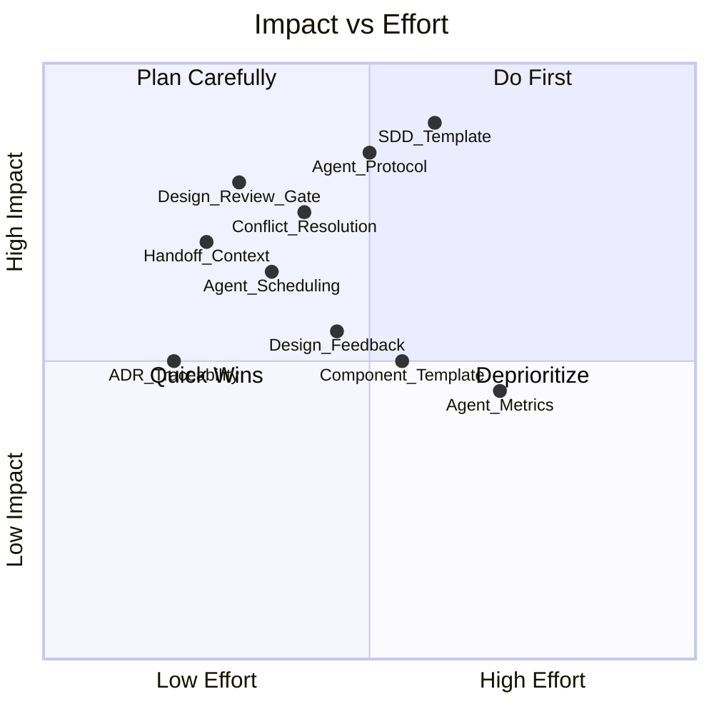
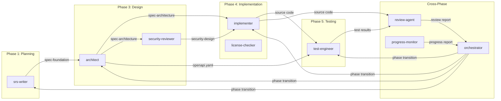
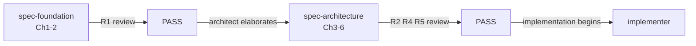
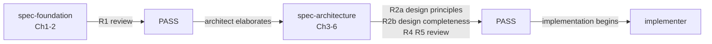
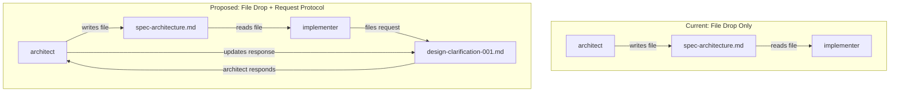
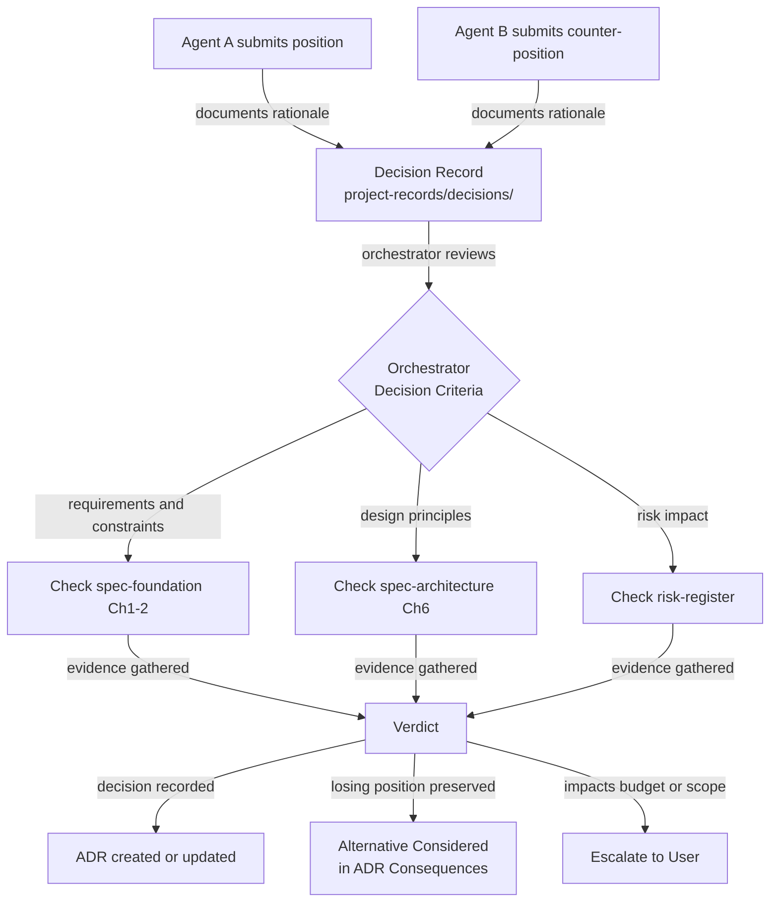
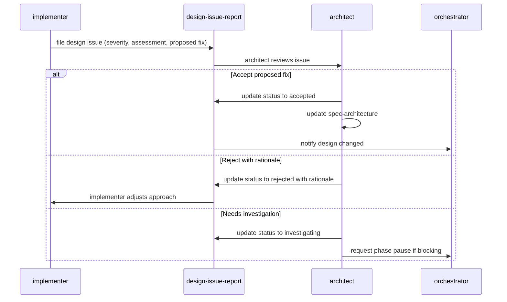
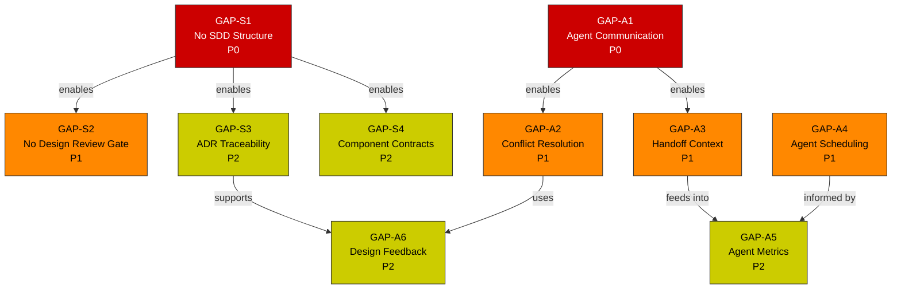

``````markdown
# gr-sw-maker Framework Improvement Proposal

**Date:** 2026-03-22
**Author:** Claude Code (full-auto-dev retrospective)
**Source Project:** Earthquake Map (gr-sw-maker-examples)
**Target Audience:** gr-sw-maker framework developer
**Scope:** SDD (Software Design Document) and Agentic SDLC improvements

---

## 1. Executive Summary

This proposal identifies 10 improvement opportunities in the gr-sw-maker full-auto-dev framework, discovered through a complete development cycle of the Earthquake Map project and a subsequent retrospective analysis against IEEE 1016 (SDD), ISO 12207 (SDLC), and modern agentic AI development patterns.

The framework excels at specification management (ANMS/ANPS/ANGS) and quality gating (R1-R6). However, two systemic gaps limit its effectiveness at scale:

1. **Design is embedded in the spec, not managed as an independent discipline** — works for ANMS but breaks at ANPS/ANGS scale.
2. **Agents are defined as roles, not as collaborators** — no communication protocol, no conflict resolution, no context preservation across handoffs.

**Improvement Priority Map:**



The quadrant chart plots all 10 proposals. Items in the upper-left quadrant (Do First) should be prioritized. SDD Template and Agent Protocol have the highest impact. Design Review Gate and Handoff Context are quick wins with low effort.

---

## 2. Current Framework Architecture

**Current Agent Data Flow:**



All agent handoffs are file-based. There is no request/response mechanism, no conflict escalation path, and no context preservation beyond the artifact itself.

---

## 3. Gap Analysis

### 3.1 SDD Gaps

#### GAP-S1: No Formal Software Design Document Structure (Priority: P0)

**Current State:**
Design knowledge is fragmented across multiple files with no single entry point.

| Design Artifact | Location | Owner |
|----------------|----------|-------|
| Architecture (layers, components) | spec-architecture Ch3 | architect |
| Gherkin scenarios | spec-architecture Ch4 | architect |
| API specification | docs/api/openapi.yaml | architect |
| Security design | docs/security/ | security-reviewer |
| Observability design | docs/observability/ | architect |
| ADRs | spec-architecture Ch3.6 | architect |
| Traceability matrix | project-records/traceability/ | orchestrator |

**IEEE 1016 Comparison:**

| IEEE 1016 Section | gr-sw-maker Equivalent | Status |
|-------------------|----------------------|--------|
| System Overview | spec-foundation Ch1 | Present |
| Data Description | spec-architecture Ch3.4 (partial) | Incomplete |
| Component Details | spec-architecture Ch3.2 (diagram only) | Missing contracts |
| Interface Details | openapi.yaml (separate file) | Not integrated |
| Adaptation Data | (none) | Missing |
| Verification Cross-Reference | traceability matrix | Present but not reviewed |
| Design Rationale | ADRs in Ch3.6 | Present but not cross-referenced |

**Impact:** At ANPS/ANGS scale, developers and agents cannot find "the design" without reading 5+ files. No single source of truth for design decisions.

**Proposed Fix:**

```markdown
# Software Design Index (docs/design/design-index.md)

## 1. Architecture Overview
Reference: docs/spec/{project}-spec-architecture.md Ch3.1-3.3

## 2. Domain Model
Reference: docs/spec/{project}-spec-architecture.md Ch3.4

## 3. Component Contracts
Reference: docs/design/components/{component-name}.md (one per major component)

## 4. API Contracts
Reference: docs/api/openapi.yaml

## 5. Security Architecture
Reference: docs/security/security-architecture.md

## 6. Observability Architecture
Reference: docs/observability/observability-design.md

## 7. Architecture Decision Log
Reference: docs/spec/{project}-spec-architecture.md Ch3.6
Cross-reference: See ADR Impact Matrix below

## 8. Design-Requirement Traceability
Reference: project-records/traceability/requirement-trace.md

## ADR Impact Matrix

| ADR ID | Origin Requirements | Affected Components | Risks Mitigated |
|--------|-------------------|--------------------|-----------------|
| ADR-001 | FR-01, NFR-02 | MapRenderer | RSK-03 |
```

This is a lightweight index document, not a duplicate. It provides a single entry point with references to all design artifacts.

---

#### GAP-S2: No Design Completeness Review Gate (Priority: P1)

**Current State:**



R1 reviews requirements quality. R2/R4/R5 review design principles. But no review checks: "Does every requirement have a corresponding design element?"

**Proposed Fix:** Add R2b perspective to review-standards.md.

```markdown
### R2b: Design Completeness Review

**Trigger:** After spec-architecture Ch3-6 is finalized, before implementation begins.

**Checklist:**
1. Every FR-xxx in Ch2.1 traces to at least one component in Ch3.2
2. Every NFR-xxx in Ch2.2 traces to at least one design element (architecture decision, component constraint, or test strategy entry)
3. Every component in Ch3.2 traces to at least one FR-xxx (no orphan components)
4. Every ADR in Ch3.6 references at least one originating requirement or constraint
5. The traceability matrix has no empty cells in the Design column

**Gate:** Critical findings = 0, High findings = 0 required for PASS
```

**Updated Review Flow:**



The addition of R2b ensures no requirement is left unaddressed by design before implementation starts.

---

#### GAP-S3: ADR Traceability is One-Directional (Priority: P2)

**Current State:** ADRs follow Nygard format (Status / Context / Decision / Consequences) but Context does not systematically reference requirement IDs.

**Proposed Fix:** Extend ADR Form Block fields.

```markdown
<!-- FIELD: adr:origin_requirement_ids | type: list | required: true -->
<adr:origin_requirement_ids>FR-01, NFR-02, CON-03</adr:origin_requirement_ids>

<!-- FIELD: adr:origin_risk_ids | type: list | required: false -->
<adr:origin_risk_ids>RSK-001</adr:origin_risk_ids>

<!-- FIELD: adr:affected_components | type: list | required: true -->
<adr:affected_components>MapRenderer, USGSClient</adr:affected_components>
```

This enables reverse lookups: "Requirement FR-01 changed — which ADRs are affected?"

---

#### GAP-S4: Component Design Contracts Missing (Priority: P2)

**Current State:** Ch3.2 shows component boxes with brief descriptions. No standardized contract for what each component promises.

**Proposed Template:**

```markdown
# Component Design: {ComponentName}

## Identity
- **Layer:** Entity / UseCase / Adapter / Framework
- **Owner Module:** src/{layer}/{module-name}.js
- **Traces:** FR-xxx, NFR-xxx

## Responsibility
{Single sentence: what this component does and does not do}

## Interface
| Function | Input | Output | Side Effects |
|----------|-------|--------|-------------|
| fetchEarthquakes(filter, signal) | FilterState, AbortSignal | Promise of EarthquakeEvent[] | Network I/O |

## Dependencies
| Dependency | Direction | Purpose |
|-----------|-----------|---------|
| EarthquakeModel | uses (Domain) | Parse GeoJSON to domain objects |
| DateRange | uses (Domain) | Format dates for API params |

## Error Contract
| Error Condition | Thrown Error | Consumer Action |
|----------------|-------------|-----------------|
| HTTP 4xx/5xx | "USGS API error: HTTP {status}" | Display to user |
| Network timeout | "Request timed out after 30 seconds" | Display to user |
| Unparseable JSON | "USGS API returned unparseable response" | Display to user |

## State
{Stateless / Stateful — if stateful, include state diagram}

## Test Coverage
| Test File | Test Count | Coverage |
|-----------|-----------|----------|
| tests/adapter/usgs-client.test.js | 7 | 96.92% |
```

Recommended for ANPS/ANGS scale projects where components are non-trivial. Not required for ANMS.

---

### 3.2 Agentic SDLC Gaps

#### GAP-A1: No Agent Communication Protocol (Priority: P0)

**Current State:** Agents communicate exclusively via file artifacts. There is no mechanism for an agent to ask another agent a question, request clarification, or negotiate a design trade-off.

**Current vs Proposed Communication:**



**Proposed Protocol:**

```markdown
# Agent Communication Protocol (process-rules/agent-communication-protocol.md)

## 1. Request/Response Mechanism

### Request Creation
- Location: project-management/agent-requests/
- Filename: {requesting-agent}-{timestamp}-{subject-slug}.md
- Status lifecycle: open -> assigned -> resolved -> closed

### Request Form Block
<!-- FIELD: agent-request:from | type: string | required: true -->
<!-- FIELD: agent-request:to | type: string | required: true -->
<!-- FIELD: agent-request:subject | type: string | required: true -->
<!-- FIELD: agent-request:priority | type: enum | values: blocking,high,medium,low -->
<!-- FIELD: agent-request:context | type: text | required: true -->
<!-- FIELD: agent-request:question | type: text | required: true -->
<!-- FIELD: agent-request:response | type: text | required: false -->
<!-- FIELD: agent-request:resolved_at | type: datetime | required: false -->

### Timeout Rules
- blocking: orchestrator checks within same phase step
- high: must be resolved before phase transition
- medium: may be deferred with documented rationale
- low: informational, no deadline

## 2. Broadcast Notifications
- Location: project-management/agent-notifications/
- Used for: design changes affecting multiple agents, risk escalations,
  constraint discoveries
- All active agents in current phase must acknowledge
```

---

#### GAP-A2: Agent Conflict Resolution Undefined (Priority: P1)

**Current State:** If `review-agent` and `architect` disagree on a design choice, there is no documented escalation path.

**Proposed Escalation Flow:**



**Proposed Process Rule Addition:**

```markdown
### 3.X Agent Conflict Resolution (process-rules addition)

**Trigger:** Two agents submit contradictory recommendations on the same artifact.

**Process:**
1. First agent documents position in project-records/decisions/DEC-xxx.md
2. Conflicting agent appends counter-position in same decision document
3. Orchestrator resolves using priority order:
   a. Requirements and constraints (spec-foundation Ch1-2)
   b. Design principles (spec-architecture Ch6)
   c. Risk impact (risk-register)
4. Decision and rationale recorded in ADR
5. Non-selected position preserved as "Alternative Considered"

**Escalation to User:** Required when decision impacts budget, schedule, or scope.
**Deadlock Rule:** If orchestrator cannot resolve within the current phase step,
the more conservative option (lower risk score) is selected as interim decision
with a mandatory re-evaluation ticket.
```

---

#### GAP-A3: Context Loss at Agent Handoffs (Priority: P1)

**Current State:** Handoff Form Block fields are minimal.

```markdown
# Current Handoff Form Block
handoff:from          (string)
handoff:to            (string)
handoff:status        (enum: pending, accepted, rejected)
handoff:phase         (string)
```

**What is lost:** Trade-offs the previous agent evaluated, assumptions made, questions that could not be answered, constraints discovered during work.

**Proposed Extended Handoff Form Block:**

```markdown
# Extended Handoff Form Block

## Existing Fields (unchanged)
handoff:from          (string)
handoff:to            (string)
handoff:status        (enum: pending, accepted, rejected)
handoff:phase         (string)

## New Fields
handoff:context_summary       (text)
  "Key decisions made and trade-offs evaluated during this phase"

handoff:assumptions           (list)
  "Assumptions the handing-off agent made that the receiving agent should validate"

handoff:open_questions        (list)
  "Questions that could not be resolved; receiving agent should address these"

handoff:blocked_items         (list)
  "Work items that could not proceed due to missing information or dependencies"

handoff:adrs_created          (list)
  "ADR IDs created during this phase (e.g., ADR-001, ADR-002)"

handoff:risks_identified      (list)
  "New risk IDs added to the risk register during this phase"
```

This prevents the receiving agent from re-discovering constraints and trade-offs that the handing-off agent already evaluated.

---

#### GAP-A4: Agent Scheduling and Priority Undefined (Priority: P1)

**Current State:** The Phase Activation Map shows which agents are active per phase, but not execution priority or parallelization rules.

**Proposed Agent Scheduling Policy:**

```mermaid
gantt
    title Phase 3-4 Agent Scheduling (Proposed)
    dateFormat X
    axisFormat %s

    section Critical_Path
    architect_Ch3           :crit, a1, 0, 3
    architect_Ch4_Gherkin   :crit, a2, after a1, 2
    review_agent_R2         :crit, a3, after a2, 1
    implementer             :crit, a4, after a3, 4
    review_agent_R3         :crit, a5, after a4, 1

    section Parallel_Track
    security_reviewer       :b1, after a1, 3
    risk_manager            :b2, 0, 1
    test_engineer_planning  :b3, after a2, 2

    section Background
    progress_monitor        :c1, 0, 10
    license_checker         :c2, after a4, 1
    kotodama_kun            :c3, after a2, 1
```



This Gantt chart shows a proposed parallel scheduling of agents during Phases 3-4. Critical path agents run sequentially; parallel track agents can start as soon as their input dependency is met; background agents run continuously.

**Proposed Priority Tiers:**

```markdown
### Agent Priority Tiers (process-rules addition)

| Tier | Agents | Rule |
|------|--------|------|
| Critical | orchestrator, review-agent | Must complete before phase transition |
| High | srs-writer, architect, implementer | On critical path; run as soon as input is available |
| Medium | test-engineer, security-reviewer | Can start with partial input (skeleton/draft) |
| Low | progress-monitor, process-improver, kotodama-kun | Background; never blocks critical path |
| On-demand | change-manager, risk-manager, license-checker, incident-reporter | Triggered by events, not by phase |

### Parallelization Rules
- architect + security-reviewer: parallel after spec-foundation approved
- implementer + test-engineer: parallel (test-engineer writes tests while implementer codes)
- review-agent: sequential after target agent completes; blocks phase transition
- progress-monitor: runs at phase boundaries; does not block
```

---

#### GAP-A5: No Agent Performance Metrics (Priority: P2)

**Current State:** Quality targets are project-level only (test pass rate, coverage, etc.). No per-agent quality tracking.

**Proposed Agent Metrics Schema:**

```json
{
  "phase": 3,
  "date": "2026-03-22",
  "agent_metrics": {
    "architect": {
      "artifacts_produced": 6,
      "review_findings": {
        "critical": 0,
        "high": 0,
        "medium": 3,
        "low": 2
      },
      "rework_cycles": 0,
      "handoff_completeness_percent": 100,
      "context_questions_received": 0
    },
    "implementer": {
      "files_created": 8,
      "lines_of_code": 350,
      "unit_tests_written": 32,
      "review_findings": {
        "critical": 0,
        "high": 0,
        "medium": 3,
        "low": 3
      },
      "defect_escape_rate_percent": 0,
      "design_issue_reports_filed": 0
    },
    "review_agent": {
      "reviews_conducted": 2,
      "total_findings": 12,
      "false_positive_rate_percent": 0,
      "average_review_depth_minutes": 3
    }
  }
}
```

Location: `project-management/progress/agent-metrics-phase-{N}.json`
Owner: `progress-monitor`
Consumer: `process-improver` (for retrospectives), `orchestrator` (for scheduling decisions)

---

#### GAP-A6: No Implementation-to-Design Feedback Loop (Priority: P2)

**Current State:** If `implementer` discovers the design cannot be implemented as specified, the only option is a generic defect ticket. No structured path back to `architect`.

**Proposed Feedback Flow:**



**Proposed File Type:**

```markdown
# Design Issue Report (project-records/design-issues/)

## Form Block
design-issue:id                    (string, required)
design-issue:filed_by              (string: implementer)
design-issue:related_adr           (string, optional: ADR-xxx)
design-issue:related_component     (string, required)
design-issue:severity              (enum: minor, medium, major)
design-issue:implementer_finding   (text: what was discovered)
design-issue:proposed_fix          (text: suggested design change)
design-issue:architect_response    (enum: accepted, rejected, investigating)
design-issue:architect_rationale   (text)
design-issue:spec_updated          (boolean: was spec-architecture updated?)
```

---

## 4. Consolidated Gap Map

**Gap Dependency Diagram:**



Red (P0) items are foundational — they enable the orange (P1) and yellow (P2) items. GAP-S1 (SDD Structure) and GAP-A1 (Agent Communication) should be addressed first as they unlock downstream improvements.

---

## 5. Implementation Roadmap

| Phase | Gap IDs | Deliverables | Target Files |
|-------|---------|-------------|-------------|
| **Wave 1** (P0) | GAP-S1, GAP-A1 | Design Index template, Agent Communication Protocol | process-rules/design-index-template.md, process-rules/agent-communication-protocol.md |
| **Wave 2** (P1) | GAP-S2, GAP-A2, GAP-A3, GAP-A4 | R2b review standard, Conflict resolution rules, Extended handoff Form Block, Agent scheduling policy | process-rules/review-standards.md, process-rules/full-auto-dev-process-rules.md, process-rules/full-auto-dev-document-rules.md |
| **Wave 3** (P2) | GAP-S3, GAP-S4, GAP-A5, GAP-A6 | Extended ADR Form Block, Component design template, Agent metrics schema, Design-issue-report file type | process-rules/spec-template.md, process-rules/full-auto-dev-document-rules.md |

**Estimated Impact per Wave:**

| Wave | Process Maturity Gain | Rework Reduction | Agent Efficiency |
|------|----------------------|-----------------|-----------------|
| Wave 1 | Design traceability from 0 to baseline | Eliminates "where is the design?" searches | Agents can ask questions instead of guessing |
| Wave 2 | Quality gates cover design completeness | Catches missing requirements before implementation | Parallel scheduling reduces elapsed time |
| Wave 3 | Per-agent performance feedback loop | Design issues caught earlier via structured feedback | Data-driven agent prompt improvements |

---

## 6. Compatibility Notes

- All proposals are **additive** — no existing framework files need breaking changes
- New file types (design-issue-report, agent-request) follow existing Common Block + Form Block + Detail Block structure
- New review perspective (R2b) follows existing R1-R6 pattern in review-standards.md
- Agent Communication Protocol is optional for ANMS-scale projects; recommended for ANPS/ANGS
- Component Design Template is optional for ANMS; recommended for ANPS/ANGS

---

## 7. Lessons from Earthquake Map Project

These proposals originated from concrete issues observed during development:

| Issue Observed | Root Cause | Addressed By |
|---------------|-----------|-------------|
| ES modules failed on file:// protocol | No deployment environment check in architect checklist | GAP-S2 (design completeness review would catch missing constraint evaluation) |
| Auto-fetch reworked to Update button | Missing trigger semantics in interview | GAP-A3 (handoff context would flag "interaction model not specified") |
| Screenshot verification timed out | No test environment constraints in test strategy | GAP-S4 (component contract would specify "async rendering, not screenshot-testable") |
| Review findings never formally closed | No closure workflow step | GAP-A1 (agent communication protocol would define request lifecycle including closure) |

---

## 8. References

- IEEE 1016-2009: Software Design Descriptions
- ISO/IEC 12207:2017: Software Life Cycle Processes
- Michael Nygard: Documenting Architecture Decisions (ADR format)
- Robert C. Martin: Stable Dependencies Principle (SDP)
- gr-sw-maker process-rules v0.0.0 (current framework baseline)
``````
