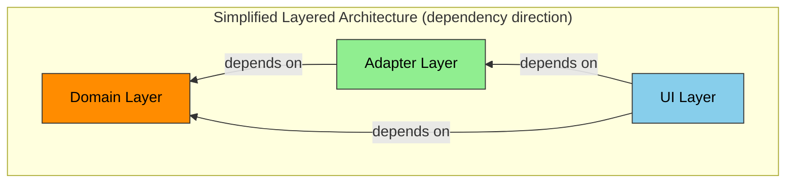
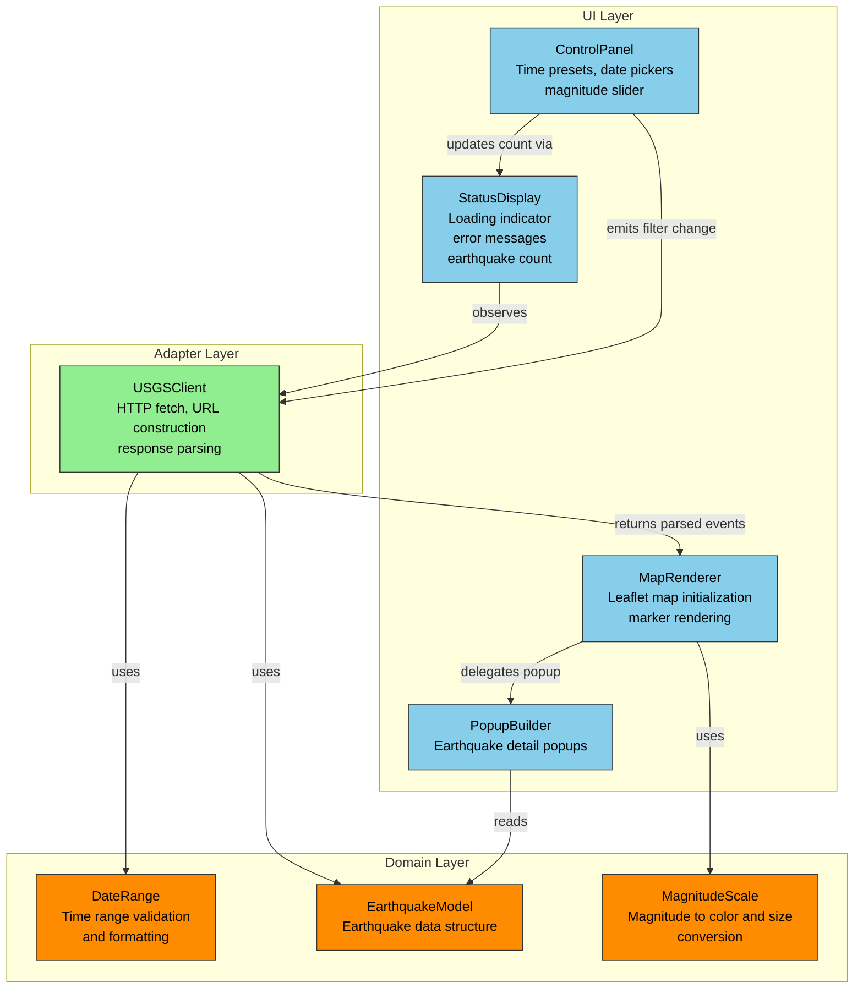
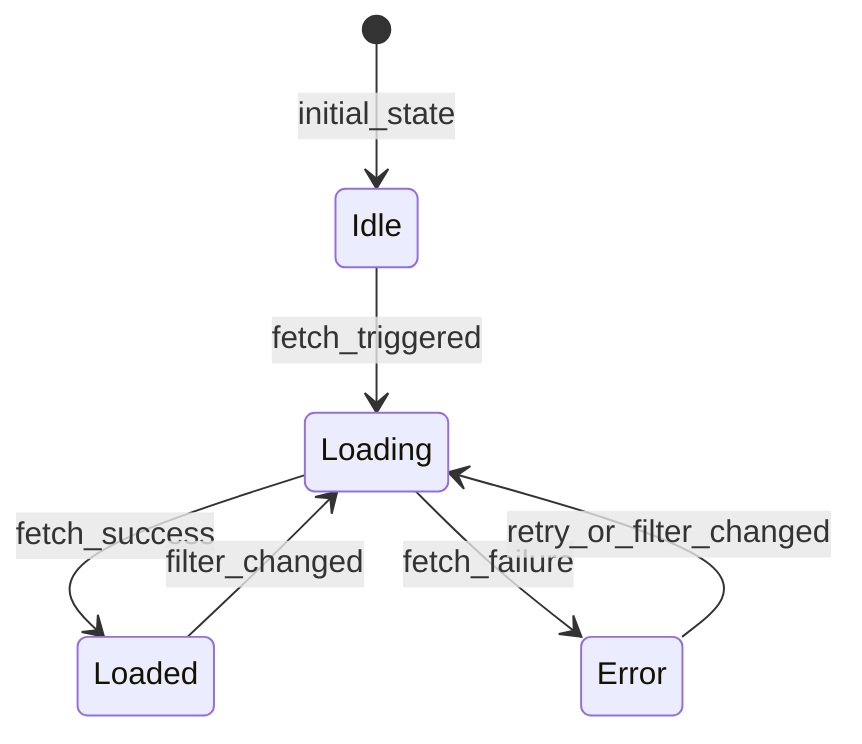
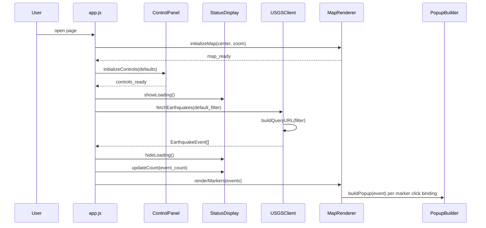
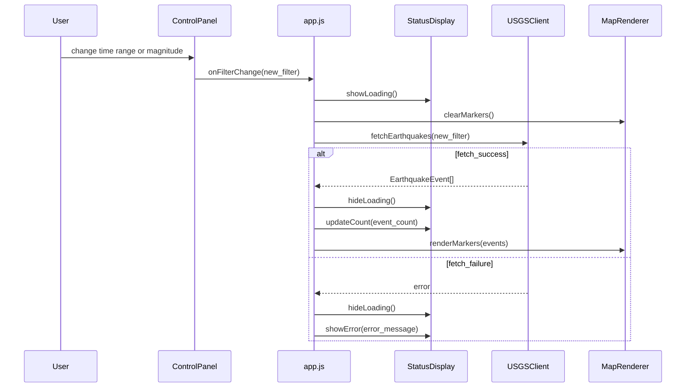
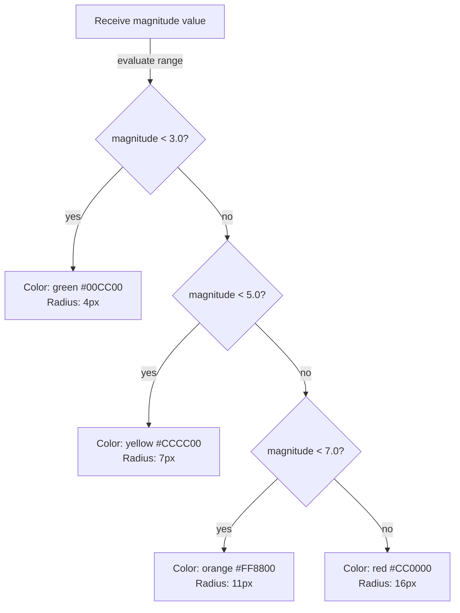

# Earthquake Map — ANMS Specification v0.1.0

---

## Chapter 1. Foundation

### 1.1 Background

Earthquakes occur globally every day. The USGS Earthquake Hazards Program publishes real-time and historical earthquake data through a public API. However, consuming this raw data requires technical knowledge. A simple, visual, browser-based tool would allow anyone to explore earthquake activity geographically and temporally.

### 1.2 Issues

- Raw USGS data is in GeoJSON format, not directly human-consumable
- Existing earthquake map tools often require server-side infrastructure or accounts
- Users cannot easily filter by time span and magnitude simultaneously on a zoomable map

### 1.3 Goals

- Provide a zero-install, browser-only earthquake visualization tool
- Enable geographic exploration through an interactive zoomable world map
- Enable temporal exploration through custom date range selection
- Enable magnitude-based filtering to focus on significant events
- Display earthquake details on demand

### 1.4 Approach

- **Rendering:** Leaflet.js for interactive map with OpenStreetMap tiles
- **Data:** USGS Earthquake Hazards Program GeoJSON API
- **Architecture:** Vanilla HTML/CSS/JavaScript, no build step, no server
- **Deployment:** Static files served by any web server or opened locally

### 1.5 Scope

**In scope:**
- Interactive world map with pan and zoom
- Earthquake markers as circles sized and colored by magnitude
- Time span filtering (preset ranges + custom date picker)
- Magnitude filtering (minimum magnitude slider)
- Earthquake detail popup (magnitude, location, depth, time, USGS link)
- Loading indicator during API fetch
- Error message on API failure

**Out of scope:**
- User accounts or authentication
- Data persistence or caching beyond browser session
- Server-side processing
- Push notifications or real-time streaming
- Earthquake prediction or analysis
- Mobile-native app

### 1.6 Constraints

| ID | Constraint | Reason |
|----|-----------|--------|
| CON-01 | Browser-only execution, no server | User requirement |
| CON-02 | USGS API public access only (no API key) | Simplicity, zero configuration |
| CON-03 | USGS API limit of 20,000 events per query | API constraint |
| CON-04 | Free tile provider (OpenStreetMap) | Cost constraint |

### 1.7 Limitations

| ID | Limitation | Acceptable Because |
|----|-----------|-------------------|
| LIM-01 | Large historical queries may be slow | Acceptable for exploration use case |
| LIM-02 | No offline support | Earthquake data requires network access |
| LIM-03 | USGS data only (no other seismological agencies) | USGS provides comprehensive global coverage |

### 1.8 Glossary

| Term | Definition |
|------|-----------|
| Earthquake event | A seismic event recorded by USGS with magnitude, location, depth, and time |
| Magnitude | Measure of earthquake energy release on the Richter/moment magnitude scale |
| Depth | Distance below Earth's surface where the earthquake originated, in kilometers |
| Epicenter | Geographic point on the surface directly above the earthquake origin |
| USGS | United States Geological Survey |
| GeoJSON | Open standard format for geographic data structures |
| Tile | Pre-rendered map image tile served by OpenStreetMap |

### 1.9 Notation

This specification uses RFC 2119/8174 keywords:
- **SHALL / MUST:** Absolute requirement
- **SHOULD:** Recommended but may be omitted with justification
- **MAY:** Optional feature
- EARS `shall` is synonymous with SHALL

---

## Chapter 2. Requirements

### 2.1 Functional Requirements

| ID | Requirement |
|----|------------|
| FR-01 | The system SHALL display an interactive world map using Leaflet.js with OpenStreetMap tiles. |
| FR-02 | When the page loads, the system SHALL fetch earthquake data from the USGS GeoJSON API for the default time range (past 7 days) and minimum magnitude (1.0). |
| FR-03 | The system SHALL display each earthquake event as a circle marker on the map at its epicenter coordinates. |
| FR-04 | The system SHALL size each circle marker proportionally to the earthquake magnitude. |
| FR-05 | The system SHALL color each circle marker by magnitude: green for magnitude below 3.0, yellow for 3.0 to 4.9, orange for 5.0 to 6.9, and red for 7.0 and above. |
| FR-06 | When the user clicks an earthquake marker, the system SHALL display a popup containing: magnitude, location name, depth in km, UTC time, and a hyperlink to the USGS event detail page. |
| FR-07 | The system SHALL provide a time range selector with preset options: past 1 hour, past 24 hours, past 7 days, past 30 days. |
| FR-08 | The system SHALL provide custom start date and end date inputs for arbitrary time ranges. |
| FR-09 | When the user changes the time range, the system SHALL re-fetch earthquake data from the USGS API with the new parameters. |
| FR-10 | The system SHALL provide a minimum magnitude slider ranging from 0.0 to 9.0 with 0.1 step increments. |
| FR-11 | When the user changes the minimum magnitude, the system SHALL re-fetch earthquake data from the USGS API with the new parameter. |
| FR-12 | While the system is fetching data from the USGS API, the system SHALL display a loading indicator. |
| FR-13 | If the USGS API request fails, then the system SHALL display an error message to the user with the failure reason. |
| FR-14 | The system SHALL display the count of currently shown earthquakes. |
| FR-15 | The system SHALL allow the user to pan and zoom the map freely. |
| FR-16 | If the USGS API does not respond within 30 seconds, then the system SHALL cancel the request and display a timeout error message. |
| FR-17 | When the user changes filter parameters while a previous fetch is in progress, the system SHALL cancel the previous request before initiating a new one. |
| FR-18 | If the USGS API returns an unparseable response, then the system SHALL display an error message indicating data format issues. |
| FR-19 | The system SHALL reject custom date ranges where the end date precedes the start date. |
| FR-20 | The system SHALL not accept future dates beyond today as the end date. |

### 2.2 Non-Functional Requirements

| ID | Category | Requirement |
|----|----------|------------|
| NFR-01 | Performance | The system SHALL render the initial map view within 3 seconds on a 10 Mbps connection with 50ms latency. |
| NFR-02 | Performance | The system SHALL maintain 60fps during map pan and zoom interactions with up to 5,000 markers. |
| NFR-03 | Compatibility | The system SHALL work on the latest versions of Chrome, Firefox, Safari, and Edge. |
| NFR-04 | Usability | The system SHOULD be usable on screens 768px wide or larger. |
| NFR-05 | Reliability | If the USGS API returns more than 20,000 events, the system SHALL inform the user that results are capped. |
| NFR-06 | Security | The system SHALL only make HTTPS requests to the USGS API. |
| NFR-07 | Security | The system SHALL sanitize all USGS response data before inserting into the DOM. |

---

## Chapter 3. Architecture

### 3.1 Architecture Concept

This project adopts a **Simplified Layered Architecture** with three layers. Full Clean Architecture (4-layer with Use Case layer) is unnecessary because the application has no complex business orchestration: it fetches data, transforms it, and renders it. The three layers are:

| Layer | Role | Color | Hex |
|-------|------|-------|-----|
| Domain | Earthquake data models, filtering logic, value conversions | Orange | `#FF8C00` |
| Adapter | USGS API client, URL construction, response parsing | Green | `#90EE90` |
| UI | Map rendering, control panel, popups, loading/error display | Blue | `#87CEEB` |

Dependency direction: UI depends on Domain and Adapter. Adapter depends on Domain. Domain depends on nothing.

**Layer Legend:**



### 3.2 Components

**Component Diagram:**



| Component | Layer | Responsibility | Traces |
|-----------|-------|---------------|--------|
| MapRenderer | UI | Initialize Leaflet map, render circle markers, handle pan/zoom | FR-01, FR-03, FR-04, FR-05, FR-15 |
| ControlPanel | UI | Time preset buttons, custom date inputs, magnitude slider | FR-07, FR-08, FR-09, FR-10, FR-11 |
| PopupBuilder | UI | Build popup HTML content with earthquake details | FR-06 |
| StatusDisplay | UI | Show loading spinner, error messages, earthquake count | FR-12, FR-13, FR-14 |
| USGSClient | Adapter | Construct USGS API URL, fetch data, parse GeoJSON response | FR-02, FR-09, FR-11 |
| EarthquakeModel | Domain | Define earthquake event data structure | FR-03, FR-06 |
| MagnitudeScale | Domain | Convert magnitude to circle radius and color | FR-04, FR-05 |
| DateRange | Domain | Validate and format date ranges for API queries | FR-07, FR-08 |

### 3.3 File Structure

```
earthquake-map/
  index.html                  # Entry point, loads all scripts and styles
  src/
    domain/
      earthquake-model.js     # EarthquakeModel: data structure and factory
      magnitude-scale.js      # MagnitudeScale: magnitude to color/size
      date-range.js           # DateRange: validation and formatting
    adapter/
      usgs-client.js          # USGSClient: API URL construction, fetch, parse
    ui/
      map-renderer.js         # MapRenderer: Leaflet map and markers
      control-panel.js        # ControlPanel: filter controls
      popup-builder.js        # PopupBuilder: popup content generation
      status-display.js       # StatusDisplay: loading, error, count
    app.js                    # Application entry: wires all components
  styles/
    main.css                  # All application styles
  tests/
    domain/
      earthquake-model.test.js
      magnitude-scale.test.js
      date-range.test.js
    adapter/
      usgs-client.test.js
  docs/
    spec/                     # This specification
    api/                      # OpenAPI spec (for USGS API contract)
  vitest.config.js            # Test configuration
```

### 3.4 Domain Model

**Earthquake Event Model:**

```mermaid
classDiagram
    class EarthquakeEvent {
        +String earthquake_id
        +Number magnitude
        +String location_name
        +Number depth_km
        +Date event_time_utc
        +Number latitude
        +Number longitude
        +String usgs_detail_url
    }:::domain

    class MagnitudeScale {
        +magnitudeToRadius(Number magnitude) Number
        +magnitudeToColor(Number magnitude) String
    }:::domain

    class DateRange {
        +Date start_date
        +Date end_date
        +isValid() Boolean
        +toUSGSParams() Object
        +fromPreset(String preset_key) DateRange
    }:::domain

    class FilterState {
        +DateRange date_range
        +Number minimum_magnitude
    }:::domain

    class USGSClient {
        +buildQueryURL(FilterState filter) String
        +fetchEarthquakes(FilterState filter) Promise~EarthquakeEvent[]~
        +parseGeoJSON(Object raw_geojson) EarthquakeEvent[]
    }:::adapter

    FilterState -->|"contains"| DateRange : date_range
    USGSClient -->|"accepts"| FilterState : query_filter
    USGSClient -->|"returns"| EarthquakeEvent : parsed_events
    MagnitudeScale -->|"reads"| EarthquakeEvent : magnitude_value

    style EarthquakeEvent fill:#FF8C00,stroke:#333,color:#000
    style MagnitudeScale fill:#FF8C00,stroke:#333,color:#000
    style DateRange fill:#FF8C00,stroke:#333,color:#000
    style FilterState fill:#FF8C00,stroke:#333,color:#000
    style USGSClient fill:#90EE90,stroke:#333,color:#000
```

**USGS GeoJSON Response to EarthquakeEvent Mapping:**

| GeoJSON Field | EarthquakeEvent Field | Transformation |
|--------------|----------------------|----------------|
| `features[].id` | `earthquake_id` | Direct mapping |
| `features[].properties.mag` | `magnitude` | Direct mapping (Number) |
| `features[].properties.place` | `location_name` | Direct mapping (String) |
| `features[].geometry.coordinates[2]` | `depth_km` | Direct mapping (Number, index 2 of coordinates) |
| `features[].properties.time` | `event_time_utc` | Unix milliseconds to Date |
| `features[].geometry.coordinates[1]` | `latitude` | Direct mapping (Number, index 1) |
| `features[].geometry.coordinates[0]` | `longitude` | Direct mapping (Number, index 0) |
| `features[].properties.url` | `usgs_detail_url` | Direct mapping (String) |
| `metadata.count` | (used by StatusDisplay) | Total event count |

**State Transition Diagram for Application Load State:**



### 3.5 Behavior

**Sequence Diagram: Page Load Flow**



**Sequence Diagram: Filter Change Flow**



**Activity Diagram: Magnitude to Marker Style**



### 3.6 Decisions

**ADR-001: Use Leaflet.js for Map Rendering**

- **Status:** Accepted
- **Context:** The application requires an interactive zoomable world map with circle markers, popups, and pan/zoom. Candidates: Leaflet.js, OpenLayers, Mapbox GL JS, Google Maps API.
- **Decision:** Use Leaflet.js.
- **Consequences:**
  - Positive: Lightweight (42KB gzipped), extensive plugin ecosystem, BSD-2-Clause license, works with OpenStreetMap tiles at no cost, simple API for circle markers and popups.
  - Positive: No API key required for the library itself.
  - Negative: No built-in vector tile support (not needed for this project).
  - Negative: Marker clustering would need a plugin if required in the future.
- **Traces:** FR-01, FR-03, FR-06, FR-15

**ADR-002: Use Vanilla JavaScript with No Build Step**

- **Status:** Accepted
- **Context:** The project is a small, browser-only tool. Candidates: Vanilla JS, React, Vue, Svelte.
- **Decision:** Use vanilla HTML/CSS/JavaScript with ES modules. No bundler, no transpiler, no build step.
- **Consequences:**
  - Positive: Zero tooling complexity, instant development cycle, no node_modules for production.
  - Positive: Files can be opened directly from the filesystem or any static server.
  - Positive: No framework lock-in, smaller download size.
  - Negative: No component model; manual DOM manipulation.
  - Negative: Testing requires a jsdom environment since there is no framework test harness.
- **Traces:** CON-01

**ADR-003: Use USGS Earthquake Hazards Program GeoJSON API**

- **Status:** Accepted
- **Context:** The application needs a source of global earthquake data. Candidates: USGS API, EMSC, ISC.
- **Decision:** Use the USGS Earthquake Hazards Program FDSNWS event API (`https://earthquake.usgs.gov/fdsnws/event/1/query`).
- **Consequences:**
  - Positive: Free, no API key, comprehensive global coverage, well-documented GeoJSON format.
  - Positive: Supports query parameters for time range, minimum magnitude, and format.
  - Negative: 20,000 event limit per query (CON-03).
  - Negative: Single point of failure; no fallback data source.
- **Traces:** FR-02, CON-02, CON-03

---

## Chapter 4. Specification

### 4.1 Scenarios

```gherkin
Feature: Interactive Earthquake Map

  Background:
    Given the user opens the earthquake map application in a supported browser

  Rule: Map Initialization

    Scenario: SC-001 Display interactive world map on page load (traces: FR-01)
      Given the page has finished loading
      Then the system SHALL display an interactive world map using Leaflet.js
      And the map SHALL use OpenStreetMap tiles

    Scenario: SC-002 Fetch default earthquake data on page load (traces: FR-02)
      Given the page has finished loading
      Then the system SHALL fetch earthquake data from the USGS API
      And the default time range SHALL be the past 7 days
      And the default minimum magnitude SHALL be 1.0

    Scenario: SC-003 Display earthquake markers at epicenter coordinates (traces: FR-03)
      Given earthquake data has been fetched successfully
      Then each earthquake event SHALL be displayed as a circle marker
      And each marker SHALL be positioned at the epicenter coordinates

  Rule: Marker Styling

    Scenario: SC-004 Size markers proportionally to magnitude (traces: FR-04)
      Given earthquake data has been fetched successfully
      Then each circle marker SHALL have a radius proportional to the earthquake magnitude
      And a magnitude 2.0 marker SHALL be smaller than a magnitude 6.0 marker

    Scenario: SC-005 Color markers by magnitude gradient (traces: FR-05)
      Given earthquake data has been fetched successfully
      Then markers with magnitude below 3.0 SHALL be colored green
      And markers with magnitude between 3.0 and 5.0 SHALL be colored yellow
      And markers with magnitude between 5.0 and 7.0 SHALL be colored orange
      And markers with magnitude 7.0 or above SHALL be colored red

  Rule: Earthquake Detail Popup

    Scenario: SC-006 Show earthquake details on marker click (traces: FR-06)
      Given earthquake markers are displayed on the map
      When the user clicks an earthquake marker
      Then the system SHALL display a popup containing the magnitude
      And the popup SHALL contain the location name
      And the popup SHALL contain the depth in kilometers
      And the popup SHALL contain the UTC time
      And the popup SHALL contain a hyperlink to the USGS event detail page

  Rule: Time Range Filtering

    Scenario: SC-007 Provide time range preset options (traces: FR-07)
      Given the control panel is displayed
      Then the system SHALL provide preset buttons for past 1 hour
      And the system SHALL provide preset buttons for past 24 hours
      And the system SHALL provide preset buttons for past 7 days
      And the system SHALL provide preset buttons for past 30 days

    Scenario: SC-008 Provide custom date range inputs (traces: FR-08)
      Given the control panel is displayed
      Then the system SHALL provide a start date input
      And the system SHALL provide an end date input

    Scenario: SC-009 Re-fetch data on time range change (traces: FR-09)
      Given earthquake markers are displayed on the map
      When the user selects the past 24 hours preset
      Then the system SHALL re-fetch earthquake data from the USGS API
      And the time range parameter SHALL reflect the past 24 hours

    Scenario: SC-010 Re-fetch data on custom date range change (traces: FR-08, FR-09)
      Given earthquake markers are displayed on the map
      When the user enters a custom start date and end date
      Then the system SHALL re-fetch earthquake data from the USGS API
      And the time range parameter SHALL reflect the custom dates

  Rule: Magnitude Filtering

    Scenario: SC-011 Provide minimum magnitude slider (traces: FR-10)
      Given the control panel is displayed
      Then the system SHALL display a magnitude slider
      And the slider SHALL range from 0.0 to 9.0
      And the slider SHALL have 0.1 step increments

    Scenario: SC-012 Re-fetch data on magnitude change (traces: FR-11)
      Given earthquake markers are displayed on the map
      When the user changes the minimum magnitude slider to 4.5
      Then the system SHALL re-fetch earthquake data from the USGS API
      And the minimum magnitude parameter SHALL be 4.5

  Rule: Status Indicators

    Scenario: SC-013 Show loading indicator during fetch (traces: FR-12)
      Given the user has triggered a data fetch
      While the system is fetching data from the USGS API
      Then the system SHALL display a loading indicator

    Scenario: SC-014 Show error message on API failure (traces: FR-13)
      Given the user has triggered a data fetch
      When the USGS API request fails
      Then the system SHALL display an error message with the failure reason
      But the system SHALL NOT crash or become unresponsive

    Scenario: SC-015 Display earthquake count (traces: FR-14)
      Given earthquake data has been fetched successfully
      Then the system SHALL display the count of currently shown earthquakes

  Rule: Map Interaction

    Scenario: SC-016 Allow pan and zoom (traces: FR-15)
      Given the map is displayed
      When the user drags the map
      Then the map SHALL pan in the drag direction
      When the user scrolls the mouse wheel
      Then the map SHALL zoom in or out

  Rule: Non-Functional Verification

    Scenario: SC-017 Render initial view within 3 seconds (traces: NFR-01)
      Given a broadband connection of at least 10 Mbps
      When the page loads for the first time
      Then the map and default markers SHALL be visible within 3 seconds

    Scenario: SC-018 Maintain smooth interaction with many markers (traces: NFR-02)
      Given 5000 earthquake markers are displayed on the map
      When the user pans and zooms the map
      Then the frame rate SHALL remain at or above 60fps

    Scenario: SC-019 Inform user when results are capped (traces: NFR-05)
      Given the user has selected a filter that returns more than 20000 events
      Then the system SHALL inform the user that results are capped at 20000

    Scenario: SC-020 Use HTTPS for API requests (traces: NFR-06)
      Given the system constructs a USGS API request
      Then the URL SHALL use the HTTPS protocol

    Scenario: SC-021 Sanitize response data before DOM insertion (traces: NFR-07)
      Given the system receives earthquake data from the USGS API
      When building popup content or marker attributes
      Then the system SHALL sanitize all values before inserting into the DOM
```

**Result:** SKIP
**Remark:** Not yet tested. Awaiting implementation phase.

### 4.2 UI Elements Map

The application has a single page with two main areas:

```
+---------------------------------------------------------------+
| Earthquake Map                                   [earthquake count] |
+------------------+--------------------------------------------+
| Control Panel    |                                            |
|                  |                                            |
| Time Range:      |           Interactive Map                  |
| [1h][24h][7d][30d]|          (Leaflet + OSM tiles)           |
|                  |                                            |
| Custom Range:    |    [Circle markers at epicenters]          |
| Start: [____]    |                                            |
| End:   [____]    |    [Popup on click with details]           |
|                  |                                            |
| Min Magnitude:   |                                            |
| 0.0 ====o== 9.0  |                                            |
| Current: 1.0     |                                            |
|                  |                                            |
| [Loading...]     |                                            |
| [Error message]  |                                            |
+------------------+--------------------------------------------+
```

| UI Element | HTML Element | ID / Class | Traces |
|-----------|-------------|-----------|--------|
| Map container | `div` | `#earthquake-map` | FR-01, FR-15 |
| Control panel | `aside` | `#control-panel` | FR-07, FR-08, FR-10 |
| Time preset: 1 hour | `button` | `.time-preset[data-range="1h"]` | FR-07 |
| Time preset: 24 hours | `button` | `.time-preset[data-range="24h"]` | FR-07 |
| Time preset: 7 days | `button` | `.time-preset[data-range="7d"]` | FR-07 |
| Time preset: 30 days | `button` | `.time-preset[data-range="30d"]` | FR-07 |
| Custom start date | `input[type=date]` | `#custom-start-date` | FR-08 |
| Custom end date | `input[type=date]` | `#custom-end-date` | FR-08 |
| Magnitude slider | `input[type=range]` | `#magnitude-slider` | FR-10 |
| Magnitude display | `span` | `#magnitude-display` | FR-10 |
| Earthquake count | `span` | `#earthquake-count` | FR-14 |
| Loading indicator | `div` | `#loading-indicator` | FR-12 |
| Error message | `div` | `#error-message` | FR-13 |

### 4.3 Configuration

| Parameter | Default Value | Traces |
|-----------|--------------|--------|
| `map_center_latitude` | 20.0 | FR-01 |
| `map_center_longitude` | 0.0 | FR-01 |
| `map_initial_zoom` | 2 | FR-01 |
| `tile_url_template` | `https://{s}.tile.openstreetmap.org/{z}/{x}/{y}.png` | FR-01, CON-04 |
| `tile_attribution` | OpenStreetMap contributors | CON-04 |
| `usgs_api_base_url` | `https://earthquake.usgs.gov/fdsnws/event/1/query` | FR-02, NFR-06 |
| `usgs_response_format` | `geojson` | FR-02 |
| `default_time_range_preset` | `7d` (past 7 days) | FR-02 |
| `default_minimum_magnitude` | 1.0 | FR-02 |
| `magnitude_slider_min` | 0.0 | FR-10 |
| `magnitude_slider_max` | 9.0 | FR-10 |
| `magnitude_slider_step` | 0.1 | FR-10 |
| `usgs_event_limit` | 20000 | CON-03, NFR-05 |

---

## Chapter 5. Test Strategy

| Test Level | Target | Policy | Tool / Framework | Pass Criteria |
|-----------|--------|--------|-----------------|---------------|
| Unit Test | `earthquake-model.js`: factory function, field mapping | Verify GeoJSON to EarthquakeEvent transformation correctness | Vitest + jsdom | 100% pass |
| Unit Test | `magnitude-scale.js`: `magnitudeToRadius`, `magnitudeToColor` | Test boundary values (0, 3, 5, 7, 9) and mid-range values | Vitest | 100% pass |
| Unit Test | `date-range.js`: `isValid`, `toUSGSParams`, `fromPreset` | Test all presets (1h, 24h, 7d, 30d), custom ranges, invalid ranges | Vitest | 100% pass |
| Unit Test | `usgs-client.js`: `buildQueryURL` | Verify URL construction with various filter combinations | Vitest | 100% pass |
| Integration Test | `usgs-client.js`: `fetchEarthquakes`, `parseGeoJSON` | Mock fetch API, test with sample USGS GeoJSON response | Vitest + jsdom (global fetch mock) | 100% pass |
| Integration Test | `usgs-client.js`: error handling | Mock fetch to simulate network failure, HTTP 400/500 responses | Vitest + jsdom | 100% pass |
| Integration Test | DOM sanitization | Verify that malicious strings in location_name are escaped before DOM insertion | Vitest + jsdom | 100% pass |
| E2E Test | All Ch4.1 Gherkin scenarios (SC-001 through SC-021) | Manual verification in browser against each scenario | Manual (Chrome, Firefox) | All scenarios PASS |

**Coverage Target:** 80% or higher for all files under `src/domain/` and `src/adapter/`. UI layer files are excluded from coverage targets due to Leaflet dependency but are verified via E2E.

---

## Chapter 6. Design Principles Compliance

| Category | Identifier | Full Name | Review Perspective | Applicable |
|----------|-----------|-----------|-------------------|-----------|
| Naming | Naming | -- | Do function and variable names convey intent? Are they consistent with the glossary in Ch1.8 (magnitude, depth_km, epicenter, event_time_utc)? | Yes |
| Simplicity | KISS | Keep It Simple, Stupid | Is the simplest working solution chosen? No unnecessary abstractions for a small browser app. | Yes |
| Simplicity | YAGNI | You Aren't Gonna Need It | No caching layer, no state management library, no component framework, no offline support. Only build what Ch2 requires. | Yes |
| Simplicity | DRY | Don't Repeat Yourself | URL construction logic in one place. Color/size mapping in one place. Date formatting in one place. | Yes |
| Separation | SoC | Separation of Concerns | Domain logic (models, conversions) separated from API access (adapter) separated from rendering (UI). Three-layer structure in Ch3.1. | Yes |
| Separation | SRP | Single Responsibility Principle | Each module file has a single purpose: one for API calls, one for magnitude mapping, one for date handling, etc. | Yes |
| Readability | POLA | Principle of Least Astonishment | Filter changes trigger immediate re-fetch. Clicking a marker shows details. Standard map interaction (drag to pan, scroll to zoom). | Yes |
| Testability | Testability | -- | Domain and adapter modules are pure JavaScript functions importable in Vitest. UI is thin wrapper over Leaflet. Pure functions can be tested without DOM. | Yes |
| Purity | Pure/Impure | -- | Pure: `magnitudeToColor`, `magnitudeToRadius`, `buildQueryURL`, `parseGeoJSON`, `isValid`, `toUSGSParams`. Impure: `fetchEarthquakes` (network I/O), all UI rendering functions (DOM side effects). Separation is maintained at the module level. | Yes |
| Error Handling | Error Propagation | -- | `fetchEarthquakes` propagates errors to caller. `app.js` catches and routes to `StatusDisplay.showError()`. Errors are never silently swallowed (FR-13). | Yes |
| Dependencies | Dependency Direction | -- | UI depends on Adapter and Domain. Adapter depends on Domain. Domain depends on nothing. No upward dependencies. | Yes |

**Not applicable for this project (rationale):**

| Identifier | Reason for Exclusion |
|-----------|---------------------|
| OCP | No class hierarchies or extension points needed in this small app |
| LSP | No inheritance hierarchies |
| ISP | No interfaces or abstract types in vanilla JS |
| DIP | No inversion needed; direct imports are sufficient for this scale |
| LoD | No deep object graphs; flat data structures only |
| CQS | No command/query distinction needed; simple fetch-and-render |
| SLAP | Functions are short enough that mixed abstraction levels do not arise |
| SDP | Only three modules with a clear dependency chain; stability analysis is trivial |
| Concurrency Safety | Single-threaded browser JS; no shared mutable state across threads |
| Resource Lifecycle | No persistent connections, file handles, or manual memory management |
| Immutability | Data is read-only from API; no mutation concerns |
| State Transition | Application state is simple (Idle/Loading/Loaded/Error) with no complex transition guards |
| Resource Efficiency | Minimal resource usage; no heavy computation or storage |

---

## Appendix

### A.1 References

- [USGS Earthquake Hazards Program API](https://earthquake.usgs.gov/fdsnws/event/1/)
- [Leaflet.js Documentation](https://leafletjs.com/reference.html)
- [OpenStreetMap](https://www.openstreetmap.org/)
- [GeoJSON Specification (RFC 7946)](https://datatracker.ietf.org/doc/html/rfc7946)

### A.2 Licenses

| Dependency | License |
|-----------|---------|
| Leaflet.js | BSD-2-Clause |
| OpenStreetMap tiles | ODbL (attribution required) |

### A.3 Changelog

| Version | Date | Changes |
|---------|------|---------|
| 0.1.0 | 2026-03-22 | Initial Ch1-2 (Foundation & Requirements) |
| 0.2.0 | 2026-03-22 | Ch3-6 Architecture, Specification, Test Strategy, Design Principles |
