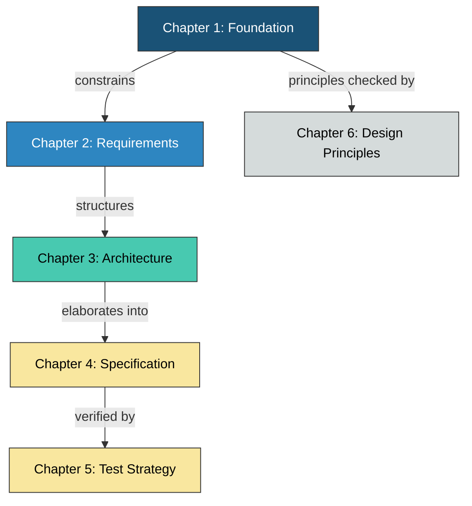
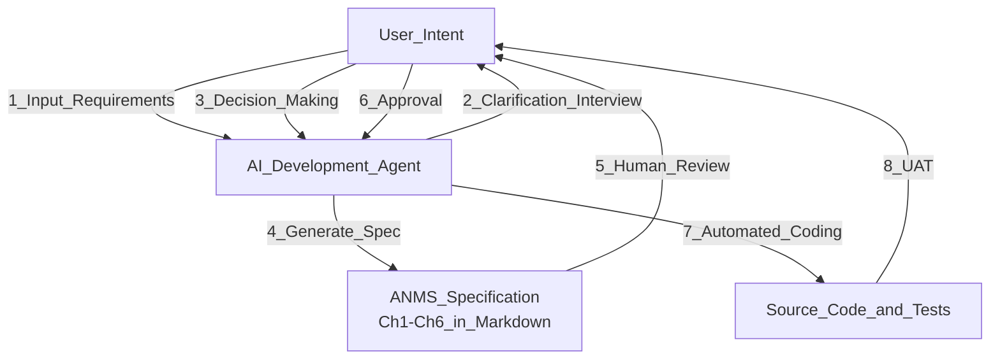
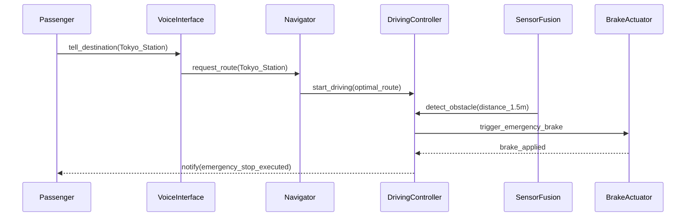

# A Specification Template for the Age of AI-Driven Software Development

## Abstract

The rapid evolution of Large Language Models (LLMs) is shifting software development from an era where humans write code to one where AI interprets specifications and generates code. However, traditional heavyweight specifications are redundant for AI, while fragmented instructions lead to "context loss" that undermines system-wide consistency. This paper proposes a new specification template called "AI-Native Minimal Spec (ANMS)" — a shared design foundation for humans and AI that enables near-fully-automated development. ANMS adopts a chapter structure called "STFB (Stable Top, Flexible Bottom)" based on the Stable Dependencies Principle, and combines EARS, Gherkin, and Mermaid to achieve both logical rigor and visual design synchronization. The goal is to maximize human review efficiency and AI implementation accuracy.

This proposal is positioned as the first level of a three-level specification hierarchy scaled by project size. The three levels are: ANMS (single file, fits in one context window), ANPS (AI-Native Plural Spec: multiple file split, medium-scale), and ANGS (AI-Native Graph Spec: GraphDB-based, large-scale) [2]. All three share the STFB design principle. This paper defines ANMS and also describes the scaling path to ANPS and ANGS.

## Keywords

LLM-driven Development, AI-Native Specification, Requirements Engineering, EARS, Gherkin, Mermaid, STFB, Human-in-the-Loop

## Introduction

Traditional software specifications (e.g., IEEE 830) were designed primarily for human-to-human communication. In AI-driven development, however, a specification serves as a "source of prompts" and an "acceptance inspection document" for evaluating the correctness of generated implementations.

The current problems boil down to two issues:

1. **Verbosity vs. Cost Gap:** Rigorous standards (IEEE 29148, AUTOSAR SRS, etc.) impose extremely high documentation costs, hindering the pace of agile AI-driven development.
2. **Ambiguity-Induced Hallucination:** When instructions are given only in natural language, AI may independently infer system constraints and boundary conditions, embedding unintended behavior (faults).

This paper defines a hierarchical specification format that achieves maximum control with minimal documentation. The chapter structure of the proposed ANMS is summarized below (see the template itself, process-rules/spec-template-en.md, for full details).

| Chapter | Name                         | Role                                          | Stability        |
| ------- | ---------------------------- | --------------------------------------------- | ---------------- |
| 1       | Foundation                   | Project's "North Star." Prerequisite for all  | Most stable      |
| 2       | Requirements                 | Requirement definition via EARS + formulas     | Stable           |
| 3       | Architecture                 | Visualizing structure and decisions via Mermaid| Moderately stable|
| 4       | Specification                | Concrete acceptance criteria via Gherkin       | Frequently changes|
| 5       | Test Strategy                | Test-level policies and matrices               | Frequently changes|
| 6       | Design Principles Compliance | Verification against SW design principles      | Updated at review|

## Proposed Approach

### STFB — Stable Top, Flexible Bottom

The defining feature of the proposed "AI-Native Minimal Spec (ANMS)" is its chapter structure inspired by Robert C. Martin's Stable Dependencies Principle (SDP): **STFB (Stable Top, Flexible Bottom)**.

Higher chapters are more stable with lower change frequency; lower chapters are more concrete with higher change frequency. Changes to upper chapters require reviewing lower chapters, but changes to lower chapters do not affect upper chapters. This unidirectional dependency makes the blast radius of changes predictable and structurally signals the priority of context that AI should reference.

**STFB_Layer_Structure:**



The diagram above shows the STFB layer structure. Concreteness increases from Ch1 (most stable) to Ch4 (most volatile). Ch5 verifies Ch4, and Ch6 provides quality assurance at a meta-level across all chapters.

### Hybrid Notation Across Four Layers

ANMS separates information into four layers — "Foundation," "Requirements," "Structure," and "Concrete Behavior" — assigning the optimal notation to each.

| Layer         | Primary Notation          | Role                                                    |
| ------------- | ------------------------- | ------------------------------------------------------- |
| Foundation    | Natural language + Tables | Humans define the project's boundaries and assumptions  |
| Requirements  | EARS + Formulas           | Requirements are pattern-coded for unambiguous precision |
| Architecture  | Mermaid (color-coded)     | Visually sync responsibility separation and dependency direction with AI |
| Specification | Gherkin                   | Acceptance criteria that AI directly uses for test code generation       |

### Specification Lifecycle

ANMS is not a static document. It is operated as a "Living Documentation" — a dynamic blueprint where humans present requirements and AI fills in the diagrams and logic through dialogue.

**Proposed_Specification_Lifecycle:**



The above shows the proposed specification lifecycle, from user intent through spec generation, coding, and UAT.

### Design Intent of Each Chapter

#### Chapter 1. Foundation

The project's "North Star." It consists of 9 sections: Background, Issues, Goals, Approach, Scope, Constraints, Limitations, Glossary, and Notation. Three sections play a particularly important role in AI-driven development:

- **Glossary:** Aligns vocabulary between AI and humans. Explicitly defining domain-specific terms prevents AI misinterpretation.
- **Notation:** Compliant with RFC 2119/8174. Defines keywords: SHALL/MUST = mandatory, SHOULD = recommended, MAY = optional. Explicitly states that `shall` in EARS syntax is synonymous with SHALL.
- **Limitations:** Makes explicit the "known compromises" that sit between Scope (what we won't do) and Constraints (what we can't break). Prevents AI from pursuing perfect implementations and falling into over-engineering.

#### Chapter 2. Requirements

Uses EARS syntax as the primary format, supplemented by formulas, tables, and diagrams as appropriate. EARS provides 6 patterns (Ubiquitous, Event-driven, State-driven, Unwanted Behavior, Optional Feature, Complex) to eliminate natural language ambiguity. Mathematical requirements (performance targets, thresholds, etc.) that EARS cannot fully express are permitted in formula notation.

#### Chapter 3. Architecture

Visualizes software structure using Mermaid: component diagrams, class diagrams, sequence diagrams, and state transition diagrams. Color-coding by architecture layer is mandatory for component and class diagrams. Because Mermaid has weak layout control, without color-coding, responsibility boundaries become visually indistinguishable. The default legend uses Clean Architecture's four layers (Entity / Use Case / Adapter / Framework), which can be replaced with a custom legend for other architectures.

Design decisions are placed within this chapter as ADRs (Architecture Decision Records). This keeps design and rationale together; relegating them to an appendix risks breaking the reference chain.

#### Chapter 4. Specification

Defines UAT (User Acceptance Testing) acceptance criteria in Gherkin format. It concretizes Ch2 requirements into verifiable scenarios, with each scenario annotated with a requirement ID in `(traces: FR-xxx)` format to ensure traceability. Test results (PASS / CONDITIONAL / FAIL / SKIP) are recorded directly below each scenario, creating a structure that's easy for AI to fill in and for humans to review.

#### Chapter 5. Test Strategy

Defines test-level policies and matrices. Detailed test case design is delegated to AI; this chapter only defines "what to test at which level." This creates a clear division of labor: humans focus on test strategy while AI handles the mass production of test cases.

#### Chapter 6. Design Principles Compliance

A quality assurance layer at a different meta-level from the "define, design, verify" cycle of Ch1-5. It uses a checklist format to verify compliance with 24 software design principles including KISS, YAGNI, DRY, and SOLID. It structures the review perspectives humans use to check whether AI-generated code is engineeringly sound.

## Methods

To validate this proposal, we surveyed major specification formats and frameworks currently in circulation.

- **IEEE 29148:** International standard for requirements engineering. Defines requirement quality (unambiguity, verifiability) but imposes high documentation costs, making it too heavyweight for practical use.
- **arc42:** Architecture-centric template. Highly compatible with Markdown and excellent for defining structure.
- **RFC (Request for Comments):** IETF's standardization process, specialized in sharing design intent. Rich in context around "why this design was chosen."
- **Gherkin (BDD):** Executable specifications. Extremely AI-compatible for test code generation (test-driven development).
- **EARS (Easy Approach to Requirements Syntax):** Concise natural language patterns. Well-suited for rigorously defining system rules, exception handling, and state-dependent behavior.

## Results

The comparison results of the surveyed specification formats are shown below.

**Comparison of Specification Formats:**

| Format          | Coverage | Doc Cost | Human Readability | AI Suitability | Notes                              |
| :-------------- | :------: | :------: | :---------------: | :------------: | :--------------------------------- |
| IEEE 29148      |    A     |   High   |         C         |       C        | Rigorous but verbose for AI        |
| arc42           |    B     |  Medium  |         B         |       B        | Optimal for structural grasp       |
| RFC             |    C     |   Low    |         A         |       C        | Good for intent sharing, lacks structure |
| Gherkin         |    C     |  Medium  |         A         |       A        | Directly linked to test generation |
| **ANMS (ours)** |  **A**   |  **Low** |       **A**       |     **A**      | **STFB + hybrid notation**         |

Our analysis revealed that no single format can cover the entire AI development lifecycle. Therefore, we concluded that a "hybrid format" — combining EARS for high-level requirements, Gherkin for detailed behavior, and Mermaid for structural understanding — is optimal (most efficient) for AI-driven development. Furthermore, arranging these in stability order according to the STFB principle enables structural control over the blast radius of changes.

## Discussion

This section discusses the validity of the proposed format and design considerations for AI-driven development.

### 1. Change Resilience Through STFB

Traditional specifications lack a design principle governing chapter order, creating a risk that a single change ripples across the entire document. With STFB, the Stable Dependencies Principle ensures that changes always propagate only downward. For example, adding or modifying Gherkin scenarios (Ch4) does not affect Foundation (Ch1) or Requirements (Ch2). This is also beneficial for AI, minimizing the scope of context that needs to be reloaded upon changes.

### 2. Diagrams (Mermaid) ARE the Design

In AI-driven development, Mermaid diagrams are not mere supplements — they are the software design itself. Humans struggle to spot design flaws (such as overlapping responsibilities) in thousands of lines of code, but diagrams allow them to instantly recognize structural distortions. For AI too, the structured text of diagram data serves as a powerful constraint (blueprint) for determining accurate class composition, file partitioning, and inheritance relationships. Making layer color-coding mandatory ensures this visual design synchronization.

### 3. The "Bare Minimum" Human Role

Even in fully automated development, three steps must remain human-driven:

1. **Presenting Requirements:** Defining the software concept and the problems to solve (Ch1 Foundation).
2. **Critical Decision-Making:** Final judgment at technology selection and specification branch points (Ch3 Architecture Decisions).
3. **Acceptance Testing (UAT):** Final approval of whether deliverables meet business requirements (Ch4 Specification Result judgment).

### 4. Mathematical Validity Definition

For a set of requirements $R$ (Requirements), each individual requirement $r$ (requirement) $r \in R$ to be valid (Valid), the following condition must hold:

$$
\forall r \in R, \quad Valid(r) \iff Unambiguous(r) \land Verifiable(r)
$$

Here, $Valid(r)$ means "a state where AI can implement without ambiguity and can automatically determine correctness." EARS ensures "unambiguity ( $Unambiguous$ )" and Gherkin ensures "verifiability ( $Verifiable$ )," satisfying this mathematical condition and enabling automatic verification of AI-generated code correctness. Ch6's Design Principles Compliance functions as a complementary layer, ensuring that implementations generated from these valid requirements are also engineeringly sound.

## Scaling: Three-Level Spec Hierarchy

ANMS was designed under the assumption that the specification fits in a single context window. For projects where this assumption breaks down, we define a three-level scaling path.

| Level | Abbreviation | Full Name | Representation | Scale |
|:-----:|------|----------|------|------|
| 1 | ANMS | AI-Native Minimal Spec | Single Markdown file | Fits in one context window |
| 2 | ANPS | AI-Native Plural Spec | Multiple Markdown files + Common Block | Does not fit, no GraphDB needed |
| 3 | ANGS | AI-Native Graph Spec | GraphDB + Git (MD is a view) | Large-scale |

**Design principles shared across all three levels:**

- All levels share the STFB (Stable Top, Flexible Bottom) chapter structure
- Each upper level is an extension of the lower level, not a replacement
- The appropriate level is selected at project start based on scale assessment

**ANPS (Level 2) Overview:**

ANPS preserves the STFB structure of ANMS while splitting chapters into separate files. The split boundary follows ownership: spec-foundation (Ch1-2: created by srs-writer) and spec-architecture (Ch3-6: elaborated by architect). Each file carries a Common Block (document identification, state, workflow) and Form Block (type-specific structured fields) to ensure agent coordination through document structure.

**ANGS (Level 3) Overview:**

ANGS moves the specification body from Markdown to GraphDB, redefining Markdown as a view. It conceptualizes Markdown, GraphDB, and Git as a triangular categorical relationship and achieves context minimization via the forgetful functor. See [2] for details.

## Conclusion

This paper proposed the "ANMS" template for near-fully-automated AI development. The STFB (Stable Top, Flexible Bottom) chapter structure provides structural control over change blast radius, while the EARS / Gherkin / Mermaid hybrid notation enables specification in the optimal format for each layer. The 6-chapter structure (Foundation / Requirements / Architecture / Specification / Test Strategy / Design Principles Compliance) covers the full lifecycle of definition, design, verification, and quality assurance while remaining concise enough to fit within AI context windows. By operating this format as "Living Documentation," it enables development that is resilient to specification changes and maximizes the accuracy of AI-generated implementations.

## References

1. Martin, R.C. "[The Clean Architecture](https://blog.cleancoder.com/uncle-bob/2012/08/13/the-clean-architecture.html)" — Stable Dependencies Principle (SDP), Stable Abstractions Principle (SAP)
2. ANGS (AI-Native Graph Spec) — Specification Management and Agent Coordination via Graph Structure (angs-essay.md)
3. Mavin, A., et al. "[EARS: Easy Approach to Requirements Syntax](https://ieeexplore.ieee.org/document/5328509)" — IEEE, 2009
4. Cucumber. "[Gherkin Reference](https://cucumber.io/docs/gherkin/reference/)"
5. Starke, G. "[arc42 Architecture Template](https://arc42.org/)"
6. ISO/IEC/IEEE. "[29148:2018 — Requirements Engineering](https://www.iso.org/standard/72089.html)"
7. Bradner, S. "[RFC 2119 — Key words for use in RFCs to Indicate Requirement Levels](https://datatracker.ietf.org/doc/html/rfc2119)" — IETF, 1997
8. Leiba, B. "[RFC 8174 — Ambiguity of Uppercase vs Lowercase in RFC 2119 Key Words](https://datatracker.ietf.org/doc/html/rfc8174)" — IETF, 2017
9. Nygard, M. "[Documenting Architecture Decisions](https://cognitect.com/blog/2011/11/15/documenting-architecture-decisions)" — ADR format reference

## Appendix

### Appendix A: EARS Syntax Patterns

Using the following patterns when instructing AI eliminates ambiguity.

| Pattern           | Syntax                                                                   | Use Case                      |
| ----------------- | ------------------------------------------------------------------------ | ----------------------------- |
| Ubiquitous        | The [System] shall [Response].                                           | Requirements that always hold |
| Event-driven      | **When** [Trigger], the [System] shall [Response].                       | Event-triggered requirements  |
| State-driven      | **While** [In State], the [System] shall [Response].                     | State-dependent requirements  |
| Unwanted Behavior | **If** [Trigger], then the [System] shall [Response].                    | Exception / error handling    |
| Optional Feature  | **Where** [Feature is included], the [System] shall [Response].          | Optional / conditional features|
| Complex           | **When** [Trigger], **while** [In State], the [System] shall [Response]. | Compound-condition requirements|

### Appendix B: Autonomous Driving Spec Example Using ANMS

The following example derives a specification from the concept of "a car with a personal chauffeur," structured along the ANMS chapter layout. It demonstrates how to structure specifications starting from user experience rather than technical implementation details.

````markdown
**1. Foundation**

- **Background:** Affluent customers desire the experience of a personal chauffeur — just tell it where to go, and it delivers you safely, comfortably, and on time. However, hiring a human chauffeur is expensive, and 24/7 availability is impractical.
- **Issues:** Human chauffeurs are inconsistent due to fatigue and health conditions. Late-night and early-morning availability is limited.
- **Goals:** Deliver the "just tell it where to go" experience without a human chauffeur, 24 hours a day, 365 days a year.
- **Approach:** Autonomous driving software. Three-layer architecture: environment perception via sensor fusion (LiDAR + camera), route planning, and vehicle control.
- **Scope:** In-scope: Autonomous driving on public roads and highways, destination setting via passenger dialogue. Out-of-scope: Unpaved roads, snow-covered surfaces.
- **Constraints:** Emergency brake response time must be within 100ms (traffic law and ISO 22737 compliance).
- **Limitations:** The system will stop autonomous driving and pull over safely in severe weather (heavy rain, dense fog). Full all-weather support is deferred to a future version.
- **Glossary:** Chauffeur Mode = A driving mode where the passenger only provides a destination, and the system handles route selection, driving operations, and parking entirely.

**2. Requirements (EARS)**

- **Ubiquitous:** The System shall prioritize passenger safety above all else and comply with traffic laws.
- **Event-driven:** When the passenger gives a voice command for a destination, the System shall calculate the optimal route and begin driving after confirmation.
- **Event-driven:** When an obstacle is detected within 2m ahead, the System shall immediately activate emergency braking.
- **State-driven:** While operating in Chauffeur Mode, the System shall display the current location and estimated arrival time to the passenger.
- **Unwanted Behavior:** If a sensor anomaly is detected, then the System shall pull over to a safe roadside location and notify the passenger of the situation.
- **Complex:** When the destination is reached, while a parking space is available, the System shall execute automated parking.

**3. Architecture**

**Chauffeur_Mode_Sequence:**



**4. Specification (Gherkin)**

```gherkin
Feature: Chauffeur Mode

  Background:
    Given the vehicle is started in Chauffeur Mode

  Rule: Autonomous driving by destination instruction

    Scenario: SC-001 Start driving by voice destination command (traces: FR-002)
      Given the vehicle is stationary
      When the passenger gives a voice command "Take me to Tokyo Station"
      Then the System calculates the optimal route and displays it on screen
      And the System begins driving after passenger confirmation

  Rule: Passenger safety assurance

    Scenario: SC-002 Emergency stop on detecting a forward obstacle (traces: FR-003)
      Given the vehicle is driving at 40km/h in Chauffeur Mode
      When a pedestrian is detected 1.5m ahead
      Then the System activates emergency braking within 100ms
      And the vehicle comes to a safe stop
      But the risk of passenger injury from sudden braking is minimized

    Scenario: SC-003 Safe pullover on sensor anomaly (traces: FR-005)
      Given the vehicle is driving in Chauffeur Mode
      When a LiDAR sensor anomaly is detected
      Then the System pulls over to a safe roadside location
      And the System notifies the passenger "Stopped due to sensor anomaly"
```

**Result:** PASS  CONDITIONAL  FAIL  SKIP
**Remark:**
````

### Appendix C: Example Prompt for AI

> "Read the attached ANMS specification. First, propose a directory structure based on the architecture diagrams (Mermaid). After approval, generate the implementation and test code that passes the Gherkin scenarios."
