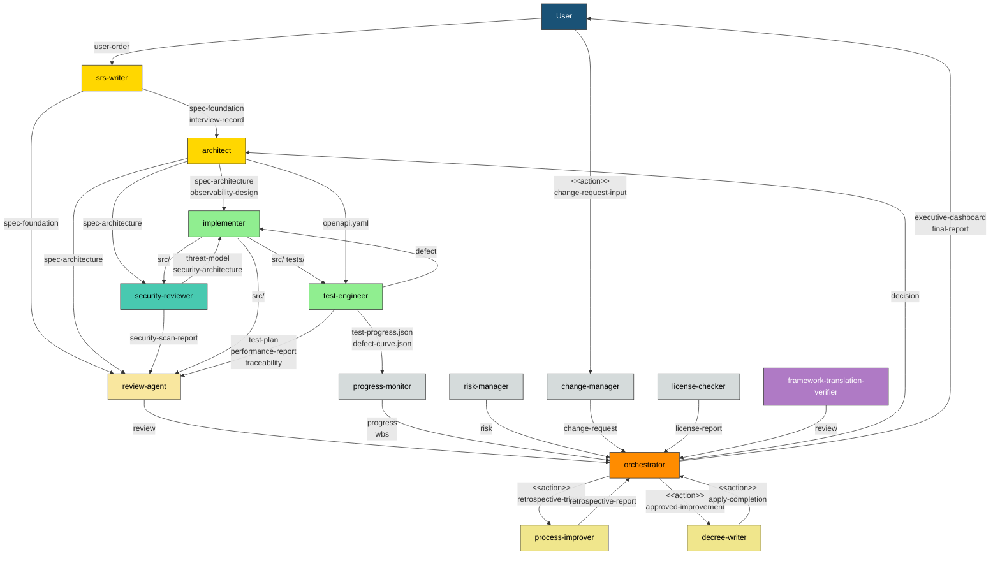
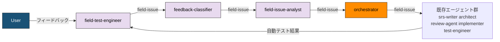
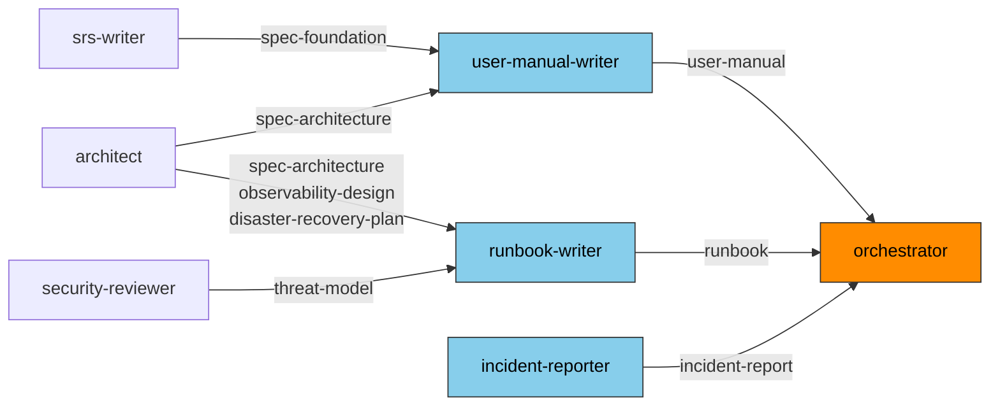
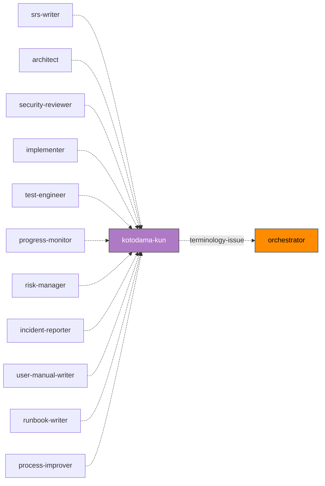

# エージェント一覧

> **本文書の位置づけ:** full-auto-dev フレームワークに登録された全エージェントの一覧（Single Source of Truth）。エージェントの追加・変更・削除時に本文書を更新する。
> **導出元:** [プロセス規則](full-auto-dev-process-rules.md) §2-4, §7, §9 / [文書管理規則](full-auto-dev-document-rules.md) §7, §7.1, §11
> **関連文書:** [プロンプト構造規約](prompt-structure.md)、各エージェントプロンプト（`.claude/agents/*.md`）

---

## 1. エージェント一覧

| # | name | 役割 | model | 主要フェーズ |
|:-:|------|------|:-----:|------------|
| 1 | orchestrator | プロジェクト全体のオーケストレーション、フェーズ遷移制御、意思決定記録 | opus | 全フェーズ |
| 2 | srs-writer | ユーザーコンセプトの構造化、インタビュー、仕様書 Ch1-2 作成 | opus | planning |
| 3 | architect | 仕様書 Ch3-6 詳細化、OpenAPI・可観測性・外部依存要求の設計 | opus | design |
| 4 | security-reviewer | 脅威モデリング、セキュリティ設計、脆弱性スキャン | opus | design, implementation |
| 5 | implementer | ソースコード実装、単体テスト作成 | opus | implementation |
| 6 | test-engineer | テスト計画・実行、カバレッジ計測、性能テスト | sonnet | testing |
| 7 | review-agent | R1-R6 観点での品質レビュー、品質ゲート判定 | opus | 全フェーズ（ゲート時） |
| 8 | progress-monitor | WBS管理、進捗追跡、品質メトリクス監視、異常検知 | sonnet | design 以降 |
| 9 | change-manager | ユーザー起点の変更要求の受付・影響分析・記録 | sonnet | planning 以降（仕様承認後） |
| 10 | risk-manager | リスク特定・評価・監視、リスク台帳管理 | sonnet | planning 以降 |
| 11 | license-checker | OSS ライセンス互換性確認、帰属表示管理 | haiku | implementation, delivery |
| 12 | kotodama-kun | 用語・命名の整合性チェック（フレームワーク用語集 + プロジェクト用語集） | haiku | 全フェーズ（Out 生成時） |
| 13 | framework-translation-verifier | フレームワーク文書の多言語間翻訳一致性を検証 | sonnet | delivery（リリース前） |
| 14 | user-manual-writer | ユーザーマニュアルの作成 | sonnet | delivery |
| 15 | runbook-writer | 運用手順書（Runbook）の作成 | sonnet | delivery |
| 16 | incident-reporter | インシデント報告書の作成 | sonnet | operation |
| 17 | process-improver | ふりかえり・根本原因分析・プロセス改善策の提案 | sonnet | 全フェーズ（フェーズ完了時） |
| 18 | decree-writer | 承認済み改善策のガバナンスファイルへの安全な適用 | sonnet | 全フェーズ（フェーズ完了時） |
| 19 | field-test-engineer | ユーザーとの実機テスト、フィードバック記録、修正後の実機検証 | sonnet | testing（条件付き: 実機テスト有効時） |
| 20 | feedback-classifier | フィードバックを仕様書と照合し defect / CR / 質問に分類、チケット起票 | sonnet | testing（条件付き: 実機テスト有効時） |
| 21 | field-issue-analyst | 原因分析（defect）、対策立案（defect / CR）、影響範囲・副作用・代替案比較 | opus | testing（条件付き: 実機テスト有効時） |

---

## 2. file_type オーナーシップマトリクス

文書管理規則 §11 から導出。**各 file_type には唯一の owner が存在する。**

### orchestrator

| file_type | ディレクトリ | 単/連 | 主要フェーズ |
|-----------|------------|:-----:|------------|
| pipeline-state | project-management/ | 単 | 全フェーズ |
| executive-dashboard | ルート | 単 | setup 以降 |
| final-report | ルート | 単 | delivery |
| decision | project-records/decisions/ | 連 | 全フェーズ |
| handoff | project-management/handoff/ | 連 | 全フェーズ |
| stakeholder-register | project-management/ | 単 | setup |

### srs-writer

| file_type | ディレクトリ | 単/連 | 主要フェーズ |
|-----------|------------|:-----:|------------|
| user-order | ルート | 単 | planning（バリデーション） |
| interview-record | project-management/ | 単 | planning |
| spec-foundation | docs/spec/ | 単 | planning |

> srs-writer は user-order のバリデーションのみを担当し、user-order 自体は修正しない。初期作成はユーザーが行う。バリデーションで発見された不足はインタビューで解消し、spec-foundation に反映する。

### architect

| file_type | ディレクトリ | 単/連 | 主要フェーズ |
|-----------|------------|:-----:|------------|
| spec-architecture | docs/spec/ | 単 | design |
| observability-design | docs/observability/ | 単 | design |
| hw-requirement-spec | docs/hardware/ | 単 | design（条件付き） |
| ai-requirement-spec | docs/ai/ | 単 | design（条件付き） |
| framework-requirement-spec | docs/framework/ | 単 | design（条件付き） |
| disaster-recovery-plan | docs/operations/ | 単 | design |

> architect は上記 file_type に加え、openapi.yaml（docs/api/）を生成・管理する。openapi.yaml は外部ツール規定形式（文書管理規則 §13）であり file_type ではないが、implementer と test-engineer が消費する。

### security-reviewer

| file_type | ディレクトリ | 単/連 | 主要フェーズ |
|-----------|------------|:-----:|------------|
| threat-model | docs/security/ | 単 | design |
| security-architecture | docs/security/ | 単 | design |
| security-scan-report | project-records/security/ | 連 | implementation 以降 |

### implementer

| file_type | ディレクトリ | 単/連 | 主要フェーズ |
|-----------|------------|:-----:|------------|
| （ソースコード） | src/ | — | implementation |
| （単体テスト） | tests/ | — | implementation |

> implementer はコード（src/, tests/）を生成するが、これらは Common Block 管理対象外。トレーサビリティは traceability-matrix で管理する。

### test-engineer

| file_type | ディレクトリ | 単/連 | 主要フェーズ |
|-----------|------------|:-----:|------------|
| test-plan | project-management/ | 単 | design |
| defect | project-records/defects/ | 連 | testing |
| traceability | project-records/traceability/ | 単 | implementation 以降 |
| performance-report | project-records/performance/ | 連 | testing |

> test-engineer は上記 file_type に加え、test-progress.json と defect-curve.json（project-management/progress/）を生成する。これらは JSON 時系列データであり file_type（Common Block 管理対象）ではないが、progress-monitor が消費する。

### review-agent

| file_type | ディレクトリ | 単/連 | 主要フェーズ |
|-----------|------------|:-----:|------------|
| review | project-records/reviews/ | 連 | 全フェーズ（ゲート時） |

### progress-monitor

| file_type | ディレクトリ | 単/連 | 主要フェーズ |
|-----------|------------|:-----:|------------|
| progress | project-management/progress/ | 連 | design 以降 |
| wbs | project-management/progress/ | 単 | design 以降 |

### change-manager

| file_type | ディレクトリ | 単/連 | 主要フェーズ |
|-----------|------------|:-----:|------------|
| change-request | project-records/change-requests/ | 連 | planning 以降（仕様承認後） |

### risk-manager

| file_type | ディレクトリ | 単/連 | 主要フェーズ |
|-----------|------------|:-----:|------------|
| risk | project-records/risks/ | 連 | planning 以降 |

### license-checker

| file_type | ディレクトリ | 単/連 | 主要フェーズ |
|-----------|------------|:-----:|------------|
| license-report | project-records/licenses/ | 単 | implementation, delivery |

### kotodama-kun

> kotodama-kun は file_type を所有しない。チェック報告は軽微な場合 orchestrator への口頭報告、重大な場合 review として project-records/reviews/ に記録する（review-agent の file_type を借用）。

| 入力 | 提供元 | 用途 |
|------|--------|------|
| （チェック対象の成果物） | 各エージェント | 用語・命名チェック対象 |
| glossary.md | framework | フレームワーク用語集との照合 |
| spec-foundation (Ch1.8 Glossary) | srs-writer | プロジェクト用語集との照合 |
| full-auto-dev-document-rules.md §7 | framework | file_type 名・名前空間の正式定義 |

### framework-translation-verifier

> framework-translation-verifier は file_type を所有しない。検証結果は review として project-records/reviews/ に記録する（review-agent の file_type を借用）。

| 入力 | 提供元 | 用途 |
|------|--------|------|
| 多言語ファイルペア | framework | 翻訳一致性の検証対象 |
| process-rules/, essays/, README 等 | framework | 構造・テーブル・リンク・コードブロック・用語の一致検証 |

### user-manual-writer

| file_type | ディレクトリ | 単/連 | 主要フェーズ |
|-----------|------------|:-----:|------------|
| user-manual | docs/ | 単 | delivery |

### runbook-writer

| file_type | ディレクトリ | 単/連 | 主要フェーズ |
|-----------|------------|:-----:|------------|
| runbook | docs/operations/ | 単 | delivery |

### incident-reporter

| file_type | ディレクトリ | 単/連 | 主要フェーズ |
|-----------|------------|:-----:|------------|
| incident-report | project-records/incidents/ | 連 | operation |

### process-improver

| file_type | ディレクトリ | 単/連 | 主要フェーズ |
|-----------|------------|:-----:|------------|
| retrospective-report | project-records/improvement/ | 連 | 全フェーズ（フェーズ完了時） |

### decree-writer

> decree-writer は file_type を所有しない。適用結果の before/after diff は project-records/improvement/ に記録する（retrospective-report の補足として）。

| 入力 | 提供元 | 用途 |
|------|--------|------|
| retrospective-report | process-improver | 適用すべき改善策の参照 |
| decision | orchestrator | 承認記録の確認 |

### field-test-engineer（条件付き: 実機テスト有効時）

| file_type | ディレクトリ | 単/連 | 主要フェーズ |
|-----------|------------|:-----:|------------|
| field-issue | project-records/field-issues/ | 連 | testing |

> field-test-engineer は field-issue の owner。feedback-classifier と field-issue-analyst はチケットに追記する形で情報を蓄積する。詳細は [実機テスト フィードバック管理規則](field-issue-handling-rules.md) を参照。

### feedback-classifier（条件付き: 実機テスト有効時）

> feedback-classifier は file_type を所有しない。field-test-engineer が作成した field-issue チケットに分類結果（`field-issue:type`）を追記する。

| 入力 | 提供元 | 用途 |
|------|--------|------|
| field-issue（reported） | field-test-engineer | 分類対象のフィードバック |
| spec-foundation | srs-writer | 仕様照合（Ch1-2: 要求定義） |
| spec-architecture | architect | 仕様照合（Ch3-6: 設計仕様） |

### field-issue-analyst（条件付き: 実機テスト有効時）

> field-issue-analyst は file_type を所有しない。field-test-engineer が作成した field-issue チケットに原因分析・対策立案の結果を追記する。

| 入力 | 提供元 | 用途 |
|------|--------|------|
| field-issue（classified） | feedback-classifier | 分類済みのフィードバック |
| src/ | implementer | 原因分析対象のソースコード |
| spec-foundation, spec-architecture | srs-writer, architect | 影響分析・仕様書更新要否の判定 |

---

## 3. エージェント間データフロー

file_type およびアクションの流れでエージェント間の依存関係を示す。

**エージェント間データフロー:**

上図はプロセス規約から導出したエージェント間のメインデータフローを示す。矢印のラベルは受け渡される file_type またはアクションを示す。DocWriter系（文書作成エージェント）、kotodama-kun（用語チェック）、実機テスト系は別図を参照。

**実機テスト系（条件付き: 実機テスト有効時）:**

紫色のノードが実機テスト系の新規エージェント。条件付きプロセス「実機テスト」が有効な場合にのみアクティベートされる。ステータス遷移の詳細（13 ステータス・12 ゲート）は [実機テスト フィードバック管理規則](field-issue-handling-rules.md) を参照。

**DocWriter系（文書作成エージェント）:**

delivery フェーズで user-manual-writer と runbook-writer が起動される。入力として上流エージェントの設計文書を参照し、成果物を orchestrator に納品する。incident-reporter は operation フェーズで起動される。

**kotodama-kun（用語チェック）:**

Out を生成する全エージェントが受け渡し前に kotodama-kun へ用語チェックを依頼する。重大な用語不整合は review file_type として orchestrator に報告される。詳細は各エージェント定義の Procedure を参照。

**ラベルの区別:**

| ラベル形式 | 意味 | 例 |
|-----------|------|-----|
| `file_type名` | file_type の受け渡し（ファイル成果物） | `spec-foundation`, `review`, `retrospective-report` |
| `<<action>> 名前` | ファイル成果物を伴わないアクション/トリガー | `<<action>> retrospective-trigger`, `<<action>> approved-improvement` |

**アクション一覧:**

| アクションラベル | 発信元 | 受信先 | 説明 |
|----------------|--------|--------|------|
| change-request-input | User | change-manager | ユーザー起点の変更要求（受付後 change-request file_type として記録） |
| retrospective-trigger | orchestrator | process-improver | フェーズ完了時のふりかえり起動指示 |
| approved-improvement | orchestrator | decree-writer | 承認済み改善策の適用指示（decision 記録が根拠） |
| apply-completion | decree-writer | orchestrator | 改善策の適用完了報告（before/after diff は project-records/improvement/ に記録） |

**kotodama-kun（用語チェック）について:**

kotodama-kun は図中に矢印を持たないが、Out を生成する全エージェントが受け渡し前に用語チェックを依頼する。詳細は各エージェント定義の Procedure を参照。重大な用語不整合は review file_type として orchestrator に報告される。

kotodama-kun を**使用しない**エージェント:

| エージェント | 理由 |
|------------|------|
| orchestrator | 自身は file_type の内容を生成しない（管理・転送のみ） |
| review-agent | 他エージェントの成果物を評価する側 |
| change-manager | ユーザー起点の変更要求を記録するだけで用語創出が少ない |
| license-checker | 外部ライセンス名をそのまま記録 |
| framework-translation-verifier | 翻訳一致性の検証が主務。用語定義自体は変更しない |
| decree-writer | 承認済み改善策を適用するだけで新規用語を生成しない |
| feedback-classifier | 仕様書との照合・分類判定のみで用語創出が少ない |
| field-issue-analyst | 原因分析・対策立案で既存用語を使用するのみ |
| field-test-engineer | 実機テストの速報的なチケットを記録するのみで用語創出が少ない |

---

## 4. フェーズ別アクティベーションマップ

どのエージェントがどのフェーズで起動されるか。

| フェーズ | 起動されるエージェント | 品質ゲート |
|---------|---------------------|-----------|
| setup | orchestrator | CLAUDE.md 承認 |
| planning | orchestrator, srs-writer, kotodama-kun, review-agent, process-improver, decree-writer | R1 PASS → 仕様書承認 |
| dependency-selection | orchestrator, architect, kotodama-kun, license-checker | ユーザー選定承認 |
| design | orchestrator, architect, security-reviewer, kotodama-kun, progress-monitor, risk-manager, review-agent, process-improver, decree-writer | R2/R4/R5 PASS |
| implementation | orchestrator, implementer, test-engineer(単体), security-reviewer(SCA), kotodama-kun, license-checker, review-agent, progress-monitor, process-improver, decree-writer | R2/R3/R4/R5 PASS, SCA クリア |
| testing | orchestrator, test-engineer, kotodama-kun, review-agent, progress-monitor, process-improver, decree-writer, field-test-engineer(条件付き), feedback-classifier(条件付き), field-issue-analyst(条件付き) | R6 PASS, 全テスト PASS |
| delivery | orchestrator, kotodama-kun, review-agent, license-checker, framework-translation-verifier, user-manual-writer, runbook-writer, process-improver, decree-writer | R1-R6 全 PASS, 翻訳一致性検証 PASS, ユーザー受入 |
| operation | orchestrator, security-reviewer(パッチ), progress-monitor, incident-reporter, process-improver, decree-writer | SLA 達成 |

---

## 5. 新規エージェント追加手順

1. 本名簿の §1 にエージェントを追加する
2. 担当する file_type を §2 に追加する（既存エージェントとの重複がないことを確認）
3. §3 のデータフロー図を更新する
4. §4 のアクティベーションマップを更新する
5. [プロンプト構造規約](prompt-structure.md) に従い `.claude/agents/{name}.md` を作成する
6. 文書管理規則 §7（file_type テーブル）、§7.1（ワークフロー参照テーブル）、§11（オーナーシップモデル）を更新する
