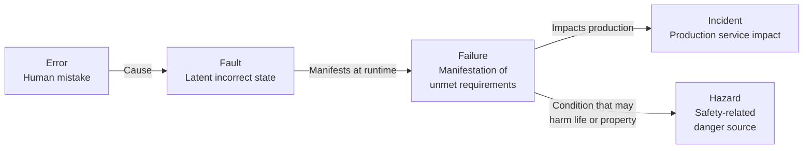
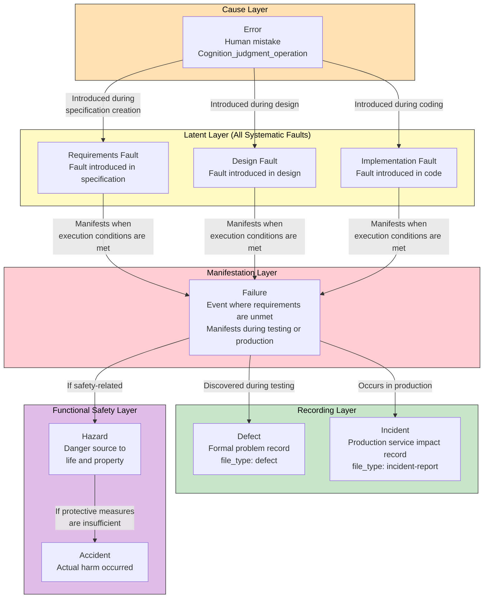
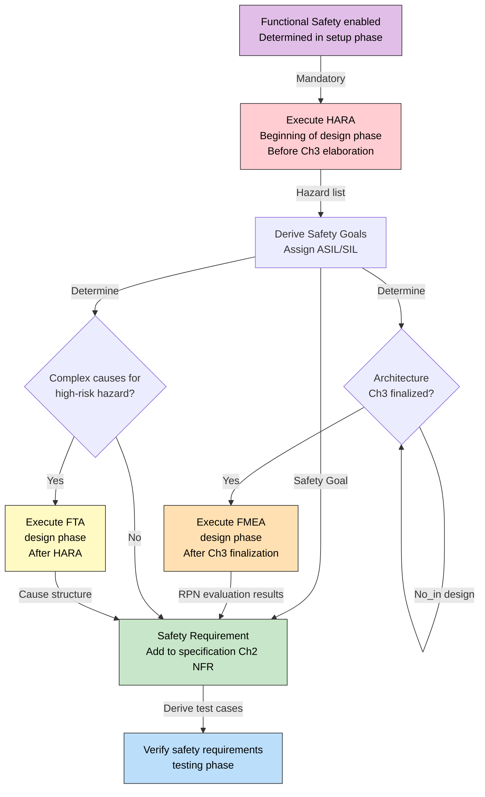
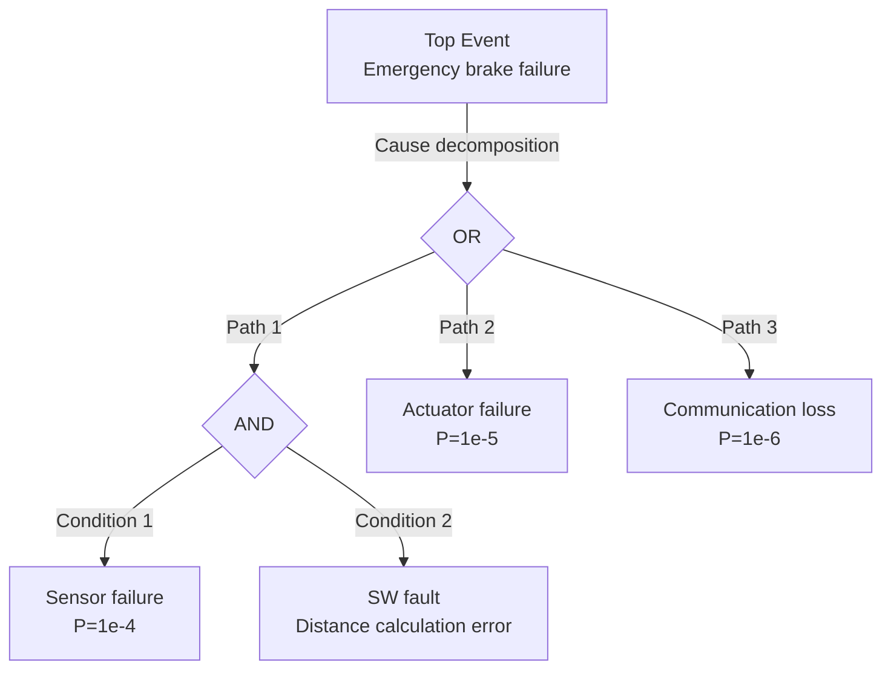

``````markdown
# Defect Taxonomy — Systematic Organization of Defect-Related Terms

## 1. Background and Purpose

In software development, numerous terms exist to describe "defects," and their meanings vary by context. This document references IEEE 1044, IEC 61508, ISO 26262, and ITIL to uniquely define defect-related terms used in the full-auto-dev framework.

**Design Principle:** Since Japanese terms for defects are ambiguous and polysemous, this framework **uses the English terms as-is** to eliminate ambiguity.

---

## 2. Causal Chain Model (IEEE 1044 / IEC 61508)

**Causal Chain:**



An Error produces a Fault; a Fault manifests at runtime to become a Failure; when a Failure impacts production services, it becomes an Incident. When a Failure has conditions that may harm life or property, it is called a Hazard (in the context of functional safety).

---

## 3. Term Definitions

### 3.1 Terms on the Causal Chain (Technical Concepts)

| Term | Reference Standard | Definition | Example |
|------|-------------------|------------|---------|
| **Error** | IEEE 1044 | A mistake in human cognition, judgment, or operation. The cause of a Fault | Misunderstanding array boundary conditions and writing off-by-one code |
| **Fault** | IEEE 1044, IEC 61508 | An incorrect state embedded in code, design, or specification as a result of an Error. Latent — does not manifest until specific execution conditions are met | `if (i <= array.length)` — a boundary condition error (exists in code but has not yet been executed) |
| **Failure** | IEEE 1044, IEC 61508 | An event where a Fault manifests at runtime and the system no longer meets requirements (functional or non-functional) | The above off-by-one is executed, causing an ArrayIndexOutOfBoundsException |

### 3.2 Fault Origin (Classification by Phase of Introduction)

Faults are classified into three types based on the phase in which they were introduced. Identifying the fault origin during Defect root cause analysis determines what needs to be fixed (specification, design, or code).

| Term | Reference Standard | Definition | Example |
|------|-------------------|------------|---------|
| **Requirements Fault** | IEEE 1044 | A fault introduced in requirements/specifications. The specification itself is wrong or missing | The requirement states "lock after 3 failed logins" but is not documented in the specification, or is incorrectly written as "5" |
| **Design Fault** | IEEE 1044 | A fault introduced in design. The specification is correct but the design is wrong | The specification is correct but the sequence diagram places lock determination in the UI layer instead of the DB layer |
| **Implementation Fault** | IEEE 1044 | A fault introduced in implementation (= coding fault). The design is correct but the code is wrong | The design is correct but `failCount >= 3` was written as `failCount > 3` |

**Mapping of Fault Origin to Correction Target:**

| Fault Origin | Correction Target | Impact Scope |
|-------------|-------------------|-------------|
| Requirements Fault | Specification Ch1-2 (spec-foundation) | Propagates to design, implementation, and tests. Highest cost |
| Design Fault | Specification Ch3-4 (spec-architecture) | Propagates to implementation and tests |
| Implementation Fault | Source code (src/) | Propagates to tests. Lowest cost |

### 3.3 Systematic Fault vs Random Hardware Fault (IEC 61508)

IEC 61508 broadly classifies faults into deterministic and probabilistic types.

| Term | Reference Standard | Definition | Exists in SW? |
|------|-------------------|------------|:-------------:|
| **Systematic Fault** | IEC 61508 | A deterministic fault caused by human error. Includes all of requirements / design / implementation. Always reproducible under the same conditions | Yes |
| **Random Hardware Fault** | IEC 61508 | A probabilistic fault caused by physical degradation of HW (aging, radiation, etc.). Manifests only probabilistically | No (not a SW-specific concept) |

**All SW faults are systematic faults.** Since SW does not physically degrade, random hardware faults do not exist. This means all SW faults originate from human error and are always reproducible given the same input and state. This implies that a "non-reproducible SW failure" simply means the conditions have not been sufficiently identified.

### 3.4 Terms for Recording and Management (Process Concepts)

| Term | Reference Standard | Definition | file_type | Phase |
|------|-------------------|------------|-----------|-------|
| **Defect** | IEEE 1044 | A formal record of a Failure (or Fault) discovered during testing or operation. Includes reproduction steps, severity, root cause, and fix details | `defect` | testing, implementation |
| **Incident** | ITIL, ISO 20000 | An unplanned service interruption or quality degradation event in the production environment. Records the full sequence of detection, investigation, mitigation, resolution, and post-mortem | `incident-report` | operation |

### 3.5 Functional Safety-Specific Terms

| Term | Reference Standard | Definition | Precondition |
|------|-------------------|------------|-------------|
| **Hazard** | IEC 61508, ISO 26262 | A danger source where a Failure may harm life, body, property, or the environment. A Hazard itself is not yet an Accident | Only when the conditional process "Functional Safety (HARA/FMEA)" is enabled |
| **Risk (Safety)** | IEC 61508 | Probability of Hazard occurrence x Exposure x Controllability. A different concept from project risk (file_type: risk) | Same as above |
| **ASIL** | ISO 26262 | Automotive Safety Integrity Level. A safety integrity level (A-D) based on Risk assessment. SIL (IEC 61508) is used for non-automotive applications | Same as above |
| **HARA** | ISO 26262 | Hazard Analysis and Risk Assessment. An analysis method for identifying Hazards and evaluating Risk | Same as above |
| **FMEA** | IEC 60812 | Failure Mode and Effects Analysis. A method for systematically analyzing fault occurrence modes and their effects | Same as above |

---

## 4. Detailed Causal Chain Diagram

**Complete causal chain from Error to Accident (with fault origin classification):**



The causal chain consists of 5 layers: orange (cause) -> yellow (latent) -> red (manifestation) -> green (recording) -> purple (safety). All faults in the latent layer are systematic faults (deterministic faults caused by human error), classified into three types by fault origin: requirements / design / implementation. Normal SW development deals with the cause through recording layers; the safety layer is added only when functional safety is enabled.

---

## 5. Distinguishing Confusable Pairs

### 5.1 Fault vs Defect

| Aspect | Fault | Defect |
|--------|-------|--------|
| Nature | Technical state (latent) | Administrative record (document) |
| Location | Within code or design | project-records/defects/ |
| Visibility | Invisible until discovered by testing | Visible once filed |
| Relationship | When a Fault is discovered and filed... | ...it becomes a Defect |

### 5.2 Failure vs Incident

| Aspect | Failure | Incident |
|--------|---------|----------|
| Scope | Technical event (in testing or production) | Operational event (production only) |
| Where it occurs | Test environment, development environment, production environment | Production environment only |
| Where recorded | During testing -> Defect, In production -> Incident | file_type: incident-report |
| Relationship | All Incidents are Failures, but... | Failures during testing are not Incidents |

### 5.3 Defect vs Incident

| Aspect | Defect | Incident |
|--------|--------|----------|
| Phase | implementation, testing | operation |
| owner | test-engineer | incident-reporter |
| Purpose | Fix Fault and prevent recurrence | Restore service and conduct post-mortem |
| file_type | `defect` (DEF-NNN) | `incident-report` (INC-NNN) |
| Relationship | A root cause investigation of an Incident may result in filing new Defects |

### 5.4 Hazard vs Risk (Project)

| Aspect | Hazard | Risk (file_type: risk) |
|--------|--------|------------------------|
| Reference Standard | IEC 61508, ISO 26262 | PMBOK, CMMI-RSKM |
| Target | Harm to life, property, environment | Impact on project objectives (schedule, cost, quality) |
| Evaluation Formula | Probability x Exposure x Controllability | Probability x Impact (score 1-9) |
| Applicability | Only when the conditional process "Functional Safety" is enabled | All projects (mandatory process) |
| Where recorded | project-records/safety/ | project-records/risks/ |

---

## 6. Term Usage Rules in the Framework

### 6.1 Basic Rules

1. **Use the English terms as-is.** Error, Fault, Failure, Defect, Incident, Hazard are not translated into Japanese
2. **Do not use ambiguous Japanese terms.** Eliminate polysemous Japanese words and refer to concepts uniquely using English terms
3. **Meaning is determined by the term, not the context.** Use "Incident response" not ambiguous equivalents; use "Defect ticket" not ambiguous equivalents

### 6.2 Mapping to file_type

| Term | file_type | ID Format | Where Recorded |
|------|-----------|-----------|----------------|
| Defect | `defect` | DEF-NNN | project-records/defects/ |
| Incident | `incident-report` | INC-NNN | project-records/incidents/ |
| Hazard | (Recorded in project-records/safety/ as HARA/FMEA analysis results) | — | project-records/safety/ |

### 6.3 Terms Used in Defect Root Cause Analysis

When documenting root causes in a Defect's Detail Block, structure them using the causal chain terminology.

```markdown
## Root Cause Analysis

- **Failure**: A 500 error is returned during login
- **Fault**: Missing null check at `auth-service.ts:42`
- **Fault Origin**: implementation fault (design included null guard instruction; overlooked during coding)
- **Error**: Developer overlooked the nullable field in the OAuth response
- **Fix**: Add null check and return 401 for unauthenticated requests
- **Recurrence Prevention**: Add a lint rule to enforce strict null checks on OAuth response types
```

By documenting in the order of Failure (what happened) -> Fault (where in the code is wrong) -> Fault Origin (was it introduced in specification/design/implementation?) -> Error (why it happened), the accuracy of identifying correction targets and recurrence prevention measures improves.

**Fix Determination by Fault Origin:**

| Fault Origin | Artifact to Fix | review-agent Perspective |
|-------------|----------------|--------------------------|
| Requirements Fault | spec-foundation (Ch1-2) -> Propagates to all subsequent artifacts | R1 (Requirements Quality) |
| Design Fault | spec-architecture (Ch3-4) -> Propagates to implementation and tests | R2 (Design Principles) |
| Implementation Fault | src/ (source code) -> Propagates to tests | R3 (Coding Quality) |

---

## 7. Functional Safety Analysis Methods (HARA / FMEA / FTA)

Defines the three analysis methods used when the conditional process "Functional Safety" is enabled.

### 7.1 Method Overview and Usage Guide

| Method | Reference Standard | Purpose | Approach |
|--------|-------------------|---------|----------|
| **HARA** | ISO 26262 | Identify hazards at the system level and derive safety goals | Top-down: Function -> failure mode -> hazard -> risk assessment -> ASIL/SIL assignment |
| **FMEA** | IEC 60812 | Comprehensively analyze fault modes and effects at the component level | Bottom-up: Each part/module -> failure mode -> effect -> RPN (Severity x Occurrence x Detection) |
| **FTA** | IEC 61025 | Trace causes backward from a specific undesirable event (top event) | Top-down: Top event -> Decompose causes with AND/OR gates -> Calculate probability of basic events |

### 7.2 Adoption Criteria and Timing

**Safety Analysis Execution Flow:**



Safety analysis starts with HARA; FMEA and FTA are methods for deepening HARA results. HARA is mandatory; FMEA and FTA are executed conditionally.

**Adoption Criteria:**

| Method | Adoption Criteria | Timing | Responsible |
|--------|------------------|--------|-------------|
| **HARA** | **Mandatory for all projects** where functional safety is enabled | setup phase (determined simultaneously with enabling functional safety) | architect (supported by security-reviewer) |
| **FMEA** | HARA is enabled **and** architecture (Ch3) is finalized. SW-FMEA is meaningless without module decomposition | design phase (after Ch3 finalization) | architect |
| **FTA** | Any of the following apply: (a) Cause analysis of hazards at **ASIL C or above** (or SIL 3 or above) identified by HARA, (b) Visualization is needed for patterns where **multiple independent faults combine under AND conditions to lead to a hazard**, (c) During operation phase, **root cause analysis of a critical incident** is too complex for defect RCA alone | design phase (after HARA), or operation phase (upon incident occurrence) | architect (design), orchestrator (operation) |

### 7.3 HARA Details

**Purpose:** Identify all hazards the system may cause and assign a safety goal to each hazard.

**Input:** spec-foundation (Ch1-2: Functional requirements, Non-functional requirements), interview-record (domain knowledge)

**Output:** Hazard list, Safety Goal list, ASIL/SIL assignment, Safety Requirement (added to spec-foundation Ch2 NFR)

**Procedure:**
1. Enumerate system functions (from spec-foundation Ch2 FR list)
2. Identify failure modes for each function ("What if this function malfunctions / stops / behaves unintentionally?")
3. Identify hazards caused by each failure mode ("What is the impact on life, property, or the environment?")
4. Evaluate risk for each hazard (Probability x Exposure x Controllability)
5. Assign safety integrity levels (ISO 26262: ASIL A-D, IEC 61508: SIL 1-4)
6. Derive safety goals for each hazard
7. Derive safety requirements from safety goals and add to spec-foundation Ch2 NFR

**Where recorded:** `project-records/safety/hara-{YYYYMMDD}.md`

### 7.4 FMEA Details

**Purpose:** Comprehensively analyze fault modes and effects for each component in the architecture to discover design weaknesses.

**Input:** spec-architecture (Ch3: Component design), HARA results (safety goals)

**Output:** FMEA table (Component x failure mode x Effect x Severity x Occurrence x Detection x RPN), design improvement recommendations

**Procedure:**
1. Enumerate each component/module in the architecture
2. Identify failure modes for each component
3. Evaluate the effect of each failure mode (local / system-wide / safety)
4. Calculate RPN (Risk Priority Number) = Severity(S) x Occurrence(O) x Detection(D)
5. Propose design improvements for items where RPN exceeds the threshold
6. Reflect improvements in spec-architecture

**RPN Threshold Guidelines:**

| RPN Range | Risk Level | Action |
|-----------|-----------|--------|
| 1-50 | Low | Maintain current state. Record only |
| 51-100 | Medium | Consider improvement. Address in next design iteration |
| 101-200 | High | Improvement required. Address within design phase |
| 201+ | Critical | Immediate action. Consider architecture redesign |

**Where recorded:** `project-records/safety/fmea-{YYYYMMDD}.md`

### 7.5 FTA Details

**Purpose:** Trace causes backward from a specific undesirable event (top event) using AND/OR logic structures to identify root causes and occurrence probabilities.

**Input:** HARA results (high-risk hazards), or incident-report (critical incidents)

**Output:** Fault Tree diagram (Mermaid), list of basic events with probabilities, cut set analysis

**Procedure:**
1. Define the top event (e.g., "Emergency brake does not activate")
2. Decompose direct causes of the top event using AND/OR gates
3. Recursively decompose causes until reaching basic events (causes that cannot be further decomposed)
4. Estimate occurrence probability for each basic event
5. Identify minimal cut sets (minimal combinations of basic events that cause the top event)
6. Reflect results in design improvements or incident recurrence prevention measures

**Fault Tree Diagram Example (Mermaid):**



The top event is structured with OR gates (occurs via any path) and AND gates (occurs when all conditions are simultaneously met). Paths through AND gates can have their occurrence probability reduced through redundant design.

**Where recorded:** `project-records/safety/fta-{top-event}-{YYYYMMDD}.md`

### 7.6 Functional Safety-Specific Terms

> **Note:** Basic definitions of ASIL, HARA, and FMEA are in section 3.5. This section defines supplementary terms used in the context of analysis methods.

| Term | Definition | Usage Context |
|------|------------|---------------|
| **Safety Goal** | The top-level safety requirement for a Hazard. Violation leads to an Accident | HARA output |
| **Safety Requirement** | A specific requirement to achieve a Safety Goal. Added to specification Ch2 NFR | Specification, design |
| **Safe State** | A system state where no Hazard exists or Risk is at an acceptable level | Design, testing |
| **FTTI** | Fault Tolerant Time Interval. The allowable time from Fault occurrence to Hazard | Design |
| **RPN** | Risk Priority Number (Severity x Occurrence x Detection). Quantifies fault risk priority in FMEA | FMEA |
| **Cut Set** | A combination of basic events that causes the top event in a Fault Tree. Minimal cut sets are the focus of safety design | FTA |
| **ASIL** | Automotive Safety Integrity Level (ISO 26262). Four levels from A (lowest) to D (highest) | HARA |
| **SIL** | Safety Integrity Level (IEC 61508). Four levels from 1 (lowest) to 4 (highest). Used for non-automotive applications | HARA |

---

## 8. Reflection in Glossary (glossary.md)

The content of this chapter is reflected in [glossary.md](glossary.md).

- Section 1: Registered error, fault, failure, defect (modified), incident, hazard, fault origin
- Section 4: Registered fault vs defect, failure vs incident, defect vs incident, hazard vs risk

---

## 9. Propagation to All Framework Documents

Classification of locations requiring replacement of ambiguous Japanese terms with English terms:

| Current Expression | Replacement | Target Files |
|-------------------|-------------|--------------|
| Ambiguous defect ticket term | defect ticket | process-rules, document-rules, CLAUDE.md |
| Ambiguous defect curve term | defect curve | process-rules, document-rules, full-auto-dev.md |
| Ambiguous defect fix term | defect fix | CLAUDE.md |
| Ambiguous incident response term | incident response procedure | document-rules (runbook) |
| Ambiguous open defect count term | defect open count | process-rules |
| Ambiguous defect severity term | defect severity | document-rules |
| Ambiguous defect status term | defect status | document-rules |
| Ambiguous defect report term | defect report | document-rules |
| Ambiguous defect detection term | defect detection | process-rules |
| Ambiguous incident record term | incident report | document-rules, README |
| Ambiguous incident management term | incident management | full-auto-dev.md |
``````
