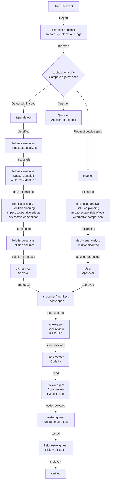

# Field Testing Feedback Management Rules

> **Document positioning:** Rules defining the management process for user feedback during the field testing phase (Single Source of Truth). Applied when the conditional process "Field Testing" is enabled.
> **Derived from:** [Process Rules](full-auto-dev-process-rules.md) §4.6 (testing phase)
> **Related documents:** [Agent List](agent-list.md), [Document Management Rules](full-auto-dev-document-rules.md) §7/§9 (field-issue file_type), [Review Standards](review-standards.md)

---

## 1. Purpose and Scope

**Purpose:**

- Compare user feedback against the specification to accurately classify it as either a defect or a CR (change request)
- Establish mandatory gates before code changes to prevent regression and accumulation of technical debt
- Prevent divergence between the specification and the code

**Scope:**

- Applies to feedback generated during the field testing phase (testing conducted together with users)
- Defects detected by automated tests are out of scope (use the conventional defect process)

**Activation condition:**

This rule applies when "Field Testing: Enabled" is set in the conditional processes section of CLAUDE.md. Primary targets are projects involving HW integration, physical devices, or user-witnessed testing.

---

## 2. Relationship Between field-issue and Existing file_types

A field-issue is the official record specific to the field testing phase, clearly separated from existing defect / change-request by discovery phase and discoverer.

| Discovery Phase | Discoverer | file_type | owner |
|---|---|---|---|
| Automated testing (testing) | test-engineer | defect | test-engineer |
| User change request after spec approval | User | change-request | change-manager |
| Field testing (testing, conditional) | field-test-engineer | field-issue | field-test-engineer |

**Design rationale:**

- field-issue is managed independently. No transcription to defect / change-request is performed after resolution
- The field-issue itself is the official record, eliminating dual management
- For metrics aggregation, field-issue is integrated into the defect curve and CR aggregation (see §9)
- The `field-issue:related_defect_id` field is used to associate with defects previously discovered by automated tests

---

## 3. Agent Roles

For the roles and responsibilities of agents used in this rule, refer to the [Agent List](agent-list.md) (Single Source of Truth). This rule does not duplicate those definitions.

Agents involved in this rule: field-test-engineer, feedback-classifier, field-issue-analyst, orchestrator, srs-writer, architect, implementer, review-agent, test-engineer

---

## 4. Status Transition Flow

**Flow diagram:**

---

## 5. Status Definitions

| Status | Meaning for defect | Meaning for CR |
|---|---|---|
| `reported` | Feedback recorded | Same |
| `classified` | Spec comparison complete; confirmed as defect | Spec comparison complete; confirmed as CR |
| `in-analysis` | Root cause analysis in progress | — (skipped) |
| `cause-identified` | Cause identified; all contributing factors determined | — (skipped) |
| `in-planning` | Solution planning in progress | Solution planning in progress |
| `solution-proposed` | Solution finalized; awaiting approval | Solution finalized; awaiting approval |
| `approved` | Fix authorized to proceed | Implementation authorized to proceed |
| `spec-updated` | Spec updated (only when necessary) | Spec updated (mandatory) |
| `spec-reviewed` | Spec review PASS (R2/R4/R5) | Same |
| `fixed` | Code fix complete | Code fix complete |
| `code-reviewed` | Code review PASS (R2/R3/R4/R5) | Same |
| `tested` | All automated tests PASS | Same |
| `verified` | Field verification PASS | Same |

---

## 6. Gate Conditions

Each status transition MUST satisfy the following gate conditions.

### 6.1 reported → classified

| Item | Details |
|---|---|
| Responsible | feedback-classifier |
| Input | Feedback record (symptoms, logs, reproduction steps) |
| Activities | Compare against the specification (`docs/spec/`) to determine the type |
| Criteria | Behavior differs from what is documented in the spec → `defect`; Request not documented in the spec → `cr`; Request for information → `question` (no ticket required) |
| Output | Set the `type` field on the ticket |

### 6.2 classified → in-analysis (defect only)

| Item | Details |
|---|---|
| Responsible | field-issue-analyst |
| Input | classified ticket + related source code |
| Activities | Begin root cause investigation |
| Gate condition | None (auto-transitions after classified is complete) |

### 6.3 in-analysis → cause-identified (defect only)

| Item | Details |
|---|---|
| Responsible | field-issue-analyst |
| Activities | Identify all contributing factors and complete root cause analysis (Why-Why) |
| Gate condition | All of the following must be satisfied: |
| | - Root cause has been identified |
| | - If there are compound factors, all factors have been enumerated |
| | - The causal relationships among factors are clear |
| Output | Record root cause analysis results in the ticket |

### 6.4 cause-identified → in-planning (defect) / classified → in-planning (CR)

| Item | Details |
|---|---|
| Responsible | field-issue-analyst |
| Activities | Draft solution proposals and analyze the following 3 points |
| | 1. **Impact scope**: List of files, modules, and features affected by the change |
| | 2. **Side effects**: Existing features that may break due to the change |
| | 3. **Alternative comparison**: Compare multiple solution proposals and present the recommended option |
| Gate condition | Analysis of the above 3 points is complete |
| Output | Record solution proposals, impact analysis, side effect analysis, and alternative comparison in the ticket |

### 6.5 in-planning → solution-proposed

| Item | Details |
|---|---|
| Responsible | field-issue-analyst |
| Activities | Finalize the solution proposal |
| Gate condition | All of the following must be satisfied: |
| | - The recommended solution has been narrowed to one |
| | - All impact areas have been enumerated |
| | - Whether a spec update is needed has been determined |
| | - Whether additional test cases are needed has been determined |
| Output | Documented finalized solution proposal |

### 6.6 solution-proposed → approved

| Item | Details |
|---|---|
| Responsible (defect) | orchestrator |
| Responsible (CR) | User |
| Activities | Approve the solution proposal |
| Gate condition | The approver has reviewed the solution proposal and explicitly approved it |
| Output | Update the ticket status to `approved` |

**Important: The implementer MUST NOT touch any code until the status reaches `approved`.**

### 6.7 approved → spec-updated

| Item | Details |
|---|---|
| Responsible | srs-writer (Ch1-2) / architect (Ch3-6) |
| Activities | Update the specification based on the approved solution proposal |
| Gate condition (CR) | Spec update is complete (mandatory) |
| Gate condition (defect) | If spec ambiguity was the cause, spec update must be complete. May be skipped if no update is needed |
| Output | Updated specification |

**Important: The implementer fixes code based on the updated specification. Code MUST NOT be modified before the specification is updated.**

### 6.8 spec-updated → spec-reviewed

| Item | Details |
|---|---|
| Responsible | review-agent |
| Activities | Perform quality review of the updated specification (R2/R4/R5 perspectives) |
| Gate condition | Zero Critical / High findings |
| Output | Review report (`project-records/reviews/`) |

**Important: The implementer MUST NOT modify code before the specification review has PASSed.**

### 6.9 spec-reviewed → fixed

| Item | Details |
|---|---|
| Responsible | implementer |
| Activities | Fix the code based on the reviewed specification |
| Gate condition | All of the following must be satisfied: |
| | - Only changes within the scope of the solution proposal are made (no out-of-scope changes) |
| | - The specification and the code are consistent |
| Output | Fixed code |

### 6.10 fixed → code-reviewed

| Item | Details |
|---|---|
| Responsible | review-agent |
| Activities | Perform quality review of the fixed code (R2/R3/R4/R5 perspectives) |
| Gate condition | Zero Critical / High findings |
| Output | Review report (`project-records/reviews/`) |

### 6.11 code-reviewed → tested

| Item | Details |
|---|---|
| Responsible | test-engineer |
| Activities | Run automated tests and confirm all tests PASS |
| Gate condition | All tests PASS |
| Output | Test execution results |

### 6.12 tested → verified

| Item | Details |
|---|---|
| Responsible | field-test-engineer |
| Activities | Verify operation on the actual device together with the user |
| Gate condition | All of the following must be satisfied: |
| | - All features listed in the impact analysis operate correctly |
| | - The user has confirmed the operation on the actual device and given OK |
| Output | Update the ticket status to `verified` |

---

## 7. Difference Rules Between defect and CR

| Aspect | defect | CR |
|---|---|---|
| Definition | Implementation differs from behavior documented in the spec | A new request not documented in the spec |
| Root cause analysis | Required (in-analysis → cause-identified) | Not required (skipped) |
| Solution planning | Required | Required |
| Approver | orchestrator | User |
| Spec update | Only when spec ambiguity is the cause (may be skipped) | Mandatory |

---

## 8. Prohibited Actions

1. **No code changes before `approved`**: The implementer MUST NOT change code before the status reaches `approved`
2. **No process bypass via hotfix**: Even in urgent cases, the status transitions defined in this rule MUST NOT be skipped. However, the content recorded at each step may be brief
3. **No code changes before spec update**: The implementer MUST NOT change code before the status reaches `spec-updated`
4. **No reporting completion without testing**: Completion MUST NOT be reported to the user without confirming all automated tests PASS
5. **No skipping reviews**: Quality reviews by review-agent MUST NOT be skipped

---

## 9. Cross-Aggregation Rules for Metrics

field-issue is a separate file_type from defect / change-request, but it is cross-aggregated in project-wide quality metrics.

### 9.1 Integration into the Defect Curve

When progress-monitor aggregates the defect curve, the following rules apply:

| Source | Condition for adding to found_cumulative | Condition for adding to fixed_cumulative |
|---|---|---|
| defect (owned by test-engineer) | When `defect:defect_status` transitions to `open` | When `defect:defect_status` transitions to `closed` |
| field-issue (type: defect) | When `field-issue:status` transitions to `classified` | When `field-issue:status` transitions to `verified` |

### 9.2 Integration into CR Aggregation

| Source | Count condition |
|---|---|
| change-request (owned by change-manager) | When `change-request:change_request_status` transitions to `submitted` |
| field-issue (type: cr) | When `field-issue:status` transitions to `classified` |

### 9.3 Excluded from Aggregation

field-issue items that feedback-classifier classifies as "question" are not ticketed and are therefore excluded from aggregation.

---

## 10. Ticket Management

### 10.1 Management Directory

`project-records/field-issues/`

Both defect and CR are managed in the same directory, distinguished by the `type` field within the ticket.

### 10.2 Where Status Is Recorded

The current status is recorded in the `field-issue:status` field within the ticket's Form Block. The ticket is updated whenever the status changes.

### 10.3 Ticket Format

The ticket format (Common Block / Form Block structure) follows the [Document Management Rules](full-auto-dev-document-rules.md). It is defined as the `field-issue` file_type.

### 10.4 Ticket Owner

The ticket owner is **field-test-engineer**. Other agents (feedback-classifier, field-issue-analyst) accumulate information by appending to the ticket.
