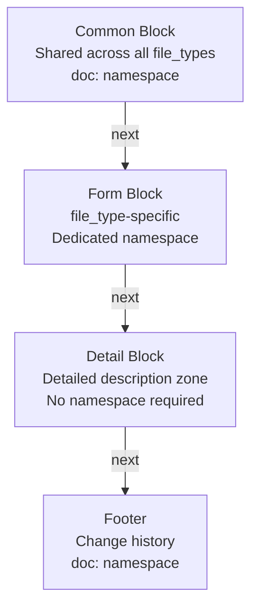
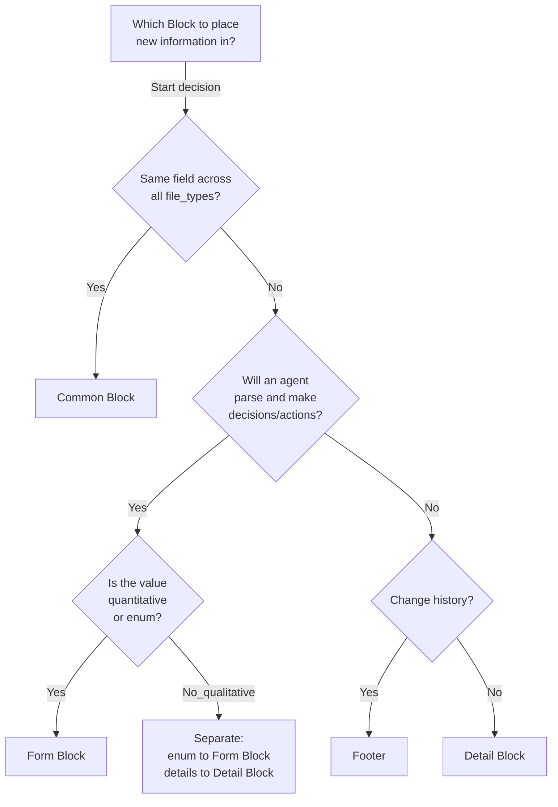
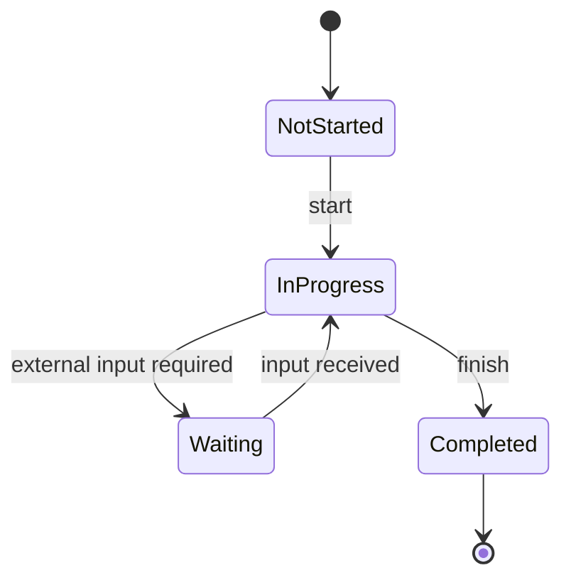
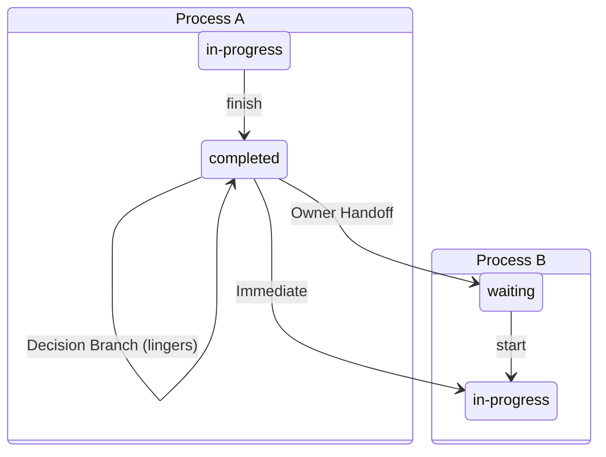
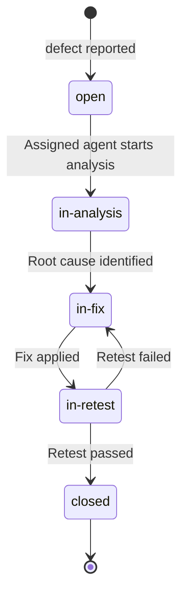

``````markdown
# full-auto-dev Document Management Rules v0.0.0

## Version 0.0.0 | Date: 2026-03-15

> **Status:** Pre-release (before PoC). Will be promoted to v1.0.0 after PoC completion.

---

# 1. Overview

This document defines the naming conventions, structure, versioning, and ownership of all files in the full-auto-dev framework.

All agents MUST follow these rules when creating or updating managed files.

Regardless of the specification format used by the process (ANMS / ANPS / ANGS), the document management formats in this document (Common Block, Form Block, etc.) apply to all managed documents.

**Related document:** [Process Rules](full-auto-dev-process-rules.md) — Process rules for phase definitions, agent definitions, quality management, etc.

## 1.1 Versioning of This Document

The version of this document itself is managed in **MAJOR.MINOR.PATCH** format.

| Level | Change Target | Impact Scope | Existing File Reuse |
|--------|---------|---------|:------------------:|
| **MAJOR** | Structural changes to Common Block / Footer | All managed files | All files require migration |
| **MINOR** | Changes/additions to Form Block | Only files of the affected type | Only affected types need review |
| **PATCH** | Detail Block Guidance / wording corrections | No impact | Can be used as-is |

The `doc:schema_version` of managed files records the **MAJOR.MINOR** of this document (PATCH is omitted).

**Release status:**

| Version | Condition | Meaning |
|-----------|------|------|
| 0.x.x | Before PoC | Design stage. Common Block and all else can be freely changed |
| 1.0.0 | PoC completed and verified | Official version. MAJOR changes require a migration guide |

## 1.2 Framework Convention Revision Rules

Revision rules applicable to all files under process-rules/ (including this document).

**Target files:**

| File | Content |
|---------|------|
| full-auto-dev-process-rules.md | Process rules |
| full-auto-dev-document-rules.md | Document management rules (this document) |
| review-standards.md | Review standards |
| prompt-structure.md | Prompt structure conventions |
| agent-list.md | Agent list |
| glossary.md | Glossary |
| defect-taxonomy.md | Defect terminology taxonomy (causal chains, fault origin, functional safety terms) |
| spec-template.md | Specification template |

**Revision categories:**

| Category | Change Content | Approval | Impact Analysis |
|------|---------|:----:|---------|
| **Breaking** | Structural changes (addition/deletion/renaming of sections, fields, namespaces) | User approval required | List all affected files |
| **Non-breaking** | Content corrections/clarifications (maintaining existing structure) | User notification only | Not required |
| **Additive** | New additions (new file_type, new agent, new term) | User notification only | No impact on existing items |

**Revision procedure:**

1. Identify the change content
2. Determine the category (Breaking / Non-breaking / Additive)
3. For Breaking changes:
   - List affected files (conventions, agent prompts, project artifacts)
   - Report the change content and impact to the user and request approval
   - After approval, modify the convention
   - Update the affected files
4. For Non-breaking / Additive changes:
   - Modify the convention
   - Report the change content to the user

**History management:** Revision history for framework conventions is managed via Git. Convention files are not subject to Common Block, so Footer / change_log are not required.

---

# 2. Directory Structure

**Framework repository:**

```
{framework-root}/
  README.md                   # Repository overview
  process-rules/              # Operational rules (framework definitions)
    full-auto-dev-process-rules-ja.md
    full-auto-dev-process-rules-en.md
    full-auto-dev-document-rules-ja.md   # ← This document
    full-auto-dev-document-rules-en.md
    agent-list-ja.md                     # Agent list
    agent-list-en.md
    prompt-structure-ja.md               # Prompt structure conventions
    prompt-structure-en.md
    glossary-ja.md                       # Glossary
    glossary-en.md
    review-standards-ja.md               # Review standards (R1-R6)
    review-standards-en.md
    spec-template-ja.md                  # Specification template
    spec-template-en.md
  essays/                     # Papers and research (Japanese/English)
  .claude/commands/           # Custom command definitions
```

**Consumer projects:**

```
{project-root}/
  CLAUDE.md                       # Project settings (references process-rules)
  user-order.md                   # User input specification (3-question format)
  src/                            # Source code
  tests/                          # Test code
  infra/                          # IaC (Infrastructure as Code)
  project-management/             # Orchestration + PM artifacts
    pipeline-state.md
    handoff/
    progress/
    old/
  docs/                           # Design artifacts (final deliverables)
    spec/                         # Specifications
    api/                          # OpenAPI definitions
    security/                     # Threat models, security architecture
    observability/                # Observability design
    hardware/                     # HW requirement specifications (conditional)
    ai/                           # AI/LLM requirement specifications (conditional)
    framework/                    # Framework requirement specifications (conditional)
    operations/                   # Runbooks, DR plans (conditional)
    old/
  project-records/                # Process records (audit trails)
    reviews/
    decisions/
    risks/
    defects/
    change-requests/
    traceability/
    security/                     # Security scan results (SAST/SCA/DAST/manual)
    licenses/                     # License reports
    performance/                  # Performance test reports
    improvement/                  # Retrospective and improvement records
    release/                      # Release judgment checklist
    incidents/                    # Production incident records (conditional)
    legal/                        # Legal research results (conditional)
    safety/                       # Functional safety records (conditional)
    field-issues/                 # Field testing feedback (conditional)
    snapshots/                    # Project snapshots (zip, etc.)
    old/
```

**Separation principle:**

| Directory | Stored Content | Primary Users |
|-------------|----------|-----------|
| `project-management/` | Orchestration state, handoffs, progress, WBS, cost | Lead agent, PM agent |
| `docs/` | Specifications, API documents, security design — "what was built" | All agents, users, downstream consumers |
| `project-records/` | Reviews, decisions, risks, defects, CRs — "how it was built" | Auditors, reviewers, process-oriented stakeholders |

---

# 3. File Naming Conventions

## 3.1 General Policy

- Style: **kebab-case** only (exceptions: when following external standards or language conventions)
- Timestamps: **UTC**
- Language suffix: Primary language files have no suffix. Only translated versions get `-{lang}.md` (see section 12). Framework documents (process-rules/, essays/) are an exception and are managed as `-ja.md` / `-en.md` pairs

## 3.2 Process Documents (project-management/)

Files used for pipeline management, inter-agent handoffs, and progress management.

**Format:**

```
{file_type}-{NNN}-{YYYYMMDD}-{HHMMSS}.md
```

| File | Naming Example | Notes |
|---------|--------|------|
| Pipeline state | `pipeline-state.md` | Singleton. No serial number or timestamp |
| Handoff | `handoff-001-20260314-102530.md` | Standard format |
| Progress report | `progress-001-20260314-150000.md` | Standard format |
| Cost log | `cost-log.json` | Time-series JSON. Not subject to Common Block. owner: progress-monitor, consumed_by: orchestrator |
| Test progress | `test-progress.json` | Time-series JSON. Not subject to Common Block. owner: test-engineer, consumed_by: progress-monitor |
| defect curve | `defect-curve.json` | Time-series JSON. Not subject to Common Block. owner: test-engineer, consumed_by: progress-monitor |
| WBS | `wbs.md` | Singleton |
| Test plan | `test-plan.md` | Singleton |
| Interview record | `interview-record.md` | Singleton. Created in planning phase |
| Stakeholder register | `stakeholder-register.md` | Singleton. Recommended process |

## 3.3 Process Records (project-records/)

Records of reviews, decisions, risks, defects, change requests, and traceability.

**Format:**

```
{file_type}-{NNN}-{YYYYMMDD}-{HHMMSS}.md
```

| File | Naming Example | Notes |
|---------|--------|------|
| Review result | `review-003-20260314-153000.md` | Standard format |
| Decision record | `decision-002-20260315-090000.md` | Standard format |
| Risk entry | `risk-001-20260314-120000.md` | Individual risk |
| Risk register | `risk-register.md` | Singleton. Integrated register |
| defect ticket | `defect-012-20260316-140000.md` | Standard format |
| Change request | `change-request-001-20260317-110000.md` | Standard format |
| Traceability | `traceability-matrix.md` | Singleton |
| Security scan | `security-scan-report-001-20260318-100000.md` | Standard format. Distinguished by scan_type |
| License report | `license-report.md` | Singleton |
| Performance test report | `performance-report-001-20260320-140000.md` | Standard format |
| incident record | `incident-report-001-20260320-100000.md` | Standard format. operation phase |

## 3.4 Specifications (docs/spec/)

Project requirement and design specifications. Depends on the specification format (ANMS/ANPS/ANGS).

**Format:**

```
{project-name}-spec.md            # ANMS (single file)
{project-name}-spec-ch{N}.md      # ANPS (chapter split)
```

| File | Naming Example | Notes |
|---------|--------|------|
| ANMS specification | `my-app-spec.md` | Single file |
| ANPS Ch1-2 | `my-app-spec-ch1-2.md` | Chapter split |
| ANPS Ch3 | `my-app-spec-ch3.md` | Chapter split |
## 3.5 Root-Placed Documents

High-visibility documents placed at the project root.

| File | Naming Example | Notes |
|---------|--------|------|
| User input specification | `user-order.md` | Singleton. 3-question format |
| Executive dashboard | `executive-dashboard.md` | Singleton. Project-wide status summary |
| Final report | `final-report.md` | Singleton. Created in delivery phase |

## 3.6 General Documents (docs/)

Design artifacts other than specifications, such as API definitions and security design.

**Format:**

```
{descriptive-name}.{extension}
```

| File | Naming Example | Notes |
|---------|--------|------|
| OpenAPI definition | `openapi.yaml` | Follows external standard (OpenAPI 3.0) |
| Threat model | `threat-model.md` | With Common Block |
| Security architecture | `security-architecture.md` | With Common Block |
| Observability design | `observability-design.md` | With Common Block |
| Infrastructure diagram | `infrastructure.md` | With Common Block |
| User manual | `user-manual.md` | With Common Block |
| Runbook | `runbook.md` | With Common Block |
| Disaster recovery plan | `disaster-recovery-plan.md` | With Common Block |

## 3.7 Source Code (src/)

**Format:** Follows the conventions of the adopted language/framework.

| Language | Convention | Example |
|------|------|-----|
| TypeScript | camelCase filenames, PascalCase components | `userService.ts`, `UserCard.tsx` |
| Python | snake_case | `user_service.py` |
| Go | snake_case | `user_service.go` |
| Rust | snake_case | `user_service.rs` |

- **Not subject to** Common Block
- Traceability is managed in `project-records/traceability/traceability-matrix.md`

## 3.8 Test Code (tests/)

**Format:** Follows the conventions of the test framework.

| Type | Convention | Example |
|------|------|-----|
| Unit test | Target filename + `.test` / `.spec` | `userService.test.ts` |
| Integration test | Target + `.integration.test` | `api.integration.test.ts` |
| E2E test | Flow name + `.e2e.test` | `login-flow.e2e.test.ts` |
| Performance test | Target + `.perf` | `api-latency.perf.js` (k6) |

- **Not subject to** Common Block

## 3.9 Configuration and Infrastructure (root / infra/)

**Format:** Use the standard name for each tool. Do not rename.

| File | Location | Notes |
|---------|------|------|
| `package.json` | Root | npm/yarn standard |
| `tsconfig.json` | Root | TypeScript standard |
| `.eslintrc.json` | Root | ESLint standard |
| `Dockerfile` | Root or infra/ | Docker standard |
| `docker-compose.yml` | Root or infra/ | Docker Compose standard |
| `*.tf` | infra/ | Terraform standard |
| `.github/workflows/*.yml` | .github/ | GitHub Actions standard |

- **Not subject to** Common Block

## 3.10 old/ Directory Rules

Common to all old/ directories:

- Location: `{same-directory}/old/`
- Append datetime to filename: `{original-filename}-{YYYYMMDD}-{HHMMSS}.md`
- Maintain the name from the original file minus the timestamp portion (for recognizability)

---

# 4. Block Structure

All managed `.md` files follow the following 4-part structure.

**Block diagram:**



The role of each block is clear. The Common Block identifies the file, the Form Block defines file-type-specific structured formats (structures that AI should follow), the Detail Block describes detailed explanations, rationale, and evidence, and the Footer tracks change history. Multiple Form Blocks can be placed within a single file (e.g., a series of test cases).

## 4.1 Information Placement Criteria

When determining which block to place new information in, use the following criteria.

**Placement criteria table:**

| Block | Decision Test | Nature | Purpose / Users |
|-------|-----------|------|--------|
| **Common Block** | "Is this field the same across all file types?" -> Yes | File identity | The framework itself (file discovery, routing) |
| **Form Block** | "Will an agent parse this value to make a decision/action?" -> Yes | Structured state/metrics specific to the file type | Other agents (decision-making, gates, dashboards) |
| **Detail Block** | "Is this detailed explanation, rationale, or evidence?" -> Yes | The body of domain knowledge | Humans + agents (for understanding, not routing) |
| **Footer** | "When, who changed what?" -> Yes | Change history (append-only) | Auditing (traceability, debugging) |

**Decision flowchart:**



This flowchart shows the procedure for determining Block placement of information. The most confusing branch is Q2->Q3, where information is "used by agents but qualitative" and needs to be separated into enum and Detail Block.

**Three principles when in doubt:**

1. **Numeric values and enums go in Form Block.** If there is any possibility of use in dashboards or gates, normalize and place in Form Block rather than deriving from Detail Block
2. **Qualitative descriptions go in Detail Block.** However, if something "appears qualitative but can be classified by enum," separate the enum into Form Block and details into Detail Block
3. **When in doubt, lean toward Form Block.** Extracting information from free-form Detail Block is fragile. Structurize what can be structured

## 4.2 Placement Decision Examples

### Example 1: threat-model.md (Threat Model)

security-reviewer creates a threat model. Other agents reference it for implementation.

| Information | Candidates | Decision | Rationale |
|------|------|------|------|
| File purpose | Common? Form? | **Common** (`doc:purpose`) | Field shared across all file types |
| Adopted threat analysis methodology (STRIDE, DREAD, etc.) | Form? Detail? | **Form Block** (`threat-model:methodology`) | Agent parses to determine methodology. Can also be displayed on dashboard |
| Total number of identified threats | Form? Detail? | **Form Block** (`threat-model:threat_count`) | Numeric metric. Aggregated by progress-monitor |
| Number of unmitigated high-risk threats | Form? Detail? | **Form Block** (`threat-model:unmitigated_high_count`) | Used by review-agent for gate decisions (fail if not 0) |
| Per-threat details (attack vectors, impact, mitigations) | Form? Detail? | **Detail Block** | Detailed analysis content. Not parsed for decisions |

**Decision point:** The "total number of threats" could be counted from Detail Block tables, but having a normalized value in Form Block ensures reliable machine readability.

### Example 2: wbs.md (WBS)

progress-monitor manages the WBS. orchestrator references it for phase progression decisions.

| Information | Candidates | Decision | Rationale |
|------|------|------|------|
| Total task count | Form? Detail? | **Form Block** (`wbs:task_total`) | Input for completion rate calculation |
| Completed task count | Form? Detail? | **Form Block** (`wbs:task_completed`) | Displayed on dashboard |
| Current critical path | Form? Detail? | **Form Block** (`wbs:critical_path`) | Used by lead for bottleneck decisions |
| Details of each task (assignee, duration, dependencies) | Form? Detail? | **Detail Block** | Task details are domain knowledge |

**Decision point:** The critical path can be derived from the task table in Detail Block, but even derived values belong in Form Block if agents use them immediately for decisions.

### Example 3: executive-dashboard.md (Executive Dashboard)

progress-monitor updates the project-wide summary. Users grasp the situation at a glance.

| Information | Candidates | Decision | Rationale |
|------|------|------|------|
| Current phase | Form? Detail? | **Form Block** (`executive-dashboard:phase`) | Synced with pipeline-state |
| Overall project completion rate | Form? Detail? | **Form Block** (`executive-dashboard:completion_pct`) | Numeric metric |
| Overall health status (green/yellow/red) | Form? Detail? | **Form Block** (`executive-dashboard:health`) | Lead determines whether to escalate |
| Number of open blockers | Form? Detail? | **Form Block** (`executive-dashboard:blocker_count`) | Escalation if not 0 |
| Detailed summary per phase | Form? Detail? | **Detail Block** | Summary text for humans to read |

**Decision point:** The dashboard has a large Form Block, but that is correct. The raison d'etre of this file is "aggregation of structured status."

### Example 4: final-report.md (Final Report)

Lead creates in delivery phase. Material for users to decide on project closure.

| Information | Candidates | Decision | Rationale |
|------|------|------|------|
| Final test pass rate | Form? Detail? | **Form Block** (`final-report:test_pass_rate`) | Input for acceptance decision |
| Coverage achievement rate | Form? Detail? | **Form Block** (`final-report:coverage_pct`) | Same as above |
| Number of unresolved Critical/High defects | Form? Detail? | **Form Block** (`final-report:open_critical`, `final-report:open_high`) | Release not allowed if not 0 |
| Goal achievement assessment | Form? Detail? | **Separate**: enum (`final-report:goal_achievement`: achieved/partial/not-achieved) -> **Form Block**, details -> **Detail Block** | Appears qualitative but can be classified by enum |
| Remaining issues / technical debt list | Form? Detail? | **Detail Block** | Detailed list |
| Lessons Learned | Form? Detail? | **Detail Block** | Entirely free-form |

**Decision point:** "Goal achievement assessment" appears qualitative, but separate the enum classification into Form Block and detailed explanation into Detail Block.

### Example 5: user-order.md / {project}-spec.md (Specifications)

srs-writer creates Ch1-2, architect details Ch3-6.

| Information | Candidates | Decision | Rationale |
|------|------|------|------|
| Specification format (ANMS/ANPS) | Form? Detail? | **Form Block** (`spec-foundation:format`) | Agent determines reading method |
| Completed chapters (within Ch1-2) | Form? Detail? | **Form Block** (`spec-foundation:completed_chapters`) | architect determines if handoff is possible. Different concept from doc:document_status (entire document vs. chapter-level) |
| Completed chapters | Form? Detail? | **Form Block** (`spec-architecture:completed_chapters`) | architect determines work start position |
| Functional requirement count / Non-functional requirement count | Form? Detail? | **Form Block** (`spec-foundation:fr_count`, `spec-foundation:nfr_count`) | Denominator for traceability coverage calculation |
| Full text of Ch1-6 | Form? Detail? | **Detail Block** | Specification body following ANMS/ANPS format |

**Decision point:** Common Block + Form Block are "metadata about the file as a specification." The ANMS chapter structure is "the content of the specification." Metadata and content are different layers and do not constitute double management.

### Example 6: performance-report-NNN-*.md (Performance Test Report)

test-engineer creates after k6 execution. Comparison results against NFR targets.

| Information | Candidates | Decision | Rationale |
|------|------|------|------|
| Number of tested endpoints | Form? Detail? | **Form Block** (`performance-report:endpoint_count`) | Aggregated on dashboard |
| NFR achievement rate (pass/total) | Form? Detail? | **Form Block** (`performance-report:nfr_pass_rate`) | testing phase fails if not 100% |
| Maximum P99 latency | Form? Detail? | **Form Block** (`performance-report:p99_max_ms`) | SLA exceedance alert decision |
| Detailed results per endpoint | Form? Detail? | **Detail Block** | Table of latency, throughput, error rate |
| k6 script configuration parameters | Form? Detail? | **Detail Block** | Test condition records (for reproducibility) |

---

## 4.3 Status Value Naming Convention

Status values (enum field choices) in this framework MUST follow these meta-rules.

### 4.3.1 Lifecycle Model

All statuses are classified into one of four states.

| # | State | Meaning | English Pattern | Japanese Pattern |
|:-:|-------|---------|----------------|-----------------|
| 1 | Not Started | Work has not begun | Adjective / noun (open, draft) | ○○前 / 未○○ |
| 2 | In Progress | Work is actively underway | in-{noun} (in-review, in-analysis) | ○○中 |
| 3 | Waiting | Blocked pending external input | waiting-for-{noun} / needs-{noun} / blocked | ○○待 |
| 4 | Completed | Work is finished | Past participle (approved, fixed, closed) | ○○済 |

> **Note:** Judgment results such as `pass / fail` are binary outcomes, not lifecycle states, and are therefore exempt from this convention.



### 4.3.2 Naming Rules

1. **Values are kebab-case, English only** — per Language Policy (§12), status values are never translated
2. **"In Progress" uses `in-{noun}`** — the subject of a status is an item (document, defect, etc.), not a person; `-ing` form implies the item is the actor (e.g., ✗ `reviewing` → ✓ `in-review`)
3. **"Completed" uses past participle** — completion is a "resulting state", not an "action" (e.g., approved, fixed, closed)
4. **"Waiting" specifies what is awaited** — use `waiting-for-{noun}` / `needs-{noun}`; `blocked` is reserved for unknown or external-cause stalls

### 4.3.3 Cross-Process Transition Rules

When completion of Process A triggers the start of Process B, three patterns apply.

| Pattern | Condition | Transition | Example |
|---------|-----------|------------|---------|
| Immediate | No decision needed, same owner | A-done → B-wip (A-done is logged but not a resting state) | fixed → in-retest |
| Decision Branch | Multiple destinations | A-done lingers → decision routes to next state (record as decision) | reviewed → {in-fix / deferred / accepted} |
| Owner Handoff | Next owner differs | A-done → B-wait → B-wip ("wait" is mandatory) | implemented → waiting-for-review → in-review |

**Decision criteria:**

1. Are there multiple destinations? → Yes: **Decision Branch**
2. Does the owner change? → Yes: **Owner Handoff**
3. Neither → **Immediate**



---

# 5. Common Block Specification

Field order is fixed. Agents MUST NOT reorder fields or omit required fields.

**Field order (optimized for AI reading flow):**

```
── Identification (what and how to read) ──
schema_version → file_type → form_block_cardinality → language
── State (is it safe to touch?) ──
→ document_status
── Workflow (is this my job?) ──
→ owner → commissioned_by → consumed_by
── Context (what is this about?) ──
→ project → purpose → summary
── References (what is related?) ──
→ related_docs
── Provenance (when and by whom?) ──
→ created_by → created_at
```

**Field definitions:**

| Field | Type | Required | Group | Description |
|-----------|------|------|---------|------|
| schema_version | string | Yes | Identification | Schema version (currently "0.0") |
| file_type | enum | Yes | Identification | One of the registered file types (see Chapter 7) |
| form_block_cardinality | enum: single / multiple | Yes | Identification | Whether this file has a single or multiple Form Blocks |
| language | string (ISO 639-1) | Yes | Identification | Language of this file (e.g., `ja`, `en`, `fr`) |
| document_status | enum: draft / in-review / approved / archived | Yes | State | Document lifecycle status |
| owner | string | Yes | Workflow | Agent with write permission |
| commissioned_by | string | Yes | Workflow | Trigger for this document's creation (values: `user`, `orchestrator`, `phase-{name}`, or `{agent-name}`) |
| consumed_by | string | Yes | Workflow | Agent that will use this document next |
| project | string | Yes | Context | Project name |
| purpose | string | Yes | Context | Why this file exists and what action is expected |
| summary | string | Yes | Context | Brief description of file contents |
| related_docs | list | No | References | References to input/output/next files |
| created_by | string | Yes | Provenance | Agent that created the file |
| created_at | datetime | Yes | Provenance | ISO 8601 creation timestamp (UTC) |

**Common Block template:**

```markdown
<!-- ============================================================
     COMMON BLOCK | DO NOT MODIFY STRUCTURE OR FIELD NAMES
     ============================================================ -->

## Identification

<!-- FIELD: schema_version | type: string | required: true -->

<doc:schema_version>0.0</doc:schema_version>

<!-- FIELD: file_type | type: enum | required: true -->

<doc:file_type>{file_type}</doc:file_type>

<!-- FIELD: form_block_cardinality | type: enum | values: single,multiple | required: true -->

<doc:form_block_cardinality>{single_or_multiple}</doc:form_block_cardinality>

<!-- FIELD: language | type: string (ISO 639-1) | required: true -->

<doc:language>{language_code}</doc:language>

## Document State

<!-- FIELD: document_status | type: enum | values: draft,in-review,approved,archived | required: true -->

<doc:document_status>draft</doc:document_status>

## Workflow

<!-- FIELD: owner | type: string | required: true -->

<doc:owner>{agent-name}</doc:owner>

<!-- FIELD: commissioned_by | type: string | required: true -->
<!-- Trigger for this document's creation: user, orchestrator, phase-{name}, or {agent-name} -->

<doc:commissioned_by>{trigger}</doc:commissioned_by>

<!-- FIELD: consumed_by | type: string | required: true -->
<!-- Which agent will use this document next -->

<doc:consumed_by>{agent-name}</doc:consumed_by>

## Context

<!-- FIELD: project | type: string | required: true -->

<doc:project>{project-name}</doc:project>

<!-- FIELD: purpose | type: string | required: true -->
<!-- Tell the agent WHY this file exists and what action is expected -->

<doc:purpose>
{purpose}
</doc:purpose>

<!-- FIELD: summary | type: string | required: true -->

<doc:summary>
{summary}
</doc:summary>

## References

<!-- FIELD: related_docs | type: list | required: false -->

<doc:related_docs>
<doc:ref>{path-to-related-file}</doc:ref>
</doc:related_docs>

## Provenance

<!-- FIELD: created_by | type: string | required: true -->

<doc:created_by>{agent-name}</doc:created_by>

<!-- FIELD: created_at | type: datetime | required: true -->

<doc:created_at>{ISO-8601-timestamp}</doc:created_at>
```

**related_docs sub-tags:**

| Sub-tag | Meaning |
|---------|------|
| `<doc:ref>` | General reference (default) |
| `<doc:input>` | File consumed by this document |
| `<doc:output>` | File produced by this document |
| `<doc:next>` | Next file in the sequence (e.g., next handoff) |

---

# 6. Footer Specification

The Footer is shared across all file types. Agents MUST append a new `<entry>` to the change_log on every write.

**Footer template:**

```markdown
<!-- ============================================================
     FOOTER | append change_log entry on every write
     ============================================================ -->

## Last Updated

<!-- FIELD: updated_by | type: string | required: true -->

<doc:updated_by>{agent-name}</doc:updated_by>

<!-- FIELD: updated_at | type: datetime | required: true -->

<doc:updated_at>{ISO-8601-timestamp}</doc:updated_at>

## Change Log

<!-- FIELD: change_log | type: list | append-only | DO NOT MODIFY OR DELETE EXISTING ENTRIES -->

<doc:change_log>
<entry at="{ISO-8601-timestamp}" by="{agent-name}" action="created" />
</doc:change_log>
```

**change_log rules:**

- Append-only: Modification or deletion of existing entries is strictly prohibited (NEVER)
- A new `<entry>` MUST be added on each write operation
- The `action` field describes the change content (e.g., "created", "updated phase to 2", "archived previous version to old/")

---

# 7. File Types (Common Block Managed)

**Namespace naming convention:** Namespaces use the file_type name as-is. Abbreviations are prohibited (e.g., ~~`cr:`~~ -> `change-request:`). As a rule, 2 words or fewer, maximum 3 words. `doc:` is reserved exclusively for Common Block + Footer. When a category has sub-types, place the category first (e.g., `spec-foundation:`, `spec-architecture:`).

| file_type | Namespace | Purpose | Directory | Singleton? |
|-----------|---------|------|-------------|:----------:|
| pipeline-state | `pipeline-state:` | Pipeline orchestration state | `project-management/` | Yes |
| handoff | `handoff:` | Inter-agent task handoff | `project-management/handoff/` | No |
| progress | `progress:` | Project progress and metrics | `project-management/progress/` | No |
| interview-record | `interview-record:` | Interview record | `project-management/` | Yes |
| wbs | `wbs:` | WBS / Gantt chart | `project-management/progress/` | Yes |
| test-plan | `test-plan:` | Test plan | `project-management/` | Yes |
| review | `review:` | Code/design review results | `project-records/reviews/` | No |
| decision | `decision:` | Architecture decision record | `project-records/decisions/` | No |
| risk | `risk:` | Risk entry and register | `project-records/risks/` | No |
| defect | `defect:` | defect tracking | `project-records/defects/` | No |
| change-request | `change-request:` | Change request management | `project-records/change-requests/` | No |
| traceability | `traceability:` | Requirement-to-test tracing | `project-records/traceability/` | Yes |
| license-report | `license-report:` | License compatibility report | `project-records/licenses/` | Yes |
| performance-report | `performance-report:` | Performance test results report | `project-records/performance/` | No |
| spec-foundation | `spec-foundation:` | Specification Ch1-2 (Foundation, Requirements) | `docs/spec/` | Yes |
| spec-architecture | `spec-architecture:` | Specification Ch3-6 (Architecture, Specification, Test Strategy, Design Principles) | `docs/spec/` | Yes |
| threat-model | `threat-model:` | Threat model | `docs/security/` | Yes |
| security-architecture | `security-architecture:` | Security design | `docs/security/` | Yes |
| observability-design | `observability-design:` | Observability design | `docs/observability/` | Yes |
| hw-requirement-spec | `hw-requirement-spec:` | HW requirement specification (conditional; inherits external-dependency-spec) | `docs/hardware/` | Yes |
| ai-requirement-spec | `ai-requirement-spec:` | AI/LLM requirement specification (conditional; inherits external-dependency-spec) | `docs/ai/` | Yes |
| framework-requirement-spec | `framework-requirement-spec:` | Framework requirement specification (conditional; inherits external-dependency-spec) | `docs/framework/` | Yes |
| executive-dashboard | `executive-dashboard:` | Project-wide dashboard | Root | Yes |
| final-report | `final-report:` | Project final report | Root | Yes |
| user-order | `user-order:` | User input specification (3-question format) | Root | Yes |
| user-manual | `user-manual:` | End-user operation manual | `docs/` | Yes |
| security-scan-report | `security-scan-report:` | Security scan results (SAST/SCA/DAST/manual) | `project-records/security/` | No |
| runbook | `runbook:` | Runbook (daily operations, incident response) | `docs/operations/` | Yes |
| incident-report | `incident-report:` | Production incident record and post-mortem | `project-records/incidents/` | No |
| disaster-recovery-plan | `disaster-recovery-plan:` | Disaster recovery plan (RPO/RTO, recovery procedures) | `docs/operations/` | Yes |
| stakeholder-register | `stakeholder-register:` | Stakeholder register (recommended process) | `project-management/` | Yes |
| retrospective-report | `retrospective-report:` | Retrospective and process improvement record | `project-records/improvement/` | No |
| field-issue | `field-issue:` | Field testing feedback management (defect / CR unified). Conditional: field testing enabled | `project-records/field-issues/` | No |

### external-dependency-spec (External Dependency Requirement Specification Template)

A common template for requirement specifications targeting external dependencies (the Framework layer in Clean Architecture). The following 3 concrete file_types inherit from this template.

**Inheritance hierarchy:**

```
external-dependency-spec (abstract template)
  ├── hw-requirement-spec (physical devices: embedded/IoT)
  ├── ai-requirement-spec (AI/LLM: inference/generation services)
  └── framework-requirement-spec (DB/Web/infra, etc.: only when non-standard I/F)
```

**Common Detail Block chapter structure (inherited by all child types):**

| Chapter | Content | Description |
|:--:|------|------|
| 1 | Purpose | What this external dependency achieves |
| 2 | Requirements | Capabilities and performance SW demands |
| 3 | I/F Definition | Boundary of the SW-side Adapter layer. This corresponds to SW Spec Ch3 |
| 4 | Constraints | Restrictions the external dependency imposes on SW |
| 5 | Replacement Strategy | Alternatives and migration impact. Rationale for abstraction via DIP |
| 6 | Other | Procurement, cost, revision management, etc. |

**Applicability decision:** During planning phase interviews, identify "what is an external dependency and what is our own original work." Create a dedicated requirement-spec for external dependencies with low I/F standardization. For high I/F standardization (standard SQL, official framework APIs, etc.), recording the selection rationale in `project-records/decisions/` is sufficient.

---

## 7.1 Workflow Reference Table

Standard values for `commissioned_by` (creation trigger) and `consumed_by` (next consumer) for each file_type. Agents fill in these Common Block fields when creating files according to the following.

**commissioned_by value patterns:**

| Value | Meaning |
|---|------|
| `user` | Directly created by the user |
| `orchestrator` | Created by lead as part of their responsibilities |
| `phase-{name}` | Triggered by phase transition per process rules |
| `{agent-name}` | Triggered by an event from a specific agent |

**Phase names:**

| Phase Name | Meaning |
|-----------|------|
| `phase-setup` | Setup and process evaluation |
| `phase-planning` | Planning (interview and specification) |
| `phase-dependency-selection` | External dependency evaluation, selection, and procurement |
| `phase-design` | Design |
| `phase-implementation` | Implementation |
| `phase-testing` | Testing |
| `phase-delivery` | Delivery |
| `phase-operation` | Operation and maintenance |

**Workflow reference table:**

| file_type | commissioned_by | consumed_by | owner |
|-----------|----------------|-------------|-------|
| pipeline-state | `orchestrator` | All agents | orchestrator |
| handoff | Phase transition (e.g., `phase-planning`) | to-agent | orchestrator |
| progress | `phase-design` (updated thereafter) | orchestrator, user | progress-monitor |
| interview-record | `phase-planning` | architect, orchestrator | srs-writer |
| wbs | `phase-design` | progress-monitor, orchestrator | progress-monitor |
| test-plan | `phase-design` | test-engineer, review-agent | test-engineer |
| review | Phase gate (e.g., `phase-planning`) | orchestrator, target agent | review-agent |
| decision | Agent that needed the decision | All agents | orchestrator |
| risk | `phase-planning` | risk-manager, orchestrator | risk-manager |
| defect | `test-engineer` | Agent assigned to fix | test-engineer |
| change-request | `user` (user-initiated change requests only) | change-manager, orchestrator | change-manager |
| traceability | `phase-implementation` | review-agent | test-engineer |
| license-report | `phase-implementation` | orchestrator, security-reviewer | license-checker |
| performance-report | `phase-testing` | review-agent, orchestrator | test-engineer |
| spec-foundation | `phase-planning` | architect, review-agent | srs-writer |
| spec-architecture | `phase-design` | Implementation agents, review-agent | architect |
| threat-model | `phase-design` | architect, implementation agents | security-reviewer |
| security-architecture | `phase-design` | architect, implementation agents | security-reviewer |
| observability-design | `phase-design` | Implementation agents | architect |
| hw-requirement-spec | `phase-design` | architect (Adapter layer design), test-engineer (integration test planning) | architect |
| ai-requirement-spec | `phase-design` | architect (Adapter layer design), implementation agents | architect |
| framework-requirement-spec | `phase-design` | architect (Adapter layer design), implementation agents | architect |
| executive-dashboard | `phase-setup` | User, orchestrator | orchestrator |
| final-report | `phase-delivery` | User | orchestrator |
| user-order | `user` | srs-writer | srs-writer |
| security-scan-report | `phase-implementation` (ad hoc thereafter) | review-agent, orchestrator | security-reviewer |
| user-manual | `phase-delivery` | User | user-manual-writer |
| runbook | `phase-delivery` | Operations team | runbook-writer |
| incident-report | `phase-operation` (ad hoc) | orchestrator, user | incident-reporter |
| disaster-recovery-plan | `phase-design` | Operations team, orchestrator | architect |
| stakeholder-register | `phase-setup` | All agents | orchestrator |
| retrospective-report | Phase completion (ad hoc) | orchestrator | process-improver |
| field-issue | During field testing (as needed) | orchestrator, implementer, test-engineer | field-test-engineer |

---

# 8. Namespace Prefixes

Namespace prefixes prevent collisions with standard HTML/XML tags and make fields machine-parsable. See section 7 for naming conventions.

| Namespace | Usage Location | Example |
|---------|----------|-----|
| `doc:` | Common Block + Footer (reserved) | `<doc:schema_version>0.0</doc:schema_version>` |
| `pipeline-state:` | pipeline-state Form Block | `<pipeline-state:phase>2</pipeline-state:phase>` |
| `handoff:` | handoff Form Block | `<handoff:from>srs-writer</handoff:from>` |
| `progress:` | progress Form Block | `<progress:completion_pct>45</progress:completion_pct>` |
| `interview-record:` | interview-record Form Block | `<interview-record:interview_status>completed</interview-record:interview_status>` |
| `wbs:` | wbs Form Block | `<wbs:task_total>24</wbs:task_total>` |
| `test-plan:` | test-plan Form Block | `<test-plan:test_level>unit,integration,e2e</test-plan:test_level>` |
| `review:` | review Form Block | `<review:result>pass</review:result>` |
| `decision:` | decision Form Block | `<decision:id>DEC-001</decision:id>` |
| `risk:` | risk Form Block | `<risk:score>6</risk:score>` |
| `defect:` | defect Form Block | `<defect:severity>high</defect:severity>` |
| `change-request:` | change-request Form Block | `<change-request:impact_level>medium</change-request:impact_level>` |
| `traceability:` | traceability Form Block | `<traceability:coverage_pct>85</traceability:coverage_pct>` |
| `license-report:` | license-report Form Block | `<license-report:compatible_count>12</license-report:compatible_count>` |
| `performance-report:` | performance-report Form Block | `<performance-report:nfr_pass_rate>100%</performance-report:nfr_pass_rate>` |
| `spec-foundation:` | spec-foundation Form Block | `<spec-foundation:fr_count>15</spec-foundation:fr_count>` |
| `spec-architecture:` | spec-architecture Form Block | `<spec-architecture:completed_chapters>3,4</spec-architecture:completed_chapters>` |
| `threat-model:` | threat-model Form Block | `<threat-model:threat_count>8</threat-model:threat_count>` |
| `security-architecture:` | security-architecture Form Block | `<security-architecture:owasp_coverage>10/10</security-architecture:owasp_coverage>` |
| `observability-design:` | observability-design Form Block | `<observability-design:log_format>structured-json</observability-design:log_format>` |
| `hw-requirement-spec:` | hw-requirement-spec Form Block | `<hw-requirement-spec:interface_count>4</hw-requirement-spec:interface_count>` |
| `ai-requirement-spec:` | ai-requirement-spec Form Block | `<ai-requirement-spec:model_capability>reasoning,code-generation</ai-requirement-spec:model_capability>` |
| `framework-requirement-spec:` | framework-requirement-spec Form Block | `<framework-requirement-spec:framework_name>PostgreSQL</framework-requirement-spec:framework_name>` |
| `executive-dashboard:` | executive-dashboard Form Block | `<executive-dashboard:health>green</executive-dashboard:health>` |
| `final-report:` | final-report Form Block | `<final-report:goal_achievement>achieved</final-report:goal_achievement>` |
| `user-order:` | user-order Form Block | `<user-order:format>ANMS</user-order:format>` |
| `security-scan-report:` | security-scan-report Form Block | `<security-scan-report:scan_type>sast</security-scan-report:scan_type>` |
| `user-manual:` | user-manual Form Block | `<user-manual:target_audience>end-user</user-manual:target_audience>` |
| `runbook:` | runbook Form Block | `<runbook:last_drill_date>2026-03-15</runbook:last_drill_date>` |
| `incident-report:` | incident-report Form Block | `<incident-report:severity>P1</incident-report:severity>` |
| `disaster-recovery-plan:` | disaster-recovery-plan Form Block | `<disaster-recovery-plan:rto_hours>4</disaster-recovery-plan:rto_hours>` |
| `stakeholder-register:` | stakeholder-register Form Block | `<stakeholder-register:stakeholder_count>5</stakeholder-register:stakeholder_count>` |
| `retrospective-report:` | retrospective-report Form Block | `<retrospective-report:approval_status>proposed</retrospective-report:approval_status>` |
| `field-issue:` | field-issue Form Block | `<field-issue:type>defect</field-issue:type>` |

---

# 9. Form Block Specification

Each Form Block is positioned between the Common Block and the Detail Block. The namespace prefix corresponds to the file_type.

## 9.0 Form Block Definition Meta-Template

When defining a new Form Block, the following 2-section structure MUST be followed.

**Meta-template:**

```
## 9.N {file_type} (Namespace: {namespace}:)

### Fields

| Field | Type | Required | Description | Value Range / Constraints |
|-----------|------|------|------|-----------|
| {namespace}:{field_name} | {type} | {Yes/No} | {description} | {enum values, range, trigger conditions} |

### Detail Block Guidance

{Instructions for the sections and content that should be described in the Detail Block for this file type}
```

**Responsibilities of each section:**

| Section | Responsibility | Content |
|-----------|------|---------|
| **Fields** | Definition of structured formats that AI should follow | Field names, types, required/optional, descriptions, value ranges (enum values, numeric ranges), constraints (escalation conditions, gate conditions, etc.) |
| **Detail Block Guidance** | Structural constraints for the Detail Block | Recommended section headings, content to be described in each section, description formats to adopt (ADR format, table format, etc.) |

**Items NOT included in the meta-template (managed by Common Block or section 7):**

| Information | Management Location | Rationale |
|------|---------|------|
| file_type, owner | Common Block | Fields shared across all types |
| document_status | Common Block | Fields shared across all types |
| commissioned_by, consumed_by | Common Block | Fields shared across all types |
| form_block_cardinality | Common Block | Fields shared across all types |
| Namespace, singleton, directory | Section 7 file_type table | Type registration information |

**Rules for the "Value Range / Constraints" column in the Fields table:**

- Enum values: List with slash separation (e.g., `open / in-fix / closed`)
- Numeric range: Specify the range explicitly (e.g., `0-100`)
- Trigger conditions: Describe the result with `->` (e.g., `>=6 -> notify user`)
- Gate conditions: Describe as `= 0 required for phase transition`

---

## 9.1 pipeline-state (Namespace: pipeline-state:)

### Fields

| Field | Type | Required | Description | Value Range / Constraints |
|-----------|------|------|------|-----------|
| pipeline-state:phase | int | Yes | Current phase | 0-7 |
| pipeline-state:phase_label | string | Yes | Human-readable phase name | — |
| pipeline-state:step | string | Yes | Current step ID | — |
| pipeline-state:step_label | string | Yes | Step description | — |
| pipeline-state:phase_progress | string | Yes | "completed/total" for the current phase | — |
| pipeline-state:active_agents | list | Yes | Tasks and start times of active agents | Entry format below |
| pipeline-state:blocked | boolean | Yes | Is progress blocked? | true / false |
| pipeline-state:blocked_by | string | No | Blocking condition | — |
| pipeline-state:needs_human | boolean | Yes | Waiting for user? | true / false |
| pipeline-state:human_action | string | No | Action the user should take | — |
| pipeline-state:current_gate | string | No | Active quality gate | — |
| pipeline-state:gate_result | enum | No | Gate result | pending / pass / fail |
| pipeline-state:gate_fail_target | string | No | Fallback phase on gate failure | — |
| pipeline-state:latest_handoff | string | No | Path to the latest handoff file | — |

**active_agents entry format:**

```xml
<agent name="{agent-name}" task="{task-description}" started_at="{ISO-8601}" />
```

### Detail Block Guidance

Describe phase transition log (append-only table) and free-form notes.

## 9.2 handoff (Namespace: handoff:)

### Fields

| Field | Type | Required | Description | Value Range / Constraints |
|-----------|------|------|------|-----------|
| handoff:id | string | Yes | handoff-NNN | — |
| handoff:from | string | Yes | Source agent | — |
| handoff:to | string | Yes | Destination agent | — |
| handoff:phase_transition | string | Yes | "N->N" phase transition | — |
| handoff:handoff_status | enum | Yes | Handoff status | ready / in-progress / completed / blocked / needs-human |

### Detail Block Guidance

Describe deliverables, human intervention requirements, and quality gate results.

## 9.3 review (Namespace: review:)

### Fields

| Field | Type | Required | Description | Value Range / Constraints |
|-----------|------|------|------|-----------|
| review:id | string | Yes | review-NNN | — |
| review:target | string | Yes | Review target (file path or description) | — |
| review:dimensions | string | Yes | Applied R1-R6 dimensions (e.g., "R1" or "R2,R4,R5") | — |
| review:result | enum | Yes | Review result | pass / fail |
| review:critical_count | int | Yes | Number of Critical findings | = 0 required for phase transition |
| review:high_count | int | Yes | Number of High findings | = 0 required for phase transition |
| review:medium_count | int | Yes | Number of Medium findings | — |
| review:low_count | int | Yes | Number of Low findings | — |
| review:gate_phase | string | No | Phase transition this review gates (e.g., "1->2") | — |
| review:findings_resolved_count | int | Yes | Number of findings with disposition "fix" | — |
| review:findings_deferred_count | int | No | Number of findings with disposition "defer". Each requires a decision record in project-records/decisions/ | — |

### Detail Block Guidance

Describe review finding details (location, severity, proposed fix). Quality gate rule: Phase transition requires thresholds defined in CLAUDE.md Quality Targets to be met and all findings to have a recorded disposition (see process-rules §9.5).

**Finding Disposition Table (required in all review reports):**

| # | Severity | Finding Summary | Disposition | Reference |
|:-:|:--------:|----------------|:-----------:|-----------|
| 1 | ... | ... | fixed / deferred / accepted | Correction details or DEC-NNN |

Dispositions: **fixed** = corrected and verified, **deferred** = acknowledged but deferred (decision record required), **accepted** = accepted as-is with rationale.

## 9.4 decision (Namespace: decision:)

### Fields

| Field | Type | Required | Description | Value Range / Constraints |
|-----------|------|------|------|-----------|
| decision:id | string | Yes | DEC-NNN | — |
| decision:category | enum | Yes | Decision category | architecture / security / technology / process / requirement |
| decision:decision_status | enum | Yes | Decision status | proposed / approved / rejected / superseded |
| decision:approved_by | string | No | Approver (user or lead). Empty when unapproved | — |

### Detail Block Guidance

Use Michael Nygard's ADR format: Status / Context / Decision / Consequences.

## 9.5 risk (Namespace: risk:)

### Fields

| Field | Type | Required | Description | Value Range / Constraints |
|-----------|------|------|------|-----------|
| risk:id | string | Yes | RISK-NNN | — |
| risk:probability | enum | Yes | Probability of occurrence | low(1) / medium(2) / high(3) |
| risk:impact | enum | Yes | Impact level | low(1) / medium(2) / high(3) |
| risk:score | int | Yes | probability x impact | 1-9, >=6 -> notify user |
| risk:mitigation | string | Yes | Mitigation strategy | — |
| risk:risk_status | enum | Yes | Risk status | open / mitigated / closed / accepted |
| risk:assigned_to | string | Yes | Agent or role assigned to mitigation | — |

### Detail Block Guidance

Describe detailed risk analysis (causes, impact scenarios, detailed mitigation strategies). Escalation rule: Score of 6 or higher requires user notification.

## 9.6 progress (Namespace: progress:)

### Fields

| Field | Type | Required | Description | Value Range / Constraints |
|-----------|------|------|------|-----------|
| progress:phase | int | Yes | Current phase (synced with pipeline-state) | 0-7 |
| progress:completion_pct | int | Yes | Overall project completion rate | 0-100 |
| progress:wbs_completed | string | Yes | "completed/total" task count | — |
| progress:test_pass_rate | string | No | "passed/total" (empty before implementation phase) | — |
| progress:coverage_pct | int | No | Code coverage % (empty before design phase) | 0-100 |
| progress:defect_open_critical | int | Yes | Number of open Critical defects | — |
| progress:defect_open_high | int | Yes | Number of open High defects | — |
| progress:cost_spent_usd | number | Yes | API cost consumed | — |
| progress:cost_budget_usd | number | Yes | API cost budget | >=80% -> notify user |

### Detail Block Guidance

Describe progress summary narrative, recent milestone achievements, and outlook for the next phase.

## 9.7 defect (Namespace: defect:)

### Fields

| Field | Type | Required | Description | Value Range / Constraints |
|-----------|------|------|------|-----------|
| defect:id | string | Yes | DEF-NNN | — |
| defect:severity | enum | Yes | defect severity | critical / high / medium / low |
| defect:defect_status | enum | Yes | defect status | open / in-analysis / in-fix / in-retest / closed |
| defect:assigned_to | string | Yes | Agent assigned to fix | — |
| defect:found_in_phase | int | Yes | Phase in which the defect was found | 0-7 |
| defect:related_requirement | string | No | Requirement ID (e.g., FR-001). When traceable | — |

### Detail Block Guidance

Describe defect details (reproduction steps, root cause analysis, fix content, retest results). The defect_status state transitions follow the diagram below.

**defect status state transition diagram:**



## 9.8 change-request (Namespace: change-request:)

### Fields

| Field | Type | Required | Description | Value Range / Constraints |
|-----------|------|------|------|-----------|
| change-request:id | string | Yes | CR-NNN | — |
| change-request:cause | enum | Yes | Change cause (user-initiated only) | requirement-addition / requirement-change / scope-change |
| change-request:impact_level | enum | Yes | Impact level | high -> user approval required / medium / low |
| change-request:change_request_status | enum | Yes | Change request status | submitted / in-analysis / approved / rejected / implemented |
| change-request:approved_by | string | No | Approver. Empty when undecided | — |

### Detail Block Guidance

Describe change details (reason, impact scope, response plan). Escalation rule: impact_level = high requires user approval.

## 9.9 traceability (Namespace: traceability:)

### Fields

| Field | Type | Required | Description | Value Range / Constraints |
|-----------|------|------|------|-----------|
| traceability:scope | string | Yes | Coverage scope of this matrix | — |
| traceability:requirement_count | int | Yes | Total number of tracked requirements | — |
| traceability:covered_count | int | Yes | Number of requirements with at least one test | — |
| traceability:coverage_pct | int | Yes | Traceability coverage | 0-100 |

### Detail Block Guidance

Describe the traceability matrix in the Detail Block. Column definitions for the matrix are as follows.

| Column | Description |
|-------|------|
| Requirement ID | FR-NNN or NFR-NNN |
| Requirement | Short description |
| Design Reference | Specification section or ADR reference |
| Implementation | File path or module |
| Test ID | Comma-separated test identifiers |
| Status | covered / partial / uncovered |

---

## 9.10 interview-record (Namespace: interview-record:)

### Fields

| Field | Type | Required | Description | Value Range / Constraints |
|-----------|------|------|------|-----------|
| interview-record:interview_status | enum | Yes | Interview status | not-started / in-progress / completed |
| interview-record:session_count | int | Yes | Number of completed sessions | — |
| interview-record:open_question_count | int | Yes | Number of unresolved questions | = 0 required for planning -> design transition |

### Detail Block Guidance

Describe per-session records (questions, answers, agreements) in table format. Place the unresolved items list at the end.

---

## 9.11 wbs (Namespace: wbs:)

### Fields

| Field | Type | Required | Description | Value Range / Constraints |
|-----------|------|------|------|-----------|
| wbs:task_total | int | Yes | Total task count | — |
| wbs:task_completed | int | Yes | Completed task count | — |
| wbs:task_in_progress | int | Yes | In-progress task count | — |
| wbs:task_blocked | int | Yes | Blocked task count | >=1 -> notify orchestrator |
| wbs:completion_pct | int | Yes | WBS completion rate | 0-100 |

### Detail Block Guidance

Describe WBS table (task ID, task name, assigned agent, dependencies, status, estimate, actual) and Gantt chart (Mermaid gantt recommended).

---

## 9.12 test-plan (Namespace: test-plan:)

### Fields

| Field | Type | Required | Description | Value Range / Constraints |
|-----------|------|------|------|-----------|
| test-plan:test_level | string | Yes | Test levels (comma-separated) | unit / integration / e2e / performance |
| test-plan:coverage_target_pct | int | Yes | Coverage target | 0-100 |
| test-plan:pass_rate_target_pct | int | Yes | Pass rate target | 0-100 |
| test-plan:test_case_count | int | Yes | Total planned test case count | — |
| test-plan:environment | string | Yes | Test environment overview | — |

### Detail Block Guidance

Describe scope and strategy per test level, test case list (ID, target requirement, overview, expected result), test environment configuration, and test data strategy.

---

## 9.13 spec-foundation (Namespace: spec-foundation:)

### Fields

| Field | Type | Required | Description | Value Range / Constraints |
|-----------|------|------|------|-----------|
| spec-foundation:spec_format | enum | Yes | Specification format | ANMS / ANPS / ANGS |
| spec-foundation:fr_count | int | Yes | Total number of functional requirements | — |
| spec-foundation:nfr_count | int | Yes | Total number of non-functional requirements | — |
| spec-foundation:completed_chapters | string | Yes | Completed chapters (comma-separated) | 1 / 2 |

### Detail Block Guidance

Describe Specification Ch1 (Foundation: project overview, scope, terminology definitions, assumptions) and Ch2 (Requirements: functional requirements list FR-NNN, non-functional requirements list NFR-NNN, requirement priority matrix). Follow the structure of spec-template.md.

---

## 9.14 spec-architecture (Namespace: spec-architecture:)

### Fields

| Field | Type | Required | Description | Value Range / Constraints |
|-----------|------|------|------|-----------|
| spec-architecture:completed_chapters | string | Yes | Completed chapters (comma-separated) | 3 / 4 / 5 / 6 |
| spec-architecture:component_count | int | Yes | Number of architecture components | — |
| spec-architecture:api_endpoint_count | int | No | Number of OpenAPI-defined endpoints | — |
| spec-architecture:migration_count | int | No | Number of data model migrations | — |

### Detail Block Guidance

Describe Specification Ch3 (Architecture: system architecture diagram, layer definitions, component design, data model), Ch4 (Specification: API specifications, sequence diagrams, state transition diagrams), Ch5 (Test Strategy: test approach, coverage targets), Ch6 (Design Principles: adopted design principles and their application points). Follow the structure of spec-template.md.

---

## 9.15 threat-model (Namespace: threat-model:)

### Fields

| Field | Type | Required | Description | Value Range / Constraints |
|-----------|------|------|------|-----------|
| threat-model:methodology | enum | Yes | Threat modeling methodology | STRIDE / PASTA / other |
| threat-model:threat_count | int | Yes | Number of identified threats | — |
| threat-model:mitigated_count | int | Yes | Number of threats with mitigations implemented | — |
| threat-model:unmitigated_critical_count | int | Yes | Number of unmitigated Critical threats | = 0 required for implementation transition |

### Detail Block Guidance

Describe threat list table (threat ID, STRIDE classification, attack scenario, impact level, mitigation, status), data flow diagram (DFD), and trust boundary definitions.

---

## 9.16 security-architecture (Namespace: security-architecture:)

### Fields

| Field | Type | Required | Description | Value Range / Constraints |
|-----------|------|------|------|-----------|
| security-architecture:owasp_coverage | string | Yes | OWASP Top 10 countermeasure coverage | "N/10" format |
| security-architecture:auth_method | string | Yes | Authentication method | — |
| security-architecture:encryption_at_rest | boolean | Yes | Encryption at rest | true / false |
| security-architecture:encryption_in_transit | boolean | Yes | Encryption in transit | true / false |

### Detail Block Guidance

Describe authentication/authorization design, encryption policy, input validation strategy, individual countermeasure list for OWASP Top 10, and secret management policy.

---

## 9.17 security-scan-report (Namespace: security-scan-report:)

### Fields

| Field | Type | Required | Description | Value Range / Constraints |
|-----------|------|------|------|-----------|
| security-scan-report:scan_type | enum | Yes | Scan type | sast / sca / dast / secret-scan / manual |
| security-scan-report:tool_name | string | Yes | Tool name used | — |
| security-scan-report:finding_critical | int | Yes | Critical finding count | = 0 required for delivery transition |
| security-scan-report:finding_high | int | Yes | High finding count | = 0 required for delivery transition |
| security-scan-report:finding_medium | int | Yes | Medium finding count | — |
| security-scan-report:finding_low | int | Yes | Low finding count | — |

### Detail Block Guidance

Describe finding list (finding ID, severity, CWE/CVE, affected location, fix status), scan target scope, and tool configuration overview.

---

## 9.18 observability-design (Namespace: observability-design:)

### Fields

| Field | Type | Required | Description | Value Range / Constraints |
|-----------|------|------|------|-----------|
| observability-design:log_format | enum | Yes | Log format | structured-json / plain-text |
| observability-design:metrics_type | string | Yes | Metrics type (comma-separated) | RED / USE / custom |
| observability-design:tracing_enabled | boolean | Yes | Distributed tracing enabled | true / false |
| observability-design:alert_count | int | Yes | Number of defined alert rules | — |

### Detail Block Guidance

Describe log design (level definitions, structure, rotation), metrics design (RED metrics definitions, instrumentation points), tracing design (propagation method, sampling rate), alert design (conditions, notification targets, escalation), and dashboard design.

---

## 9.19 hw-requirement-spec (Namespace: hw-requirement-spec:)

> Inherits external-dependency-spec. Conditional process (only when HW integration is enabled).

### Fields

| Field | Type | Required | Description | Value Range / Constraints |
|-----------|------|------|------|-----------|
| hw-requirement-spec:device_type | string | Yes | Device type (e.g., sensor, actuator, SBC) | — |
| hw-requirement-spec:interface_count | int | Yes | Number of SW-HW interfaces | — |
| hw-requirement-spec:interface_protocol | string | Yes | Communication protocol (comma-separated) | — |
| hw-requirement-spec:safety_relevant | boolean | Yes | Functional safety relevant | true -> HARA/FMEA required |

### Detail Block Guidance

Follow the external-dependency-spec common chapter structure (Purpose, Requirements, I/F Definition, Constraints, Replacement Strategy, Other). Include pin assignments, timing diagrams, and electrical characteristics in the I/F Definition.

---

## 9.20 ai-requirement-spec (Namespace: ai-requirement-spec:)

> Inherits external-dependency-spec. Conditional process (only when AI/LLM integration is enabled).

### Fields

| Field | Type | Required | Description | Value Range / Constraints |
|-----------|------|------|------|-----------|
| ai-requirement-spec:model_capability | string | Yes | Required model capabilities (comma-separated) | — |
| ai-requirement-spec:latency_target_ms | int | No | Inference latency target (milliseconds) | — |
| ai-requirement-spec:cost_per_request_usd | number | No | Per-request cost target (USD) | — |
| ai-requirement-spec:fallback_strategy | string | Yes | Fallback strategy | — |

### Detail Block Guidance

Follow the external-dependency-spec common chapter structure. Include prompt design policy (placed under src/), model selection criteria, evaluation metrics (accuracy, latency, cost), and fallback procedures.

---

## 9.21 framework-requirement-spec (Namespace: framework-requirement-spec:)

> Inherits external-dependency-spec. Conditional process (only when framework requirement definition is enabled).

### Fields

| Field | Type | Required | Description | Value Range / Constraints |
|-----------|------|------|------|-----------|
| framework-requirement-spec:framework_name | string | Yes | Framework name | — |
| framework-requirement-spec:version_constraint | string | Yes | Version constraint | — |
| framework-requirement-spec:interface_standard | enum | Yes | I/F standardization level | standard / non-standard / mixed |
| framework-requirement-spec:migration_risk | enum | Yes | Migration risk | low / medium / high |

### Detail Block Guidance

Follow the external-dependency-spec common chapter structure. Include detailed non-standard I/F specifications, Adapter layer design policy, and version upgrade tracking strategy. When interface_standard = standard, do not create this file; recording the selection rationale in a decision is sufficient (see section 7).

---

## 9.22 executive-dashboard (Namespace: executive-dashboard:)

### Fields

| Field | Type | Required | Description | Value Range / Constraints |
|-----------|------|------|------|-----------|
| executive-dashboard:health | enum | Yes | Project health | green / yellow / red |
| executive-dashboard:phase | string | Yes | Current phase name | — |
| executive-dashboard:completion_pct | int | Yes | Overall completion rate | 0-100 |
| executive-dashboard:risk_top | string | No | Top risk summary (one line) | — |
| executive-dashboard:blocker | string | No | Current blocker (empty if none) | — |

### Detail Block Guidance

Describe a concise user-facing summary (recent progress, next milestone, key risks, cost status). Do not include technical details (refer to progress / pipeline-state).

---

## 9.23 final-report (Namespace: final-report:)

### Fields

| Field | Type | Required | Description | Value Range / Constraints |
|-----------|------|------|------|-----------|
| final-report:goal_achievement | enum | Yes | Project goal achievement level | achieved / partially-achieved / not-achieved |
| final-report:total_cost_usd | number | Yes | Total API cost | — |
| final-report:total_defect_count | int | Yes | Cumulative defect count | — |
| final-report:open_defect_count | int | Yes | Unresolved defect count | = 0 required for project close |
| final-report:lesson_count | int | Yes | Number of lessons | — |

### Detail Block Guidance

Describe project summary (goal achievement assessment, scope fulfillment, quality summary), cost analysis (consumption by phase), lessons learned, remaining issues, and recommendations.

---

## 9.24 user-order (Namespace: user-order:)

### Fields

| Field | Type | Required | Description | Value Range / Constraints |
|-----------|------|------|------|-----------|
| user-order:format | enum | Yes | Selected specification format | ANMS / ANPS / ANGS |
| user-order:question_count | int | Yes | Number of answered questions in 3-question format | 3 (fixed) |

### Detail Block Guidance

Describe the answers to the 3 questions the user answers (1. What do you want to build?, 2. Why?, 3. Any other requests). srs-writer validates this file and uses it as input for spec-foundation.

---

## 9.25 license-report (Namespace: license-report:)

### Fields

| Field | Type | Required | Description | Value Range / Constraints |
|-----------|------|------|------|-----------|
| license-report:total_dependency_count | int | Yes | Total number of dependencies | — |
| license-report:compatible_count | int | Yes | License-compatible count | — |
| license-report:incompatible_count | int | Yes | License-incompatible count | = 0 required for delivery transition |
| license-report:unknown_count | int | Yes | License-unknown count | = 0 required for delivery transition |

### Detail Block Guidance

Describe dependency list table (library name, version, license, compatibility assessment, attribution required), compatibility assessment criteria, and attribution text (for NOTICE/THIRD-PARTY-LICENSES).

---

## 9.26 performance-report (Namespace: performance-report:)

### Fields

| Field | Type | Required | Description | Value Range / Constraints |
|-----------|------|------|------|-----------|
| performance-report:test_tool | string | Yes | Performance testing tool name | — |
| performance-report:scenario_count | int | Yes | Number of test scenarios | — |
| performance-report:nfr_pass_rate | string | Yes | NFR pass rate | "N/M" format. = M/M required for delivery transition |
| performance-report:p99_latency_ms | int | No | P99 latency (milliseconds) | — |
| performance-report:throughput_rps | number | No | Throughput (requests/second) | — |

### Detail Block Guidance

Describe per-scenario test result table (scenario name, NFR-ID, target value, measured value, pass/fail), load profile, bottleneck analysis, and improvement recommendations.

---

## 9.27 user-manual (Namespace: user-manual:)

### Fields

| Field | Type | Required | Description | Value Range / Constraints |
|-----------|------|------|------|-----------|
| user-manual:target_audience | string | Yes | Target audience | — |
| user-manual:chapter_count | int | Yes | Number of chapters | — |
| user-manual:screenshot_count | int | No | Number of screenshots | — |

### Detail Block Guidance

Describe installation instructions, basic operation guide (corresponding to major user flows), configuration reference, FAQ, and troubleshooting.

---

## 9.28 runbook (Namespace: runbook:)

### Fields

| Field | Type | Required | Description | Value Range / Constraints |
|-----------|------|------|------|-----------|
| runbook:procedure_count | int | Yes | Number of operational procedures | — |
| runbook:last_drill_date | string | No | Last drill date (ISO-8601) | — |
| runbook:environment | string | Yes | Target environment | — |

### Detail Block Guidance

Describe daily operational procedures (deploy, backup, rotation), incident response procedures (per-alert response flows), escalation flow, and recovery verification procedures. Each procedure should be described with numbered steps.

---

## 9.29 incident-report (Namespace: incident-report:)

### Fields

| Field | Type | Required | Description | Value Range / Constraints |
|-----------|------|------|------|-----------|
| incident-report:incident_id | string | Yes | INC-NNN | — |
| incident-report:severity | enum | Yes | incident severity | P1 / P2 / P3 / P4 |
| incident-report:incident_status | enum | Yes | incident status | open / in-investigation / mitigated / resolved / closed |
| incident-report:detected_at | string | Yes | Detection datetime (ISO-8601) | — |
| incident-report:resolved_at | string | No | Resolution datetime (ISO-8601). Empty when unresolved | — |
| incident-report:duration_minutes | int | No | Impact duration (minutes). Filled after resolution | — |

### Detail Block Guidance

Describe timeline (detection -> response -> resolution chronology), impact scope, root cause analysis (RCA), recurrence prevention measures, and related changes (fix commits, configuration changes).

---

## 9.30 disaster-recovery-plan (Namespace: disaster-recovery-plan:)

### Fields

| Field | Type | Required | Description | Value Range / Constraints |
|-----------|------|------|------|-----------|
| disaster-recovery-plan:rto_hours | int | Yes | Recovery Time Objective (hours) | — |
| disaster-recovery-plan:rpo_hours | int | Yes | Recovery Point Objective (hours) | — |
| disaster-recovery-plan:backup_strategy | string | Yes | Backup strategy overview | — |
| disaster-recovery-plan:last_test_date | string | No | Last test date (ISO-8601) | — |

### Detail Block Guidance

Describe disaster scenario list (scenario, impact, recovery procedure), backup and restore procedures, failover procedures, recovery priority (tier classification), and communication plan.

---

## 9.31 stakeholder-register (Namespace: stakeholder-register:)

### Fields

| Field | Type | Required | Description | Value Range / Constraints |
|-----------|------|------|------|-----------|
| stakeholder-register:stakeholder_count | int | Yes | Number of registered stakeholders | — |
| stakeholder-register:communication_plan_defined | boolean | Yes | Communication plan defined | true / false |

### Detail Block Guidance

Describe stakeholder list table (name/role, interests, influence level, communication frequency, communication method) and RACI matrix (recommended).

---

## 9.32 retrospective-report (Namespace: retrospective-report:)

### Fields

| Field | Type | Required | Description | Value Range / Constraints |
|-----------|------|------|------|-----------|
| retrospective-report:phase | enum | Yes | Phase subject to retrospective | planning / dependency-selection / design / implementation / testing / delivery / operation |
| retrospective-report:defect_pattern_count | int | Yes | Number of analyzed defect patterns | 0 or more |
| retrospective-report:improvement_count | int | Yes | Number of proposed improvements | 0 or more |
| retrospective-report:approval_status | enum | Yes | Improvement approval status | proposed / approved / applied / rejected |

### Detail Block Guidance

Describe the body of the retrospective analysis. Include root cause analysis of defect patterns (aggregated by fault origin), KPT (Keep/Problem/Try) format analysis results, and specific improvement proposals (target files, change content, expected effects). After approval, decree-writer applies the changes and records before/after diff in project-records/improvement/.

---

## 9.33 field-issue (Namespace: field-issue:) (Conditional: field testing enabled)

### Fields

| Field | Type | Required | Description | Value Range / Constraints |
|-----------|------|------|------|-----------|
| field-issue:issue_id | string | Yes | Unique identifier | FI-NNN |
| field-issue:type | enum | Yes | Determined by feedback-classifier | defect / cr |
| field-issue:status | enum | Yes | Current status | reported / classified / in-analysis / cause-identified / in-planning / solution-proposed / approved / spec-updated / spec-reviewed / fixed / code-reviewed / tested / verified |
| field-issue:severity | enum | Yes | Severity | critical / high / medium / low |
| field-issue:reported_by | string | Yes | Reporter | field-test-engineer |
| field-issue:classified_by | string | No | Classifier | feedback-classifier |
| field-issue:analyzed_by | string | No | Analyst | field-issue-analyst |
| field-issue:root_cause | text | No | Root cause (defect only) | — |
| field-issue:impact_analysis | text | No | Impact scope / side effects / alternative comparison | — |
| field-issue:approved_solution | text | No | Confirmed solution | — |
| field-issue:spec_update_required | boolean | No | Whether spec update is needed | — |
| field-issue:related_requirements | list | No | Related requirement IDs | — |
| field-issue:related_defect_id | string | No | Link to defect found in automated testing | DEF-NNN |

### Detail Block Guidance

Describe the details of the field-issue. field-test-engineer records feedback (symptoms, logs, reproduction steps), feedback-classifier appends classification results, and field-issue-analyst appends root cause analysis and solution planning results. For status transition details, refer to [Field Testing Feedback Management Rules](field-issue-handling-rules.md).

---

# 10. Versioning Rules

Versioning is determined by the document **status** at the time of change.

**Rules by status:**

```
draft     → Overwrite the file (no archiving)
approved  → Move current file to old/ → Create new file
released  → Move current file to old/ → Create new file
```

**Singleton files** (pipeline-state.md, risk-register.md, traceability-matrix.md):

- Always overwrite
- History is tracked via change_log entries and git

---

# 11. Ownership Model

Each file has exactly one `owner` agent. Only the owner can modify Common Block and Form Block fields.

| Owner | File (file_type) | Write Scope |
|---------|---------|-----------|
| orchestrator | pipeline-state | Full control. Only lead writes this file |
| orchestrator | executive-dashboard | Full control of project-wide dashboard |
| orchestrator | final-report | Full control of project final report |
| orchestrator | decision | Full control of decision records |
| srs-writer | user-order | Validation and completion. User provides initial input |
| srs-writer | interview-record | Full control of interview records |
| srs-writer | spec-foundation | Common + Form + Detail of specification Ch1-2 |
| architect | spec-architecture | Common + Form + Detail of specification Ch3-6 |
| architect | observability-design | Full control of observability design |
| architect | hw-requirement-spec | Full control of HW requirement specification (conditional process) |
| architect | ai-requirement-spec | Full control of AI/LLM requirement specification (conditional process) |
| architect | framework-requirement-spec | Full control of framework requirement specification (conditional process) |
| review-agent | review | Full control of review documents |
| progress-monitor | progress | Full control of progress and cost data |
| progress-monitor | wbs | Full control of WBS and Gantt chart |
| risk-manager | risk | Full control of risk entries |
| change-manager | change-request | Full control of change request documents |
| test-engineer | test-plan | Full control of test plan |
| test-engineer | defect | Full control of defect tickets |
| test-engineer | traceability | Full control of traceability matrix |
| test-engineer | performance-report | Full control of performance test reports |
| security-reviewer | threat-model | Full control of threat model |
| security-reviewer | security-architecture | Full control of security design |
| security-reviewer | security-scan-report | Full control of security scan results (SAST/SCA/DAST/manual) |
| license-checker | license-report | Full control of license report |
| user-manual-writer | user-manual | Full control of end-user manual |
| runbook-writer | runbook | Full control of runbook |
| incident-reporter | incident-report | Full control of incident records |
| architect | disaster-recovery-plan | Full control of disaster recovery plan |
| orchestrator | stakeholder-register | Full control of stakeholder register |
| orchestrator | handoff | Creation of handoff entries. `to` agent may only update status |
| process-improver | retrospective-report | Full control of retrospective and process improvement records |
| field-test-engineer | field-issue | Full control of field testing feedback (conditional: field testing enabled). feedback-classifier and field-issue-analyst may append to Detail Block |

**Detail Block exception:** Any agent MAY append to the Detail Block of a file they do not own, provided they record the append in the change_log.

**decree-writer delegated write permission:** decree-writer does not own any file_type, but performs writes to CLAUDE.md, agent definitions (.claude/agents/), and process-rules/ based on approved retrospective-reports. Prior approval is required based on the approval table (CLAUDE.md / process-rules = user approval, agent definitions = orchestrator approval). All changes are recorded as before/after diff in project-records/improvement/.

**Handoff ownership:** Created by the `from` agent. After `status` becomes `in-progress`, the `to` agent can update the status.

---

# 12. Language Policy

## 12.1 Overview

Language design consists of 3 layers.

| Layer | Target | How Language is Determined |
|---|------|-------------|
| Framework layer | process-rules/, essays/ | Provided as Japanese/English pairs. Independent of the project |
| Project settings layer | CLAUDE.md language settings | Selected by user at project start |
| File layer | Common Block `doc:language` | Each file declares its own language |

## 12.2 Project Language Settings

Configure the following in CLAUDE.md (proposed by AI during setup phase):

- **project_language:** Primary language (ISO 639-1: `ja`, `en`, `fr`, etc.)
- **translation_languages:** List of translation languages (empty = single-language project)

## 12.3 File Naming and Language Suffix

| Mode | Condition | Naming Convention |
|--------|------|---------|
| Single language | translation_languages is empty | No suffix (e.g., `threat-model.md`) |
| Multi-language | translation_languages has one or more | Primary language: no suffix, translated versions: `-{lang}.md` (e.g., `threat-model-en.md`) |

The primary language file always has no suffix. Agents always read/write the file without suffix.

## 12.4 Per-Element Language Rules

| Element | Language | Customizable | Rationale |
|------|------|:-----------:|------|
| Field names and namespace prefixes | English (fixed) | No | Machine parsability |
| HTML comments (FIELD annotations) | English (fixed) | No | Machine parsability |
| Common Block field values (purpose, summary, etc.) | Project primary language | Yes | Read by humans and agents |
| Form Block field names | English (fixed) | No | Machine parsability |
| Form Block field values | Project primary language | Yes | Content-dependent |
| Detail Block | Project primary language | Yes | Free-form text |
| Source code identifiers (variable names, function names) | English (fixed) | No | International convention |
| Code comments | Project primary language | Yes | Match the team's language |
| Agent prompts (.claude/agents/) | Project primary language | Yes | Ensure consistency of output language |

## 12.5 Framework Document Languages

| Directory | Provided Languages | Naming |
|-------------|---------|------|
| process-rules/ | Japanese + English | `-ja.md` / `-en.md` |
| essays/ | Japanese + English | `-ja.md` / `-en.md` |

Framework documents are managed as Japanese/English pairs independently of the project's primary language. Translations to other languages are accepted as community contributions (with `-{lang}.md` suffix).

## 12.6 Non-Adoption of Language Subfolders

Language-specific subfolders (`ja/`, `en/`) are not adopted. Reason: When agents execute operations like "read all review results," they would need to traverse multiple directories, reducing processing efficiency. Languages are distinguished by suffix within the same directory.

---

# 13. Common Block Application Scope

**Decision principle:** "Is this a Markdown document managed by agents?" -> Yes -> Common Block required.

**One-line test:** "Is this a Markdown document that **our agents own and manage**?" -> Yes -> Common Block required.

## 13.1 Conditions Requiring Common Block (all must be met)

1. File format is `.md` (Markdown)
2. Created and updated by framework agents
3. No external tool dictates the file structure

## 13.2 Conditions Not Requiring Common Block (any one is sufficient)

1. **External tool-dictated format** — File structure is dictated by tools outside the framework (`.claude/agents/*.md`, `.claude/commands/*.md`, `openapi.yaml`, `Dockerfile`, `*.tf`, `.github/workflows/*.yml`)
2. **JSON time-series data** — Consumed by programs for chart rendering, etc. (`cost-log.json`, `test-progress.json`, `defect-curve.json`)
3. **Source code and test code** — Follow language/framework conventions (`src/`, `tests/`)
4. **Project configuration** — Templates directly managed by the user (`CLAUDE.md`)

## 13.3 Application List

| Common Block Managed | Not Common Block Managed |
|---------------------|----------------------|
| All file types in Chapter 7 (with Form Block) | External tool-dictated formats (.claude/agents/, openapi.yaml, etc.) |
| Specifications (user-order.md, {project}-spec.md) | JSON time-series data (cost-log, test-progress, defect-curve) |
| Security design documents (threat-model, security-architecture) | Source code and test code |
| Observability design documents (observability-design) | Configuration files and IaC (Infrastructure as Code) |
| WBS (wbs.md) | CLAUDE.md |
| Test plan (test-plan.md) | |
| Interview record (interview-record.md) | |
| License report (license-report.md) | |
| Performance test report (performance-report-NNN-*.md) | |
| Final report (final-report.md) | |
| Executive dashboard (executive-dashboard.md) | |

---

# 14. Design Rationale

| Decision | Rationale |
|---------|------|
| 3-directory separation | Separates orchestration (PM), artifacts (docs), and process records. Those not interested in process can ignore project-records/ |
| Custom XML-style namespace tags | Prevents collisions with HTML, parsable via regex, human-readable in Markdown renderers |
| Append-only change_log | Guarantees audit trail integrity. Agents cannot rewrite history |
| Singleton pipeline-state | The single source of truth for "where we are now" |
| Owner-based write control | Prevents conflicting edits. Clear responsibility for each file |
| Excluding JSON from Common Block | Time-series data is consumed by programs for charts. Adding MD structure provides no benefit |
| UTC timestamps | Eliminates timezone ambiguity in multi-agent operations |
| Status-based versioning | Drafts are living documents (overwrite OK), approved documents require history preservation |
| Independent of specification format | These rules are for process document management and are orthogonal to specification format selection (ANMS/ANPS/ANGS). However, Common Block also applies to specifications (coexists with specification formats) |
| Common Block application criteria | Extended from the old criteria (process documents only) to "all MD documents managed by agents." Only external tool-dictated formats, JSON, and code are excluded |
| Placing process-rules/ in the framework side | Rule documents are invariant across projects. Managed separately from project-specific PM artifacts |
| Category-specific naming conventions | Process documents, specifications, general documents, code, and configuration each follow different conventions. Unifying them would be unnatural |

---

# References

1. full-auto-dev Process Rules — `process-rules/full-auto-dev-process-rules.md`
2. Martin, R.C. "The Clean Architecture" — Stable Dependencies Principle (SDP)
3. Nygard, M. "Documenting Architecture Decisions" — Reference for ADR format
``````
