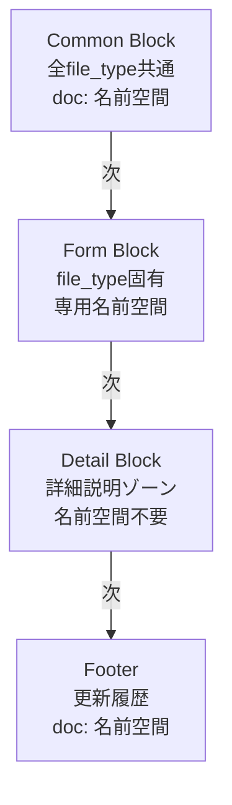
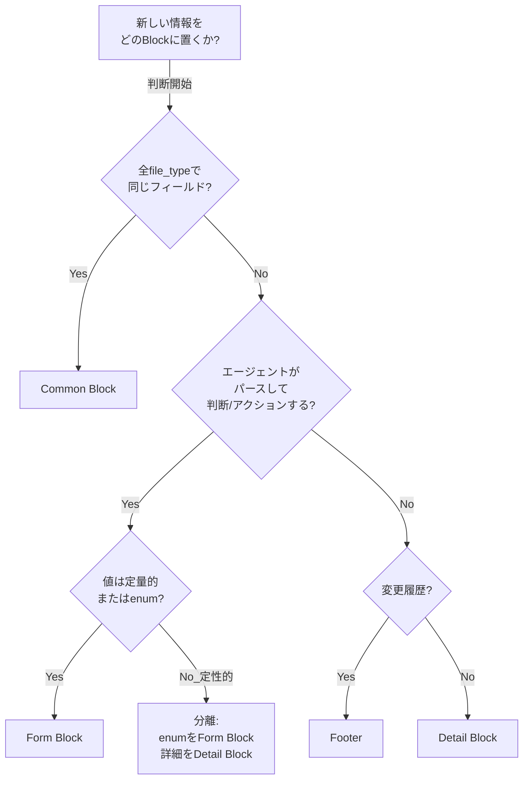
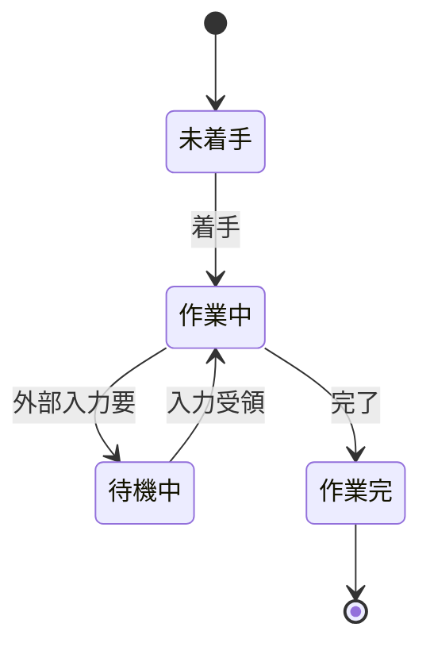
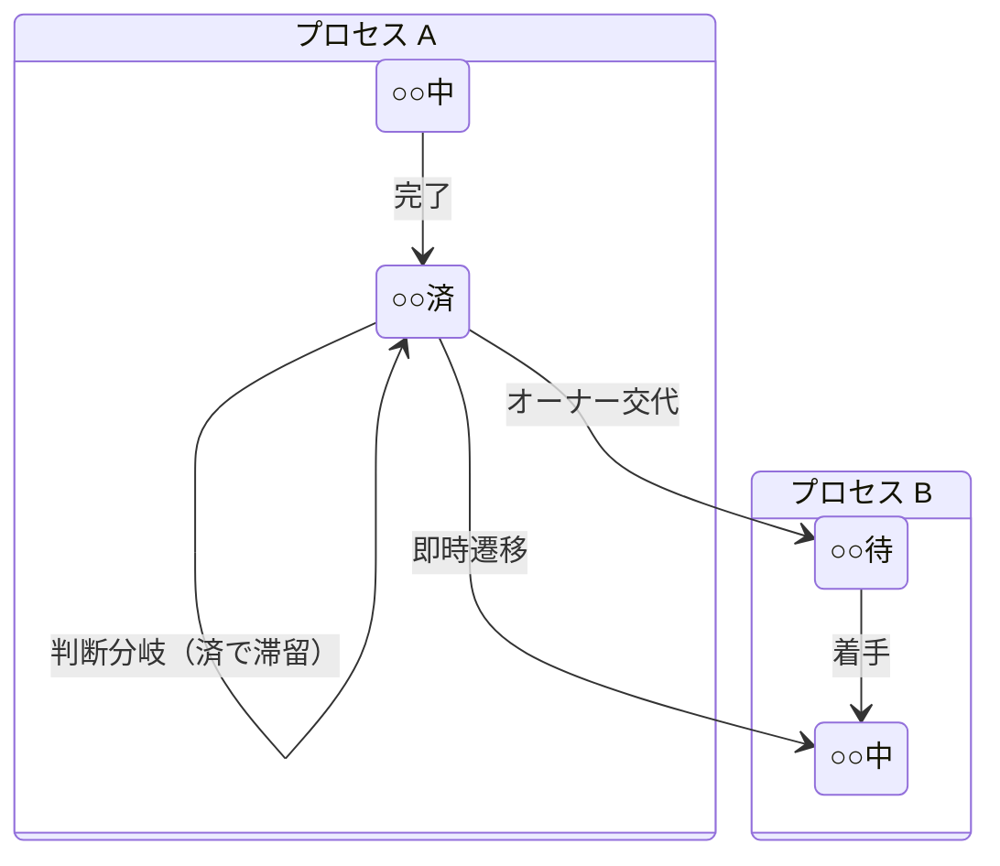
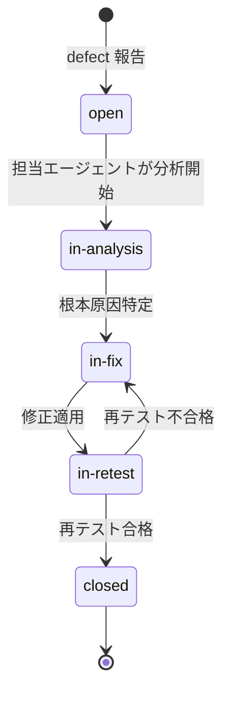

``````markdown
# full-auto-dev 文書管理規則 v0.0.0

## Version 0.0.0 | Date: 2026-03-15

> **ステータス:** Pre-release（PoC前）。PoC完了後に v1.0.0 へ昇格する。

---

# 1. 概要

本文書は、full-auto-devフレームワークにおけるすべてのファイルの命名規則、構造、バージョニング、オーナーシップを定義する。

すべてのエージェントは管理対象ファイルの作成・更新時にこのルールに従わなければならない（MUST）。

プロセスが使う仕様書の形態（ANMS / ANPS / ANGS）にかかわらず、本文書の文書管理フォーマット（Common Block・Form Block等）はすべての管理対象文書に適用される。

**関連文書:** [プロセス規則](full-auto-dev-process-rules.md) — フェーズ定義・エージェント定義・品質管理等のプロセスルール

## 1.1 本文書のバージョニング

本文書自体のバージョンは **MAJOR.MINOR.PATCH** 形式で管理する。

| レベル | 変更対象 | 影響範囲 | 既存ファイル再利用 |
|--------|---------|---------|:------------------:|
| **MAJOR** | Common Block / Footer の構造変更 | 全管理対象ファイル | 全ファイル要マイグレーション |
| **MINOR** | Form Block の変更・追加 | 該当タイプのファイルのみ | 該当タイプのみ要確認 |
| **PATCH** | Detail Block Guidance / 文言修正 | 影響なし | そのまま使える |

管理対象ファイルの `doc:schema_version` は本文書の **MAJOR.MINOR** を記録する（PATCHは省略）。

**リリースステータス:**

| バージョン | 条件 | 意味 |
|-----------|------|------|
| 0.x.x | PoC前 | 設計段階。Common Block含め自由に変更可能 |
| 1.0.0 | PoC完了・検証済み | 正式版。MAJOR変更にはマイグレーションガイドが必要 |

## 1.2 フレームワーク規約の改訂ルール

process-rules/ 配下の全ファイル（本文書を含む）に適用する改訂ルール。

**対象ファイル:**

| ファイル | 内容 |
|---------|------|
| full-auto-dev-process-rules.md | プロセス規則 |
| full-auto-dev-document-rules.md | 文書管理規則（本文書） |
| review-standards.md | レビュー観点規約 |
| prompt-structure.md | プロンプト構造規約 |
| agent-list.md | エージェント一覧 |
| glossary.md | 用語集 |
| defect-taxonomy.md | 不具合系用語の体系（因果連鎖・fault origin・機能安全用語） |
| spec-template.md | 仕様書テンプレート |

**改訂区分:**

| 区分 | 変更内容 | 承認 | 影響分析 |
|------|---------|:----:|---------|
| **Breaking** | 構造変更（セクション・フィールド・名前空間の追加/削除/改名） | ユーザー承認必須 | 影響を受ける全ファイルを列挙 |
| **Non-breaking** | 内容の修正・明確化（既存構造の維持） | ユーザー報告のみ | 不要 |
| **Additive** | 新規追加（新 file_type, 新エージェント, 新用語） | ユーザー報告のみ | 既存への影響なし |

**改訂手順:**

1. 変更内容を特定する
2. 区分を判定する（Breaking / Non-breaking / Additive）
3. Breaking の場合:
   - 影響を受けるファイル（規約・エージェントプロンプト・プロジェクト成果物）を列挙する
   - ユーザーに変更内容と影響を報告し、承認を求める
   - 承認後、規約を変更する
   - 影響を受けるファイルを更新する
4. Non-breaking / Additive の場合:
   - 規約を変更する
   - ユーザーに変更内容を報告する

**履歴管理:** フレームワーク規約の改訂履歴は Git で管理する。規約ファイルは Common Block 対象外であるため、Footer / change_log は不要。

---

# 2. ディレクトリ構成

**フレームワークリポジトリ:**

```
{framework-root}/
  README.md                   # リポジトリ概要
  process-rules/              # 運用規則（フレームワーク定義）
    full-auto-dev-process-rules-ja.md
    full-auto-dev-process-rules-en.md
    full-auto-dev-document-rules-ja.md   # ← 本文書
    full-auto-dev-document-rules-en.md
    agent-list-ja.md                     # エージェント一覧
    agent-list-en.md
    prompt-structure-ja.md               # プロンプト構造規約
    prompt-structure-en.md
    glossary-ja.md                       # 用語集
    glossary-en.md
    review-standards-ja.md               # レビュー観点規約書（R1〜R6）
    review-standards-en.md
    spec-template-ja.md                  # 仕様書テンプレート
    spec-template-en.md
  essays/                     # 論文・リサーチ（日英）
  .claude/commands/           # カスタムコマンド定義
```

**利用先プロジェクト:**

```
{project-root}/
  CLAUDE.md                       # プロジェクト設定（process-rulesを参照）
  user-order.md                   # ユーザー入力仕様（3問形式）
  src/                            # ソースコード
  tests/                          # テストコード
  infra/                          # IaC (Infrastructure as Code)
  project-management/             # オーケストレーション + PM成果物
    pipeline-state.md
    handoff/
    progress/
    old/
  docs/                           # 設計成果物（最終成果物）
    spec/                         # 仕様書
    api/                          # OpenAPI定義
    security/                     # 脅威モデル、セキュリティアーキテクチャ
    observability/                # 可観測性設計
    hardware/                     # HW要求仕様（条件付き）
    ai/                           # AI/LLM要求仕様（条件付き）
    framework/                    # フレームワーク要求仕様（条件付き）
    operations/                   # 運用手順書・DR計画（条件付き）
    old/
  project-records/                # プロセス記録（監査証跡）
    reviews/
    decisions/
    risks/
    defects/
    change-requests/
    traceability/
    security/                     # セキュリティスキャン結果（SAST/SCA/DAST/手動）
    licenses/                     # ライセンスレポート
    performance/                  # 性能テストレポート
    improvement/                  # ふりかえり・改善記録
    release/                      # リリース判定チェックリスト
    incidents/                    # 本番 incident 記録（条件付き）
    legal/                        # 法規調査結果（条件付き）
    safety/                       # 機能安全記録（条件付き）
    field-issues/                 # フィールドテストフィードバック（条件付き）
    snapshots/                    # プロジェクトスナップショット（zip等）
    old/
```

**分離原則:**

| ディレクトリ | 格納内容 | 主な利用者 |
|-------------|----------|-----------|
| `project-management/` | オーケストレーション状態、引継ぎ、進捗、WBS、コスト | leadエージェント、PMエージェント |
| `docs/` | 仕様書、API文書、セキュリティ設計 — 「何を作ったか」 | 全エージェント、ユーザー、下流の利用者 |
| `project-records/` | レビュー、意思決定、リスク、defect、CR — 「どう作ったか」 | 監査者、レビュアー、プロセス重視のステークホルダー |

---

# 3. ファイル命名規則

## 3.1 全体方針

- スタイル: **kebab-case** のみ（例外: 外部標準や言語規約に従う場合）
- タイムスタンプ: **UTC**
- 言語サフィックス: 主言語のファイルはサフィックスなし。翻訳版のみ `-{lang}.md` を付与（§12参照）。フレームワーク文書（process-rules/, essays/）は例外として `-ja.md` / `-en.md` ペアで管理

## 3.2 プロセス文書（project-management/）

パイプライン管理、エージェント間引継ぎ、進捗管理に使用するファイル。

**フォーマット:**

```
{file_type}-{NNN}-{YYYYMMDD}-{HHMMSS}.md
```

| ファイル | 命名例 | 備考 |
|---------|--------|------|
| パイプライン状態 | `pipeline-state.md` | シングルトン。連番・タイムスタンプなし |
| 引継ぎ | `handoff-001-20260314-102530.md` | 標準フォーマット |
| 進捗レポート | `progress-001-20260314-150000.md` | 標準フォーマット |
| コストログ | `cost-log.json` | 時系列JSON。Common Block対象外。owner: progress-monitor、consumed_by: orchestrator |
| テスト推移 | `test-progress.json` | 時系列JSON。Common Block対象外。owner: test-engineer、consumed_by: progress-monitor |
| defect curve | `defect-curve.json` | 時系列JSON。Common Block対象外。owner: test-engineer、consumed_by: progress-monitor |
| WBS | `wbs.md` | シングルトン |
| テスト計画 | `test-plan.md` | シングルトン |
| インタビュー記録 | `interview-record.md` | シングルトン。planning フェーズで作成 |
| ステークホルダー登録簿 | `stakeholder-register.md` | シングルトン。推奨プロセス |

## 3.3 プロセス記録（project-records/）

レビュー、意思決定、リスク、defect、変更要求、トレーサビリティの記録。

**フォーマット:**

```
{file_type}-{NNN}-{YYYYMMDD}-{HHMMSS}.md
```

| ファイル | 命名例 | 備考 |
|---------|--------|------|
| レビュー結果 | `review-003-20260314-153000.md` | 標準フォーマット |
| 意思決定記録 | `decision-002-20260315-090000.md` | 標準フォーマット |
| リスクエントリ | `risk-001-20260314-120000.md` | 個別リスク |
| リスク台帳 | `risk-register.md` | シングルトン。統合台帳 |
| defect 票 | `defect-012-20260316-140000.md` | 標準フォーマット |
| 変更要求 | `change-request-001-20260317-110000.md` | 標準フォーマット |
| トレーサビリティ | `traceability-matrix.md` | シングルトン |
| セキュリティスキャン | `security-scan-report-001-20260318-100000.md` | 標準フォーマット。scan_typeで種別を区別 |
| ライセンスレポート | `license-report.md` | シングルトン |
| 性能テストレポート | `performance-report-001-20260320-140000.md` | 標準フォーマット |
| incident 記録 | `incident-report-001-20260320-100000.md` | 標準フォーマット。operation フェーズ |

## 3.4 仕様書（docs/spec/）

プロジェクトの要求・設計仕様。仕様フォーマット（ANMS/ANPS/ANGS）に依存する。

**フォーマット:**

```
{project-name}-spec.md            # ANMS（単一ファイル）
{project-name}-spec-ch{N}.md      # ANPS（チャプター分割時）
```

| ファイル | 命名例 | 備考 |
|---------|--------|------|
| ANMS仕様書 | `my-app-spec.md` | 単一ファイル |
| ANPS Ch1-2 | `my-app-spec-ch1-2.md` | チャプター分割 |
| ANPS Ch3 | `my-app-spec-ch3.md` | チャプター分割 |
## 3.5 ルート配置文書

プロジェクトルートに配置する高可視性文書。

| ファイル | 命名例 | 備考 |
|---------|--------|------|
| ユーザー入力仕様 | `user-order.md` | シングルトン。3問形式 |
| エグゼクティブダッシュボード | `executive-dashboard.md` | シングルトン。プロジェクト全体の状態要約 |
| 総括レポート | `final-report.md` | シングルトン。delivery フェーズで作成 |

## 3.6 一般文書（docs/）

API定義、セキュリティ設計など、仕様書以外の設計成果物。

**フォーマット:**

```
{内容を表す名前}.{拡張子}
```

| ファイル | 命名例 | 備考 |
|---------|--------|------|
| OpenAPI定義 | `openapi.yaml` | 外部標準（OpenAPI 3.0）に従う |
| 脅威モデル | `threat-model.md` | Common Block付き |
| セキュリティアーキテクチャ | `security-architecture.md` | Common Block付き |
| 可観測性設計 | `observability-design.md` | Common Block付き |
| インフラ構成図 | `infrastructure.md` | Common Block付き |
| ユーザーマニュアル | `user-manual.md` | Common Block付き |
| 運用手順書 | `runbook.md` | Common Block付き |
| 災害復旧計画 | `disaster-recovery-plan.md` | Common Block付き |

## 3.7 ソースコード（src/）

**フォーマット:** 採用言語・フレームワークの規約に従う。

| 言語 | 規約 | 例 |
|------|------|-----|
| TypeScript | camelCase ファイル名、PascalCase コンポーネント | `userService.ts`, `UserCard.tsx` |
| Python | snake_case | `user_service.py` |
| Go | snake_case | `user_service.go` |
| Rust | snake_case | `user_service.rs` |

- Common Block **対象外**
- トレーサビリティは `project-records/traceability/traceability-matrix.md` で管理

## 3.8 テストコード（tests/）

**フォーマット:** テストフレームワークの規約に従う。

| 種別 | 規約 | 例 |
|------|------|-----|
| 単体テスト | 対象ファイル名 + `.test` / `.spec` | `userService.test.ts` |
| 結合テスト | 対象 + `.integration.test` | `api.integration.test.ts` |
| E2Eテスト | フロー名 + `.e2e.test` | `login-flow.e2e.test.ts` |
| 性能テスト | 対象 + `.perf` | `api-latency.perf.js`（k6） |

- Common Block **対象外**

## 3.9 設定・インフラ（ルート / infra/）

**フォーマット:** 各ツールの標準名を使用。リネームしない。

| ファイル | 配置 | 備考 |
|---------|------|------|
| `package.json` | ルート | npm/yarn標準 |
| `tsconfig.json` | ルート | TypeScript標準 |
| `.eslintrc.json` | ルート | ESLint標準 |
| `Dockerfile` | ルート or infra/ | Docker標準 |
| `docker-compose.yml` | ルート or infra/ | Docker Compose標準 |
| `*.tf` | infra/ | Terraform標準 |
| `.github/workflows/*.yml` | .github/ | GitHub Actions標準 |

- Common Block **対象外**

## 3.10 old/ ディレクトリルール

すべてのold/ディレクトリに共通:

- 配置場所: `{同じディレクトリ}/old/`
- ファイル名に日時を付与: `{元のファイル名}-{YYYYMMDD}-{HHMMSS}.md`
- 元のファイルからタイムスタンプ部分を除いた名前を維持（認識しやすさのため）

---

# 4. ブロック構造

管理対象の `.md` ファイルはすべて以下の4部構成に従う。

**ブロック図:**



各ブロックの役割は明確である。Common Blockはファイルを識別し、Form Blockはファイルタイプ固有の定型フォーマット（AIが従うべき構造）を定義し、Detail Blockは詳細な説明・根拠・証拠を記述し、Footerは変更履歴を追跡する。Form Blockは1ファイル内に複数配置できる（例: テストケースの連続）。

## 4.1 情報の配置基準

新しい情報をどのブロックに配置するかは、以下の基準で判断する。

**配置基準テーブル:**

| Block | 判断テスト | 性質 | 用途・利用者 |
|-------|-----------|------|--------|
| **Common Block** | 「全ファイルタイプで同じフィールドか？」→ Yes | ファイルの身元証明（identity） | フレームワーク自体（ファイル発見・ルーティング） |
| **Form Block** | 「エージェントがこの値をパースして判断/アクションするか？」→ Yes | ファイルタイプ固有の構造化された状態・メトリクス | 他のエージェント（意思決定・ゲート・ダッシュボード） |
| **Detail Block** | 「詳細な説明・根拠・証拠か？」→ Yes | ドメイン知識の本体 | 人間 + エージェント（理解のため。ルーティングではない） |
| **Footer** | 「いつ誰が何を変えたか？」→ Yes | 変更履歴（append-only） | 監査（トレーサビリティ、デバッグ） |

**判断フローチャート:**



このフローチャートは、情報のBlock配置を判断する手順を示す。最も迷いやすいのはQ2→Q3の分岐で、「エージェントが使うが定性的」な場合にenumとDetail Blockに分離するパターンである。

**迷ったときの3原則:**

1. **数値・enumはForm Block。** ダッシュボードやゲートで使う可能性があるなら、Detail Blockから導出させず正規化してForm Blockに持つ
2. **定性的な説明はDetail Block。** ただし「定性的に見えるがenumで分類できる」場合は、enumをForm Blockに、詳細をDetail Blockに分離する
3. **迷ったらForm Block寄りに判断する。** 自由形式のDetail Blockからの情報抽出は脆い。構造化できるものは構造化する

## 4.2 配置判断の実例

### 実例1: threat-model.md（脅威モデル）

security-reviewer が脅威モデルを作成。他のエージェントはこれを参照して実装する。

| 情報 | 候補 | 判断 | 理由 |
|------|------|------|------|
| ファイルの目的 | Common? Form? | **Common** (`doc:purpose`) | 全ファイルタイプ共通フィールド |
| 採用した脅威分析手法（STRIDE, DREAD等） | Form? Detail? | **Form Block** (`threat-model:methodology`) | エージェントがパースして手法を判断。dashboardにも表示可能 |
| 特定された脅威の総数 | Form? Detail? | **Form Block** (`threat-model:threat_count`) | 数値メトリクス。progress-monitorが集計 |
| 未軽減の高リスク脅威数 | Form? Detail? | **Form Block** (`threat-model:unmitigated_high_count`) | review-agentがゲート判断に使う（0でないとfail） |
| 脅威ごとの詳細（攻撃ベクター、影響、軽減策） | Form? Detail? | **Detail Block** | 詳細な分析内容。パースして判断はしない |

**判断ポイント:** 「脅威の総数」はDetail Blockの表を数えればわかるが、Form Blockに正規化した数値を持つことで確実に機械読取可能になる。

### 実例2: wbs.md（WBS）

progress-monitor がWBSを管理。orchestrator がフェーズ進行判断に参照する。

| 情報 | 候補 | 判断 | 理由 |
|------|------|------|------|
| 総タスク数 | Form? Detail? | **Form Block** (`wbs:task_total`) | 完了率算出の入力 |
| 完了タスク数 | Form? Detail? | **Form Block** (`wbs:task_completed`) | dashboardに表示 |
| 現在のクリティカルパス | Form? Detail? | **Form Block** (`wbs:critical_path`) | leadがボトルネック判断に使う |
| 各タスクの詳細（担当、期間、依存関係） | Form? Detail? | **Detail Block** | タスク詳細はドメイン知識 |

**判断ポイント:** クリティカルパスはDetail Block内のタスク表から導出できるが、導出値であってもエージェントが即座に判断に使うならForm Block。

### 実例3: executive-dashboard.md（エグゼクティブダッシュボード）

progress-monitor が更新するプロジェクト全体の要約。ユーザーが一目で状況を把握する。

| 情報 | 候補 | 判断 | 理由 |
|------|------|------|------|
| 現在のフェーズ | Form? Detail? | **Form Block** (`executive-dashboard:phase`) | pipeline-stateと同期 |
| プロジェクト全体の完了率 | Form? Detail? | **Form Block** (`executive-dashboard:completion_pct`) | 数値メトリクス |
| 全体のヘルスステータス（green/yellow/red） | Form? Detail? | **Form Block** (`executive-dashboard:health`) | leadが報告要否を判断 |
| オープン中のブロッカー数 | Form? Detail? | **Form Block** (`executive-dashboard:blocker_count`) | 0でなければエスカレーション |
| 各フェーズの詳細サマリー | Form? Detail? | **Detail Block** | 人間が読むための要約文 |

**判断ポイント:** dashboardはForm Blockが大きくなるが、それは正しい。このファイルの存在意義が「構造化されたステータスの集約」だから。

### 実例4: final-report.md（総括レポート）

delivery フェーズでleadが作成。ユーザーがプロジェクト終了を判断するための材料。

| 情報 | 候補 | 判断 | 理由 |
|------|------|------|------|
| 最終テスト合格率 | Form? Detail? | **Form Block** (`final-report:test_pass_rate`) | 受入判断の入力 |
| カバレッジ達成率 | Form? Detail? | **Form Block** (`final-report:coverage_pct`) | 同上 |
| 未解決のCritical/High defect 数 | Form? Detail? | **Form Block** (`final-report:open_critical`, `final-report:open_high`) | 0でなければリリース不可 |
| 目標達成の評価 | Form? Detail? | **分離**: enum (`final-report:goal_achievement`: achieved/partial/not-achieved) → **Form Block**、詳細 → **Detail Block** | 定性的だがenumで分類可能 |
| 残課題・技術的負債のリスト | Form? Detail? | **Detail Block** | 詳細なリスト |
| 学んだ教訓（Lessons Learned） | Form? Detail? | **Detail Block** | 完全に自由記述 |

**判断ポイント:** 「目標達成の評価」は定性的に見えるが、enumで分類してForm Blockに、詳細説明をDetail Blockに分離する。

### 実例5: user-order.md / {project}-spec.md（仕様書）

srs-writerがCh1-2を作成、architectがCh3-6を詳細化。

| 情報 | 候補 | 判断 | 理由 |
|------|------|------|------|
| 仕様形式（ANMS/ANPS） | Form? Detail? | **Form Block** (`spec-foundation:format`) | エージェントが読取方法を判断 |
| 完成済みチャプター（Ch1-2内） | Form? Detail? | **Form Block** (`spec-foundation:completed_chapters`) | architectが引継ぎ可能か判断。doc:document_statusとは別概念（文書全体 vs チャプター単位） |
| 完成済みチャプター | Form? Detail? | **Form Block** (`spec-architecture:completed_chapters`) | architectが作業開始位置を判断 |
| 機能要求数 / 非機能要求数 | Form? Detail? | **Form Block** (`spec-foundation:fr_count`, `spec-foundation:nfr_count`) | traceabilityカバレッジ算出の母数 |
| Ch1-6の本文全体 | Form? Detail? | **Detail Block** | ANMS/ANPSフォーマットに従う仕様本体 |

**判断ポイント:** Common Block + Form Blockは「仕様書というファイルのメタデータ」。ANMSの章構成は「仕様の中身」。メタデータと中身は別レイヤーであり、二重管理にはならない。

### 実例6: performance-report-NNN-*.md（性能テストレポート）

test-engineerがk6実行後に作成。NFR目標との比較結果。

| 情報 | 候補 | 判断 | 理由 |
|------|------|------|------|
| テスト対象エンドポイント数 | Form? Detail? | **Form Block** (`performance-report:endpoint_count`) | dashboardに集計 |
| NFR達成率（pass/total） | Form? Detail? | **Form Block** (`performance-report:nfr_pass_rate`) | 100%でないとtesting フェーズ不合格 |
| P99レイテンシの最大値 | Form? Detail? | **Form Block** (`performance-report:p99_max_ms`) | SLA超過のアラート判断 |
| 各エンドポイントの詳細結果 | Form? Detail? | **Detail Block** | レイテンシ・スループット・エラー率の表 |
| k6スクリプトの設定パラメータ | Form? Detail? | **Detail Block** | テスト条件の記録（再現性のため） |

---

## 4.3 ステータス値の命名規約

本フレームワークにおけるステータス値（enum型フィールドの選択肢）は、以下のメタルールに従って定義する。

### 4.3.1 ライフサイクルモデル

全てのステータスは以下の4状態のいずれかに分類される。

| # | 状態 | 意味 | 英語パターン | 日本語パターン |
|:-:|------|------|-------------|--------------|
| 1 | 未着手 | まだ作業が開始されていない | 形容詞・名詞（open, draft） | ○○前 / 未○○ |
| 2 | 作業中 | 作業が進行中 | in-{名詞}（in-review, in-analysis） | ○○中 |
| 3 | 待機中 | 外部入力待ちで停止している | waiting-for-{名詞} / needs-{名詞} / blocked | ○○待 |
| 4 | 作業完 | 作業が完了済み | 過去分詞（approved, fixed, closed） | ○○済 |

> **注記:** `pass / fail` 等の判定結果（二値）はライフサイクル状態ではないため本規約の適用外とする。



### 4.3.2 命名規則

1. **値は kebab-case、英語固定** — 言語ポリシー（§12）に従い、ステータス値は翻訳しない
2. **「作業中」は `in-{名詞}` で統一する** — ステータスの主語は「モノ」（文書、defect等）であり、`-ing` 形は主語が動作主に見えるため使用しない（例: ✗ `reviewing` → ✓ `in-review`）
3. **「作業完」には過去分詞を使う** — 完了は「行為」ではなく「結果の状態」である（例: approved, fixed, closed）
4. **「待機中」は待機対象を明示する** — `waiting-for-{名詞}` / `needs-{名詞}` を使用する。`blocked` は原因不明・外部要因での停止に限定する

### 4.3.3 プロセス間遷移ルール

あるプロセス A の完了が次のプロセス B の開始に繋がる場合、3つのパターンがある。

| パターン | 条件 | 遷移 | 例 |
|---------|------|------|-----|
| 即時遷移 | 判断不要かつオーナー同一 | A済 → B中（A済はログに記録、ステータスとしては経由しない） | fixed → in-retest |
| 判断分岐 | 分岐先が複数ある | A済で滞留 → 判断後に遷移（判断を decision として記録） | reviewed → {in-fix / deferred / accepted} |
| オーナー交代 | 次のオーナーが異なる | A済 → B待 → B中（「待」を必ず挟む） | implemented → waiting-for-review → in-review |

**判断基準:**

1. 分岐先が複数あるか？ → Yes なら**判断分岐**
2. オーナーが変わるか？ → Yes なら**オーナー交代**
3. どちらも No → **即時遷移**



---

# 5. Common Block 仕様

フィールド順序は固定。エージェントはフィールドの順序変更や必須フィールドの省略をしてはならない（MUST NOT）。

**フィールド順序（AIの読取フローに最適化）:**

```
── 識別（何をどう読むか）──
schema_version → file_type → form_block_cardinality → language
── 状態（触っていいか）──
→ document_status
── ワークフロー（自分の仕事か）──
→ owner → commissioned_by → consumed_by
── コンテキスト（何の話か）──
→ project → purpose → summary
── 参照（関連は何か）──
→ related_docs
── 出自（いつ誰が）──
→ created_by → created_at
```

**フィールド定義:**

| フィールド | 型 | 必須 | グループ | 説明 |
|-----------|------|------|---------|------|
| schema_version | string | Yes | 識別 | スキーマバージョン（現在 "0.0"） |
| file_type | enum | Yes | 識別 | 登録済みファイルタイプの1つ（第7章参照） |
| form_block_cardinality | enum: single / multiple | Yes | 識別 | このファイルのForm Blockが単一か複数か |
| language | string (ISO 639-1) | Yes | 識別 | このファイルの記述言語（例: `ja`, `en`, `fr`） |
| document_status | enum: draft / in-review / approved / archived | Yes | 状態 | 文書のライフサイクルステータス |
| owner | string | Yes | ワークフロー | 書込み権限を持つエージェント |
| commissioned_by | string | Yes | ワークフロー | この文書の作成トリガー（値: `user`, `orchestrator`, `phase-{name}`, または `{agent-name}`） |
| consumed_by | string | Yes | ワークフロー | この文書を次に利用するエージェント |
| project | string | Yes | コンテキスト | プロジェクト名 |
| purpose | string | Yes | コンテキスト | このファイルが存在する理由と期待されるアクション |
| summary | string | Yes | コンテキスト | ファイル内容の簡潔な説明 |
| related_docs | list | No | 参照 | 入力/出力/次のファイルへの参照 |
| created_by | string | Yes | 出自 | ファイルを作成したエージェント |
| created_at | datetime | Yes | 出自 | ISO 8601 作成タイムスタンプ（UTC） |

**Common Block テンプレート:**

```markdown
<!-- ============================================================
     COMMON BLOCK | DO NOT MODIFY STRUCTURE OR FIELD NAMES
     ============================================================ -->

## Identification

<!-- FIELD: schema_version | type: string | required: true -->

<doc:schema_version>0.0</doc:schema_version>

<!-- FIELD: file_type | type: enum | required: true -->

<doc:file_type>{file_type}</doc:file_type>

<!-- FIELD: form_block_cardinality | type: enum | values: single,multiple | required: true -->

<doc:form_block_cardinality>{single_or_multiple}</doc:form_block_cardinality>

<!-- FIELD: language | type: string (ISO 639-1) | required: true -->

<doc:language>{language_code}</doc:language>

## Document State

<!-- FIELD: document_status | type: enum | values: draft,in-review,approved,archived | required: true -->

<doc:document_status>draft</doc:document_status>

## Workflow

<!-- FIELD: owner | type: string | required: true -->

<doc:owner>{agent-name}</doc:owner>

<!-- FIELD: commissioned_by | type: string | required: true -->
<!-- Trigger for this document's creation: user, orchestrator, phase-{name}, or {agent-name} -->

<doc:commissioned_by>{trigger}</doc:commissioned_by>

<!-- FIELD: consumed_by | type: string | required: true -->
<!-- Which agent will use this document next -->

<doc:consumed_by>{agent-name}</doc:consumed_by>

## Context

<!-- FIELD: project | type: string | required: true -->

<doc:project>{project-name}</doc:project>

<!-- FIELD: purpose | type: string | required: true -->
<!-- Tell the agent WHY this file exists and what action is expected -->

<doc:purpose>
{purpose}
</doc:purpose>

<!-- FIELD: summary | type: string | required: true -->

<doc:summary>
{summary}
</doc:summary>

## References

<!-- FIELD: related_docs | type: list | required: false -->

<doc:related_docs>
<doc:ref>{path-to-related-file}</doc:ref>
</doc:related_docs>

## Provenance

<!-- FIELD: created_by | type: string | required: true -->

<doc:created_by>{agent-name}</doc:created_by>

<!-- FIELD: created_at | type: datetime | required: true -->

<doc:created_at>{ISO-8601-timestamp}</doc:created_at>
```

**related_docs サブタグ:**

| サブタグ | 意味 |
|---------|------|
| `<doc:ref>` | 一般参照（デフォルト） |
| `<doc:input>` | この文書が消費するファイル |
| `<doc:output>` | この文書が生成するファイル |
| `<doc:next>` | シーケンス上の次のファイル（例: 次のhandoff） |

---

# 6. Footer 仕様

Footerは全ファイルタイプ共通。エージェントは書込みのたびにchange_logに新しい `<entry>` を追記しなければならない（MUST）。

**Footer テンプレート:**

```markdown
<!-- ============================================================
     FOOTER | append change_log entry on every write
     ============================================================ -->

## Last Updated

<!-- FIELD: updated_by | type: string | required: true -->

<doc:updated_by>{agent-name}</doc:updated_by>

<!-- FIELD: updated_at | type: datetime | required: true -->

<doc:updated_at>{ISO-8601-timestamp}</doc:updated_at>

## Change Log

<!-- FIELD: change_log | type: list | append-only | DO NOT MODIFY OR DELETE EXISTING ENTRIES -->

<doc:change_log>
<entry at="{ISO-8601-timestamp}" by="{agent-name}" action="created" />
</doc:change_log>
```

**change_log ルール:**

- 追記専用（append-only）: 既存エントリの変更・削除は厳禁（NEVER）
- 各書込み操作で新しい `<entry>` を追加しなければならない（MUST）
- `action` フィールドに変更内容を記述する（例: "created", "updated phase to 2", "archived previous version to old/"）

---

# 7. ファイルタイプ（Common Block管理対象）

**名前空間命名規則:** 名前空間はfile_type名をそのまま使用する。略称は禁止（例: ~~`cr:`~~ → `change-request:`）。原則2単語以下、最大3単語。`doc:` はCommon Block + Footer専用で予約済み。カテゴリにサブタイプがある場合はカテゴリを先頭に置く（例: `spec-foundation:`, `spec-architecture:`）。

| file_type | 名前空間 | 目的 | ディレクトリ | シングルトン? |
|-----------|---------|------|-------------|:----------:|
| pipeline-state | `pipeline-state:` | パイプラインオーケストレーション状態 | `project-management/` | Yes |
| handoff | `handoff:` | エージェント間タスク引継ぎ | `project-management/handoff/` | No |
| progress | `progress:` | プロジェクト進捗とメトリクス | `project-management/progress/` | No |
| interview-record | `interview-record:` | インタビュー記録 | `project-management/` | Yes |
| wbs | `wbs:` | WBS・ガントチャート | `project-management/progress/` | Yes |
| test-plan | `test-plan:` | テスト計画 | `project-management/` | Yes |
| review | `review:` | コード/設計レビュー結果 | `project-records/reviews/` | No |
| decision | `decision:` | アーキテクチャ意思決定記録 | `project-records/decisions/` | No |
| risk | `risk:` | リスクエントリおよび台帳 | `project-records/risks/` | No |
| defect | `defect:` | defect tracking | `project-records/defects/` | No |
| change-request | `change-request:` | 変更要求管理 | `project-records/change-requests/` | No |
| traceability | `traceability:` | 要求-テスト間トレース | `project-records/traceability/` | Yes |
| license-report | `license-report:` | ライセンス互換性レポート | `project-records/licenses/` | Yes |
| performance-report | `performance-report:` | 性能テスト結果レポート | `project-records/performance/` | No |
| spec-foundation | `spec-foundation:` | 仕様書 Ch1-2（Foundation・Requirements） | `docs/spec/` | Yes |
| spec-architecture | `spec-architecture:` | 仕様書 Ch3-6（Architecture・Specification・Test Strategy・Design Principles） | `docs/spec/` | Yes |
| threat-model | `threat-model:` | 脅威モデル | `docs/security/` | Yes |
| security-architecture | `security-architecture:` | セキュリティ設計 | `docs/security/` | Yes |
| observability-design | `observability-design:` | 可観測性設計 | `docs/observability/` | Yes |
| hw-requirement-spec | `hw-requirement-spec:` | HW要求仕様（条件付き。external-dependency-spec継承） | `docs/hardware/` | Yes |
| ai-requirement-spec | `ai-requirement-spec:` | AI/LLM要求仕様（条件付き。external-dependency-spec継承） | `docs/ai/` | Yes |
| framework-requirement-spec | `framework-requirement-spec:` | フレームワーク要求仕様（条件付き。external-dependency-spec継承） | `docs/framework/` | Yes |
| executive-dashboard | `executive-dashboard:` | プロジェクト全体ダッシュボード | ルート | Yes |
| final-report | `final-report:` | プロジェクト総括レポート | ルート | Yes |
| user-order | `user-order:` | ユーザー入力仕様（3問形式） | ルート | Yes |
| user-manual | `user-manual:` | エンドユーザー向け操作マニュアル | `docs/` | Yes |
| security-scan-report | `security-scan-report:` | セキュリティスキャン結果（SAST/SCA/DAST/手動） | `project-records/security/` | No |
| runbook | `runbook:` | 運用手順書（日常運用・incident 対応） | `docs/operations/` | Yes |
| incident-report | `incident-report:` | 本番 incident 記録・事後分析 | `project-records/incidents/` | No |
| disaster-recovery-plan | `disaster-recovery-plan:` | 災害復旧計画（RPO/RTO・復旧手順） | `docs/operations/` | Yes |
| stakeholder-register | `stakeholder-register:` | ステークホルダー登録簿（推奨プロセス） | `project-management/` | Yes |
| retrospective-report | `retrospective-report:` | ふりかえり・プロセス改善記録 | `project-records/improvement/` | No |
| field-issue | `field-issue:` | 実機テストフィードバック管理（defect / CR 統合）。条件付き: 実機テスト有効時 | `project-records/field-issues/` | No |

### external-dependency-spec（外部依存要求仕様テンプレート）

外部依存（Clean ArchitectureのFramework層）に対する要求仕様の共通テンプレート。以下の3つの具体的file_typeがこのテンプレートを継承する。

**継承関係:**

```
external-dependency-spec（抽象テンプレート）
  ├── hw-requirement-spec（物理デバイス: 組込み/IoT）
  ├── ai-requirement-spec（AI/LLM: 推論/生成サービス）
  └── framework-requirement-spec（DB/Web/インフラ等: 非標準I/Fの場合のみ）
```

**共通Detail Block章構成（全子タイプが継承）:**

| 章 | 内容 | 説明 |
|:--:|------|------|
| 1 | 目的 | この外部依存が何を実現するか |
| 2 | 要求 | SWが求める能力・性能 |
| 3 | I/F定義 | SW側のAdapter層の境界。ここがSW Spec Ch3と対応する |
| 4 | 制約 | 外部依存がSWに課す制限 |
| 5 | 差し替え戦略 | 代替手段と移行影響。DIPによる抽象化の根拠 |
| 6 | その他 | 調達・コスト・リビジョン管理等 |

**適用判断:** planning フェーズのインタビューで「何が外部依存で、何が自分たちのオリジナルか」を識別する。I/F標準度が低い外部依存には専用のrequirement-specを作成する。I/F標準度が高い場合（標準SQL、公式フレームワークAPI等）は `project-records/decisions/` に選定理由を記録するのみで十分。

---

## 7.1 ワークフロー参照テーブル

各file_typeの `commissioned_by`（作成トリガー）と `consumed_by`（次の利用者）の標準値。エージェントはファイル作成時にCommon Blockのこれらのフィールドを以下に従って記入する。

**commissioned_by の値パターン:**

| 値 | 意味 |
|---|------|
| `user` | ユーザーが直接作成 |
| `orchestrator` | leadが自身の責務として作成 |
| `phase-{name}` | プロセス規則のフェーズ遷移がトリガー |
| `{agent-name}` | 特定エージェントのイベントがトリガー |

**フェーズ名:**

| フェーズ名 | 意味 |
|-----------|------|
| `phase-setup` | セットアップ・プロセス評価 |
| `phase-planning` | 企画（インタビュー＆仕様） |
| `phase-dependency-selection` | 外部依存の評価・選定・調達 |
| `phase-design` | 設計 |
| `phase-implementation` | 実装 |
| `phase-testing` | テスト |
| `phase-delivery` | 納品 |
| `phase-operation` | 運用・保守 |

**ワークフロー参照テーブル:**

| file_type | commissioned_by | consumed_by | owner |
|-----------|----------------|-------------|-------|
| pipeline-state | `orchestrator` | 全エージェント | orchestrator |
| handoff | フェーズ遷移時（例: `phase-planning`） | to-agent | orchestrator |
| progress | `phase-design`（以降更新） | orchestrator, ユーザー | progress-monitor |
| interview-record | `phase-planning` | architect, orchestrator | srs-writer |
| wbs | `phase-design` | progress-monitor, orchestrator | progress-monitor |
| test-plan | `phase-design` | test-engineer, review-agent | test-engineer |
| review | フェーズゲート（例: `phase-planning`） | orchestrator, 対象エージェント | review-agent |
| decision | 判断を要したエージェント | 全エージェント | orchestrator |
| risk | `phase-planning` | risk-manager, orchestrator | risk-manager |
| defect | `test-engineer` | 修正担当エージェント | test-engineer |
| change-request | `user`（ユーザー起点の変更要求のみ） | change-manager, orchestrator | change-manager |
| traceability | `phase-implementation` | review-agent | test-engineer |
| license-report | `phase-implementation` | orchestrator, security-reviewer | license-checker |
| performance-report | `phase-testing` | review-agent, orchestrator | test-engineer |
| spec-foundation | `phase-planning` | architect, review-agent | srs-writer |
| spec-architecture | `phase-design` | 実装エージェント, review-agent | architect |
| threat-model | `phase-design` | architect, 実装エージェント | security-reviewer |
| security-architecture | `phase-design` | architect, 実装エージェント | security-reviewer |
| observability-design | `phase-design` | 実装エージェント | architect |
| hw-requirement-spec | `phase-design` | architect（Adapter層設計）, test-engineer（結合テスト計画） | architect |
| ai-requirement-spec | `phase-design` | architect（Adapter層設計）, 実装エージェント | architect |
| framework-requirement-spec | `phase-design` | architect（Adapter層設計）, 実装エージェント | architect |
| executive-dashboard | `phase-setup` | ユーザー, orchestrator | orchestrator |
| final-report | `phase-delivery` | ユーザー | orchestrator |
| user-order | `user` | srs-writer | srs-writer |
| security-scan-report | `phase-implementation`（以降随時） | review-agent, orchestrator | security-reviewer |
| user-manual | `phase-delivery` | ユーザー | user-manual-writer |
| runbook | `phase-delivery` | 運用チーム | runbook-writer |
| incident-report | `phase-operation`（随時） | orchestrator, ユーザー | incident-reporter |
| disaster-recovery-plan | `phase-design` | 運用チーム, orchestrator | architect |
| stakeholder-register | `phase-setup` | 全エージェント | orchestrator |
| retrospective-report | フェーズ完了時（随時） | orchestrator | process-improver |
| field-issue | 実機テスト中（随時） | orchestrator, implementer, test-engineer | field-test-engineer |

---

# 8. 名前空間プレフィックス

名前空間プレフィックスは標準HTML/XMLタグとの衝突を防ぎ、フィールドを機械的にパース可能にする。命名規則は§7を参照。

| 名前空間 | 使用箇所 | 例 |
|---------|----------|-----|
| `doc:` | Common Block + Footer（予約） | `<doc:schema_version>0.0</doc:schema_version>` |
| `pipeline-state:` | pipeline-state Form Block | `<pipeline-state:phase>2</pipeline-state:phase>` |
| `handoff:` | handoff Form Block | `<handoff:from>srs-writer</handoff:from>` |
| `progress:` | progress Form Block | `<progress:completion_pct>45</progress:completion_pct>` |
| `interview-record:` | interview-record Form Block | `<interview-record:interview_status>completed</interview-record:interview_status>` |
| `wbs:` | wbs Form Block | `<wbs:task_total>24</wbs:task_total>` |
| `test-plan:` | test-plan Form Block | `<test-plan:test_level>unit,integration,e2e</test-plan:test_level>` |
| `review:` | review Form Block | `<review:result>pass</review:result>` |
| `decision:` | decision Form Block | `<decision:id>DEC-001</decision:id>` |
| `risk:` | risk Form Block | `<risk:score>6</risk:score>` |
| `defect:` | defect Form Block | `<defect:severity>high</defect:severity>` |
| `change-request:` | change-request Form Block | `<change-request:impact_level>medium</change-request:impact_level>` |
| `traceability:` | traceability Form Block | `<traceability:coverage_pct>85</traceability:coverage_pct>` |
| `license-report:` | license-report Form Block | `<license-report:compatible_count>12</license-report:compatible_count>` |
| `performance-report:` | performance-report Form Block | `<performance-report:nfr_pass_rate>100%</performance-report:nfr_pass_rate>` |
| `spec-foundation:` | spec-foundation Form Block | `<spec-foundation:fr_count>15</spec-foundation:fr_count>` |
| `spec-architecture:` | spec-architecture Form Block | `<spec-architecture:completed_chapters>3,4</spec-architecture:completed_chapters>` |
| `threat-model:` | threat-model Form Block | `<threat-model:threat_count>8</threat-model:threat_count>` |
| `security-architecture:` | security-architecture Form Block | `<security-architecture:owasp_coverage>10/10</security-architecture:owasp_coverage>` |
| `observability-design:` | observability-design Form Block | `<observability-design:log_format>structured-json</observability-design:log_format>` |
| `hw-requirement-spec:` | hw-requirement-spec Form Block | `<hw-requirement-spec:interface_count>4</hw-requirement-spec:interface_count>` |
| `ai-requirement-spec:` | ai-requirement-spec Form Block | `<ai-requirement-spec:model_capability>reasoning,code-generation</ai-requirement-spec:model_capability>` |
| `framework-requirement-spec:` | framework-requirement-spec Form Block | `<framework-requirement-spec:framework_name>PostgreSQL</framework-requirement-spec:framework_name>` |
| `executive-dashboard:` | executive-dashboard Form Block | `<executive-dashboard:health>green</executive-dashboard:health>` |
| `final-report:` | final-report Form Block | `<final-report:goal_achievement>achieved</final-report:goal_achievement>` |
| `user-order:` | user-order Form Block | `<user-order:format>ANMS</user-order:format>` |
| `security-scan-report:` | security-scan-report Form Block | `<security-scan-report:scan_type>sast</security-scan-report:scan_type>` |
| `user-manual:` | user-manual Form Block | `<user-manual:target_audience>end-user</user-manual:target_audience>` |
| `runbook:` | runbook Form Block | `<runbook:last_drill_date>2026-03-15</runbook:last_drill_date>` |
| `incident-report:` | incident-report Form Block | `<incident-report:severity>P1</incident-report:severity>` |
| `disaster-recovery-plan:` | disaster-recovery-plan Form Block | `<disaster-recovery-plan:rto_hours>4</disaster-recovery-plan:rto_hours>` |
| `stakeholder-register:` | stakeholder-register Form Block | `<stakeholder-register:stakeholder_count>5</stakeholder-register:stakeholder_count>` |
| `retrospective-report:` | retrospective-report Form Block | `<retrospective-report:approval_status>proposed</retrospective-report:approval_status>` |
| `field-issue:` | field-issue Form Block | `<field-issue:type>defect</field-issue:type>` |

---

# 9. Form Block 仕様

各Form BlockはCommon BlockとDetail Blockの間に位置する。名前空間プレフィックスはfile_typeに対応する。

## 9.0 Form Block 定義メタテンプレート

新しいForm Blockを定義する際は、以下の2セクション構成に従わなければならない（MUST）。

**メタテンプレート:**

```
## 9.N {file_type}（名前空間: {namespace}:）

### Fields

| フィールド | 型 | 必須 | 説明 | 値域・制約 |
|-----------|------|------|------|-----------|
| {namespace}:{field_name} | {type} | {Yes/No} | {説明} | {enum値、範囲、トリガー条件} |

### Detail Block Guidance

{このファイルタイプのDetail Blockに記載すべきセクション構成と内容の指示}
```

**各セクションの責務:**

| セクション | 責務 | 記述内容 |
|-----------|------|---------|
| **Fields** | AIが従うべき定型構造の定義 | フィールド名、型、必須/任意、説明、値域（enum値・数値範囲）、制約（エスカレーション条件・ゲート条件等） |
| **Detail Block Guidance** | Detail Blockの構造制約 | 推奨セクション見出し、各セクションに記載すべき内容、採用すべき記述形式（ADR形式、テーブル形式等） |

**メタテンプレートに含めないもの（Common Block または §7 で管理）:**

| 情報 | 管理場所 | 理由 |
|------|---------|------|
| file_type, owner | Common Block | 全タイプ共通フィールド |
| document_status | Common Block | 全タイプ共通フィールド |
| commissioned_by, consumed_by | Common Block | 全タイプ共通フィールド |
| form_block_cardinality | Common Block | 全タイプ共通フィールド |
| 名前空間、シングルトン、ディレクトリ | §7 file_type テーブル | タイプの登録情報 |

**Fields テーブルの「値域・制約」列の記述ルール:**

- enum値: スラッシュ区切りで列挙する（例: `open / in-fix / closed`）
- 数値範囲: 範囲を明示する（例: `0-100`）
- トリガー条件: `→` で結果を記述する（例: `≧6 → ユーザーに通知`）
- ゲート条件: `= 0 required for phase transition` のように記述する

---

## 9.1 pipeline-state（名前空間: pipeline-state:）

### Fields

| フィールド | 型 | 必須 | 説明 | 値域・制約 |
|-----------|------|------|------|-----------|
| pipeline-state:phase | int | Yes | 現在のフェーズ | 0-7 |
| pipeline-state:phase_label | string | Yes | 人間可読なフェーズ名 | — |
| pipeline-state:step | string | Yes | 現在のステップID | — |
| pipeline-state:step_label | string | Yes | ステップの説明 | — |
| pipeline-state:phase_progress | string | Yes | 現在フェーズの「完了/全体」 | — |
| pipeline-state:active_agents | list | Yes | 稼働中エージェントのタスクと開始時刻 | エントリ形式は下記参照 |
| pipeline-state:blocked | boolean | Yes | 進行がブロックされているか？ | true / false |
| pipeline-state:blocked_by | string | No | ブロッキング条件 | — |
| pipeline-state:needs_human | boolean | Yes | ユーザー待ちか？ | true / false |
| pipeline-state:human_action | string | No | ユーザーが行うべきアクション | — |
| pipeline-state:current_gate | string | No | 活性中の品質ゲート | — |
| pipeline-state:gate_result | enum | No | ゲート結果 | pending / pass / fail |
| pipeline-state:gate_fail_target | string | No | ゲート失敗時の戻り先フェーズ | — |
| pipeline-state:latest_handoff | string | No | 最新の引継ぎファイルパス | — |

**active_agents エントリ形式:**

```xml
<agent name="{agent-name}" task="{task-description}" started_at="{ISO-8601}" />
```

### Detail Block Guidance

フェーズ遷移ログ（追記専用テーブル）と自由記述ノートを記載する。

## 9.2 handoff（名前空間: handoff:）

### Fields

| フィールド | 型 | 必須 | 説明 | 値域・制約 |
|-----------|------|------|------|-----------|
| handoff:id | string | Yes | handoff-NNN | — |
| handoff:from | string | Yes | 送信元エージェント | — |
| handoff:to | string | Yes | 受信先エージェント | — |
| handoff:phase_transition | string | Yes | "N->N" フェーズ遷移 | — |
| handoff:handoff_status | enum | Yes | 引継ぎステータス | ready / in-progress / completed / blocked / needs-human |

### Detail Block Guidance

引渡し成果物、人的介入の必要事項、品質ゲート結果を記載する。

## 9.3 review（名前空間: review:）

### Fields

| フィールド | 型 | 必須 | 説明 | 値域・制約 |
|-----------|------|------|------|-----------|
| review:id | string | Yes | review-NNN | — |
| review:target | string | Yes | レビュー対象（ファイルパスまたは説明） | — |
| review:dimensions | string | Yes | 適用したR1-R6次元（例: "R1" または "R2,R4,R5"） | — |
| review:result | enum | Yes | レビュー結果 | pass / fail |
| review:critical_count | int | Yes | Critical指摘の件数 | = 0 required for phase transition |
| review:high_count | int | Yes | High指摘の件数 | = 0 required for phase transition |
| review:medium_count | int | Yes | Medium指摘の件数 | — |
| review:low_count | int | Yes | Low指摘の件数 | — |
| review:gate_phase | string | No | このレビューがゲートするフェーズ遷移（例: "1->2"） | — |
| review:findings_resolved_count | int | Yes | 対応が「修正」の指摘件数 | — |
| review:findings_deferred_count | int | No | 対応が「据置き」の指摘件数。各件に project-records/decisions/ への decision 記録が必須 | — |

### Detail Block Guidance

レビュー指摘の詳細（指摘箇所、重大度、修正提案）を記載する。品質ゲートルール: フェーズ遷移には CLAUDE.md 品質目標で定義された閾値を満たし、かつ全指摘に対応記録があることが必要（process-rules §9.5 参照）。

**指摘対応テーブル（全レビュー報告で必須）:**

| # | 重大度 | 指摘概要 | 対応 | 参照 |
|:-:|:------:|---------|:----:|------|
| 1 | ... | ... | 修正済み / 据置き / 受容済み | 修正内容 or DEC-NNN |

対応区分: **修正済み（fixed）** = 修正済み・検証済み、**据置き（deferred）** = 認識済みだが据置き（decision 記録必須）、**受容済み（accepted）** = 理由付きで現状受容。

## 9.4 decision（名前空間: decision:）

### Fields

| フィールド | 型 | 必須 | 説明 | 値域・制約 |
|-----------|------|------|------|-----------|
| decision:id | string | Yes | DEC-NNN | — |
| decision:category | enum | Yes | 意思決定カテゴリ | architecture / security / technology / process / requirement |
| decision:decision_status | enum | Yes | 意思決定ステータス | proposed / approved / rejected / superseded |
| decision:approved_by | string | No | 承認者（ユーザーまたはlead）。未承認時は空 | — |

### Detail Block Guidance

Michael NygardのADR形式: Status / Context / Decision / Consequences を記載する。

## 9.5 risk（名前空間: risk:）

### Fields

| フィールド | 型 | 必須 | 説明 | 値域・制約 |
|-----------|------|------|------|-----------|
| risk:id | string | Yes | RISK-NNN | — |
| risk:probability | enum | Yes | 発生確率 | low(1) / medium(2) / high(3) |
| risk:impact | enum | Yes | 影響度 | low(1) / medium(2) / high(3) |
| risk:score | int | Yes | probability x impact | 1-9、≧6 → ユーザーに通知 |
| risk:mitigation | string | Yes | 軽減策 | — |
| risk:risk_status | enum | Yes | リスクステータス | open / mitigated / closed / accepted |
| risk:assigned_to | string | Yes | 軽減担当のエージェントまたはロール | — |

### Detail Block Guidance

リスクの詳細分析（原因、影響シナリオ、軽減策の詳細）を記載する。エスカレーションルール: スコア 6以上はユーザーへの通知が必要。

## 9.6 progress（名前空間: progress:）

### Fields

| フィールド | 型 | 必須 | 説明 | 値域・制約 |
|-----------|------|------|------|-----------|
| progress:phase | int | Yes | 現在のフェーズ（pipeline-stateと同期） | 0-7 |
| progress:completion_pct | int | Yes | プロジェクト全体の完了率 | 0-100 |
| progress:wbs_completed | string | Yes | "完了/全体" タスク数 | — |
| progress:test_pass_rate | string | No | "合格/全体"（implementation フェーズ以前は空） | — |
| progress:coverage_pct | int | No | コードカバレッジ%（design フェーズ以前は空） | 0-100 |
| progress:defect_open_critical | int | Yes | オープン中の Critical defect 数 | — |
| progress:defect_open_high | int | Yes | オープン中の High defect 数 | — |
| progress:cost_spent_usd | number | Yes | 消費済みAPIコスト | — |
| progress:cost_budget_usd | number | Yes | APIコスト予算 | ≧80% → ユーザーに通知 |

### Detail Block Guidance

進捗サマリーの説明文、直近のマイルストーン達成状況、次フェーズへの見通しを記載する。

## 9.7 defect（名前空間: defect:）

### Fields

| フィールド | 型 | 必須 | 説明 | 値域・制約 |
|-----------|------|------|------|-----------|
| defect:id | string | Yes | DEF-NNN | — |
| defect:severity | enum | Yes | defect severity | critical / high / medium / low |
| defect:defect_status | enum | Yes | defect status | open / in-analysis / in-fix / in-retest / closed |
| defect:assigned_to | string | Yes | 修正担当エージェント | — |
| defect:found_in_phase | int | Yes | defect が発見されたフェーズ | 0-7 |
| defect:related_requirement | string | No | 要求ID（例: FR-001）。追跡可能な場合 | — |

### Detail Block Guidance

defect の詳細（再現手順、根本原因分析、修正内容、再テスト結果）を記載する。defect_status の状態遷移は以下の図に従う。

**defect status状態遷移図:**



## 9.8 change-request（名前空間: change-request:）

### Fields

| フィールド | 型 | 必須 | 説明 | 値域・制約 |
|-----------|------|------|------|-----------|
| change-request:id | string | Yes | CR-NNN | — |
| change-request:cause | enum | Yes | 変更原因（ユーザー起点のみ） | requirement-addition / requirement-change / scope-change |
| change-request:impact_level | enum | Yes | 影響度 | high → ユーザー承認必須 / medium / low |
| change-request:change_request_status | enum | Yes | 変更要求ステータス | submitted / in-analysis / approved / rejected / implemented |
| change-request:approved_by | string | No | 承認者。未決定時は空 | — |

### Detail Block Guidance

変更の詳細（変更理由、影響範囲、対応計画）を記載する。エスカレーションルール: impact_level = high はユーザー承認が必要。

## 9.9 traceability（名前空間: traceability:）

### Fields

| フィールド | 型 | 必須 | 説明 | 値域・制約 |
|-----------|------|------|------|-----------|
| traceability:scope | string | Yes | このマトリクスのカバー範囲 | — |
| traceability:requirement_count | int | Yes | 追跡対象の総要求数 | — |
| traceability:covered_count | int | Yes | 1つ以上のテストを持つ要求数 | — |
| traceability:coverage_pct | int | Yes | トレーサビリティカバレッジ | 0-100 |

### Detail Block Guidance

Detail Blockにトレーサビリティマトリクスを記載する。マトリクスのカラム定義は以下の通り。

| カラム | 説明 |
|-------|------|
| 要求ID | FR-NNN または NFR-NNN |
| 要求 | 短い説明 |
| 設計参照 | 仕様書のセクションまたはADR参照 |
| 実装 | ファイルパスまたはモジュール |
| テストID | カンマ区切りのテスト識別子 |
| ステータス | covered / partial / uncovered |

---

## 9.10 interview-record（名前空間: interview-record:）

### Fields

| フィールド | 型 | 必須 | 説明 | 値域・制約 |
|-----------|------|------|------|-----------|
| interview-record:interview_status | enum | Yes | インタビューステータス | not-started / in-progress / completed |
| interview-record:session_count | int | Yes | 実施済みセッション数 | — |
| interview-record:open_question_count | int | Yes | 未解決の質問数 | = 0 required for planning → design transition |

### Detail Block Guidance

セッションごとの記録（質問・回答・合意事項）をテーブル形式で記載する。未解決事項リストを末尾に配置する。

---

## 9.11 wbs（名前空間: wbs:）

### Fields

| フィールド | 型 | 必須 | 説明 | 値域・制約 |
|-----------|------|------|------|-----------|
| wbs:task_total | int | Yes | 総タスク数 | — |
| wbs:task_completed | int | Yes | 完了タスク数 | — |
| wbs:task_in_progress | int | Yes | 進行中タスク数 | — |
| wbs:task_blocked | int | Yes | ブロック中タスク数 | ≧1 → orchestrator に通知 |
| wbs:completion_pct | int | Yes | WBS完了率 | 0-100 |

### Detail Block Guidance

WBSテーブル（タスクID、タスク名、担当エージェント、依存関係、ステータス、見積り、実績）を記載する。ガントチャート（Mermaid gantt）を推奨する。

---

## 9.12 test-plan（名前空間: test-plan:）

### Fields

| フィールド | 型 | 必須 | 説明 | 値域・制約 |
|-----------|------|------|------|-----------|
| test-plan:test_level | string | Yes | テストレベル（カンマ区切り） | unit / integration / e2e / performance |
| test-plan:coverage_target_pct | int | Yes | カバレッジ目標 | 0-100 |
| test-plan:pass_rate_target_pct | int | Yes | 合格率目標 | 0-100 |
| test-plan:test_case_count | int | Yes | 計画済みテストケース総数 | — |
| test-plan:environment | string | Yes | テスト環境の概要 | — |

### Detail Block Guidance

テストレベルごとのスコープ・方針、テストケース一覧（ID・対象要求・概要・期待結果）、テスト環境構成、テストデータ戦略を記載する。

---

## 9.13 spec-foundation（名前空間: spec-foundation:）

### Fields

| フィールド | 型 | 必須 | 説明 | 値域・制約 |
|-----------|------|------|------|-----------|
| spec-foundation:spec_format | enum | Yes | 仕様書形式 | ANMS / ANPS / ANGS |
| spec-foundation:fr_count | int | Yes | 機能要求の総数 | — |
| spec-foundation:nfr_count | int | Yes | 非機能要求の総数 | — |
| spec-foundation:completed_chapters | string | Yes | 完了済みチャプター（カンマ区切り） | 1 / 2 |

### Detail Block Guidance

仕様書 Ch1（Foundation: プロジェクト概要・スコープ・用語定義・前提条件）と Ch2（Requirements: 機能要求一覧 FR-NNN、非機能要求一覧 NFR-NNN、要求優先度マトリクス）を記載する。spec-template.md の構成に従う。

---

## 9.14 spec-architecture（名前空間: spec-architecture:）

### Fields

| フィールド | 型 | 必須 | 説明 | 値域・制約 |
|-----------|------|------|------|-----------|
| spec-architecture:completed_chapters | string | Yes | 完了済みチャプター（カンマ区切り） | 3 / 4 / 5 / 6 |
| spec-architecture:component_count | int | Yes | アーキテクチャコンポーネント数 | — |
| spec-architecture:api_endpoint_count | int | No | OpenAPI定義済みエンドポイント数 | — |
| spec-architecture:migration_count | int | No | データモデルマイグレーション数 | — |

### Detail Block Guidance

仕様書 Ch3（Architecture: システム構成図・レイヤー定義・コンポーネント設計・データモデル）、Ch4（Specification: API仕様・シーケンス図・状態遷移図）、Ch5（Test Strategy: テスト方針・カバレッジ目標）、Ch6（Design Principles: 採用した設計原則と適用箇所）を記載する。spec-template.md の構成に従う。

---

## 9.15 threat-model（名前空間: threat-model:）

### Fields

| フィールド | 型 | 必須 | 説明 | 値域・制約 |
|-----------|------|------|------|-----------|
| threat-model:methodology | enum | Yes | 脅威モデリング手法 | STRIDE / PASTA / other |
| threat-model:threat_count | int | Yes | 特定済み脅威数 | — |
| threat-model:mitigated_count | int | Yes | 軽減策実装済みの脅威数 | — |
| threat-model:unmitigated_critical_count | int | Yes | 未軽減のCritical脅威数 | = 0 required for implementation transition |

### Detail Block Guidance

脅威一覧テーブル（脅威ID・STRIDE分類・攻撃シナリオ・影響度・軽減策・ステータス）、データフロー図（DFD）、信頼境界の定義を記載する。

---

## 9.16 security-architecture（名前空間: security-architecture:）

### Fields

| フィールド | 型 | 必須 | 説明 | 値域・制約 |
|-----------|------|------|------|-----------|
| security-architecture:owasp_coverage | string | Yes | OWASP Top 10 対策カバレッジ | "N/10" 形式 |
| security-architecture:auth_method | string | Yes | 認証方式 | — |
| security-architecture:encryption_at_rest | boolean | Yes | 保存時暗号化の有無 | true / false |
| security-architecture:encryption_in_transit | boolean | Yes | 通信時暗号化の有無 | true / false |

### Detail Block Guidance

認証・認可設計、暗号化方針、入力バリデーション戦略、OWASP Top 10 への個別対策一覧、シークレット管理方針を記載する。

---

## 9.17 security-scan-report（名前空間: security-scan-report:）

### Fields

| フィールド | 型 | 必須 | 説明 | 値域・制約 |
|-----------|------|------|------|-----------|
| security-scan-report:scan_type | enum | Yes | スキャン種別 | sast / sca / dast / secret-scan / manual |
| security-scan-report:tool_name | string | Yes | 使用ツール名 | — |
| security-scan-report:finding_critical | int | Yes | Critical検出数 | = 0 required for delivery transition |
| security-scan-report:finding_high | int | Yes | High検出数 | = 0 required for delivery transition |
| security-scan-report:finding_medium | int | Yes | Medium検出数 | — |
| security-scan-report:finding_low | int | Yes | Low検出数 | — |

### Detail Block Guidance

検出結果一覧（検出ID・重大度・CWE/CVE・該当箇所・修正ステータス）、スキャン対象範囲、ツール設定の概要を記載する。

---

## 9.18 observability-design（名前空間: observability-design:）

### Fields

| フィールド | 型 | 必須 | 説明 | 値域・制約 |
|-----------|------|------|------|-----------|
| observability-design:log_format | enum | Yes | ログ形式 | structured-json / plain-text |
| observability-design:metrics_type | string | Yes | メトリクス種別（カンマ区切り） | RED / USE / custom |
| observability-design:tracing_enabled | boolean | Yes | 分散トレーシング有無 | true / false |
| observability-design:alert_count | int | Yes | 定義済みアラートルール数 | — |

### Detail Block Guidance

ログ設計（レベル定義・構造・ローテーション）、メトリクス設計（REDメトリクス定義・計装箇所）、トレーシング設計（伝播方式・サンプリング率）、アラート設計（条件・通知先・エスカレーション）、ダッシュボード設計を記載する。

---

## 9.19 hw-requirement-spec（名前空間: hw-requirement-spec:）

> external-dependency-spec 継承。条件付きプロセス（HW連携が有効時のみ）。

### Fields

| フィールド | 型 | 必須 | 説明 | 値域・制約 |
|-----------|------|------|------|-----------|
| hw-requirement-spec:device_type | string | Yes | デバイス種別（例: sensor, actuator, SBC） | — |
| hw-requirement-spec:interface_count | int | Yes | SW-HW間インターフェース数 | — |
| hw-requirement-spec:interface_protocol | string | Yes | 通信プロトコル（カンマ区切り） | — |
| hw-requirement-spec:safety_relevant | boolean | Yes | 機能安全関連か | true → HARA/FMEA が必要 |

### Detail Block Guidance

external-dependency-spec 共通章構成（目的・要求・I/F定義・制約・差し替え戦略・その他）に従う。I/F定義にはピン配置・タイミング図・電気的特性を含める。

---

## 9.20 ai-requirement-spec（名前空間: ai-requirement-spec:）

> external-dependency-spec 継承。条件付きプロセス（AI/LLM連携が有効時のみ）。

### Fields

| フィールド | 型 | 必須 | 説明 | 値域・制約 |
|-----------|------|------|------|-----------|
| ai-requirement-spec:model_capability | string | Yes | 要求するモデル能力（カンマ区切り） | — |
| ai-requirement-spec:latency_target_ms | int | No | 推論レイテンシ目標（ミリ秒） | — |
| ai-requirement-spec:cost_per_request_usd | number | No | リクエスト単価目標（USD） | — |
| ai-requirement-spec:fallback_strategy | string | Yes | フォールバック戦略 | — |

### Detail Block Guidance

external-dependency-spec 共通章構成に従う。プロンプト設計方針（src/ 配下に配置）、モデル選定基準、評価メトリクス（精度・レイテンシ・コスト）、フォールバック手順を含める。

---

## 9.21 framework-requirement-spec（名前空間: framework-requirement-spec:）

> external-dependency-spec 継承。条件付きプロセス（フレームワーク要求定義が有効時のみ）。

### Fields

| フィールド | 型 | 必須 | 説明 | 値域・制約 |
|-----------|------|------|------|-----------|
| framework-requirement-spec:framework_name | string | Yes | フレームワーク名 | — |
| framework-requirement-spec:version_constraint | string | Yes | バージョン制約 | — |
| framework-requirement-spec:interface_standard | enum | Yes | I/F標準度 | standard / non-standard / mixed |
| framework-requirement-spec:migration_risk | enum | Yes | 移行リスク | low / medium / high |

### Detail Block Guidance

external-dependency-spec 共通章構成に従う。非標準I/Fの詳細仕様、Adapter層の設計方針、バージョンアップ追従戦略を含める。interface_standard = standard の場合は本ファイルを作成せず decision で選定理由を記録するのみで十分（§7参照）。

---

## 9.22 executive-dashboard（名前空間: executive-dashboard:）

### Fields

| フィールド | 型 | 必須 | 説明 | 値域・制約 |
|-----------|------|------|------|-----------|
| executive-dashboard:health | enum | Yes | プロジェクト健全性 | green / yellow / red |
| executive-dashboard:phase | string | Yes | 現在フェーズ名 | — |
| executive-dashboard:completion_pct | int | Yes | 全体完了率 | 0-100 |
| executive-dashboard:risk_top | string | No | 最大リスクの要約（1行） | — |
| executive-dashboard:blocker | string | No | 現在のブロッカー（なければ空） | — |

### Detail Block Guidance

ユーザー向けのサマリー（直近の進捗・次のマイルストーン・主要リスク・コスト状況）を簡潔に記載する。技術詳細は記載しない（progress / pipeline-state を参照）。

---

## 9.23 final-report（名前空間: final-report:）

### Fields

| フィールド | 型 | 必須 | 説明 | 値域・制約 |
|-----------|------|------|------|-----------|
| final-report:goal_achievement | enum | Yes | プロジェクト目標達成度 | achieved / partially-achieved / not-achieved |
| final-report:total_cost_usd | number | Yes | 総APIコスト | — |
| final-report:total_defect_count | int | Yes | 累計 defect 数 | — |
| final-report:open_defect_count | int | Yes | 未解決 defect 数 | = 0 required for project close |
| final-report:lesson_count | int | Yes | 教訓の件数 | — |

### Detail Block Guidance

プロジェクト総括（目標達成評価・スコープ充足・品質サマリー）、コスト分析（フェーズ別消費）、教訓（Lessons Learned）、残課題・推奨事項を記載する。

---

## 9.24 user-order（名前空間: user-order:）

### Fields

| フィールド | 型 | 必須 | 説明 | 値域・制約 |
|-----------|------|------|------|-----------|
| user-order:format | enum | Yes | 選定された仕様書形式 | ANMS / ANPS / ANGS |
| user-order:question_count | int | Yes | 3問形式の回答済み問数 | 3（固定） |

### Detail Block Guidance

ユーザーが回答する3つの質問（1. 何を作りたい？、2. それはどうして？、3. その他の希望）の回答を記載する。srs-writer が本ファイルをバリデーションし、spec-foundation の入力とする。

---

## 9.25 license-report（名前空間: license-report:）

### Fields

| フィールド | 型 | 必須 | 説明 | 値域・制約 |
|-----------|------|------|------|-----------|
| license-report:total_dependency_count | int | Yes | 依存ライブラリ総数 | — |
| license-report:compatible_count | int | Yes | ライセンス互換数 | — |
| license-report:incompatible_count | int | Yes | ライセンス非互換数 | = 0 required for delivery transition |
| license-report:unknown_count | int | Yes | ライセンス不明数 | = 0 required for delivery transition |

### Detail Block Guidance

依存ライブラリ一覧テーブル（ライブラリ名・バージョン・ライセンス・互換性判定・帰属表示要否）、互換性判定基準、帰属表示テキスト（NOTICE/THIRD-PARTY-LICENSES用）を記載する。

---

## 9.26 performance-report（名前空間: performance-report:）

### Fields

| フィールド | 型 | 必須 | 説明 | 値域・制約 |
|-----------|------|------|------|-----------|
| performance-report:test_tool | string | Yes | 性能テストツール名 | — |
| performance-report:scenario_count | int | Yes | テストシナリオ数 | — |
| performance-report:nfr_pass_rate | string | Yes | NFR合格率 | "N/M" 形式。= M/M required for delivery transition |
| performance-report:p99_latency_ms | int | No | P99レイテンシ（ミリ秒） | — |
| performance-report:throughput_rps | number | No | スループット（リクエスト/秒） | — |

### Detail Block Guidance

シナリオ別テスト結果テーブル（シナリオ名・NFR-ID・目標値・実測値・合否）、負荷プロファイル、ボトルネック分析、改善推奨事項を記載する。

---

## 9.27 user-manual（名前空間: user-manual:）

### Fields

| フィールド | 型 | 必須 | 説明 | 値域・制約 |
|-----------|------|------|------|-----------|
| user-manual:target_audience | string | Yes | 対象読者 | — |
| user-manual:chapter_count | int | Yes | 章数 | — |
| user-manual:screenshot_count | int | No | スクリーンショット数 | — |

### Detail Block Guidance

インストール手順、基本操作ガイド（主要ユーザーフローに対応）、設定リファレンス、FAQ、トラブルシューティングを記載する。

---

## 9.28 runbook（名前空間: runbook:）

### Fields

| フィールド | 型 | 必須 | 説明 | 値域・制約 |
|-----------|------|------|------|-----------|
| runbook:procedure_count | int | Yes | 運用手順数 | — |
| runbook:last_drill_date | string | No | 最終訓練実施日（ISO-8601） | — |
| runbook:environment | string | Yes | 対象環境 | — |

### Detail Block Guidance

日常運用手順（デプロイ・バックアップ・ローテーション）、incident 対応手順（アラート別対応フロー）、エスカレーションフロー、復旧確認手順を記載する。各手順はステップ番号付きで記述する。

---

## 9.29 incident-report（名前空間: incident-report:）

### Fields

| フィールド | 型 | 必須 | 説明 | 値域・制約 |
|-----------|------|------|------|-----------|
| incident-report:incident_id | string | Yes | INC-NNN | — |
| incident-report:severity | enum | Yes | incident severity | P1 / P2 / P3 / P4 |
| incident-report:incident_status | enum | Yes | incident status | open / in-investigation / mitigated / resolved / closed |
| incident-report:detected_at | string | Yes | 検知日時（ISO-8601） | — |
| incident-report:resolved_at | string | No | 解決日時（ISO-8601）。未解決時は空 | — |
| incident-report:duration_minutes | int | No | 影響時間（分）。解決後に記入 | — |

### Detail Block Guidance

タイムライン（検知→対応→解決の時系列）、影響範囲、根本原因分析（RCA）、再発防止策、関連する変更（修正コミット・設定変更）を記載する。

---

## 9.30 disaster-recovery-plan（名前空間: disaster-recovery-plan:）

### Fields

| フィールド | 型 | 必須 | 説明 | 値域・制約 |
|-----------|------|------|------|-----------|
| disaster-recovery-plan:rto_hours | int | Yes | 目標復旧時間（時間） | — |
| disaster-recovery-plan:rpo_hours | int | Yes | 目標復旧時点（時間） | — |
| disaster-recovery-plan:backup_strategy | string | Yes | バックアップ戦略の概要 | — |
| disaster-recovery-plan:last_test_date | string | No | 最終テスト実施日（ISO-8601） | — |

### Detail Block Guidance

災害シナリオ一覧（シナリオ・影響・復旧手順）、バックアップ・リストア手順、フェイルオーバー手順、復旧優先順位（ティア分け）、コミュニケーション計画を記載する。

---

## 9.31 stakeholder-register（名前空間: stakeholder-register:）

### Fields

| フィールド | 型 | 必須 | 説明 | 値域・制約 |
|-----------|------|------|------|-----------|
| stakeholder-register:stakeholder_count | int | Yes | 登録済みステークホルダー数 | — |
| stakeholder-register:communication_plan_defined | boolean | Yes | コミュニケーション計画定義済みか | true / false |

### Detail Block Guidance

ステークホルダー一覧テーブル（名前/ロール・関心事・影響度・コミュニケーション頻度・連絡手段）、RACI マトリクス（推奨）を記載する。

---

## 9.32 retrospective-report（名前空間: retrospective-report:）

### Fields

| フィールド | 型 | 必須 | 説明 | 値域・制約 |
|-----------|------|------|------|-----------|
| retrospective-report:phase | enum | Yes | ふりかえり対象フェーズ | planning / dependency-selection / design / implementation / testing / delivery / operation |
| retrospective-report:defect_pattern_count | int | Yes | 分析した defect パターン数 | 0以上 |
| retrospective-report:improvement_count | int | Yes | 提案した改善策の数 | 0以上 |
| retrospective-report:approval_status | enum | Yes | 改善策の承認状態 | proposed / approved / applied / rejected |

### Detail Block Guidance

ふりかえり分析の本体を記載する。defect パターンの根本原因分析（fault origin 別の集計）、KPT（Keep/Problem/Try）形式の分析結果、具体的な改善策（対象ファイル・変更内容・期待効果）を含む。承認後は decree-writer が適用し、before/after diff を project-records/improvement/ に記録する。

## 9.33 field-issue（名前空間: field-issue:）（条件付き: 実機テスト有効時）

### Fields

| フィールド | 型 | 必須 | 説明 | 値域・制約 |
|-----------|------|------|------|-----------|
| field-issue:issue_id | string | Yes | 一意の識別子 | FI-NNN |
| field-issue:type | enum | Yes | feedback-classifier が判定 | defect / cr |
| field-issue:status | enum | Yes | 現在のステータス | reported / classified / in-analysis / cause-identified / in-planning / solution-proposed / approved / spec-updated / spec-reviewed / fixed / code-reviewed / tested / verified |
| field-issue:severity | enum | Yes | 重大度 | critical / high / medium / low |
| field-issue:reported_by | string | Yes | 記録者 | field-test-engineer |
| field-issue:classified_by | string | No | 分類者 | feedback-classifier |
| field-issue:analyzed_by | string | No | 分析者 | field-issue-analyst |
| field-issue:root_cause | text | No | 根本原因（defect のみ） | — |
| field-issue:impact_analysis | text | No | 影響範囲・副作用・代替案比較 | — |
| field-issue:approved_solution | text | No | 確定した対策案 | — |
| field-issue:spec_update_required | boolean | No | 仕様書更新の要否 | — |
| field-issue:related_requirements | list | No | 関連する要求 ID | — |
| field-issue:related_defect_id | string | No | 自動テストで先に発見された defect との関連付け | DEF-NNN |

### Detail Block Guidance

field-issue の詳細を記載する。field-test-engineer がフィードバック（現象・ログ・再現手順）を記録し、feedback-classifier が分類結果を追記し、field-issue-analyst が原因分析・対策立案の結果を追記する。ステータス遷移の詳細は [実機テスト フィードバック管理規則](field-issue-handling-rules.md) を参照。

---

# 10. バージョニングルール

バージョニングは変更時点の文書**ステータス**によって決定される。

**ステータス別ルール:**

```
draft     → ファイルを上書き（アーカイブなし）
approved  → 現ファイルを old/ へ移動 → 新ファイルを作成
released  → 現ファイルを old/ へ移動 → 新ファイルを作成
```

**シングルトンファイル**（pipeline-state.md, risk-register.md, traceability-matrix.md）:

- 常に上書き更新
- 履歴はchange_logエントリとgitで追跡

---

# 11. オーナーシップモデル

各ファイルにはただ1つの `owner` エージェントが存在する。オーナーのみがCommon BlockとForm Blockのフィールドを変更できる。

| オーナー | ファイル（file_type） | 書込み範囲 |
|---------|---------|-----------|
| orchestrator | pipeline-state | 完全制御。leadのみがこのファイルを書く |
| orchestrator | executive-dashboard | プロジェクト全体ダッシュボードの完全制御 |
| orchestrator | final-report | プロジェクト総括レポートの完全制御 |
| orchestrator | decision | 意思決定記録の完全制御 |
| srs-writer | user-order | バリデーションと補完。ユーザーが初期記入 |
| srs-writer | interview-record | インタビュー記録の完全制御 |
| srs-writer | spec-foundation | 仕様書 Ch1-2 の Common + Form + Detail |
| architect | spec-architecture | 仕様書 Ch3-6 の Common + Form + Detail |
| architect | observability-design | 可観測性設計の完全制御 |
| architect | hw-requirement-spec | HW要求仕様の完全制御（条件付きプロセス） |
| architect | ai-requirement-spec | AI/LLM要求仕様の完全制御（条件付きプロセス） |
| architect | framework-requirement-spec | フレームワーク要求仕様の完全制御（条件付きプロセス） |
| review-agent | review | レビュー文書の完全制御 |
| progress-monitor | progress | 進捗・コストデータの完全制御 |
| progress-monitor | wbs | WBS・ガントチャートの完全制御 |
| risk-manager | risk | リスクエントリの完全制御 |
| change-manager | change-request | 変更要求文書の完全制御 |
| test-engineer | test-plan | テスト計画の完全制御 |
| test-engineer | defect | defect 票の完全制御 |
| test-engineer | traceability | トレーサビリティマトリクスの完全制御 |
| test-engineer | performance-report | 性能テストレポートの完全制御 |
| security-reviewer | threat-model | 脅威モデルの完全制御 |
| security-reviewer | security-architecture | セキュリティ設計の完全制御 |
| security-reviewer | security-scan-report | セキュリティスキャン結果の完全制御（SAST/SCA/DAST/手動） |
| license-checker | license-report | ライセンスレポートの完全制御 |
| user-manual-writer | user-manual | エンドユーザー向けマニュアルの完全制御 |
| runbook-writer | runbook | 運用手順書の完全制御 |
| incident-reporter | incident-report | incident 記録の完全制御 |
| architect | disaster-recovery-plan | 災害復旧計画の完全制御 |
| orchestrator | stakeholder-register | ステークホルダー登録簿の完全制御 |
| orchestrator | handoff | Handoff エントリの作成。`to` エージェントはステータス更新のみ可 |
| process-improver | retrospective-report | ふりかえり・プロセス改善記録の完全制御 |
| field-test-engineer | field-issue | 実機テストフィードバックの完全制御（条件付き: 実機テスト有効時）。feedback-classifier と field-issue-analyst は Detail Block に追記可 |

**Detail Block例外:** 任意のエージェントが、自分がオーナーでないファイルのDetail Blockに追記してよい（MAY）。ただしchange_logに追記を記録することが条件。

**decree-writer の委任書き込み権限:** decree-writer は file_type を所有しないが、承認済み retrospective-report に基づき、CLAUDE.md・エージェント定義（.claude/agents/）・process-rules/ への書き込みを行う。適用には承認テーブル（CLAUDE.md / process-rules = ユーザー承認、エージェント定義 = orchestrator 承認）に基づく事前承認が必須。全変更の before/after diff を project-records/improvement/ に記録する。

**Handoffのオーナーシップ:** `from` エージェントが作成。`status` が `in-progress` になった後は `to` エージェントがステータスを更新できる。

---

# 12. 言語ポリシー

## 12.1 概要

言語設計は3層で構成される。

| 層 | 対象 | 言語の決め方 |
|---|------|-------------|
| フレームワーク層 | process-rules/, essays/ | 日英ペアで提供。プロジェクトとは独立 |
| プロジェクト設定層 | CLAUDE.md の言語設定 | プロジェクト開始時にユーザーが選択 |
| ファイル層 | Common Block `doc:language` | 各ファイルが自分の言語を宣言 |

## 12.2 プロジェクト言語設定

CLAUDE.md に以下を設定する（setup フェーズで AI が提案）:

- **project_language:** 主言語（ISO 639-1: `ja`, `en`, `fr` 等）
- **translation_languages:** 翻訳言語のリスト（空 = 単一言語プロジェクト）

## 12.3 ファイル命名と言語サフィックス

| モード | 条件 | 命名規則 |
|--------|------|---------|
| 単一言語 | translation_languages が空 | サフィックスなし（例: `threat-model.md`） |
| 多言語 | translation_languages に1つ以上 | 主言語: サフィックスなし、翻訳版: `-{lang}.md`（例: `threat-model-en.md`） |

主言語のファイルは常にサフィックスなし。エージェントは常にサフィックスなしのファイルを読み書きする。

## 12.4 要素別の言語規則

| 要素 | 言語 | カスタマイズ | 理由 |
|------|------|:-----------:|------|
| フィールド名・名前空間プレフィックス | 英語固定 | No | 機械パース可能性 |
| HTMLコメント（FIELD注釈） | 英語固定 | No | 機械パース可能性 |
| Common Block フィールド値（purpose, summary等） | プロジェクト主言語 | Yes | 人間とエージェントが読む |
| Form Block フィールド名 | 英語固定 | No | 機械パース可能性 |
| Form Block フィールド値 | プロジェクト主言語 | Yes | 内容依存 |
| Detail Block | プロジェクト主言語 | Yes | 自由記述 |
| ソースコード識別子（変数名・関数名） | 英語固定 | No | 国際慣習 |
| コードコメント | プロジェクト主言語 | Yes | チームの言語に合わせる |
| エージェントプロンプト（.claude/agents/） | プロジェクト主言語 | Yes | 出力言語の一貫性を確保 |

## 12.5 フレームワーク文書の言語

| ディレクトリ | 提供言語 | 命名 |
|-------------|---------|------|
| process-rules/ | 日本語版 + 英語版 | `-ja.md` / `-en.md` |
| essays/ | 日本語版 + 英語版 | `-ja.md` / `-en.md` |

フレームワーク文書はプロジェクトの主言語とは独立して日英ペアで管理する。他言語への翻訳はコミュニティ貢献として受け付ける（`-{lang}.md` サフィックス）。

## 12.6 言語サブフォルダの不採用

言語別サブフォルダ（`ja/`, `en/`）は採用しない。理由: エージェントが「全レビュー結果を読め」のような操作で複数ディレクトリを走査する必要が生じ、処理効率が低下する。同一ディレクトリ内でサフィックスにより言語を区別する。

---

# 13. Common Block 適用スコープ

**判断原則:** 「エージェントが管理するMarkdown文書か？」 → Yes → Common Block必須。

**One-line test:** "Is this a Markdown document that **our agents own and manage**?" → Yes → Common Block required.

## 13.1 Common Block が必要な条件（すべて満たす場合）

1. ファイル形式が `.md`（Markdown）である
2. フレームワークのエージェントが作成・更新を管理する
3. 外部ツールがファイル構造を規定していない

## 13.2 Common Block が不要な条件（いずれかを満たす場合）

1. **外部ツール規定形式** — ファイル構造がフレームワーク外のツールに規定されている（`.claude/agents/*.md`, `.claude/commands/*.md`, `openapi.yaml`, `Dockerfile`, `*.tf`, `.github/workflows/*.yml`）
2. **JSON時系列データ** — プログラムがチャート描画等で消費する（`cost-log.json`, `test-progress.json`, `defect-curve.json`）
3. **ソースコード・テストコード** — 言語・フレームワーク規約に従う（`src/`, `tests/`）
4. **プロジェクト設定** — ユーザーが直接管理するテンプレート（`CLAUDE.md`）

## 13.3 適用一覧

| Common Block管理対象 | Common Block管理対象外 |
|---------------------|----------------------|
| 第7章の全ファイルタイプ（Form Block付き） | 外部ツール規定形式（.claude/agents/, openapi.yaml等） |
| 仕様書（user-order.md, {project}-spec.md） | JSON時系列データ（cost-log, test-progress, defect-curve） |
| セキュリティ設計文書（threat-model, security-architecture） | ソースコード・テストコード |
| 可観測性設計文書（observability-design） | 設定ファイル・IaC (Infrastructure as Code) |
| WBS（wbs.md） | CLAUDE.md |
| テスト計画（test-plan.md） | |
| インタビュー記録（interview-record.md） | |
| ライセンスレポート（license-report.md） | |
| 性能テストレポート（performance-report-NNN-*.md） | |
| 総括レポート（final-report.md） | |
| エグゼクティブダッシュボード（executive-dashboard.md） | |

---

# 14. 設計根拠

| 決定事項 | 根拠 |
|---------|------|
| 3ディレクトリ分離 | オーケストレーション（PM）、成果物（docs）、プロセス記録を分離。プロセスに関心がない人はproject-records/を無視できる |
| カスタムXML風名前空間タグ | HTMLとの衝突防止、正規表現でパース可能、Markdownレンダラーで人間可読 |
| 追記専用change_log | 監査証跡の完全性を保証。エージェントは履歴を書き換えられない |
| シングルトンpipeline-state | 「今どこにいるか」の唯一の真実の源 |
| オーナーベースの書込み制御 | 競合編集の防止。各ファイルの責任が明確 |
| JSONをCommon Blockから除外 | 時系列データはチャート用にプログラムが消費する。MD構造を加えても利点なし |
| UTCタイムスタンプ | マルチエージェント運用におけるタイムゾーンの曖昧性を排除 |
| ステータスベースのバージョニング | ドラフトは生きた文書（上書きOK）、承認済みは履歴保存が必要 |
| 仕様形態と独立 | 本ルールはプロセスの文書管理であり、仕様フォーマット（ANMS/ANPS/ANGS）の選択とは直交する。ただしCommon Blockは仕様書にも適用する（仕様フォーマットと共存可能） |
| Common Block適用基準 | 旧基準（プロセス文書のみ）から「エージェントが管理するMD文書すべて」に拡張。外部ツール規定形式・JSON・コードのみを除外する |
| process-rules/ をフレームワーク側に配置 | ルール文書はプロジェクト横断で不変。プロジェクト固有のPM成果物とは別管理 |
| カテゴリ別命名規則 | プロセス文書・仕様書・一般文書・コード・設定はそれぞれ異なる規約に従う。統一すると不自然になる |

---

# 参考文献

1. full-auto-dev プロセス規則 — `process-rules/full-auto-dev-process-rules.md`
2. Martin, R.C. "The Clean Architecture" — 安定依存の原則 (SDP)
3. Nygard, M. "Documenting Architecture Decisions" — ADR形式の参考文献
``````
