# full-auto-dev プロセス規則

> **適用範囲:** 本プロセス規則は、サイコロアプリのような小規模プロジェクトからOS・ロケット制御システムのようなミッションクリティカルシステムまで、あらゆるソフトウェア開発に対応可能な網羅的プロセスとして設計されている。小規模プロジェクトではsetup フェーズで不要なプロセスを省略すればよい。プロセスを後から追加するのは困難であるため、最初から網羅的に定義し、プロジェクトごとにスケールダウンする方針を採る。

> **対象バージョン:** Claude Code (2026年2月時点最新 — Opus 4.6 / Sonnet 4.6 対応)
> **前提条件:** Claude Pro/Team/Enterprise サブスクリプション、またはAnthropic APIアカウント
> **本文書の位置づけ:** full-auto-devフレームワークのプロセス規則。Claude Codeの公式機能に基づき構成しているが、Agent Teams等の実験的機能を含む。最新の仕様は公式ドキュメント (https://code.claude.com/docs/en/overview) を必ず参照すること。
> **関連文書:** [文書管理規則](full-auto-dev-document-rules.md) v0.0.0 — ファイル命名・ブロック構造・バージョニング等の文書管理ルール。PoC完了後に v1.0.0 へ昇格予定。

---

## 目次

**第1部: 全体像**

- [第1章 概要と基本思想](#第1章-概要と基本思想)
  - 1.1 本マニュアルの目的
  - 1.2 全体アーキテクチャ
  - 1.3 前提となるClaude Codeの主要機能
- [第2章 開発フェーズの全体像](#第2章-開発フェーズの全体像)
  - 2.1 フェーズ名定義
  - 2.2 開発フェーズフロー
- [第3章 プロセス管理フレームワーク](#第3章-プロセス管理フレームワーク)
  - 3.1 プロセス区分の概要
  - 3.2 必須プロセス（全プロジェクト共通）
  - 3.3 推奨プロセス（中規模以上）
  - 3.4 条件付きプロセスの判断基準と判断時期

**第2部: フェーズ詳細**

- [第4章 開発ワークフロー](#第4章-開発ワークフロー)
  - 4.1 setup フェーズ: 条件付きプロセス評価（必須）
  - 4.2 planning フェーズ: 企画 — インタビューから仕様書 Ch1-2 作成
  - 4.3 dependency-selection フェーズ: 外部依存の選定 — 評価・選定・調達（条件付き）
  - 4.4 design フェーズ: 設計 — 仕様書 Ch3-6 詳細化・セキュリティ・WBS
  - 4.5 implementation フェーズ: 実装 — 並列開発とテスト
  - 4.6 testing フェーズ: テスト — 統合テスト・性能テスト・品質監視
  - 4.7 delivery フェーズ: 納品 — デプロイメント・最終レポート・受入テスト
  - 4.8 operation フェーズ: 運用・保守 — incident management・パッチ管理・監視運用（条件付き）

**第3部: 設定と準備**

- [第5章 環境構築](#第5章-環境構築)
  - 5.1 Claude Code のインストール
  - 5.2 VS Code 拡張機能
  - 5.3 Agent Teams の有効化
  - 5.4 MCP サーバーの設定
  - 5.5 推奨プロジェクト構造（完全版）
- [第6章 CLAUDE.md の設計](#第6章-claudemd-の設計プロジェクトの頭脳)
  - 6.1 CLAUDE.md テンプレート
  - 6.2 CLAUDE.md 設計のポイント
- [第7章 エージェント定義](#第7章-エージェント定義)（→ [エージェント一覧](agent-list.md)、[プロンプト構造規約](prompt-structure.md)、[用語集](glossary.md)）
- [第8章 カスタムコマンド定義](#第8章-カスタムコマンド定義)
  - 8.1 全自動開発開始コマンド（full-auto-dev）
  - 8.2 進捗確認コマンド（check-progress）
  - 8.3 ふりかえりコマンド（retrospective）

**第4部: 品質・運用**

- [第9章 品質管理フレームワーク](#第9章-品質管理フレームワーク)
  - 9.1 段階的レビューゲート
  - 9.2 レビュー観点（R1〜R6）
  - 9.3 品質基準テーブル
- [第10章 ヘッドレスモードとCI/CD連携](#第10章-ヘッドレスモードとcicd連携)
  - 10.1 ヘッドレスモードの基本
  - 10.2 GitHub Actions との連携
- [第11章 デプロイメントと可観測性](#第11章-デプロイメントと可観測性)
  - 11.1 デプロイメントプロセス
  - 11.2 可観測性（Observability）設計
  - 11.3 本番リリースチェックリスト
  - 11.4 運用フェーズの監視・incident 対応

**第5部: 参考資料**

- [第12章 トラブルシューティング](#第12章-トラブルシューティング)
  - 12.1 よくある問題と対処法
  - 12.2 コスト管理のガイドライン
- [第13章 ベストプラクティスと注意事項](#第13章-ベストプラクティスと注意事項)
  - 13.1 ベストプラクティス
  - 13.2 注意事項と制約
- [第14章 実践チュートリアル](#第14章-実践チュートリアルほぼ全自動でwebアプリを開発する)
  - 14.1〜14.6 タスク管理Webアプリの開発手順

**付録**

- [付録A: エージェント間コミュニケーション図](#付録a-エージェント間コミュニケーション図)
- [付録B: 進捗管理データのスキーマ](#付録b-進捗管理データのスキーマ)
- [付録C: クイックリファレンス](#付録c-クイックリファレンス)

---

# 第1部: 全体像

## 第1章 概要と基本思想

### 1.1 本マニュアルの目的

本マニュアルは、Claude Codeを活用してソフトウェア開発プロセスをほぼ全自動化するための実践的手順書である。「ほぼ全自動」とは、人間（ユーザー）が関与する作業を以下の3つの重要業務に限定し、それ以外のすべての工程をClaude Codeおよびそのサブエージェント群に委任するアプローチを指す。

**ユーザーが担当する業務（3つのみ）:**

1. SWの必要性やコンセプトの提示（何を作りたいか）
2. SW開発に必要な重要な判断（分岐点での意思決定）
3. 最終的なSWの受入テスト（完成物の確認と承認）

**Claude Codeが担当する業務（それ以外すべて）:**

- 開発計画立案（WBS/ガントチャート）、要員(AI)管理、リソース管理、進捗管理
- 仕様書作成（Ch1-2: Foundation・Requirements、形式はANMS/ANPS/ANGSから選定）、セキュリティ設計、仕様書詳細化（Ch3-6: Architecture・Specification・Test Strategy・Design Principles）
- SW実装、モジュール単体テスト、結合テスト、システムテスト、性能テスト
- テスト消化曲線の監視、defect curveの監視
- ボトルネック/弱点領域へのリソース/人員(AI)追加
- 各成果物の段階的レビュー（SW工学原則・並行性・パフォーマンス観点を含む）
- 変更管理・リスク管理・ライセンス確認・監査記録管理
- APIドキュメント生成、SAST/SCAセキュリティスキャン
- コンテナビルド・IaC構成・デプロイメント・スモークテスト
- 可観測性（ログ・メトリクス・アラート）設定の確認
- その他AIに可能なすべての業務

### 1.2 全体アーキテクチャ

**全自動開発の全体像:**

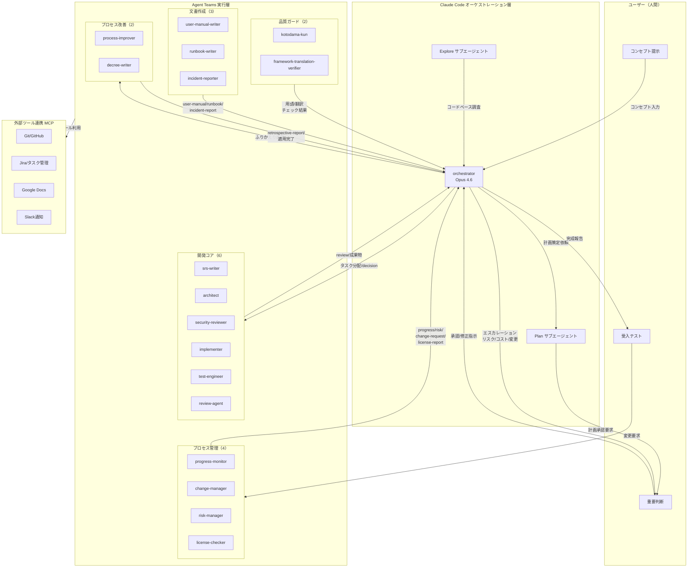

この図は全自動開発の全体構成と情報の流れをグループレベルで示す。ユーザーはコンセプト提示・重要判断・受入テストの3点でプロジェクトに関与する。orchestrator が全フェーズを制御し、5つのエージェントグループ（開発コア・プロセス管理・品質ガード・文書作成・プロセス改善、全ロールは agent-list §1 を参照）にタスクを分配する。エスカレーション経路（リスクスコア≧6、コスト予算80%到達、impact_level=high の変更要求）では orchestrator がユーザーに判断を仰ぐ。個別エージェント間の file_type データフローは agent-list §3 を参照。

### 1.3 前提となるClaude Codeの主要機能

| 機能                         | 説明                                                 | 利用場面                      |
| ---------------------------- | ---------------------------------------------------- | ----------------------------- |
| サブエージェント             | 独立コンテキストで専門タスクを実行する子エージェント | 個別の開発タスク実行          |
| Agent Teams（実験的）        | 複数エージェントが相互通信しながら並列作業           | 大規模並列開発                |
| Plan サブエージェント        | 計画立案に特化した組み込みエージェント               | WBS作成、開発計画             |
| Explore サブエージェント     | コードベース調査に特化した組み込みエージェント       | 既存コード理解                |
| ヘッドレスモード (`-p`)      | 対話なしでバッチ実行                                 | CI/CD連携、自動化パイプライン |
| CLAUDE.md                    | プロジェクトルートの設定ファイル                     | プロジェクト固有ルール定義    |
| MCP (Model Context Protocol) | 外部ツール/サービス連携                              | Git、Jira、Slack等との統合    |
| チェックポイント             | コード状態の自動保存と巻き戻し                       | 安全な試行錯誤                |
| Git Worktree (`--worktree`)  | 独立ブランチでの並列作業                             | 機能別並列開発                |
| スキル (`.claude/skills/`)   | 再利用可能なドメイン知識パッケージ                   | チーム間ノウハウ共有          |

> **注意:** Agent Teams は実験的機能であり、環境変数 `CLAUDE_CODE_EXPERIMENTAL_AGENT_TEAMS=1` の設定が必要である。安定性や仕様は将来変更される可能性がある。

---

## 第2章 開発フェーズの全体像

### 2.1 フェーズ名定義

**フェーズ名定義:**

| フェーズ名 | 番号 | 意味 | 文書管理規則での参照名 |
|-----------|:---:|------|----------------------|
| setup | 0 | セットアップ・プロセス評価 | `phase-setup` |
| planning | 1 | 企画（インタビュー＆仕様） | `phase-planning` |
| dependency-selection | 2 | 外部依存の選定（条件付き） | `phase-dependency-selection` |
| design | 3 | 設計 | `phase-design` |
| implementation | 4 | 実装 | `phase-implementation` |
| testing | 5 | テスト | `phase-testing` |
| delivery | 6 | 納品 | `phase-delivery` |
| operation | 7 | 運用・保守（条件付き） | `phase-operation` |

番号は便宜上の順序であり、文書管理規則の `commissioned_by` フィールドではフェーズ名（`phase-{name}`）で参照する。

**条件付きフェーズの有効化条件:**

| フェーズ | 有効化条件 | スキップ条件 | 詳細 |
|---------|-----------|-------------|------|
| dependency-selection | HW連携・AI/LLM連携・フレームワーク要求定義のいずれかが有効 | 条件付きプロセスに外部依存が該当しない場合 | §3.4 参照 |
| operation | 本番環境でサービスを運用する、またはリリース後の保守が必要 | 納品完了型プロジェクト（成果物を渡して終了） | §3.4 参照 |

仕様形式（ANMS/ANPS/ANGS）の選定もsetupフェーズで実施する（§4.1参照）。

### 2.2 開発フェーズフロー

**開発フェーズフロー:**

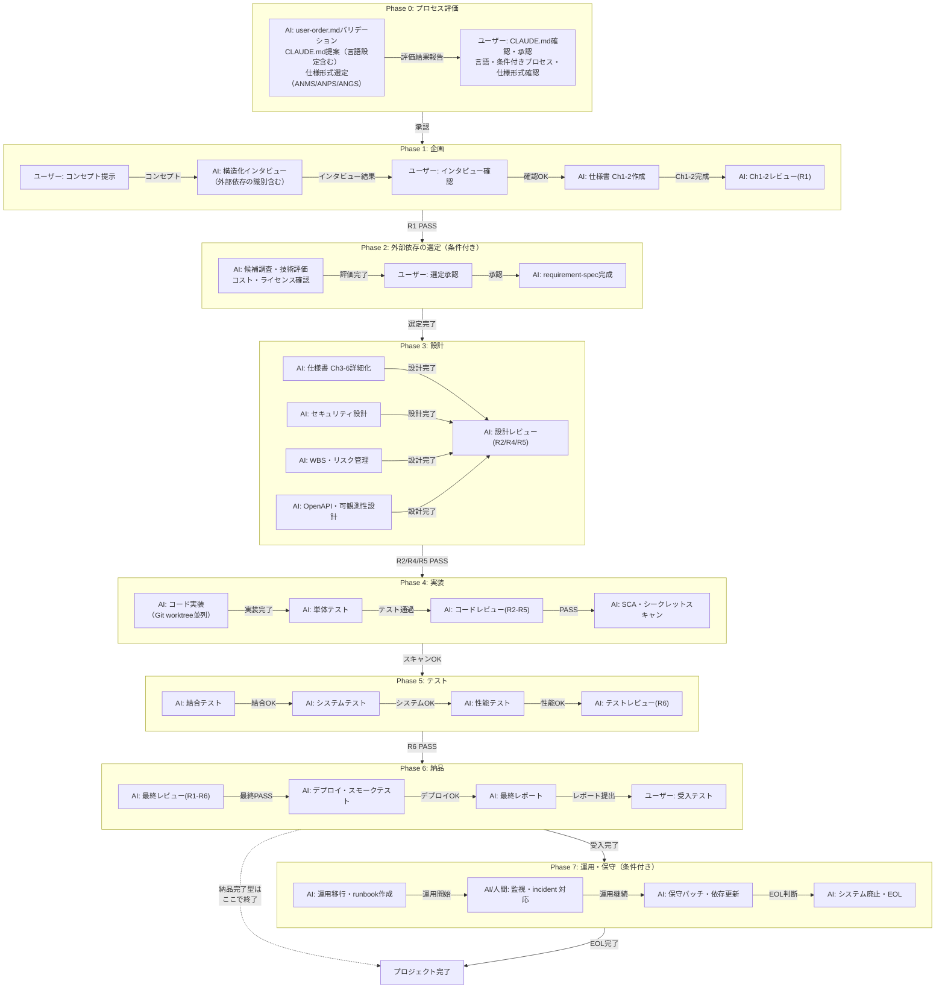

---

## 第3章 プロセス管理フレームワーク

本章ではISO/IEC 12207、CMMI、PMBOKを参照し、プロジェクトの性質に応じて適用すべきプロセスを整理する。**プロジェクト開始前（setup フェーズ）に本章を参照し、適用するプロセスを決定すること。**

### 3.1 プロセス区分の概要

| 区分         | 説明                                                                       |
| ------------ | -------------------------------------------------------------------------- |
| **必須**     | プロジェクト規模・種別を問わず、すべてのプロジェクトで実施する             |
| **推奨**     | 中規模以上（目安：開発期間1ヶ月超、または独立モジュール3つ以上）で実施する |
| **条件付き** | 3.4節に定める判断基準に該当する場合のみ実施する                            |

### 3.1.1 スケールダウン基準

プロジェクト規模が小さい場合、一部の必須・推奨プロセスを免除できる。orchestrator は setup フェーズで規模を評価し、免除対象を CLAUDE.md の「スケールダウン設定」セクションに記録する。

**規模区分:**

| 区分 | 基準 | 例 |
|------|------|-----|
| **Micro** | 単一セッション内で完了（1時間未満）。単一モジュール、外部依存なし | サイコロアプリ、電卓、簡易CLIツール |
| **Small** | 1日以内で完了。少数モジュール、外部依存は最小限 | シンプルなWebアプリ、ユーティリティライブラリ |
| **Standard** | 1日超。複数モジュールまたは外部依存あり | APIサービス、DB連携デスクトップアプリ |

**免除マトリクス:**

| プロセス / 成果物 | Micro | Small | Standard |
|-------------------|:-----:|:-----:|:--------:|
| WBS / ガントチャート | 免除 | 免除 | 必須 |
| 進捗レポート（progress/） | 免除 | 免除 | 必須 |
| コストログ（cost-log.json） | 免除 | 任意 | 必須 |
| pipeline-state.md | 免除 | 任意 | 必須 |
| executive-dashboard.md | 免除 | 任意 | 必須 |
| stakeholder-register.md | 免除 | 免除 | 必須（複数ステークホルダー時） |
| 性能テスト（k6等） | 免除（NFRなし時） | 任意 | 必須 |
| 可観測性設計 | 免除 | 任意 | 必須 |
| R3 コードレビュー（個別レポート） | 最終レビューに統合 | 必須 | 必須 |
| R6 テストレビュー（個別レポート） | 最終レビューに統合 | 必須 | 必須 |

**ルール:**
- 品質ゲート（R1、R2/R4/R5、最終 R1-R6）は規模にかかわらず**絶対に免除しない**。レビューは統合してよい（例: Micro では R1-R6 を網羅する単一の最終レビュー）が、スキップは禁止
- defect/CR 記録、リスク管理、トレーサビリティ、変更管理は全規模で必須 — ただし Micro 区分では記録形式を簡略化してよい（session-transcript 内にサマリーテーブルとしてインライン記録）
- 免除事項は setup フェーズで CLAUDE.md に必ず記録する。記録なき免除は規則違反とする

---

### 3.2 必須プロセス（全プロジェクト共通）

#### 3.2.1 変更管理（Change Management）

**参照標準:** CMMI-CM, PMBOK 統合管理, ISO/IEC 12207

仕様書承認後に発生するすべての要求・設計変更を制御するプロセス。

**変更管理フロー:**

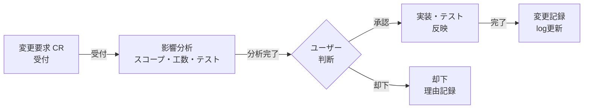

**担当エージェント:** change-manager（第7章7.3.1参照）

**出力:** `project-records/change-requests/change-request-{NNN}-{YYYYMMDD}-{HHMMSS}.md`（変更要求票）

**注意:** change-request はユーザー起点の変更のみを扱う。AI側の技術的変更（defect 修正、設計改善、依存変更）は defect または decision で管理する。

#### 3.2.2 リスク管理（Risk Management）

**参照標準:** CMMI-RSKM, PMBOK リスク管理

**リスク評価マトリクス:**

| 発生確率 / 影響度 | Low (1) | Medium (2) | High (3)   |
| ----------------- | ------- | ---------- | ---------- |
| **High (3)**      | 3 注視  | 6 対応必要 | 9 即対応   |
| **Medium (2)**    | 2 許容  | 4 注視     | 6 対応必要 |
| **Low (1)**       | 1 許容  | 2 許容     | 3 注視     |

スコア6以上はリードエージェントがユーザーに報告し、軽減策の承認を求める。

**リスク台帳:** `project-records/risks/risk-register.md`（Markdown シングルトン、Common Block + risk: Form Block付き）

リスク台帳はCommon Block管理対象のMarkdown形式で管理する。個別リスクエントリ（risk-{NNN}-*.md）の集約情報をDetail Blockにテーブルとして記載する。詳細はdocument-rules §7および§9.5を参照。

**担当エージェント:** risk-manager（第7章7.3.2参照）

#### 3.2.3 トレーサビリティ管理

**参照標準:** CMMI-RD/TS, ISO/IEC 12207, AUTOSAR

要求IDからテストケースIDまでの双方向トレーサビリティを維持する。srs-writerが要求IDを付与し、architectが仕様書 Ch4 の Gherkin シナリオに `(traces: FR-xxx)` を付記し、test-engineerがテスト実装時に更新する。

**トレーサビリティマトリクス:** `project-records/traceability/traceability-matrix.md`（Markdown シングルトン、Common Block + traceability: Form Block付き）

マトリクスはCommon Block管理対象のMarkdown形式で管理する。Detail Blockにトレーサビリティテーブル（要求ID / 要求 / 設計参照 / 実装 / テストID / ステータス）を記載する。詳細はdocument-rules §7および§9.9を参照。

#### 3.2.4 問題管理（Issue/Defect Management）

**参照標準:** ISO/IEC 12207 問題解決プロセス

**defect 票の状態遷移:**

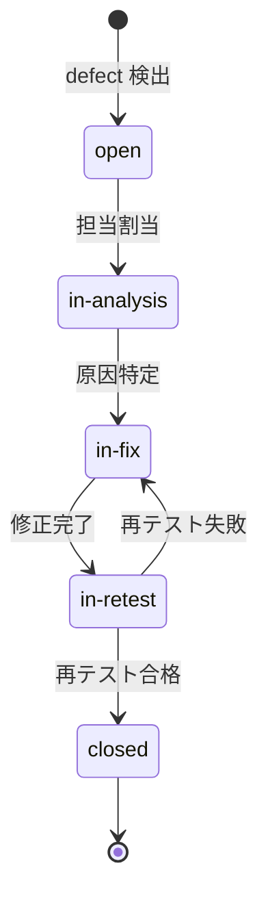

**出力:** `project-records/defects/defect-{NNN}-{YYYYMMDD}-{HHMMSS}.md`（defect 票、Common Block + defect: Form Block付き）：再現手順・深刻度・根本原因・再発防止策を含む。defect:id フィールドに DEF-NNN を記録する。

**即時起票ルール:** いずれのフェーズにおいても、defect や問題が発見された場合、担当エージェントは修正を開始する**前に**チケットを作成しなければならない。ワークフローは：発見→チケット作成（status: open）→分析→修正→再テスト→クローズ。「先に修正してから記録する」は禁止。これにより、全ての問題を発見時点から追跡し、コンテキストの消失を防ぎ、正確な defect メトリクスを確保する。

**実装フェーズにおける仕様乖離:** 実装中に、承認済み仕様からの設計変更が発生した場合（例：アルゴリズムの差し替え、APIコントラクトの変更、状態管理方式の変更）、implementer は以下を実行しなければならない:
1. 乖離を defect（仕様の fault に起因する場合）または CR（実装中に発見された新たな要求・制約に起因する場合）として記録する
2. 修正の適用と再テスト後、仕様書を実際の実装に合わせて更新する
3. 乖離が Ch1-2（要求）に影響する場合は、change-manager を経由して影響分析を行う

#### 3.2.5 ライセンス管理

使用するOSSライブラリのライセンスを追跡し、互換性を確認する。

| ライセンス種別         | 商用利用             | 帰属表示 | ソース公開義務               |
| ---------------------- | -------------------- | -------- | ---------------------------- |
| MIT / BSD / Apache 2.0 | 可                   | 必要     | なし                         |
| LGPL                   | 可（動的リンクのみ） | 必要     | 部分的                       |
| GPL v2/v3              | 要確認               | 必要     | あり                         |
| AGPL                   | 要確認               | 必要     | あり（ネットワーク経由含む） |

**担当エージェント:** license-checker（第7章7.3.3参照）、**出力:** `project-records/licenses/license-report.md`

#### 3.2.6 監査記録管理（Audit Log Management）

**参照標準:** ISO 27001, ISO/IEC 12207 監査プロセス

**記録対象:** Gitコミット履歴（ファイル操作の記録）、重要判断のユーザー承認記録（`project-records/decisions/`）、セキュリティスキャン・ライセンス確認の実行記録

**意思決定記録フォーマット (project-records/decisions/DEC-{番号}.md):**

- 決定番号・日付・決定内容と背景
- 検討した代替案と選択理由
- ユーザー承認の記録

#### 3.2.7 コスト管理（Token Cost Management）

progress-monitorエージェントがAPIトークン消費を追跡し、予算の80%到達時にユーザーに通知する。

**コスト追跡フォーマット (project-management/progress/cost-log.json):**

```json
{
  "cost_log": [
    {
      "date": "2026-03-01",
      "phase": "design",
      "model": "claude-opus-4-6",
      "input_tokens": 125000,
      "output_tokens": 8500,
      "estimated_cost_usd": 2.34
    }
  ],
  "budget_usd": 100.0,
  "spent_usd": 2.34
}
```

#### 3.2.8 SAST/SCA セキュリティスキャン

**参照標準:** OWASP SAMM, NIST SP 800-218 (SSDF)

静的解析ツール（SAST）と依存関係脆弱性スキャン（SCA）をCI/CDパイプラインに組み込み、人手によるセキュリティレビューを補完する。

**ツール選定ガイド:**

| カテゴリ             | ツール例                                     | 実行タイミング                  |
| -------------------- | -------------------------------------------- | ------------------------------- |
| SAST                 | CodeQL（GitHub Actions組み込み）, SonarQube  | PRマージ時・implementation フェーズ完了時       |
| SCA                  | npm audit, pip-audit, OWASP Dependency-Check | 依存追加時・implementation フェーズ完了時       |
| シークレットスキャン | truffleHog, git-secrets                      | コミット前フック・implementation フェーズ完了時 |
| コンテナスキャン     | Trivy, Grype                                 | コンテナビルド時・delivery フェーズ       |

**GitHub ActionsへのCodeQL統合例:**

```yaml
- name: Initialize CodeQL
  uses: github/codeql-action/init@v3
  with:
    languages: javascript, typescript

- name: Run CodeQL Analysis
  uses: github/codeql-action/analyze@v3
```

**担当:** security-reviewerエージェントが手動レビューと合わせて結果を統合し `project-records/security/security-scan-report-{NNN}-{YYYYMMDD}-{HHMMSS}.md` に記録する（Common Block + security-scan-report: Form Block付き、scan_type で sast/sca/dast/manual を区別）。

---

### 3.3 推奨プロセス（中規模以上のプロジェクト）

中規模以上の目安: 開発期間1ヶ月超、または独立したモジュールが3つ以上。

#### 3.3.1 リリース管理

**参照標準:** ITIL, PMBOK

**リリース判定チェックリスト (project-management/release-checklist.md):**

```markdown
- [ ] すべての機能要求が実装済み（仕様書 Ch2 との対比完了）
- [ ] 全品質メトリクスが CLAUDE.md 品質目標の閾値を満たすこと
- [ ] セキュリティスキャン Critical/High ゼロ件（SAST/SCA含む）
- [ ] レビューレポート Critical/High ゼロ件
- [ ] ライセンスレポート確認済み
- [ ] APIドキュメント（openapi.yaml）最新化済み
- [ ] コンテナイメージビルド・スモークテスト完了
- [ ] 可観測性（ログ・メトリクス・アラート）設定確認済み
- [ ] ロールバック手順確認済み
- [ ] リリースノート作成済み
```

#### 3.3.2 コミュニケーション管理

**参照標準:** PMBOK コミュニケーション管理

**CLAUDE.mdへの追記テンプレート:**

```markdown
## コミュニケーション計画

- 日次: progress-monitorが project-management/progress/daily-report.md を更新する
- フェーズ完了時: リードエージェントがユーザーに概要報告する
- 異常発生時（リスクスコア6以上・コスト80%到達）: 即座にユーザーに通知する
```

#### 3.3.3 プロセス改善・再発防止（CAR / OPF）

**参照標準:** CMMI-CAR, CMMI-OPF

process-improver エージェントがふりかえりと根本原因分析を担当し、decree-writer エージェントが承認済み改善策を安全に適用する。

**起動トリガー:**

| トリガー | 条件 | 起動元 |
|---------|------|--------|
| フェーズ完了 | 各フェーズの品質ゲート PASS 後 | orchestrator |
| defect 多発 | defect 発見率が前日比 200% 超 | progress-monitor → orchestrator |
| レビュー差戻し | 同一観点の指摘が 3 回以上連続 | review-agent → orchestrator |
| ユーザー要求 | ユーザーが明示的にふりかえりを要求 | orchestrator |

**改善サイクル:**

1. process-improver が defect 票・レビュー指摘・進捗データを分析する
2. 根本原因分析（CMMI CAR: Why-Why 分析）を実施する
3. 改善策を retrospective-report として orchestrator に提出する
4. orchestrator が改善策の承認ルーティングを行う（CLAUDE.md / process-rules はユーザー承認、エージェント定義は orchestrator 承認）
5. decree-writer が安全チェック（SR1-SR6）後、承認済み改善策をガバナンスファイルに適用する
6. decree-writer が before/after diff を project-records/improvement/ に記録する

実行方法は第8章8.3のretrospectiveコマンドも参照。

#### 3.3.4 ドキュメント版管理

**参照標準:** ISO/IEC 12207 ドキュメントプロセス

- 命名規則: `{文書名}-v{メジャー}.{マイナー}.md`（例: `taskapp-spec-v1.2.md`）
- 仕様書承認時・重大な仕様変更時: メジャーバージョンをインクリメント
- 軽微な記述修正・追記: マイナーバージョンをインクリメント
- 廃止文書は同ディレクトリの `old/` に移動し、廃止日と後継文書を記録する（document-rules §3.10 old/ ディレクトリルール参照）

#### 3.3.5 ユーザードキュメント・マニュアル作成

**参照標準:** ISO/IEC 26514 User Documentation

エンドユーザーが存在するシステムでは、以下のドキュメントを delivery フェーズで作成する:

- ユーザーマニュアル（`docs/user-manual.md`）: 操作手順、FAQ、トラブルシューティング
- APIリファレンス（既存の `docs/api/openapi.yaml` を活用）
- 管理者ガイド（管理者向け設定・運用手順）

#### 3.3.6 トレーニング・知識移転

エンドユーザーや運用チームへのトレーニングが必要な場合、delivery フェーズでトレーニング計画を策定し、教育資料を作成する。

#### 3.3.7 ステークホルダー管理

**参照標準:** PMBOK ステークホルダー管理

大規模プロジェクト（複数の人間ステークホルダーが関与する場合）では、setup フェーズでステークホルダー登録簿を作成し、各ステークホルダーの影響度・関心度・コミュニケーション方針を定義する。

#### 3.3.8 APIバージョニング・後方互換性

外部にAPIを公開するシステムでは、以下を design フェーズで定義する:
- バージョニング戦略（URLパス vs ヘッダー）
- 破壊的変更時の非推奨（deprecation）通知ポリシーと移行期間
- 後方互換性の保証範囲

---

### 3.4 条件付きプロセスの判断基準と判断時期

**判断タイミング:** setup フェーズ（user-order.md読み込み直後）にリードエージェントが評価し、該当するプロセスをCLAUDE.mdに追記して有効化する。

#### 3.4.1 判断基準一覧

| プロセス                         | 追加が必要な条件（1つでも該当すれば追加）                                                                                                                                                                    | 判断時期                                                                     |
| -------------------------------- | ------------------------------------------------------------------------------------------------------------------------------------------------------------------------------------------------------------ | ---------------------------------------------------------------------------- |
| **法規調査**                     | ・個人情報・個人データを扱う<br>・医療・ヘルスケア分野<br>・金融・決済処理を扱う<br>・通信サービスを提供する<br>・EU市場向けに提供する<br>・公共・行政向けシステム                                           | setup フェーズ 仕様書作成**前**<br>（最優先で判断）                                    |
| **特許調査**                     | ・新規アルゴリズム・手法を独自実装する<br>・AIモデルを組み込む<br>・金融・ECの新規ビジネスロジックを実装する<br>・商用製品として第三者に販売・提供する                                                       | design フェーズ 設計開始**前**<br>（アルゴリズム選定時）                             |
| **技術動向調査**                 | ・開発期間が6ヶ月以上<br>・採用予定ライブラリの最終リリースが1年以上前<br>・AI/ML・クラウドネイティブ等の急変領域<br>・主要依存関係のEOLが開発期間内に到来                                                   | setup フェーズ 技術スタック選定時<br>（長期プロジェクトは各フェーズ開始時に再評価） |
| **機能安全（HARA/FMEA/FTA）**    | ・人命・身体への直接的影響がある（医療機器・車載・産業機器）<br>・IEC 61508 / ISO 26262 / IEC 62304 等への準拠が要求される<br>・社会インフラへの重大な影響がある<br>・金融基幹系で重大な資産損害リスクがある | setup フェーズ コンセプト提示時<br>（**最優先で判断**、安全要求は仕様書作成前に確定）      |
| **アクセシビリティ（WCAG 2.1）** | ・Webアプリケーションを提供する<br>・EU市場向け（EAA指令 2025年6月完全施行）<br>・公共・行政向けシステム<br>・多様なユーザー層を対象とする                                                                   | setup フェーズ 仕様書作成**前**<br>（NFRとして仕様書 Ch2に含める）                            |
| **HW連携**                       | ・組込み/IoTシステムである<br>・物理デバイスの制御がある<br>・専用ハードウェア上で動作する<br>・HWプロトタイプ/開発ボードを使用する<br>・センサー/アクチュエータとの通信がある                               | setup フェーズ 仕様書作成**前**<br>（HW要求はNFRに含める。HW可用性がスケジュールを左右する） |
| **AI/LLM連携**                   | ・AI/LLMをアプリケーションの機能として組み込む<br>・プロンプトエンジニアリングが必要<br>・モデルの推論結果をビジネスロジックに使用する<br>・複数のAIプロバイダを比較・選定する必要がある                     | setup フェーズ 仕様書作成**前**<br>（コスト構造・モデル能力がアーキテクチャを左右する）       |
| **フレームワーク要求定義**        | ・非標準I/Fのフレームワークを使用する<br>・フレームワーク固有の制約がアーキテクチャに大きく影響する<br>・フレームワークの差し替えが将来想定される<br>・フレームワークのEOL/ライセンス変更リスクがある         | setup フェーズ 技術スタック選定時<br>（標準I/Fのフレームワークはdecision記録で十分）          |
| **HW生産工程管理** | ・HW連携かつ量産を行う<br>・サプライチェーン管理が必要<br>・受入検査・ロット管理が必要 | setup フェーズ<br>（HW連携が有効な場合に追加判断） |
| **製品i18n/l10n** | ・多言語対応が製品要求である<br>・RTL（右→左）言語をサポートする<br>・日時/通貨/数値フォーマットのローカライゼーションが必要 | setup フェーズ<br>（NFRとして仕様書 Ch2に含める） |
| **認証取得** | ・CE/FCC/医療機器認証等の公的認証が必要<br>・認証機関への提出文書作成が必要<br>・認証取得後の変更管理（再認証トリガー）が必要 | setup フェーズ<br>（法規調査と同時に判断） |
| **運用・保守** | ・本番環境でサービスを運用する<br>・リリース後のdefect 修正・パッチ適用が必要<br>・SLA（稼働率・応答時間）の保証が必要 | setup フェーズ<br>（operation フェーズの有効化判断） |
| **実機テスト** | ・HW連携プロジェクトで実機デバイスとの結合テストが必要<br>・ユーザー立会のもとで実機動作を確認する必要がある<br>・モックでは再現できない実機固有の動作検証が必要 | setup フェーズ<br>（HW連携が有効な場合に追加判断） |

#### 3.4.2 setup フェーズ 評価プロセス

full-auto-dev コマンドの setup フェーズで、リードエージェントが以下を自動評価する（第8章8.1参照）。

1. 機能安全 → 該当する場合は**即座にユーザーに確認**を求め、仕様書作成前に安全要求を確定する。`project-records/safety/` を作成し、design フェーズに HARA（必須）・FMEA（Ch3確定後）・FTA（高リスク hazard がある場合）を追加する。手法の詳細と採用基準は [defect-taxonomy.md §7](defect-taxonomy.md) を参照
2. 法規調査 → 該当する場合はCLAUDE.mdに追記し、仕様書 Ch2 の非機能要求セクションに規制要求を含める。`project-records/legal/` を作成する
3. 特許調査 → 該当する場合はWBSの design フェーズ開始前に特許調査タスクを追加する。`project-records/legal/patent-clearance.md` に記録する
4. 技術動向調査 → 該当する場合は各フェーズ開始時に技術動向確認ステップをWBSに追加する。`docs/tech-watch.md` を作成する
5. アクセシビリティ → 該当する場合は仕様書 Ch2 のNFRにWCAG 2.1 AA準拠要求を追加し、review-agentのR1チェック項目に含める
6. HW連携 → 該当する場合はCLAUDE.mdに追記し、planning フェーズのインタビューにHW要求を含める。dependency-selection フェーズで外部依存の評価・選定を実施し、design フェーズで `docs/hardware/hw-requirement-spec.md` のCh3-6を完成させ、SW Spec Ch3 にAdapter層設計を追加する。testing フェーズにHW-SW結合テストを追加する
7. AI/LLM連携 → 該当する場合はCLAUDE.mdに追記し、planning フェーズのインタビューにAI要求（能力・コスト・レイテンシ）を含める。dependency-selection フェーズで外部依存の評価・選定を実施し、design フェーズで `docs/ai/ai-requirement-spec.md` のCh3-6を完成させ、SW Spec Ch3 にAI Adapter層設計を追加する
8. フレームワーク要求定義 → 該当する場合はCLAUDE.mdに追記し、dependency-selection フェーズで外部依存の評価・選定を実施し、design フェーズで `docs/framework/framework-requirement-spec.md` のCh3-6を完成させる。標準I/Fのフレームワークは `project-records/decisions/` に選定理由を記録するのみで十分
9. HW生産工程管理 → HW連携が有効かつ量産を行う場合に追加。サプライチェーン管理・受入検査をWBSに含める
10. 製品i18n/l10n → 該当する場合は仕様書 Ch2 のNFRにi18n要求を追加し、design フェーズでメッセージカタログ設計を含める
11. 認証取得 → 法規調査に加え、認証取得に必要な提出文書作成・認証機関対応をWBSに追加する。`project-records/legal/certification/` を作成する
12. 運用・保守 → 本番運用する場合はoperation フェーズを有効化する。design フェーズでRPO/RTO・バックアップ戦略・監視体制を設計に含める
13. 実機テスト → HW連携が有効かつユーザー立会テストが必要な場合に追加。testing フェーズで field-test-engineer / feedback-classifier / field-issue-analyst をアクティベートする。フィードバック管理は [実機テスト フィードバック管理規則](field-issue-handling-rules.md) に従う

---

# 第2部: フェーズ詳細

## 第4章 開発ワークフロー

### 4.1 setup フェーズ: 条件付きプロセス評価（必須）

setup フェーズは全自動開発の**最初のステップ**であり、仕様書作成前に必ず実行する。

**user-order.mdバリデーション**として、以下の必須項目の記載を確認する:

- 何を作りたいか（What）、それはどうしてか（Why）

「その他の希望」は任意だが、記載があればバリデーション時に考慮する。不足項目があればユーザーに対話で補完してから先へ進む。

バリデーション通過後、user-order.md の内容を基に **CLAUDE.md を提案**する（技術スタック、コーディング規約、セキュリティ方針、ブランチ戦略、**言語設定**、**仕様形式**など）。

**仕様形式の選定:**

プロジェクト規模に応じて仕様書の形式を選定する:

| レベル | 略称 | 正式名称 | 判断基準 |
|:------:|------|----------|---------|
| 1 | ANMS | AI-Native Minimal Spec | プロジェクト全体が1コンテキストウィンドウに収まる |
| 2 | ANPS | AI-Native Plural Spec | 収まらないが、GraphDB不要 |
| 3 | ANGS | AI-Native Graph Spec | 大規模（GraphDB活用） |

選定結果は CLAUDE.md の「仕様形式の選択」セクションに記録する。

**言語設定:**

- **プロジェクト主言語**（ISO 639-1）: 全文書・エージェントプロンプトのデフォルト言語
- **翻訳言語**（任意）: 翻訳版を作成する言語のリスト（空 = 単一言語プロジェクト）

ユーザーの承認後、CLAUDE.md を配置し、第3章3.4の判断基準に基づいて条件付きプロセスの要否を評価する。

評価結果はユーザーに報告し、追加プロセスの有効化について確認を求める。確認後、CLAUDE.mdの条件付きプロセスセクションを更新してから planning フェーズに進む。

### 4.2 planning フェーズ: 企画 — インタビューから仕様書 Ch1-2 作成

#### 4.2.1 ユーザーのアクション: コンセプト提示

ユーザーは `user-order.md` に3つの問いに答える形でコンセプトを記述する。

**user-order.md の構成（3問形式）:**

- **何を作りたい？**（必須）— 作りたいもの・やりたいことを自由に記述
- **それはどうして？**（必須）— 背景・課題・動機
- **その他の希望**（任意）— 展開方法（Web/スマホ等）、連携先、利用範囲など

プロジェクト名・技術スタック・品質要求などの詳細は、setup フェーズで AI が CLAUDE.md として提案する。ユーザーは「作りたいもの」だけに集中すればよい。

#### 4.2.2 AI のアクション: 構造化インタビュー

user-order.md の3問回答だけでは仕様書を書くには情報が不足する。AIはユーザーに対して構造化インタビューを実施し、要求を深堀りする。

**インタビュー観点:**

| 観点 | AIが聞くこと | 目的 |
|------|-------------|------|
| ドメイン深堀 | 「〇〇という用語はどういう意味？」「ユーザーは誰？」 | 用語集（Glossary）・ペルソナの確立 |
| スコープ境界 | 「〇〇は含む？含まない？」 | Scope の In/Out 明確化 |
| エッジケース | 「〇〇の場合はどうなる？」 | 例外フローの発見 |
| 優先度 | 「MVPに含めるのは？後回しでよいのは？」 | 要求の優先順位付け |
| 制約 | 「予算/期間/技術の制約は？」 | Constraints の発掘 |
| 既知の妥協 | 「完璧でなくてもいい部分は？」 | Limitations の明示 |
| 非機能 | 「どのくらいの負荷？セキュリティレベルは？」 | NFR の具体化 |
| 外部依存の識別 | 「HW/AI/特殊なフレームワークを使う？自分たちで作る範囲はどこまで？」 | ドメイン（オリジナル）とフレームワーク層（外部依存）の境界を明確化。条件付きプロセス（HW連携・AI/LLM連携・フレームワーク要求定義）の要否判断の入力 |
| **ドメイン境界識別** | 「このプロジェクト固有のコアロジックは何か？」「この理論/アルゴリズムはあなたのドメインか、それとも既存ライブラリとして使うだけか？」「ビジネスルールと技術的関心事の境界はどこか？」 | **Clean Architecture のレイヤー仕訳の入力。** 同じ概念（例: ベクトル制御理論）がプロジェクトによってDomain層にもFramework層にもなりうる。ここを誤ると依存方向が逆転しアーキテクチャが崩壊する。入念なモデル化と精密な仕訳が必要 |

**インタビューのルール:**

- AIは一度に大量の質問をしない（1回の質問は3〜5個まで）
- ユーザーの回答を要約して確認を取りながら進める
- ユーザーが「もう十分」と判断したら終了する
- インタビュー結果は `project-management/interview-record.md` に構造化して記録する

#### 4.2.3 ユーザーのアクション: インタビュー記録の確認

AIが作成したインタビュー記録をユーザーに提示し、以下を確認する:

- 意図が正しく理解されているか
- 重要な観点の漏れがないか
- 優先順位が合っているか

確認後、必要に応じてモック/サンプル提示に進む。

#### 4.2.4 AI のアクション: モック/サンプル/PoC提示（推奨）

言葉だけではユーザーはイメージがわかない。特にUI系のプロジェクトでは、インタビュー結果を基にモック/サンプルを作成し、ユーザーにフィードバックを求めるイテレーションが不可欠。

**提示物の種類（プロジェクトに応じて選択）:**

| 種類 | 用途 | 例 |
|------|------|-----|
| UIモック/ワイヤーフレーム | 画面構成・操作フローの確認 | Mermaid図、HTMLモック、ASCII描画 |
| データモデルサンプル | エンティティ間関係の確認 | ER図、サンプルJSON |
| APIサンプル | I/Fの確認 | OpenAPIスニペット、cURLの例 |
| PoCコード | 技術的実現可能性の検証 | 核心部分のプロトタイプ実装 |
| ユーザーストーリーマップ | 機能の全体像と優先度の確認 | Mermaid図 |

**イテレーションルール:**

1. AIがインタビュー結果を基にモック/サンプルを作成する
2. ユーザーに提示し、フィードバックを求める（「これはイメージ通りか？」「違う部分はどこか？」）
3. フィードバックを反映して修正する
4. ユーザーが「イメージ通り」と判断したら仕様書作成に進む
5. モック/サンプルは interview-record.md に参考資料として記録する

**スキップ条件:** CLI ツール、バッチ処理、ライブラリ等、UIが存在しないプロジェクトではUIモックは不要。ただしAPIサンプルやデータモデルサンプルは有効。

#### 4.2.5 AI のアクション: 仕様書 Ch1-2 自動生成

インタビュー記録（interview-record.md）と user-order.md を入力として、仕様書 Ch1-2 を作成する。

```bash
claude "user-order.mdを読み込み、ほぼ全自動開発を開始してください。
まず構造化インタビューを実施してください。
インタビュー完了後、process-rules/spec-template.md を参照し、
仕様書（Ch1-2: Foundation・Requirements）を docs/spec/ に作成してください（形式はsetupフェーズで選定したANMS/ANPS/ANGSに従う）。
作成後、review-agentでR1観点のレビューを実施し、
PASSしたら仕様書の概要を報告し、重要な判断が必要な箇所があれば提示してください。"
```

#### 4.2.6 ユーザーの判断ポイント: 仕様書承認

- 機能要求が過不足ないか
- 非機能要求が適切か（性能・セキュリティ・アクセシビリティ含む）
- 優先順位が正しいか

### 4.3 dependency-selection フェーズ: 外部依存の選定 — 評価・選定・調達（条件付き）

HW連携・AI/LLM連携・フレームワーク要求定義のいずれかが有効な場合に実施する。すべて無効の場合はスキップして design フェーズ（設計）に進む。

planning フェーズのインタビューで識別された外部依存に対し、以下のステップを実施する。

#### 4.3.1 評価・選定プロセス

```bash
claude "インタビュー結果に基づき、外部依存の評価・選定を実施してください:
1. インタビュー記録から外部依存への要求を抽出し、requirement-specのドラフト（Ch1 目的、Ch2 要求）を作成する
2. 条件に合う製品/サービス/ライブラリの候補を調査し、候補一覧を作成する
3. 候補に対して技術評価を実施する（機能比較マトリクス、PoC/ベンチマーク結果）
4. コスト分析を行う（初期費用、ランニングコスト、TCO）
5. ライセンス互換性を確認する（license-checkerエージェントを使用）
6. 評価結果をユーザーに提示し、選定の承認を求める
7. 承認後、requirement-specのCh3-6（I/F定義、制約、差し替え戦略、その他）を完成させる
8. 調達が必要な場合は可用性タイムラインを確認し、WBSに反映する"
```

#### 4.3.2 成果物

| 成果物 | 説明 | 保存先 |
|--------|------|--------|
| requirement-spec（HW/AI/Framework） | external-dependency-specテンプレートに基づく要求仕様 | `docs/hardware/`, `docs/ai/`, `docs/framework/` |
| 選定decision記録 | 候補比較・評価マトリクス・選定理由 | `project-records/decisions/` |
| ライセンスレビュー | 依存ライブラリのライセンス互換性確認 | `project-records/licenses/` |
| 可用性タイムライン | 調達リードタイム・利用開始予定日 | WBSに反映 |

#### 4.3.3 ユーザーの判断ポイント: 選定承認

以下の情報をユーザーに提示し、選定の承認を得る:

- 候補一覧と評価マトリクス
- 推奨候補とその理由
- コスト比較（TCO）
- リスク（ベンダーロックイン、EOL、ライセンス変更）
- 差し替え可能性（DIPによる抽象化の程度）

**ユーザーの承認なしに外部依存の選定を確定してはならない。** コスト・ベンダーロックインに関わる判断はCLAUDE.mdの「重要判断の基準」に該当する。

#### 4.3.4 変更要求（CR）による再選定

仕様書承認後に外部依存の変更が必要になった場合（モデルの廃止、HWの製造中止、ライセンス変更等）、change-managerエージェント経由でCRを発行し、本フェーズに戻って再選定を実施する。impact_level=highとしてユーザー承認を必須とする。

### 4.4 design フェーズ: 設計 — 仕様書 Ch3-6 詳細化・セキュリティ・WBS

仕様書 Ch1-2 が承認されたら、設計フェーズを自動開始する。

**重要サブフェーズ: レイヤー仕訳（Ch3作成の前提作業）**

Ch3 Architecture を詳細化する前に、planning フェーズのインタビュー結果（特に「ドメイン境界識別」）を入力として、プロジェクトの全コンポーネントを Clean Architecture の4層（Entity / Use Case / Adapter / Framework）に明示的に分類する。この仕訳結果が Ch3 のコンポーネント図・依存関係図の基礎となる。

仕訳の判断基準:
- **Entity（ドメイン）**: このプロジェクト固有のコアロジック・ビジネスルール。外部に依存しない
- **Use Case**: ビジネスロジックの調整。Entityを操作するアプリケーション固有のルール
- **Adapter**: 外部との接合面。ドメインの言語と外部の言語を変換する層
- **Framework**: UI・DB・外部API・ライブラリ。差し替え可能であるべき

注意: 同じ概念（例: ベクトル制御理論）がプロジェクトによって Entity にも Framework にもなりうる。「このプロジェクトの目的にとって、この概念は本質か手段か？」を判断基準とする。

```bash
claude "仕様書 Ch1-2 が承認されました。以下を並列で実行してください:
1. docs/spec/ の仕様書 Ch3 (Architecture) を詳細化する（レイヤー仕訳を先行して実施し、コンポーネントの4層分類を Ch3 冒頭に明記すること）
2. docs/spec/ の仕様書 Ch4 (Specification) を Gherkin で詳細化する
3. docs/spec/ の仕様書 Ch5 (Test Strategy) を定義する
4. docs/spec/ の仕様書 Ch6 (Design Principles Compliance) を設定する
5. docs/api/openapi.yaml にOpenAPI 3.0仕様を生成する
6. docs/security/ にセキュリティ設計を作成する
7. docs/observability/observability-design.md に可観測性設計を作成する
8. project-management/progress/wbs.md にWBSとガントチャートを作成する
9. risk-managerでリスク台帳を作成する
10. [HW連携が有効な場合] docs/hardware/hw-requirement-spec.md を作成し、SW Spec Ch3 にHW Adapter層設計を含める
11. [AI/LLM連携が有効な場合] docs/ai/ai-requirement-spec.md を作成し、SW Spec Ch3 にAI Adapter層設計を含める。プロンプトテンプレート・入出力スキーマ・コスト制約を定義する
12. [フレームワーク要求定義が有効な場合] docs/framework/framework-requirement-spec.md を作成し、SW Spec Ch3 にAdapter層設計を含める
13. [機能安全が有効な場合] 以下を順次実施する（詳細は defect-taxonomy.md §7 参照）:
    a. HARA を実施し、hazard 一覧・safety goal・ASIL/SIL 割当を project-records/safety/hara-*.md に記録する（Ch3 詳細化の**前**に実施）
    b. safety requirement を spec-foundation Ch2 の NFR に追加する
    c. Ch3 確定後、FMEA を実施し project-records/safety/fmea-*.md に記録する
    d. ASIL C 以上（SIL 3 以上）の hazard がある場合、FTA を実施し project-records/safety/fta-*.md に記録する
14. review-agentでR2/R4/R5観点の設計レビューを実施し、PASSしたら次へ進む
完了後、設計の概要とWBSを報告してください。"
```

**WBSの出力例（Mermaid gantt）:**

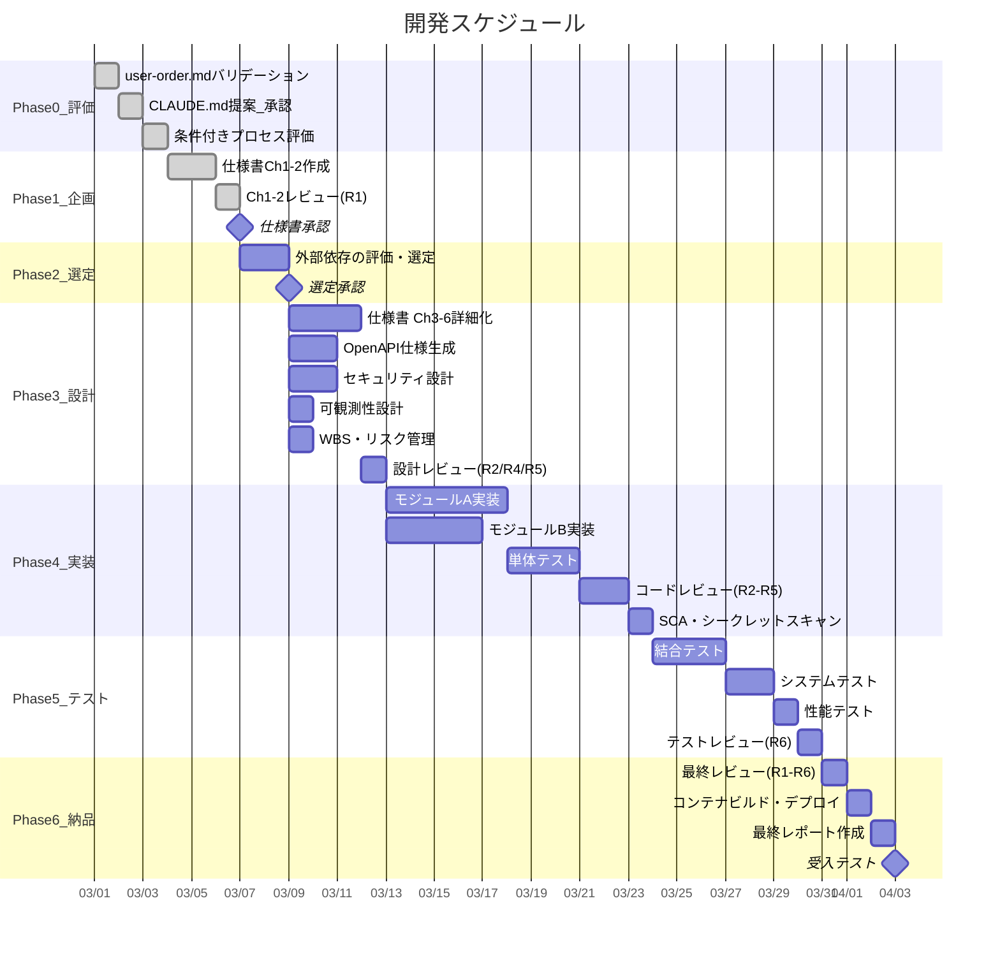

### 4.5 implementation フェーズ: 実装 — 並列開発とテスト

#### 4.5.1 Gitブランチ戦略

Agent Teamsによる並列実装では、ブランチの競合を防ぐために以下のブランチ戦略を厳守する。

**ブランチ戦略フロー:**

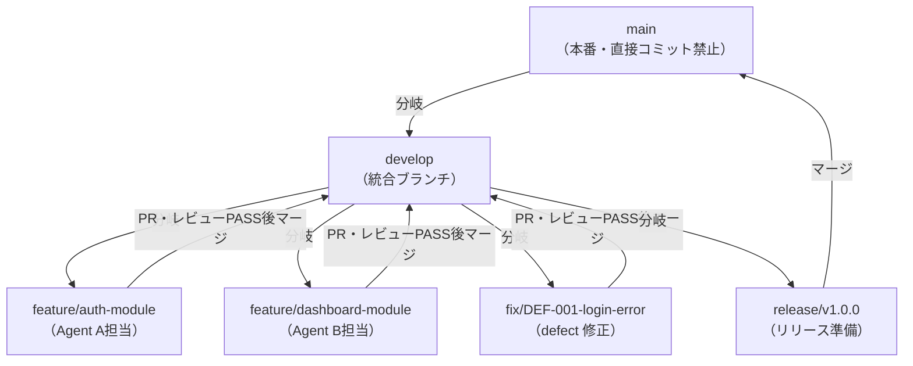

- 各 Implementation Agent は専用の `feature/` ブランチで作業する
- `develop` へのマージは review-agent の PASS 後のみ許可する
- `main` へのマージは release ブランチ経由とし、受入テスト完了後に実施する

#### 4.5.2 Agent Teams による並列実装

```bash
claude "仕様書に基づき、Agent Teamsで並列実装を開始してください。
Implementation Agentがsrc/配下にコードを実装し（各AgentはGit worktreeで専用ブランチを使用）、
Test Agentがtests/配下にテストを作成・実行し、
Review Agentがコードレビュー（R2/R3/R4/R5観点）を行い、
PM Agentが進捗を追跡してください。
各エージェントは仕様書の割り当てモジュールに専念し、
ファイル競合が起きないよう担当ディレクトリを分けてください。
[HW連携が有効な場合] hw-requirement-spec.md の Ch3 I/F定義に基づき、
src/adapters/hw/ にAdapter層を実装してください。HW未到着時はモック/シミュレータを使用してください。
[AI/LLM連携が有効な場合] ai-requirement-spec.md の Ch3 I/F定義に基づき、
src/adapters/ai/ にAI Adapter層を実装してください。プロンプトテンプレートはsrc/prompts/に配置してください。
[フレームワーク要求定義が有効な場合] framework-requirement-spec.md の Ch3 I/F定義に基づき、
該当するAdapter層を実装してください。"
```

#### 4.5.3 Git Worktree による並列開発

```bash
# ターミナル1: モジュールA（feature/auth-module ブランチ）
claude --worktree -p "仕様書に基づきモジュールA（認証モジュール）を実装してください。
feature/auth-module ブランチで作業し、完了後 develop へのPRを作成してください"

# ターミナル2: モジュールB（feature/dashboard-module ブランチ）
claude --worktree -p "仕様書に基づきモジュールB（ダッシュボード）を実装してください。
feature/dashboard-module ブランチで作業し、完了後 develop へのPRを作成してください"
```

### 4.6 testing フェーズ: テスト — 統合テスト・性能テスト・品質監視

#### 4.6.1 テスト自動実行

```bash
claude "すべてのモジュール実装が完了しました。以下を実行してください:
1. 結合テストを作成・実行する
2. システムテスト（APIレベル、E2Eレベル）を可能な範囲で作成・実行する
3. 性能テスト: 仕様書 Ch2 のNFR数値目標（レスポンスタイム・同時接続数等）に基づきk6シナリオを実行する
3a. [HW連携が有効な場合] HW-SW結合テスト: hw-requirement-spec.md の Ch3 I/F定義に基づき実機テストを実施する。テストツールの設定・調達状況を確認する
3b. [AI/LLM連携が有効な場合] AI結合テスト: ai-requirement-spec.md の Ch3 I/F定義に基づきAdapter層の結合テストを実施する。モデルの応答精度・レイテンシ・コストが要求を満たすか検証する
3c. [フレームワーク要求定義が有効な場合] フレームワーク結合テスト: framework-requirement-spec.md の Ch3 I/F定義に基づきAdapter層の結合テストを実施する
4. テスト消化曲線とdefect curveを更新する
5. review-agentでテストコードのレビュー（R6観点）を実施する
6. カバレッジレポートを生成する
7. 品質基準を満たしているか評価する
8. 問題があれば自動修正を試み、重大な問題はユーザーに報告する"
```

#### 4.6.2 性能テストの実施

非機能要求（NFR）で定義した数値目標を実際の負荷テストで検証する。

**k6 性能テストシナリオ例 (tests/performance/load-test.js):**

```javascript
import http from "k6/http";
import { check, sleep } from "k6";

export const options = {
  // 仕様書 Ch2 NFR-002: 同時接続100ユーザーでレスポンス200ms以内
  stages: [
    { duration: "30s", target: 50 },
    { duration: "1m", target: 100 },
    { duration: "30s", target: 0 },
  ],
  thresholds: {
    http_req_duration: ["p(95)<200"], // NFR-002: P95 200ms以内
    http_req_failed: ["rate<0.01"], // エラーレート1%未満
  },
};

export default function () {
  const res = http.get("http://localhost:3000/api/tasks");
  check(res, { "status was 200": (r) => r.status === 200 });
  sleep(1);
}
```

**性能テスト結果の記録 (project-records/performance/performance-report-{日付}.md):**

- NFR IDと対応する目標値・実測値の比較表
- PASS/FAILの判定
- ボトルネック箇所の特定（FAIL時）

#### 4.6.3 テスト消化曲線の自動監視

**テスト消化データ形式 (test-progress.json):**

```json
{
  "test_progress": [
    {
      "date": "2026-03-05",
      "planned": 50,
      "executed": 12,
      "passed": 10,
      "failed": 2
    },
    {
      "date": "2026-03-06",
      "planned": 50,
      "executed": 28,
      "passed": 25,
      "failed": 3
    },
    {
      "date": "2026-03-07",
      "planned": 50,
      "executed": 45,
      "passed": 42,
      "failed": 3
    },
    {
      "date": "2026-03-08",
      "planned": 50,
      "executed": 50,
      "passed": 48,
      "failed": 2
    }
  ]
}
```

**テスト消化曲線の可視化（Mermaid）:**

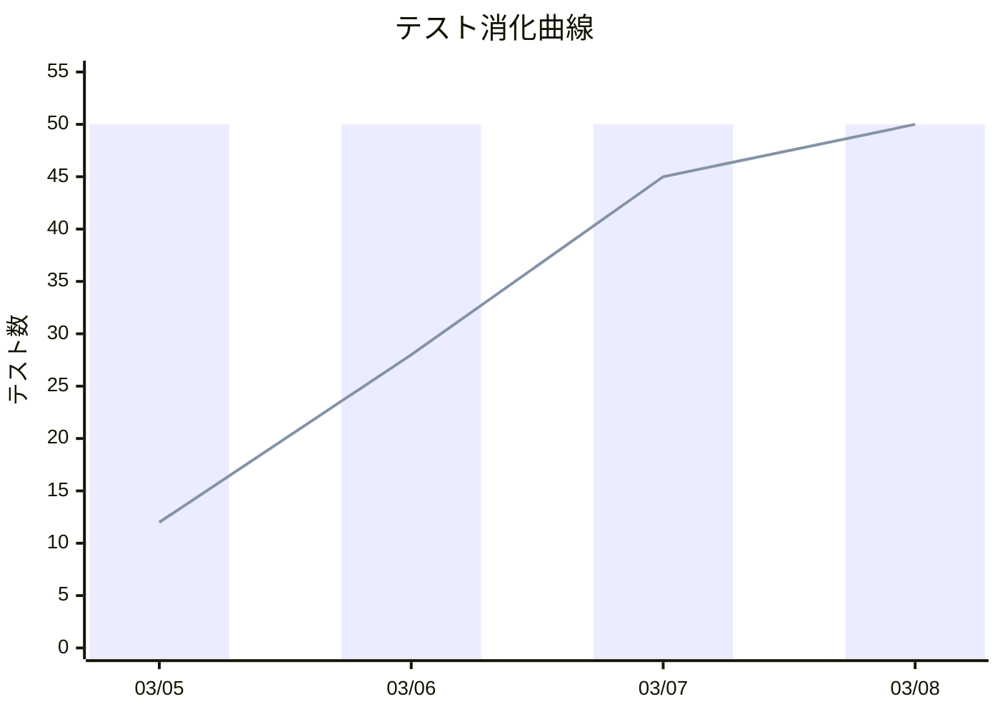

#### 4.6.4 defect curveの自動監視

**defect curveデータ形式 (defect-curve.json):**

```json
{
  "defect_curve": [
    { "date": "2026-03-05", "found_cumulative": 5, "fixed_cumulative": 2 },
    { "date": "2026-03-06", "found_cumulative": 12, "fixed_cumulative": 8 },
    { "date": "2026-03-07", "found_cumulative": 15, "fixed_cumulative": 13 },
    { "date": "2026-03-08", "found_cumulative": 16, "fixed_cumulative": 16 }
  ]
}
```

**defect curveの可視化（Mermaid）:**

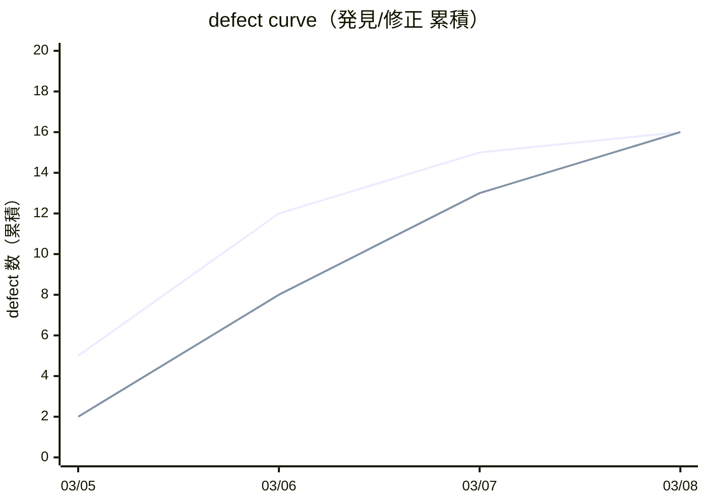

#### 4.6.5 実機テスト（条件付き: 実機テスト有効時）

条件付きプロセス「実機テスト」が有効な場合、自動テスト完了後にユーザー立会の実機テストを実施する。

**オーナー:** field-test-engineer

**プロセス概要:**

1. field-test-engineer が最新 SW でユーザーとテストし、フィードバックを記録する
2. feedback-classifier がフィードバックを仕様書と照合し、defect / CR / 質問に分類する
3. field-issue-analyst が原因分析（defect）・対策立案（defect / CR）を行う
4. 承認後、既存エージェント群（srs-writer / architect → review-agent → implementer → review-agent → test-engineer）が修正を実施する
5. field-test-engineer が実機で修正を検証する

**管理規則:** フィードバックの詳細なステータス遷移（13 ステータス・12 ゲート・5 禁止事項）は [実機テスト フィードバック管理規則](field-issue-handling-rules.md) を参照。

**メトリクス統合:** field-issue（type: defect）は defect curve の found_cumulative にカウントし、field-issue（type: cr）は CR 集計にカウントする。詳細は [実機テスト フィードバック管理規則](field-issue-handling-rules.md) §9 を参照。

#### 4.6.6 ボトルネックへの自動リソース追加

PM Agentが異常を検知した場合、リードエージェントは自動的に以下の対応を行う:

1. 問題領域を特定（どのモジュール/機能に defect が集中しているか）
2. 追加のサブエージェントを起動して問題領域に集中投入
3. 必要に応じてモデルをアップグレード（sonnet → opus）
4. 修正後に再テストを実行

### 4.7 delivery フェーズ: 納品 — デプロイメント・最終レポート・受入テスト

#### 4.7.1 最終レビューとFAIL時のルーティング

```bash
claude "テストが完了しました。review-agentで全成果物の最終レビュー（R1〜R6全観点）を実施してください。
FAILした場合は、指摘の観点に応じて該当フェーズへ戻り修正してください:
- R1指摘 → 仕様書 Ch1-2 修正（planning フェーズ相当）
- R2/R4/R5設計指摘 → 仕様書 Ch3-4 修正（design フェーズ相当）
- R3/R5実装指摘 → コード修正（implementation フェーズ相当）
- R6テスト指摘 → テスト修正（testing フェーズ相当）
すべてPASSしたらデプロイメントを開始してください。"
```

#### 4.7.2 コンテナビルドとデプロイメント

```bash
claude "最終レビューがPASSしました。以下のデプロイメント手順を実行してください:
1. Dockerfileを確認・ビルドし、コンテナイメージの健全性を確認する
2. infra/ のIaC構成（Terraform等）を確認し、差分を表示する（apply前にユーザーに確認）
3. デプロイメントを実行する（Blue/Greenデプロイまたはカナリアリリース）
4. スモークテスト: 主要エンドポイントへの疎通確認を自動実行する
5. ロールバック手順を確認し、project-records/release/rollback-procedure.md に記録する
6. [HW連携が有効な場合] HWへのデプロイ方法（flash/JTAG/OTA等）を実行し、実機動作を確認する
7. [AI/LLM連携が有効な場合] AIサービスの本番接続（APIキー・エンドポイント設定）を確認し、推論精度の本番環境テストを実施する"
```

> **重要:** IaC の apply（インフラ変更の適用）はユーザーへの確認を必ず求めること。意図しないインフラ変更を防ぐための安全措置である。

#### 4.7.3 可観測性の確認

```bash
claude "デプロイ後の可観測性を確認してください:
1. docs/observability/observability-design.md の設計と実際の設定を照合する
2. 構造化ログが正しいJSON形式で出力されているか確認する
3. メトリクス（Rate/Error/Duration）が計装されているか確認する
4. アラートルール（エラーレート1%超・SLAレイテンシ超過）が設定されているか確認する
5. 差異があれば修正し、docs/observability/ を更新する"
```

#### 4.7.4 最終レポートの自動生成

```bash
claude "以下の最終工程を実行してください:
1. license-checkerで最終ライセンス確認を実施する
2. project-management/progress/final-report.md に以下を含む最終報告書を作成する:
   - プロジェクト概要・実装した機能一覧
   - テスト結果サマリー（カバレッジ、合格率）
   - 性能テスト結果（NFR達成状況）
   - テスト消化曲線・defect curveの最終状態
   - レビュー結果サマリー（R1〜R6）
   - セキュリティ評価結果（SAST/SCA含む）
   - APIドキュメント（openapi.yaml）の最終版確認
   - 可観測性設定の確認結果
   - 既知の問題と制約事項
3. 受入テスト用の手順書を作成する"
```

#### 4.7.5 ユーザーのアクション: 受入テスト

- 要求したすべての機能が実装されているか
- 動作が期待通りか
- パフォーマンスは許容範囲か（性能テスト結果の確認）
- セキュリティ上の懸念はないか
- APIドキュメントが最新か

### 4.8 operation フェーズ: 運用・保守 — incident management・パッチ管理・監視運用（条件付き）

delivery フェーズ完了後、本番運用を行うプロジェクトで有効化する。納品完了型プロジェクト（ユーザーに成果物を渡して終了）ではスキップする。

#### 4.8.1 運用移行（Transition to Operations）

delivery フェーズの受入テスト完了後、以下の引き渡し作業を実施する:

- **運用手順書（runbook）の作成**: 日常運用手順、定期メンテナンス手順、incident 時の対応手順を `docs/operations/runbook.md` に記録する
- **監視・アラート運用計画**: design フェーズで設計した可観測性設計（observability-design.md）に基づき、具体的な監視体制・オンコール体制・アラート対応SLAを定義する
- **引き渡し判定**: 運用チームが運用手順書を理解し、初期運用に必要な知識を持っていることを確認する

#### 4.8.2 incident management（Incident Management）

**参照標準:** ITIL Incident Management, SRE practices

本番運用中に発生するincident（サービス停止、性能劣化、セキュリティ侵害、データ不整合等）の対応プロセス:

1. **検知**: 監視アラート or ユーザー報告でincident を認識する
2. **トリアージ**: 重大度を判定する（P1: サービス停止、P2: partial failure、P3: 性能劣化、P4: 軽微な問題）
3. **対応**: 即時対応（ワークアラウンド適用、ロールバック等）を実施する
4. **復旧**: 根本原因を特定し、恒久対策を実装する
5. **事後分析（Post-mortem）**: incident の経緯・根本原因・再発防止策を `project-records/incidents/incident-{NNN}-{YYYYMMDD}-{HHMMSS}.md` に記録する

**エスカレーション基準:**
- P1/P2: 即座にユーザー（サービスオーナー）に通知
- P3: 次の定期報告で通知
- P4: 記録のみ

#### 4.8.3 保守・パッチ管理（Maintenance & Patch Management）

**参照標準:** ISO/IEC 14764 Software Maintenance

- **セキュリティパッチ**: 依存ライブラリの脆弱性が発見された場合、security-scan-report を作成し、パッチ適用の優先度を判定する（Critical/High: 48時間以内、Medium: 1週間以内、Low: 次回定期更新）
- **defect 修正**: 本番で発見された failure は defect として記録し、修正→テスト→リリースのサイクルを回す
- **依存関係の定期更新**: Renovate/Dependabot等の自動更新ツールを活用し、依存関係を最新に保つ。破壊的変更はchange-requestとして管理する
- **定期メンテナンス**: データベースのバキューム、ログローテーション、証明書更新等の定期作業を runbook に記載し実施する

#### 4.8.4 災害復旧・事業継続（DR/BCP）

**参照標準:** ISO 22301 Business Continuity, AWS Well-Architected Framework

design フェーズで定義したRPO（Recovery Point Objective）/ RTO（Recovery Time Objective）に基づき、以下を管理する:

- **バックアップ戦略**: RPOを満たすバックアップ間隔とリテンションポリシーを定義・実施する
- **復旧手順**: RTOを満たす復旧手順を `docs/operations/disaster-recovery-plan.md` に文書化し、定期的に訓練する
- **事業継続計画**: 主要クラウドリージョンの failure、主要ベンダーのサービス停止等のシナリオに対する継続計画を策定する

#### 4.8.5 システム廃止・移行（EOL）

システムのライフサイクル終了時に実施する:

- **廃止計画**: 廃止日、データ移行先、ユーザーへの通知スケジュールを定義する
- **データ移行**: 後継システムへのデータ移行を計画・実行・検証する
- **サービス停止**: 段階的にサービスを縮退し、最終的に停止する
- **アーカイブ**: ソースコード・設計文書・運用記録を `project-records/snapshots/` にアーカイブする

---

# 第3部: 設定と準備

## 第5章 環境構築

### 5.1 Claude Code のインストール

Claude Codeはターミナルで動作するエージェント型コーディングツールである。以下のいずれかの方法でインストールする。

**macOS (Homebrew):**

```bash
brew install claude-code
```

**Windows (WinGet):**

```bash
winget install Anthropic.ClaudeCode
```

**ネイティブインストール（macOS/Linux/Windows）:**

公式ドキュメント (https://code.claude.com/docs/en/overview) に記載のネイティブインストーラを使用する。ネイティブインストールはバックグラウンドで自動更新される。

> **注意:** npmによるインストール (`npm install -g @anthropic-ai/claude-code`) は非推奨となっている。上記のいずれかの方法を使用すること。

**インストール後の初回起動:**

```bash
cd /path/to/your/project
claude
```

初回起動時にログインを求められる。Claude Pro/Team/Enterpriseのアカウント、またはAnthropic ConsoleのAPIキーで認証する。

### 5.2 VS Code 拡張機能（推奨）

VS Code拡張機能を使用すると、インラインdiff表示、計画レビュー、会話履歴がIDE内で利用可能になる。

1. VS Code の拡張機能マーケットプレイスで「Claude Code」を検索しインストール
2. コマンドパレット (Cmd+Shift+P / Ctrl+Shift+P) で「Claude Code: Open in New Tab」を選択

### 5.3 Agent Teams の有効化

Agent Teamsは実験的機能であるため、明示的に有効化する必要がある。

```bash
export CLAUDE_CODE_EXPERIMENTAL_AGENT_TEAMS=1
```

永続化する場合はシェルの設定ファイル（`.bashrc`, `.zshrc` 等）に追記する。

### 5.4 MCP サーバーの設定

プロジェクトルートに `.mcp.json` を作成し、外部ツール連携を定義する。

**MCP設定ファイル (.mcp.json):**

```json
{
  "mcpServers": {
    "github": {
      "type": "url",
      "url": "https://mcp.github.com/sse"
    },
    "slack": {
      "type": "url",
      "url": "https://mcp.slack.com/sse"
    }
  }
}
```

利用するMCPサーバーはプロジェクトの技術スタックに応じて選定する。MCPエコシステムには1,000以上のコミュニティサーバーが存在し、Jira、Google Drive、Sentry、Puppeteer（ビジュアルテスト）等との連携が可能である。設定可能なサーバーの一覧は https://github.com/modelcontextprotocol/servers を参照のこと。

### 5.5 推奨プロジェクト構造（完全版）

**プロジェクトディレクトリ構成:**

```text
project_root/
  CLAUDE.md                       ... プロジェクト設定（最重要）
  .mcp.json                       ... MCP サーバー設定
  user-order.md                    ... 作りたいもの（ユーザーが3問に回答）
  process-rules/
    spec-template-ja.md           ... 仕様書テンプレート（JA）
    spec-template-en.md           ... 仕様書テンプレート（EN）
  essays/                         ... 論文・リサーチ（日英）
    anms-essay-ja.md              ... 論文正本（JA）
    anms-essay-en.md              ... 論文 EN
    research/                     ... 調査レポート
  .claude/
    agents/                       ... カスタムエージェント定義
      orchestrator.md             ... オーケストレーター（フェーズ遷移・意思決定）
      srs-writer.md               ... 仕様書作成（Ch1-2）エージェント
      architect.md                ... 仕様書詳細化（Ch3-6）エージェント
      security-reviewer.md        ... セキュリティ設計エージェント
      implementer.md              ... 実装エージェント（src/ + 単体テスト）
      test-engineer.md            ... テストエンジニアエージェント
      review-agent.md             ... レビューエージェント（SW工学原則・並行性・性能）
      progress-monitor.md         ... 進捗管理エージェント
      change-manager.md           ... 変更管理エージェント
      risk-manager.md             ... リスク管理エージェント
      license-checker.md          ... ライセンス確認エージェント
      kotodama-kun.md             ... 用語・命名チェッカー
      framework-translation-verifier.md ... 翻訳一致性検証エージェント
      user-manual-writer.md       ... ユーザーマニュアル作成エージェント
      runbook-writer.md           ... 運用手順書作成エージェント
      incident-reporter.md        ... インシデント報告エージェント
      process-improver.md         ... プロセス改善エージェント
      decree-writer.md            ... ガバナンスファイル改定エージェント
      field-test-engineer.md      ... フィールドテストエージェント（条件付き）
      feedback-classifier.md      ... フィードバック分類エージェント（条件付き）
      field-issue-analyst.md      ... 現地課題分析エージェント（条件付き）
    commands/                     ... カスタムスラッシュコマンド
      full-auto-dev.md            ... 全自動開発開始（setup〜delivery）
      check-progress.md           ... 進捗確認
      retrospective.md            ... ふりかえり・再発防止（推奨）
      council-review.md           ... 諮問団レビュー
      translate-framework.md      ... フレームワーク文書翻訳
    settings.json                 ... プロジェクト設定
  docs/
    api/                          ... APIドキュメント（OpenAPI仕様）
    security/                     ... セキュリティ設計書
    spec/                         ... AIが生成する正式仕様書（ANMS/ANPS/ANGS形式）
    observability/                ... 可観測性設計書
    operations/                   ... 運用手順書・災害復旧計画
  project-management/
    progress/                     ... 進捗レポート・WBS・コスト管理
    test-plan.md                  ... テスト計画書
  project-records/
    reviews/                      ... レビュー報告（review-agent出力）
    change-requests/              ... 変更要求・変更管理台帳（必須）
    risks/                        ... リスク台帳・リスクレポート（必須）
    decisions/                    ... 重要判断の意思決定記録（必須）
    defects/                      ... defect 票（必須）
    traceability/                 ... 要求↔設計↔テストのトレーサビリティ（必須）
    licenses/                     ... ライセンスレポート（必須）
    performance/                  ... 性能テスト結果
    security/                     ... セキュリティスキャン結果（SAST/SCA/DAST）
    release/                      ... リリース判定チェックリスト（推奨）
    improvement/                  ... ふりかえり・プロセス改善記録（推奨）
    old/                          ... 廃止文書（推奨）
    snapshots/                    ... プロジェクトスナップショット（推奨）
    field-issues/                 ... フィールドテストフィードバック（条件付き）
    incidents/                    ... incident 記録（条件付き）
    legal/                        ... 法規・特許調査記録（条件付き）
    safety/                       ... 機能安全分析文書（条件付き）
  src/                            ... ソースコード
  tests/                          ... テストコード
  infra/                          ... IaC（Terraform/Pulumi等）
  .github/
    workflows/                    ... GitHub Actions ワークフロー
```

この構成はClaude Codeが自動的に認識・活用する規約に基づいている。特に `CLAUDE.md` はセッション開始時に自動読み込みされるため、プロジェクトのルール定義において最重要のファイルである。

---

## 第6章 CLAUDE.md の設計（プロジェクトの頭脳）

`CLAUDE.md` はプロジェクトルートに配置するMarkdownファイルで、Claude Codeがセッション開始時に自動的に読み込む。ほぼ全自動開発においては、このファイルがプロジェクト全体の「頭脳」となる。

**重要:** CLAUDE.md はユーザーが手動で記入するのではなく、**setup フェーズで AI が user-order.md を基に提案**する。ユーザーは提案内容を確認・承認するだけでよい。以下のテンプレートは AI が提案を生成する際の雛形である。

### 6.1 CLAUDE.md テンプレート

**CLAUDE.md テンプレート:**

> **注意:** 以下はテンプレートの例示である。最新のテンプレートはリポジトリルートの `CLAUDE.md` を正本とすること。

```markdown
# プロジェクト: [プロジェクト名]

## プロジェクト概要

[ユーザーが提示するコンセプトをここに記載]

## 開発方針

- 本プロジェクトはほぼ全自動開発で進行する
- ユーザーへの確認は重要判断のみに限定する
- 軽微な技術的判断はClaude Codeが自律的に行う
- 仕様書はdocs/spec/配下に出力する（形式はプロジェクト規模に応じてANMS/ANPS/ANGSを選択）。その他の設計成果物はdocs/配下にMarkdownで出力する
- プロセス文書（パイプライン状態、引継ぎ、進捗）はproject-management/配下に出力する
- プロセス記録（レビュー、意思決定、リスク、defect、CR、トレーサビリティ）はproject-records/配下に出力する
- コードはsrc/配下、テストはtests/配下、IaC (Infrastructure as Code)はinfra/配下に配置する
- **製品のAI/LLMプロンプトはsrc/配下（コードと同等の管理対象）。** プロジェクトを回すプロンプトは.claude/配下（メタレイヤー）。混在させない
- 運用規則は以下を参照する:
  - process-rules/full-auto-dev-process-rules.md（プロセス規則）
  - process-rules/full-auto-dev-document-rules.md v0.0.0（文書管理規則）

## 言語設定

- プロジェクト主言語: [例: ja]
- 翻訳言語: [例: en（空欄 = 単一言語プロジェクト）]

## 技術スタック

- 言語: [例: TypeScript]
- フレームワーク: [例: Next.js 15]
- データベース: [例: PostgreSQL]
- テストフレームワーク: [例: Vitest]
- 性能テスト: [例: k6]
- コンテナ: [例: Docker / docker-compose]
- IaC: [例: Terraform]
- CI/CD: [例: GitHub Actions]
- 可観測性: [例: OpenTelemetry + Grafana]

## ブランチ戦略

- メインブランチ: main（直接コミット禁止）
- 開発ブランチ: develop（統合ブランチ）
- 機能ブランチ: feature/{issue番号}-{説明}（develop から分岐）
- defect 修正ブランチ: fix/{issue番号}-{説明}
- リリースブランチ: release/v{バージョン}（develop から分岐）
- PRマージ: develop → main は review-agent PASS 後にのみ許可
- Agent Teams の並列実装: git worktree を使用し、各エージェントは専用ブランチで作業

## コーディング規約

- [プロジェクト固有のルール]
- ESLint設定に従う
- すべての公開関数にJSDocコメントを付与する
- エラーハンドリングは明示的に行う
- 構造化ログ（JSON形式）を使用する（console.logは禁止）
- **AI/LLMプロンプト規約**（AI/LLM連携が有効な場合）:
  - 製品のプロンプトテンプレートは `src/prompts/` または `src/ai/prompts/` に配置する（プロジェクトの言語規約に従う）
  - 各プロンプトに入出力スキーマ（期待入力・期待出力の型定義）を明記する
  - プロンプトのテスト（入力→期待出力のペア）を tests/ に作成する
  - プロジェクトを回すプロンプト（.claude/agents/, .claude/commands/）と製品プロンプト（src/）を混在させない

## セキュリティ要求

- OWASP Top 10 への対策を必須とする
- 認証にはJWTを使用する
- 入力値は必ずバリデーションする
- SQLインジェクション対策としてパラメタライズドクエリを使用する
- SAST: CodeQL（GitHub Actions で自動実行）
- SCA: npm audit / Snyk（依存関係追加時に必ず実行）
- シークレットスキャン: git-secrets または truffleHog（コミット前フック）

## 品質目標（全品質ゲートの Single Source of Truth）

setup フェーズでユーザーと合意する。全エージェントおよび品質ゲートはこのセクションの閾値を参照する。

| 指標 | 目標値 | 備考 |
|------|--------|------|
| 単体テスト合格率 | [例: 95%] 以上 | 全ビジネスロジック |
| 結合テスト合格率 | [例: 100%] | APIエンドポイント |
| コードカバレッジ | [例: 80%] 以上 | カバレッジツール |
| E2Eテスト | 主要ユーザーフロー PASS | Ch4 Gherkin シナリオに対応 |
| 性能テスト | NFR数値目標をすべて達成 | [例: k6] |
| セキュリティ脆弱性 | Critical: 0, High: 0 | SAST/SCA スキャン結果 |
| レビュー指摘 | Critical: 0, High: 0 | review-agent の出力 |
| コーディング規約準拠 | 違反 0 件 | Linter 実行結果 |
| コスト予算アラート閾値 | 予算の [例: 80%] | ユーザー通知をトリガー |
| パッチ対応時間 | Critical: [例: 48h], High: [例: 1週間] | operation フェーズのみ |

## APIドキュメント

- OpenAPI 3.0形式で docs/api/ に出力する
- architect エージェントが仕様書 Ch3 詳細化と同時に生成する
- 実装完了後 test-engineer がエンドポイントとの整合性を検証する

## 可観測性要求

- ログ: 構造化JSON形式、DEBUG/INFO/WARN/ERROR の4レベル
- メトリクス: RED（Rate/Error/Duration）メトリクスを全APIに計装
- トレーシング: OpenTelemetryでリクエスト追跡
- アラート: エラーレート1%超、P99レイテンシがSLA超過でアラート

## Agent Teams 設定

Agent Teamsで作業する場合、以下のロール定義を使用する:

- **Orchestrator Agent（orchestrator）**: プロジェクト全体のオーケストレーション。pipeline-state.md / executive-dashboard.md / final-report.md / decision記録を管理する。フェーズ遷移と品質ゲートを制御する。`.claude/agents/orchestrator.md` で定義
- **SRS Agent（srs-writer）**: user-order.md（3問形式）+ process-rules/spec-template.md を基に、仕様書を docs/spec/ に作成（Ch1-2 Foundation・Requirements、形式はsetupフェーズで選定）。ユーザーコンセプトを構造化する
- **Architect Agent（architect）**: docs/spec/ の ANMS 仕様書 Ch3-6 を詳細化（Architecture・Specification・Test Strategy・Design Principles）。docs/api/ にOpenAPI仕様を生成する
- **Security Agent（security-reviewer）**: docs/security/ にセキュリティ設計を作成。実装コードの脆弱性レビューを行う。スキャン結果はproject-records/security/にsecurity-scan-reportとして記録する
- **Implementer Agent（implementer）**: src/ 配下にコードを実装する。設計文書に従い、Clean Architecture・DIPを遵守する。単体テストも作成する
- **Test Agent（test-engineer）**: tests/ 配下にテストを作成・実行する。カバレッジレポートを生成する
- **Review Agent（review-agent）**: project-records/reviews/ にレビュー報告を出力する。R1〜R6の観点（SW工学原則・並行性・パフォーマンス）でレビューし、Critical/High指摘がゼロになるまで次フェーズへの移行をブロックする
- **PM Agent（progress-monitor）**: project-management/progress/ に進捗レポートを出力する。WBS/defect curve/コストを管理する
- **Change Manager Agent（change-manager）**: 仕様書承認後のユーザー起点の変更要求をproject-records/change-requests/に記録し、影響分析を行う。impact_level=highはユーザー承認必須。AI側の技術的変更はdefect/decisionで管理する
- **Risk Manager Agent（risk-manager）**: project-records/risks/にリスクエントリを記録し、risk-register.mdを管理する。score≧6はユーザーに通知
- **License Checker Agent（license-checker）**: 依存ライブラリ追加時にライセンス互換性を確認し、帰属表示を管理する
- **Kotodama-kun Agent（kotodama-kun）**: 成果物の用語・命名がフレームワーク用語集およびプロジェクト用語集に準拠しているかチェックする
- **Framework Translation Verifier Agent（framework-translation-verifier）**: リリース前にフレームワーク文書の多言語間翻訳一致性を検証する
- **User Manual Writer Agent（user-manual-writer）**: delivery フェーズでユーザーマニュアルを docs/ に作成する
- **Runbook Writer Agent（runbook-writer）**: delivery フェーズで運用手順書を docs/operations/ に作成する
- **Incident Reporter Agent（incident-reporter）**: operation フェーズでインシデント報告書を project-records/incidents/ に作成する
- **Process Improver Agent（process-improver）**: 各フェーズ完了時にふりかえりを実施し、defect パターンの根本原因分析とプロセス改善策を提案する
- **Decree Writer Agent（decree-writer）**: 承認済みの改善策をガバナンスファイル（CLAUDE.md、エージェント定義、process-rules）に安全に適用する。自己変更禁止・品質ゲート保護等の安全チェックを経て変更を実行し、before/after diff を記録する
- **Field Test Engineer Agent（field-test-engineer）**（条件付き: 実機テスト有効時）: ユーザーとの実機テスト、フィードバック記録、修正後の実機検証を行う。field-issue チケットの owner
- **Feedback Classifier Agent（feedback-classifier）**（条件付き: 実機テスト有効時）: フィードバックを仕様書と照合し defect / CR / 質問に分類する
- **Field Issue Analyst Agent（field-issue-analyst）**（条件付き: 実機テスト有効時）: 原因分析（defect）、対策立案（defect / CR）、影響範囲・副作用・代替案比較を行う

## 重要判断の基準

以下の場合はユーザーに確認を求めること:

- アーキテクチャに関する根本的な選択
- 外部サービス/APIの選定
- セキュリティモデルの重大な変更
- 予算やスケジュールに影響する判断
- 要求の曖昧さにより複数の解釈が可能な場合
- リスクスコア6以上のリスクが発生した場合
- コスト予算が上記「品質目標」のアラート閾値に到達した場合
- 変更要求の影響度がHighの場合

以下の場合はClaude Codeが自律的に判断してよい:

- ライブラリの具体的なバージョン選定
- コードのリファクタリング方針
- テストケースの設計
- ドキュメントの構成
- defect 修正の方法

## 必須プロセス設定（第3章参照）

- 変更管理: 仕様書承認後の変更はchange-managerエージェント経由で処理する
- リスク管理: planning フェーズ完了時にリスク台帳を作成し、各フェーズ開始時に更新する
- トレーサビリティ: 要求ID→設計ID→テストIDの対応をproject-records/traceability/に記録する
- 問題管理: defect は project-records/defects/ に defect 票として記録し、根本原因分析を行う
- ライセンス管理: 依存ライブラリ追加時にlicense-checkerエージェントを実行する
- 監査記録: 重要判断はproject-records/decisions/に記録する
- コスト管理: APIトークン消費をproject-management/progress/cost-log.jsonに記録する

## 条件付きプロセス（setup フェーズで判断、第3章3.4参照）

# 以下は該当する条件が存在する場合のみ有効化する

# 法規調査: [有効/無効] - 理由: [記載]

# 特許調査: [有効/無効] - 理由: [記載]

# 技術動向調査: [有効/無効] - 理由: [記載]

# 機能安全(HARA/FMEA/FTA): [有効/無効] - 理由: [記載]

# アクセシビリティ(WCAG 2.1): [有効/無効] - 理由: [記載]

# HW連携: [有効/無効] - 理由: [記載]

# AI/LLM連携: [有効/無効] - 理由: [記載]

# フレームワーク要求定義: [有効/無効] - 理由: [記載]

# HW生産工程管理: [有効/無効] - 理由: [記載]

# 製品i18n/l10n: [有効/無効] - 理由: [記載]

# 認証取得: [有効/無効] - 理由: [記載]

# 運用・保守: [有効/無効] - 理由: [記載]

# フィールドテスト: [有効/無効] - 理由: [記述]
```

このテンプレートはバージョン管理にコミットし、チーム全員が共有する。

### 6.2 CLAUDE.md 設計のポイント

1. **具体性**: 曖昧な指示は避け、具体的なルールを記述する
2. **判断基準の明確化**: ユーザーに聞くべきケースとAIが判断してよいケースを明示する
3. **Agent Teams ロール定義**: 各エージェントの責任範囲とファイル境界を明確にする（ファイル競合を防止する）
4. **ブランチ戦略の明記**: 並列開発時のブランチ命名・マージルールを定義する
5. **バージョン管理**: CLAUDE.md自体をGitで管理し、プロジェクトの進行に応じて更新する
6. **ふりかえりによる継続改善**: retrospectiveコマンド実行後、発見した再発防止策を追記する

---

## 第7章 エージェント定義

エージェントの一覧・オーナーシップ・データフロー・フェーズ別アクティベーションは [エージェント一覧](agent-list.md) を参照。

プロンプトの構造規約（S0-S6: Identity / Activation / Ownership / Procedure / Rules / Exception）は [プロンプト構造規約](prompt-structure.md) を参照。

各エージェントのプロンプト定義は `.claude/agents/*.md` を参照。これが各エージェントの唯一の正（Single Source of Truth）である。

用語の定義・選定理由・略称の許可判定は [用語集](glossary.md) を参照。

---

## 第8章 カスタムコマンド定義

頻繁に使用するワークフローをスラッシュコマンドとして定義しておくと、ワンコマンドで複雑な処理を起動できる。

### 8.1 全自動開発開始コマンド

**.claude/commands/full-auto-dev.md:**

```markdown
user-order.mdを読み込み、ほぼ全自動ソフトウェア開発を開始してください。

以下のフェーズを順次実行します:

## Phase 0: 条件付きプロセスの評価（必須・仕様書作成前に実行）
0a. user-order.md を読み込む
0b. user-order.mdのバリデーション: 以下の必須項目が記載されているか確認する
    - 何を作りたいか（What）、それはどうしてか（Why）
    → 不足項目がある場合: ユーザーに対話で補完してから次へ進む
0b2. user-order.md の内容を基に CLAUDE.md を提案する（プロジェクト名、技術スタック、コーディング規約、セキュリティ方針、ブランチ戦略など）
    → ユーザーの承認後に CLAUDE.md を配置する
0c. 機能安全の要否を評価する（人命・インフラへの影響、安全規格準拠）
    → 該当する場合: 即座にユーザーに確認を求め、安全要求を確定してから次へ進む
0d. 法規調査の要否を評価する（個人情報・医療・金融・通信・EU市場・公共）
    → 該当する場合: CLAUDE.mdに追記し、仕様書の非機能要求に規制要求を含める
0e. 特許調査の要否を評価する（新規アルゴリズム・AIモデル・商用販売）
    → 該当する場合: WBSの design フェーズ開始前に特許調査タスクを追加する
0f. 技術動向調査の要否を評価する（6ヶ月超・急変技術領域・EOL近接）
    → 該当する場合: 各フェーズ開始時に技術動向確認ステップをWBSに追加する
0g. アクセシビリティ（WCAG 2.1）の要否を評価する（Webアプリ・EU市場向け等）
    → 該当する場合: CLAUDE.mdに追記し、仕様書のNFRにアクセシビリティ要求を含める
0h. 評価結果をユーザーに報告し、条件付きプロセスの追加について確認を求める

## Phase 1: 企画
1. user-order.md を解析する
2. process-rules/spec-template.md を参照し、仕様書を docs/spec/ に作成する（Ch1-2: Foundation・Requirements、形式はsetupフェーズで選定したANMS/ANPS/ANGSに従う）
3. Ch3-6 のスケルトン（見出しのみ）を同一ファイルに配置する
4. 仕様書の概要をユーザーに報告し承認を求める
5. review-agentで仕様書 Ch1-2 の品質レビュー（R1観点）を実施し、PASS後に次へ進む

## Phase 2: 外部依存の選定（条件付き — HW連携・AI/LLM連携・フレームワーク要求定義のいずれかが有効な場合）
6. インタビュー記録から外部依存への要求を抽出し、requirement-specのドラフト（Ch1-2）を作成する
7. 候補の調査・技術評価・コスト分析・ライセンス確認を実施する
8. 評価結果をユーザーに提示し、選定の承認を求める
9. 承認後、requirement-specのCh3-6を完成させる
10. 調達が必要な場合は可用性タイムラインを確認し、WBSに反映する
    → すべて無効の場合: スキップして design フェーズに進む

## Phase 3: 設計（仕様書 Ch1-2 承認後）
11. docs/spec/ の仕様書 Ch3 (Architecture) を詳細化する
12. docs/spec/ の仕様書 Ch4 (Specification) を Gherkin で詳細化する
13. docs/spec/ の仕様書 Ch5 (Test Strategy) を定義する
14. docs/spec/ の仕様書 Ch6 (Design Principles Compliance) を設定する
15. docs/api/openapi.yaml にOpenAPI 3.0仕様を生成する
16. docs/security/ にセキュリティ設計を作成する
17. docs/observability/observability-design.md に可観測性設計（ログ・メトリクス・トレーシング・アラート）を作成する
18. project-management/progress/wbs.md にWBSとガントチャートを作成する
19. risk-managerでリスク台帳を作成する
20. review-agentで仕様書 Ch3-4・設計の品質レビュー（R2/R4/R5観点）を実施し、PASS後に次へ進む

## Phase 4: 実装
21. 仕様書に基づきsrc/にコードを実装する（Git worktreeで並列実装）
22. 可観測性設計に基づき構造化ログ・メトリクス計装・トレーシングをコードに組み込む
23. tests/に単体テストを作成・実行する
24. review-agentで実装コードのレビュー（R2/R3/R4/R5観点）を実施し、PASS後に次へ進む
25. security-reviewerでSCAスキャン（npm audit等）を実行し、Critical/High脆弱性がゼロか確認する
26. license-checkerでライセンス確認を実施する

## Phase 5: テスト
27. 結合テストを作成・実行する
28. システムテストを可能な範囲で作成・実行する
29. 性能テストを仕様書 Ch2 のNFR数値目標に基づき実行し、結果をproject-records/performance/に記録する
30. テスト消化曲線とdefect curveを更新する
31. review-agentでテストコードのレビュー（R6観点）を実施する
32. 品質基準を評価する
32a. [実機テストが有効な場合] ユーザー立会の実機テストを実施する。フィードバック管理は field-issue-handling-rules.md に従う

## Phase 6: 納品
33. review-agentで全成果物の最終レビュー（R1〜R6全観点）を実施する
    → FAILした場合: 指摘の観点に応じた該当フェーズへ戻り修正する
34. コンテナイメージをビルドし、infra/のIaC構成を確認する
35. デプロイメントを実行し、スモークテストで基本動作を確認する
36. 監視・アラート設定が可観測性設計と一致しているか確認する
37. ロールバック手順を確認・文書化する
38. project-management/progress/final-report.md に最終レポートを作成する
39. 受入テスト手順書を作成する
40. ユーザーに完了報告する

各フェーズ完了時に進捗を報告してください。
重要な判断が必要な場合はユーザーに確認を求めてください。
軽微な技術的判断は自律的に行ってください。
```

使用方法:

```bash
claude
> /project:full-auto-dev
```

### 8.2 進捗確認コマンド

**.claude/commands/check-progress.md:**

```markdown
現在の開発進捗を確認し、以下を報告してください:

1. project-management/progress/ 配下の最新データを読み込む
2. WBSの進捗率を算出する
3. テスト消化曲線の現在値を報告する
4. defect curveの現在値を報告する
5. カバレッジの現在値を報告する
6. コスト消費の現在値を報告する
7. ボトルネックがあれば特定する
8. 次に実行すべきアクションを提案する
```

### 8.3 ふりかえりコマンド

**.claude/commands/retrospective.md:**

```markdown
以下のふりかえりを実施してください:

## Phase 1: 分析（process-improver）

1. project-records/defects/ のdefect 票をすべて読み込む
2. 繰り返し発生しているdefect パターンを特定する
3. 根本原因を分析する（CMMI CARプロセス）
4. 文書管理規則（process-rules/full-auto-dev-document-rules.md）の適合性を確認する
   - Common Block / Form Block の構造は実態に合っているか
   - 不足しているフィールドや不要なフィールドはないか
5. 改善策を retrospective-report として project-records/improvement/ に記録する
6. orchestrator に提出し、承認を求める

## Phase 2: 適用（decree-writer）

7. orchestrator が改善策を承認（decision 記録を作成）
8. decree-writer が承認済み改善策を受け取り、安全チェック（SR1-SR6）を実施する
9. 承認テーブルに基づき対象ファイルに適用する
   - CLAUDE.md / process-rules/ → ユーザー承認必須
   - .claude/agents/ → orchestrator 承認
10. before/after diff を project-records/improvement/ に記録する

## 再発防止策の記録形式

- defect パターン: [パターンの説明]
- 根本原因: [Why-Why分析の結果]
- 対策: [対象ファイルと変更内容]
- 承認区分: [ユーザー承認 / orchestrator 承認]
- 効果確認方法: [次フェーズでの確認方法]
```

### 8.4 フレームワーク翻訳コマンド

**.claude/commands/translate-framework.md:**

```markdown
gr-sw-maker フレームワーク文書を {対象言語} に翻訳する。

引数形式: `{元言語} {対象言語}`（例: `ja fr`, `en fr`）

1. 翻訳対象を収集する（process-rules, agents, commands, CLAUDE.md, user-order.md）
2. 英語固定要素は翻訳しない（YAMLキー、file_type名、フィールド名、ID、MermaidノードID）
3. 各ファイルを翻訳し、対象言語サフィックスを付けて出力する
4. 元ファイルと翻訳ファイルの構造一致性を検証する（見出し、テーブル、図、数値）
```

### 8.5 諮問団レビューコマンド

**.claude/commands/council-review.md:**

```markdown
gr-sw-maker フレームワークの品質を横断的にレビューする諮問団レビュー。

Phase 0: 翻訳一致性ゲート（JA/EN ペア検証）
Phase 1: サブエージェントによる機械チェック（プロンプト品質、用語スキャン）
Phase 2: 4名の専門家によるメインレビュー
  - Expert 1: プロセス工学（フェーズ遷移、品質ゲート、エスカレーション基準）
  - Expert 2: エージェントアーキテクチャ（所有権、データフロー、安全チェック）
  - Expert 3: 用語・文書構造（用語集、Form Block、多言語規則）
  - Expert 4: 図表クロスチェック（文書間整合性）
Phase 3: 結果を最終レポートに統合（project-records/reviews/）

判定: PASS (C=0, H=0) / CONDITIONAL PASS (C=0, H≤3) / FAIL (C≥1 or H≥4)
```

---

# 第4部: 品質・運用

## 第9章 品質管理フレームワーク

### 9.1 段階的レビューゲート

**レビューゲートフロー（FAIL時の戻り先を明示）:**

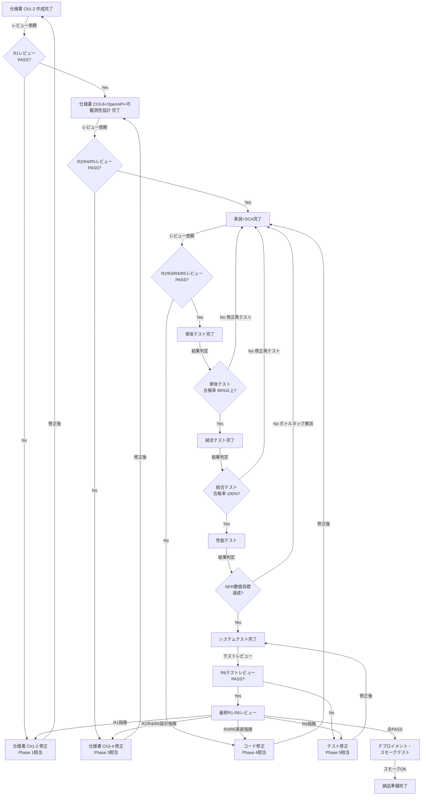

各レビューゲートはreview-agentが自動実行する。CLAUDE.md 品質目標で定義された品質閾値が満たされるまで次フェーズへの移行をブロックする。上図中の数値は説明用のデフォルト値であり、実際の閾値は常に CLAUDE.md から読み取る。

**ゲート強制チェックルール:** orchestrator はフェーズ遷移前に以下を検証しなければならない:
1. 当該ゲートに必要なレビューが `project-records/reviews/` に存在し、`review:result = pass` であること
2. 全レビュー指摘に対応記録があること（9.5節 レビュー指摘対応追跡 を参照）
3. WBS 免除でないプロジェクト（3.1.1節参照）の場合、当該フェーズの WBS タスクステータスが更新されていること

いずれかの条件が未充足の場合、orchestrator は次フェーズへ遷移してはならない。未実施のレビューは実行し、未記録の対応記録は記録すること。本ルールに例外はない。

### 9.2 レビュー観点（R1〜R6）

review-agentが適用する6つの観点。**詳細なチェックリストは `process-rules/review-standards.md`（レビュー観点規約書）を参照すること。** 以下は各観点の要約。

| 観点                     | 内容                                                                                                                                                            | 適用対象                  |
| ------------------------ | --------------------------------------------------------------------------------------------------------------------------------------------------------------- | ------------------------- |
| **R1: 要求品質**         | 完全性・テスト可能性・矛盾・曖昧表現・用語一貫性・アクセシビリティ(WCAG)                                                                                        | 仕様書 Ch1-2              |
| **R2: SW設計原則**       | SOLID (SRP/OCP/LSP/ISP/DIP)、DRY、KISS、YAGNI、SoC、SLAP、LOD、CQS、POLA、PIE、CA、Naming、Prompt Engineering（AI/LLM連携時） | 仕様書 Ch3-4・コード      |
| **R3: コーディング品質** | エラーハンドリング完全性・入力バリデーション・防御的プログラミング                                                                                              | コード                    |
| **R4: 並行性・状態遷移** | デッドロック（リソース取得順序・長時間ロック）、レースコンディション（Check-Then-Act・DB Read-Modify-Write・Promise競合）、グリッジ（非原子更新・中間状態露出） | 仕様書 Ch3-4・コード      |
| **R5: パフォーマンス**   | アルゴリズム計算量（O(n²)以上）、N+1クエリ、メモリリーク、不要な直列化、ネットワーク/フロントエンド最適化（overfetching・不要な再レンダリング） | 仕様書 Ch3-4・コード      |
| **R6: テスト品質**       | テスト独立性・境界値・異常系・フレーキーテスト・要求カバレッジ・性能テストのNFR網羅                                                                             | テストコード              |

### 9.3 品質メトリクス定義

各メトリクスの数値閾値はプロジェクトの **CLAUDE.md「品質目標」セクション** で定義する（setup フェーズでユーザーと合意）。本テーブルはメトリクス名と測定方法のみを定義する。全エージェントおよび品質ゲートは閾値を CLAUDE.md から参照しなければならない — 数値のハードコードは禁止。

| 指標 | 測定方法 |
| --- | --- |
| 単体テスト合格率 | テストフレームワークの実行結果 |
| 結合テスト合格率 | テストフレームワークの実行結果 |
| コードカバレッジ | カバレッジツール（例: c8, istanbul） |
| 性能テスト | k6等の性能テスト結果 |
| セキュリティ脆弱性（Critical/High） | Security Agent + SAST/SCAスキャン結果 |
| レビュー指摘（Critical/High） | review-agentの出力 |
| コーディング規約準拠 | Linter（ESLint等）の実行結果 |
| コスト予算消費率 | progress-monitor のコスト追跡 |

### 9.4 フェーズ別KPI（Key Performance Indicators）

各フェーズで押さえるべきKPIを定義する。progress-monitor は各フェーズ完了時にこれらのKPIを executive-dashboard に反映する。

| フェーズ | KPI | 目標/基準 | 測定方法 |
|---------|-----|----------|---------|
| setup | 条件付きプロセス評価完了率 | 全項目評価済み | CLAUDE.md の条件付きプロセスセクション |
| setup | CLAUDE.md 承認 | ユーザー承認済み | ユーザー確認記録 |
| planning | 要求ID付与率 | 100%（全FR/NFRにID付与） | 仕様書 Ch2 の要求一覧 |
| planning | R1 PASS率 | CLAUDE.md 品質目標に準拠 | review-agent レポート |
| planning | モック/サンプル フィードバック完了 | ユーザー「イメージ通り」判定 | interview-record |
| planning | 仕様書承認 | ユーザー承認済み | ユーザー確認記録 |
| dependency-selection | 候補評価完了率 | 全外部依存に対し候補一覧・評価完了 | requirement-spec |
| dependency-selection | 選定承認率 | ユーザー承認済み | decision 記録 |
| design | Ch3-6 完成率 | 4章すべて完成 | 仕様書 Ch3-6 |
| design | R2/R4/R5 PASS率 | CLAUDE.md 品質目標に準拠 | review-agent レポート |
| design | WBS 作成完了 | クリティカルパス特定済み | wbs.md |
| design | リスク台帳作成完了 | 全リスク評価済み | risk-register.md |
| implementation | コード実装進捗率 | WBSタスク完了/全体 | wbs.md |
| implementation | 単体テスト合格率 | CLAUDE.md 品質目標に準拠 | テストフレームワーク |
| implementation | コードカバレッジ | CLAUDE.md 品質目標に準拠 | カバレッジツール |
| implementation | SCA/SASTクリア率 | CLAUDE.md 品質目標に準拠 | security-scan-report |
| testing | 結合テスト合格率 | CLAUDE.md 品質目標に準拠 | テストフレームワーク |
| testing | 性能テスト NFR達成率 | CLAUDE.md 品質目標に準拠 | performance-report |
| testing | defect open 数（Critical/High） | CLAUDE.md 品質目標に準拠 | defect 集計 |
| testing | defect curve収束 | 新規検出が減少傾向 | defect-curve.json |
| delivery | 最終レビュー PASS | R1-R6 全PASS（CLAUDE.md 品質目標に準拠） | review-agent レポート |
| delivery | 受入テスト合格 | ユーザー承認 | final-report |
| delivery | デプロイ完了 | スモークテスト合格 | デプロイログ |
| operation | SLA達成率 | CLAUDE.md 品質目標に準拠 | 監視メトリクス |
| operation | incident 件数/MTTR | P1/P2: 減少傾向、MTTR: 短縮傾向 | incident-report 集計 |
| operation | パッチ適用率 | CLAUDE.md 品質目標に準拠 | security-scan-report |
| operation | 依存関係の鮮度 | 主要依存が最新マイナーバージョン以内 | SCA定期スキャン |

### 9.5 レビュー指摘対応追跡

全てのレビュー指摘（Critical、High、Medium、Low）は、関連する品質ゲートが充足と見なされる前に、対応記録を持たなければならない。

**指摘対応フロー:**

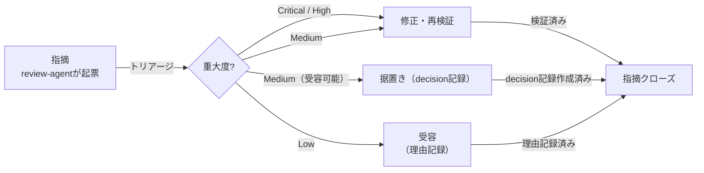

**対応規則:**

| 重大度 | 許容される対応 | ゲート要件 |
|--------|-------------|-----------|
| Critical | 修正済みのみ | フェーズ遷移にはゼロであること（CLAUDE.md 品質目標に準拠） |
| High | 修正済みのみ | フェーズ遷移にはゼロであること（CLAUDE.md 品質目標に準拠） |
| Medium | 修正済み / 据置き / 受容済み | 全件に対応記録があること |
| Low | 修正済み / 据置き / 受容済み | 全件に対応記録があること |

**記録要件:**
- **修正済み（fixed）**: 指摘を修正した。再レビュー報告で解消を確認
- **据置き（deferred）**: 指摘を認識するが据置く。`project-records/decisions/` に据置き理由・リスク評価・計画的解消時期を記載した decision 記録を**必ず**作成する
- **受容済み（accepted）**: 指摘を現状のまま受容する。理由をレビュー報告の指摘対応テーブルに記録する

**指摘対応テーブル（review Detail Block 内）:**

| # | 重大度 | 指摘概要 | 対応 | 参照 |
|:-:|:------:|---------|:----:|------|
| 1 | Medium | ... | 修正済み | rev 2 で修正 |
| 2 | Medium | ... | 据置き | DEC-003 |
| 3 | Low | ... | 受容済み | プロジェクト範囲において許容 |

review-agent がこのテーブルをレビュー報告の Detail Block に記録する。orchestrator はフェーズ遷移前に全指摘に対応記録があることを検証する。

---

## 第10章 ヘッドレスモードとCI/CD連携

### 10.1 ヘッドレスモードの基本

`-p` フラグを使用すると、対話なしでClaude Codeを実行できる。これにより、CI/CDパイプラインやスクリプトからの自動呼び出しが可能になる。

```bash
# 単発のヘッドレス実行
claude -p "src/配下のすべてのテストを実行し、結果をJSON形式で出力してください"

# 出力形式を指定
claude -p "テスト結果を報告してください" --output-format json
```

### 10.2 GitHub Actions との連携

CI/CDパイプラインにClaude Codeを統合する際は、以下のセキュリティ原則に従うこと。

**セキュリティ原則:**

- `curl | sh` によるスクリプト直接実行は禁止する（内容確認なしの実行リスク）
- 公式の GitHub Actions（`anthropics/claude-code-action`等）を使用する
- OIDC（OpenID Connect）認証でクレデンシャルを最小化する
- `permissions:` フィールドで最小権限を明示する
- シークレットは GitHub Secrets に格納し、定期的にローテーションする

**GitHub Actions ワークフロー例 (.github/workflows/claude-review.yml):**

```yaml
name: Claude Code Auto Review
on:
  pull_request:
    types: [opened, synchronize]

permissions:
  contents: read
  pull-requests: write

jobs:
  security-scan:
    runs-on: ubuntu-latest
    steps:
      - uses: actions/checkout@v4

      - name: Run CodeQL Analysis
        uses: github/codeql-action/init@v3
        with:
          languages: javascript, typescript

      - name: Autobuild
        uses: github/codeql-action/autobuild@v3

      - name: Perform CodeQL Analysis
        uses: github/codeql-action/analyze@v3

      - name: Run npm audit
        run: npm audit --audit-level=high

  claude-review:
    runs-on: ubuntu-latest
    needs: security-scan
    steps:
      - uses: actions/checkout@v4

      - name: Install Claude Code (公式インストール方法)
        run: |
          # 公式ドキュメント記載の方法を使用すること
          # https://code.claude.com/docs/en/overview
          npm install -g @anthropic-ai/claude-code

      - name: Run Claude Code Review
        env:
          ANTHROPIC_API_KEY: ${{ secrets.ANTHROPIC_API_KEY }}
        run: |
          claude -p "このPRの変更内容をレビューしてください。
          セキュリティ上の問題、パフォーマンスの懸念、コーディング規約違反を報告してください。" \
          --output-format json > review-result.json

      - name: Post Review Comment
        uses: actions/github-script@v7
        with:
          script: |
            const fs = require('fs');
            const result = JSON.parse(fs.readFileSync('review-result.json', 'utf8'));
            await github.rest.issues.createComment({
              issue_number: context.issue.number,
              owner: context.repo.owner,
              repo: context.repo.repo,
              body: result.result
            });
```

> **注意:** Claude Codeのインストール方法は公式ドキュメントの最新版を参照すること。npmインストールは一部の環境で非推奨となっている場合がある。

---

## 第11章 デプロイメントと可観測性

### 11.1 デプロイメントプロセス

本番へのリリースには、コンテナ化・IaC・段階的デプロイメントの3要素が必要である。

#### 11.1.1 コンテナ化

**Dockerfileのベストプラクティス例:**

```dockerfile
# マルチステージビルドでイメージを最小化
FROM node:20-alpine AS builder
WORKDIR /app
COPY package*.json ./
RUN npm ci --only=production
COPY . .
RUN npm run build

FROM node:20-alpine AS runner
WORKDIR /app
# 非rootユーザーで実行（セキュリティ要求）
RUN addgroup --system --gid 1001 nodejs
RUN adduser --system --uid 1001 nextjs
COPY --from=builder --chown=nextjs:nodejs /app/.next ./.next
COPY --from=builder /app/node_modules ./node_modules
USER nextjs
EXPOSE 3000
CMD ["node", "server.js"]
```

**コンテナセキュリティスキャン（Trivy）:**

```bash
# コンテナイメージの脆弱性スキャン
trivy image --severity HIGH,CRITICAL myapp:latest
```

#### 11.1.2 IaC（Infrastructure as Code）

IaCのapplyは**必ずユーザーへの確認を経てから実行する**。

```bash
# 差分確認（安全に実行可能）
terraform plan -out=tfplan

# ユーザー確認後にapply
terraform apply tfplan
```

**IaCファイルの配置:**

```text
infra/
  main.tf                  ... メインリソース定義
  variables.tf             ... 変数定義
  outputs.tf               ... 出力定義
  migrations/              ... DBマイグレーションファイル
    V001__initial_schema.sql
    V002__add_users_table.sql
```

#### 11.1.3 段階的デプロイメント

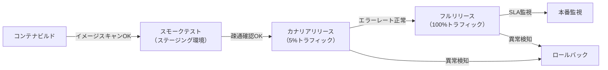

**スモークテスト（最小確認項目）:**

```bash
# 主要エンドポイントへの疎通確認
curl -f http://localhost:3000/health || exit 1
curl -f http://localhost:3000/api/status || exit 1
echo "Smoke tests passed"
```

#### 11.1.4 ロールバック手順

デプロイメント失敗時のロールバック手順を事前に定義し、`project-records/release/rollback-procedure.md` に記録する。

**ロールバック手順書テンプレート:**

```markdown
# ロールバック手順書

## トリガー条件

- スモークテスト失敗
- エラーレートが1%超かつ5分以上継続
- P99レイテンシがSLA（例: 500ms）を超過かつ5分以上継続

## 手順

1. 即時判断（5分以内）: ロールバックするかユーザー（運用責任者）に確認
2. カナリア停止: トラフィックを旧バージョンに戻す
3. 状態確認: エラーレートとレイテンシが正常値に戻ったことを確認
4. 原因調査: ログ・トレースを確認し根本原因を特定
5. project-records/defects/ にdefect 票を起票する

## ロールバックコマンド

[IaC/デプロイツールに応じて記載]
```

### 11.2 可観測性（Observability）設計

可観測性の3本柱（ログ・メトリクス・トレーシング）を design フェーズの設計段階で定義し、implementation フェーズの実装で組み込む。

#### 11.2.1 構造化ログ

**ログ設計原則:**

- 形式: JSON構造化ログ（`console.log` は禁止）
- レベル: DEBUG / INFO / WARN / ERROR の4段階
- 必須フィールド: `timestamp`, `level`, `service`, `traceId`, `message`

**構造化ログ例:**

```json
{
  "timestamp": "2026-03-01T12:00:00.000Z",
  "level": "ERROR",
  "service": "auth-service",
  "traceId": "abc123def456",
  "userId": "usr_001",
  "message": "Login failed: invalid credentials",
  "error": {
    "code": "AUTH_INVALID_CREDENTIALS",
    "stack": "..."
  }
}
```

**機密情報のログ出力禁止:**

- パスワード・トークン・クレデンシャルは絶対にログに含めない
- 個人情報（メールアドレス等）はマスク処理を適用する

#### 11.2.2 メトリクス（RED指標）

すべてのAPIエンドポイントに以下のREDメトリクスを計装する。

| メトリクス             | 説明                         | 例                              |
| ---------------------- | ---------------------------- | ------------------------------- |
| Rate（リクエスト率）   | 単位時間あたりのリクエスト数 | `http_requests_total`           |
| Errors（エラー率）     | エラーレスポンスの割合       | `http_errors_total`             |
| Duration（レイテンシ） | リクエスト処理時間の分布     | `http_request_duration_seconds` |

**OpenTelemetry 計装例（Node.js）:**

```javascript
import { metrics } from "@opentelemetry/api";

const meter = metrics.getMeter("api-service");
const requestCounter = meter.createCounter("http_requests_total");
const requestDuration = meter.createHistogram("http_request_duration_seconds");

// ミドルウェアで計装
app.use((req, res, next) => {
  const start = Date.now();
  res.on("finish", () => {
    requestCounter.add(1, { method: req.method, status: res.statusCode });
    requestDuration.record((Date.now() - start) / 1000, { method: req.method });
  });
  next();
});
```

#### 11.2.3 分散トレーシング

```javascript
import { trace } from "@opentelemetry/api";

const tracer = trace.getTracer("auth-service");

async function login(email, password) {
  return tracer.startActiveSpan("auth.login", async (span) => {
    try {
      span.setAttribute("user.email_hash", hashEmail(email));
      const result = await authenticate(email, password);
      span.setStatus({ code: SpanStatusCode.OK });
      return result;
    } catch (error) {
      span.recordException(error);
      span.setStatus({ code: SpanStatusCode.ERROR });
      throw error;
    } finally {
      span.end();
    }
  });
}
```

#### 11.2.4 アラート設計

アラートルールを design フェーズで設計し、`docs/observability/observability-design.md` に定義する。

**アラートルール例:**

| アラート名    | 条件                           | 優先度   | 対応                                       |
| ------------- | ------------------------------ | -------- | ------------------------------------------ |
| HighErrorRate | エラーレート > 1%（5分継続）   | Critical | 即時調査・ロールバック検討                 |
| HighLatency   | P99 > SLAレイテンシ（5分継続） | High     | ボトルネック調査                           |
| LowDiskSpace  | ディスク使用率 > 85%           | Medium   | ログローテーション確認                     |
| AgentTimeout  | エージェント無応答30分超       | High     | progress-monitorがリードエージェントに報告 |

### 11.3 本番リリースチェックリスト

delivery フェーズのデプロイメント前に以下の全項目を確認する。

```markdown
# 本番リリースチェックリスト

## 品質ゲート

- [ ] 最終レビュー（R1〜R6）: Critical/High ゼロ件
- [ ] 全品質メトリクスが CLAUDE.md 品質目標の閾値を満たすこと

## セキュリティ

- [ ] SAST（CodeQL）: Critical/High ゼロ件
- [ ] SCA（npm audit等）: Critical/High ゼロ件
- [ ] シークレットスキャン: 検出なし
- [ ] コンテナスキャン（Trivy等）: Critical/High ゼロ件
- [ ] ライセンスレポート確認済み

## デプロイメント

- [ ] コンテナイメージビルド成功
- [ ] IaC差分確認・ユーザー承認済み
- [ ] スモークテスト（ステージング）合格
- [ ] ロールバック手順確認・文書化済み

## 可観測性

- [ ] 構造化ログが正しく出力されている
- [ ] REDメトリクスが全APIに計装されている
- [ ] アラートルールが設定されている
- [ ] ダッシュボードが動作確認済み

## ドキュメント

- [ ] APIドキュメント（openapi.yaml）最新化済み
- [ ] 最終レポート（final-report.md）作成済み
- [ ] 受入テスト手順書作成済み
- [ ] リリースノート作成済み
```

---

# 第5部: 参考資料

## 第12章 トラブルシューティング

### 12.1 よくある問題と対処法

| 問題                               | 原因                                        | 対処法                                                                                 |
| ---------------------------------- | ------------------------------------------- | -------------------------------------------------------------------------------------- |
| サブエージェントが期待と異なる動作 | エージェント定義の description が不明確     | description を具体的に記述し直す                                                       |
| Agent Teams でファイル競合         | 複数エージェントが同一ファイルを編集        | CLAUDE.md で担当ディレクトリを明確に分離する                                           |
| コンテキストウィンドウ超過         | 長い会話で情報が溢れる                      | `/compact` コマンドで会話を要約、またはサブエージェントに委任して結果のみ受け取る      |
| テストが不安定（Flaky）            | 非同期処理やタイミング依存                  | R4（並行性）観点でレビューし、Test Agentに安定化ルールを追加する                       |
| コスト超過                         | Opus モデルの多用、Agent Teams の並列数過多 | Sonnet をデフォルトにし、Opus は重要判断時のみ使用する                                 |
| チェックポイントからの復旧失敗     | 複雑なGit状態                               | `Esc` 2回押しで巻き戻し、または `/rewind` コマンドを使用する                           |
| レビューがPASSしない               | Critical/High指摘が解消されない             | 指摘の修正案に従い修正後、再レビューを依頼する                                         |
| エージェント間循環待機             | 相互依存するエージェントが同時待機          | progress-monitorの異常検知を確認し、リードエージェントからエージェントを強制再起動する |
| 性能テストが未達                   | ボトルネックがある                          | k6の結果でボトルネック箇所を特定し、R5（パフォーマンス）観点での修正を依頼する         |
| コンテナビルド失敗                 | Dockerfileの設定ミス                        | コンテナスキャン結果と合わせてarchitectに修正を依頼する                                |

### 12.2 コスト管理のガイドライン

Agent Teams は各エージェントが独立してトークンを消費する。コスト最適化のためのガイドライン:

1. **モデル選択**: デフォルトは `sonnet`（コスト効率が高い）を使用し、アーキテクチャ判断やセキュリティ・品質レビューなど高度な判断が必要な場面でのみ `opus` を使用する
2. **エージェント数の制限**: Agent Teams の同時エージェント数は3〜5を推奨する。それ以上はコスト対効果が低下する
3. **コンテキスト管理**: `/compact` を適宜使用して不要なコンテキストを圧縮する
4. **コスト追跡**: `project-management/progress/cost-log.json` でAPIトークン消費を記録し、CLAUDE.md 品質目標で定義されたコスト予算閾値に到達した時点で対策を講じる

---

## 第13章 ベストプラクティスと注意事項

### 13.1 ベストプラクティス

1. **CLAUDE.md は継続的に改善する**: プロジェクトの進行に伴い発見したルールやパターンを追記する。retrospectiveコマンドの結果を反映する
2. **Git を活用する**: Claude Code は Git と密に連携する。こまめにコミットし、チェックポイントと組み合わせて安全に開発を進める
3. **ブランチ戦略を厳守する**: Agent Teamsの並列開発では、feature/ブランチとworktreeの組み合わせでファイル競合を防ぐ
4. **段階的に信頼を構築する**: 最初は小さなタスクで Claude Code の動作を確認し、徐々に委任範囲を拡大する
5. **エージェント定義は具体的に**: 曖昧な description は誤ったエージェント起動の原因になる
6. **ファイル境界を明確に**: Agent Teams では各エージェントの担当ディレクトリを明確に分け、ファイル競合を防ぐ
7. **Plan → Execute パターン**: Agent Teams を使う前に `/plan` で計画を立て、レビュー後にチームに渡すのが最も効果的なパターンである
8. **レビューゲートを省略しない**: Critical/High指摘を残したまま次フェーズに進むと後工程で手戻りが増大する
9. **可観測性をコードと同時に実装する**: implementation フェーズでログ・メトリクス・トレーシングを後付けにすると設計ミスが生じやすい
10. **IaC変更は必ず確認を求める**: インフラへの変更は取り消しが困難なため、ユーザーへの確認を経てから実行する

### 13.2 注意事項と制約

1. **Agent Teams は実験的機能**: 仕様が変更される可能性がある。本番運用前に十分なテストを行うこと
2. **完全な自律性は保証されない**: Claude Code は時折ユーザーに確認を求める場合がある。これは安全性のための設計であり、完全無人での実行を前提としないこと
3. **コスト認識**: Agent Teams の並列実行はトークン消費が増大する。事前にコスト試算を行うことを推奨する
4. **セキュリティの最終確認は人間が行う**: AI によるセキュリティレビューは有用だが、重要なシステムでは人間のセキュリティ専門家による最終確認を推奨する
5. **外部サービス連携の権限管理**: MCP 経由で外部サービスに接続する場合、権限の範囲を最小限に設定する
6. **システムテストの限界**: UI操作を伴うE2Eテストや、実際のインフラを必要とするテストはClaude Code単体では実行が困難な場合がある。Puppeteer MCP等の活用、またはユーザーによる手動確認が必要になる場合がある
7. **IaC適用の慎重な扱い**: `terraform apply` 等のインフラ変更は必ずユーザー確認を経てから実行すること。本番データベースのスキーマ変更は特に注意が必要
8. **モデルバージョンの変化**: 本マニュアルはOpus 4.6 / Sonnet 4.6対応で記述しているが、モデルバージョンが変わった場合は公式ドキュメントで最新のモデルIDを確認すること

---

## 第14章 実践チュートリアル：ほぼ全自動でWebアプリを開発する

### 14.1 ステップ1: プロジェクト準備

```bash
mkdir my-web-app
cd my-web-app
git init
git checkout -b develop
```

### 14.2 ステップ2: user-order.md を作成

**user-order.md:**

```markdown
# 作りたいもの

## 何を作りたい？
チームのタスクを管理できるWebアプリ。タスクの作成・担当者割当・期限設定ができて、ダッシュボードで進捗が見えるようにしたい。

## それはどうして？
チーム内のタスク管理がExcelで属人化しており、誰が何をしているかわからない。進捗が可視化できていない。

## その他の希望
Webで使いたい。スマホからも確認できるとうれしい。社内の5〜20人くらいで使う想定。
```

### 14.3 ステップ3: CLAUDE.md の提案を確認

`/full-auto-dev` を実行すると、setup フェーズで AI が user-order.md を読み込み、プロジェクトに適した CLAUDE.md を提案する。技術スタック・コーディング規約・セキュリティ方針・ブランチ戦略などが含まれるので、内容を確認して承認する。

### 14.4 ステップ4: エージェントとコマンドを配置

第7章のエージェント定義を `.claude/agents/` に、第8章のコマンドを `.claude/commands/` に配置する。特に **architect.md を忘れずに配置すること**（仕様書 Ch3-6 詳細化・OpenAPI仕様生成に必須）。

### 14.5 ステップ5: 全自動開発を開始

```bash
claude
> /project:full-auto-dev
```

以降、Claude Codeが以下を自動的に実行する:

1. setup: user-order.mdバリデーション → CLAUDE.md提案 → 条件付きプロセスを評価 → ユーザーに確認
2. planning: user-order.md + process-rules/spec-template.md を基に仕様書 Ch1-2 を作成 → R1レビュー → ユーザーに仕様書承認を求める
3. dependency-selection: 外部依存の評価・選定（条件付き — HW連携・AI/LLM連携・フレームワーク要求定義が有効な場合）→ ユーザー承認
4. design: 仕様書 Ch3-6 詳細化/OpenAPI仕様/セキュリティ設計/可観測性設計/WBSを並列作成 → 設計レビュー
5. implementation: Gitブランチ戦略に従いコード実装とテストを並列実行 → コードレビュー → SCA/シークレットスキャン
6. testing: テスト消化曲線・defect curveを監視しながら品質を確保 → 性能テスト → テストレビュー
7. delivery: 最終レビュー → コンテナビルド・デプロイ・スモークテスト → 最終レポートを作成し、ユーザーに受入テストを依頼

ユーザーが関与するのは、setup フェーズの確認・仕様書承認・IaC適用承認・受入テスト（および途中で重要判断が必要な場合）のみである。

### 14.6 ステップ6: 受入テスト

Claude Codeが作成した受入テスト手順書に従い、ユーザーが最終確認を行う。問題があれば修正指示を出し、Claude Codeが自動修正する。

---

## 付録A: エージェント間コミュニケーション図

**Agent Teams のコミュニケーションフロー:**

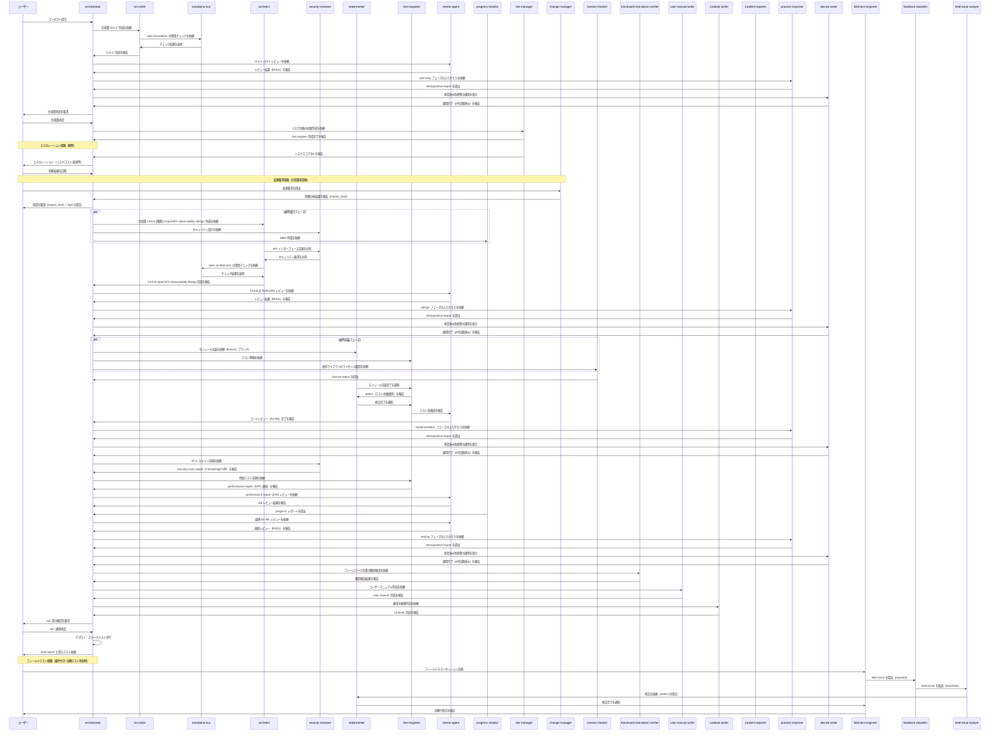

---

## 付録B: 進捗管理データのスキーマ

**進捗管理JSON スキーマ定義 (status-schema.json):**

```json
{
  "project_status": {
    "project_name": "string",
    "last_updated": "ISO8601 datetime",
    "current_phase": "setup | planning | dependency-selection | design | implementation | testing | delivery | operation",
    "overall_progress_percent": "number (0-100)",
    "wbs": {
      "total_tasks": "number",
      "completed_tasks": "number",
      "in_progress_tasks": "number",
      "blocked_tasks": "number"
    },
    "test_metrics": {
      "total_test_cases": "number",
      "executed": "number",
      "passed": "number",
      "failed": "number",
      "skipped": "number",
      "coverage_percent": "number"
    },
    "performance_metrics": {
      "nfr_total": "number",
      "nfr_passed": "number",
      "p95_latency_ms": "number",
      "error_rate_percent": "number"
    },
    "defect_metrics": {
      "total_found": "number",
      "total_fixed": "number",
      "open_critical": "number",
      "open_high": "number",
      "open_medium": "number",
      "open_low": "number"
    },
    "review_metrics": {
      "critical_open": "number",
      "high_open": "number",
      "medium_open": "number",
      "low_open": "number"
    },
    "security_metrics": {
      "sast_critical": "number",
      "sast_high": "number",
      "sca_critical": "number",
      "sca_high": "number"
    },
    "cost_metrics": {
      "budget_usd": "number",
      "spent_usd": "number",
      "percent_used": "number"
    },
    "risk_items": [
      {
        "id": "string",
        "description": "string",
        "severity": "critical | high | medium | low",
        "mitigation": "string"
      }
    ],
    "next_actions": ["string"]
  }
}
```

PM Agent はこのスキーマに従って `project-management/progress/progress-report.json` を更新する。リードエージェントはこのデータを参照して全体の進捗を把握する。

---

## 付録C: クイックリファレンス

### 主要コマンド一覧

| コマンド                    | 用途                                 |
| --------------------------- | ------------------------------------ |
| `claude`                    | Claude Code を対話モードで起動       |
| `claude -p "指示"`          | ヘッドレスモードで単発実行           |
| `claude --worktree`         | 独立Git Worktreeで起動               |
| `claude --agent agent-name` | 指定エージェントとして起動           |
| `claude --resume`           | 前回のセッションを再開               |
| `/plan`                     | 計画モードに切り替え                 |
| `/compact`                  | 会話コンテキストを圧縮               |
| `/rewind`                   | チェックポイントに巻き戻し           |
| `/model`                    | 使用モデルを切り替え                 |
| `/init`                     | プロジェクト初期分析を実行           |
| `/project:full-auto-dev`    | ほぼ全自動開発を開始（setup〜delivery）   |
| `/project:check-progress`   | 開発進捗を確認・報告                 |
| `/project:retrospective`    | ふりかえり・再発防止策の反映（推奨） |

### カスタムエージェント一覧

| エージェント名      | 役割                                                                | モデル | 区分         |
| ------------------- | ------------------------------------------------------------------- | ------ | ------------ |
| `orchestrator`                    | プロジェクト全体のオーケストレーション、フェーズ遷移制御、意思決定記録 | opus   | コア         |
| `srs-writer`                      | 仕様書 Ch1-2（Foundation・Requirements）の作成                        | opus   | コア         |
| `architect`                       | 仕様書 Ch3-6 詳細化・OpenAPI仕様・マイグレーション設計                | opus   | コア         |
| `security-reviewer`               | セキュリティ設計・脆弱性レビュー・SCA                                 | opus   | コア         |
| `implementer`                     | ソースコード実装、単体テスト作成                                      | opus   | コア         |
| `test-engineer`                   | テスト作成・実行・性能テスト・カバレッジ計測                          | sonnet | コア         |
| `review-agent`                    | SW工学原則・並行性・パフォーマンス観点のレビュー（R1〜R6）            | opus   | コア         |
| `progress-monitor`                | 進捗管理・WBS・品質メトリクス・コスト追跡・エージェント監視           | sonnet | コア         |
| `change-manager`                  | 変更要求の受付・影響分析・記録                                        | sonnet | プロセス管理 |
| `risk-manager`                    | リスク特定・評価・軽減策管理                                          | sonnet | プロセス管理 |
| `license-checker`                 | OSSライセンス互換性確認                                               | haiku  | プロセス管理 |
| `kotodama-kun`                    | 用語・命名の整合性チェック                                            | haiku  | 品質保証     |
| `framework-translation-verifier`  | フレームワーク文書の多言語間翻訳一致性検証                            | sonnet | 品質保証     |
| `user-manual-writer`              | ユーザーマニュアルの作成                                              | sonnet | 納品物       |
| `runbook-writer`                  | 運用手順書（Runbook）の作成                                           | sonnet | 納品物       |
| `incident-reporter`               | インシデント報告書の作成                                              | sonnet | 運用         |
| `process-improver`                | ふりかえり・根本原因分析・プロセス改善策の提案                        | sonnet | 改善         |
| `decree-writer`                   | 承認済み改善策のガバナンスファイルへの安全な適用                      | sonnet | 改善         |
| `field-test-engineer`             | ユーザーとの実機テスト、フィードバック記録、修正後の実機検証          | sonnet | 条件付き     |
| `feedback-classifier`             | フィードバックを仕様書と照合し分類（defect / CR / 質問）             | sonnet | 条件付き     |
| `field-issue-analyst`             | 原因分析、対策立案、影響範囲分析                                      | opus   | 条件付き     |

> **注記:** 条件付きエージェント（field-test-engineer, feedback-classifier, field-issue-analyst）は、setup フェーズで「実機テスト」が有効化された場合のみアクティベートされる。詳細は agent-list §1 を参照。

### 環境変数

| 変数                                     | 説明                 |
| ---------------------------------------- | -------------------- |
| `CLAUDE_CODE_EXPERIMENTAL_AGENT_TEAMS=1` | Agent Teams を有効化 |
| `ANTHROPIC_API_KEY`                      | API キー（CI/CD用）  |

### 公式リソース

| リソース                 | URL                                             |
| ------------------------ | ----------------------------------------------- |
| Claude Code ドキュメント | https://code.claude.com/docs/en/overview        |
| Claude Code GitHub       | https://github.com/anthropics/claude-code       |
| MCP サーバー一覧         | https://github.com/modelcontextprotocol/servers |
| Claude API ドキュメント  | https://docs.claude.com                         |

---

> **免責事項:** 本マニュアルは2026年2月時点のClaude Codeの公開情報に基づいて作成されている。Agent Teams等の実験的機能を含むため、実際の動作は公式ドキュメントの最新版を参照すること。また、AIによる自動開発は人間による最終確認を完全に置き換えるものではなく、特にセキュリティやミッションクリティカルなシステムでは人間の専門家による検証を推奨する。IaC（インフラ変更）の適用は必ずユーザーの承認を経てから実行すること。
