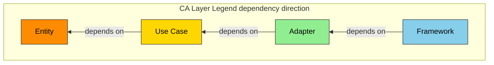
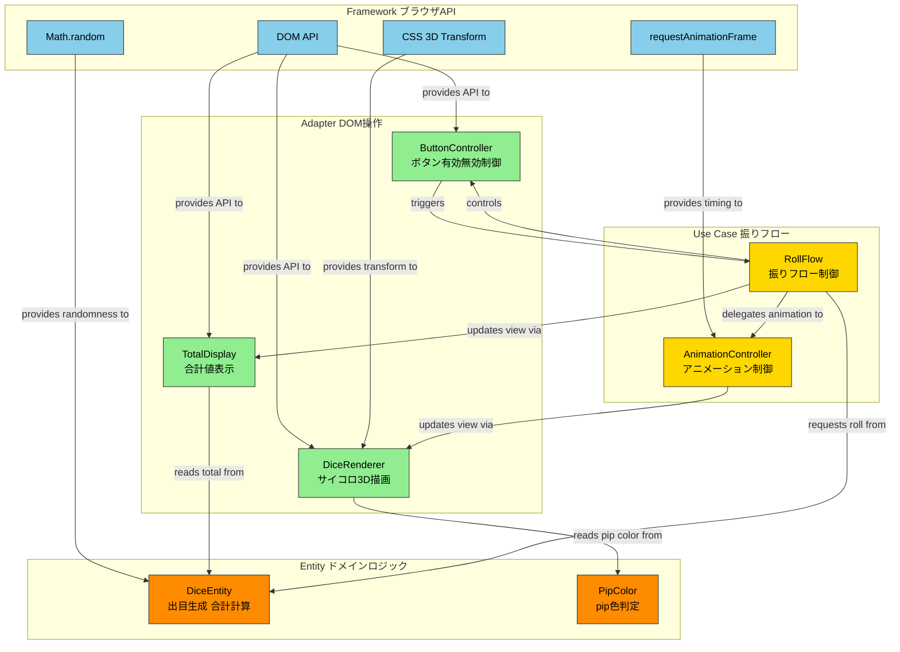
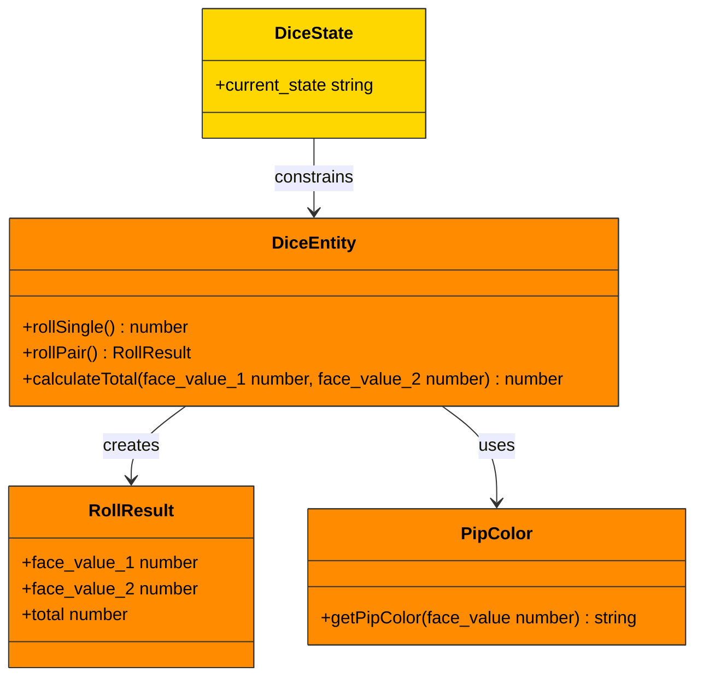
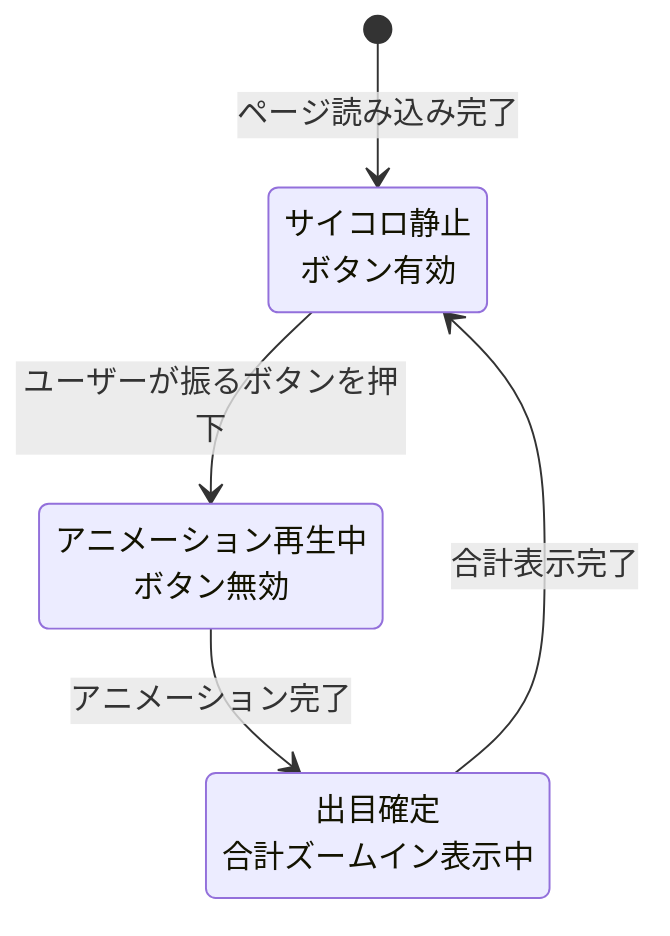
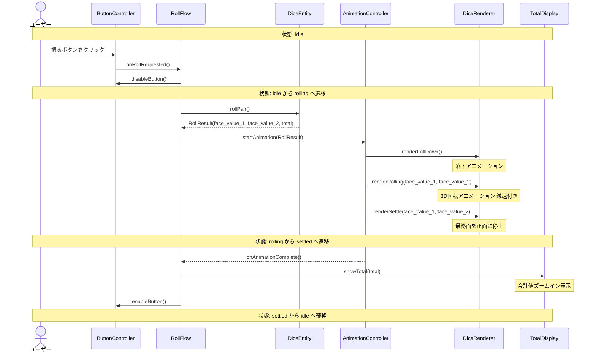
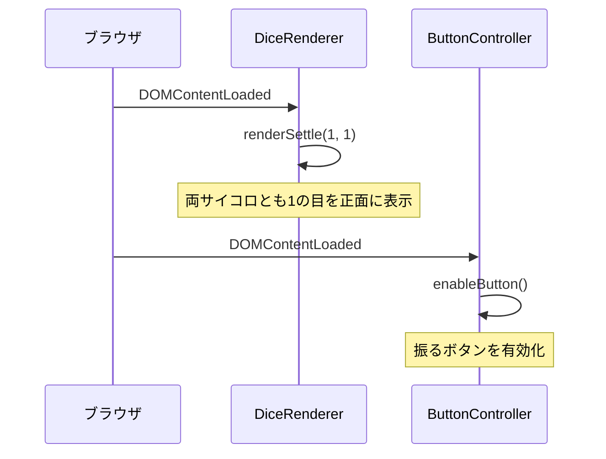
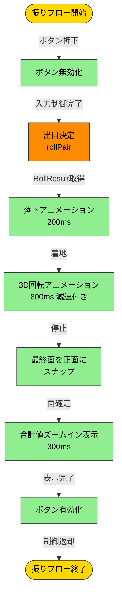

# mahjong-dice 仕様書

## Chapter 1. Foundation (基本事項)

### 1.1 Background (背景)

麻雀は4人で行う卓上ゲームであり、局の開始時にサイコロ2個を振って配牌の開始位置を決定する。サイコロは麻雀の進行に不可欠な道具である。

### 1.2 Issues (課題)

物理的な麻雀用サイコロを紛失した場合、代替手段がないと麻雀のプレイに支障が出る。汎用のサイコロアプリは存在するが、麻雀特有の演出（1の目が赤い、卓上でコロコロ転がる感じ）を備えたものは少ない。

### 1.3 Goals (目標)

- 麻雀プレイ中にスマホまたはPCのブラウザで即座にサイコロを振れる状態を実現する
- 麻雀卓でサイコロを振る雰囲気を視覚的に再現する
- サーバー不要で、HTMLファイルを開くだけで動作する

### 1.4 Approach (解決方針)

- 単一HTMLファイル（HTML + CSS + JavaScript）で実装する
- CSS 3D Transform と requestAnimationFrame によるサイコロアニメーション
- レスポンシブデザインでスマホ・PC両対応
- 外部依存なし（CDN・フレームワーク不使用）

### 1.5 Scope (範囲)

**In-scope:**

- サイコロ2個の同時振り
- 3Dアニメーション（落下 → コロコロ転がり → 着地 → 合計ズームイン）
- 麻雀サイコロの外観（1の目が赤）
- レスポンシブ対応（スマホ・PC）
- オフライン動作（サーバー不要）

**Out-of-scope:**

- サイコロ個数の変更機能
- 効果音
- 振った履歴の記録
- 麻雀の配牌位置の計算
- マルチプレイヤー共有
- インストール型アプリ（PWA等）

### 1.6 Constraints (制約事項)

- サーバーを使用してはならない（静的ファイルのみ）
- 外部CDN・外部リソースを読み込んではならない
- 単一HTMLファイルで完結すること（CSS・JSはインライン）

### 1.7 Limitations (制限事項)

- 乱数は `Math.random()` を使用する。暗号学的な乱数品質は保証しない（ゲーム用途で十分）
- 3Dアニメーションの描画品質はブラウザの GPU 加速に依存する
- 極端に古いブラウザ（CSS 3D Transform 非対応）では動作しない

### 1.8 Glossary (用語集)

| 用語 | 定義 |
|------|------|
| pip | サイコロの面に描画されるドット（点） |
| 出目 (face value) | サイコロの1つの面が示す数値（1〜6） |
| 合計 (total) | 2個のサイコロの出目の合計（2〜12） |
| 振る (roll) | サイコロを投げて出目を決定する操作 |
| 麻雀サイコロ | 1の目が赤色で表示される麻雀専用サイコロ |

### 1.9 Notation (表記規約)

RFC 2119/8174 に準拠する。

- **SHALL / MUST**: 必須
- **SHOULD**: 推奨
- **MAY**: 任意

EARS 構文中の `shall` は `SHALL` と同義。

---

## Chapter 2. Requirements (要求)

### 2.1 Functional Requirements (機能要求)

**FR-001: サイコロの振り**

When ユーザーが「振る」ボタンをタップ/クリックする, the システム shall 2個のサイコロをそれぞれ独立に1〜6の出目をランダムに決定する。

**FR-002: 3Dアニメーション表示**

When サイコロが振られる, the システム shall 以下の演出を順次実行する:

1. サイコロが画面上方から落下する
2. 着地後にコロコロと3D回転しながら転がる（減速付き）
3. 最終出目の面を正面にして停止する
4. 合計値をズームインで表示する

**FR-003: 合計値の表示**

When サイコロが停止する, the システム shall 2個の出目の合計値（2〜12）を画面に表示する。

**FR-004: 麻雀サイコロの外観**

The システム shall 1の出目の pip を赤色で表示する。その他の出目の pip は黒色で表示する。

**FR-005: 再振り**

When 前回のアニメーションが完了する, the システム shall 「振る」ボタンを再度有効にし、連続してサイコロを振ることを可能にする。

**FR-006: 初期表示**

When ページが読み込まれる, the システム shall サイコロ2個を1の目が正面の状態で表示し、「振る」ボタンを有効にする。

### 2.2 Non-Functional Requirements (非機能要求)

**NFR-001: レスポンシブ対応**

The システム shall 幅375px（スマホ）〜1920px（デスクトップ）の画面幅で正常にレイアウトされること。

**NFR-002: アニメーション性能**

The アニメーション shall 60fps を目標とし、主要なモダンブラウザ（Chrome, Safari, Firefox, Edge の最新2バージョン）で滑らかに動作すること。

**NFR-003: オフライン動作**

The システム shall インターネット接続なしで動作すること。外部リソースへのネットワークリクエストを発行してはならない。

**NFR-004: 初回表示速度**

The ページ shall 読み込み完了から1秒以内に操作可能状態になること。

**NFR-005: ファイルサイズ**

The HTMLファイル shall 50KB以下であること。

---

## Chapter 3. Architecture (アーキテクチャ)

**レイヤー仕訳:**

| CAレイヤー | 役割 | 本プロジェクトでの担当 |
|------------|------|------------------------|
| Entity | ドメインデータ・コアロジック | サイコロの出目生成、合計計算、pip 色判定 |
| Use Case | ビジネスロジック調整 | 振りフロー制御（振り開始 → アニメーション → 結果表示） |
| Adapter | 外部IF適合 | DOM操作（サイコロ描画、ボタン制御、合計表示更新） |
| Framework | UI・デバイス・外部サービス | ブラウザAPI（requestAnimationFrame, Math.random, DOM API, CSS 3D Transform） |

### 3.1 Architecture Concept (アーキテクチャ方式)

Simplified Clean Architecture（簡易CA）を採用する。単一HTMLファイル内のインラインJavaScriptを論理的に4層に分割し、関数単位で責務を分離する。クラスやインターフェースによる抽象化は行わず、関数の呼び出し方向で依存関係を制御する。

依存方向: Framework → Adapter → Use Case → Entity（内側への一方向依存）

**凡例: Clean Architecture レイヤー (コンポーネント図・クラス図 共通):**



| CAレイヤー | 役割 | 色 | Hex |
|------------|------|----|-----|
| Entity | ドメインデータ・コアロジック | 橙 | `#FF8C00` |
| Use Case | ビジネスロジック調整 | ゴールド | `#FFD700` |
| Adapter | 外部IF適合 | 緑 | `#90EE90` |
| Framework | UI・デバイス・外部サービス | 青 | `#87CEEB` |

### 3.2 Components (コンポーネント)

**コンポーネント図:**



| コンポーネントID | コンポーネント名 | CAレイヤー | 責務 | traces |
|------------------|------------------|------------|------|--------|
| CMP-001 | DiceEntity | Entity | 1〜6の出目をランダム生成、2個の合計計算 | FR-001, FR-003 |
| CMP-002 | PipColor | Entity | 出目に応じた pip 色判定（1=赤、他=黒） | FR-004 |
| CMP-003 | RollFlow | Use Case | 振りフロー全体の制御（ボタン無効化 → 出目決定 → アニメーション → 合計表示 → ボタン有効化） | FR-001, FR-002, FR-003, FR-005 |
| CMP-004 | AnimationController | Use Case | 落下・回転・停止・ズームインのアニメーションシーケンス制御 | FR-002 |
| CMP-005 | DiceRenderer | Adapter | サイコロの3D DOM要素の生成・回転角度の更新・pip描画 | FR-002, FR-004, FR-006 |
| CMP-006 | ButtonController | Adapter | 「振る」ボタンの有効/無効の切り替え | FR-005, FR-006 |
| CMP-007 | TotalDisplay | Adapter | 合計値のDOM要素へのテキスト更新・ズームインCSS適用 | FR-003 |

### 3.3 File Structure (ファイル構成)

```
dice/
  src/
    index.html          # 本番用単一HTMLファイル（CSS・JS全インライン）
    dice-logic.js       # テスト用に分離したEntity・UseCaseロジック（ES Modules）
  tests/
    dice-logic.test.js  # 単体テスト（Vitest + jsdom）
  docs/
    spec/
      mahjong-dice-spec.md   # 仕様書
    api/                     # （本プロジェクトでは不使用: サーバーAPIなし）
  process-rules/
    spec-template.md
  package.json          # テスト実行用（devDependencies: vitest, jsdom）
  vitest.config.js      # Vitest設定
```

**ファイルとコンポーネントの対応:**

| ファイル | 含まれるコンポーネント | 備考 |
|----------|------------------------|------|
| src/index.html | CMP-001〜CMP-007 全て | 本番配布用。全コード・CSS・HTMLをインライン化 |
| src/dice-logic.js | CMP-001 (DiceEntity), CMP-002 (PipColor) | テスト用に Entity 層を ES Modules として export。Use Case 層の純粋関数部分も含む |
| tests/dice-logic.test.js | — | dice-logic.js の単体テスト |

### 3.4 Domain Model (ドメインモデル)

**クラス図（論理構造）:**



`RollResult` はプレーンオブジェクトとして実装する（クラスインスタンスにはしない）:

```javascript
// RollResult の型定義（JSDoc）
/** @typedef {{ face_value_1: number, face_value_2: number, total: number }} RollResult */
```

**状態遷移図:**



| 状態ID | 状態名 | ボタン状態 | サイコロ表示 | traces |
|--------|--------|------------|-------------|--------|
| ST-001 | idle | 有効 | 静止（初回は1の目を正面表示） | FR-006 |
| ST-002 | rolling | 無効 | 3Dアニメーション再生中 | FR-002, FR-005 |
| ST-003 | settled | 無効 → 有効へ遷移 | 最終出目の面を正面表示、合計ズームイン | FR-003, FR-005 |

### 3.5 Behavior (振る舞い)

**サイコロを振るフローのシーケンス図:**



**初期表示のシーケンス図:**



**アニメーションフローのアクティビティ図:**



### 3.6 Decisions (設計判断)

**ADR-001: 単一HTMLファイルで完結する構成**

- **Status:** Accepted
- **Context:** 麻雀プレイ中にスマホで手軽に使う想定であり、ファイルを1つ開くだけで動作することが最優先。サーバー構築やビルドステップは不要にしたい（制約 1.6 参照）。
- **Decision:** HTML + インラインCSS + インラインJavaScript の単一ファイル構成を採用する。
- **Consequences:**
  - (+) ファイルを開くだけで動作。URL共有や端末間コピーが容易
  - (+) 外部依存ゼロ。オフライン動作が保証される
  - (-) コードの構造化・テストが難しくなる → ADR-002 で対策

**ADR-002: テスト用にロジック関数を ES Modules として分離**

- **Status:** Accepted
- **Context:** 単一HTMLファイル内のインラインJSは Vitest から直接 import できない。しかし Entity 層のロジック（出目生成、合計計算、pip色判定）は純粋関数であり、単体テストで品質を担保したい。
- **Decision:** Entity 層の純粋関数を `src/dice-logic.js` に ES Modules として切り出す。本番用 `index.html` には同一コードをインラインで記述する（ソースの二重管理）。
- **Consequences:**
  - (+) Vitest + jsdom で Entity 層の単体テストが可能になる
  - (-) index.html と dice-logic.js でコードが重複する → DRY違反だが、ビルドステップなしの制約（1.6）との意図的なトレードオフ
  - (-) コード変更時に両方を同期する必要がある → Ch6 DRY の確認観点で管理

**ADR-003: CSS 3D Transform によるサイコロアニメーション**

- **Status:** Accepted
- **Context:** サイコロの3D回転を実現する選択肢として、(a) CSS 3D Transform + requestAnimationFrame、(b) WebGL / Three.js、(c) Canvas 2D がある。
- **Decision:** CSS 3D Transform + requestAnimationFrame を採用する。
- **Consequences:**
  - (+) 外部ライブラリ不要。単一HTMLファイルの制約を満たす
  - (+) GPU加速が効き、60fps が達成しやすい
  - (+) DOM要素としてサイコロの pip を個別にスタイル制御できる
  - (-) 複雑な物理シミュレーションは困難 → 簡易的な減速カーブで代用

**ADR-004: Math.random による乱数生成**

- **Status:** Accepted
- **Context:** サイコロの出目生成に暗号学的乱数（crypto.getRandomValues）は過剰。麻雀の配牌位置決定という用途では統計的な偏りが無視できればよい。
- **Decision:** `Math.random()` を使用する（制限事項 1.7 に明記済み）。
- **Consequences:**
  - (+) 追加APIの呼び出し不要。シンプルな実装
  - (-) 暗号学的なランダム性は保証されない（本用途では許容）

---

## Chapter 4. Specification (仕様)

### 4.1 Scenarios (シナリオ)

```gherkin
Feature: 麻雀サイコロ

  Background:
    Given ブラウザで index.html を開いている
```

**Result:** SKIP
**Remark:** Background は個別テスト対象外

---

```gherkin
  Rule: サイコロの出目はランダムに決定される

    Scenario: SC-001 サイコロ2個を振って出目が決定される (traces: FR-001)
      Given ページが読み込み完了している
      And 振るボタンが有効である
      When ユーザーが振るボタンをクリックする
      Then サイコロ1の出目が1以上6以下の整数である
      And サイコロ2の出目が1以上6以下の整数である
      And サイコロ1とサイコロ2の出目は独立に決定されている
```

**Result:** SKIP
**Remark:** 未テスト

---

```gherkin
  Rule: サイコロはアニメーションで演出される

    Scenario: SC-002 サイコロが3Dアニメーションで表示される (traces: FR-002)
      Given ユーザーが振るボタンをクリックした
      When アニメーションが開始される
      Then サイコロが画面上方から落下する
      And 着地後にサイコロが3D回転しながら転がる
      And 回転速度が徐々に減速する
      And 最終出目の面を正面にして停止する
```

**Result:** SKIP
**Remark:** 未テスト

---

```gherkin
    Scenario: SC-003 合計値がズームインで表示される (traces: FR-002, FR-003)
      Given サイコロのアニメーションが完了した
      When 出目が確定する
      Then 2個の出目の合計値が画面に表示される
      And 合計値がズームインの演出で表示される
      And 合計値は2以上12以下の整数である
```

**Result:** SKIP
**Remark:** 未テスト

---

```gherkin
  Rule: 麻雀サイコロは1の目が赤い

    Scenario: SC-004 1の目のpipが赤色で表示される (traces: FR-004)
      Given サイコロが表示されている
      When サイコロの出目が1である
      Then 1の目のpipが赤色で表示される
```

**Result:** SKIP
**Remark:** 未テスト

---

```gherkin
    Scenario: SC-005 1以外の出目のpipが黒色で表示される (traces: FR-004)
      Given サイコロが表示されている
      When サイコロの出目が2以上6以下である
      Then pipが黒色で表示される
```

**Result:** SKIP
**Remark:** 未テスト

---

```gherkin
  Rule: 連続してサイコロを振れる

    Scenario: SC-006 アニメーション完了後に再振りできる (traces: FR-005)
      Given サイコロを振ってアニメーションが完了した
      And 合計値が表示されている
      When ユーザーが再び振るボタンをクリックする
      Then 新たにサイコロが振られる
      And 前回とは独立した出目が決定される

    Scenario: SC-007 アニメーション中は振るボタンが無効である (traces: FR-005)
      Given サイコロのアニメーションが再生中である
      When ユーザーが振るボタンをクリックしようとする
      Then 振るボタンは無効であり操作できない
```

**Result:** SKIP
**Remark:** 未テスト

---

```gherkin
  Rule: 初期表示は1の目でボタンが有効

    Scenario: SC-008 ページ読み込み時の初期表示 (traces: FR-006)
      Given ユーザーがブラウザで index.html を初めて開く
      When ページの読み込みが完了する
      Then サイコロ2個が1の目を正面にして表示される
      And 振るボタンが有効である
      But 合計値は表示されていない
```

**Result:** SKIP
**Remark:** 未テスト

---

```gherkin
  Rule: 非機能要求

    Scenario: SC-009 レスポンシブ対応 (traces: NFR-001)
      Given 画面幅が375pxである
      When ページを表示する
      Then サイコロ2個と振るボタンがはみ出さずにレイアウトされる

    Scenario: SC-010 デスクトップ表示 (traces: NFR-001)
      Given 画面幅が1920pxである
      When ページを表示する
      Then サイコロ2個と振るボタンが適切なサイズでレイアウトされる
```

**Result:** SKIP
**Remark:** 未テスト

---

```gherkin
    Scenario: SC-011 オフライン動作 (traces: NFR-003)
      Given インターネット接続が無い状態である
      When ページを開いてサイコロを振る
      Then 正常に動作する
      But 外部へのネットワークリクエストは発行されない
```

**Result:** SKIP
**Remark:** 未テスト

---

```gherkin
    Scenario: SC-012 初回表示速度 (traces: NFR-004)
      Given ブラウザでページを開く
      When 読み込みが完了する
      Then 1秒以内に操作可能状態になる

    Scenario: SC-013 ファイルサイズ (traces: NFR-005)
      Given index.html を生成する
      When ファイルサイズを確認する
      Then 50KB以下である
```

**Result:** SKIP
**Remark:** 未テスト

---

### 4.2 UI Elements Map (UI要素マップ)

| 要素ID | 要素名 | HTML要素 | CSS ID/Class | 役割 | traces |
|--------|--------|----------|-------------|------|--------|
| UI-001 | サイコロ1 | `<div>` | `#dice-1` | サイコロ1の3D表示。6面をネストした子要素で構成 | FR-002, FR-004, FR-006 |
| UI-002 | サイコロ2 | `<div>` | `#dice-2` | サイコロ2の3D表示。構造はUI-001と同一 | FR-002, FR-004, FR-006 |
| UI-003 | 振るボタン | `<button>` | `#roll-button` | タップ/クリックで振りフローを開始。アニメ中は disabled | FR-001, FR-005, FR-006 |
| UI-004 | 合計表示 | `<div>` | `#total-display` | 合計値のテキスト表示。ズームインアニメーション付き | FR-003 |
| UI-005 | サイコロ面 | `<div>` | `.dice-face` | 各サイコロの6面を表す。face-1〜face-6 クラスで区別 | FR-002, FR-004 |
| UI-006 | pip | `<span>` | `.pip` / `.pip-red` | サイコロ面上のドット。1の目は `.pip-red`、他は `.pip` | FR-004 |
| UI-007 | サイコロコンテナ | `<div>` | `#dice-container` | サイコロ2個を横並びに配置するコンテナ | NFR-001 |

**レイアウト概要:**

```
+----------------------------------+
|         mahjong-dice             |
|                                  |
|   +----------+ +----------+     |
|   |          | |          |     |
|   | dice-1   | | dice-2   |     |
|   | (3D cube)| | (3D cube)|     |
|   |          | |          |     |
|   +----------+ +----------+     |
|                                  |
|          [ 合計: 7 ]             |
|                                  |
|        [ 振る button ]           |
|                                  |
+----------------------------------+
```

### 4.3 State Management (状態管理)

アプリケーション状態は単一の変数 `dice_state` で管理する。

| 状態 | 値 | ボタン | アニメーション | 合計表示 | 遷移条件 |
|------|----|--------|--------------|----------|----------|
| idle | `"idle"` | enabled | なし | 前回の値を保持（初回は非表示） | 初期表示完了 / settled完了 |
| rolling | `"rolling"` | disabled | 再生中 | 前回の値を保持 | 振るボタン押下 |
| settled | `"settled"` | disabled → enabled | 停止済み | ズームイン表示 | アニメーション完了 |

**不正な状態遷移の防止:**

- `rolling` 状態で振るボタンのクリックイベントは無視する（`disabled` 属性 + 状態チェックの二重防御）
- `settled` → `idle` は合計表示のズームイン完了コールバックで自動遷移する

---

## Chapter 5. Test Strategy (テスト戦略)

| テストレベル | 対象 | 方針 | ツール/フレームワーク | 合格基準 |
|------------|------|------|----------------------|----------|
| 単体テスト | Entity層: rollSingle, rollPair, calculateTotal, getPipColor | dice-logic.js の純粋関数を自動テスト。乱数テストは統計的検証（1000回実行で全出目出現） | Vitest + jsdom | 合格率 100% |
| E2Eテスト（手動） | SC-001〜SC-013 の全シナリオ | Gherkinシナリオに沿って手動でブラウザ操作。Chrome, Safari, Firefox, Edge で確認 | 手動テスト | 全シナリオ PASS |
| 視覚テスト（手動） | 3Dアニメーション、pip色、レスポンシブレイアウト | 目視確認。スマホ実機（375px）とデスクトップ（1920px）で確認 | 手動テスト | UI仕様通り |
| 非機能テスト | NFR-002 (60fps), NFR-004 (1秒以内), NFR-005 (50KB以下) | ブラウザDevToolsのPerformanceタブ、ファイルサイズ確認 | Chrome DevTools | 各NFR基準を満たす |

**単体テスト対象関数:**

| 関数名 | テスト観点 | traces |
|--------|-----------|--------|
| `rollSingle()` | 戻り値が1〜6の整数。1000回実行で全出目が1回以上出現 | FR-001 |
| `rollPair()` | face_value_1, face_value_2 がそれぞれ1〜6。total が合計値と一致 | FR-001, FR-003 |
| `calculateTotal(a, b)` | 境界値: (1,1)=2, (6,6)=12, (3,4)=7 | FR-003 |
| `getPipColor(face_value)` | 1 → 赤色文字列、2〜6 → 黒色文字列 | FR-004 |

---

## Chapter 6. Design Principles Compliance (SW設計原則 準拠確認)

本プロジェクトは単一HTMLファイルの小規模アプリであるため、プロジェクトに関連する原則のみ選択する。

| カテゴリ | 識別名 | 正式名称 | 確認観点 |
|----------|--------|----------|----------|
| 命名 | Naming | -- | 関数名・変数名がドメイン用語（1.8 Glossary）と一致するか。`rollSingle`, `face_value`, `pip`, `total` 等 |
| 依存関係 | Dependency Direction | -- | 関数呼び出しが Framework → Adapter → Use Case → Entity の方向に従っているか。Entity が DOM API を直接呼んでいないか |
| 簡潔性 | KISS | Keep It Simple, Stupid | 単一HTMLファイルの制約内で最も単純な実装か。不要な抽象化（クラス階層、DIコンテナ等）を導入していないか |
| 簡潔性 | YAGNI | You Aren't Gonna Need It | Out-of-scope の機能（履歴、効果音、個数変更等）を実装していないか |
| 簡潔性 | DRY | Don't Repeat Yourself | index.html と dice-logic.js のコード重複が ADR-002 で意図的に許容した範囲内に収まっているか。それ以外の不要な重複がないか |
| 責務分離 | SoC | Separation of Concerns | Entity（ロジック）、Adapter（DOM操作）、Framework（ブラウザAPI）が関数レベルで分離されているか |
| 責務分離 | SRP | Single Responsibility Principle | 各関数が単一の責務を持つか。rollPair がDOM操作まで行っていないか |
| 可読性 | POLA | Principle of Least Astonishment | 振るボタンを押したら直感的にサイコロが振られるか。disabled中のクリックが無視されるか |
| テスト | Testability | -- | Entity層の関数がDOMに依存せず、Vitestから直接テスト可能か。Math.random の差し替えが可能か |
| 純粋性 | Pure/Impure | -- | rollSingle/rollPair は Math.random に依存する不純関数だが、calculateTotal/getPipColor は純粋関数として分離されているか |
| 状態遷移 | State Transition | -- | dice_state の遷移条件取得と遷移実行が分離されているか。不正遷移（rolling→rolling）が防止されているか |
| 資源効率 | Resource Efficiency | -- | requestAnimationFrame の不要な連続呼び出しがないか。アニメーション完了後にタイマーが残っていないか |

---

## Appendix (付録)

### A.1 References (参考文献)

- 麻雀のルールにおけるサイコロの使用方法

### A.2 Licenses (ライセンス)

- 外部依存なし

### A.3 Changelog (変更履歴)

| バージョン | 日付 | 変更内容 |
|-----------|------|---------|
| 0.1.0 | 2026-03-21 | 初版作成（Ch1-2 + Ch3-6スケルトン） |
| 0.2.0 | 2026-03-21 | Ch3-6 詳細化（architect）: Architecture, Specification, Test Strategy, Design Principles Compliance |
