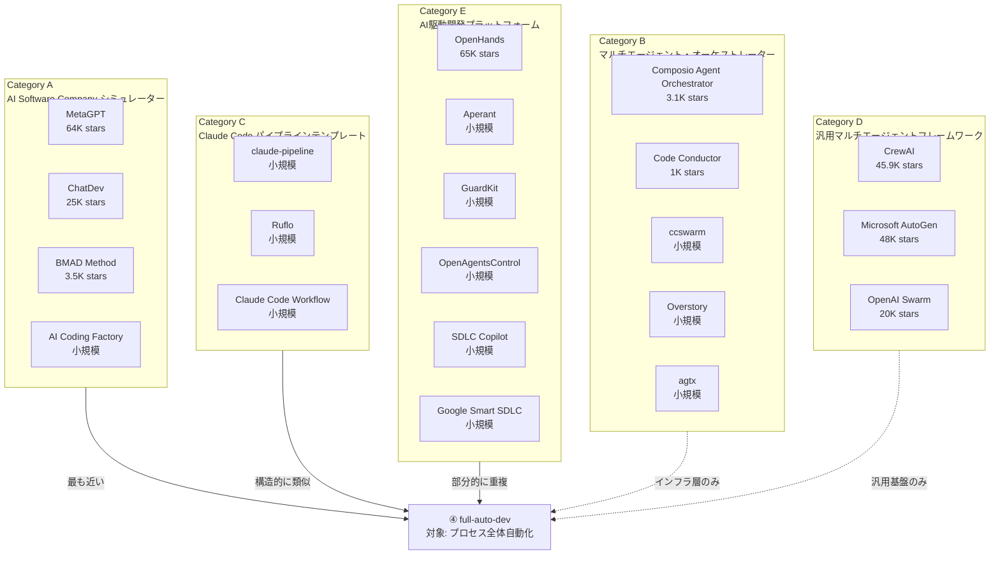
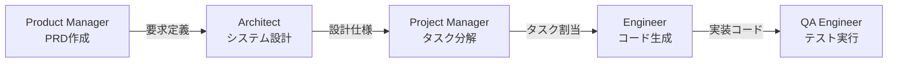
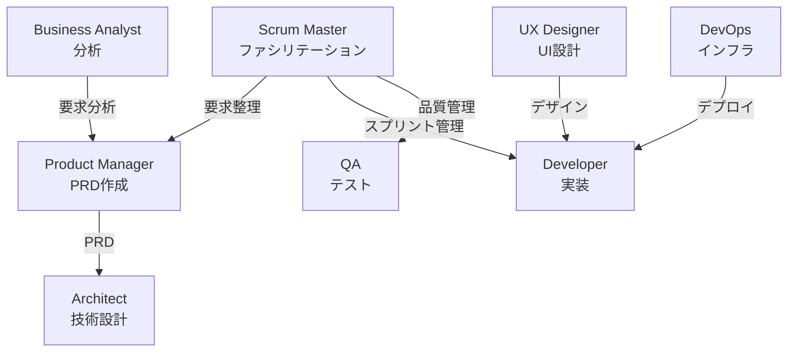
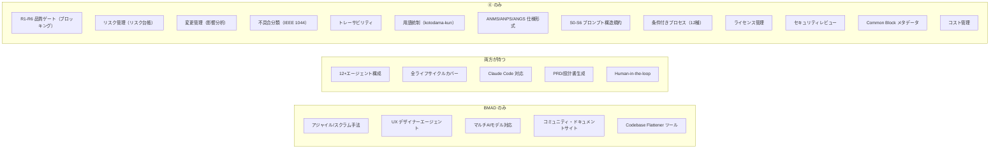
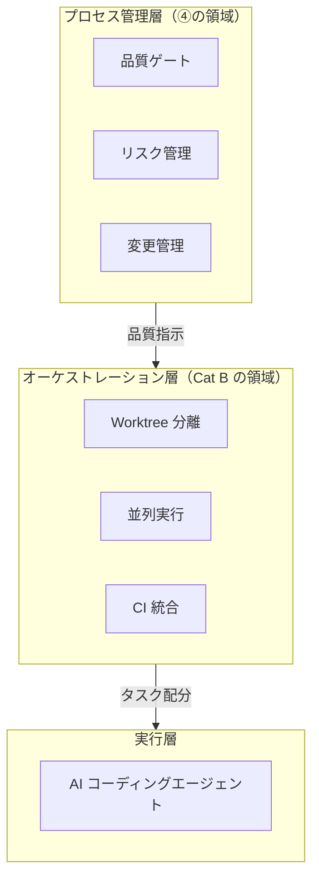
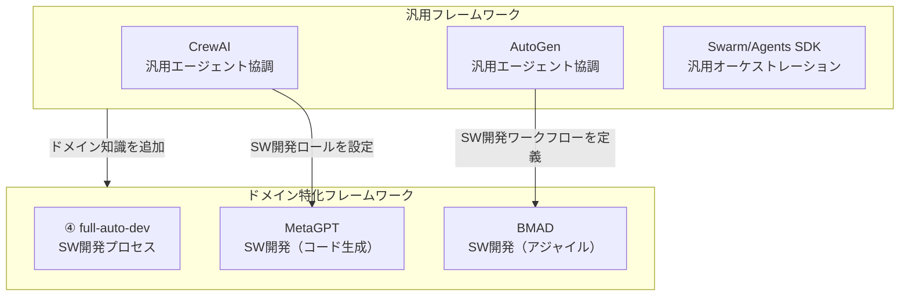
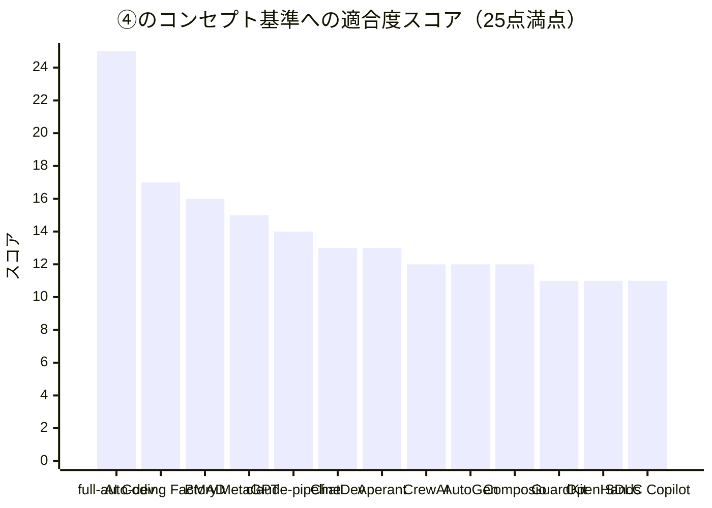
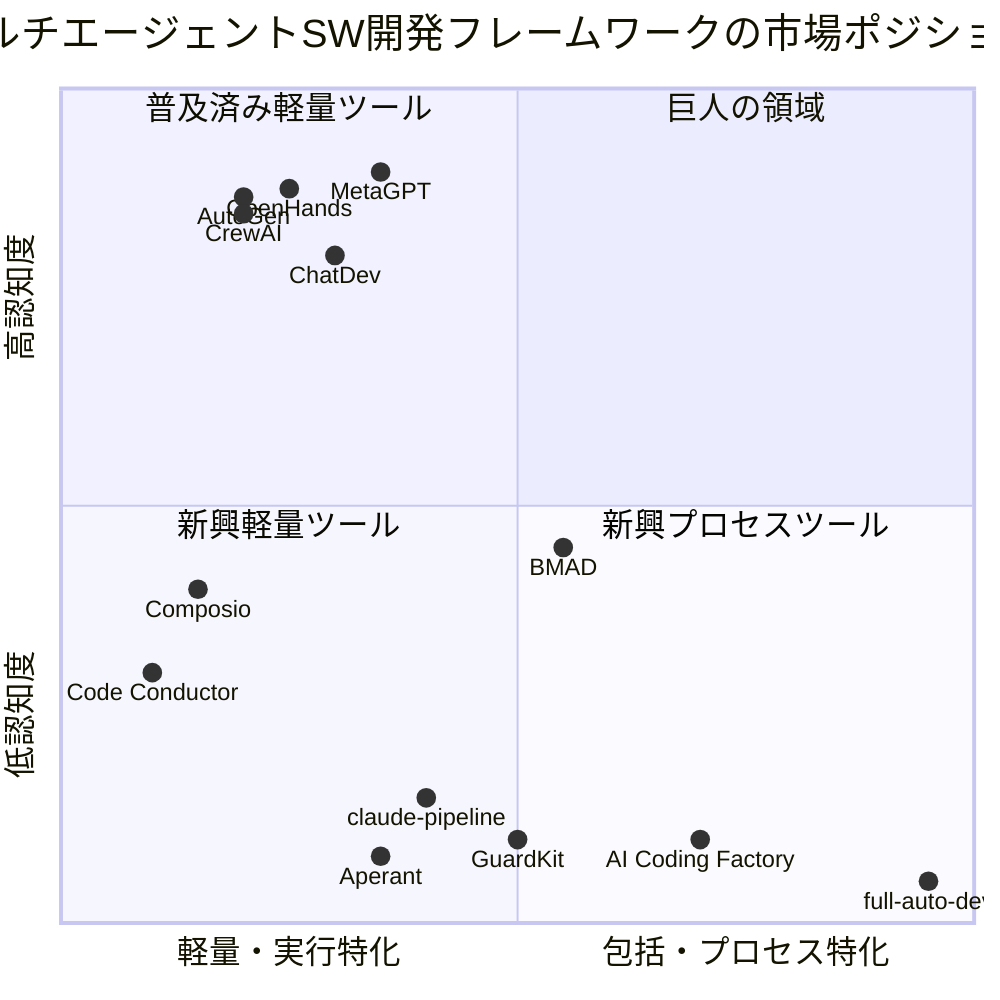
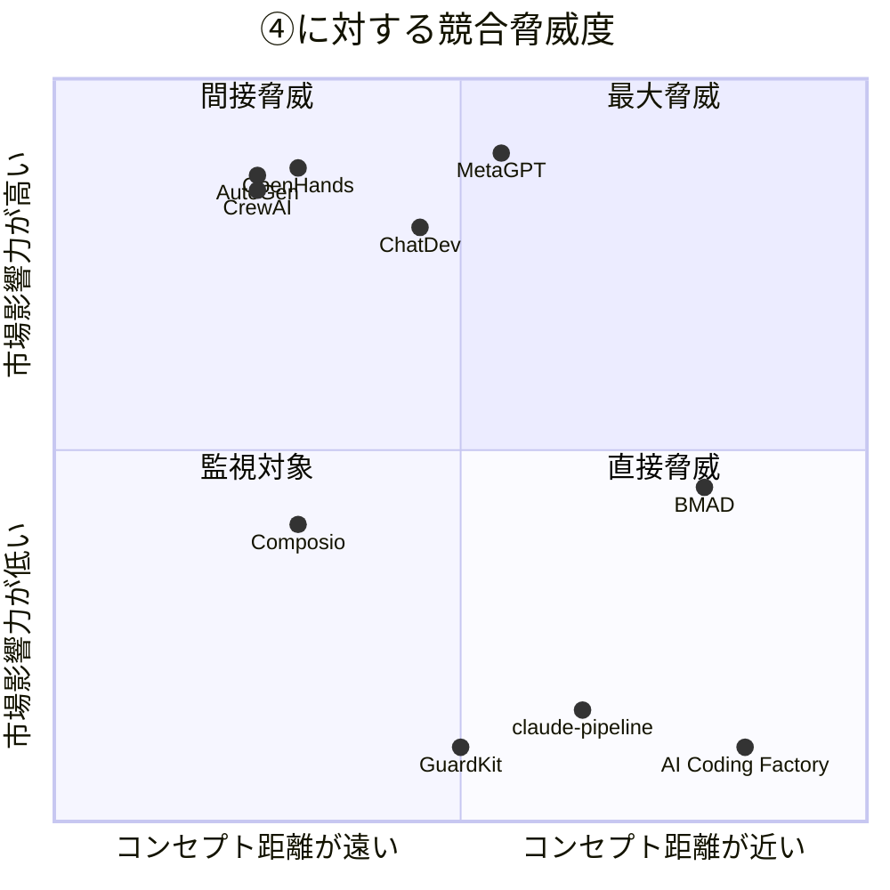
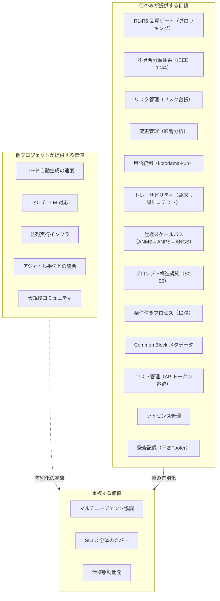

``````markdown
# AI-Native SDLC 自動化フレームワーク ランドスケープ調査 2026

> 調査日: 2026-03-16
> 目的: gr-sw-maker（④）と同一コンセプトのプロジェクト・フレームワークの網羅的探索
> 調査範囲: GitHub を中心に、マルチエージェント型 SDLC 自動化フレームワークを広範に調査
> 発見数: 21プロジェクト（5カテゴリに分類）

---

## 第1章 調査の背景と方法

### 1.1 調査目的

前回報告書（sdd-framework-comparison-2026.md）で分析した SDD ツール（OpenSpec / Spec Kit / cc-sdd）は、④ gr-sw-maker とはカテゴリが異なることが判明した。④の本質は「SDD ツール」ではなく「AI-Native な開発プロセス全体の自動化フレームワーク」である。

本調査では、④と同一コンセプト — すなわち**マルチエージェント協調による SDLC 全体の自動化**を志向するプロジェクトを、GitHub を中心に広範に探索する。

### 1.2 ④のコンセプト定義（検索基準）

④と「同一コンセプト」と判断するための基準を以下の5軸で定義する:

| # | 軸 | 定義 |
|---|---|------|
| C1 | マルチエージェント協調 | 複数の AI エージェントが明確な役割分担で協調動作する |
| C2 | SDLC 全体のカバー | 要求定義→設計→実装→テスト→納品の全工程を対象とする |
| C3 | 品質ゲート | フェーズ間に品質検証とブロッキングメカニズムを持つ |
| C4 | プロセスガバナンス | リスク管理・変更管理・不具合追跡等のプロセス管理を含む |
| C5 | 自律性 | 人間の介入を最小限に抑え、AI が自律的にプロセスを駆動する |

### 1.3 調査方法

- GitHub リポジトリ検索（15以上の検索クエリ）
- Web 検索（技術ブログ、比較記事、カンファレンス資料）
- Awesome リスト横断（awesome-claude-code, awesome-agent-orchestrators 等）
- 参照元: Augment Code SDD 比較記事、Anthropic Agentic Coding Trends Report 2026

---

## 第2章 カテゴリ分類

発見した21プロジェクトを5カテゴリに分類した。

**カテゴリ分類マップ:**



④に最も近いカテゴリは A（AI Software Company シミュレーター）であり、次いで C（Claude Code パイプラインテンプレート）が構造的に類似する。

---

## 第3章 Category A: AI Software Company シミュレーター

**④と最も近いカテゴリ。** 仮想的な「ソフトウェア開発チーム」をマルチエージェントで構成し、SDLC 全体を自動化する。

### 3.1 MetaGPT — 「最初の AI ソフトウェア企業」

| 項目 | 内容 |
|------|------|
| GitHub | https://github.com/FoundationAgents/MetaGPT |
| Stars | 約64,000 |
| ライセンス | MIT |
| 言語 | Python |
| AI モデル | OpenAI GPT-4、複数 LLM 対応 |
| 学術発表 | ICLR 2024 Oral（上位1.2%） |

**コンセプト**: 1行の要求から PRD、競合分析、データ構造、API、ドキュメント、コードを自動生成する。内部的に PM・アーキテクト・プロジェクトマネージャー・エンジニア・QA エンジニアの役割を SOP に基づいて模擬する。

**エージェント構成:**



5つの役割ベースエージェントが SOP（標準作業手順）に従いアセンブリーライン方式で協調する。

**④との比較**:

| 軸 | MetaGPT | ④ full-auto-dev |
|----|---------|-----------------|
| C1 マルチエージェント | 5役割 | 18役割 |
| C2 SDLC カバー | 要求→コード | 要求→運用（8フェーズ） |
| C3 品質ゲート | なし（暗黙的） | R1-R6（明示的ブロック） |
| C4 プロセスガバナンス | SOP ベース（軽量） | リスク/変更/不具合/監査（重厚） |
| C5 自律性 | 高い | 高い（3箇所のみ人間介入） |
| 仕様フォーマット | PRD + 設計書 | ANMS/ANPS/ANGS |
| 不具合追跡 | なし | IEEE 1044 準拠分類体系 |
| トレーサビリティ | なし | 要求→設計→テスト完全追跡 |

**評価**: MetaGPT は「AI エージェントによるコード自動生成」の先駆者として市場認知度が極めて高い。しかし品質ゲートやプロセスガバナンスは備えておらず、「生成品質の保証」は④が大きく上回る。MetaGPT は「速さ」、④は「品質と統制」で差別化されている。

---

### 3.2 ChatDev / ChatDev 2.0 — 仮想ソフトウェア企業

| 項目 | 内容 |
|------|------|
| GitHub | https://github.com/OpenBMB/ChatDev |
| Stars | 約25,000 |
| ライセンス | Apache 2.0 |
| 言語 | Python |
| AI モデル | GPT-3.5 / GPT-4、複数 LLM 対応 |
| 学術発表 | ACL 2024 |

**コンセプト**: CEO・CTO・プログラマー・テスターの仮想チームがチャットチェーンで対話しながら、設計・コーディング・テスト・ドキュメント作成を自動化する。

**特徴的技術**:
- **Communicative Dehallucination**: エージェント間の対話によってハルシネーションを相互抑制
- **MacNet**: DAG（有向非巡回グラフ）トポロジーで1000以上のエージェントを協調
- **ChatDev 2.0**: ゼロコードのマルチエージェントプラットフォームとして進化（2026年1月リリース）

**④との比較**:

| 軸 | ChatDev | ④ full-auto-dev |
|----|---------|-----------------|
| C1 マルチエージェント | 4+役割（CEO, CTO, Programmer, Tester） | 18役割 |
| C2 SDLC カバー | 設計→テスト | 要求→運用（8フェーズ） |
| C3 品質ゲート | なし | R1-R6（明示的ブロック） |
| C4 プロセスガバナンス | なし | リスク/変更/不具合/監査 |
| C5 自律性 | 高い | 高い |
| スケーリング | MacNet（1000+エージェント） | git worktree 並列 |

**評価**: ChatDev の Communicative Dehallucination は④にない独自技術である。一方、プロセス管理は皆無であり、「品質保証付きの自動開発」という観点では④が圧倒的に優位。

---

### 3.3 BMAD Method — 最も近い競合

| 項目 | 内容 |
|------|------|
| GitHub | https://github.com/bmad-code-org/BMAD-METHOD |
| Stars | 約3,500 |
| ライセンス | MIT |
| 言語 | Markdown（プロンプトベース） |
| AI モデル | 任意（Claude Code 推奨） |
| バージョン | V6 |

**コンセプト**: Build More, Architect Dreams — 12以上のドメインエキスパートエージェント（PM、アーキテクト、開発者、UX、スクラムマスター等）がブレインストーミングからデプロイメントまでの全ライフサイクルをカバーする。

**エージェント構成:**



12以上のエキスパートエージェントがアジャイル/スクラムの手法に基づいて協調する。

**④との詳細比較（BMAD は最も近い競合のため詳細に分析）**:

| 比較軸 | BMAD Method | ④ full-auto-dev |
|--------|-------------|-----------------|
| エージェント数 | 12+ | 18 |
| 開発方法論 | アジャイル/スクラム | フェーズゲート型（8フェーズ） |
| 品質ゲート | 部分的（DoD ベース） | R1-R6（6観点、重大度分類、ブロッキング） |
| リスク管理 | なし | risk-manager + リスク台帳（スコア6以上通知） |
| 変更管理 | なし | change-manager + 影響分析（High は承認必須） |
| 不具合管理 | なし | defect 票 + IEEE 1044 分類 + 根本原因分析 |
| トレーサビリティ | なし | 要求ID→設計ID→テストID |
| 用語統制 | なし | glossary + kotodama-kun |
| 仕様フォーマット | PRD + 技術設計書 | ANMS/ANPS/ANGS（3段階スケール） |
| プロンプト構造 | 自由形式 | S0-S6 構造規約 |
| 不具合分類 | なし | Error→Fault→Failure→Defect 系譜 |
| ライセンス管理 | なし | license-checker |
| セキュリティ | なし | security-reviewer + OWASP |
| コスト管理 | なし | API トークン消費記録 |
| 条件付きプロセス | なし | 12の条件付きプロセス |
| ドキュメント監査 | なし | Common Block + Footer（不変履歴） |
| AI モデル対応 | 任意 | Claude Code 専用 |
| コミュニティ | 中規模（ドキュメントサイト有） | なし（0 stars） |

**差別化マッピング:**



**評価**: BMAD は④に最も近い競合である。しかし両者の設計哲学は根本的に異なる。BMAD は「アジャイル開発をAIで加速する」アプローチであり、④は「ソフトウェア工学のプロセス管理をAIで自動化する」アプローチである。④はプロセスガバナンスで圧倒的に優位だが、BMAD はコミュニティ・マルチモデル対応・アジャイル親和性で優位に立つ。

---

### 3.4 AI Coding Factory — ガバナンス志向の同志

| 項目 | 内容 |
|------|------|
| GitHub | https://github.com/mitkox/ai-coding-factory |
| Stars | 小規模（新興プロジェクト） |
| ライセンス | 不明 |
| 言語 | Markdown + .NET |
| AI モデル | ローカル推論（vLLM / LM Studio）、オフライン対応 |

**コンセプト**: アウトソーシングを代替する「監査可能・自動化・プライベートなソフトウェアデリバリプラットフォーム」。品質・セキュリティ・トレーサビリティ・ガバナンスをデフォルトで強制する。

**特徴**:
- ステージエージェント: Ideation → Prototype → PoC → Pilot → Product
- スクラムチームエージェント: Product Owner, Scrum Master, Developer, QA, Security, DevOps
- Definition of Done / Definition of Ready テンプレート
- トレーサビリティルール
- エアギャップデプロイメント対応（セキュリティ重視）

**④との比較**:

| 軸 | AI Coding Factory | ④ full-auto-dev |
|----|-------------------|-----------------|
| ガバナンス | DoD/DoR + トレーサビリティ | R1-R6 + リスク/変更/不具合管理 |
| 技術依存 | .NET 特化、ローカル推論 | フレームワーク非依存、Claude Code |
| オフライン | 対応（エアギャップ） | 非対応（クラウド LLM 必須） |
| 仕様形式 | テンプレートベース | ANMS/ANPS/ANGS |
| 成熟度 | 低〜中 | 低〜中 |

**評価**: ④と「ガバナンス重視」の哲学を共有する数少ない同志。ただし .NET 特化とローカル推論という技術スタックの違いにより、直接競合はしない。エアギャップ対応は規制産業向けの強力な差別化であり、④が参考にすべき点である。

---

## 第4章 Category B: マルチエージェント・オーケストレーター

**並列実行インフラに特化。** SDLC プロセス管理は含まないが、④の実行基盤として統合可能。

### 4.1 一覧

| # | 名称 | Stars | 特徴 | AI モデル |
|---|------|-------|------|----------|
| 5 | Composio Agent Orchestrator | 3,100 | Planner+Workers 二層構成、8プラグイン、CI 自動修復 | Claude/Aider/Docker |
| 6 | Code Conductor | 1,000+ | GitHub ネイティブ、言語自動検出、完全自律 | Claude/Conductor/Warp |
| 7 | ccswarm | 小規模 | Rust 製、専門エージェントプール（Frontend/Backend/DevOps/QA） | Claude Code |
| 8 | Overstory | 小規模 | プラガブル AgentRuntime、SQLite メール、8+ランタイム | マルチランタイム |
| 9 | agtx | 小規模 | マルチセッション端末管理、tmux 統合 | マルチランタイム |

**カテゴリ B の位置づけ:**



Category B のプロジェクトは④の「実行インフラ層」として統合可能である。④がプロセス管理（何を・いつ・どの品質で作るか）を担い、Category B が並列実行（どうやって同時に作るか）を担う補完関係が成立する。

### 4.2 注目: Composio Agent Orchestrator

| 項目 | 内容 |
|------|------|
| GitHub | https://github.com/ComposioHQ/agent-orchestrator |
| Stars | 約3,100 |
| アーキテクチャ | Planner（計画）+ Workers（実行）の二層構成 |
| プラグイン | 8スロット（差し替え可能） |
| 特徴 | CI 失敗の自動修復、レビューコメント対応、マージコンフリクト解決 |

④の Agent Teams（git worktree 並列実装）と技術的に近いが、プロセス管理層を持たない。④の orchestrator エージェントが Composio の Planner 相当を担い、実行層に Composio を使うという統合パターンが考えられる。

---

## 第5章 Category C: Claude Code パイプラインテンプレート

**④と構造的に最も類似。** `.claude/` フォルダ内にエージェント定義と品質ゲートを配置するテンプレート型フレームワーク。

### 5.1 claude-pipeline — 構造的双子

| 項目 | 内容 |
|------|------|
| GitHub | https://github.com/aaddrick/claude-pipeline |
| Stars | 小規模 |
| 構造 | .claude/ フォルダ内に skills, agents, hooks, orchestration scripts を配置 |
| エージェント数 | 10（バックエンド/フロントエンド開発者、コードレビューア、テストバリデータ、ドキュメント生成器等） |

**品質ゲート**: 3段階（仕様準拠レビュー → コード品質レビュー → テストバリデーション）

**④との比較**:

| 軸 | claude-pipeline | ④ full-auto-dev |
|----|----------------|-----------------|
| 構造 | .claude/ フォルダベース | .claude/ フォルダベース |
| エージェント数 | 10 | 18 |
| 品質ゲート | 3段階（実装品質特化） | R1-R6（6観点、プロセス品質含む） |
| プロセス管理 | なし | リスク/変更/不具合/監査 |
| スキル数 | 19（TDD、デバッグ、PR処理等） | 3コマンド（full-auto-dev, check-progress, retrospective） |
| フォーカス | 実装品質の担保 | プロセス全体の自動化 |

**評価**: claude-pipeline は④の「実装フェーズの品質管理部分」に特化したテンプレートといえる。④のほうがプロセス管理で圧倒的に広いが、claude-pipeline の19スキル（TDD、デバッグ等）は④が持たない実装レベルの細粒度機能を提供している。

### 5.2 その他の Claude Code テンプレート

| # | 名称 | 特徴 | ④との差異 |
|---|------|------|----------|
| 11 | Ruflo | エンタープライズ級分散スウォーム、RAG 統合 | インフラ/プラットフォーム志向 |
| 12 | Claude Code Workflow (CCW) | JSON 駆動ワークフロー、ビジュアル編集 | ワークフロー実行フレームワーク |

---

## 第6章 Category D: 汎用マルチエージェントフレームワーク

**SW 開発に限定されない汎用基盤。** ④の実装に利用可能だが、SDLC ドメイン知識を持たない。

### 6.1 一覧

| # | 名称 | Stars | 提供元 | 特徴 |
|---|------|-------|--------|------|
| 13 | CrewAI | 45,900 | CrewAI Inc. | 役割ベースエージェント協調、10万+開発者認定、Python |
| 14 | Microsoft AutoGen / Agent Framework | 48,000 | Microsoft | グラフベースオーケストレーション、Python/.NET、Semantic Kernel 統合 |
| 15 | OpenAI Swarm / Agents SDK | 20,000+ | OpenAI | 軽量エージェントオーケストレーション（Agents SDK に後継） |

**位置づけ:**



Category D のフレームワークは「エンジン」であり、④のような「ドメイン特化フレームワーク」がその上に構築される。④が将来マルチモデル対応する際、CrewAI や AutoGen をバックエンドとして採用する選択肢がある。

---

## 第7章 Category E: AI 駆動開発プラットフォーム

**単一エージェントまたはプラットフォーム型。** 部分的に④と重複するが、プロセス管理の深度が異なる。

### 7.1 一覧

| # | 名称 | Stars | 特徴 | ④との重複度 |
|---|------|-------|------|------------|
| 18 | OpenHands | 65,000+ | AI 開発プラットフォーム、$18.8M 調達、87%バグ解決率 | 低（実行ツール） |
| 18 | Aperant (Auto-Claude) | 小規模 | Electron デスクトップアプリ、Spec→Plan→Code→QA パイプライン | 中（QA ループ類似） |
| 18 | GuardKit | 小規模 | 品質ゲート付き AI 開発、カバレッジ80%閾値、RequireKit 統合 | 中（品質ゲート類似） |
| 19 | OpenAgentsControl | 小規模 | Plan-first + 承認ベース実行、パターン発見 | 低〜中 |
| 20 | SDLC Copilot | 小規模 | フル SDLC 自動化、予測メンテナンス | 中（SDLC カバー類似） |
| 21 | Google Smart SDLC | 小規模 | Vertex AI / Gemini による SDLC ツールセット | 低（リファレンス実装） |

### 7.2 注目: GuardKit

| 項目 | 内容 |
|------|------|
| GitHub | https://github.com/guardkit/guardkit |
| 特徴 | カバレッジ閾値（80%行、75%ブランチ）、コンパイルチェック、コードレビュー、カンバン追跡 |
| 連携 | RequireKit（要求管理ツール）と統合 |

④の品質ゲート思想と部分的に一致する。特にカバレッジ80%閾値は④の「カバレッジ目標80%以上」と同値である。ただしマルチエージェント協調やプロセスガバナンスは持たない。

### 7.3 注目: Aperant

| 項目 | 内容 |
|------|------|
| GitHub | https://github.com/AndyMik90/Aperant |
| 特徴 | Spec → Planner → Coder（並列サブエージェント）→ QA Reviewer → QA Fixer → User Review |
| 技術 | Electron、TypeScript、Vercel AI SDK v6、Graphiti メモリシステム |

④のフェーズ構造（仕様→計画→実装→QA）と類似するパイプラインを持つが、プロセスガバナンスは含まない。デスクトップアプリとしての UX は④にない利点である。

---

## 第8章 総合比較マトリクス

### 8.1 ④のコンセプト基準（C1-C5）への適合度

| # | 名称 | C1<br/>マルチ<br/>エージェント | C2<br/>SDLC<br/>全体 | C3<br/>品質<br/>ゲート | C4<br/>プロセス<br/>ガバナンス | C5<br/>自律性 | 総合 |
|---|------|:---:|:---:|:---:|:---:|:---:|:---:|
| — | **④ full-auto-dev** | **5** | **5** | **5** | **5** | **5** | **25** |
| 1 | MetaGPT | 4 | 3 | 1 | 2 | 5 | 15 |
| 2 | ChatDev | 3 | 3 | 1 | 1 | 5 | 13 |
| 3 | **BMAD Method** | **5** | **4** | **2** | **1** | **4** | **16** |
| 4 | AI Coding Factory | 4 | 4 | 3 | 3 | 3 | 18 |
| 5 | Composio Orchestrator | 3 | 1 | 2 | 1 | 5 | 12 |
| 6 | Code Conductor | 2 | 1 | 1 | 1 | 5 | 10 |
| 7 | ccswarm | 3 | 1 | 1 | 1 | 4 | 10 |
| 8 | Overstory | 3 | 1 | 1 | 1 | 4 | 10 |
| 9 | agtx | 2 | 1 | 1 | 1 | 4 | 9 |
| 10 | claude-pipeline | 4 | 2 | 3 | 1 | 4 | 14 |
| 11 | Ruflo | 3 | 1 | 1 | 1 | 4 | 10 |
| 12 | CCW | 2 | 2 | 1 | 1 | 3 | 9 |
| 13 | CrewAI | 5 | 1 | 1 | 1 | 4 | 12 |
| 14 | AutoGen | 5 | 1 | 1 | 1 | 4 | 12 |
| 15 | Swarm/Agents SDK | 3 | 1 | 1 | 1 | 4 | 10 |
| 18 | OpenHands | 2 | 2 | 1 | 1 | 5 | 11 |
| 18 | Aperant | 3 | 3 | 2 | 1 | 4 | 13 |
| 18 | GuardKit | 2 | 2 | 3 | 1 | 3 | 11 |
| 19 | OpenAgentsControl | 2 | 2 | 2 | 1 | 3 | 10 |
| 20 | SDLC Copilot | 2 | 4 | 1 | 1 | 3 | 11 |
| 21 | Google Smart SDLC | 1 | 3 | 1 | 1 | 2 | 8 |

> スコアは 1（非対応）〜 5（完全対応）の5段階。④のコンセプト基準に対する適合度を評価。

### 8.2 適合度ランキング可視化

**コンセプト適合度ランキング:**



④は全21プロジェクト中で唯一、5軸すべてで最高評価を達成している。最も近い AI Coding Factory（17点）および BMAD（16点）でも、C3（品質ゲート）と C4（プロセスガバナンス）で大きなギャップがある。

### 8.3 機能カバレッジ詳細比較（上位5プロジェクト）

| 機能 | ④ full-auto-dev | AI Coding Factory | BMAD | MetaGPT | claude-pipeline |
|------|:---:|:---:|:---:|:---:|:---:|
| マルチエージェント（役割定義付き） | Yes | Yes | Yes | Yes | Yes |
| 要求定義フェーズ | Yes | Yes | Yes | Yes | No |
| 設計フェーズ | Yes | Yes | Yes | Yes | No |
| 実装フェーズ | Yes | Yes | Yes | Yes | Yes |
| テストフェーズ | Yes | Yes | Yes | Yes | Yes |
| 品質ゲート（ブロッキング） | Yes | Partial | No | No | Partial |
| リスク管理 | Yes | No | No | No | No |
| 変更管理 | Yes | No | No | No | No |
| 不具合追跡 | Yes | No | No | No | No |
| 不具合分類体系 | Yes | No | No | No | No |
| トレーサビリティ | Yes | Partial | No | No | No |
| セキュリティレビュー | Yes | Partial | No | No | No |
| ライセンス管理 | Yes | No | No | No | No |
| 用語統制 | Yes | No | No | No | No |
| 監査記録 | Yes | Partial | No | No | No |
| コスト管理 | Yes | No | No | No | No |
| 条件付きプロセス | Yes | No | No | No | No |
| 仕様スケールパス | Yes (ANMS/ANPS/ANGS) | No | No | No | No |
| プロンプト構造規約 | Yes (S0-S6) | No | No | No | No |

**④が唯一カバーする機能が13個存在する。** これは④の差別化が「程度の差」ではなく「カテゴリの差」であることを裏付ける。

---

## 第9章 市場ポジショニング

### 9.1 二軸マッピング

**市場ポジショニングマップ:**



④は右下の「新興プロセスツール」象限に位置する。プロセス包括性は最高だが、認知度は最低である。

### 9.2 競合の脅威度評価

**脅威度マッピング:**



- **最大脅威**: MetaGPT がプロセス管理機能を追加した場合（コンセプト距離が近く、市場影響力が高い）
- **直接脅威**: BMAD Method（コンセプトが最も近く、中程度の認知度）
- **間接脅威**: CrewAI / AutoGen / OpenHands（SW開発にドメイン特化した場合）
- **監視対象**: AI Coding Factory、claude-pipeline、GuardKit（コンセプト近いが小規模）

---

## 第10章 結論と示唆

### 10.1 主要発見事項

1. **④と完全に同一のコンセプトを持つプロジェクトは存在しない。** 21プロジェクトを調査した結果、C1-C5 の5軸すべてで高い適合度を持つプロジェクトは④のみである。

2. **最も近い競合は BMAD Method（16/25点）と AI Coding Factory（17/25点）。** しかし両者とも C3（品質ゲート）と C4（プロセスガバナンス）で④に大きく劣る。

3. **④の差別化は「カテゴリの差」である。** 他のプロジェクトが「AI による開発の加速」を目指すのに対し、④は「AI による開発プロセスの統制」を目指している。これは同じ市場の別セグメントであり、直接競合は少ない。

4. **④に欠けているのは「認知度」と「実証」のみ。** 技術的差別化は確立されているが、コミュニティ（0 stars）と実プロジェクトの実績がない。

5. **市場は急速に成長しており、窓は開いている。** 2025-2026年にかけてマルチエージェント開発ツールが爆発的に増加しているが、プロセスガバナンスに本格的に取り組んでいるプロジェクトはまだ極めて少ない。

### 10.2 ④への示唆

**④の独自性マップ:**



**結論**: ④は「AI-Native な開発プロセスガバナンス」という、21プロジェクトのいずれも十分にカバーしていない領域を占有している。この独自性は技術的に深く、容易に模倣できない。課題は認知度と実証のみであり、前回報告書（sdd-framework-comparison-2026.md）で提案した Phase 1 戦略（自己実証・最小構成・英語化）の妥当性が、本調査によってさらに裏付けられた。

---

## 付録: 全プロジェクト一覧

| # | カテゴリ | 名称 | GitHub URL | Stars |
|---|---------|------|------------|-------|
| 1 | A | MetaGPT | https://github.com/FoundationAgents/MetaGPT | 64,000 |
| 2 | A | ChatDev | https://github.com/OpenBMB/ChatDev | 25,000 |
| 3 | A | BMAD Method | https://github.com/bmad-code-org/BMAD-METHOD | 3,500 |
| 4 | A | AI Coding Factory | https://github.com/mitkox/ai-coding-factory | 小規模 |
| 5 | B | Composio Agent Orchestrator | https://github.com/ComposioHQ/agent-orchestrator | 3,100 |
| 6 | B | Code Conductor | https://github.com/ryanmac/code-conductor | 1,000+ |
| 7 | B | ccswarm | https://github.com/nwiizo/ccswarm | 小規模 |
| 8 | B | Overstory | https://github.com/jayminwest/overstory | 小規模 |
| 9 | B | agtx | https://github.com/fynnfluegge/agtx | 小規模 |
| 10 | C | claude-pipeline | https://github.com/aaddrick/claude-pipeline | 小規模 |
| 11 | C | Ruflo | https://github.com/ruvnet/ruflo | 小規模 |
| 12 | C | Claude Code Workflow | https://github.com/catlog22/Claude-Code-Workflow | 小規模 |
| 13 | D | CrewAI | https://github.com/crewAIInc/crewAI | 45,900 |
| 14 | D | Microsoft AutoGen | https://github.com/microsoft/autogen | 48,000 |
| 15 | D | OpenAI Swarm | https://github.com/openai/swarm | 20,000+ |
| 18 | E | OpenHands | https://github.com/OpenHands/OpenHands | 65,000+ |
| 18 | E | Aperant | https://github.com/AndyMik90/Aperant | 小規模 |
| 18 | E | GuardKit | https://github.com/guardkit/guardkit | 小規模 |
| 19 | E | OpenAgentsControl | https://github.com/darrenhinde/OpenAgentsControl | 小規模 |
| 20 | E | SDLC Copilot | https://github.com/shubhamprajapati7748/sdlc-copilot | 小規模 |
| 21 | E | Google Smart SDLC | https://github.com/GoogleCloudPlatform/smart-sdlc | 小規模 |
``````
