``````markdown
# SDD フレームワーク比較分析報告書

> 調査日: 2026-03-16
> 対象: OpenSpec / Spec Kit / cc-sdd / gr-sw-maker
> 目的: 4フレームワークの公平かつ多角的な比較検討、④のSWOT分析、および方策提案

---

## 第1章 エグゼクティブサマリー

2026年現在、AI支援開発の品質と予測可能性を高める手法として **Spec-Driven Development（SDD）** が急速に台頭している。本報告書では、SDD領域の主要フレームワーク4種を多角的に比較し、④ gr-sw-maker の戦略的位置づけを明らかにする。

### 調査対象一覧

| # | 名称 | 組織 | Stars | ライセンス | 初期リリース |
|---|------|------|-------|-----------|-------------|
| ① | OpenSpec | Fission-AI | 30,800 | MIT | 2025 |
| ② | Spec Kit | GitHub (Microsoft) | 77,000 | MIT | 2025 |
| ③ | cc-sdd | gotalab | 2,900 | MIT | 2025 |
| ④ | gr-sw-maker | GoodRelax | 0 | MIT | 2026 |

### 結論の要約

- ②Spec Kit は GitHub ブランドと巨大コミュニティを背景に SDD の「業界標準」を狙う
- ①OpenSpec は brownfield-first・軽量性で実務層に支持を広げている
- ③cc-sdd は Kiro 互換の実用ツールとしてニッチを確保
- ④full-auto-dev は「AI-Native な開発プロセス全体の自動化」という独自領域を開拓中だが、認知度・実績に課題を抱える

---

## 第2章 各フレームワーク概要

### 2.1 ① OpenSpec（Fission-AI）

**コンセプト**: 「コードを書く前に、何を作るかを合意する」ための軽量仕様レイヤー

**設計哲学（5原則）**:
1. Fluid, not rigid（柔軟であること）
2. Iterative, not waterfall（反復的であること）
3. Easy, not complex（簡潔であること）
4. Built for brownfield, not just greenfield（既存コードベース優先）
5. Scalable from personal to enterprise（個人〜企業まで拡張可能）

**ワークフロー**:

**OpenSpec ワークフロー:**

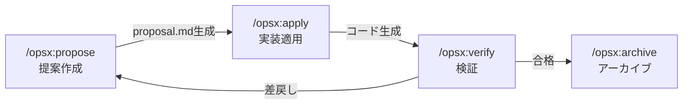

propose → apply → verify → archive の4段階サイクルで、変更提案を仕様として物理的に分離管理する。

**ディレクトリ構造**:
- `openspec/project.md` — プロジェクト全体の定義
- `openspec/specs/` — 現行仕様（current state）
- `openspec/changes/` — 変更提案（delta）

**技術的特徴**:
- TypeScript 製 CLI（Node.js 20.19+）
- 20以上の AI コーディングアシスタントに対応
- Delta マーカーによる差分追跡（semi-living spec）
- 出力量が軽量（約250行 vs Spec Kit の約800行）
- npm / pnpm / yarn / bun / nix 対応

**競合優位**: brownfield-first 設計、軽量出力、ツール非依存

---

### 2.2 ② Spec Kit（GitHub / Microsoft）

**コンセプト**: 「仕様がコードを生成する」— 仕様を実行可能な成果物として扱う SDD ツールキット

**設計哲学**:
- Intent-first design: 「何を」「なぜ」を「どうやって」より先に定義
- Rich specification: ガードレールと組織原則による仕様充実化
- Multi-step refinement: ワンショット生成ではなく反復的改善
- AI-native workflow: 高性能 AI モデルの能力を前提とした設計

**ワークフロー（6段階）**:

**Spec Kit ワークフロー:**

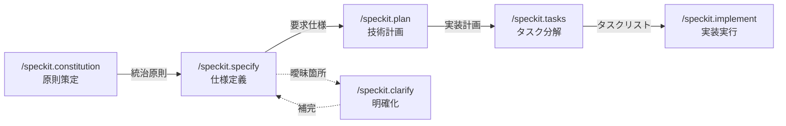

Constitution → Specify → Plan → Tasks → Implement の5段階に、Clarify（明確化）を挟む構成。

**技術的特徴**:
- Python 3.11+ 製 CLI（uv パッケージマネージャ）
- 25以上の AI エージェントに対応
- `.specify/` ディレクトリに仕様・メモリ・テンプレートを格納
- `/speckit.analyze` による成果物間整合性検証
- `/speckit.checklist` によるカスタム品質チェックリスト
- Generic agent サポート（非対応ツールでも利用可能）

**開発フェーズ対応**:
- 0-to-1（greenfield）: ゼロからのアプリケーション構築
- Creative Exploration: 複数実装の並列探索
- Iterative Enhancement（brownfield）: 既存コードベースへの機能追加

**競合優位**: GitHub ブランド力、巨大コミュニティ（77K stars）、Microsoft Learn での教育コンテンツ、エンタープライズ対応

---

### 2.3 ③ cc-sdd（gotalab）

**コンセプト**: Kiro スタイルのコマンドで要求→設計→タスクの構造化ワークフローを強制する SDD ツール

**設計哲学（AI-DLC）**:
- AI Plans → AI Asks → Human Validates → AI Implements
- 従来のスプリント（週単位）を「ボルト」（時間〜日単位）に圧縮
- 仕様承認なくして実装なし（Spec-first guarantee）

**ワークフロー:**

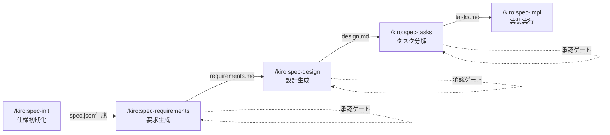

各フェーズ間に承認ゲートを設け、spec.json で状態遷移を管理する。

**技術的特徴**:
- TypeScript 製 NPM パッケージ（npx でワンコマンドインストール）
- 8つの AI コーディングエージェント対応
- 13言語のローカライゼーション
- EARS 形式による要求記述（Shall/Should/May）
- 3層カスタマイズ: Templates（文書構造）、Rules（判断基準）、Steering（プロジェクト記憶）
- `.kiro/specs/<feature>/spec.json` による状態機械管理
- タスクの並列実行マーカー（P0, P1）

**ディレクトリ構造**:
- `.kiro/settings/templates/` — 文書テンプレート（Handlebars）
- `.kiro/settings/rules/` — 生成ルール
- `.kiro/steering/` — プロジェクト記憶（product.md, tech.md, structure.md）
- `.kiro/specs/` — フィーチャー別仕様

**競合優位**: Kiro 互換性、ワンコマンドセットアップ、実用的なタスク分解、brownfield 対応のバリデーションコマンド

---

### 2.4 ④ gr-sw-maker（GoodRelax）

**コンセプト**: Claude Code のサブエージェント機能を活用した「ほぼ全自動ソフトウェア開発」フレームワーク

**設計哲学**:
- **STFB（Stable Top, Flexible Bottom）**: 仕様書の上位章（基盤・要求）は安定、下位章（設計・実装仕様）は柔軟に変更可能
- **Human-in-the-Loop は3箇所のみ**: コンセプト提示、重要判断、最終受入
- **命名は言霊**: 名前は意図・構造・理解を一目で伝える手段。汎用語禁止
- **DIP（依存性逆転原則）**: フレームワークは差し替え可能に

**フェーズ構成（8フェーズ）:**

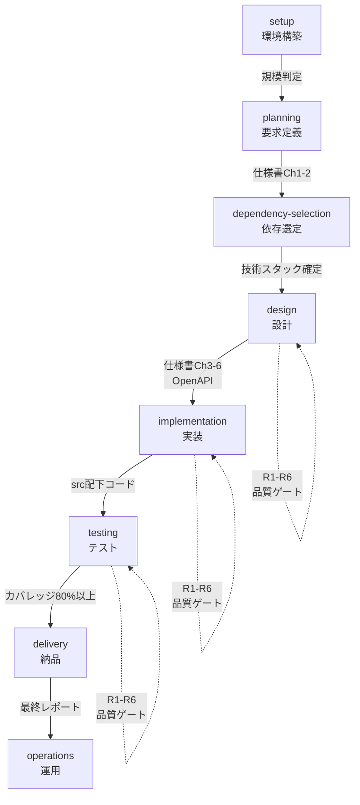

8フェーズ構成。各フェーズ間に R1-R6 品質ゲートを設置し、Critical/High 指摘ゼロを遷移条件とする。

**18エージェント構成:**

```mermaid
flowchart TD
    Orch["orchestrator<br/>オーケストレーター<br/>Opus"] -->|"フェーズ制御"| SRS["srs-writer<br/>仕様書Ch1-2<br/>Opus"]
    Orch -->|"フェーズ制御"| Arch["architect<br/>仕様書Ch3-6<br/>Opus"]
    Orch -->|"フェーズ制御"| Sec["security-reviewer<br/>脆弱性レビュー<br/>Opus"]
    Orch -->|"フェーズ制御"| Impl["implementer<br/>コード実装<br/>Opus"]
    Orch -->|"フェーズ制御"| Test["test-engineer<br/>テスト実行<br/>Sonnet"]
    Orch -->|"品質判定"| Rev["review-agent<br/>R1-R6レビュー<br/>Opus"]
    Orch -->|"進捗監視"| PM["progress-monitor<br/>WBS管理<br/>Sonnet"]
    Orch -->|"変更管理"| CM["change-manager<br/>CR処理<br/>Sonnet"]
    Orch -->|"リスク管理"| RM["risk-manager<br/>リスク台帳<br/>Sonnet"]
    Orch -->|"ライセンス確認"| LC["license-checker<br/>OSS互換性<br/>Haiku"]
    Orch -->|"用語チェック"| KK["kotodama-kun<br/>命名検証<br/>Haiku"]
    Orch -->|"翻訳検証"| FTV["framework-translation-verifier<br/>翻訳一致性<br/>Sonnet"]
    Orch -->|"マニュアル作成"| UMW["user-manual-writer<br/>マニュアル<br/>Sonnet"]
    Orch -->|"運用手順書"| RBW["runbook-writer<br/>Runbook<br/>Sonnet"]
    Orch -->|"インシデント報告"| IR["incident-reporter<br/>インシデント<br/>Sonnet"]
    Orch -->|"ふりかえり"| PI["process-improver<br/>プロセス改善<br/>Sonnet"]
    Orch -->|"改善適用"| DW["decree-writer<br/>改善適用<br/>Sonnet"]
    Rev -->|"Critical/Highで<br/>ブロック"| Orch
    PI -->|"改善提案"| Orch
    DW -->|"適用完了"| Orch
```

Orch エージェントを中心に、18の専門エージェントが役割分担する。モデルも Opus/Sonnet/Haiku の3段階で使い分ける。

**3段階仕様形式**:

| レベル | 略称 | 表現 | 適用規模 |
|--------|------|------|----------|
| 1 | ANMS | 単一 Markdown | 1コンテキストウィンドウに収まる |
| 2 | ANPS | 複数 Markdown + Common Block | 中規模 |
| 3 | ANGS | GraphDB + Git（MD はビュー） | 大規模 |

**品質ゲート（R1-R6）**:

| 観点 | 対象 |
|------|------|
| R1 | 要求品質（構造・曖昧さ・完全性） |
| R2 | 設計原則（SOLID, DRY, KISS, YAGNI, Clean Architecture） |
| R3 | コーディング品質（エラーハンドリング、防御的プログラミング） |
| R4 | 並行性・状態遷移（デッドロック、レース条件） |
| R5 | パフォーマンス（アルゴリズム、DB/IO、メモリ、ネットワーク） |
| R6 | テスト品質（カバレッジ、独立性、トレーサビリティ） |

**独自要素**:
- プロンプト構造規約（S0-S6）: エージェントプロンプトを実行可能な契約として標準化
- 不具合分類体系（IEEE 1044 / IEC 61508 準拠）: Error → Fault → Failure → Defect の系譜追跡
- 用語集 + kotodama-kun: 命名の一貫性を自動検証
- 条件付きプロセス: 機能安全、法規調査、i18n 等を必要時のみ有効化
- Common Block メタデータ: すべての文書にバージョン・ステータス・オーナー・ワークフロー状態を付与
- トレーサビリティ: 要求ID → 設計ID → テストID の追跡を必須とする

**競合優位**: プロセス全体の自動化、18エージェント協調、6観点品質ゲート、不具合根本原因分析、用語統制

---

## 第3章 多角的比較分析

### 3.1 設計思想の比較

**設計思想ポジショニング:**

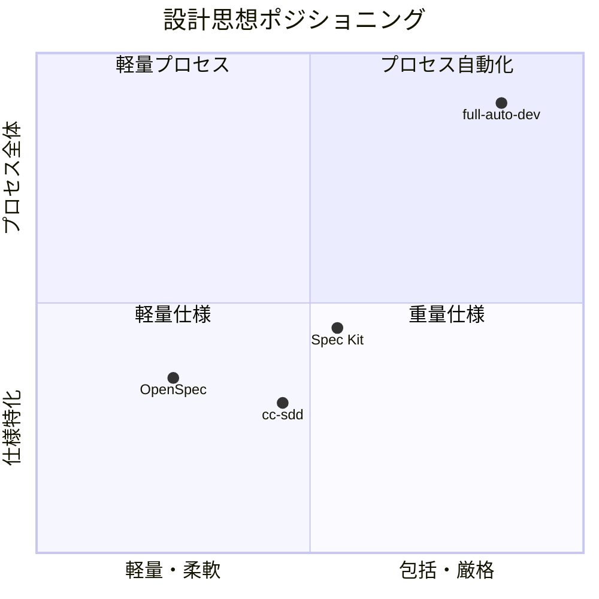

①②③はいずれも「仕様駆動」の範囲に留まるが、④は品質管理・リスク管理・変更管理・用語統制まで含む「プロセス全体の自動化」を志向する。

| 観点 | ① OpenSpec | ② Spec Kit | ③ cc-sdd | ④ full-auto-dev |
|------|-----------|-----------|---------|----------------|
| 核心思想 | 合意してから作る | 仕様が実装を生成する | 承認なくして実装なし | AI がプロセス全体を駆動する |
| 対象範囲 | 仕様管理 | 仕様→実装 | 仕様→実装 | 要求→設計→実装→テスト→納品→運用 |
| 人間の役割 | 提案承認・検証 | 原則策定・仕様記述 | 各フェーズ承認 | コンセプト・重要判断・最終受入 |
| 変更哲学 | Delta マーカー | 仕様再生成 | 状態機械リセット | change-manager + 影響分析 |
| brownfield 対応 | ネイティブ対応 | 対応あり | steering + validate | 対応あり |
| 仕様の寿命 | Semi-living（Delta） | Static | Static（承認ゲート付） | STFB 階層管理 |

### 3.2 技術的比較

| 観点 | ① OpenSpec | ② Spec Kit | ③ cc-sdd | ④ full-auto-dev |
|------|-----------|-----------|---------|----------------|
| 実装言語 | TypeScript | Python | TypeScript | Markdown + Prompt |
| インストール | npm install | uv tool install | npx cc-sdd | git clone + CLAUDE.md |
| 配布形態 | npm パッケージ | Python パッケージ | npm パッケージ | テンプレートリポジトリ |
| AI エージェント対応数 | 20+ | 25+ | 8 | 1（Claude Code 専用） |
| ランタイム要件 | Node.js 20.19+ | Python 3.11+ | Node.js | Claude Code |
| 仕様フォーマット | 独自 MD | 独自 MD | EARS + MD | ANMS/ANPS/ANGS |
| 状態管理 | ファイルシステム | ファイルシステム | spec.json | pipeline-state.md |
| カスタマイズ | 設定ファイル | テンプレート | 3層（Templates/Rules/Steering） | process-rules 全体 |
| テスト機能 | /opsx:verify | /speckit.checklist | /kiro:validate-impl | test-engineer エージェント |
| CI/CD 統合 | なし | なし | --yes フラグ | なし（GitHub Actions 想定） |

### 3.3 ワークフロー比較

**ワークフロー段階比較:**

```mermaid
gantt
    title ワークフロー段階の包含範囲
    dateFormat X
    axisFormat %s

    section OpenSpec
    propose_verify   : 0, 4

    section Spec Kit
    constitution_implement   : 0, 6

    section cc-sdd
    spec_init_impl   : 0, 5

    section full-auto-dev
    setup_operations   : 0, 8
```

①②③が「仕様策定→実装」のパイプラインに特化するのに対し、④は setup から operations まで8フェーズをカバーする。

### 3.4 品質保証の比較

| 観点 | ① OpenSpec | ② Spec Kit | ③ cc-sdd | ④ full-auto-dev |
|------|-----------|-----------|---------|----------------|
| 承認ゲート | /opsx:verify | /speckit.analyze | spec.json 承認 | R1-R6 品質ゲート |
| レビュー観点数 | 1（検証） | 2（analyze + checklist） | 3（gap/design/impl） | 6（R1-R6） |
| ブロッキング | 手動 | 手動 | 承認なし→進行不可 | Critical/High→自動ブロック |
| セキュリティ | なし | なし | なし | security-reviewer + SAST/SCA |
| テストカバレッジ目標 | なし | なし | なし | 80%以上（明示） |
| パフォーマンス検証 | なし | なし | なし | R5 + k6 |
| 不具合追跡 | なし | なし | なし | defect 票 + 根本原因分析 |
| トレーサビリティ | なし | なし | 要求番号保持 | 要求ID→設計ID→テストID |

④の品質保証は、他の3フレームワークとは次元が異なる。①②③は「仕様品質」の確認に留まるが、④はソフトウェア工学の品質管理プロセス全体を実装している。

### 3.5 拡張性・エコシステム比較

| 観点 | ① OpenSpec | ② Spec Kit | ③ cc-sdd | ④ full-auto-dev |
|------|-----------|-----------|---------|----------------|
| コミュニティ規模 | 30.8K stars | 77K stars | 2.9K stars | 0 stars |
| コントリビュータ数 | 50 | 不明 | 不明 | 1 |
| Discord/Slack | あり | なし | なし | なし |
| ドキュメント言語 | 英語 | 英語 | 英語 + 日本語 + 12言語 | 日本語（主）+ 英語（副） |
| 企業バッキング | Fission-AI | GitHub/Microsoft | gotalab | 個人 |
| 教育コンテンツ | ブログ記事 | Microsoft Learn コース | Amazon 書籍 | Zenn 記事 |
| プラグイン/拡張 | 設定可能 | スキルテンプレート | テンプレート/ルール | エージェント追加可能 |
| 多言語対応 | あり | なし | 13言語 | 主言語/翻訳言語設定 |

### 3.6 成熟度評価

**成熟度レーダーチャート（概念図）:**

```mermaid
---
config:
  themeVariables:
    xyChart:
      plotColorPalette: "#4CAF50, #2196F3, #FF9800, #9C27B0"
---
xychart-beta
    title "成熟度スコア比較（5点満点）"
    x-axis ["仕様管理", "品質保証", "プロセス網羅", "コミュニティ", "導入容易性", "ツール対応", "実績"]
    y-axis "スコア" 0 --> 5
    bar [4, 2, 2, 4, 4, 5, 3]
    bar [4, 3, 3, 5, 3, 5, 4]
    bar [4, 3, 2, 3, 5, 4, 3]
    bar [5, 5, 5, 1, 2, 1, 1]
```

上記バーチャートは左から順に OpenSpec（緑）、Spec Kit（青）、cc-sdd（橙）、full-auto-dev（紫）のスコアを表す。④は仕様管理・品質保証・プロセス網羅で突出するが、コミュニティ・導入容易性・ツール対応・実績で大きく劣後する。

### 3.7 ユースケース適合性マトリクス

| ユースケース | 最適 | 次点 | 備考 |
|-------------|------|------|------|
| 個人の小規模 greenfield | ① OpenSpec | ③ cc-sdd | 軽量・迅速が最優先 |
| チームの brownfield 機能追加 | ① OpenSpec | ③ cc-sdd | brownfield-first 設計 |
| 企業の新規プロジェクト | ② Spec Kit | ③ cc-sdd | ブランド力・教育コンテンツ |
| 規制産業の品質重視開発 | ④ full-auto-dev | ② Spec Kit | トレーサビリティ・品質ゲート必須 |
| AI エージェントの自律開発 | ④ full-auto-dev | — | 唯一のマルチエージェント協調 |
| マルチツール環境 | ② Spec Kit | ① OpenSpec | 25+エージェント対応 |
| 短期プロトタイピング | ① OpenSpec | ③ cc-sdd | 最小オーバーヘッド |
| 安全性要求のある組込み | ④ full-auto-dev | — | HARA/FMEA/FTA 条件付きプロセス |

---

## 第4章 分類軸による深層比較

### 4.1 仕様の生存戦略

各フレームワークは「仕様と実装の乖離（spec drift）」に対して異なるアプローチを取る。

**仕様の生存戦略比較:**

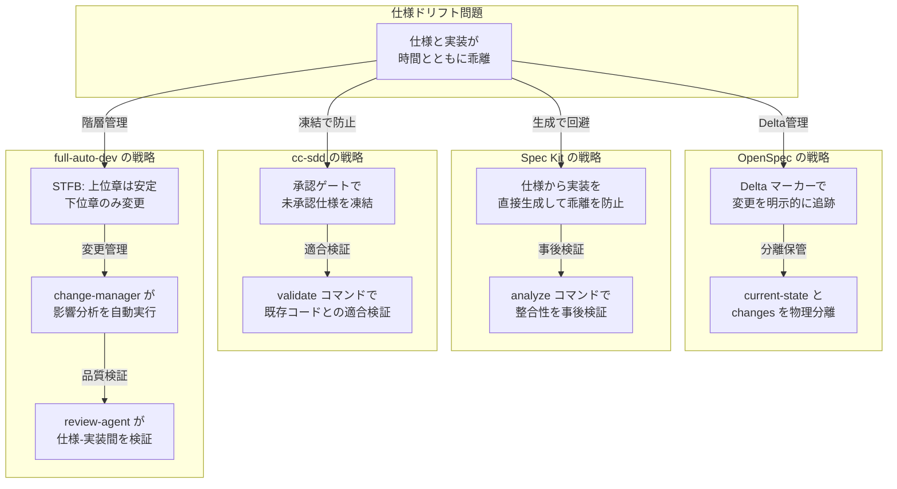

④の STFB アプローチは、仕様書自体の構造に安定性を内蔵する点でユニークである。他の3フレームワークが「仕様と実装の同期」を外部メカニズムで担保するのに対し、④は「変更が上位に波及しにくい構造」を仕様書設計に織り込んでいる。

### 4.2 エージェントモデルの比較

| 観点 | ① OpenSpec | ② Spec Kit | ③ cc-sdd | ④ full-auto-dev |
|------|-----------|-----------|---------|----------------|
| エージェントモデル | 単一エージェント | 単一エージェント | 単一 + サブエージェント | 18エージェント協調 |
| 役割分離 | なし | なし | 基本/サブエージェント | 18役割を明確分離 |
| モデル使い分け | ユーザー任意 | ユーザー任意 | ユーザー任意 | Opus/Sonnet/Haiku 最適配置 |
| エージェント間通信 | N/A | N/A | コマンド経由 | Orch 経由のハブ&スポーク |
| 並列実行 | なし | なし | タスクレベル（P0/P1） | git worktree による分離並列 |
| コスト最適化 | なし | なし | なし | 重要度でモデルランク割当 |

④は唯一、マルチエージェント協調を本格的に実装している。特にモデルの使い分け（Opus は判断、Sonnet は管理、Haiku はチェック）はコスト最適化の観点で実用的価値がある。

### 4.3 文書構造の比較

**文書構造の階層比較:**


④は仕様書を6章構成の階層構造で管理し、Ch1-2（安定層）と Ch3-6（柔軟層）を STFB 原則で分離する。Common Block メタデータが全文書に横断的に付与され、監査可能性を確保する。

### 4.4 プロセス管理の深度比較

| プロセス領域 | ① OpenSpec | ② Spec Kit | ③ cc-sdd | ④ full-auto-dev |
|-------------|-----------|-----------|---------|----------------|
| 要求管理 | 提案ベース | 仕様ベース | EARS 形式 | EARS + Gherkin + STFB |
| 設計管理 | なし | 計画ベース | 設計文書 | Ch3-6 + OpenAPI |
| 変更管理 | archive | 再生成 | なし | change-manager + 影響分析 |
| リスク管理 | なし | なし | なし | risk-manager + リスク台帳 |
| 不具合管理 | なし | なし | なし | defect 票 + IEEE 1044 分類 |
| 進捗管理 | なし | なし | spec-status | progress-monitor + WBS |
| コスト管理 | なし | なし | なし | API トークン消費記録 |
| ライセンス管理 | なし | なし | なし | license-checker |
| セキュリティ管理 | なし | なし | なし | security-reviewer + OWASP |
| 用語管理 | なし | なし | なし | glossary + kotodama-kun |
| 監査記録 | なし | なし | なし | decision 記録 + Footer |
| トレーサビリティ | なし | なし | 要求番号保持 | 要求→設計→テスト完全追跡 |

**この表は④の最大の差別化ポイントを示している。** ①②③は SDD ツール（仕様から実装への変換器）であるのに対し、④は SDD を包含するソフトウェア開発プロセスフレームワークである。

---

## 第5章 ④ gr-sw-maker SWOT 分析

### 5.1 SWOT マトリクス

**SWOT 概要図:**

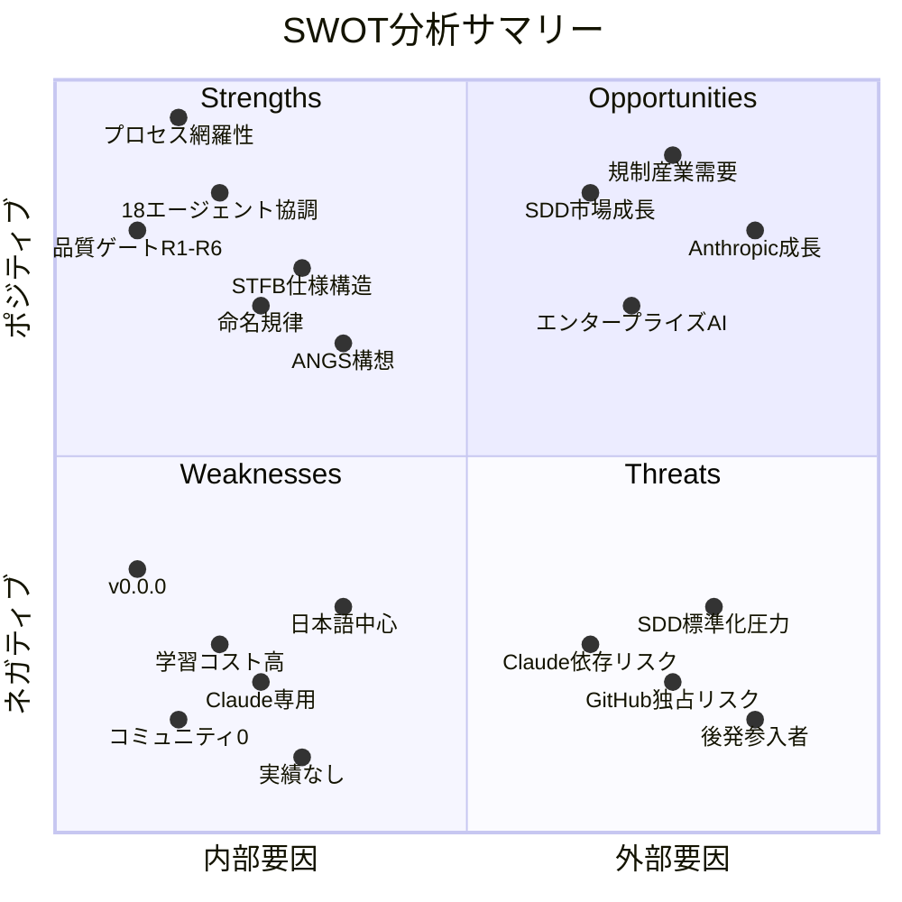

### 5.2 Strengths（強み）— 詳細分析

#### S1: プロセス全体の自動化（唯一無二）

①②③が「仕様→実装」の変換パイプラインに留まるのに対し、④は要求定義から運用までの8フェーズ、12のプロセス領域（変更管理、リスク管理、不具合管理、セキュリティ、ライセンス、用語統制等）をカバーする。これは競合と次元が異なる差別化ポイントであり、容易に模倣できない。

**根拠**: 第4章 3.4節のプロセス管理深度比較で、④のみが全12領域をカバーしている。

#### S2: 18エージェント協調アーキテクチャ

Orch エージェントを中心としたハブ&スポーク型のマルチエージェント協調は、現時点で他の SDD フレームワークには存在しない。さらに Opus/Sonnet/Haiku のモデル使い分けによるコスト最適化は実用的価値がある。

**根拠**: 第4章 4.2節のエージェントモデル比較で、④のみがマルチエージェント協調を実装。

#### S3: R1-R6 品質ゲートの体系性

6観点の品質ゲートは、ソフトウェア工学のベストプラクティスを体系的に反映している。特に R4（並行性）と R5（パフォーマンス）は、AI 生成コードで頻発する問題への対策として実用的である。Critical/High のゼロ許容ポリシーは品質の下限を保証する。

**根拠**: review-standards-ja.md に定義された6観点は、ISO/IEC 25010（ソフトウェア品質特性）の複数の品質副特性に対応。

#### S4: STFB 仕様構造

仕様書の構造自体に安定性を内蔵する STFB 原則は、仕様ドリフト問題に対する構造的解法である。上位章（Foundation, Requirements）の安定性が下位章（Architecture, Specification）の柔軟性を支える設計は、Robert C. Martin の安定依存原則を仕様書に適用した独自のアプローチである。

**根拠**: spec-template-ja.md の Ch1-6 構造が SDP（Stable Dependencies Principle）を体現。

#### S5: 不具合分類体系（IEEE 1044 / IEC 61508）

Error → Fault → Failure → Defect の系譜追跡と、Fault Origin（Requirements/Design/Implementation）の分類は、品質改善のための根本原因分析を可能にする。これは①②③には存在しない機能である。

#### S6: 命名規律と用語統制

「命名は言霊」の思想に基づく用語統制と kotodama-kun エージェントによる自動検証は、長期的なコードベース品質に直結する。AI 生成コードでは命名の一貫性が特に重要であり、この機能は先見的である。

#### S7: 条件付きプロセスによる柔軟性

機能安全、法規調査、i18n 等のプロセスを「必要な場合のみ有効化」する設計は、小規模プロジェクトでのオーバーヘッドを抑制しつつ、規制産業でのスケールアップを可能にする。

### 5.3 Weaknesses（弱み）— 詳細分析

#### W1: コミュニティ不在（Stars: 0）

SDD 市場では、①OpenSpec（30.8K）、②Spec Kit（77K）、③cc-sdd（2.9K）がいずれも数千〜数万のスターを獲得している。④はスター数0であり、認知度・信頼性・フィードバックループの全てが欠如している。OSS プロジェクトにとってコミュニティは最も重要な資産であり、この欠如は最大の弱みである。

**影響**: ユーザーからのバグ報告、機能要望、ユースケース報告が得られず、プロダクトの改善サイクルが回らない。

#### W2: Claude Code 専用（ベンダーロックイン）

④は Claude Code のサブエージェント機能に完全に依存している。①②③が複数の AI エージェントに対応しているのに対し、④は Claude Code でしか動作しない。これは Anthropic の方針変更や価格改定に対する脆弱性を意味する。

**影響**: Claude Code を使用していないチームは④を選択できない。市場の約70%以上を占める非 Claude ユーザーが対象外となる。

#### W3: 学習コストの高さ

9つのプロセスルールブック、18のエージェント定義、32のファイルタイプ、条件付きプロセス評価マトリクスの理解が必要であり、導入の初期コストが極めて高い。①の「openspec init → /opsx:propose」や③の「npx cc-sdd」のようなワンコマンドスタートが存在しない。

**影響**: 「試してみる」のハードルが高く、初期採用が困難。

#### W4: 文書管理規則が Pre-release（v0.0.0）

文書管理規則が PoC 前の v0.0.0 であり、破壊的変更が予告されている。現時点で④を採用したプロジェクトは、v1.0.0 昇格時にマイグレーションコストを負担する可能性がある。

**影響**: 早期採用者にとっての不確実性リスク。

#### W5: 実プロジェクトでの実績なし

理論・設計の充実度は極めて高いが、④を使って実際にソフトウェアを開発・納品した事例が公開されていない。②Spec Kit は .NET/Spring Boot/ASP.NET/Jakarta EE の4つのウォークスルーを公開しており、実証性で大きく差がついている。

**影響**: 「理論は美しいが、本当に動くのか？」という疑問に答えられない。

#### W6: 日本語中心の設計

主要ドキュメントが日本語で記述されており、英語は副次的位置づけである。SDD のグローバル市場で競争するには、英語ファーストが事実上の必須条件である。

**影響**: 国際的な採用を阻害。日本語圏以外のユーザーにはアクセス困難。

#### W7: ANGS が理論段階

3段階仕様形式の最上位である ANGS（GraphDB + Git）は、設計エッセイとして記述されているのみで、実装が存在しない。「スケールパス」の最終到達点が未実装であることは、将来ビジョンの信頼性を損なう。

### 5.4 Opportunities（機会）— 詳細分析

#### O1: SDD 市場の急成長

2026年初頭、SDD は「業界標準になりつつある」（Augment Code調べ）。AI コーディングが普遍化するにつれ、仕様の品質管理は必然的に要求が高まる。市場全体の成長は④にも恩恵をもたらす。

**活用方法**: 「SDD の次」として「プロセス全体の自動化」を打ち出すことで、SDD の上位概念としてのポジションを獲得できる。

#### O2: 規制産業からの需要

医療機器（IEC 62304）、自動車（ISO 26262）、航空宇宙（DO-178C）等の規制産業では、トレーサビリティ・品質ゲート・不具合追跡・監査記録が法的に要求される。④はこれらを標準装備しており、規制産業の AI 開発支援という巨大市場に対して独自の価値提案ができる。

**活用方法**: 規制産業向けの条件付きプロセス（HARA/FMEA/FTA）を実証し、ケーススタディを公開する。

#### O3: Anthropic / Claude Code エコシステムの成長

Claude Code の市場シェアが拡大すれば、④の対象ユーザー母数も増加する。Anthropic が Agent SDK やマルチエージェント機能を強化するほど、④のアーキテクチャは強化される。

**活用方法**: Anthropic のエコシステムパートナーとして early adopter 的ポジションを確立する。

#### O4: エンタープライズ AI 開発の成熟

企業が AI 支援開発を本格採用するにつれ、「速さ」から「品質・統制・監査可能性」へのシフトが起こる。④のプロセス管理能力は、この成熟段階で真価を発揮する。

**活用方法**: エンタープライズ向けの品質管理テンプレートやコンプライアンスパッケージを提供する。

#### O5: 他フレームワークとの統合可能性

④のプロセス管理層（リスク管理、変更管理、品質ゲート等）は、①②③の仕様管理機能と補完関係にある。統合レイヤーとしてのポジショニングが可能である。

### 5.5 Threats（脅威）— 詳細分析

#### T1: GitHub / Microsoft による標準化圧力

②Spec Kit が 77K stars を獲得し、Microsoft Learn にコースが掲載されている状況は、SDD の事実上の標準が GitHub 主導で形成されつつあることを示している。GitHub が品質管理・プロセス管理機能を Spec Kit に追加した場合、④の差別化が侵食される。

**影響度**: 高。GitHub は開発者エコシステムの中心であり、標準化力は圧倒的。

#### T2: 後発参入者の脅威

SDD 市場の成長に伴い、大手クラウドベンダー（AWS Kiro の進化、Google の参入等）がプロセス全体の自動化に踏み込む可能性がある。大手は資本力・ブランド力・既存ユーザーベースで圧倒的優位に立つ。

**影響度**: 中〜高。ただし参入までにはリードタイムがある。

#### T3: Claude Code への依存リスク

Anthropic が Claude Code の価格を大幅に引き上げる、サブエージェント機能の仕様を変更する、あるいはサービスを終了する場合、④は基盤を失う。DIP（依存性逆転原則）を掲げながら、フレームワーク自体が Claude Code に強く結合しているという矛盾がある。

**影響度**: 中。Anthropic は成長期にあり、短期的なリスクは低いが、長期的には無視できない。

#### T4: SDD 概念自体の陳腐化

AI モデルの推論能力が飛躍的に向上し、「仕様を書かなくても高品質なコードを直接生成できる」時代が来る可能性がある。SDD 自体が過渡期の手法であるリスクは、④を含む全フレームワークに共通する。

**影響度**: 低〜中。少なくとも規制産業ではプロセス記録が法的に必要であり、完全な陳腐化は考えにくい。

#### T5: Living Spec パラダイムの台頭

Augment Code の比較記事が指摘するように、「Static Spec は数時間で実装と乖離する」という問題に対して、Intent のような「Living Spec」（仕様と実装の双方向同期）プラットフォームが台頭している。④の STFB は構造的に drift を抑制するが、Living Spec の即時同期には及ばない。

**影響度**: 中。Living Spec はまだ新しく、④の品質ゲートやプロセス管理とは別の問題を解決している。

---

## 第6章 戦略的方策の提案

### 6.1 戦略全体像

**戦略マップ:**

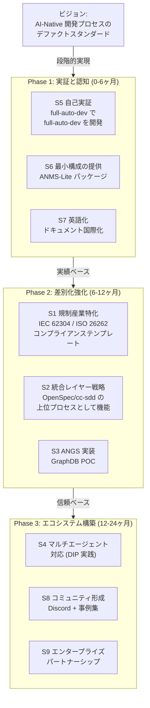

### 6.2 Phase 1: 実証と認知（0-6ヶ月）

#### 方策 S5: 自己実証（Dogfooding）

**提案**: full-auto-dev フレームワーク自身の開発に full-auto-dev を使用し、その過程を詳細に記録・公開する。

**根拠**:
- W5（実績なし）への直接的な回答
- 自己参照的な実証は、フレームワークの信頼性を最も強力に証明する
- 開発過程の記録が、そのまま教育コンテンツとなる
- ②Spec Kit の4つのウォークスルーに相当する実績を生み出せる

**具体的アクション**:
1. user-order.md に「full-auto-dev の次期バージョン開発」をコンセプトとして記述
2. 全フェーズ（setup → operations）を実際に走らせ、pipeline-state.md の遷移を記録
3. 発見された問題点（defect 票）と改善（CR）を project-records/ に蓄積
4. プロセス全体を Zenn 記事シリーズまたは GitHub Discussions で公開

**期待効果**: 「理論だけ」という批判を払拭し、フレームワークの現実的な使用感を示せる

#### 方策 S6: 最小構成の提供（ANMS-Lite）

**提案**: 18エージェント・8フェーズの完全構成とは別に、3エージェント・3フェーズの最小構成パッケージを提供する。

**根拠**:
- W3（学習コスト高）への直接的な回答
- ①OpenSpec の「openspec init」や③cc-sdd の「npx cc-sdd」に相当するワンコマンドスタートが必要
- 最小構成でも④の思想（STFB、品質ゲート、命名規律）を体験できるようにする

**最小構成の定義**:

| エージェント | 役割 | フェーズ |
|-------------|------|---------|
| orchestrator | オーケストレーション | 全フェーズ |
| srs-writer + architect | 仕様・設計 | planning + design |
| implementer + test-engineer | 実装・テスト | implementation + testing |

- review-agent の R1-R3 のみ有効化（R4-R6 は完全構成で追加）
- 条件付きプロセスは全て無効
- 文書は ANMS 単一ファイルのみ

**期待効果**: 導入障壁の劇的な低下。「5分で体験」を実現

#### 方策 S7: 英語化・国際化

**提案**: process-rules/ と .claude/agents/ の英語版を作成し、README.md を英語ファーストに書き換える。

**根拠**:
- W6（日本語中心）への直接的な回答
- ③cc-sdd は13言語に対応しており、④の日本語限定は競争上の致命的不利
- SDD 市場のグローバル議論は英語で行われており、参加するには英語ドキュメントが必須

**具体的アクション**:
1. CLAUDE.md の「言語設定」に従い、主言語ファイルはサフィックスなし、英語版は `-en.md` を付与
2. README.md は英語版を正本とし、日本語版を README-ja.md に移動
3. エージェントプロンプトの英語版を `.claude/agents/` に追加
4. 用語集（glossary）の英語版を作成

**期待効果**: グローバル市場へのアクセス可能性を確保

### 6.3 Phase 2: 差別化強化（6-12ヶ月）

#### 方策 S1: 規制産業特化戦略

**提案**: 医療機器（IEC 62304）、自動車（ISO 26262）等の規制産業向けコンプライアンステンプレートを開発・提供する。

**根拠**:
- S3（R1-R6品質ゲート）、S5（不具合分類体系）、S7（条件付きプロセス）の強みを最大活用
- O2（規制産業需要）を直接的に捕捉
- ①②③のいずれも規制産業対応を持たず、競合不在の領域
- 規制産業では品質管理コストが開発コストの30-50%を占めており、自動化の経済的価値が極めて大きい

**具体的アクション**:
1. IEC 62304 の要求事項を④のプロセスにマッピングし、ギャップ分析を実施
2. 条件付きプロセス（HARA/FMEA/FTA）のテンプレートを実装
3. トレーサビリティマトリクスの自動生成機能を強化
4. 監査対応レポートのテンプレートを追加

**期待効果**: 高付加価値市場でのポジション確立。規制産業の顧客は長期契約傾向が強く、安定した採用基盤となる

#### 方策 S2: 統合レイヤー戦略

**提案**: ④を①②③の「上位プロセス管理層」として位置づけ、他の SDD ツールと共存する戦略を取る。

**根拠**:
- O5（統合可能性）の活用
- T1（GitHub 標準化圧力）への対策 — 競合ではなく補完関係を構築
- ④のプロセス管理能力（リスク管理、変更管理、品質ゲート等）は、①②③の仕様管理機能と直接競合しない

**統合アーキテクチャ構想:**

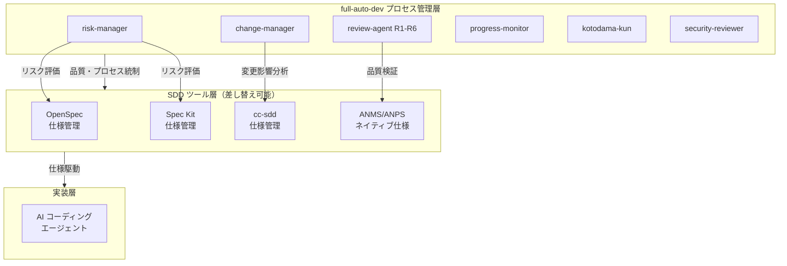

**具体的アクション**:
1. ①②③の仕様出力フォーマットを読み取る adapter を開発
2. review-agent が外部 SDD ツールの成果物も検証できるようにする
3. risk-manager / change-manager が外部仕様の変更を追跡できるようにする

**期待効果**: 「競合」ではなく「上位レイヤー」としてのポジション。②Spec Kit ユーザーが「品質管理を追加したい」と思ったときの選択肢となる

#### 方策 S3: ANGS 実装（GraphDB PoC）

**提案**: ANGS のプロトタイプを実装し、大規模プロジェクトへのスケールパスを実証する。

**根拠**:
- W7（ANGS が理論段階）への直接的な回答
- ANMS → ANPS → ANGS のスケールパスが④の仕様管理の最大の差別化ポイント
- GraphDB による仕様管理は、他のどの SDD フレームワークも持たない革新

**具体的アクション**:
1. 軽量 GraphDB（例: NebulaGraph、Memgraph、または SQLite ベースの独自実装）を選定
2. ANMS の仕様をグラフノードとして取り込む変換器を実装
3. 「仕様ノード間の依存関係を可視化する」ユースケースで PoC を実施
4. Cypher / GQL クエリによる影響分析を実演

**期待効果**: 「スケールパスは本物である」という実証。大規模プロジェクトへの適用可能性を示す

### 6.4 Phase 3: エコシステム構築（12-24ヶ月）

#### 方策 S4: マルチエージェント対応（DIP 実践）

**提案**: Claude Code 専用から脱却し、プロセス管理層を AI エージェント非依存にする。

**根拠**:
- W2（Claude 専用）への直接的な回答
- T3（Claude 依存リスク）への対策
- ④自身が DIP を掲げている以上、フレームワーク自体が特定エージェントに依存するのは思想的矛盾

**アーキテクチャ方針**:

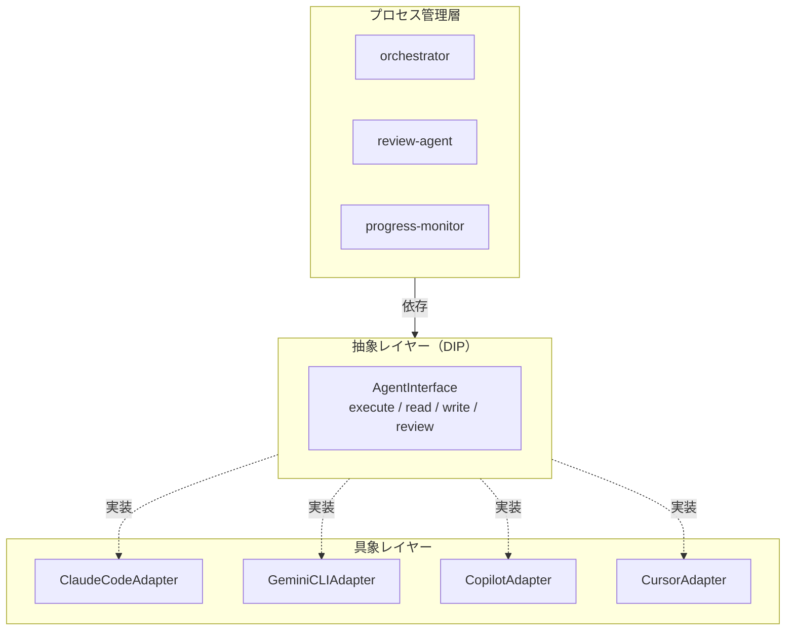

**具体的アクション**:
1. エージェントプロンプトの Claude Code 固有部分を分離
2. AgentInterface（抽象）を定義し、各 AI エージェントの adapter を開発
3. process-rules をエージェント非依存に書き換え
4. 最低2つの追加エージェント（Gemini CLI、GitHub Copilot）への対応を実装

**期待効果**: 市場規模の拡大（Claude ユーザー限定 → 全 AI 開発者）。DIP 思想の体現

#### 方策 S8: コミュニティ形成

**提案**: Discord サーバー、GitHub Discussions、事例集を通じてコミュニティを段階的に構築する。

**根拠**:
- W1（コミュニティ不在）への直接的な回答
- ①OpenSpec は Discord + Slack、②Spec Kit は GitHub Discussions を活用

**具体的アクション**:
1. GitHub Discussions を有効化し、カテゴリ（Q&A, Show & Tell, Ideas）を設置
2. S5（自己実証）の過程を Discussions に逐次投稿し、初期コンテンツを蓄積
3. 規制産業ユーザーが集まるフォーラムやカンファレンスでの発表
4. 日英バイリンガルのコミュニティ運営

**期待効果**: フィードバックループの確立。ユーザー起点の改善サイクル

#### 方策 S9: エンタープライズパートナーシップ

**提案**: 規制産業のシステムインテグレーターやコンサルティングファームとのパートナーシップを構築する。

**根拠**:
- O4（エンタープライズ AI 開発の成熟）の活用
- 規制産業では、ツール単体ではなく「プロセス + ツール + 支援」のパッケージが求められる

**期待効果**: B2B チャネルの確立。個人 OSS プロジェクトから事業体への転換

### 6.5 方策の優先度マトリクス

**優先度マトリクス:**

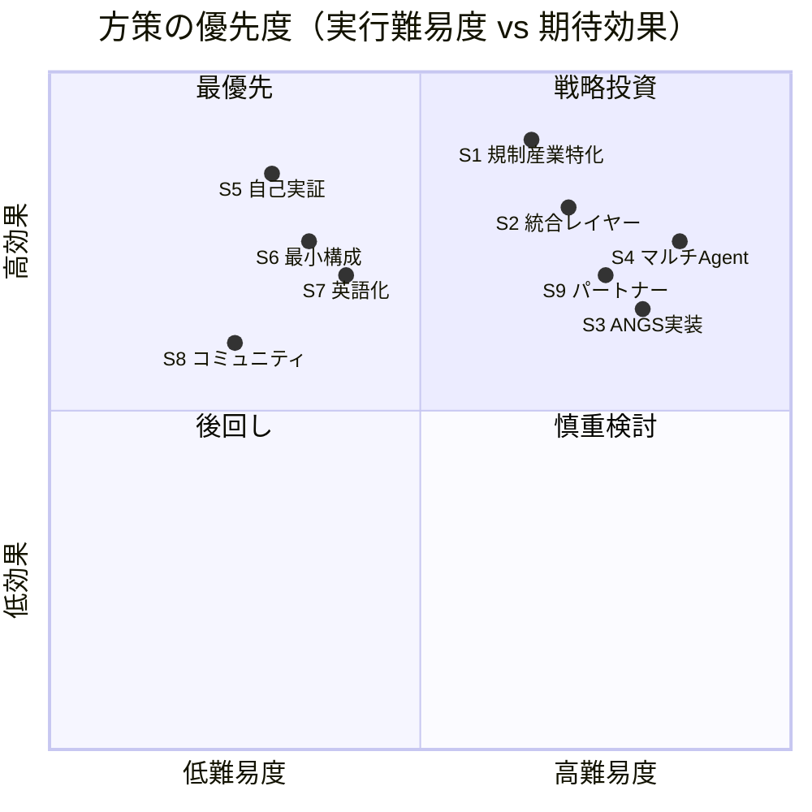

**最優先（Phase 1）**: S5（自己実証）、S6（最小構成）、S7（英語化）— いずれも難易度が比較的低く、効果が高い。W1/W3/W5/W6 の弱みを直接解消する。

**戦略投資（Phase 2）**: S1（規制産業特化）、S2（統合レイヤー）— 難易度は高いが、④の最大の差別化を活かす。競合不在の領域に切り込む。

**慎重検討（Phase 3）**: S3（ANGS 実装）、S4（マルチ Agent）、S9（パートナー）— 長期的価値は高いが、Phase 1-2 の実績なくして着手すべきでない。

---

## 第7章 結論

### 7.1 ④ gr-sw-maker の戦略的位置づけ

④は①②③とは異なるカテゴリのフレームワークである。①②③が「SDD ツール」（仕様から実装への変換パイプライン）であるのに対し、④は「AI-Native 開発プロセスフレームワーク」（要求定義から運用までの全プロセスを AI エージェントで自動化する枠組み）である。

**カテゴリ分類:**

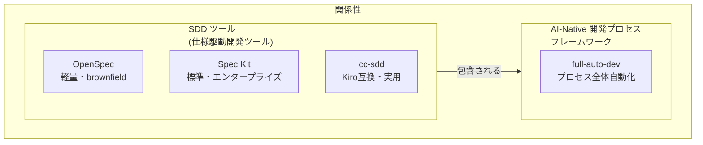

この分類は、④が取るべき戦略の根幹を定義する。④は①②③と同じ土俵で「仕様管理の優劣」を競うべきではない。代わりに、以下のポジションを追求すべきである。

### 7.2 推奨ポジショニング

**「SDD を包含するプロセス自動化層」**

- 仕様管理は①②③に任せてもよい（統合レイヤー戦略）
- ④が提供する価値は、仕様管理の「上」にある品質管理・リスク管理・変更管理・不具合追跡・用語統制・トレーサビリティ
- この層は①②③のいずれも提供しておらず、競合不在

### 7.3 最優先アクション（今すぐ着手すべき3つ）

1. **自己実証（S5）**: full-auto-dev で full-auto-dev の次期バージョンを開発し、過程を公開する
2. **最小構成の提供（S6）**: 3エージェント・3フェーズの ANMS-Lite パッケージを作る
3. **英語化（S7）**: README と主要 process-rules の英語版を作成する

この3つにより、W1（コミュニティ）・W3（学習コスト）・W5（実績）・W6（日本語中心）の4つの弱みに同時に対処できる。

### 7.4 最終評価

| 観点 | 評価 |
|------|------|
| 理論的完成度 | 極めて高い。SW工学のベストプラクティスを AI-Native に再解釈した独自フレームワーク |
| 実用的成熟度 | 低い。実プロジェクトでの実証がなく、v0.0.0 段階 |
| 差別化の持続性 | 高い。プロセス全体の自動化は容易に模倣できない |
| 市場適合性 | 現時点では狭い（Claude 専用・日本語中心）。方策実行により大幅拡大可能 |
| 将来性 | 極めて高い。AI 開発の成熟に伴い、品質・統制の需要は必然的に増大する |

④は「時代の先を行きすぎている」フレームワークである。市場が追いつくまでの間に、実証・認知・エコシステムの基盤を構築できるかが成否を分ける。

---

## 付録 A: 情報源

- OpenSpec: https://github.com/Fission-AI/OpenSpec
- Spec Kit: https://github.com/github/spec-kit
- Spec Kit Blog: https://github.blog/ai-and-ml/generative-ai/spec-driven-development-with-ai-get-started-with-a-new-open-source-toolkit/
- Microsoft Learn Spec Kit: https://learn.microsoft.com/en-us/training/modules/spec-driven-development-github-spec-kit-enterprise-developers/
- cc-sdd: https://github.com/gotalab/cc-sdd
- cc-sdd Deep Wiki: https://deepwiki.com/gotalab/cc-sdd
- Augment Code SDD比較: https://www.augmentcode.com/tools/best-spec-driven-development-tools
- gr-sw-maker: https://github.com/GoodRelax/gr-sw-maker

## 付録 B: 用語集

| 用語 | 定義 |
|------|------|
| SDD | Spec-Driven Development — 仕様駆動開発 |
| STFB | Stable Top, Flexible Bottom — 上位安定・下位柔軟の仕様構造原則 |
| ANMS | AI-Native Minimal Spec — 単一 Markdown による最小仕様形式 |
| ANPS | AI-Native Plural Spec — 複数 Markdown + Common Block による仕様形式 |
| ANGS | AI-Native Graph Spec — GraphDB + Git による大規模仕様形式 |
| EARS | Easy Approach to Requirements Syntax — 要求記述の標準書式 |
| DIP | Dependency Inversion Principle — 依存性逆転原則 |
| Living Spec | 仕様と実装が双方向に自動同期する仕様形態 |
| Static Spec | 手動更新が必要な仕様形態 |
| Semi-living Spec | Delta マーカー等で変更を追跡するが自動同期はしない仕様形態 |
| Brownfield | 既存コードベースへの機能追加・改修 |
| Greenfield | ゼロからの新規開発 |
``````
